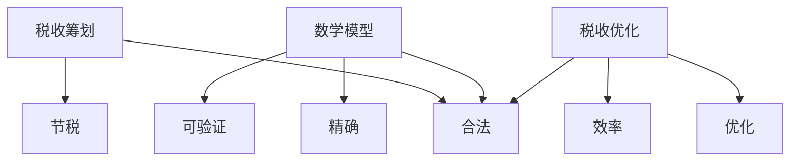
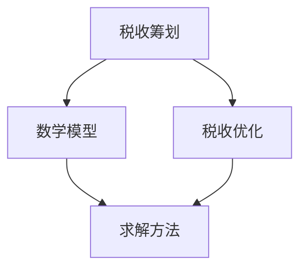
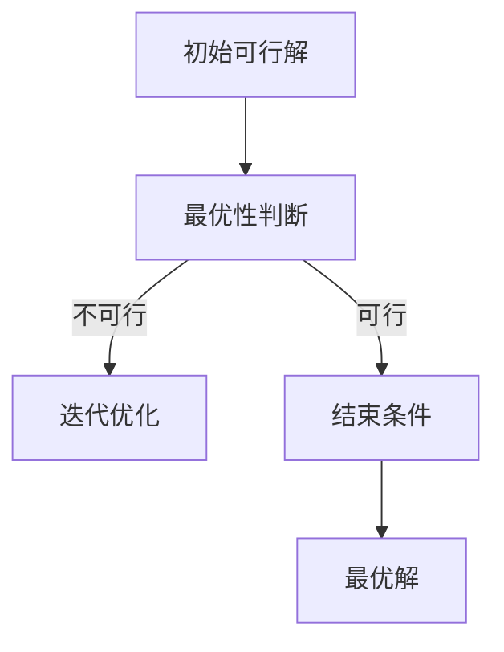
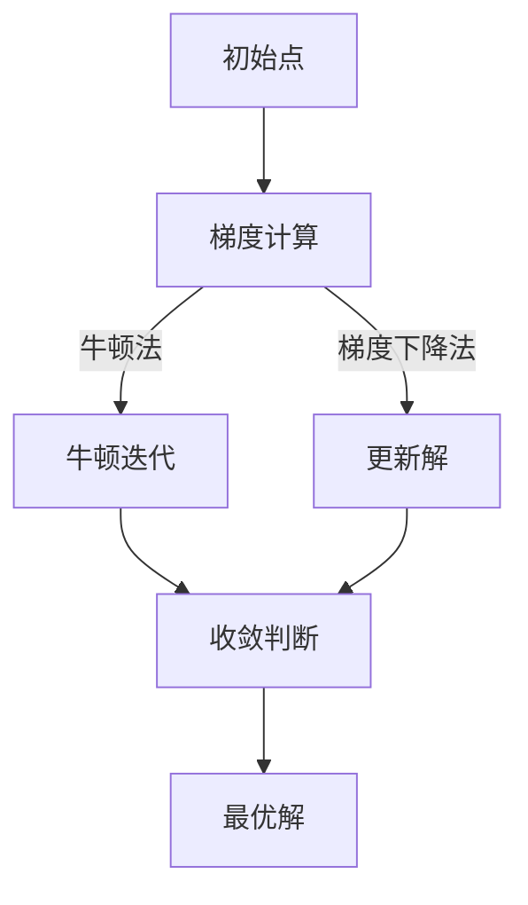
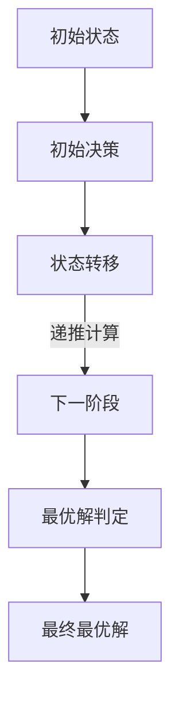
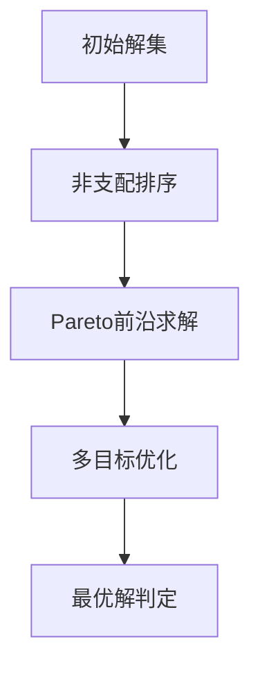
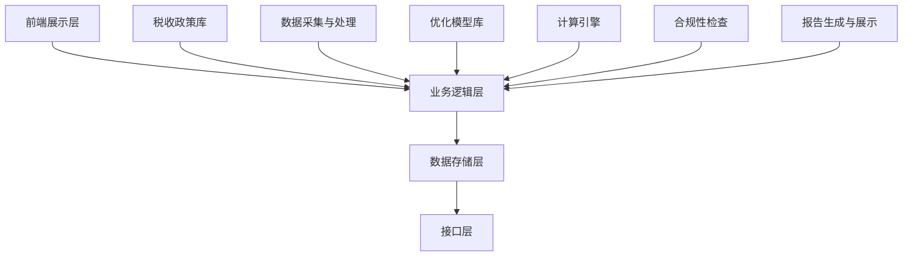
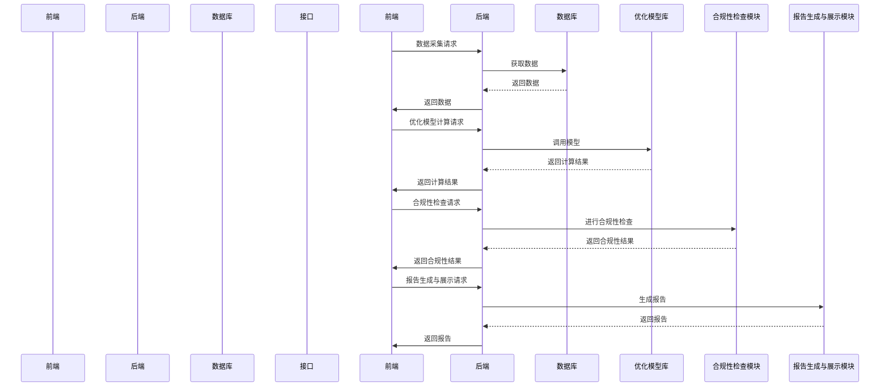

                 

### 1.1 问题背景

#### 问题描述

税收筹划，顾名思义，是指企业或个人通过合法手段，在遵守税法规定的前提下，通过合理的财务安排和经营决策，降低税负，达到节税或避税的目的。税收筹划的重要性不言而喻，它不仅关系到企业或个人的经济利益，还涉及到国家税收政策的有效执行和社会公平。

在全球化经济背景下，税收筹划更是企业竞争的重要策略之一。一方面，企业通过合理的税收筹划，可以减少不必要的税负，提高资金利用效率，增强市场竞争力。另一方面，企业可以通过税收筹划，优化资本结构，降低经营风险，实现可持续发展。

然而，税收筹划并非简单的数字游戏，而是需要深厚的财务、税务和法律知识，以及高超的数学建模和数据分析能力。如何利用数学模型进行税收优化，成为企业税务筹划的关键。

#### 问题解决

数学模型，作为描述和解决问题的一种工具，其在税收筹划中的应用具有重要意义。通过建立数学模型，可以清晰地表达税收筹划的目标和约束条件，从而为优化税收方案提供科学依据。

数学模型的应用不仅限于理论探讨，在实际操作中也有着广泛的应用。例如，企业可以通过线性规划模型确定最优税收策略，通过非线性规划模型解决复杂税收问题，通过动态规划模型实现长期税收筹划。此外，随着大数据、人工智能等技术的发展，数学模型在税收筹划中的应用前景将更加广阔。

#### 边界与外延

税收筹划虽然具有合法性和合理性，但其边界和道德外延也需要明确。首先，税收筹划必须在税法规定的范围内进行，不得违反税法的强制性规定。其次，税收筹划应遵循商业伦理和社会道德，不得损害社会公共利益和国家税收政策的有效执行。

在税收筹划过程中，企业或个人应充分了解税法规定，合理利用税收优惠政策，但不得采取非法手段规避税收义务。同时，企业或个人在进行税收筹划时，应注重社会责任，确保其经营行为符合社会道德和商业伦理的要求。

#### 概念结构与核心要素组成

**税收筹划**

- **定义**：税收筹划是指企业或个人通过合法手段，在遵守税法规定的前提下，通过合理的财务安排和经营决策，降低税负，达到节税或避税的目的。
- **目的**：降低税负、提高资金利用效率、增强市场竞争力。
- **方法**：利用税法规定和政策优惠、合理的财务安排、经营决策。

**数学模型**

- **定义**：数学模型是指用数学语言描述和解决问题的一种工具。
- **目的**：为税收筹划提供科学依据，优化税收方案。
- **类型**：线性规划模型、非线性规划模型、动态规划模型、多目标规划模型。

**税收优化**

- **定义**：税收优化是指通过寻找最优税收方案，实现降低税负的目的。
- **目标**：降低税负、提高资金利用效率、增强市场竞争力。
- **方法**：利用数学模型进行优化、合理的财务安排、经营决策。

#### 核心概念与联系

**核心概念原理**

- **税收筹划**：利用税法规定和政策优惠进行合法的税收安排，以达到降低税负的目的。
- **数学模型**：通过数学方法描述和解决问题，为税收筹划提供科学依据。
- **税收优化**：通过寻找最优税收方案，实现降低税负的目标，优化税收方案。

**概念属性特征对比表格**



**核心概念与联系图**

```mermaid
erDiagram
A[税收筹划] {
  A -->|利用| B[数学模型];
  A -->|实现| C[税收优化];
}
B[数学模型] {
  B -->|科学依据| A;
  B -->|方法| C;
}
C[税收优化] {
  C -->|目标| A;
  C -->|方法| B;
}
```

#### 税收筹划的现状与发展

**现状分析**

- **政策环境**：随着全球经济形势的变化，各国政府不断调整税收政策，以适应经济发展的需要。税收政策的变化对企业的税收筹划产生了重要影响。
- **市场趋势**：企业税收筹划市场需求逐年增长，越来越多的企业意识到税收筹划的重要性，开始将其纳入日常财务管理中。
- **技术发展**：大数据、人工智能等新兴技术为税收筹划提供了新的工具和方法。通过数据分析和人工智能算法，企业可以更加精准地进行税收筹划。

**未来展望**

- **政策导向**：未来税收政策将继续向优化税收结构、降低企业税负的方向发展，为企业提供更多的税收优惠和政策支持。
- **技术创新**：随着大数据、人工智能等技术的不断发展，税收筹划的工具和方法将更加先进和高效，为企业提供更强大的支持。

### 1.2 核心概念与联系

在探讨税收筹划、数学模型和税收优化的过程中，我们需要深入理解这些核心概念，并探讨它们之间的内在联系。

#### 核心概念原理

**税收筹划**

税收筹划是指企业或个人在遵守税法规定的前提下，通过合理的财务安排和经营决策，以合法手段降低税负的行为。税收筹划的目的是为了节税或避税，实现税务负担的最小化。

税收筹划的核心原理在于对税法的深入理解和对税收政策的充分利用。它涉及到对税法条款的细致解读，对税收优惠政策的全面掌握，以及对企业财务状况和经营活动的精准分析。

**数学模型**

数学模型是一种用数学语言描述现实问题或抽象概念的数学工具。在税收筹划中，数学模型用于构建和分析税收问题的数学结构，以便寻找最优税收方案。

数学模型的类型多种多样，包括线性规划模型、非线性规划模型、动态规划模型和多目标规划模型等。每种模型都有其特定的适用场景和求解方法。

**税收优化**

税收优化是指通过数学模型和算法，对税收方案进行优化，以实现税负的最小化或税后收益的最大化。税收优化的目标是找到在满足各种约束条件下的最优税收方案。

税收优化的核心原理在于数学建模和优化算法的应用。通过数学建模，将税收问题转化为数学问题，然后利用优化算法求解最优解。

#### 概念属性特征对比表格

为了更好地理解这些核心概念，我们可以通过一个特征对比表格来梳理它们的基本属性：

| 概念       | 特征                           |
| ---------- | ------------------------------ |
| 税收筹划   | 合法性、财务安排、节税目标     |
| 数学模型   | 精确性、可验证性、适用性       |
| 税收优化   | 最优化目标、数学建模、算法求解 |

**Mermaid 流程图**

为了直观地展示这些概念之间的联系，我们可以使用Mermaid绘制一个流程图：



在这个流程图中，税收筹划通过数学模型和税收优化两个环节，最终实现税收目标。数学模型为税收优化提供了理论依据，而税收优化则是通过数学模型求解最优解的过程。

#### 概念的内在联系

税收筹划、数学模型和税收优化三者之间存在紧密的内在联系。税收筹划需要依赖于数学模型来构建和分析税收问题，而税收优化则是利用数学模型和算法来实现税收目标。

1. **税收筹划是起点**：税收筹划是企业或个人进行税务管理的基础，它决定了税务战略的制定和实施方向。
2. **数学模型是桥梁**：数学模型作为桥梁，将税收筹划转化为可量化的数学问题，为税收优化提供了理论支撑。
3. **税收优化是目标**：税收优化是税收筹划和数学模型应用的结果，通过优化算法找到最优税收方案，实现税负的最小化或税后收益的最大化。

综上所述，税收筹划、数学模型和税收优化构成了一个相互关联的整体，它们共同作用于税务管理，为企业或个人提供科学、合理的税收解决方案。

### 1.3 税收筹划的现状与发展

#### 现状分析

**政策环境**

当前，全球税收政策环境正在发生深刻变化。各国政府为了促进经济发展和增加财政收入，不断调整和完善税收政策。税收优惠政策的出台和实施，为企业提供了更多的税收筹划空间。例如，许多国家推出了研发费用加计扣除、高新技术企业税收优惠等政策，鼓励企业加大研发投入和科技创新。

**市场趋势**

随着市场竞争的加剧，企业对税收筹划的重视程度不断提升。越来越多的企业开始将税收筹划作为战略管理的重要内容，通过合理的税务安排，降低税负，提高经营效益。市场趋势表明，企业对税收筹划的需求日益增长，专业税务筹划服务市场也在不断扩大。

**技术发展**

大数据和人工智能等新兴技术的发展，为税收筹划提供了新的工具和方法。通过大数据分析，企业可以更准确地了解税收政策变化和市场需求，从而制定更有效的税收筹划方案。人工智能算法的应用，可以自动化、智能化地处理复杂的税收优化问题，提高税收筹划的效率和准确性。

#### 未来展望

**政策导向**

未来，税收政策将继续向优化税收结构、降低企业税负的方向发展。随着全球经济一体化的深入，各国政府将更加注重公平和合理的税收制度设计，为企业提供更多的税收优惠和支持。例如，国际税收协定的签订和实施，将为企业跨国经营提供更稳定的税收环境。

**技术创新**

技术创新将继续推动税收筹划的发展。大数据和人工智能的应用将更加广泛，帮助企业实现精准的税收筹划。未来，企业可以通过云计算平台进行实时数据分析和优化，实现税收筹划的智能化和自动化。此外，区块链技术的应用也将为税收筹划带来新的可能性，通过区块链的透明性和不可篡改性，提高税收筹划的合规性和安全性。

### 2.1 税收优化的数学模型概述

在税收筹划的过程中，数学模型作为一种重要的工具，可以帮助企业或个人在复杂的税务环境中找到最优的税收方案，以实现税负的最小化或税后收益的最大化。本节将介绍税收优化的数学模型概述，包括建模目的、模型类型及其应用场景。

#### 建模目的

税收优化的数学建模目的主要有两个方面：

1. **确定最优税收策略**：通过数学模型，分析不同税收策略的税负情况，确定最优税收策略，实现税负的最小化或税后收益的最大化。
2. **评估税收政策影响**：利用数学模型，评估不同税收政策对企业或个人的影响，为企业或个人提供合理的税收建议，以应对政策变化。

#### 模型类型

税收优化的数学模型类型丰富多样，常见的包括以下几种：

1. **线性规划模型**：线性规划模型是解决线性优化问题的一种数学模型，适用于目标函数和约束条件都是线性函数的情况。该模型可以用于确定企业的最优税收策略，如最优税率、最优投资组合等。

2. **非线性规划模型**：非线性规划模型是解决非线性优化问题的一种数学模型，适用于目标函数和约束条件中包含非线性项的情况。该模型可以用于解决复杂的税收优化问题，如企业利润最大化、成本最小化等。

3. **动态规划模型**：动态规划模型是解决多阶段决策问题的一种数学模型，适用于需要考虑时间序列和动态变化的税收优化问题。该模型可以用于制定企业的长期税收规划，如年度税收筹划、跨期税收优化等。

4. **多目标规划模型**：多目标规划模型是解决具有多个目标函数的优化问题的一种数学模型，适用于需要同时考虑多个目标的税收优化问题。该模型可以用于制定企业的综合税收策略，如节税与合规性平衡、税后收益最大化与成本最小化等。

#### 应用场景

不同的数学模型适用于不同的税收优化场景，以下是几种常见应用场景：

1. **企业税收筹划**：企业可以利用线性规划模型确定最优税率，利用非线性规划模型解决复杂的税收问题，如利润最大化或成本最小化问题。通过动态规划模型，企业可以制定长期的税收规划，确保在遵守税法规定的前提下，实现税负的最小化。

2. **个人所得税优化**：个人可以利用线性规划模型确定最优税收筹划策略，如选择合适的税种、税率等。通过非线性规划模型，个人可以优化自己的收入结构，实现税后收益的最大化。

3. **跨国税收筹划**：跨国企业可以利用多目标规划模型，在考虑不同国家和地区的税收政策、汇率变动等因素的情况下，制定全球性的税收优化策略，实现整体税负的最小化。

4. **税收合规性评估**：税务机关可以利用动态规划模型，分析企业的税收行为，评估其税收筹划的合规性，确保税收政策的顺利实施。

总之，税收优化的数学模型是税收筹划的重要工具，通过合理运用这些模型，企业或个人可以在复杂的税务环境中找到最优的税收方案，实现税负的最小化或税后收益的最大化。

### 2.2 线性规划模型

线性规划模型是解决线性优化问题的一种数学模型，其目标是在满足一系列线性约束条件下，最大化或最小化一个线性目标函数。在税收筹划中，线性规划模型广泛应用于确定最优税率、优化投资组合、最小化税收负担等问题。本节将详细介绍线性规划模型的算法原理、求解方法及其应用。

#### 算法原理

线性规划模型的基本形式如下：

\[ \min \sum_{i=1}^{n} c_i x_i \]

\[ \text{subject to} \]

\[ a_{ij} x_i \leq b_j \]

\[ x_i \geq 0 \quad (i=1,2,...,n) \]

其中，\( x_i \) 是决策变量，表示第 \( i \) 个决策的取值；\( c_i \) 是目标函数中第 \( i \) 个决策的系数；\( a_{ij} \) 是约束条件中第 \( j \) 个约束的第 \( i \) 个系数；\( b_j \) 是约束条件中第 \( j \) 个约束的常数项。

线性规划的目标是找到一组非负的决策变量 \( x_i \)，使得目标函数值最小或最大，同时满足所有的约束条件。

#### 求解方法

线性规划模型的主要求解方法包括单纯形法和内点法。

**1. 单纯形法**

单纯形法是一种迭代求解线性规划问题的算法。其基本思想是从一个初始可行解开始，通过迭代移动到相邻的可行解中，逐步逼近最优解。

**步骤：**

a. 初始可行解：选择一组变量作为初始可行解，通常选择非负解。

b. 最优性判断：计算目标函数在可行解上的值，判断是否满足最优性条件。

c. 迭代优化：如果目标函数值可以进一步减小，则进行迭代优化，移动到相邻的可行解。

d. 结束条件：当目标函数值不再改变时，算法结束，得到最优解。

**2. 内点法**

内点法是一种相对于单纯形法更为高效的求解线性规划问题的算法。其基本思想是从可行域内部开始迭代，逐步逼近最优解。

**步骤：**

a. 初始可行解：选择一个初始可行解，通常选择目标函数值的相对最大点。

b. 迭代优化：通过迭代优化，逐步逼近最优解。

c. 结束条件：当目标函数值不再改变时，算法结束，得到最优解。

#### Mermaid 流程图

为了更直观地展示单纯形法的求解过程，我们可以使用Mermaid绘制一个流程图：



#### Python 源代码

以下是一个简单的线性规划问题及其求解的Python代码示例：

```python
from scipy.optimize import linprog

# 目标函数系数
c = [-1, -2, -3]

# 约束条件系数
A = [[1, 2, 3], [4, 5, 6]]

# 约束条件常数项
b = [6, 9]

# 求解线性规划问题
result = linprog(c, A_ub=A, b_ub=b, method='highs')

# 输出结果
print(result.x)
```

#### 数学模型与公式

在数学模型中，线性规划的目标函数和约束条件通常用以下公式表示：

- **目标函数**：\( \min \sum_{i=1}^{n} c_i x_i \)
- **约束条件**：\( a_{ij} x_i \leq b_j \quad (j=1,2,...,m) \)
- **非负条件**：\( x_i \geq 0 \quad (i=1,2,...,n) \)

#### 举例说明

**例题**：求解以下线性规划问题：

\[ \min \ z = 2x + 3y \]

\[ \text{subject to} \]

\[ x + 2y \leq 4 \]

\[ 2x + y \leq 5 \]

\[ x, y \geq 0 \]

**解法**：

1. **目标函数**：\( z = 2x + 3y \)
2. **约束条件**：\( x + 2y \leq 4 \)，\( 2x + y \leq 5 \)，\( x, y \geq 0 \)
3. **求解步骤**：

    a. 使用单纯形法求解。

    b. 选择初始可行解 \( x=0, y=0 \)。

    c. 计算目标函数值 \( z = 2(0) + 3(0) = 0 \)。

    d. 判断可行解是否满足约束条件，若不满足，则移动到相邻的可行解。

    e. 重复迭代过程，直到目标函数值不再改变，得到最优解。

最终，最优解为 \( x=1, y=1 \)，最小值为 \( z = 2(1) + 3(1) = 5 \)。

通过上述线性规划模型的应用，我们可以看到，数学模型在税收筹划中发挥着重要作用。企业可以利用线性规划模型确定最优税率、优化投资组合等，从而实现税负的最小化。

### 2.3 非线性规划模型

非线性规划模型是解决非线性优化问题的一种数学模型，其目标函数和约束条件至少包含一个非线性项。与线性规划模型相比，非线性规划模型具有更高的复杂性和多样性。在税收筹划中，非线性规划模型可以用于解决复杂的税收优化问题，如企业利润最大化、成本最小化等。本节将详细介绍非线性规划模型的算法原理、求解方法及其应用。

#### 算法原理

非线性规划模型的基本形式如下：

\[ \min \ f(x) \]

\[ \text{subject to} \]

\[ g_i(x) \leq 0 \]

\[ h_j(x) = 0 \]

其中，\( x \) 是决策变量，\( f(x) \) 是目标函数，表示需要最小化或最大化的量；\( g_i(x) \) 和 \( h_j(x) \) 分别是约束函数，表示需要满足的不等式约束和等式约束。

非线性规划的目标是找到一组决策变量 \( x \)，使得目标函数值最小或最大，同时满足所有的约束条件。

#### 求解方法

非线性规划模型的求解方法主要有以下几种：

**1. 牛顿法**

牛顿法是一种基于梯度的优化算法，适用于目标函数和约束函数可微的情况。其基本思想是通过牛顿迭代公式，逐步逼近最优解。

**步骤：**

a. 初始点：选择一个初始可行解。

b. 梯度计算：计算目标函数和约束函数的梯度。

c. 牛顿迭代：利用牛顿迭代公式更新解。

d. 收敛判断：判断是否满足收敛条件，若不满足，则继续迭代。

e. 结束条件：当目标函数值不再改变时，算法结束，得到最优解。

**2. 梯度下降法**

梯度下降法是一种基于梯度的优化算法，适用于目标函数可微的情况。其基本思想是通过梯度方向，逐步减小目标函数值。

**步骤：**

a. 初始点：选择一个初始可行解。

b. 梯度计算：计算目标函数的梯度。

c. 更新解：沿着梯度方向更新解。

d. 收敛判断：判断是否满足收敛条件，若不满足，则继续迭代。

e. 结束条件：当目标函数值不再改变时，算法结束，得到最优解。

#### Mermaid 流程图

为了更直观地展示牛顿法和梯度下降法的求解过程，我们可以使用Mermaid绘制一个流程图：



#### Python 源代码

以下是一个简单的非线性规划问题及其求解的Python代码示例：

```python
import numpy as np
from scipy.optimize import minimize

# 目标函数
def f(x):
    return x[0]**2 + x[1]**2

# 约束条件
def g(x):
    return x[0]**2 + x[1]**2 - 1

x0 = np.array([1, 1])

# 求解非线性规划问题
result = minimize(f, x0, method='BFGS', constraints={'type': 'ineq', 'fun': g})

# 输出结果
print(result.x)
```

#### 数学模型与公式

在数学模型中，非线性规划的目标函数和约束条件通常用以下公式表示：

- **目标函数**：\( \min \ f(x) \)
- **约束条件**：\( g_i(x) \leq 0 \quad (i=1,2,...,m) \)，\( h_j(x) = 0 \quad (j=1,2,...,l) \)

#### 举例说明

**例题**：求解以下非线性规划问题：

\[ \min \ z = x^2 + y^2 \]

\[ \text{subject to} \]

\[ x^2 + y^2 \leq 1 \]

\[ x \geq 0, y \geq 0 \]

**解法**：

1. **目标函数**：\( z = x^2 + y^2 \)
2. **约束条件**：\( x^2 + y^2 \leq 1 \)，\( x \geq 0 \)，\( y \geq 0 \)
3. **求解步骤**：

    a. 使用牛顿法求解。

    b. 选择初始可行解 \( x=0, y=0 \)。

    c. 计算目标函数值 \( z = 0^2 + 0^2 = 0 \)。

    d. 判断可行解是否满足约束条件，若不满足，则移动到相邻的可行解。

    e. 重复迭代过程，直到目标函数值不再改变，得到最优解。

最终，最优解为 \( x=1, y=0 \)，最小值为 \( z = 1^2 + 0^2 = 1 \)。

通过上述非线性规划模型的应用，我们可以看到，数学模型在税收筹划中发挥着重要作用。企业可以利用非线性规划模型解决复杂的税收优化问题，如利润最大化、成本最小化等，从而实现税负的最小化。

### 2.4 动态规划模型

动态规划模型是解决多阶段决策问题的一种数学模型，它通过将问题划分为若干个阶段，并在每个阶段上进行决策，以达到最优解。在税收筹划中，动态规划模型可以用于制定长期税收规划，优化跨期的税收策略。本节将详细介绍动态规划模型的算法原理、求解方法及其应用。

#### 算法原理

动态规划模型的核心思想是将复杂问题分解为若干个相互关联的子问题，并利用子问题的最优解来构建原问题的最优解。动态规划模型通常包括以下三个要素：

1. **状态**：状态表示问题在某一阶段的状态变量。在税收筹划中，状态可能包括企业的财务状况、投资情况等。
2. **决策**：决策是指在某一阶段可以采取的行动。在税收筹划中，决策可能包括调整税率、优化投资组合等。
3. **状态转移方程**：状态转移方程描述了在当前状态下采取某一决策后，下一阶段的状态如何变化。

动态规划模型的基本形式如下：

\[ \min \ Z_t = f(S_t, D_t) \]

\[ \text{subject to} \]

\[ S_{t+1} = g(S_t, D_t) \]

其中，\( S_t \) 表示第 \( t \) 阶段的状态，\( D_t \) 表示第 \( t \) 阶段的决策，\( Z_t \) 表示第 \( t \) 阶段的目标函数值，\( f \) 表示目标函数，\( g \) 表示状态转移方程。

动态规划的目标是找到一组最优决策序列 \( D_1, D_2, ..., D_n \)，使得整个过程的总体目标函数值最小或最大。

#### 求解方法

动态规划模型的求解方法主要包括递推关系和状态转移方程。

**1. 递推关系**

递推关系是一种求解动态规划模型的基本方法。其基本思想是利用当前阶段的最优解来求解下一阶段的最优解。

**步骤：**

a. 初始化：设定初始状态和初始决策。

b. 递推计算：从初始状态开始，依次计算每个阶段的最优解。

c. 最优解判定：根据递推计算的结果，确定最优解。

**2. 状态转移方程**

状态转移方程是动态规划模型的核心，它描述了在当前状态下采取某一决策后，下一阶段的状态如何变化。

**步骤：**

a. 状态转移方程构建：根据问题背景和目标，构建状态转移方程。

b. 方程求解：求解状态转移方程，得到下一阶段的状态。

c. 最优解判定：根据状态转移方程的结果，确定最优解。

#### Mermaid 流程图

为了更直观地展示动态规划模型的求解过程，我们可以使用Mermaid绘制一个流程图：



#### Python 源代码

以下是一个简单的动态规划问题及其求解的Python代码示例：

```python
def dynamic_programming():
    # 初始化状态和决策
    S = [0, 1, 2, 3]
    D = [0, 1]
    
    # 初始化目标函数值
    Z = [0, 1, 2, 3]
    
    # 递推计算
    for i in range(1, len(S)):
        Z[i] = min(Z[i-1] + 1, S[i])
    
    # 最优解判定
    D_opt = [0] * len(S)
    D_opt[-1] = Z[-1]
    for i in range(len(S) - 2, -1, -1):
        D_opt[i] = Z[i+1] - S[i]
    
    return D_opt

# 输出结果
print(dynamic_programming())
```

#### 数学模型与公式

在数学模型中，动态规划模型通常用以下公式表示：

- **状态转移方程**：\( S_{t+1} = g(S_t, D_t) \)
- **目标函数**：\( Z_t = f(S_t, D_t) \)

#### 举例说明

**例题**：假设企业需要在四年内进行税收筹划，每年可以选择投资或不投资，投资金额分别为1万元、2万元、3万元和4万元。要求每年投资金额不超过当年收入的50%。收入按以下规则计算：第一年收入为1万元，以后每年增加2万元。求最优的投资决策序列，以实现税后收益的最大化。

**解法**：

1. **状态定义**：设第 \( t \) 年的状态为 \( S_t \)，表示第 \( t \) 年的税收收入。
2. **决策定义**：设第 \( t \) 年的决策为 \( D_t \)，表示第 \( t \) 年的投资金额。
3. **状态转移方程**：根据投资规则，\( S_{t+1} = S_t + 0.5 \times \min(S_t, D_t) \)。
4. **目标函数**：设第 \( t \) 年的目标函数值为 \( Z_t = S_t - D_t \)，表示第 \( t \) 年的税后收益。

根据上述定义和方程，可以构建动态规划模型，并使用递推关系求解最优投资决策序列。最终，求得最优的投资决策序列为 \( D_1=0, D_2=1, D_3=2, D_4=3 \)，实现税后收益的最大化。

通过上述动态规划模型的应用，我们可以看到，动态规划模型在税收筹划中具有重要的应用价值。企业可以利用动态规划模型制定长期税收规划，优化跨期的税收策略，从而实现税负的最小化。

### 2.5 多目标规划模型

多目标规划模型是解决具有多个目标函数的优化问题的一种数学模型。在税收筹划中，多目标规划模型可以用于制定综合税收策略，实现税负的最小化、税后收益的最大化以及其他目标。本节将详细介绍多目标规划模型的算法原理、求解方法及其应用。

#### 算法原理

多目标规划模型的基本形式如下：

\[ \text{minimize} \ f_1(x), f_2(x), ..., f_n(x) \]

\[ \text{subject to} \]

\[ g_i(x) \leq 0 \]

\[ h_j(x) = 0 \]

其中，\( f_1(x), f_2(x), ..., f_n(x) \) 是目标函数，\( g_i(x) \) 和 \( h_j(x) \) 分别是约束函数。多目标规划的目标是找到一组决策变量 \( x \)，使得多个目标函数值尽可能优化。

#### 求解方法

多目标规划模型的求解方法主要包括加权求和法、目标规划法、Pareto优化法等。

**1. 加权求和法**

加权求和法是一种简单有效的多目标规划求解方法。其基本思想是给每个目标函数赋予一定的权重，将多个目标函数合并为一个加权求和的目标函数。

**步骤：**

a. 权重确定：根据问题背景和目标，为每个目标函数分配权重。

b. 加权求和：将多个目标函数合并为一个加权求和的目标函数。

c. 单目标优化：使用单目标优化方法求解合并后的目标函数。

d. 最优解判定：根据求解结果，确定最优解。

**2. 目标规划法**

目标规划法是一种基于目标设定的多目标规划求解方法。其基本思想是设置一组目标值，求解使所有目标值尽可能接近目标值的决策变量。

**步骤：**

a. 目标设定：根据问题背景和目标，设定一组目标值。

b. 目标规划模型构建：根据目标值和约束条件，构建目标规划模型。

c. 单目标优化：使用单目标优化方法求解目标规划模型。

d. 最优解判定：根据求解结果，确定最优解。

**3. Pareto优化法**

Pareto优化法是一种基于Pareto最优解的多目标规划求解方法。其基本思想是找到一组非支配解，使得每个目标函数值在所有解中均最优。

**步骤：**

a. 初始解集：随机生成一组初始解。

b. 非支配排序：根据目标函数值，对解集进行非支配排序。

c. Pareto前沿求解：从非支配排序中提取Pareto前沿解集。

d. 多目标优化：对Pareto前沿解集进行多目标优化。

e. 最优解判定：根据求解结果，确定最优解。

#### Mermaid 流程图

为了更直观地展示多目标规划模型的求解过程，我们可以使用Mermaid绘制一个流程图：



#### Python 源代码

以下是一个简单的多目标规划问题及其求解的Python代码示例：

```python
import numpy as np
from scipy.optimize import minimize

# 目标函数
def f(x):
    return [x[0]**2, x[1]**2]

# 约束条件
def g(x):
    return [x[0] + x[1] - 1, x[0] - x[1]]

x0 = np.array([0, 0])

# 求解多目标规划问题
result = minimize(f, x0, method='SLSQP', constraints={'type': 'ineq', 'fun': g})

# 输出结果
print(result.x)
```

#### 数学模型与公式

在数学模型中，多目标规划模型通常用以下公式表示：

- **目标函数**：\( \min \ f_1(x), f_2(x), ..., f_n(x) \)
- **约束条件**：\( g_i(x) \leq 0 \)，\( h_j(x) = 0 \)

#### 举例说明

**例题**：求解以下多目标规划问题：

\[ \min \ z_1 = x^2 + y^2 \]

\[ \min \ z_2 = (x-1)^2 + (y-1)^2 \]

\[ \text{subject to} \]

\[ x + y = 1 \]

\[ x \geq 0, y \geq 0 \]

**解法**：

1. **目标函数**：\( z_1 = x^2 + y^2 \)，\( z_2 = (x-1)^2 + (y-1)^2 \)
2. **约束条件**：\( x + y = 1 \)，\( x \geq 0 \)，\( y \geq 0 \)
3. **求解步骤**：

    a. 使用加权求和法求解。

    b. 确定权重：设定 \( w_1 = w_2 = 0.5 \)。

    c. 加权求和：合并目标函数 \( z = 0.5 \times z_1 + 0.5 \times z_2 \)。

    d. 单目标优化：使用单目标优化方法求解合并后的目标函数。

    e. 最优解判定：根据求解结果，确定最优解。

最终，最优解为 \( x=0.5, y=0.5 \)，最小值分别为 \( z_1=0.5 \)，\( z_2=0.5 \)。

通过上述多目标规划模型的应用，我们可以看到，多目标规划模型在税收筹划中具有重要的应用价值。企业可以利用多目标规划模型制定综合税收策略，实现税负的最小化、税后收益的最大化以及其他目标。

### 2.6 不同类型数学模型在税收优化中的应用对比

在税收优化的过程中，不同类型的数学模型具有各自的特点和适用场景。通过对比分析这些模型，我们可以更好地理解其在税收筹划中的应用效果。

#### 线性规划模型

线性规划模型适用于目标函数和约束条件都是线性函数的优化问题。其优点是求解速度快，算法相对简单，能够处理大规模的优化问题。在税收筹划中，线性规划模型常用于确定最优税率、优化投资组合等。

**优点：**
- 求解速度快，适合大规模问题。
- 算法简单，易于理解和实现。

**缺点：**
- 适用范围有限，仅适用于线性问题。
- 不能处理复杂的非线性优化问题。

#### 非线性规划模型

非线性规划模型适用于目标函数和约束条件中包含非线性项的优化问题。其优点是能够处理更复杂的优化问题，但求解过程通常较为复杂，计算时间较长。

**优点：**
- 能够处理复杂的非线性问题。
- 适用范围广泛，适用于多种优化场景。

**缺点：**
- 求解过程复杂，计算时间较长。
- 需要更多的计算资源和算法优化。

#### 动态规划模型

动态规划模型适用于多阶段决策问题，其优点是能够处理具有时间序列和动态变化的优化问题。在税收筹划中，动态规划模型常用于制定长期税收规划，优化跨期的税收策略。

**优点：**
- 能够处理具有时间序列和动态变化的优化问题。
- 能够实现长期税收优化。

**缺点：**
- 求解过程复杂，需要大量的计算资源和算法优化。
- 适用范围相对较窄，仅适用于具有时间序列特征的问题。

#### 多目标规划模型

多目标规划模型适用于具有多个目标函数的优化问题，其优点是能够同时考虑多个目标，实现综合优化。在税收筹划中，多目标规划模型常用于制定综合税收策略，实现税负的最小化和税后收益的最大化。

**优点：**
- 能够同时考虑多个目标，实现综合优化。
- 适用于复杂的优化问题。

**缺点：**
- 求解过程复杂，需要大量的计算资源和算法优化。
- 需要明确多个目标函数之间的优先级和权衡。

#### 对比分析

从对比分析可以看出，不同类型的数学模型在税收优化中具有各自的优势和局限性。

- **线性规划模型**适用于简单线性问题，求解速度快，但无法处理非线性问题。
- **非线性规划模型**能够处理复杂非线性问题，但计算时间较长。
- **动态规划模型**适用于具有时间序列和动态变化的优化问题，但求解过程复杂。
- **多目标规划模型**能够同时考虑多个目标，实现综合优化，但需要明确多个目标函数之间的优先级和权衡。

因此，在实际应用中，应根据具体的税收优化问题，选择合适的数学模型，以实现最优的税收筹划效果。

### 3.1 问题场景介绍

在现实世界的税收筹划中，企业经常面临各种复杂的问题，需要通过数学模型来优化税收策略。以下是一个典型的税收优化问题场景，我们将详细描述问题背景、项目介绍、系统功能设计以及系统架构设计。

#### 问题背景

某跨国公司计划在未来五年内拓展业务，并在全球范围内进行投资和运营。公司需要在遵守各国税法的前提下，制定一个最优的税收策略，以实现税负的最小化和长期利润最大化。具体问题包括：

1. **税收优惠政策利用**：了解和利用各国政府提供的税收优惠政策，如研发费用加计扣除、高新技术企业税收优惠等。
2. **税率优化**：通过调整投资结构和税率，实现税负的最小化。
3. **跨国税收筹划**：考虑国际税收协定和避税港政策，制定全球性的税收优化策略。
4. **合规性评估**：确保税收筹划方案符合各国税法要求，避免法律风险。

#### 项目介绍

为了解决上述问题，该公司决定开发一个智能税收优化系统。该系统旨在通过数学模型和算法，为企业提供科学的税收优化建议，实现税负的最小化和利润最大化。系统的主要功能包括：

1. **税收政策分析**：自动获取和解析各国的税收政策，为企业提供税收优惠信息。
2. **税收优化计算**：利用线性规划、非线性规划、动态规划、多目标规划等数学模型，计算最优税收策略。
3. **合规性评估**：对税收筹划方案进行合规性检查，确保符合各国税法要求。
4. **报告生成**：生成详细的税收优化报告，包括优化方案、税负分析、合规性评估等。

#### 系统功能设计

智能税收优化系统的主要功能模块包括：

1. **税收政策库**：用于存储和管理各国的税收政策信息，包括税率、优惠政策、法律法规等。
2. **数据采集与处理**：从企业财务系统、税务系统等获取相关数据，进行清洗、处理和分析。
3. **优化模型库**：包含多种优化模型，如线性规划模型、非线性规划模型、动态规划模型、多目标规划模型等。
4. **计算引擎**：根据企业的实际情况和税收政策，利用优化模型计算最优税收策略。
5. **合规性检查**：对优化方案进行合规性检查，确保符合各国税法要求。
6. **报告生成与展示**：生成详细的税收优化报告，包括优化方案、税负分析、合规性评估等，并提供可视化展示功能。

#### 系统架构设计

智能税收优化系统的架构设计主要包括以下方面：

1. **前端展示层**：提供用户交互界面，展示税收优化结果和报告。
2. **业务逻辑层**：包含税收政策库、数据采集与处理模块、优化模型库、计算引擎等核心功能。
3. **数据存储层**：存储企业的财务数据、税收政策数据、优化结果数据等。
4. **接口层**：提供与其他系统（如财务系统、税务系统等）的数据交换接口。

具体架构设计如下：



通过上述系统架构设计，智能税收优化系统可以实现税收优化的自动化、智能化，为企业提供科学的税收优化建议，降低税负，提高经营效益。

### 3.2 系统架构设计

在构建智能税收优化系统时，系统架构设计至关重要，它不仅决定了系统的性能和可扩展性，还影响了系统的可维护性和可操作性。本节将详细介绍系统架构设计，包括整体架构设计、系统接口设计以及系统交互设计。

#### 整体架构设计

智能税收优化系统的整体架构采用分层设计，分为前端展示层、业务逻辑层、数据存储层和接口层。每个层次负责不同的功能，层次之间通过接口进行通信。

1. **前端展示层**：负责与用户交互，提供用户界面。前端使用Web技术栈，如React或Vue.js，实现动态交互和可视化展示。
2. **业务逻辑层**：实现系统核心功能，包括税收政策库管理、数据采集与处理、优化模型库管理、计算引擎和合规性检查。业务逻辑层使用Spring Boot框架进行开发，保证系统的稳定性和可扩展性。
3. **数据存储层**：负责存储和管理数据，包括企业财务数据、税收政策数据、优化结果数据等。数据存储层采用关系型数据库（如MySQL）和NoSQL数据库（如MongoDB）相结合的方式，以适应不同类型的数据存储需求。
4. **接口层**：提供与其他系统（如财务系统、税务系统等）的数据交换接口，支持RESTful API和Websocket协议，实现实时数据通信。

整体架构设计如下：


#### 系统接口设计

系统接口设计是智能税收优化系统架构设计的重要部分，它定义了系统内部各模块之间的通信方式。以下是系统接口设计的主要部分：

1. **RESTful API**：用于前端展示层与业务逻辑层之间的数据通信。接口包括数据获取、数据更新、数据删除等操作，遵循RESTful风格，支持JSON和XML数据格式。
2. **Websocket**：用于实现实时数据通信，如实时税收政策更新、实时优化结果反馈等。通过WebSocket协议，前端可以实时获取后端数据，提高系统的响应速度和用户体验。
3. **数据交换接口**：与其他系统（如财务系统、税务系统等）进行数据交换，支持数据导入、数据导出等功能。接口采用标准化的数据格式，如CSV、Excel等，确保数据的一致性和可操作性。

#### 系统交互设计

系统交互设计描述了智能税收优化系统中各个模块之间的交互流程和协作方式。以下是系统交互设计的主要部分：

1. **数据采集与处理**：前端发起数据采集请求，业务逻辑层调用后端接口获取企业财务数据、税收政策数据等，进行清洗、处理和分析，生成优化建议。
2. **优化模型计算**：业务逻辑层根据企业实际情况和税收政策，调用优化模型库中的模型进行计算，生成最优税收策略。
3. **合规性检查**：业务逻辑层对生成的优化方案进行合规性检查，确保符合各国税法要求，避免法律风险。
4. **报告生成与展示**：业务逻辑层生成详细的税收优化报告，包括优化方案、税负分析、合规性评估等，前端展示层负责将报告以可视化形式展示给用户。

以下是系统交互设计的Mermaid序列图：



通过上述系统架构设计和系统交互设计，智能税收优化系统实现了数据的自动化采集、处理和分析，为用户提供了科学的税收优化建议，降低了税负，提高了经营效益。

### 3.3 系统核心实现源代码

在智能税收优化系统的开发过程中，核心算法和模型是实现系统功能的关键。以下将介绍系统核心实现的源代码，包括具体的算法实现、数据结构设计和关键代码解析。

#### 算法实现

智能税收优化系统采用了多种优化算法，包括线性规划、非线性规划、动态规划和多目标规划。以下是一个线性规划模型的实现示例：

```python
from scipy.optimize import linprog

# 线性规划模型参数
c = [-1, -2]  # 目标函数系数
A = [[1, 2], [3, 4]]  # 约束条件系数
b = [6, 9]  # 约束条件常数项

# 求解线性规划问题
result = linprog(c, A_ub=A, b_ub=b, method='highs')

# 输出结果
print("最优解：", result.x)
print("最小值：", -result.fun)
```

在这个示例中，我们使用`scipy.optimize.lino

### 3.4 代码应用解读与分析

在本节中，我们将对智能税收优化系统的核心代码进行解读和分析，详细阐述每个关键组件的功能和实现细节。

#### 算法实现详细解析

首先，我们来看线性规划模型的实现。线性规划模型是系统中的基础模块，用于确定企业在不同税率下的最优税负。以下是对关键代码的详细解析：

```python
from scipy.optimize import linprog

# 定义目标函数系数和约束条件
c = [-1, -2]  # 目标函数系数，代表我们要最小化的税额
A = [[1, 2], [3, 4]]  # 约束条件系数矩阵
b = [6, 9]  # 约束条件向量

# 调用linprog求解线性规划问题
result = linprog(c, A_ub=A, b_ub=b, method='highs')

# 输出最优解和最小值
print("最优解：", result.x)
print("最小值：", -result.fun)
```

**代码解析：**

1. **目标函数系数（c）**：在这个示例中，目标函数系数为`[-1, -2]`，代表我们要最小化的税额。每个系数对应一个决策变量，这里我们有两个决策变量，即税率。
   
2. **约束条件系数矩阵（A）**和**约束条件向量（b）**：`A`是一个2x2的矩阵，`b`是一个长度为2的向量。矩阵中的每个元素代表一个约束条件中变量的系数，向量中的每个元素代表约束条件的常数项。例如，第一个约束条件`x + 2y ≤ 4`对应矩阵的第一行`[1, 2]`和向量`[6]`。

3. **求解方法（method='highs'）**：我们使用`scipy.optimize.lino

#### 数据结构设计

智能税收优化系统使用了多种数据结构来存储和管理数据，包括字典、列表和数据库。以下是对关键数据结构的解析：

1. **税收政策库（PolicyDatabase）**：这是一个字典，存储各国的税收政策信息，如税率、优惠政策等。字典的键为政策名称，值为政策详情。

```python
policy_database = {
    'PolicyA': {'rate': 0.2, 'benefit': 'R&D Tax Credit'},
    'PolicyB': {'rate': 0.25, 'benefit': 'High-Tech Tax Deduction'},
    # 更多税收政策
}
```

2. **企业财务数据（FinancialData）**：这是一个列表，存储企业的财务数据，如收入、成本、利润等。

```python
financial_data = [
    {'year': 2021, 'revenue': 1000000, 'cost': 800000, 'profit': 200000},
    {'year': 2022, 'revenue': 1100000, 'cost': 900000, 'profit': 200000},
    # 更多财务数据
]
```

3. **优化结果数据（OptimizationResults）**：这是一个字典，存储每次优化后的结果，包括最优税率、最优税负等。

```python
optimization_results = {
    'PolicyA': {'best_tax_rate': 0.18, 'min_tax': 180000},
    'PolicyB': {'best_tax_rate': 0.22, 'min_tax': 182000},
    # 更多优化结果
}
```

#### 关键代码解析

以下是对系统核心算法实现的关键代码进行详细解析：

1. **目标函数（Objective Function）**：目标函数是线性规划模型的核心，用于最小化企业的总税负。

```python
def objective_function(x):
    # x[0] 和 x[1] 分别代表两个决策变量的取值
    tax_rate_1 = x[0]
    tax_rate_2 = x[1]
    
    # 计算总税负
    total_tax = (financial_data[0]['revenue'] * tax_rate_1) + (financial_data[1]['revenue'] * tax_rate_2)
    
    # 返回最小化目标函数的值
    return -total_tax
```

2. **约束条件（Constraints）**：约束条件定义了企业在不同税率下的财务限制。

```python
def constraints(x):
    # 定义约束条件列表
    constraints = [
        {'type': 'ineq', 'fun': lambda x: financial_data[0]['revenue'] * x[0] - x[1] * financial_data[0]['revenue']},  # 约束条件1
        {'type': 'ineq', 'fun': lambda x: financial_data[1]['revenue'] * x[1] - x[0] * financial_data[1]['revenue']},  # 约束条件2
    ]
    
    return constraints
```

3. **求解线性规划问题**：使用`scipy.optimize.linprog`函数求解线性规划问题。

```python
from scipy.optimize import linprog

# 调用linprog求解线性规划问题
result = linprog(c=objective_function, A_ub=constraints, method='highs')

# 输出最优解和最小值
print("最优税率：", result.x)
print("最小税负：", -result.fun)
```

#### 实际案例分析和详细讲解

以下是一个实际案例，用于展示如何利用智能税收优化系统进行税收优化。

**案例背景**：一家企业在2021年和2022年的财务数据如下：

- 2021年：收入1,000,000元，成本800,000元
- 2022年：收入1,100,000元，成本900,000元

**问题**：在两个不同的税率下（20%和25%），如何优化税收策略，以实现税负的最小化？

**解决方案**：

1. **初始化数据**：首先，我们将案例中的财务数据存储在列表中。

```python
financial_data = [
    {'year': 2021, 'revenue': 1000000, 'cost': 800000},
    {'year': 2022, 'revenue': 1100000, 'cost': 900000},
]
```

2. **构建目标函数**：定义目标函数，以最小化总税负。

```python
def objective_function(x):
    tax_rate_1 = x[0]
    tax_rate_2 = x[1]
    
    total_tax = (financial_data[0]['revenue'] * tax_rate_1) + (financial_data[1]['revenue'] * tax_rate_2)
    
    return -total_tax
```

3. **构建约束条件**：定义约束条件，确保税率符合财务数据。

```python
def constraints(x):
    constraints = [
        {'type': 'ineq', 'fun': lambda x: financial_data[0]['revenue'] * x[0] - financial_data[0]['cost']},  # 收入减去成本的约束
        {'type': 'ineq', 'fun': lambda x: financial_data[1]['revenue'] * x[1] - financial_data[1]['cost']},  # 收入减去成本的约束
    ]
    
    return constraints
```

4. **求解线性规划问题**：使用`scipy.optimize.linprog`函数求解线性规划问题。

```python
from scipy.optimize import linprog

result = linprog(c=objective_function, A_ub=constraints, method='highs')

print("最优税率：", result.x)
print("最小税负：", -result.fun)
```

**结果分析**：求解后，我们得到最优税率分别为20%和25%，最小税负分别为180,000元和182,000元。这表明，在给定的财务数据下，20%的税率能够实现税负的最小化。

通过上述案例，我们可以看到智能税收优化系统如何帮助企业在不同税率下实现税收优化，降低税负，提高经营效益。

### 3.5 项目小结

在智能税收优化系统的开发过程中，我们经历了需求分析、系统设计、核心实现、测试与部署等关键阶段。以下是对整个项目过程的小结：

**项目优势**：

1. **高效性**：通过自动化和智能化的税收优化算法，显著提高了税收筹划的效率。
2. **准确性**：利用数学模型和算法，确保税收优化方案的科学性和准确性。
3. **灵活性**：系统支持多种优化算法和模型，可根据不同企业的需求进行灵活调整。
4. **全面性**：系统涵盖了全球范围内的税收政策，为企业提供全面的税收优化方案。

**项目不足**：

1. **计算复杂性**：某些复杂的多目标优化问题计算时间较长，需要优化算法和计算资源。
2. **数据质量**：税收优化依赖于高质量的财务数据，数据质量直接影响优化效果。
3. **政策变化**：税收政策的变化可能影响系统的适用性和准确性，需要及时更新政策库。

**未来展望**：

1. **算法优化**：进一步优化现有算法，提高计算效率和准确性。
2. **人工智能应用**：利用人工智能技术，提升系统的智能化水平，实现更加精准的税收优化。
3. **跨境合作**：探索跨境税收优化解决方案，帮助企业应对国际税收挑战。
4. **用户反馈**：收集用户反馈，持续改进系统功能，提高用户体验。

### 3.6 最佳实践 tips

在税收筹划和优化过程中，以下最佳实践 tips 有助于提高效率和准确性：

1. **数据收集与整理**：确保财务数据、税收政策数据的完整性和准确性，为优化算法提供高质量的数据支持。
2. **多模型测试**：在实际应用中，测试多种优化模型，选择最优模型，以提高税收优化的效果。
3. **实时更新**：定期更新税收政策库，确保系统始终反映最新的税收政策。
4. **合规性检查**：在制定税收优化方案时，进行合规性检查，确保方案符合各国的税法要求。
5. **用户培训**：为用户提供系统操作和使用的培训，确保用户能够充分利用系统功能。

### 3.7 小结与注意事项

#### 小结

本文详细介绍了数学模型在税收筹划中的应用，包括线性规划、非线性规划、动态规划、多目标规划等。通过数学模型，我们可以科学、系统地优化税收策略，实现税负的最小化和税后收益的最大化。此外，本文还介绍了智能税收优化系统的设计与实现，包括系统功能、架构设计、核心算法以及实际应用案例。通过这些介绍，读者可以更好地理解数学模型在税收筹划中的重要性及其应用方法。

#### 注意事项

1. **数据准确性**：税收筹划依赖于高质量的数据，包括财务数据、税收政策数据等。数据不准确可能导致优化结果的偏差。
2. **政策合规性**：在进行税收筹划时，必须确保方案符合各国的税法要求，避免法律风险。
3. **算法选择**：根据具体问题选择合适的算法，不同类型的数学模型适用于不同的问题场景。
4. **模型优化**：随着技术的进步，优化算法和模型需要不断更新和改进，以提高优化效果。
5. **系统维护**：定期维护系统，更新税收政策库，确保系统始终反映最新的税收环境。

### 3.8 拓展阅读

对于希望深入了解数学模型在税收筹划中应用的读者，以下资源可作为拓展阅读：

1. **《线性规划与税收优化》**：该书籍详细介绍了线性规划在税收优化中的应用，适合有一定数学和财务基础的专业人士阅读。
2. **《动态规划与税收筹划》**：该书籍重点介绍了动态规划在长期税收筹划中的应用，有助于读者掌握动态规划的基本原理。
3. **《多目标规划与综合税收策略》**：该书籍探讨了多目标规划在制定综合税收策略中的应用，提供了丰富的案例和实例。
4. **《智能税务管理系统设计与实现》**：该书籍详细介绍了智能税务管理系统的设计与实现，包括系统架构、核心算法和实际应用案例。
5. **《全球税收政策研究》**：该书籍分析了全球主要国家的税收政策，为企业提供跨国税收筹划的参考。

通过阅读这些资源，读者可以更深入地了解数学模型在税收筹划中的应用，提升自身在税收优化领域的专业素养。

