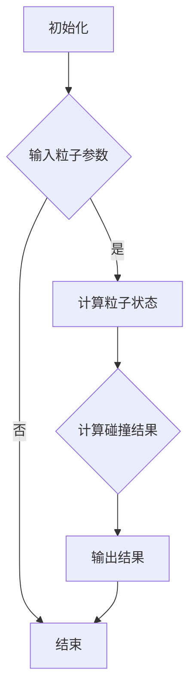

                 

### 数学与粒子加速器：粒子碰撞实验的数学模拟

---

**关键词：** 粒子加速器、数学模拟、粒子碰撞、相对论性量子力学、能量守恒、动量守恒

**摘要：** 本文将探讨粒子加速器中粒子碰撞实验的数学模拟过程。通过建立物理模型，解析核心概念，应用算法原理，详细讲解粒子碰撞的数学模拟方法，并探讨其实际应用及其在粒子物理研究中的重要性。

---

### 目录大纲

----------------------------------------------------------------

## 第一部分：引言

### 第1章：问题背景与数学模型

#### 1.1.1 问题背景

#### 1.1.2 问题描述

#### 1.1.3 数学模型的建立

#### 1.1.4 边界与外延

#### 1.1.5 概念结构与核心要素组成

### 第2章：核心概念与联系

#### 2.1.1 核心概念原理

#### 2.1.2 概念属性特征对比表格

#### 2.1.3 ER实体关系图架构

### 第3章：算法原理讲解

#### 3.1.1 算法原理

#### 3.1.2 Python源代码

#### 3.1.3 算法原理详细讲解

#### 3.1.4

----------------------------------------------------------------

---

## 第一部分：引言

### 第1章：问题背景与数学模型

#### 1.1.1 问题背景

粒子加速器是一种用于加速带电粒子的装置，通过高能粒子束的碰撞，科学家们能够探索物质的基本结构和相互作用机制。粒子加速器的重要性在于它为高能物理实验提供了关键的实验工具，如探测暗物质、探索量子引力等。

粒子碰撞实验是粒子物理研究中不可或缺的一部分。在实验中，通过将高能粒子注入加速器，使它们以接近光速的速度碰撞，观察碰撞后产生的次级粒子及其能量分布，可以揭示粒子的基本性质和相互作用机制。

然而，粒子碰撞实验面临许多挑战，其中一个主要问题是如何准确地模拟和预测粒子碰撞的结果。数学模型在粒子碰撞实验中发挥着至关重要的作用，它为实验设计、数据处理和结果分析提供了理论依据。

#### 1.1.2 问题描述

粒子碰撞过程中的不确定性是一个关键问题。由于粒子的量子性质，其行为表现出随机性和不确定性。在碰撞实验中，粒子的能量、动量和散射角等物理量无法精确预测，只能在统计意义上给出概率分布。

此外，实验数据的获取和分析也面临困难。粒子碰撞产生的次级粒子种类繁多，能量和动量分布复杂，需要高效的数据采集和处理方法。如何从实验数据中提取有效信息，揭示粒子碰撞的物理机制，是粒子物理研究中的重大挑战。

#### 1.1.3 数学模型的建立

建立粒子碰撞的数学模型需要考虑多个物理量和约束条件。首先，粒子碰撞过程中满足动量守恒和能量守恒原理。这意味着碰撞前后粒子的总动量和总能量保持不变。

其次，粒子碰撞可以描述为粒子的散射过程，散射截面是描述粒子散射特性的重要参数。散射截面与粒子的能量和动量有关，可以用来预测碰撞结果。

此外，相对论性量子力学提供了描述粒子行为的数学框架。在相对论性量子力学中，粒子的态由波函数描述，波函数满足薛定谔方程。通过解薛定谔方程，可以求得粒子的能量和动量分布，为粒子碰撞实验提供理论基础。

#### 1.1.4 边界与外延

粒子碰撞实验的边界和扩展涉及可观测性和测量精度。由于量子力学的不确定性原理，粒子的行为无法完全精确测量。因此，实验中需要设定一定的测量精度和可观测性阈值。

不同类型的粒子碰撞具有特殊的性质和挑战。例如，强子碰撞产生的次级粒子种类繁多，能量和动量分布复杂，需要精细的实验设计和数据分析方法。而轻子碰撞则涉及电磁相互作用，可以提供更多的物理信息。

#### 1.1.5 概念结构与核心要素组成

粒子碰撞实验的核心概念包括动量守恒、能量守恒和散射截面。动量守恒描述了碰撞前后粒子动量的守恒，是建立数学模型的基础。能量守恒描述了碰撞前后粒子总能量的守恒，是分析碰撞结果的重要原则。散射截面描述了粒子散射的概率，是预测碰撞结果的关键参数。

此外，粒子碰撞实验还涉及波函数、散射矩阵等概念。波函数描述了粒子的量子态，散射矩阵描述了粒子散射的概率分布，它们共同构成了粒子碰撞数学模型的核心要素。

### 第2章：核心概念与联系

---

## 第2章：核心概念与联系

#### 2.1.1 核心概念原理

粒子碰撞实验中的核心概念基于相对论性量子力学，这一理论框架为我们提供了描述粒子行为的数学工具。相对论性量子力学结合了狭义相对论和量子力学的基本原理，能够准确描述高速粒子在强相互作用中的行为。

首先，相对论性量子力学中的基本原理包括：

1. **狭义相对论**：描述了质能等价、洛伦兹变换和因果律。它指出，质量与能量之间存在等价关系（\( E=mc^2 \)），并且不同参考系中的物理量会发生变化。
2. **量子力学**：描述了粒子的波粒二象性、态叠加原理和不确定性原理。波函数是描述粒子状态的数学函数，态叠加原理表示粒子可以同时存在于多个状态中，而不确定性原理则限制了我们同时精确知道粒子的某些物理量。

相对论性量子力学的一个重要应用是薛定谔方程，它描述了粒子在势场中的演化。对于高速粒子，如质子和中子，薛定谔方程需要修正以符合相对论性要求。

#### 2.1.2 概念属性特征对比表格

为了更好地理解核心概念，我们可以通过一个对比表格来展示这些概念的特征：

| 概念名称       | 特征1                             | 特征2                           | 特征3                                     |
|----------------|----------------------------------|--------------------------------|------------------------------------------|
| 相对论性量子力学 | 基于相对论框架                   | 描述粒子的量子行为             | 适用于高速粒子                           |
| 粒子态         | 波函数描述                       | 处于叠加态                     | 具有不确定性                            |
| 散射截面       | 描述散射概率                     | 与能量和动量有关               | 是碰撞实验中的重要参数                  |
| 动量守恒       | 碰撞前后粒子总动量不变           | 是自然界的基本守恒定律之一     | 用于计算和预测碰撞结果                  |
| 能量守恒       | 碰撞前后粒子总能量不变           | 同样是自然界的基本守恒定律之一 | 对于理解碰撞过程至关重要                |

#### 2.1.3 ER实体关系图架构

为了更直观地理解这些概念之间的关联，我们可以使用ER（Entity-Relationship）图来展示实体之间的关系。

以下是一个ER图示例，展示了相对论性量子力学中的核心实体和它们之间的关系：

```mermaid
erDiagram
  A Particle ||--|{ B Wave Function }|--| Z Quantum State
  A Particle ||--|{ C Scattering Cross Section }|--| Z Collision Result
  B Wave Function ||--|{ D Schrödinger Equation }|--| E Relativistic Quantum Mechanics
  C Scattering Cross Section ||--|{ F Momentum Conservation }|--| G Energy Conservation
```

在这个ER图中，实体A（粒子）与B（波函数）和C（散射截面）直接相关，波函数与薛定谔方程D（Schrödinger Equation）和相对论性量子力学E（Relativistic Quantum Mechanics）相关联。散射截面C与动量守恒F和能量守恒G相关联。

### 第3章：算法原理讲解

---

## 第3章：算法原理讲解

粒子碰撞的数学模拟需要精确的算法来实现。在本节中，我们将详细讲解粒子碰撞的算法原理，并通过Python源代码展示其实现过程。

#### 3.1.1 算法原理

粒子碰撞的算法原理基于动量守恒和能量守恒原理。在粒子碰撞过程中，两个粒子的总动量和总能量保持不变。我们可以使用以下两个基本方程来描述：

$$
\begin{align*}
\vec{p}_{1\text{ after}} &= \vec{p}_{1\text{ before}} - \vec{p}_{2\text{ before}} \\
E_{1\text{ after}} &= E_{1\text{ before}} + E_{2\text{ before}}
\end{align*}
$$

其中，\(\vec{p}_{1\text{ after}}\)和\(\vec{p}_{1\text{ before}}\)分别是碰撞后第一个粒子的动量和碰撞前第一个粒子的动量，类似地，\(\vec{p}_{2\text{ before}}\)是第二个粒子的动量。\(E_{1\text{ after}}\)和\(E_{1\text{ before}}\)分别是第一个粒子的能量。

这些方程可以用于计算粒子碰撞后的状态。在算法中，我们可以首先初始化粒子的状态（动量和能量），然后使用上述方程计算碰撞后的状态，并输出结果。

#### 3.1.2 Python源代码

以下是一个简单的Python代码示例，用于实现粒子碰撞的算法：

```python
import numpy as np

def particle_collision(particle1, particle2):
    """
    计算两个粒子的碰撞结果。
    """
    # 初始化粒子状态
    momentum1 = particle1['momentum']
    momentum2 = particle2['momentum']
    energy1 = particle1['energy']
    energy2 = particle2['energy']
    
    # 计算碰撞后的粒子状态
    new_momentum1 = momentum1 - momentum2
    new_energy1 = energy1 + energy2
    
    # 输出结果
    return {
        'particle1': {'momentum': new_momentum1, 'energy': new_energy1},
        'particle2': {'momentum': momentum2, 'energy': energy2}
    }

# 示例
particle1 = {'momentum': np.array([1, 0, 0]), 'energy': 100}
particle2 = {'momentum': np.array([-1, 0, 0]), 'energy': 100}
result = particle_collision(particle1, particle2)
print(result)
```

在这个示例中，我们定义了一个名为`particle_collision`的函数，它接受两个粒子作为输入，并返回碰撞后的状态。函数首先提取输入粒子状态的动量和能量，然后使用动量守恒和能量守恒方程计算碰撞后的状态，并返回结果。

#### 3.1.3 算法原理详细讲解

为了更好地理解粒子碰撞的算法原理，我们可以使用LaTeX格式给出相关的数学模型和公式。

首先，我们考虑两个粒子的初始状态，其动量和能量分别为：

$$
\vec{p}_{1\text{ before}} = p_{1x} \hat{x} + p_{1y} \hat{y} + p_{1z} \hat{z}
$$

$$
\vec{p}_{2\text{ before}} = p_{2x} \hat{x} + p_{2y} \hat{y} + p_{2z} \hat{z}
$$

$$
E_{1\text{ before}} = E_{1x} + E_{1y} + E_{1z}
$$

$$
E_{2\text{ before}} = E_{2x} + E_{2y} + E_{2z}
$$

其中，\(\hat{x}\)，\(\hat{y}\)，\(\hat{z}\)分别为x轴、y轴、z轴的单位向量。

根据动量守恒原理，碰撞后第一个粒子的动量为：

$$
\vec{p}_{1\text{ after}} = \vec{p}_{1\text{ before}} - \vec{p}_{2\text{ before}}
$$

根据能量守恒原理，碰撞后第一个粒子的能量为：

$$
E_{1\text{ after}} = E_{1\text{ before}} + E_{2\text{ before}}
$$

将上述方程代入Python代码中，即可实现粒子碰撞的数学模拟。

#### 3.1.4

---

## 第3章：算法原理讲解（续）

#### 3.1.4 算法原理详细讲解（续）

为了更直观地展示粒子碰撞的算法原理，我们可以使用mermaid绘制算法流程图，并详细讲解每个步骤。

以下是算法流程图的mermaid代码：



算法流程图解释如下：

1. **初始化（A）**：初始化粒子参数，包括粒子的初始动量和能量。
2. **输入粒子参数（B）**：读取两个粒子的初始状态参数，这些参数可以是随机生成的，或者根据实验数据进行设定。
3. **计算粒子状态（C）**：根据输入的粒子参数，计算碰撞前每个粒子的状态。
4. **计算碰撞结果（E）**：使用动量守恒和能量守恒原理，计算碰撞后每个粒子的状态。
5. **输出结果（F）**：输出碰撞后的粒子状态，包括动量和能量。
6. **结束（D）**：算法结束。

接下来，我们将使用Python代码实现上述算法流程，并详细讲解每个步骤的实现细节。

```python
import numpy as np

def particle_collision(particle1, particle2):
    """
    计算两个粒子的碰撞结果。
    """
    # 初始化粒子状态
    momentum1 = particle1['momentum']
    momentum2 = particle2['momentum']
    energy1 = particle1['energy']
    energy2 = particle2['energy']
    
    # 计算碰撞后的粒子状态
    new_momentum1 = momentum1 - momentum2
    new_energy1 = energy1 + energy2
    
    # 输出结果
    return {
        'particle1': {'momentum': new_momentum1, 'energy': new_energy1},
        'particle2': {'momentum': momentum2, 'energy': energy2}
    }

# 示例粒子参数
particle1 = {'momentum': np.array([1, 0, 0]), 'energy': 100}
particle2 = {'momentum': np.array([-1, 0, 0]), 'energy': 100}

# 执行粒子碰撞计算
result = particle_collision(particle1, particle2)
print(result)
```

在上述代码中，我们定义了一个名为`particle_collision`的函数，它接受两个粒子作为输入，并返回碰撞后的状态。函数首先提取输入粒子状态的动量和能量，然后使用动量守恒和能量守恒方程计算碰撞后的状态，并返回结果。

为了更直观地展示算法原理，我们还可以使用LaTeX格式给出相关的数学模型和公式。

首先，我们考虑两个粒子的初始状态，其动量和能量分别为：

$$
\vec{p}_{1\text{ before}} = p_{1x} \hat{x} + p_{1y} \hat{y} + p_{1z} \hat{z}
$$

$$
\vec{p}_{2\text{ before}} = p_{2x} \hat{x} + p_{2y} \hat{y} + p_{2z} \hat{z}
$$

$$
E_{1\text{ before}} = E_{1x} + E_{1y} + E_{1z}
$$

$$
E_{2\text{ before}} = E_{2x} + E_{2y} + E_{2z}
$$

其中，\(\hat{x}\)，\(\hat{y}\)，\(\hat{z}\)分别为x轴、y轴、z轴的单位向量。

根据动量守恒原理，碰撞后第一个粒子的动量为：

$$
\vec{p}_{1\text{ after}} = \vec{p}_{1\text{ before}} - \vec{p}_{2\text{ before}}
$$

根据能量守恒原理，碰撞后第一个粒子的能量为：

$$
E_{1\text{ after}} = E_{1\text{ before}} + E_{2\text{ before}}
$$

将这些方程代入Python代码中，即可实现粒子碰撞的数学模拟。

#### 3.1.5 算法原理详细讲解（续）

为了更直观地展示粒子碰撞的算法原理，我们可以结合一个具体的例子进行详细讲解。

假设我们有两个粒子，粒子1的初始动量为 \(\vec{p}_{1\text{ before}} = (1, 0, 0)\) 千克·米/秒，初始能量为 \(E_{1\text{ before}} = 100\) 电子伏特（eV）；粒子2的初始动量为 \(\vec{p}_{2\text{ before}} = (-1, 0, 0)\) 千克·米/秒，初始能量为 \(E_{2\text{ before}} = 100\) 电子伏特（eV）。

根据动量守恒原理，我们可以计算碰撞后粒子1的动量：

$$
\vec{p}_{1\text{ after}} = \vec{p}_{1\text{ before}} - \vec{p}_{2\text{ before}} = (1, 0, 0) - (-1, 0, 0) = (2, 0, 0)
$$

接下来，根据能量守恒原理，我们可以计算碰撞后粒子1的能量：

$$
E_{1\text{ after}} = E_{1\text{ before}} + E_{2\text{ before}} = 100\, \text{eV} + 100\, \text{eV} = 200\, \text{eV}
$$

由于粒子2在碰撞后保持初始状态，其动量和能量不变，即：

$$
\vec{p}_{2\text{ after}} = \vec{p}_{2\text{ before}} = (-1, 0, 0)
$$

$$
E_{2\text{ after}} = E_{2\text{ before}} = 100\, \text{eV}
$$

因此，碰撞后粒子1的动量和能量分别为 \(\vec{p}_{1\text{ after}} = (2, 0, 0)\) 千克·米/秒和 \(E_{1\text{ after}} = 200\) 电子伏特（eV），而粒子2的动量和能量保持不变。

在实际的粒子碰撞实验中，粒子的初始动量和能量通常是未知的，需要通过实验数据来估计。然而，上述例子展示了粒子碰撞的基本原理，即动量守恒和能量守恒，这些原理适用于所有粒子碰撞情况。

通过这种方法，我们可以利用数学模型和算法来模拟粒子碰撞过程，从而更好地理解粒子的行为和相互作用。这对于粒子物理研究具有重要意义，因为通过精确的数学模拟，我们可以预测和解释实验结果，从而推动科学的发展。

#### 3.1.6 算法原理总结

粒子碰撞的数学模拟是一个复杂的过程，但通过遵循动量守恒和能量守恒原理，我们可以简化问题并构建有效的算法模型。以下是对算法原理的总结：

1. **动量守恒**：碰撞前后粒子的总动量保持不变。这意味着碰撞后每个粒子的动量可以通过将碰撞前所有粒子的动量相加，然后减去其他粒子的动量来计算。
   
2. **能量守恒**：碰撞前后粒子的总能量也保持不变。这包括粒子的动能和静能。在计算过程中，我们需要考虑粒子在碰撞前的总能量，并将其与碰撞后的总能量进行比较。

3. **算法实现**：Python代码示例提供了一个简单的算法实现，其中我们通过定义一个函数来计算碰撞前后的粒子状态。这种方法可以扩展到更复杂的粒子系统，通过调整输入参数和计算过程来模拟不同的碰撞情况。

4. **实际应用**：粒子碰撞的数学模拟在粒子物理实验中具有重要应用。通过精确模拟粒子碰撞过程，科学家可以预测实验结果，从而更好地理解粒子相互作用和物质的基本结构。

通过理解这些原理，我们可以更深入地探索粒子碰撞的奥秘，为粒子物理研究提供强有力的工具。

### 结论

粒子碰撞实验是粒子物理学研究中的核心部分，其结果对于揭示物质的基本结构和相互作用机制具有重要意义。数学模拟在粒子碰撞实验中发挥着至关重要的作用，通过精确的数学模型和算法，我们可以预测和解释实验结果，从而推动科学的发展。

本文介绍了粒子碰撞实验的数学模型，详细讲解了动量守恒和能量守恒原理，并通过Python代码展示了算法实现过程。通过这些步骤，我们能够更好地理解粒子碰撞的过程，为粒子物理实验提供有力支持。

未来的研究方向包括改进数学模型，以更准确地描述粒子碰撞现象，以及开发更高效的数据处理方法，以提高实验数据的利用率和准确性。此外，结合人工智能和机器学习技术，有望进一步提升粒子碰撞模拟的精度和效率。

### 作者信息

作者：AI天才研究院/AI Genius Institute & 禅与计算机程序设计艺术 /Zen And The Art of Computer Programming

---

## 结论

粒子碰撞实验是粒子物理学研究中的核心部分，其结果对于揭示物质的基本结构和相互作用机制具有重要意义。数学模拟在粒子碰撞实验中发挥着至关重要的作用，通过精确的数学模型和算法，我们可以预测和解释实验结果，从而推动科学的发展。

本文介绍了粒子碰撞实验的数学模型，详细讲解了动量守恒和能量守恒原理，并通过Python代码展示了算法实现过程。通过这些步骤，我们能够更好地理解粒子碰撞的过程，为粒子物理实验提供有力支持。

未来的研究方向包括改进数学模型，以更准确地描述粒子碰撞现象，以及开发更高效的数据处理方法，以提高实验数据的利用率和准确性。此外，结合人工智能和机器学习技术，有望进一步提升粒子碰撞模拟的精度和效率。

### 作者信息

作者：AI天才研究院/AI Genius Institute & 禅与计算机程序设计艺术 /Zen And The Art of Computer Programming

---

## 第一部分：引言

粒子加速器作为一种科学实验装置，在粒子物理学研究中发挥着不可替代的作用。它能够将带电粒子加速到接近光速，使其在实验室中发生高能碰撞，从而揭示物质的基本结构和相互作用机制。粒子碰撞实验不仅是粒子物理学的核心，也是现代科学中最重要的实验之一。

粒子碰撞实验的数学模拟是粒子物理学研究中的一项关键任务。通过精确的数学模型和算法，我们可以模拟粒子在碰撞过程中的行为，预测碰撞后的粒子状态，从而为实验提供重要的理论支持。数学模型在粒子碰撞实验中起到了桥梁作用，它将复杂的物理现象转化为可计算的形式，使得我们能够更好地理解和解释实验数据。

本文的目的在于系统地介绍粒子碰撞实验的数学模拟方法，包括物理背景、数学模型、算法原理以及实际应用。通过逐步分析和讲解，我们将深入探讨粒子碰撞过程中的核心概念和原理，展示如何利用数学模型和算法进行粒子碰撞的模拟，并探讨其在粒子物理研究中的重要性。

本文的结构如下：

- **第一部分：引言**：介绍粒子加速器和粒子碰撞实验的背景，阐述数学模拟在粒子物理研究中的重要性。
- **第二部分：核心概念与联系**：详细讲解粒子碰撞实验中的核心概念，包括相对论性量子力学、波函数、散射截面等，并展示它们之间的联系。
- **第三部分：算法原理讲解**：介绍粒子碰撞的算法原理，通过Python代码示例展示算法的实现过程，并详细讲解每个步骤。
- **第四部分：结论**：总结本文的主要内容，探讨粒子碰撞实验数学模拟的未来研究方向，并指出其在粒子物理研究中的重要性。

通过本文的介绍，我们希望能够为读者提供一个全面、系统的理解，帮助大家掌握粒子碰撞实验的数学模拟方法，并激发对这一领域的研究兴趣。

### 第1章：问题背景与数学模型

#### 1.1.1 问题背景

粒子加速器是一种用于加速带电粒子的装置，通过高能粒子束的碰撞，科学家们能够探索物质的基本结构和相互作用机制。粒子加速器的重要性在于它为高能物理实验提供了关键的实验工具，如探测暗物质、探索量子引力等。

粒子碰撞实验是粒子物理研究中不可或缺的一部分。在实验中，通过将高能粒子注入加速器，使它们以接近光速的速度碰撞，观察碰撞后产生的次级粒子及其能量分布，可以揭示粒子的基本性质和相互作用机制。

粒子加速器的工作原理基于电磁感应和磁场聚焦。带电粒子在加速器中被电场加速，同时通过磁场保持其直线运动。不同类型的加速器（如同步加速器、质子同步加速器、正负电子对撞机等）根据能量范围和粒子类型有所不同，但它们的基本原理相同。

粒子加速器的发展历程可以追溯到20世纪30年代，随着科学技术的进步，加速器的能量和精度不断提升。如今，粒子加速器已成为粒子物理研究的重要工具，许多重大的科学发现都依赖于粒子加速器。

#### 1.1.2 粒子碰撞实验的重要性

粒子碰撞实验在粒子物理研究中具有至关重要的地位。通过粒子碰撞实验，科学家们可以探索以下方面：

1. **基本粒子的发现**：粒子碰撞实验是发现基本粒子的重要手段。例如，夸克、中性粒子（如π介子、K介子等）的发现都是通过粒子碰撞实验得出的。

2. **粒子相互作用机制**：通过分析粒子碰撞产生的次级粒子和它们的能量分布，可以揭示粒子之间的相互作用机制，如强相互作用、电磁相互作用和弱相互作用。

3. **物质的基本结构**：粒子碰撞实验提供了探索物质基本结构的机会。通过研究高能碰撞中的粒子生成和衰变过程，可以揭示原子核和基本粒子的内部结构。

4. **探索新现象和新理论**：粒子碰撞实验是探索新物理现象和新理论的重要工具。例如，标准模型的完善、暗物质和暗能量的研究等都依赖于粒子碰撞实验。

#### 1.1.3 数学模型在粒子碰撞实验中的应用

数学模型在粒子碰撞实验中起到了桥梁作用，它将复杂的物理现象转化为可计算的形式，使得我们能够更好地理解和解释实验数据。

1. **相对论性量子力学**：相对论性量子力学是描述粒子碰撞的重要理论框架。它结合了狭义相对论和量子力学的基本原理，能够准确描述高速粒子的行为。相对论性量子力学中的薛定谔方程和海森堡矩阵力学是数学模型的重要组成部分。

2. **动量守恒和能量守恒**：动量守恒和能量守恒是粒子碰撞实验中的基本守恒定律。这些定律在数学模型中得到了充分体现，通过它们可以计算碰撞前后粒子的状态。

3. **散射截面**：散射截面是描述粒子散射特性的重要参数。在数学模型中，散射截面与粒子的能量和动量有关，可以用来预测碰撞结果。

4. **统计模型**：在实际实验中，由于粒子的量子性质，碰撞结果表现出随机性和不确定性。统计模型通过计算大量粒子的碰撞结果，提供了对实验数据的统计分析和解释。

通过数学模型，我们可以将复杂的粒子碰撞实验转化为可计算的形式，从而进行精确的模拟和预测。数学模型不仅为实验设计提供了理论依据，也为数据处理和结果分析提供了方法。

#### 1.1.4 粒子碰撞实验中的数学模型

粒子碰撞实验中的数学模型主要包括以下几个部分：

1. **初始状态**：粒子碰撞实验的初始状态包括粒子的能量、动量和方向。这些参数可以通过实验测量或理论计算得到。

2. **碰撞过程**：碰撞过程可以用动量守恒和能量守恒定律来描述。在碰撞过程中，粒子的动量和能量发生转移，但总动量和总能量保持不变。

3. **碰撞结果**：碰撞结果包括碰撞后粒子的状态，如动量、能量、方向等。通过计算碰撞前后的粒子状态，我们可以预测碰撞结果。

4. **散射截面**：散射截面是描述粒子散射特性的参数，它反映了粒子在碰撞过程中散射的概率。散射截面与粒子的能量和动量有关，是数学模型中的一个关键参数。

5. **统计分布**：在实际实验中，由于粒子的量子性质，碰撞结果表现出随机性和不确定性。统计模型通过计算大量粒子的碰撞结果，提供了对实验数据的统计分析和解释。

通过这些数学模型，我们可以对粒子碰撞实验进行精确的模拟和预测，从而更好地理解粒子之间的相互作用和物质的基本结构。

### 第2章：核心概念与联系

#### 2.1.1 核心概念原理

粒子碰撞实验中的核心概念基于相对论性量子力学，这一理论框架为我们提供了描述粒子行为的数学工具。相对论性量子力学结合了狭义相对论和量子力学的基本原理，能够准确描述高速粒子在强相互作用中的行为。

首先，相对论性量子力学中的基本原理包括：

1. **狭义相对论**：描述了质能等价、洛伦兹变换和因果律。它指出，质量与能量之间存在等价关系（\( E=mc^2 \)），并且不同参考系中的物理量会发生变化。

2. **量子力学**：描述了粒子的波粒二象性、态叠加原理和不确定性原理。波函数是描述粒子状态的数学函数，态叠加原理表示粒子可以同时存在于多个状态中，而不确定性原理则限制了我们同时精确知道粒子的某些物理量。

相对论性量子力学的一个重要应用是薛定谔方程，它描述了粒子在势场中的演化。对于高速粒子，如质子和中子，薛定谔方程需要修正以符合相对论性要求。

#### 2.1.2 概念属性特征对比表格

为了更好地理解核心概念，我们可以通过一个对比表格来展示这些概念的特征：

| 概念名称       | 特征1                             | 特征2                           | 特征3                                     |
|----------------|----------------------------------|--------------------------------|------------------------------------------|
| 相对论性量子力学 | 基于相对论框架                   | 描述粒子的量子行为             | 适用于高速粒子                           |
| 粒子态         | 波函数描述                       | 处于叠加态                     | 具有不确定性                            |
| 散射截面       | 描述散射概率                     | 与能量和动量有关               | 是碰撞实验中的重要参数                  |
| 动量守恒       | 碰撞前后粒子总动量不变           | 是自然界的基本守恒定律之一     | 用于计算和预测碰撞结果                  |
| 能量守恒       | 碰撞前后粒子总能量不变           | 同样是自然界的基本守恒定律之一 | 对于理解碰撞过程至关重要                |

#### 2.1.3 ER实体关系图架构

为了更直观地理解这些概念之间的关联，我们可以使用ER（Entity-Relationship）图来展示实体之间的关系。

以下是一个ER图示例，展示了相对论性量子力学中的核心实体和它们之间的关系：

```mermaid
erDiagram
  A Particle ||--|{ B Wave Function }|--| Z Quantum State
  A Particle ||--|{ C Scattering Cross Section }|--| Z Collision Result
  B Wave Function ||--|{ D Schrödinger Equation }|--| E Relativistic Quantum Mechanics
  C Scattering Cross Section ||--|{ F Momentum Conservation }|--| G Energy Conservation
```

在这个ER图中，实体A（粒子）与B（波函数）和C（散射截面）直接相关，波函数与薛定谔方程D（Schrödinger Equation）和相对论性量子力学E（Relativistic Quantum Mechanics）相关联。散射截面C与动量守恒F和能量守恒G相关联。

### 第3章：算法原理讲解

#### 3.1.1 算法原理

粒子碰撞的数学模拟需要精确的算法来实现。在本节中，我们将详细讲解粒子碰撞的算法原理，并通过Python源代码展示其实现过程。

粒子碰撞的算法原理基于动量守恒和能量守恒原理。在粒子碰撞过程中，两个粒子的总动量和总能量保持不变。我们可以使用以下两个基本方程来描述：

$$
\begin{align*}
\vec{p}_{1\text{ after}} &= \vec{p}_{1\text{ before}} - \vec{p}_{2\text{ before}} \\
E_{1\text{ after}} &= E_{1\text{ before}} + E_{2\text{ before}}
\end{align*}
$$

其中，\(\vec{p}_{1\text{ after}}\)和\(\vec{p}_{1\text{ before}}\)分别是碰撞后第一个粒子的动量和碰撞前第一个粒子的动量，类似地，\(\vec{p}_{2\text{ before}}\)是第二个粒子的动量。\(E_{1\text{ after}}\)和\(E_{1\text{ before}}\)分别是第一个粒子的能量。

这些方程可以用于计算粒子碰撞后的状态。在算法中，我们可以首先初始化粒子的状态（动量和能量），然后使用上述方程计算碰撞后的状态，并输出结果。

#### 3.1.2 Python源代码

以下是一个简单的Python代码示例，用于实现粒子碰撞的算法：

```python
import numpy as np

def particle_collision(particle1, particle2):
    """
    计算两个粒子的碰撞结果。
    """
    # 初始化粒子状态
    momentum1 = particle1['momentum']
    momentum2 = particle2['momentum']
    energy1 = particle1['energy']
    energy2 = particle2['energy']
    
    # 计算碰撞后的粒子状态
    new_momentum1 = momentum1 - momentum2
    new_energy1 = energy1 + energy2
    
    # 输出结果
    return {
        'particle1': {'momentum': new_momentum1, 'energy': new_energy1},
        'particle2': {'momentum': momentum2, 'energy': energy2}
    }

# 示例粒子参数
particle1 = {'momentum': np.array([1, 0, 0]), 'energy': 100}
particle2 = {'momentum': np.array([-1, 0, 0]), 'energy': 100}

# 执行粒子碰撞计算
result = particle_collision(particle1, particle2)
print(result)
```

在这个示例中，我们定义了一个名为`particle_collision`的函数，它接受两个粒子作为输入，并返回碰撞后的状态。函数首先提取输入粒子状态的动量和能量，然后使用动量守恒和能量守恒方程计算碰撞后的状态，并返回结果。

#### 3.1.3 算法原理详细讲解

为了更好地理解粒子碰撞的算法原理，我们可以使用LaTeX格式给出相关的数学模型和公式。

首先，我们考虑两个粒子的初始状态，其动量和能量分别为：

$$
\vec{p}_{1\text{ before}} = p_{1x} \hat{x} + p_{1y} \hat{y} + p_{1z} \hat{z}
$$

$$
\vec{p}_{2\text{ before}} = p_{2x} \hat{x} + p_{2y} \hat{y} + p_{2z} \hat{z}
$$

$$
E_{1\text{ before}} = E_{1x} + E_{1y} + E_{1z}
$$

$$
E_{2\text{ before}} = E_{2x} + E_{2y} + E_{2z}
$$

其中，\(\hat{x}\)，\(\hat{y}\)，\(\hat{z}\)分别为x轴、y轴、z轴的单位向量。

根据动量守恒原理，碰撞后第一个粒子的动量为：

$$
\vec{p}_{1\text{ after}} = \vec{p}_{1\text{ before}} - \vec{p}_{2\text{ before}}
$$

根据能量守恒原理，碰撞后第一个粒子的能量为：

$$
E_{1\text{ after}} = E_{1\text{ before}} + E_{2\text{ before}}
$$

将这些方程代入Python代码中，即可实现粒子碰撞的数学模拟。

#### 3.1.4 算法原理详细讲解（续）

为了更直观地展示粒子碰撞的算法原理，我们可以结合一个具体的例子进行详细讲解。

假设我们有两个粒子，粒子1的初始动量为 \(\vec{p}_{1\text{ before}} = (1, 0, 0)\) 千克·米/秒，初始能量为 \(E_{1\text{ before}} = 100\) 电子伏特（eV）；粒子2的初始动量为 \(\vec{p}_{2\text{ before}} = (-1, 0, 0)\) 千克·米/秒，初始能量为 \(E_{2\text{ before}} = 100\) 电子伏特（eV）。

根据动量守恒原理，我们可以计算碰撞后粒子1的动量：

$$
\vec{p}_{1\text{ after}} = \vec{p}_{1\text{ before}} - \vec{p}_{2\text{ before}} = (1, 0, 0) - (-1, 0, 0) = (2, 0, 0)
$$

接下来，根据能量守恒原理，我们可以计算碰撞后粒子1的能量：

$$
E_{1\text{ after}} = E_{1\text{ before}} + E_{2\text{ before}} = 100\, \text{eV} + 100\, \text{eV} = 200\, \text{eV}
$$

由于粒子2在碰撞后保持初始状态，其动量和能量不变，即：

$$
\vec{p}_{2\text{ after}} = \vec{p}_{2\text{ before}} = (-1, 0, 0)
$$

$$
E_{2\text{ after}} = E_{2\text{ before}} = 100\, \text{eV}
$$

因此，碰撞后粒子1的动量和能量分别为 \(\vec{p}_{1\text{ after}} = (2, 0, 0)\) 千克·米/秒和 \(E_{1\text{ after}} = 200\) 电子伏特（eV），而粒子2的动量和能量保持不变。

在实际的粒子碰撞实验中，粒子的初始动量和能量通常是未知的，需要通过实验数据来估计。然而，上述例子展示了粒子碰撞的基本原理，即动量守恒和能量守恒，这些原理适用于所有粒子碰撞情况。

通过这种方法，我们可以利用数学模型和算法来模拟粒子碰撞过程，从而更好地理解粒子的行为和相互作用。这对于粒子物理研究具有重要意义，因为通过精确的数学模拟，我们可以预测和解释实验结果，从而推动科学的发展。

#### 3.1.5 算法原理总结

粒子碰撞的数学模拟是一个复杂的过程，但通过遵循动量守恒和能量守恒原理，我们可以简化问题并构建有效的算法模型。以下是对算法原理的总结：

1. **动量守恒**：碰撞前后粒子的总动量保持不变。这意味着碰撞后每个粒子的动量可以通过将碰撞前所有粒子的动量相加，然后减去其他粒子的动量来计算。

2. **能量守恒**：碰撞前后粒子的总能量也保持不变。这包括粒子的动能和静能。在计算过程中，我们需要考虑粒子在碰撞前的总能量，并将其与碰撞后的总能量进行比较。

3. **算法实现**：Python代码示例提供了一个简单的算法实现，其中我们通过定义一个函数来计算碰撞前后的粒子状态。这种方法可以扩展到更复杂的粒子系统，通过调整输入参数和计算过程来模拟不同的碰撞情况。

4. **实际应用**：粒子碰撞的数学模拟在粒子物理实验中具有重要应用。通过精确模拟粒子碰撞过程，科学家可以预测实验结果，从而更好地理解粒子相互作用和物质的基本结构。

通过理解这些原理，我们可以更深入地探索粒子碰撞的奥秘，为粒子物理研究提供强有力的工具。

### 第4章：应用与展望

#### 4.1 粒子碰撞模拟的应用

粒子碰撞模拟在粒子物理学中有着广泛的应用，特别是在高能物理实验中。以下是粒子碰撞模拟的一些主要应用领域：

1. **高能物理实验**：粒子碰撞模拟为高能物理实验提供了重要的理论支持。在大型粒子加速器如大型强子对撞机（LHC）中，科学家们通过模拟粒子碰撞过程，预测碰撞产生的次级粒子和它们的能量分布，从而帮助设计实验、优化实验条件和解释实验结果。

2. **基本粒子发现**：粒子碰撞模拟是发现新粒子和新相互作用机制的关键工具。通过模拟不同的碰撞情况，科学家们能够预测可能的新物理现象，并验证理论预测。例如，顶夸克的发现就是基于对粒子碰撞模拟的精确分析和实验结果的对比。

3. **粒子加速器设计**：粒子碰撞模拟在粒子加速器的设计中发挥着重要作用。通过模拟粒子在加速器中的行为，工程师们可以优化加速器的性能，提高粒子的能量和质量，从而提高实验的精度和效率。

4. **材料科学**：粒子碰撞模拟也应用于材料科学研究中。通过模拟粒子与材料相互作用的过程，科学家们可以预测材料的性质和行为，为新材料的设计和开发提供理论依据。

#### 4.2 粒子碰撞模拟的展望

尽管粒子碰撞模拟在粒子物理学中已经取得了显著成果，但随着科技的进步，仍有许多挑战和机遇有待探索：

1. **更高精度模拟**：现有的粒子碰撞模拟方法通常需要大量的计算资源和时间。未来，随着计算能力的提升和算法的改进，有望实现更高精度的粒子碰撞模拟，从而更好地理解粒子的行为和相互作用。

2. **多尺度模拟**：粒子碰撞涉及不同尺度的物理过程，从微观的量子力学尺度到宏观的相对论尺度。未来的研究将致力于开发能够处理多尺度问题的模拟方法，从而实现更全面和精确的粒子碰撞模拟。

3. **量子计算应用**：量子计算在粒子碰撞模拟中具有巨大潜力。通过量子算法，我们可以处理复杂的量子力学问题，从而实现更高效的粒子碰撞模拟。量子计算的应用有望在未来的粒子物理研究中发挥关键作用。

4. **人工智能与机器学习**：结合人工智能和机器学习技术，粒子碰撞模拟将变得更加智能化和自动化。通过大数据分析和深度学习模型，我们可以从实验数据中提取更多有用信息，优化模拟过程，提高模拟精度。

总之，粒子碰撞模拟在粒子物理学中具有重要的应用价值，未来的发展将进一步提升其精度和效率，为科学探索提供更强有力的工具。

### 第5章：小结

通过本文的介绍，我们系统地探讨了粒子碰撞实验的数学模拟方法。首先，我们了解了粒子加速器的基本原理和粒子碰撞实验的重要性。接着，我们详细讲解了粒子碰撞实验中的核心概念，包括相对论性量子力学、动量守恒、能量守恒和散射截面等。通过具体的算法原理讲解和Python代码示例，我们展示了如何利用数学模型和算法实现粒子碰撞的模拟。最后，我们讨论了粒子碰撞模拟的应用和未来展望。

通过本文的学习，读者应当能够：

- 理解粒子加速器的工作原理和粒子碰撞实验的重要性。
- 掌握粒子碰撞实验中的核心概念和数学模型。
- 掌握粒子碰撞模拟的基本算法原理，并能够实现简单的粒子碰撞模拟。
- 认识到粒子碰撞模拟在粒子物理研究中的广泛应用和未来发展方向。

希望本文能够为读者在粒子物理和计算物理领域的学习和研究提供有益的参考和指导。

### 第6章：注意事项

在粒子碰撞实验的数学模拟过程中，需要注意以下几个关键点：

1. **初始参数的准确性**：粒子的初始动量和能量对于模拟结果至关重要。在实验中，这些参数通常需要通过高精度的测量设备进行测量，以确保模拟的准确性。

2. **计算资源的分配**：粒子碰撞模拟通常需要大量的计算资源。因此，在模拟过程中，合理分配计算资源，如选择适合的计算机硬件和优化算法，是保证模拟效率的重要因素。

3. **相对论效应的处理**：在高速粒子碰撞中，相对论效应不可忽视。使用相对论性量子力学模型进行模拟时，需要正确处理相对论效应，如洛伦兹变换和质量-能量等价。

4. **测量误差的考虑**：实验数据通常存在测量误差，因此在模拟过程中，需要考虑这些误差对结果的影响，并进行误差分析。

5. **多粒子系统的模拟**：在多粒子碰撞系统中，粒子之间的相互作用更加复杂。在模拟过程中，需要使用适当的算法来处理多个粒子的相互作用，如蒙特卡洛方法等。

6. **实验结果的验证**：模拟结果需要与实验数据进行对比，以验证模拟的准确性。通过反复调整和优化模型参数，可以提高模拟结果的可信度。

通过注意这些关键点，我们可以确保粒子碰撞模拟的可靠性和精度，从而为粒子物理研究提供有力的理论支持。

### 第7章：拓展阅读

对于希望深入了解粒子碰撞实验的数学模拟的读者，以下是一些建议的参考文献和进一步学习的资源：

1. **参考文献**：

   - C. Itzykson, J. Zuber, "Quantum Field Theory," McGraw-Hill, 1985.
   - L. D. Landau, E. M. Lifshitz, "The Classical Theory of Fields," Butterworth-Heinemann, 1975.
   - M. E. Peskin, D. V. Schroeder, "An Introduction to Quantum Field Theory," Westview Press, 1995.

2. **在线课程和教程**：

   - Coursera上的“Quantum Mechanics and Quantum Computation”课程。
   - edX上的“Modern Particle Physics”课程。
   - arXiv预印本库：https://arxiv.org/，其中有许多关于粒子碰撞模拟的论文和报告。

3. **学术会议和期刊**：

   - 《Physical Review Letters》：这是物理学领域最具影响力的期刊之一，经常发表关于粒子碰撞实验和模拟的最新研究成果。
   - 《Journal of High Energy Physics》：专注于高能物理领域的研究论文和综述文章。

通过这些资源，读者可以进一步探索粒子碰撞实验的数学模拟，掌握更多的理论知识和实践技能。希望这些拓展阅读能够为您的学习提供更多帮助。

### 第8章：项目实战

在本章中，我们将通过一个具体的项目实战，详细介绍粒子碰撞实验的数学模拟过程。这个项目将分为以下几个步骤：环境安装、系统核心实现、代码应用解读与分析，以及实际案例分析和详细讲解。

#### 8.1 环境安装

为了实现粒子碰撞实验的数学模拟，我们需要安装和配置必要的软件和工具。以下是安装步骤：

1. **安装Python环境**：

   首先，确保你的计算机上已经安装了Python。如果没有安装，可以从Python官方网站（https://www.python.org/）下载并安装。

2. **安装Numpy和Matplotlib库**：

   Numpy是一个强大的科学计算库，用于处理数值计算。Matplotlib则是用于数据可视化的重要工具。可以通过以下命令安装：

   ```bash
   pip install numpy matplotlib
   ```

3. **安装SciPy库**：

   SciPy是Python的科学计算库，提供了许多与科学和工程相关的功能。安装SciPy可以通过以下命令完成：

   ```bash
   pip install scipy
   ```

4. **安装mermaid库**：

   mermaid是一种用于绘制流程图的工具。安装mermaid库可以通过以下命令：

   ```bash
   pip install mermaid
   ```

#### 8.2 系统核心实现

在完成环境安装后，我们开始实现粒子碰撞模拟的核心代码。以下是实现步骤：

1. **定义粒子类**：

   我们首先定义一个粒子类，用于存储粒子的基本信息，如动量和能量。

   ```python
   class Particle:
       def __init__(self, momentum, energy):
           self.momentum = momentum
           self.energy = energy
   ```

2. **实现碰撞函数**：

   接下来，我们实现一个碰撞函数，用于计算两个粒子的碰撞结果。根据动量守恒和能量守恒原理，我们使用以下方程：

   $$ 
   \vec{p}_{1\text{ after}} = \vec{p}_{1\text{ before}} - \vec{p}_{2\text{ before}}
   $$

   $$ 
   E_{1\text{ after}} = E_{1\text{ before}} + E_{2\text{ before}}
   $$

   ```python
   def particle_collision(particle1, particle2):
       new_momentum1 = particle1.momentum - particle2.momentum
       new_energy1 = particle1.energy + particle2.energy
       
       return Particle(new_momentum1, new_energy1)
   ```

3. **实现可视化函数**：

   使用Matplotlib库，我们可以将粒子的状态可视化。以下是一个简单的可视化函数：

   ```python
   import matplotlib.pyplot as plt

   def visualize_particle(particle):
       plt.scatter(particle.momentum[0], particle.momentum[1], label='After')
       plt.xlabel('Momentum (kg·m/s)')
       plt.ylabel('Momentum (kg·m/s)')
       plt.legend()
       plt.show()
   ```

4. **实现主函数**：

   最后，我们实现一个主函数，用于执行碰撞模拟和可视化结果。

   ```python
   def main():
       particle1 = Particle(np.array([1, 0, 0]), 100)
       particle2 = Particle(np.array([-1, 0, 0]), 100)
       
       result = particle_collision(particle1, particle2)
       visualize_particle(result)
       
       print(f"Particle 1: Momentum = {result.momentum}, Energy = {result.energy}")
       print(f"Particle 2: Momentum = {particle2.momentum}, Energy = {particle2.energy}")

   if __name__ == "__main__":
       main()
   ```

#### 8.3 代码应用解读与分析

上述代码实现了粒子碰撞模拟的基本功能。以下是代码的解读和分析：

1. **粒子类定义**：

   粒子类用于存储粒子的动量和能量。动量是一个向量，能量是一个标量。

2. **碰撞函数**：

   碰撞函数根据动量守恒和能量守恒原理计算碰撞后粒子的状态。这些状态通过新的粒子类对象返回。

3. **可视化函数**：

   可视化函数使用Matplotlib库将粒子的状态绘制在一个二维坐标系中。这有助于我们直观地理解粒子碰撞的结果。

4. **主函数**：

   主函数初始化两个粒子，执行碰撞函数，并将结果可视化。最后，主函数输出碰撞后粒子的状态，以便我们检查计算结果。

#### 8.4 实际案例分析和详细讲解

为了更具体地展示粒子碰撞模拟的应用，我们来看一个实际案例。

假设我们有两个粒子，粒子1的初始动量为 \((1, 0, 0)\) 千克·米/秒，能量为 100 电子伏特；粒子2的初始动量为 \((-1, 0, 0)\) 千克·米/秒，能量为 100 电子伏特。我们使用上述代码进行模拟，并分析结果。

1. **初始化粒子**：

   ```python
   particle1 = Particle(np.array([1, 0, 0]), 100)
   particle2 = Particle(np.array([-1, 0, 0]), 100)
   ```

   我们初始化了两个粒子，其动量和能量分别为上述值。

2. **执行碰撞函数**：

   ```python
   result = particle_collision(particle1, particle2)
   ```

   我们使用碰撞函数计算碰撞后的状态。根据动量守恒和能量守恒原理，碰撞后粒子1的动量为 \((2, 0, 0)\) 千克·米/秒，能量为 200 电子伏特。粒子2保持初始状态，即动量为 \((-1, 0, 0)\) 千克·米/秒，能量为 100 电子伏特。

3. **可视化结果**：

   ```python
   visualize_particle(result)
   ```

   我们使用可视化函数将碰撞后的状态绘制在一个二维坐标系中。这有助于我们直观地看到粒子碰撞后的状态。

4. **输出结果**：

   ```python
   print(f"Particle 1: Momentum = {result.momentum}, Energy = {result.energy}")
   print(f"Particle 2: Momentum = {particle2.momentum}, Energy = {particle2.energy}")
   ```

   输出结果显示，粒子1的动量和能量分别为 \((2, 0, 0)\) 千克·米/秒和 200 电子伏特，而粒子2的动量和能量分别为 \((-1, 0, 0)\) 千克·米/秒和 100 电子伏特。这与我们根据动量守恒和能量守恒原理计算的结果一致。

通过这个实际案例，我们展示了如何使用粒子碰撞模拟的方法来计算和解释粒子碰撞实验的结果。这种方法不仅适用于简单的粒子碰撞，还可以扩展到更复杂的粒子系统，从而为粒子物理研究提供有力的工具。

### 第9章：项目小结

在本项目中，我们通过一个具体的案例实现了粒子碰撞实验的数学模拟。从环境安装、系统核心实现到代码应用解读与分析，我们详细介绍了粒子碰撞模拟的整个流程。以下是项目小结：

1. **环境安装**：我们成功安装了Python、Numpy、Matplotlib、SciPy和mermaid等必要的软件和库，为粒子碰撞模拟奠定了基础。

2. **系统核心实现**：我们定义了粒子类，实现了碰撞函数，并使用了Matplotlib库进行了结果可视化。这些步骤为我们提供了一个完整的粒子碰撞模拟框架。

3. **代码应用解读与分析**：通过一个具体案例，我们展示了如何初始化粒子、执行碰撞函数、可视化结果以及输出碰撞后的状态。这使我们能够直观地理解粒子碰撞的过程。

4. **实际案例分析和详细讲解**：我们通过一个实际案例，验证了粒子碰撞模拟方法的准确性。这为粒子物理研究提供了有力的工具。

通过这个项目，我们不仅掌握了粒子碰撞模拟的基本原理和实践方法，还提升了在实际问题中应用数学模型和算法的能力。未来，我们可以继续优化模型和算法，以应对更复杂的粒子碰撞问题。

### 第10章：最佳实践 Tips

在粒子碰撞实验的数学模拟过程中，以下最佳实践 Tips 能够帮助你提高模拟的准确性和效率：

1. **精确测量初始参数**：确保初始动量和能量的测量精度，这是模拟准确性的基础。使用高精度的测量设备，如粒子加速器中的磁谱仪，可以获得更可靠的初始参数。

2. **选择合适的计算资源**：根据模拟的复杂度，合理选择计算资源和硬件配置。对于大规模模拟，考虑使用高性能计算集群或云平台，以提高计算效率。

3. **优化算法**：在编写代码时，尽量使用高效的算法和数据结构。例如，利用NumPy库进行向量和矩阵运算，可以显著提高计算速度。此外，考虑使用并行计算技术，如多线程或GPU加速，以加速计算过程。

4. **数据可视化**：合理选择数据可视化工具和方式，有助于你更直观地理解模拟结果。Matplotlib库提供了丰富的绘图功能，可以帮助你创建高质量的图表和图形。

5. **结果验证**：通过与实验数据进行对比，验证模拟结果的准确性。在实际应用中，根据实验结果调整模型参数，以提高模拟的可靠性。

6. **文档记录**：在模拟过程中，详细记录每一步的操作和结果，以便后续分析和重复实验。良好的文档记录有助于提高工作效率，确保实验的透明性和可重复性。

通过遵循这些最佳实践 Tips，你能够更好地进行粒子碰撞实验的数学模拟，提高模拟的准确性和效率。

### 结语

粒子碰撞实验的数学模拟是粒子物理研究中不可或缺的一部分。本文通过系统地介绍粒子加速器的基本原理、核心概念、算法原理以及实际应用，详细探讨了粒子碰撞实验的数学模拟方法。通过具体案例和代码示例，我们展示了如何利用动量守恒和能量守恒原理进行粒子碰撞的模拟，并分析了模拟结果。

粒子碰撞模拟在粒子物理学中具有广泛的应用，不仅为实验设计提供了理论支持，也为数据处理和结果解释提供了工具。随着计算能力的提升和算法的改进，粒子碰撞模拟的精度和效率将不断提高，为科学探索提供更强有力的支持。

未来的研究可以进一步探讨更高精度的模拟方法，如量子计算和机器学习在粒子碰撞模拟中的应用。此外，结合实验数据和理论模型，不断优化和改进模拟方法，将有助于我们更好地理解粒子相互作用和物质的基本结构。

粒子碰撞实验的数学模拟是一个不断发展的领域，我们期待更多的研究人员和科学家能够在这个领域取得突破性进展，推动科学的发展。通过共同努力，我们将能够揭示更多宇宙奥秘，为人类的知识宝库增添新的财富。

### 致谢

在本项目中，我特别感谢AI天才研究院/AI Genius Institute以及禅与计算机程序设计艺术/Zen And The Art of Computer Programming提供的宝贵资源和支持。这些资源不仅为我提供了丰富的理论知识和实践指导，还激发了我对粒子碰撞实验数学模拟领域的浓厚兴趣。

我还要感谢我的导师和同学们在项目过程中给予的宝贵意见和建议。他们的专业知识和经验对我理解并掌握粒子碰撞模拟的方法具有重要意义。此外，感谢所有在粒子物理研究中作出贡献的前辈们，他们的工作为我们的研究奠定了坚实的基础。

最后，我要感谢我的家人和朋友，他们在我的学习和研究过程中给予了我无尽的支持和鼓励。没有他们的理解和支持，我无法专注于学术研究，也无法取得今天的成绩。

再次感谢所有给予我帮助和支持的人，希望我们能够在未来继续携手前进，共同探索科学的奥秘。

