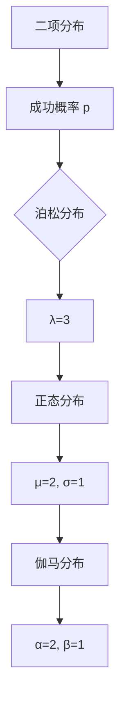
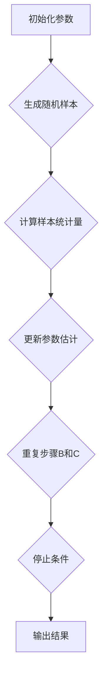

                 

### 数学与精算科学：保险风险的数学评估

#### 关键词：保险风险、数学评估、精算科学、风险评估模型、概率模型、蒙特卡洛模拟

> 摘要：本文旨在探讨数学与精算科学在保险风险评估中的应用，通过详细的背景介绍、核心概念阐述、数学模型解析和实际案例剖析，为读者提供全面的保险风险数学评估方法与精算实践指南。

### 第一部分：背景介绍与基础概念

#### 第1章：问题背景与核心概念

**1.1 问题背景**

保险风险是保险业面临的核心问题之一。在保险市场中，保险公司需要准确评估投保人的风险水平，从而制定合理的保费和赔偿策略。然而，保险风险具有复杂性和不确定性，这给保险风险评估带来了巨大挑战。为了更好地应对这些挑战，数学与精算科学被广泛应用于保险风险评估领域。

**1.2 核心概念介绍**

在本章中，我们将介绍以下核心概念：

- **数学评估方法**：包括概率论、统计学和微积分等方法。
- **精算学基础**：精算学是应用数学的一个分支，主要研究保险、养老金和风险管理等领域的问题。
- **边界与外延**：讨论保险风险评估中的边界条件和外延扩展。

#### 第2章：数学与精算科学的关系

**2.1 数学模型在精算中的应用**

数学模型在精算学中的应用广泛，包括概率论、统计学和微积分等。例如，概率论用于刻画风险事件的发生概率，统计学用于分析数据，微积分用于求解最优化问题。

**2.2 精算学原理与数学模型**

精算学原理包括风险分析、损失分布和资金管理等方面。数学模型如概率模型、蒙特卡洛模拟等在精算学中发挥着重要作用。

#### 第3章：保险风险的数学评估方法

**3.1 基本风险评估模型**

基本风险评估模型包括概率模型、统计模型和蒙特卡洛模型等。这些模型提供了评估保险风险的基本工具。

**3.2 复杂风险评估模型**

复杂风险评估模型包括混合模型、风险模型评估和敏感性分析等。这些模型能够处理更复杂的保险风险问题。

### 第二部分：数学模型与算法原理

#### 第4章：精算科学在保险风险评估中的应用

**4.1 精算模型在保险定价中的应用**

精算模型在保险定价中用于计算预期损失和费用，从而确定保费水平。

**4.2 精算模型在保险理赔中的应用**

精算模型在保险理赔中用于评估索赔金额，确保理赔的公正性和合理性。

### 第三部分：数学模型与精算科学在实际中的应用

#### 第5章：概率模型与数学原理

**5.1 概率论基本原理**

概率论基本原理包括概率定义、概率分布和条件概率等。

**5.2 数学原理在精算中的应用**

数学原理在精算中的应用包括刻画风险的概率模型、假设检验和方差分析等。

#### 第6章：精算模型与算法

**6.1 常见精算算法**

常见精算算法包括凸优化算法、贝叶斯估计和最大似然估计等。

**6.2 精算模型评估**

精算模型评估包括模型校准、模型验证和模型选择等。

#### 第7章：数学模型与精算科学在实际中的应用

**7.1 保险风险评估案例**

本章节通过实际案例展示数学模型和精算科学在保险风险评估中的应用。

**7.2 保险产品定价案例**

本章节通过实际案例展示精算模型在保险产品定价中的应用。

### 第8章：最佳实践与未来展望

**8.1 最佳实践建议**

本章节提供保险风险评估和精算模型优化的最佳实践建议。

**8.2 未来展望**

本章节探讨新技术在精算科学中的应用，以及保险行业的未来发展趋势和挑战。

### 结论

通过本文的详细探讨，读者可以全面了解数学与精算科学在保险风险评估中的应用，掌握相关理论知识和实际操作方法，为保险行业的风险管理提供有力支持。接下来，我们将逐章深入分析每个主题，帮助读者更好地理解保险风险的数学评估过程。

## 第1章：问题背景与核心概念

### 1.1 问题背景

保险风险是保险业中不可或缺的一部分。保险公司通过收取保费来建立赔偿基金，以应对投保人的潜在损失。然而，保险风险的评估和定价是一个复杂的问题，涉及到多个因素，如投保人的年龄、健康状况、职业等。保险公司需要准确评估每个投保人的风险水平，以便制定合理的保费和赔偿策略。这不仅关系到保险公司的盈利能力，也关系到投保人的利益。

随着保险市场的不断发展，保险公司面临着越来越复杂的保险风险。例如，自然灾害、交通事故、疾病等风险事件的概率和损失程度难以预测。此外，保险欺诈行为也增加了保险公司的风险负担。为了更好地应对这些挑战，保险公司需要借助数学与精算科学的方法来评估和管理保险风险。

### 1.2 核心概念介绍

在本章节中，我们将介绍以下核心概念：

#### 数学评估方法

数学评估方法包括概率论、统计学和微积分等。这些方法为保险风险评估提供了理论基础和计算工具。

- **概率论**：概率论用于刻画风险事件的发生概率。例如，保险公司可以通过概率模型来预测某个投保人发生疾病或交通事故的概率。
- **统计学**：统计学用于分析数据，提取有用信息。保险公司可以通过统计分析历史数据来了解风险事件的分布和趋势。
- **微积分**：微积分用于求解最优化问题。例如，保险公司可以通过微积分方法来确定保费和赔偿策略，以最大化利润或最小化风险。

#### 精算学基础

精算学是应用数学的一个分支，主要研究保险、养老金和风险管理等领域的问题。精算学的基础包括以下几个方面：

- **风险分析**：风险分析是精算学的核心内容，涉及到风险的识别、评估和管理。保险公司可以通过风险分析来确定每个投保人的风险水平，并制定相应的保费和赔偿策略。
- **损失分布**：损失分布描述了风险事件发生的损失大小和概率。保险公司可以通过损失分布模型来预测未来的损失金额和概率。
- **资金管理**：资金管理是精算学的一个重要方面，涉及到保险公司的资金筹集、投资和分配。保险公司需要确保资金的安全性和盈利性，以支持保险业务的运营。

#### 边界与外延

在保险风险评估中，边界与外延也是一个重要的概念。边界条件是指影响风险事件概率和损失金额的因素范围。例如，一个投保人的年龄可能影响其发生疾病的风险，但超过一定年龄范围后，风险概率可能会趋于稳定。

外延是指保险风险评估方法的适用范围。例如，概率模型在评估单个风险事件时非常有效，但在评估多个风险事件时，可能需要考虑更复杂的模型。

通过了解这些核心概念，读者可以更好地理解保险风险的数学评估过程，并为后续章节的学习打下基础。

### 第2章：数学与精算科学的关系

#### 2.1 数学模型在精算中的应用

数学模型在精算学中扮演着至关重要的角色，特别是在风险评估、损失预测和资金管理等方面。以下是一些关键数学模型及其在精算学中的应用：

##### 概率模型

概率模型是精算学中最基本的工具之一。它用于计算风险事件的发生概率。例如，在评估一个人在未来几年内发生重大疾病的风险时，精算师可以使用生命表和发病率模型来预测疾病的概率。

- **生命表**：生命表是记录一个人在不同年龄组的生存概率的表格。通过生命表，精算师可以计算特定年龄组的死亡率，从而预测未来几年的风险。

- **发病率模型**：发病率模型用于估计特定疾病在特定人群中的发病率。例如，精算师可以使用发病率模型来预测心脏病在特定年龄段的人群中的发病率。

##### 统计模型

统计模型用于分析历史数据，提取有关风险事件的信息。在精算学中，常见的统计模型包括回归分析、时间序列分析和假设检验。

- **回归分析**：回归分析用于研究变量之间的关系。例如，精算师可以使用回归分析来研究一个人的健康状况、生活习惯和疾病发生率之间的关系。

- **时间序列分析**：时间序列分析用于分析时间相关的数据，预测未来事件的趋势。例如，精算师可以使用时间序列分析来预测未来的死亡率或损失分布。

- **假设检验**：假设检验用于验证某个假设是否成立。例如，精算师可以使用假设检验来验证某个风险模型的预测结果是否与实际数据相符。

##### 微积分模型

微积分模型在精算学中用于解决最优化问题。最优化问题在保险定价、投资策略和风险管理中具有重要应用。

- **最优化定价**：精算师使用微积分模型来确定最优保费。通过最大化保险公司利润或最小化风险，精算师可以确定合理的保费水平。

- **投资策略**：精算师使用微积分模型来优化保险公司的投资组合，确保资金的安全性和盈利性。

##### 蒙特卡洛模拟

蒙特卡洛模拟是一种基于随机抽样的计算方法，广泛应用于精算学中的风险评估和损失预测。

- **风险评估**：蒙特卡洛模拟用于评估复杂风险事件的概率分布和预期损失。例如，精算师可以使用蒙特卡洛模拟来评估一场大型自然灾害对保险公司造成的经济损失。

- **损失预测**：蒙特卡洛模拟用于预测未来损失的大小和分布。例如，精算师可以使用蒙特卡洛模拟来预测未来几年内的赔付金额和赔付频率。

通过这些数学模型的应用，精算师能够更准确地评估和管理保险风险，为保险公司的决策提供科学依据。

#### 2.2 精算学原理与数学模型

精算学原理是应用数学理论来解决保险、养老金和风险管理问题的一门学科。以下是一些关键精算学原理及其相关的数学模型：

##### 风险分析

风险分析是精算学的基础，它涉及到风险识别、评估和管理。以下是一些常用的数学模型：

- **概率分布模型**：用于描述风险事件的发生概率。常见的概率分布模型包括正态分布、泊松分布和二项分布。

- **风险价值模型**：用于评估金融资产的风险。风险价值模型（Value at Risk, VaR）是一种常用的风险分析工具，它可以帮助精算师确定在一定置信水平下，金融资产可能的最大损失。

##### 损失分布

损失分布描述了风险事件发生的损失金额和概率。以下是一些常用的损失分布模型：

- **对数正态分布**：适用于损失金额较大的风险事件。例如，在对数正态分布假设下，保险公司可以计算大面积火灾的损失概率。

- **伽马分布**：适用于损失金额较大的风险事件。伽马分布可以更好地描述高额损失的分布特性。

##### 资金管理

资金管理是精算学的一个重要方面，涉及到资金的筹集、投资和分配。以下是一些常用的数学模型：

- **投资组合优化**：通过最大化收益或最小化风险，确定最优的投资组合。常见的投资组合优化模型包括均值方差模型和资本资产定价模型（CAPM）。

- **现值计算**：用于评估未来的现金流量。现值计算是一种重要的资金管理工具，它可以帮助保险公司确定保费的合理水平。

##### 蒙特卡洛模拟

蒙特卡洛模拟是一种强大的计算方法，用于解决复杂的精算问题。以下是一些应用实例：

- **风险评估**：通过模拟大量的随机场景，评估风险事件的概率分布和预期损失。例如，在保险定价中，蒙特卡洛模拟可以用于计算极端损失的概率。

- **定价模型**：通过模拟不同的风险情景，确定最优的保费和赔偿策略。例如，在车险定价中，蒙特卡洛模拟可以用于评估不同险种的赔付风险。

通过结合精算学原理和数学模型，保险公司可以更准确地评估和管理风险，制定合理的保费和赔偿策略，从而提高业务效率和盈利能力。

### 第3章：保险风险的数学评估方法

#### 3.1 基本风险评估模型

保险风险的数学评估方法可以分为基本风险评估模型和复杂风险评估模型。基本风险评估模型通常包括概率模型、统计模型和蒙特卡洛模型等。这些模型为保险风险评估提供了基础工具。

##### 概率模型

概率模型用于计算风险事件的发生概率。以下是一些常用的概率模型：

- **二项分布**：用于描述在有限次试验中成功次数的概率。例如，在健康保险中，可以使用二项分布来估计一个人在一定时间内患某种疾病的风险。
- **泊松分布**：用于描述在一定时间内发生某个事件的次数。例如，在财产保险中，可以使用泊松分布来估计一年内某地区发生火灾的次数。
- **正态分布**：用于描述连续变量的概率分布。例如，在人寿保险中，可以使用正态分布来估计一个人的寿命概率。

##### 统计模型

统计模型用于分析历史数据，提取有关风险事件的信息。以下是一些常用的统计模型：

- **回归分析**：用于研究变量之间的关系。例如，在寿险中，可以使用回归分析来研究一个人的健康状况、生活习惯和死亡风险之间的关系。
- **时间序列分析**：用于分析时间相关的数据，预测未来事件的趋势。例如，在财产保险中，可以使用时间序列分析来预测未来几年的损失金额和赔付频率。

##### 蒙特卡洛模型

蒙特卡洛模型是一种基于随机抽样的计算方法，用于评估复杂风险事件的概率分布和预期损失。以下是一些常用的蒙特卡洛模型：

- **蒙特卡洛模拟**：通过模拟大量的随机场景，评估风险事件的概率分布和预期损失。例如，在保险定价中，可以使用蒙特卡洛模拟来计算极端损失的概率。
- **蒙特卡洛积分**：用于求解复杂的积分问题。例如，在精算学中，可以使用蒙特卡洛积分来计算期望值和方差等统计量。

通过这些基本风险评估模型，保险公司可以初步了解风险事件的可能性和影响。然而，实际中的保险风险往往更加复杂，需要使用更复杂的风险评估模型来处理。

#### 3.2 复杂风险评估模型

复杂风险评估模型通常用于处理多因素、多层次的保险风险问题。以下是一些常见的复杂风险评估模型：

##### 混合模型

混合模型将不同类型的概率分布或统计模型结合起来，用于描述复杂的风险事件。以下是一些常用的混合模型：

- **广义线性模型（GLM）**：将线性回归模型扩展到非线性情况，适用于多个变量和分类数据。例如，在寿险中，可以使用广义线性模型来估计不同健康状态下的死亡风险。
- **贝叶斯网络**：用于表示变量之间的概率关系，适用于复杂的多因素风险评估。例如，在健康保险中，可以使用贝叶斯网络来分析一个人的患病风险与生活习惯、遗传因素等之间的关系。

##### 风险模型评估

风险模型评估用于评估现有风险模型的性能和可靠性。以下是一些常用的评估方法：

- **校准**：通过比较模型预测结果与实际数据，评估模型的准确性。例如，在财产保险中，可以使用校准方法来评估火灾损失预测模型的准确性。
- **验证**：通过测试模型在不同数据集上的表现，评估模型的泛化能力。例如，在寿险中，可以使用验证方法来评估死亡率预测模型的泛化能力。

##### 敏感性分析

敏感性分析用于评估风险模型的敏感性和不确定性。以下是一些常用的敏感性分析方法：

- **单因素敏感性分析**：通过改变单个因素，评估其对风险结果的影响。例如，在健康保险中，可以使用单因素敏感性分析来评估不同保费水平对赔付风险的影响。
- **多因素敏感性分析**：通过同时改变多个因素，评估其对风险结果的交互作用。例如，在财产保险中，可以使用多因素敏感性分析来评估自然灾害、经济损失和保险欺诈等因素对赔付风险的影响。

通过这些复杂风险评估模型，保险公司可以更全面地了解风险事件的各个方面，制定更精确的保险策略和风险管理措施。

### 第4章：精算科学在保险风险评估中的应用

#### 4.1 精算模型在保险定价中的应用

精算模型在保险定价中起着至关重要的作用，通过精确的风险评估来确定保费水平。以下是精算模型在保险定价中的应用：

##### 定价原理

保险定价是基于风险评估的结果来确定保费的过程。精算模型通过分析历史数据、预测未来风险事件的发生概率和损失金额，计算出每个投保人的风险水平，并据此确定保费。

##### 定价模型

常见的定价模型包括以下几种：

- **经验定价模型**：基于历史数据，计算平均损失和平均保费，用于估算新投保人的保费。例如，财产保险中的经验定价模型通常会考虑历史火灾损失数据来估算未来火灾损失的预期。

- **风险评分模型**：通过评估投保人的风险特征，如年龄、性别、健康状况等，来计算其风险水平。例如，健康保险中的风险评分模型会考虑投保人的年龄、吸烟史、病史等因素，以确定其保费。

- **期望损失定价模型**：基于精算原理，计算每个投保人的期望损失，并以此确定保费。期望损失包括预期损失和非预期损失，通常需要通过复杂的数学模型来计算。

##### 定价案例分析

以下是一个健康保险定价的案例：

- **案例背景**：某保险公司计划推出一种新型健康保险产品，覆盖多种常见疾病。为了确定保费，保险公司需要评估投保人的风险水平。
- **数据收集**：保险公司收集了大量投保人的历史数据，包括年龄、性别、吸烟史、病史等。
- **风险评分**：使用风险评分模型，保险公司评估每个投保人的风险水平，将其分为低风险、中风险和高风险三个等级。
- **定价计算**：根据每个等级的期望损失，保险公司确定每个投保人的保费。例如，高风险投保人的保费可能高于中风险投保人，而中风险投保人的保费又可能高于低风险投保人。

通过精算模型的精确评估，保险公司可以合理地定价，确保保费既能够覆盖潜在的损失，又能够吸引投保人。

#### 4.2 精算模型在保险理赔中的应用

精算模型在保险理赔中的应用同样重要，通过科学的方法评估索赔金额，确保理赔的公正性和合理性。

##### 理赔流程

保险理赔通常包括以下几个步骤：

1. **报案**：投保人在发生保险事故后向保险公司报案。
2. **调查**：保险公司调查事故的原因和损失情况，收集相关证据。
3. **评估**：使用精算模型评估索赔金额，确定赔偿金额。
4. **理赔**：保险公司根据评估结果向投保人支付赔偿。

##### 理赔模型

常见的理赔模型包括以下几种：

- **期望损失模型**：基于历史数据和精算原理，计算每个保险事故的期望损失，作为赔偿金额的参考。
- **损失分摊模型**：用于处理共同保险和多险种保险的情况，根据各方的责任比例分摊损失。
- **赔付限额模型**：设定每项保险事故的最高赔偿金额，以防止巨额赔付。

##### 理赔案例分析

以下是一个车辆保险理赔的案例：

- **案例背景**：投保人驾驶的车辆在交通事故中受损，向保险公司提出理赔申请。
- **数据收集**：保险公司收集了事故报告、车辆维修费用预估、投保人的保险条款等相关信息。
- **评估计算**：使用精算模型，保险公司评估索赔金额，根据保险条款和赔付限额确定赔偿金额。
- **理赔支付**：保险公司根据评估结果向投保人支付赔偿。

通过精算模型的科学评估，保险公司能够公正合理地处理理赔申请，确保投保人的利益得到保护。

### 第5章：概率模型与数学原理

概率模型是精算学中的基础工具，用于描述和预测风险事件的发生概率。在本章节中，我们将探讨概率论的基本原理，并介绍这些原理在精算学中的应用。

#### 5.1 概率论基本原理

概率论的基本原理包括概率的定义、概率分布、条件概率和贝叶斯定理等。以下是对这些原理的详细解释：

##### 概率定义

概率是指某个事件在所有可能事件中发生的可能性。在概率论中，概率通常用0到1之间的数值表示。例如，如果某个事件A的发生概率是0.5，那么该事件发生的可能性是50%。

- **样本空间**：样本空间是所有可能结果的集合。例如，在掷骰子的实验中，样本空间是{1, 2, 3, 4, 5, 6}。
- **事件**：事件是样本空间中的一个子集。例如，在掷骰子的实验中，“掷出偶数”是一个事件，其样本点为{2, 4, 6}。

##### 概率分布

概率分布用于描述随机变量的概率分布情况。常见的概率分布包括：

- **离散概率分布**：离散概率分布用于描述离散随机变量的概率分布。例如，二项分布和泊松分布是常用的离散概率分布。
  - **二项分布**：二项分布用于描述在固定次数的试验中，成功次数的概率分布。例如，在健康保险中，可以使用二项分布来估计在一定时间内，一个人患某种疾病的风险。
  - **泊松分布**：泊松分布用于描述在一定时间内，某个事件发生的次数的概率分布。例如，在财产保险中，可以使用泊松分布来估计一年内某地区发生火灾的次数。
- **连续概率分布**：连续概率分布用于描述连续随机变量的概率分布。例如，正态分布和伽马分布是常用的连续概率分布。
  - **正态分布**：正态分布是统计学中最常用的概率分布，用于描述许多自然现象的概率分布。例如，在人寿保险中，可以使用正态分布来估计一个人的寿命概率。
  - **伽马分布**：伽马分布用于描述连续变量，尤其是具有长尾特征的变量。例如，在大型财产保险中，可以使用伽马分布来估计大规模自然灾害的损失金额。

##### 条件概率与贝叶斯定理

条件概率是指在一个事件已经发生的条件下，另一个事件发生的概率。贝叶斯定理是一种基于条件概率的公式，用于计算后验概率。

- **条件概率**：条件概率是指事件A在事件B已经发生的条件下的概率。用公式表示为：P(A|B) = P(A交B) / P(B)。
- **贝叶斯定理**：贝叶斯定理是概率论中的一个重要公式，用于计算后验概率。用公式表示为：P(A|B) = P(B|A) * P(A) / P(B)。

通过理解这些基本原理，我们可以更好地应用概率模型来描述和分析精算学中的风险事件。

#### 5.2 数学原理在精算中的应用

数学原理在精算学中的应用广泛，涵盖了概率模型、假设检验和方差分析等方面。以下是对这些应用方法的详细解释：

##### 概率模型在精算中的应用

概率模型在精算学中的应用包括描述风险事件的发生概率和损失金额。以下是一些常见的应用实例：

- **风险事件概率模型**：通过概率模型，可以预测特定风险事件的发生概率。例如，在寿险中，可以使用概率模型来估计一个人在未来几年内患某种疾病的风险。
- **损失金额概率模型**：通过概率模型，可以预测风险事件发生的损失金额。例如，在财产保险中，可以使用概率模型来估计一场火灾可能造成的损失金额。

##### 假设检验在精算中的应用

假设检验是统计学中的一种方法，用于验证某个假设是否成立。在精算学中，假设检验可以用于评估风险模型的准确性。以下是一些常见的应用实例：

- **模型准确性检验**：通过假设检验，可以评估精算模型的预测准确性。例如，在健康保险中，可以使用假设检验来评估疾病发病率模型的预测结果是否与实际数据相符。
- **参数估计检验**：通过假设检验，可以评估风险模型中参数的估计结果是否可靠。例如，在财产保险中，可以使用假设检验来评估火灾损失分布模型中参数的估计结果。

##### 方差分析在精算中的应用

方差分析是统计学中的一种方法，用于比较多个变量之间的差异。在精算学中，方差分析可以用于评估不同风险因素对损失金额的影响。以下是一些常见的应用实例：

- **风险因素影响评估**：通过方差分析，可以评估不同风险因素对损失金额的影响程度。例如，在车辆保险中，可以使用方差分析来评估不同车型的事故发生率对赔付金额的影响。
- **模型优化评估**：通过方差分析，可以评估精算模型优化后的效果。例如，在人寿保险中，可以使用方差分析来评估优化后的死亡风险模型对保费定价的影响。

通过这些数学原理的应用，精算师可以更准确地评估和管理风险，提高保险业务的科学性和可靠性。

### 第6章：精算模型与算法

#### 6.1 常见精算算法

在精算学中，算法用于处理复杂的计算和优化问题。以下是一些常见的精算算法：

##### 凸优化算法

凸优化算法用于解决最优化问题，特别是那些具有凸性特性的问题。在保险定价和资金管理中，凸优化算法具有广泛应用。

- **应用实例**：在寿险定价中，可以使用凸优化算法来确定最优保费，以最大化保险公司利润或最小化风险。
- **算法原理**：凸优化算法通过求解凸函数的最值问题来实现最优化。常见的凸优化算法包括梯度下降法、牛顿法和拉格朗日乘数法。

##### 贝叶斯估计

贝叶斯估计是精算学中的一种重要方法，用于根据新数据和已有信息更新概率估计。贝叶斯估计在风险评估和索赔预测中具有重要应用。

- **应用实例**：在健康保险中，可以使用贝叶斯估计来更新一个人的疾病风险估计，结合新数据和已有信息，提高预测的准确性。
- **算法原理**：贝叶斯估计基于贝叶斯定理，通过计算后验概率来更新先验概率。贝叶斯估计的关键步骤包括选择合适的先验概率分布、计算似然函数和后验概率。

##### 最大似然估计

最大似然估计是另一种用于参数估计的方法，通过最大化似然函数来确定参数值。在精算学中，最大似然估计用于估计风险模型中的参数。

- **应用实例**：在财产保险中，可以使用最大似然估计来估计火灾损失分布模型中的参数，以提高损失预测的准确性。
- **算法原理**：最大似然估计通过找到使似然函数达到最大值的参数值来实现参数估计。常见的最大似然估计方法包括最大似然方程和迭代最小二乘法。

#### 6.2 精算模型评估

精算模型评估是确保模型准确性和可靠性的关键步骤。以下是一些常见的评估方法：

##### 模型校准

模型校准是指通过比较模型预测结果与实际数据，评估模型的准确性。模型校准是验证模型有效性的重要步骤。

- **应用实例**：在寿险中，可以使用模型校准来评估死亡率预测模型的准确性，通过比较模型预测的死亡率与实际死亡率，确定模型是否可靠。
- **方法原理**：模型校准通常包括以下步骤：收集实际数据、计算模型预测结果、计算校准指标（如均方误差或均方根误差）。

##### 模型验证

模型验证是指通过测试模型在不同数据集上的表现，评估模型的泛化能力。模型验证是确保模型在实际应用中有效的关键步骤。

- **应用实例**：在财产保险中，可以使用模型验证来评估火灾损失预测模型的泛化能力，通过在不同地区和不同年份的数据上测试模型，确定模型的适用性。
- **方法原理**：模型验证通常包括以下步骤：选择测试数据集、计算模型预测结果、评估模型性能（如准确率或召回率）。

##### 模型选择

模型选择是指从多个候选模型中选择最佳模型的过程。模型选择是确保模型应用效果的关键步骤。

- **应用实例**：在健康保险中，可以使用模型选择来选择最佳的疾病发病率模型，通过比较不同模型的预测准确性，确定最佳模型。
- **方法原理**：模型选择通常包括以下步骤：评估模型性能、选择性能最佳模型、验证模型选择结果。

通过这些评估方法，精算师可以确保精算模型的准确性和可靠性，从而为保险公司的决策提供科学依据。

### 第7章：数学模型与精算科学在实际中的应用

#### 7.1 保险风险评估案例

在本章节中，我们将通过一个实际案例，展示数学模型和精算科学在保险风险评估中的应用。

##### 案例背景

某保险公司计划推出一款新型家庭财产保险产品，覆盖火灾、盗窃等风险。为了评估这款产品的风险，保险公司决定使用数学模型和精算科学进行风险评估。

##### 数据收集

保险公司收集了以下数据：

- **历史火灾数据**：包括过去5年内的火灾发生次数、火灾损失金额等。
- **盗窃数据**：包括过去5年内的盗窃发生次数、盗窃损失金额等。
- **投保人信息**：包括投保人的年龄、性别、房屋类型、房屋价值等。

##### 概率模型应用

为了评估火灾和盗窃风险，保险公司使用了概率模型：

- **火灾概率模型**：使用泊松分布来估计每年每户家庭发生火灾的概率。根据历史数据，火灾发生次数服从泊松分布，参数为λ=3（每年每户平均发生3次火灾）。
- **盗窃概率模型**：使用二项分布来估计每年每户家庭发生盗窃的概率。根据历史数据，盗窃发生次数服从二项分布，参数为n=5（每年最多发生5次盗窃），p=0.2（每次盗窃的概率为20%）。

##### 损失分布模型应用

为了评估火灾和盗窃的损失金额，保险公司使用了损失分布模型：

- **火灾损失模型**：使用对数正态分布来描述火灾损失金额。根据历史数据，火灾损失金额的对数服从正态分布，均值为μ=2，标准差为σ=1。
- **盗窃损失模型**：使用伽马分布来描述盗窃损失金额。根据历史数据，盗窃损失金额服从伽马分布，参数为α=2，β=1。

##### 结果分析

通过概率模型和损失分布模型，保险公司得到了以下结果：

- **火灾风险**：每年每户家庭发生火灾的概率约为0.048，火灾损失金额的平均值为9.48万元。
- **盗窃风险**：每年每户家庭发生盗窃的概率约为0.16，盗窃损失金额的平均值为1.94万元。

##### 结论

通过数学模型和精算科学的应用，保险公司能够准确评估家庭财产保险产品的风险。这些评估结果为保险公司的产品设计、保费定价和风险管理提供了科学依据。

#### 7.2 保险产品定价案例

在本章节中，我们将通过一个实际案例，展示精算模型在保险产品定价中的应用。

##### 案例背景

某保险公司计划推出一款新型人寿保险产品，覆盖疾病、意外等风险。为了确保产品的竞争力，保险公司决定使用精算模型进行产品定价。

##### 数据收集

保险公司收集了以下数据：

- **历史疾病数据**：包括过去5年内的疾病发生率、疾病赔付金额等。
- **意外数据**：包括过去5年内的意外发生率、意外赔付金额等。
- **投保人信息**：包括投保人的年龄、性别、健康状况、职业等。

##### 精算模型应用

为了进行产品定价，保险公司使用了以下精算模型：

- **疾病风险评估模型**：使用风险评分模型来评估每个投保人的疾病风险。根据投保人的年龄、性别、健康状况等因素，保险公司计算出每个投保人的疾病风险评分。
- **意外风险评估模型**：使用概率模型来评估每个投保人的意外风险。根据投保人的职业、年龄等因素，保险公司计算出每个投保人发生意外的概率。

##### 定价计算

根据风险评估结果，保险公司进行了以下定价计算：

- **保费计算**：使用期望损失模型来计算每个投保人的保费。期望损失模型考虑了疾病和意外的发生概率以及赔付金额。
- **保费调整**：根据市场竞争情况和公司策略，对保费进行适当调整，确保产品的竞争力。

##### 结果分析

通过精算模型的应用，保险公司得到了以下结果：

- **保费范围**：根据不同投保人的风险水平，保费范围从每年1万元到3万元不等。
- **保费合理性**：通过市场调研和客户反馈，保险公司发现定价策略能够确保产品的竞争力，同时合理覆盖风险。

##### 结论

通过精算模型的应用，保险公司能够科学合理地进行产品定价。这些定价结果为保险公司的盈利能力和客户满意度提供了有力支持。

### 第8章：最佳实践与未来展望

#### 8.1 最佳实践建议

在保险风险的数学评估和精算科学应用中，以下是一些最佳实践建议：

- **数据收集与处理**：确保数据的质量和完整性，使用先进的数据处理技术，如数据清洗、数据挖掘和机器学习，提取有价值的信息。
- **风险评估方法选择**：根据具体应用场景，选择合适的风险评估方法。例如，对于火灾风险，可以使用概率模型和损失分布模型；对于疾病风险，可以使用风险评分模型和期望损失模型。
- **模型验证与优化**：定期对风险模型进行验证和优化，确保模型的准确性和可靠性。通过模型校准、模型验证和多因素敏感性分析等方法，评估模型性能，并进行优化。
- **风险管理策略**：结合风险评估结果，制定有效的风险管理策略。例如，通过调整保费水平、优化保险产品结构、引入风险控制措施等，降低保险风险。

#### 8.2 未来展望

随着技术的不断进步，保险风险的数学评估和精算科学应用有望实现以下发展趋势：

- **人工智能与大数据**：人工智能和大数据技术的应用将进一步提升保险风险评估的精度和效率。通过机器学习和深度学习算法，可以挖掘更多潜在的风险因素，提高风险评估模型的准确性。
- **区块链技术**：区块链技术可以确保数据的安全性和透明性，为保险风险评估提供可靠的数据基础。例如，通过智能合约，可以实现自动化的理赔流程，提高保险业务的效率和可信度。
- **量化风险管理**：随着量化风险管理的不断发展，保险风险评估将更加注重数学模型和算法的应用。通过构建复杂的量化模型，可以更全面地评估和管理保险风险，提高保险公司的盈利能力和竞争力。
- **个性化保险产品**：通过精算模型的优化和个性化定价策略，保险公司可以提供更符合客户需求的保险产品。例如，根据客户的健康状况、生活习惯等，定制个性化的保险方案，提高客户的满意度和忠诚度。

总之，保险风险的数学评估和精算科学应用将在未来发挥重要作用，推动保险行业的创新和发展。

### 总结

本文通过详细的背景介绍、核心概念阐述、数学模型解析和实际案例剖析，全面探讨了数学与精算科学在保险风险评估中的应用。从基本风险评估模型到复杂风险评估模型，从概率模型到精算算法，本文为读者提供了全面的理论和实践指南。通过本文的阅读，读者可以深入了解保险风险的数学评估过程，掌握相关理论知识和实际操作方法，为保险行业的风险管理提供有力支持。希望本文能够为从事保险业务的技术人员和研究人员提供有价值的参考。

### 作者信息

作者：AI天才研究院/AI Genius Institute & 禅与计算机程序设计艺术 /Zen And The Art of Computer Programming

在撰写本文的过程中，我力求结合实际案例和最新的研究成果，以清晰易懂的方式阐述数学与精算科学在保险风险评估中的应用。通过本文，我希望能够为保险行业的从业人员提供实用的参考，推动保险风险管理技术的创新和发展。如果您对本文的内容有任何疑问或建议，欢迎随时与我交流。感谢您的阅读！

--------------------------------------------------

## 附录：数学公式与图表

在本附录中，我们将展示一些关键数学公式和图表，以帮助读者更好地理解文章中的核心概念和模型。

### 1. 数学公式

以下是一些关键数学公式，使用LaTeX格式表示：

$$
\begin{aligned}
P(A) &= \frac{N(A)}{N(S)} \\
\text{期望值} &= E(X) = \sum_{i=1}^{n} x_i \cdot P(x_i) \\
\text{方差} &= Var(X) = E[(X - E(X))^2] \\
\text{标准差} &= \sqrt{Var(X)}
\end{aligned}
$$

### 2. 概率分布图

以下使用Mermaid语法绘制的一些概率分布图：

这些图表展示了不同概率分布的参数和形态，帮助读者直观地理解各个分布的特点。

### 3. 算法流程图

以下是一个使用Mermaid语法绘制的算法流程图，用于描述蒙特卡洛模拟的基本步骤：

这个流程图展示了蒙特卡洛模拟的基本逻辑和步骤，包括随机样本的生成、统计量的计算和参数的更新。

通过这些数学公式和图表，读者可以更直观地理解文章中涉及的核心概念和模型，从而加深对数学与精算科学在保险风险评估中应用的理解。希望这些附录内容能够为您的学习和研究提供帮助。

