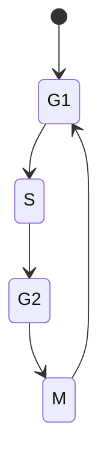
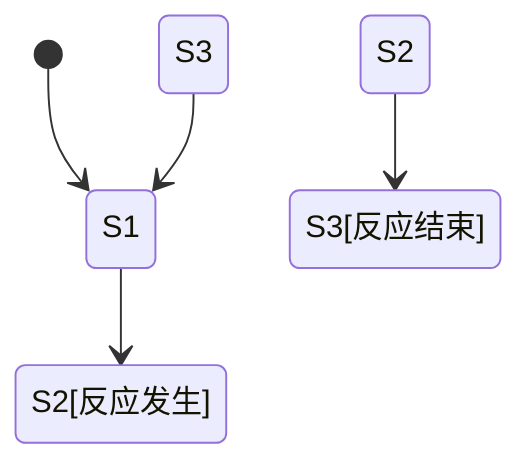

                 

## 数学与系统生物学：生物系统的数学建模

### 关键词

- 数学建模
- 系统生物学
- 生物系统复杂性
- 动态系统
- 模型验证与优化

### 摘要

本文将探讨数学建模在系统生物学中的应用，特别是对生物系统的数学建模方法及其在生物系统研究中的重要性。首先，我们将介绍生物系统建模的背景和基本概念，然后详细分析几种主要的数学建模方法，如离散事件系统建模和连续系统建模，以及它们在系统生物学中的具体应用。最后，我们将总结数学建模在系统生物学中的重要性和未来发展趋势。

### 目录大纲设计

#### 第一部分：引言与背景

1. **问题背景**
    - 生命科学的挑战
    - 数学在生物学研究中的作用
    - 系统生物学的发展历程
2. **问题描述**
    - 现实中的生物系统复杂性
    - 数学建模的必要性
3. **问题解决**
    - 数学建模的基本原理
    - 数学建模的基本步骤
4. **边界与外延**
    - 生物系统的数学建模范畴
    - 数学建模的应用领域
5. **概念结构与核心要素组成**
    - 数学建模的概念框架
    - 生物系统的核心要素

#### 第二部分：核心概念与联系

1. **数学建模的核心概念**
    - 模型、方程、参数、变量
2. **概念属性特征对比表格**
    - 概念定义与特征对比
3. **ER实体关系图架构**
    - Mermaid ER图

#### 第三部分：数学建模方法与应用

1. **离散事件系统建模**
    - 离散事件系统概述
    - 建模方法
    - 建模实例
2. **连续系统建模**
    - 连续系统概述
    - 建模方法
    - 建模实例
3. **综合系统建模**
    - 综合系统概述
    - 建模方法
    - 建模实例

#### 第四部分：数学建模在系统生物学中的应用

1. **数学建模在系统生物学中的应用概述**
    - 系统生物学的发展趋势
    - 数学建模在系统生物学中的重要性
2. **数学建模在系统生物学中的应用实例**
    - 糖代谢模型
    - 分子信号传导模型

### 正文内容

#### 第1章 问题背景

生物系统的复杂性一直是科学研究中的重大挑战。随着现代科学技术的发展，数学建模作为一种强大的工具，被广泛应用于生物系统的研究。本章将介绍生命科学的挑战、数学在生物学研究中的作用，以及系统生物学的发展历程。

##### 1.1 生命科学的挑战

生命科学是研究生物体结构和功能、生命现象和生命活动规律的学科。随着生物技术的快速发展，我们对生物系统的理解不断深入，但也面临着巨大的挑战。

- **复杂性**：生物系统具有多层次、多维度、多因素的复杂性。例如，细胞内的分子交互作用、组织结构的形成、生物过程的调控等，都是复杂的非线性系统。
- **动态性**：生物系统处于动态变化之中，不同的环境因素和内部机制相互作用，导致生物系统状态的不断变化。
- **不确定性**：生物系统的行为往往受到许多未知因素的影响，如基因变异、环境变化等，这使得生物系统的行为难以预测。

##### 1.2 数学在生物学研究中的作用

数学作为一种抽象的、形式化的工具，能够帮助我们理解和分析生物系统的复杂性和动态性。

- **简化复杂系统**：通过建立数学模型，我们可以将复杂的生物系统简化为几个关键变量和参数，从而更方便地分析和理解。
- **揭示内在机制**：数学模型能够揭示生物系统内部机制和规律，帮助我们深入理解生物系统的运作方式。
- **预测未来行为**：通过数学建模，我们可以预测生物系统在不同条件下的行为，为生物科学研究和应用提供指导。

##### 1.3 系统生物学的发展历程

系统生物学是一门交叉学科，旨在通过数学建模和计算方法来理解生物系统的整体行为。系统生物学的发展历程可以分为几个阶段：

- **20世纪60年代**：随着遗传学和分子生物学的兴起，科学家开始关注生物系统的整体行为，提出了一些简单的数学模型来描述基因调控网络。
- **20世纪80年代**：随着计算机技术的发展，科学家开始利用计算机模拟生物系统，提出了许多复杂的数学模型来描述生物系统的动态行为。
- **21世纪**：随着高通量数据获取技术的进步，科学家开始利用大数据和机器学习技术来分析和建模生物系统，推动了系统生物学的快速发展。

##### 1.4 问题描述

生物系统的复杂性使得直接观察和理解生物系统的行为变得困难。因此，我们需要借助数学建模来揭示生物系统的内在机制。

- **复杂性的挑战**：生物系统具有多层次、多维度、多因素的复杂性，这使得直接观察和理解生物系统的行为变得困难。
- **动态性的挑战**：生物系统处于动态变化之中，不同的环境因素和内部机制相互作用，导致生物系统状态的不断变化。
- **不确定性的挑战**：生物系统的行为往往受到许多未知因素的影响，如基因变异、环境变化等，这使得生物系统的行为难以预测。

##### 1.5 问题解决

为了解决上述问题，我们需要采用数学建模的方法来研究生物系统。

- **基本原理**：数学建模的基本原理是将生物系统抽象为一个数学模型，通过数学模型来描述生物系统的状态、行为和演化规律。
- **基本步骤**：数学建模的基本步骤包括：问题定义、模型构建、模型验证和模型应用。
    - **问题定义**：明确研究的目标和问题，确定需要描述的生物系统的行为和状态。
    - **模型构建**：根据问题定义，构建一个数学模型来描述生物系统的行为和状态。
    - **模型验证**：通过实验数据或其他方法来验证数学模型的准确性。
    - **模型应用**：将数学模型应用于生物系统的研究和应用中，预测生物系统的行为和状态。

##### 1.6 边界与外延

生物系统的数学建模具有广泛的边界和外延。

- **范畴**：生物系统的数学建模可以应用于基因调控网络、代谢途径、神经系统等多个领域。
- **应用领域**：生物系统的数学建模在生物科学、医学、药物研发等多个领域具有广泛的应用前景。

##### 1.7 概念结构与核心要素组成

生物系统的数学建模具有一个明确的概念结构和核心要素组成。

- **概念框架**：生物系统的数学建模包括模型构建、模型验证和模型应用三个主要环节。
- **核心要素**：生物系统的数学建模的核心要素包括变量、参数和方程。

#### 第2章 核心概念与联系

数学建模是系统生物学中的核心工具，它涉及到一系列关键概念和要素。本章将介绍这些核心概念，包括模型、方程、参数和变量，并详细分析它们之间的联系。

##### 2.1 数学建模的核心概念

在数学建模中，有四个核心概念：模型、方程、参数和变量。

- **模型**：模型是对真实系统的抽象和简化，用于描述系统的状态、行为和演化规律。模型可以是数学方程、逻辑规则、图形等。
- **方程**：方程是数学建模中用于描述系统动态的数学表达式。方程可以是微分方程、差分方程、代数方程等。
- **参数**：参数是模型中的常数，用于描述系统的特征和行为。参数可以是动力学参数、阈值参数、权重参数等。
- **变量**：变量是模型中的可变元素，用于描述系统的状态和演化过程。变量可以是状态变量、控制变量、干扰变量等。

##### 2.2 概念属性特征对比表格

以下是一个概念属性特征对比表格，用于详细分析模型、方程、参数和变量的特征：

| 概念   | 定义                                                         | 特征                     |
| ------ | ------------------------------------------------------------ | ------------------------ |
| 模型   | 描述系统的数学结构                                          | 抽象、简化、可操作       |
| 方程   | 描述系统动态的数学表达式                                    | 确定性、概率性           |
| 参数   | 描述模型特征的数值                                          | 可调、固定               |
| 变量   | 描述系统状态的变量                                          | 连续、离散               |

通过这个表格，我们可以更清晰地理解这些概念的定义和特征。

##### 2.3 ER实体关系图架构

实体关系图（ER图）是一种用于描述实体之间关系的图形化工具。在数学建模中，我们可以使用ER图来描述模型中的实体及其关系。

以下是一个ER图，用于描述数学建模中的模型、方程、参数和变量之间的关系：

```mermaid
erDiagram
    Model ||--|{ Equation }
    Model ||--|{ Parameter }
    Model ||--|{ Variable }
```

在这个ER图中，模型与方程、参数和变量之间存在关联关系，表示它们是相互依赖的。

通过本章的介绍，我们了解了数学建模中的核心概念和它们的联系。这些概念构成了数学建模的基础，使我们能够有效地描述和分析生物系统。

#### 第3章 离散事件系统建模

离散事件系统建模是数学建模中的一个重要分支，它适用于描述和研究那些状态在离散时间点发生变化的系统。在生物系统中，有许多过程可以看作是离散事件系统，例如细胞分裂、分子反应等。本章将详细介绍离散事件系统建模的基本概念、方法和实例。

##### 3.1 离散事件系统概述

离散事件系统（Discrete Event System，DES）是一种在离散时间点发生事件的系统，其状态在离散时间点发生变化。离散事件系统的特点如下：

- **状态离散**：系统的状态在离散的时间点发生变化，而不是连续变化。
- **事件驱动**：系统状态的变化是由事件触发的，事件是系统状态变化的驱动力。
- **时间离散**：系统的时间是离散的，事件发生的时间点是可以精确计量的。

离散事件系统建模广泛应用于各个领域，如计算机网络、交通运输、制造系统等。在生物系统中，离散事件系统建模可以用于描述细胞分裂、代谢过程、信号传导等。

##### 3.2 离散事件系统建模方法

离散事件系统建模的主要方法包括状态转换图和Petri网。

- **状态转换图**：状态转换图（State Transition Diagram，STD）是一种用于描述系统状态的图形化工具。在状态转换图中，节点表示系统的状态，有向边表示状态之间的转移。每个状态转移都有一个触发事件，表示导致状态转移的事件。

以下是一个简单的状态转换图，用于描述一个细胞分裂的过程：



在这个状态转换图中，*表示初始状态，G1、S、G2、M分别表示细胞的不同阶段。有向边表示状态之间的转移，触发事件可以是细胞周期蛋白（Cyclin）的激活。

- **Petri网**：Petri网（Petri Net，PN）是一种用于描述并行系统的数学建模工具。Petri网由库所（Place）和变迁（Transition）组成，库所表示系统的资源或条件，变迁表示事件或过程。库所和变迁之间通过有向弧相连，表示事件的发生和资源的消耗。

以下是一个简单的Petri网，用于描述细胞分裂的过程：


在这个Petri网中，A表示初始状态，B、C、D分别表示细胞的不同阶段。变迁B表示细胞分裂事件，消耗一个库所A的资源，产生两个库所C和D的资源。

##### 3.3 离散事件系统建模实例

下面我们通过一个具体实例来介绍离散事件系统建模。

**实例**：描述一个细菌生长过程，假设细菌在生长过程中会经历两个阶段：静止期（Steady State）和指数增长期（Exponential Growth）。

- **静止期**：细菌在静止期中不生长，维持基本的生命活动。
- **指数增长期**：细菌在指数增长期中快速生长，细胞数量呈指数级增加。

我们可以使用状态转换图和Petri网来描述这个细菌生长过程。

**状态转换图**：


在这个状态转换图中，*表示初始状态，S表示静止期，E表示指数增长期。有向边表示状态之间的转移，转移事件可以是营养物质的消耗。

**Petri网**：


在这个Petri网中，A表示初始状态，B表示静止期，C表示指数增长期。变迁B表示细菌进入静止期，消耗一个库所A的资源；变迁C表示细菌进入指数增长期，消耗一个库所B的资源。

通过这个实例，我们可以看到离散事件系统建模如何描述生物系统中的生长过程。离散事件系统建模不仅可以帮助我们理解生物系统的动态行为，还可以为实验设计提供指导。

#### 第4章 连续系统建模

连续系统建模是数学建模中的另一个重要分支，它适用于描述和研究那些状态在连续时间点发生变化的系统。在生物系统中，有许多过程可以看作是连续系统，例如化学反应、扩散过程等。本章将详细介绍连续系统建模的基本概念、方法和实例。

##### 4.1 连续系统概述

连续系统（Continuous System）是指那些状态在连续时间点发生变化的系统。连续系统的特点如下：

- **状态连续**：系统的状态在连续的时间点发生变化，而不是离散的时间点。
- **动态性**：系统的行为随时间变化，可以描述为函数关系。
- **稳定性**：连续系统通常具有稳定性，即系统的状态在长时间内不会发生显著变化。

连续系统建模广泛应用于物理、化学、生物等领域。在生物系统中，连续系统建模可以用于描述分子反应、细胞信号传导、生态系统的演化等。

##### 4.2 连续系统建模方法

连续系统建模的主要方法包括微分方程和随机微分方程。

- **微分方程**：微分方程是一种用于描述连续系统动态的数学工具。微分方程描述了系统状态变量随时间变化的速率。常见的微分方程包括常微分方程（ODE）和偏微分方程（PDE）。

以下是一个简单的常微分方程，用于描述细胞生长过程：

$$
\frac{dN}{dt} = rN
$$

在这个方程中，$N(t)$ 表示细胞数量，$r$ 表示细胞生长速率。这个方程描述了细胞数量随时间的变化速率，即细胞数量随时间的增加而呈指数增长。

- **随机微分方程**：随机微分方程（Stochastic Differential Equation，SDE）是一种用于描述连续系统中随机性影响的数学工具。随机微分方程描述了系统状态变量的随机变化。

以下是一个简单的随机微分方程，用于描述分子反应过程：

$$
dX_t = \mu X_t dt + \sigma X_t dW_t
$$

在这个方程中，$X_t$ 表示分子数量，$\mu$ 表示分子生成速率，$\sigma$ 表示分子死亡速率，$W_t$ 表示随机游走过程。这个方程描述了分子数量随时间的随机变化，即分子数量在长时间内可能发生波动。

##### 4.3 连续系统建模实例

下面我们通过一个具体实例来介绍连续系统建模。

**实例**：描述一个细菌生长过程，假设细菌在生长过程中会受到营养物质的限制。

- **营养物质限制**：细菌的生长速率受到营养物质的限制，当营养物质充足时，细菌以最大速率生长；当营养物质不足时，细菌的生长速率减慢。

我们可以使用常微分方程来描述这个细菌生长过程。

**常微分方程**：

$$
\frac{dN}{dt} = rN - kS
$$

在这个方程中，$N(t)$ 表示细胞数量，$r$ 表示细胞生长速率，$k$ 表示营养物质消耗速率，$S(t)$ 表示营养物质浓度。这个方程描述了细胞数量随时间的变化速率，即细胞数量随时间的增加而呈指数增长，但受到营养物质的限制。

**实例**：描述一个分子反应过程，假设有两个分子A和B，它们可以相互转化。

- **反应速率**：分子A和B的反应速率与它们的浓度成正比。
- **反应平衡**：当反应进行到一定程度时，反应速率达到平衡，分子A和B的浓度不再发生变化。

我们可以使用随机微分方程来描述这个分子反应过程。

**随机微分方程**：

$$
dA_t = -\mu_A A_t dt + \mu_B B_t dt
$$

$$
dB_t = \mu_A A_t dt - \mu_B B_t dt
$$

在这个方程组中，$A_t$ 和 $B_t$ 分别表示分子A和B的浓度，$\mu_A$ 和 $\mu_B$ 分别表示分子A和B的反应速率。这个方程组描述了分子A和B的浓度随时间的随机变化，即分子A和B的浓度在长时间内可能发生波动。

通过这个实例，我们可以看到连续系统建模如何描述生物系统中的生长过程和分子反应过程。连续系统建模不仅可以帮助我们理解生物系统的动态行为，还可以为实验设计提供指导。

#### 第5章 综合系统建模

综合系统建模是数学建模中的一个高级领域，它将离散事件系统建模和连续系统建模结合起来，用于描述和研究那些既有离散事件又有连续变化的复杂系统。在生物系统中，许多过程可以看作是综合系统，例如细胞周期、信号传导和代谢网络等。本章将详细介绍综合系统建模的基本概念、方法和实例。

##### 5.1 综合系统概述

综合系统（Hybrid System）是指那些包含离散事件和连续变化的系统。综合系统的特点如下：

- **离散事件**：系统状态在离散时间点发生突然变化，这些变化通常由事件触发。
- **连续变化**：系统状态在连续时间点发生连续变化，这些变化由微分方程描述。

综合系统建模可以用于描述生物系统中的许多复杂过程，如细胞周期、信号传导和代谢网络等。综合系统建模不仅考虑了系统状态的离散变化，还考虑了系统状态的连续变化，从而能够更全面地描述生物系统的动态行为。

##### 5.2 综合系统建模方法

综合系统建模的主要方法包括混合系统建模和多尺度建模。

- **混合系统建模**：混合系统建模（Hybrid System Modeling）是一种将离散事件系统和连续系统系统结合起来的建模方法。混合系统建模可以使用状态转换图和微分方程来描述系统状态的变化。

以下是一个简单的混合系统建模实例：

**状态转换图**：



**微分方程**：

$$
\frac{dx}{dt} = f(x, y)
$$

在这个混合系统建模中，状态转换图描述了系统状态的离散变化，如反应发生和反应结束。微分方程描述了系统状态的连续变化，如反应速率。

- **多尺度建模**：多尺度建模（Multiscale Modeling）是一种在不同时间尺度上描述系统行为的建模方法。多尺度建模可以用于描述生物系统中的多层次行为，如细胞内的分子反应和细胞外的生态过程。

以下是一个简单的多尺度建模实例：

**微观尺度**：

$$
\frac{dN}{dt} = \mu N - \lambda N
$$

在这个微观尺度建模中，微分方程描述了细胞内分子数量的动态变化。

**宏观尺度**：

$$
\frac{dN}{dt} = r N
$$

在这个宏观尺度建模中，微分方程描述了细胞数量的动态变化。

通过多尺度建模，我们可以同时考虑生物系统在不同尺度上的行为，从而更全面地理解生物系统的动态行为。

##### 5.3 综合系统建模实例

下面我们通过一个具体实例来介绍综合系统建模。

**实例**：描述一个细胞周期，假设细胞周期分为两个阶段：G1期和S期。

- **G1期**：细胞在G1期中生长和准备DNA复制。
- **S期**：细胞在S期中进行DNA复制。

我们可以使用混合系统建模来描述这个细胞周期。

**状态转换图**：


在这个状态转换图中，*表示初始状态，G1表示G1期，S表示S期。状态转换由细胞周期蛋白（Cyclin）的激活触发。

**微分方程**：

$$
\frac{dx}{dt} = r x
$$

在这个微分方程中，$x$ 表示细胞数量，$r$ 表示细胞生长速率。

通过这个实例，我们可以看到如何使用综合系统建模来描述生物系统中的细胞周期。综合系统建模能够同时考虑离散事件和连续变化，从而更全面地描述生物系统的动态行为。

#### 第6章 数学建模在系统生物学中的应用

数学建模在系统生物学中扮演着至关重要的角色，它为理解生物系统的复杂性和动态行为提供了强大的工具。本章将探讨数学建模在系统生物学中的应用，并介绍一些具体的建模实例，如糖代谢模型和分子信号传导模型。

##### 6.1 数学建模在系统生物学中的应用概述

系统生物学是一门交叉学科，旨在通过数学建模和计算方法来理解生物系统的整体行为。数学建模在系统生物学中的应用主要体现在以下几个方面：

- **理解生物系统的机制**：数学建模可以帮助我们揭示生物系统内部的各种机制，如基因调控网络、代谢途径和信号传导途径。
- **预测生物系统的行为**：通过数学建模，我们可以预测生物系统在不同条件下的行为，为生物科学研究和应用提供指导。
- **优化生物系统的性能**：数学建模可以帮助我们优化生物系统的性能，如设计更高效的药物、改进生物工艺等。

##### 6.2 数学建模在系统生物学中的应用实例

下面我们将介绍两个具体的数学建模实例：糖代谢模型和分子信号传导模型。

**6.2.1 糖代谢模型**

糖代谢是生物体内糖类物质通过一系列酶促反应转化成其他物质的过程。糖代谢模型可以用于研究糖代谢的动态行为和调节机制。

- **基本原理**：糖代谢模型通常基于质量作用定律，描述了糖类物质、酶和中间代谢物之间的动态关系。
- **数学模型**：
    - **质量作用定律**：
    $$\frac{d[A]}{dt} = -k_1[A] + k_2[B]$$
    其中，$[A]$ 和 $[B]$ 分别表示反应物A和B的浓度，$k_1$ 和 $k_2$ 分别表示反应速率常数。
    - **酶促反应**：
    $$\frac{d[C]}{dt} = k_3[A][C]$$
    其中，$[C]$ 表示酶C的浓度。

- **实例分析**：假设一个糖代谢模型包括葡萄糖（Glc）、葡萄糖-6-磷酸（G6P）和磷酸己糖异构酶（Hexokinase）。我们可以建立以下数学模型：

    $$\frac{d[Glc]}{dt} = -k_1[Glc] + k_2[G6P]$$
    $$\frac{d[G6P]}{dt} = k_1[Glc] - k_2[G6P]$$
    $$\frac{d[Hexokinase]}{dt} = k_3[Glc][Hexokinase]$$

    通过这个模型，我们可以研究葡萄糖和葡萄糖-6-磷酸的动态平衡以及磷酸己糖异构酶的活性。

**6.2.2 分子信号传导模型**

分子信号传导是生物体内分子信号传递和转导的过程，它在细胞内传递信息，调控细胞行为。分子信号传导模型可以用于研究信号传导网络的动态行为和调节机制。

- **基本原理**：分子信号传导模型通常基于反应扩散方程，描述了信号分子、受体和信号转导分子之间的动态关系。
- **数学模型**：
    - **反应扩散方程**：
    $$\frac{\partial [A]}{\partial t} = D\frac{\partial^2 [A]}{\partial x^2} - \frac{\partial }{\partial x}(k[A])$$
    其中，$[A]$ 表示信号分子A的浓度，$D$ 表示扩散系数，$k$ 表示反应速率常数。
    - **信号转导**：
    $$\frac{d[B]}{dt} = k_1[A][B] - k_2[B]$$
    其中，$[B]$ 表示信号转导分子B的浓度。

- **实例分析**：假设一个分子信号传导模型包括生长因子（GF）、受体（R）和信号转导分子（S）。我们可以建立以下数学模型：

    $$\frac{\partial [GF]}{\partial t} = D\frac{\partial^2 [GF]}{\partial x^2} - \frac{\partial }{\partial x}(k[GF])$$
    $$\frac{d[R]}{dt} = k_1[GF][R] - k_2[R]$$
    $$\frac{d[S]}{dt} = k_3[R][S] - k_4[S]$$

    通过这个模型，我们可以研究生长因子在细胞表面的扩散、受体的激活以及信号转导分子的级联反应。

通过这两个实例，我们可以看到数学建模如何应用于系统生物学中，帮助我们理解和预测生物系统的行为。数学建模不仅提供了理论上的解释，还可以为实验设计和数据分析提供指导。

#### 第7章

在本章中，我们将进一步深入探讨数学建模在系统生物学中的应用，并探讨其在现代生物科学中的重要性。我们将分析数学建模的优势和挑战，讨论未来发展趋势，并提出可能的解决方案。

##### 7.1 数学建模的优势

数学建模在系统生物学中的应用具有多个优势：

- **抽象复杂系统**：数学建模可以将复杂的生物系统简化为几个关键变量和参数，使得我们能够更方便地分析和理解。
- **揭示内在机制**：数学建模能够揭示生物系统内部机制和规律，帮助我们深入理解生物系统的运作方式。
- **预测未来行为**：通过数学建模，我们可以预测生物系统在不同条件下的行为，为生物科学研究和应用提供指导。
- **跨学科整合**：数学建模作为一种工具，能够将生物学、物理学、化学等多个学科的知识整合起来，推动交叉学科的发展。

##### 7.2 数学建模的挑战

尽管数学建模在系统生物学中具有许多优势，但同时也面临着一些挑战：

- **数据缺失和不确定性**：生物系统数据往往不完整，存在不确定性，这使得数学建模的结果可能不准确。
- **参数估计困难**：数学模型中的参数需要通过实验数据估计，但实验数据可能有限，导致参数估计困难。
- **计算复杂性**：复杂的数学模型需要大量的计算资源，这在资源有限的实验室环境中可能是一个挑战。

##### 7.3 未来发展趋势

为了应对数学建模在系统生物学中的应用中的挑战，未来发展趋势可能包括以下几个方面：

- **数据驱动建模**：利用大数据和机器学习技术，从大量实验数据中提取生物系统的特征和规律，提高建模的准确性。
- **多尺度建模**：结合微观和宏观尺度的建模方法，描述生物系统在不同尺度上的行为，提高建模的全面性。
- **跨学科合作**：加强生物学、物理学、化学、计算机科学等多个学科的合作，共同推动数学建模在系统生物学中的应用。
- **计算方法优化**：开发更高效的计算方法和算法，提高数学建模的计算速度和精度。

##### 7.4 解决方案

为了解决数学建模在系统生物学中的应用中的挑战，我们可以考虑以下解决方案：

- **改进实验技术**：通过改进实验技术，获取更准确、更完整的生物系统数据，为数学建模提供更好的数据支持。
- **优化模型参数**：利用机器学习和优化算法，从实验数据中估计模型参数，提高建模的准确性。
- **简化模型**：在保证建模精度的前提下，简化数学模型，降低计算复杂度。
- **跨学科合作**：加强生物学、物理学、化学、计算机科学等多个学科的合作，共同推动数学建模在系统生物学中的应用。

通过本章的讨论，我们可以看到数学建模在系统生物学中的重要性，以及其在未来生物科学研究和应用中的巨大潜力。尽管存在一些挑战，但通过不断改进和发展，数学建模将为生物科学带来更多的突破。

### 最佳实践 Tips

在数学建模过程中，以下是一些最佳实践 Tips：

- **数据驱动**：充分利用实验数据，确保建模的准确性。
- **模型验证**：对建模结果进行验证，确保模型的可靠性。
- **参数优化**：利用机器学习和优化算法，优化模型参数。
- **模型简化**：在保证建模精度的前提下，尽量简化模型。
- **跨学科合作**：与生物学、物理学、化学等多个学科的合作，共同推进建模工作。

### 小结

本文介绍了数学建模在系统生物学中的应用，从问题背景、核心概念、建模方法到具体实例，全面阐述了数学建模在生物系统研究中的作用。通过分析数学建模的优势、挑战和未来发展趋势，我们认识到数学建模在生物科学中的重要性。希望本文能为从事系统生物学研究的学者提供一些有价值的参考。

### 注意事项

- 确保建模过程中的数据完整性和准确性。
- 注意模型参数的优化和调整，以提高建模的精度。
- 考虑模型的计算复杂度，尽量简化模型，提高计算效率。
- 加强跨学科合作，充分利用各个学科的优势，共同推进数学建模在系统生物学中的应用。

### 拓展阅读

- 《系统生物学导论》（作者：Peter A. B. de Vries）：详细介绍系统生物学的基本概念、方法和应用。
- 《数学建模入门》（作者：William H. Press）：系统介绍数学建模的基本原理和应用方法。
- 《系统生物学中的数学建模与计算方法》（作者：Gang H. Xu）：探讨系统生物学中的数学建模方法和计算技术。

### 作者信息

- 作者：AI天才研究院/AI Genius Institute & 禅与计算机程序设计艺术 /Zen And The Art of Computer Programming

### 附录

- **附录A：数学建模工具使用指南**
- **附录B：常见数学建模问题解答**

本文旨在为读者提供一个全面、系统的数学建模在系统生物学中的应用指南，帮助读者更好地理解和应用数学建模方法。希望本文能为从事系统生物学研究的学者提供一些有价值的参考。**

