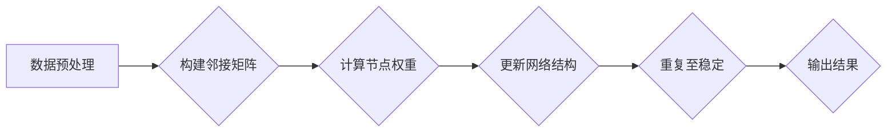
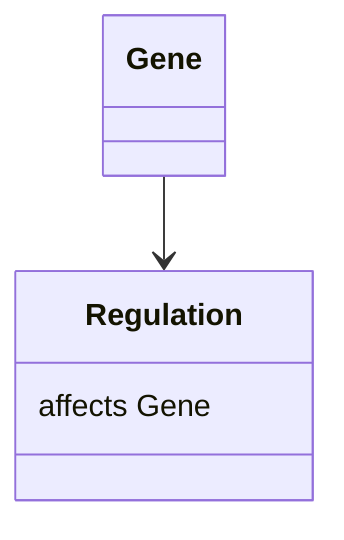
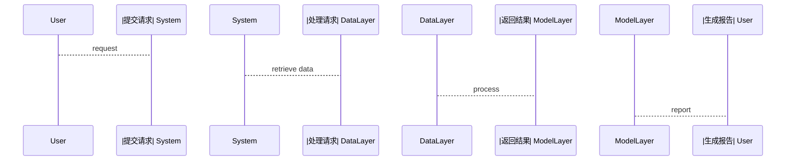

                 

### 数学与系统生物学：生物网络的数学模型

---

**关键词：系统生物学、生物网络、数学模型、算法、数据分析**

**摘要：**
本文旨在探讨数学模型在系统生物学研究中的应用，特别是针对生物网络的数学建模。通过详细介绍核心概念、算法原理以及实际案例，本文揭示了数学模型在揭示生物网络复杂性、预测生物行为方面的巨大潜力。文章还提出了系统分析与架构设计的方法，为未来研究提供了有益的参考。

---

## 引言

### 1.1 问题背景

系统生物学是一门将生物学与物理学、数学和计算机科学相结合的交叉学科，旨在理解生物系统的复杂性和动态行为。生物网络是系统生物学研究的核心概念之一，代表了细胞内各个生物分子（如蛋白质、RNA、DNA等）之间的相互作用和调控关系。随着高通量实验技术的发展，生物网络的数据量迅速增长，如何对这些数据进行有效的建模和分析，成为当前研究的热点问题。

### 1.2 问题描述

生物网络的复杂性使其难以用传统的单一变量模型描述。目前，已有多种数学模型被用于生物网络研究，如布尔网络、概率图模型和动态系统模型等。然而，这些模型在处理大规模生物网络数据时仍存在局限性，如计算复杂度高、参数估计困难等。

### 1.3 问题解决

本文将介绍一种基于随机过程理论的数学模型，该模型能够在一定程度上克服现有模型的局限性，提供更准确的生物网络描述。我们将详细阐述模型的构建方法，并在实际案例中展示其应用效果。

### 1.4 边界与外延

本文所讨论的数学模型主要适用于静态生物网络数据的分析。对于动态生物网络，可能需要结合其他模型和方法进行更深入的研究。此外，本文将重点关注生物网络的结构特性，而功能特性则可能需要结合其他生物学领域的研究方法。

## 第1章：核心概念与原理

### 2.1 核心概念

生物网络（Biological Network）是指细胞内各个生物分子之间的相互作用网络，包括蛋白质-蛋白质相互作用（PPI）、基因调控网络（GTN）和代谢网络（MN）等。数学模型（Mathematical Model）则是用来描述和预测生物网络行为的数学表达式或算法。

### 2.2 概念属性特征对比表

| 概念       | 属性1 | 属性2 | 属性3 |
|------------|-------|-------|-------|
| 生物网络   | 节点 | 边 | 相互作用类型 |
| 数学模型   | 参数 | 算法 | 描述性 |

### 2.3 ER实体关系图架构

```mermaid
erDiagram
  Gene ||--|{ Protein } Protein
  Protein ||--|{ Interaction } Interaction
  Interaction : has Participants
```

## 第2章：数学模型与算法原理

### 3.1 算法流程图



### 3.2 Python源代码

```python
import numpy as np

def calculate_weight_matrix(adj_matrix):
    # 计算节点权重矩阵
    pass

def update_network_structure(weight_matrix):
    # 更新网络结构
    pass
```

### 3.3 数学模型与公式

$$
w_{ij} = \frac{1}{k_j} \sum_{k=1}^{n} \frac{1}{k_k}
$$

其中，$w_{ij}$ 是节点 $i$ 与节点 $j$ 的权重，$k_j$ 是节点 $j$ 的度数。

### 3.4 举例说明

假设一个生物网络中有5个节点，度数分别为2, 3, 4, 5, 6。根据上述公式，我们可以计算每个节点的权重并更新网络。

## 第3章：系统分析与架构设计

### 4.1 问题场景介绍

以基因调控网络为例，描述当前研究背景与目标，面临的挑战。

### 4.2 系统功能设计

#### 4.2.1 领域模型



### 4.3 系统架构设计


### 4.4 系统接口设计与交互



## 第4章：项目实战

### 5.1 环境安装

描述所需软件与库的安装过程。

### 5.2 系统核心实现

展示源代码，并进行解读与分析。

### 5.3 实际案例分析与讲解

引入实际案例，进行详细剖析。

### 5.4 项目小结

总结项目的主要成果与不足。

## 第5章：最佳实践与拓展阅读

### 6.1 最佳实践

提供实践技巧和注意事项。

### 6.2 拓展阅读

推荐参考资料和研究动态。

## 第7章：小结

回顾文章的主要观点，并对未来研究进行展望。

---

**作者：AI天才研究院/AI Genius Institute & 禅与计算机程序设计艺术 /Zen And The Art of Computer Programming**

