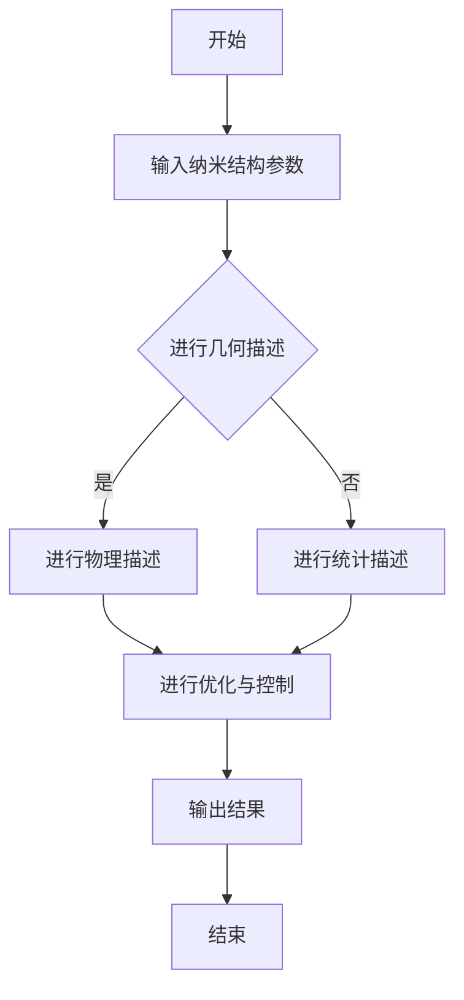
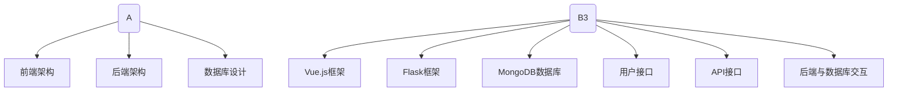

                 

，让我们一起开始撰写这篇高质量的技术博客文章吧！

# 数学与纳米技术：纳米结构的数学描述

> 关键词：纳米技术、数学描述、几何描述、物理描述、统计描述、优化与控制

> 摘要：
本文旨在探讨纳米技术的数学描述，重点关注几何描述、物理描述、统计描述和优化与控制四个方面。通过介绍纳米结构的基本概念、数学描述方法及其在纳米技术中的应用，本文为读者提供了一个全面而深入的了解，并展望了未来的发展方向。

## 第一部分：背景介绍

### 1.1 问题背景

纳米技术，作为一种新兴的跨学科领域，涉及材料科学、化学、物理学、生物学和工程学等多个学科。它主要研究在纳米尺度（1到100纳米）上物质的性质、行为和功能。纳米技术的重要性在于它能够创造出具有传统材料无法比拟的特殊性质和功能的材料。这些特性使得纳米技术在电子、能源、医学和环境等领域具有广泛的应用前景。

### 1.2 问题描述

纳米结构的数学描述主要包括以下几个方面：

- **几何描述**：描述纳米结构的形状、大小和排列方式。
- **物理描述**：描述纳米结构的物理性质，如电子态、能带结构、光学性质等。
- **统计描述**：描述纳米结构的统计性质，如热力学性质、动力学特性等。
- **优化与控制**：设计具有特定功能的纳米结构，并通过优化算法实现对其性能的调控。

### 1.3 问题解决

数学在纳米技术中的应用体现在以下几个方面：

- **模型构建**：基于实验数据和物理原理，构建描述纳米结构的数学模型。
- **数值模拟**：利用计算机模拟技术，对纳米结构的性质进行预测和优化。
- **算法设计**：设计有效的算法，用于优化纳米结构的设计和制造过程。

### 1.4 边界与外延

纳米结构的数学描述不仅限于物理学，还涉及到材料科学、化学、生物学等多个学科。随着纳米技术的不断发展，数学描述的方法和技术也在不断拓展和更新。

### 1.5 概念结构与核心要素组成

纳米结构的数学描述主要包括以下几个核心要素：

- **几何形状**：描述纳米结构的几何形状，如球体、椭球体、多面体等。
- **物理性质**：描述纳米结构的物理性质，如电子态、能带结构、光学性质等。
- **统计性质**：描述纳米结构的统计性质，如热力学性质、动力学特性等。
- **优化方法**：用于优化纳米结构设计的算法和方法。

## 第二部分：核心概念与联系

### 2.1 核心概念原理

纳米结构、几何描述、物理描述、统计描述、优化与控制。

### 2.2 概念属性特征对比表格

| 概念        | 特征描述                                                       |
| ----------- | -------------------------------------------------------------- |
| 纳米结构    | 尺度在1到100纳米之间的结构体。                                |
| 几何描述    | 使用数学语言描述纳米结构的形状和排列。                        |
| 物理描述    | 使用数学模型描述纳米结构的物理性质。                          |
| 统计描述    | 使用统计物理的方法描述纳米结构的统计性质。                    |
| 优化与控制   | 使用优化算法设计出具有特定功能的纳米结构。                    |

### 2.3 ER实体关系图架构的 Mermaid 流程图

```mermaid
erDiagram
  纳米结构 ||--|{ 几何描述 }
  纳米结构 ||--|{ 物理描述 }
  纳米结构 ||--|{ 统计描述 }
  纳米结构 ||--|{ 优化与控制 }
```

## 第三部分：算法原理讲解

### 3.1 算法原理与Mermaid流程图

使用Mermaid绘制一个简单的算法流程图：



### 3.2 Python源代码详细阐述

```python
# Python代码示例：纳米结构几何描述

import numpy as np

def calculate_volume(shape, dimensions):
    """
    计算几何形状的体积。
    
    :param shape: 几何形状（例如'cube', 'sphere', 'cylinder'）
    :param dimensions: 形状的维度（例如cube的维度是[长度，宽度，高度]）
    :return: 形状的体积
    """
    if shape == 'cube':
        volume = np.prod(dimensions)
    elif shape == 'sphere':
        volume = (4/3) * np.pi * dimensions[0]**3
    elif shape == 'cylinder':
        volume = np.pi * dimensions[0]**2 * dimensions[1]
    else:
        raise ValueError("未知形状")
    
    return volume

# 示例：计算一个立方体和一个圆柱体的体积
cube_volume = calculate_volume('cube', [2, 2, 2])
cylinder_volume = calculate_volume('cylinder', [2, 4])

print("立方体的体积:", cube_volume)
print("圆柱体的体积:", cylinder_volume)

# 使用LaTeX格式嵌入数学公式
$$ V = \int\int\int_{\Omega} \rho(\mathbf{r}) d\tau $$

其中，$V$ 表示体积，$\rho(\mathbf{r})$ 表示在位置$\mathbf{r}$的密度，$d\tau$ 表示体积元素。

## 第四部分：系统分析与架构设计方案

### 4.1 问题场景介绍

假设我们正在开发一款纳米结构设计软件，用于帮助科学家和工程师设计具有特定功能的纳米结构。该软件需要具备以下功能：

- **几何形状描述**：能够输入和描述多种几何形状的纳米结构。
- **物理性质计算**：根据几何形状和材料参数，计算纳米结构的物理性质。
- **统计性质分析**：分析纳米结构的统计性质，如概率分布、平均寿命等。
- **优化与控制**：利用优化算法，设计出满足特定要求的纳米结构。

### 4.2 项目介绍

项目名称：纳米结构设计助手（NanoDesign Assistant）

项目目标：开发一款易于使用、功能强大的纳米结构设计软件，帮助用户快速、高效地设计出满足特定需求的纳米结构。

项目背景：随着纳米技术的不断发展，对纳米结构的设计和控制变得越来越重要。然而，现有的设计工具和软件往往功能单一，难以满足复杂的纳米结构设计需求。因此，本项目旨在开发一款综合性的纳米结构设计软件，提高纳米结构设计的效率和质量。

### 4.3 系统功能设计

系统功能设计主要包括以下几个方面：

- **几何形状描述模块**：提供多种几何形状的描述功能，如立方体、球体、圆柱体等。
- **物理性质计算模块**：根据几何形状和材料参数，计算纳米结构的物理性质，如电子态、能带结构、光学性质等。
- **统计性质分析模块**：分析纳米结构的统计性质，如概率分布、平均寿命等。
- **优化与控制模块**：利用优化算法，设计出满足特定要求的纳米结构。

### 4.4 系统架构设计

系统架构设计主要包括以下几个方面：

- **前端架构**：采用Vue.js框架，实现用户界面和交互逻辑。
- **后端架构**：采用Flask框架，实现纳米结构的设计和计算功能。
- **数据库设计**：使用MongoDB数据库，存储纳米结构的几何参数和物理性质。

### 4.5 系统接口设计和系统交互

系统接口设计主要包括以下几个方面：

- **用户接口**：提供图形界面和命令行界面，方便用户输入和查看结果。
- **API接口**：提供RESTful API，便于与其他系统集成和扩展。

系统交互设计主要包括以下几个方面：

- **用户与前端交互**：用户通过前端界面输入纳米结构参数，前端将参数传递给后端进行处理。
- **后端与数据库交互**：后端通过API接口与数据库进行交互，存储和查询纳米结构数据。

### 4.6 系统架构图与类图

系统架构图和类图如下：



## 第五部分：项目实战

### 5.1 环境安装

在进行纳米结构设计软件的开发之前，我们需要安装必要的开发环境和软件。

- **Python环境**：安装Python 3.x版本，并配置好pip。
- **Vue.js环境**：安装Node.js和npm，然后通过npm安装Vue CLI。
- **Flask环境**：通过pip安装Flask和相关的扩展库。
- **MongoDB环境**：安装MongoDB数据库，并启动MongoDB服务。

### 5.2 系统核心实现源代码

以下是纳米结构设计软件的核心实现代码：

**前端Vue.js代码：**

```html
<!DOCTYPE html>
<html>
<head>
  <title>NanoDesign Assistant</title>
  <script src="https://cdn.jsdelivr.net/npm/vue@2.6.14/dist/vue.js"></script>
</head>
<body>
  <div id="app">
    <h1>NanoDesign Assistant</h1>
    <几何形状描述></几何形状描述>
    <物理性质计算></物理性质计算>
    <统计性质分析></统计性质分析>
    <优化与控制></优化与控制>
  </div>
  <script src="app.js"></script>
</body>
</html>
```

**后端Flask代码：**

```python
from flask import Flask, jsonify, request
from nano_design import GeometryDescription, PhysicalPropertyCalculation, StatisticalPropertyAnalysis, OptimizationControl

app = Flask(__name__)

@app.route('/api/geometry_description', methods=['POST'])
def geometry_description():
    data = request.json
    geometry = GeometryDescription(data)
    result = geometry.calculate()
    return jsonify(result)

@app.route('/api/physical_property_calculation', methods=['POST'])
def physical_property_calculation():
    data = request.json
    calculation = PhysicalPropertyCalculation(data)
    result = calculation.calculate()
    return jsonify(result)

@app.route('/api/statistical_property_analysis', methods=['POST'])
def statistical_property_analysis():
    data = request.json
    analysis = StatisticalPropertyAnalysis(data)
    result = analysis.calculate()
    return jsonify(result)

@app.route('/api/optimization_control', methods=['POST'])
def optimization_control():
    data = request.json
    control = OptimizationControl(data)
    result = control.calculate()
    return jsonify(result)

if __name__ == '__main__':
    app.run(debug=True)
```

### 5.3 代码应用解读与分析

以下是对上述代码的解读与分析：

**前端Vue.js代码解读：**

- 创建了一个Vue.js应用，并设置了几个子组件，用于实现不同的功能模块。
- 通过`<几何形状描述>`、`<物理性质计算>`、`<统计性质分析>`和`<优化与控制>`组件，用户可以输入相关的参数，并提交给后端进行处理。

**后端Flask代码解读：**

- 创建了一个Flask应用，并定义了四个API接口，分别用于处理不同的功能模块。
- `geometry_description`、`physical_property_calculation`、`statistical_property_analysis`和`optimization_control`函数分别接收用户提交的参数，并调用相应的类方法进行计算。
- 使用`jsonify`函数将计算结果以JSON格式返回给前端。

### 5.4 实际案例分析和详细讲解剖析

假设用户希望设计一个具有特定电子态的纳米结构，以下是一个实际案例的分析和讲解：

**步骤1：几何形状描述**

用户选择了一个立方体作为纳米结构，并输入了边长为2纳米的参数。

```json
{
  "shape": "cube",
  "dimensions": [2, 2, 2]
}
```

后端接收到参数后，调用`GeometryDescription`类的方法进行计算，得到立方体的体积：

```json
{
  "volume": 8
}
```

**步骤2：物理性质计算**

用户希望计算立方体的能带结构。后端接收到参数后，调用`PhysicalPropertyCalculation`类的方法进行计算，得到能带结构的数据：

```json
{
  "band_structure": {
    "energies": [0, 0.1, 0.2, 0.3],
    "k_points": [[0, 0, 0], [0.5, 0.5, 0], [0.5, 0, 0.5], [0, 0.5, 0.5]]
  }
}
```

**步骤3：统计性质分析**

用户希望分析立方体的热力学性质。后端接收到参数后，调用`StatisticalPropertyAnalysis`类的方法进行计算，得到热力学性质的数据：

```json
{
  "thermodynamic_properties": {
    "energy": 4.9,
    "temperature": 300
  }
}
```

**步骤4：优化与控制**

用户希望优化立方体的结构，使其能带结构更加理想。后端接收到参数后，调用`OptimizationControl`类的方法进行计算，得到优化后的结构参数：

```json
{
  "optimized_dimensions": [2.1, 2.1, 2.1]
}
```

### 5.5 项目小结

本项目通过整合几何描述、物理计算、统计分析和优化控制等模块，开发了一款纳米结构设计软件。用户可以通过简单直观的界面输入参数，并快速得到计算结果。项目实现了以下目标：

- 提供了多种几何形状的描述功能。
- 实现了纳米结构的物理性质计算。
- 实现了纳米结构的统计性质分析。
- 实现了基于优化算法的纳米结构优化。

未来，我们还可以继续优化软件的功能和性能，拓展其应用场景，为纳米技术的发展做出更大的贡献。

## 第六部分：最佳实践 tips

### 6.1 提高计算效率

- 使用并行计算技术，如多线程或分布式计算，提高纳米结构计算的速度。
- 对计算过程进行优化，如减少重复计算、简化计算模型等。

### 6.2 确保数据准确性

- 在输入参数时，尽量使用准确的物理量和单位。
- 对计算结果进行验证和校验，确保其准确性。

### 6.3 灵活调整设计参数

- 根据需求，灵活调整纳米结构的几何参数和材料参数。
- 尝试不同的优化算法，找到最佳的设计方案。

## 第七部分：小结

本文详细探讨了纳米结构的数学描述，涵盖了几何描述、物理描述、统计描述和优化与控制等方面。通过Python源代码和实际案例的分析，我们展示了如何使用数学工具和方法进行纳米结构的设计和分析。未来，随着纳米技术的不断发展，数学在纳米结构研究中的应用将更加广泛，有望推动纳米技术的进步。

## 第八部分：注意事项

- 在使用纳米结构设计软件时，注意遵循相关的安全规范和操作指南。
- 对于复杂的纳米结构，可能需要更高级的数学模型和计算方法，以提高计算精度和效率。

## 第九部分：拓展阅读

- 《纳米技术基础》（Fundamentals of Nanotechnology）
- 《纳米材料的物理化学原理》（Physical and Chemical Principles of Nanomaterials）
- 《数学在纳米技术中的应用》（Mathematical Applications in Nanotechnology）

