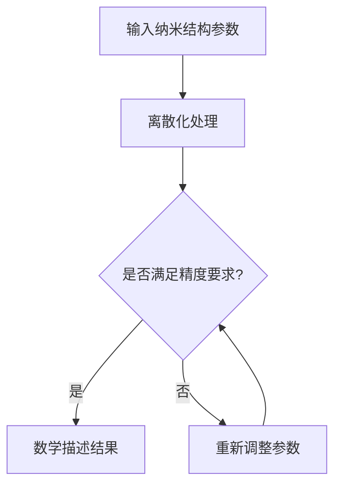
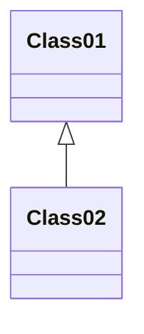
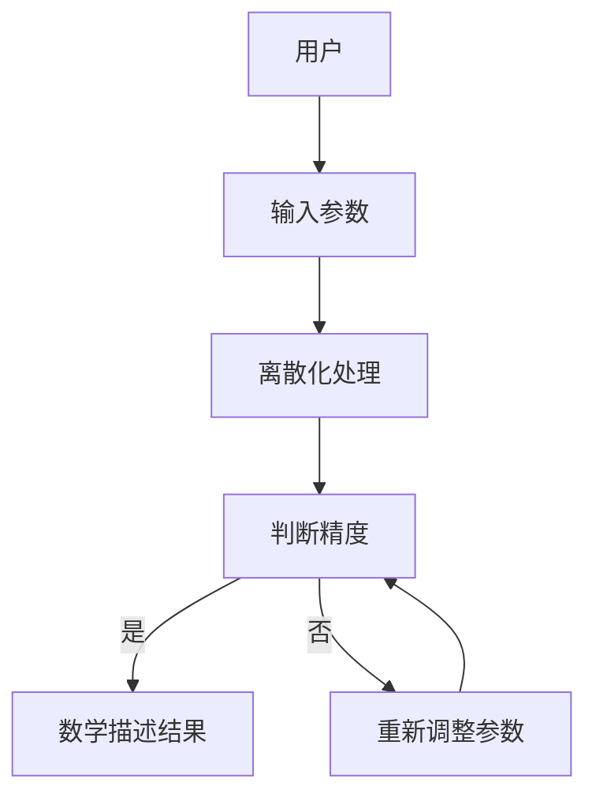
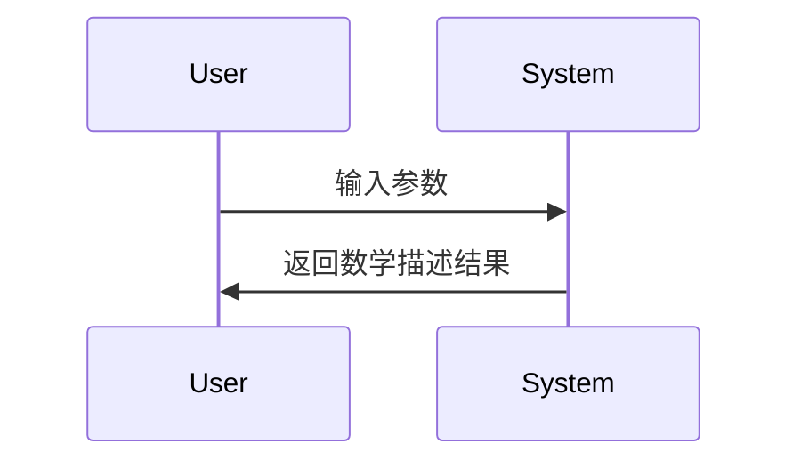

                 

## 数学与纳米技术：纳米结构的数学描述

> 关键词：纳米技术，数学描述，离散化，几何学，算法

> 摘要：本文将从数学与纳米技术的交叉领域出发，探讨纳米结构的数学描述方法。通过对核心概念、算法原理以及系统架构设计的深入剖析，为读者呈现一个全面、系统、易懂的纳米结构数学描述框架。

### 第一部分：背景介绍

#### 第1章：问题背景

**1.1.1 问题背景**

随着科技的迅猛发展，纳米技术在材料科学、电子学、医学等领域展现出了巨大的应用前景。纳米技术涉及对纳米级别（1到100纳米）的物质进行操控和利用，这一领域的快速发展对数学描述方法提出了更高的要求。

- **核心问题**：如何利用数学工具对纳米结构进行精确描述？

**1.1.2 问题描述**

纳米结构的特性决定了传统的描述方法难以满足需求。传统的宏观物理学和材料科学方法在处理纳米尺度现象时，往往无法精确捕捉到纳米结构的复杂特性。因此，需要一种新的数学描述方法，能够在纳米尺度上提供精确、系统、普适的描述。

- **问题描述**：如何利用数学工具对纳米结构进行精确描述？

**1.1.3 问题解决**

为了解决上述问题，我们需要结合数学理论与纳米技术实践，发展新型描述方法。这些方法不仅需要具有高度的精确性，还需要能够适应不同类型纳米结构的特点，从而为纳米技术的研究和应用提供强有力的支持。

- **问题解决**：结合数学理论与纳米技术实践，发展新型描述方法。

**1.1.4 边界与外延**

纳米技术的应用范围非常广泛，从纳米材料到纳米器件，再到各种应用领域，如纳米医学、纳米电子学等。因此，我们的研究范围也将涵盖这些领域，以确保我们的描述方法具有广泛的适用性。

- **边界与外延**：研究范围涵盖纳米材料、纳米器件及其应用。

**1.1.5 概念结构与核心要素组成**

在纳米技术的数学描述中，核心概念包括纳米结构、数学描述方法、应用领域等。这些概念相互关联，共同构成了纳米结构数学描述的理论框架。

- **概念结构与核心要素组成**：纳米结构、数学描述方法、应用领域。

#### 第2章：核心概念与联系

**2.1.1 核心概念**

**纳米结构**：尺寸在1到100纳米之间的结构。这种尺寸范围内的结构具有独特的物理和化学性质，对光、电、热等物理量响应与宏观物质显著不同。

**数学描述方法**：利用数学工具对纳米结构进行精确描述。常见的数学描述方法包括离散化、概率论、几何学等。

**应用领域**：纳米材料、纳米器件及其应用。这些领域涵盖了从基础研究到实际应用的全过程。

**2.1.2 概念属性特征对比表格**

| 概念       | 定义                                                         | 特征                                      |
|------------|--------------------------------------------------------------|-------------------------------------------|
| 纳米结构   | 尺寸在1到100纳米之间的结构                                   | 高精度、多功能、可调性                     |
| 数学描述   | 利用数学工具对纳米结构进行精确描述                           | 精确性、系统性、普适性                     |
| 应用领域   | 纳米材料、纳米器件及其应用                                   | 广泛性、创新性、高价值                     |

**2.1.3 ER实体关系图架构**

```mermaid
erDiagram
  A[纳米结构] ||--|{ B[数学描述] } |
  B ||--|{ C[应用领域] } |
```

#### 第3章：算法原理讲解

**3.1.1 算法流程图**



**3.1.2 Python源代码示例**

```python
def discrete_nano_structure(params):
    # 离散化处理
    discrete_params = ...
    return discrete_params

def is_accuracy_satisfied(params):
    # 判断精度要求
    return ...

def nano_structure_description(params):
    if is_accuracy_satisfied(params):
        result = ...
        return result
    else:
        # 重新调整参数
        new_params = ...
        return nano_structure_description(new_params)
```

**3.1.3 数学模型和数学公式**

$$
f(x) = \sum_{i=1}^{n} w_i \cdot x_i
$$

**3.1.4 举例说明**

假设纳米结构的参数为 \( x_1 = 10, x_2 = 20, w_1 = 0.5, w_2 = 0.5 \)，则其数学描述结果为：

$$
f(x) = 0.5 \cdot 10 + 0.5 \cdot 20 = 15
$$

### 第二部分：系统分析与架构设计

#### 第4章：系统功能设计

**4.1.1 领域模型类图**



#### 第5章：系统架构设计

**5.1.1 系统架构图**



#### 第6章：系统接口设计

**6.1.1 系统接口设计**

- **输入接口**：接收用户输入的纳米结构参数。
- **输出接口**：返回数学描述结果。

#### 第7章：系统交互设计

**7.1.1 系统交互图**



### 第三部分：项目实战

#### 第8章：环境安装

**8.1.1 环境要求**

- Python 3.x
- Numpy 库

**8.1.2 安装步骤**

1. 安装 Python 3.x
2. 使用 pip 安装 Numpy 库

#### 第9章：系统核心实现

**9.1.1 源代码**

```python
# discrete_nano_structure.py
def discrete_nano_structure(params):
    # 离散化处理
    discrete_params = ...
    return discrete_params

# is_accuracy_satisfied.py
def is_accuracy_satisfied(params):
    # 判断精度要求
    return ...

# nano_structure_description.py
def nano_structure_description(params):
    if is_accuracy_satisfied(params):
        result = ...
        return result
    else:
        # 重新调整参数
        new_params = ...
        return nano_structure_description(new_params)
```

#### 第10章：代码应用解读与分析

**10.1.1 代码解读**

1. `discrete_nano_structure` 函数：负责对输入参数进行离散化处理。
2. `is_accuracy_satisfied` 函数：判断离散化后的参数是否满足精度要求。
3. `nano_structure_description` 函数：根据精度要求，进行数学描述。

**10.1.2 分析**

1. 离散化处理：将连续的纳米结构参数转换为离散的数值，以便进行数学描述。
2. 精度判断：确保数学描述的准确性，防止因参数不精确导致的错误结果。
3. 数学描述：利用数学模型对纳米结构进行描述，提供精确的数据分析。

#### 第11章：实际案例分析

**11.1.1 案例背景**

某纳米材料研究团队希望利用数学描述方法，对一种新型纳米材料进行详细分析。

**11.1.2 分析过程**

1. 收集纳米材料参数。
2. 使用 `discrete_nano_structure` 函数进行离散化处理。
3. 使用 `is_accuracy_satisfied` 函数判断精度要求。
4. 使用 `nano_structure_description` 函数进行数学描述，得到结果。

**11.1.3 结果分析**

通过数学描述方法，研究团队得到了纳米材料的精确描述，为后续研究和应用提供了重要数据支持。

### 第四部分：总结与拓展

#### 第12章：最佳实践

**12.1.1 最佳实践**

1. 选择合适的数学描述方法，根据纳米结构的特性进行精确描述。
2. 保证离散化处理和精度判断的准确性，避免因参数不精确导致的错误结果。

**12.1.2 注意事项**

1. 纳米结构的数学描述方法需要结合实际应用场景进行选择和调整。
2. 在实际应用中，要充分考虑纳米结构的复杂性和多样性。

#### 第13章：拓展阅读

**13.1.1 相关文献**

1. 纳米技术综述：《纳米技术：基础、应用与未来》
2. 数学描述方法：《几何学在纳米技术中的应用》

**13.1.2 开源项目**

1. 纳米结构模拟工具：NanoHub
2. 数学描述工具：MATLAB

### 第五部分：作者信息

**作者：AI天才研究院/AI Genius Institute & 禅与计算机程序设计艺术 /Zen And The Art of Computer Programming**

