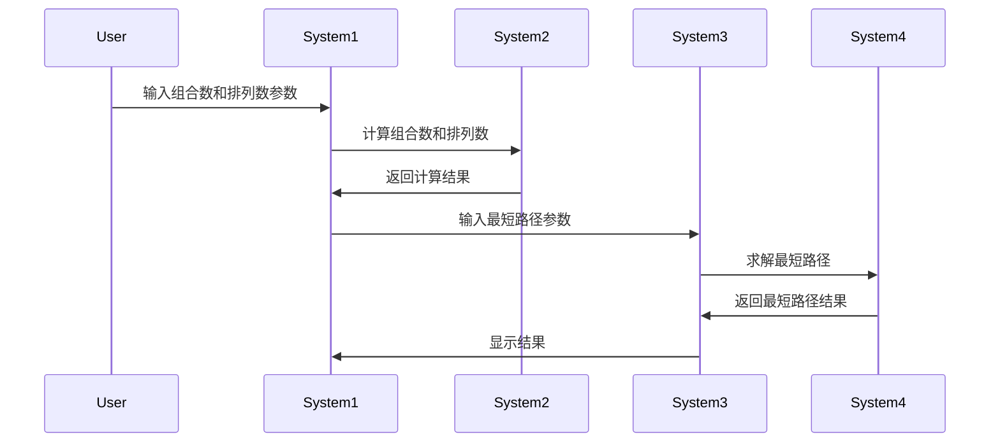

                 

# 数学与组合学：离散结构的数学分析

## 关键词

- 数学
- 组合学
- 离散结构
- 数学模型
- 算法
- 系统设计

## 摘要

本文旨在深入探讨数学与组合学在离散结构中的应用。通过解析核心概念、算法原理和数学模型，我们旨在为读者提供一个全面而深入的技术指南。文章结构分为五个部分：背景介绍、核心概念与联系、算法原理讲解、数学模型与公式讲解、系统分析与架构设计以及项目实战。本文将逐步引导读者了解这些概念，并在实际项目中应用，从而提升读者在离散结构设计和分析中的能力。

## 第一部分：背景介绍

### 第1章 数学与组合学基础

#### 1.1 数学的基本概念

在探讨数学与组合学的应用之前，我们需要了解数学的基本概念。数学是一门研究数量、结构、变化和空间等概念的学科。它的基本概念包括数、函数、集合、几何等。

**核心概念术语说明：**

- **数**：数的概念是数学的基础，包括整数、分数、小数等。
- **函数**：函数是一种关系，它将一个集合中的每个元素与另一个集合中的唯一元素关联起来。
- **集合**：集合是由一些确定的元素组成的整体。
- **几何**：几何研究的是空间中的形状、大小和位置关系。

**问题背景：**

随着计算机科学的发展，数学在计算机科学中的应用变得越来越广泛。离散结构作为计算机科学中的一个重要分支，涵盖了数学中的许多概念和方法。

**问题描述：**

离散结构中的问题往往需要通过数学方法来解决。例如，在图论中，我们需要通过数学方法来求解最短路径问题、最大流问题等。在组合学中，我们需要通过数学方法来计算组合数、排列数等。

**问题解决：**

数学方法包括公理体系、逻辑推理、证明等。通过这些方法，我们可以精确地描述和解决离散结构中的问题。

**边界与外延：**

数学的研究范围非常广泛，包括纯数学和应用数学。在离散结构中，我们主要关注的是应用数学中的内容，如组合数学、图论、数论等。

**概念结构与核心要素组成：**

数学的核心概念包括数、函数、集合、几何等。这些概念相互联系，构成了数学的基本结构。

#### 1.2 组合学的基本概念

**组合学的定义与历史**

组合学是数学的一个分支，主要研究排列、组合及其相关概念。它的起源可以追溯到古希腊，但真正的发展是在19世纪末期和20世纪初期。

**核心概念：**

- **排列**：排列是按照一定顺序排列的一组元素。
- **组合**：组合是不考虑顺序的一组元素。
- **组合数**：组合数是从 n 个不同元素中取出 m 个元素的组合数。
- **排列数**：排列数是从 n 个不同元素中取出 m 个元素的排列数。

**问题背景：**

组合学在计算机科学、密码学、优化算法等领域有广泛的应用。例如，在计算机科学中，组合学方法被用于解决组合优化问题、编码问题等。

**问题描述：**

组合学中的问题往往涉及计数、优化等。例如，如何从一组元素中选出最优的子集，如何设计最优的编码方案等。

**问题解决：**

组合学中常用的是计数方法，如递推关系、生成函数等。通过这些方法，我们可以精确地计算组合数、排列数等。

**边界与外延：**

组合学的研究范围包括排列、组合、图论、数论等。在离散结构中，我们主要关注的是排列和组合。

**概念结构与核心要素组成：**

组合学的核心概念包括排列、组合、组合数、排列数等。这些概念相互联系，构成了组合学的基本结构。

#### 1.3 离散结构的背景

**离散结构的定义**

离散结构是指由离散元素组成的结构，这些元素之间没有连续性。与连续结构（如几何图形、连续函数等）相对。

**离散结构的属性特征对比表格**

| 特征        | 离散结构 | 连续结构 |
|-------------|----------|----------|
| 元素关系    | 离散     | 连续     |
| 位置关系    | 不连续   | 连续     |
| 变化特性    | 突变     | 连续变化 |
| 数据表示    | 有限集合 | 实数集合 |
| 存储方式    | 数组、树 | 图、曲线 |
| 算法设计    | 计算密集 | 计算密集 |
| 应用领域    | 计算机科学、工程 | 物理学、工程 |

**ER实体关系图架构**

在离散结构中，实体关系图（Entity-Relationship Diagram，ERD）是一种常用的数据建模工具，用于描述实体之间的关系。

```mermaid
erDiagram
    Entity1 ||--|{ Entity2 } Entity3
    Entity2 ||--|{ Entity4 }
```

在这个ER图中，`Entity1`、`Entity2`、`Entity3`、`Entity4`是实体，`--|{ }--|`表示实体之间的关系。

**问题背景：**

离散结构在计算机科学中扮演着重要的角色。离散结构理论是计算机科学的基础，广泛应用于算法设计、数据结构、软件工程等领域。

**问题描述：**

离散结构中的问题包括图论问题、组合优化问题、离散概率问题等。这些问题往往具有明确的数学模型，需要使用数学方法来解决。

**问题解决：**

解决离散结构中的问题需要结合数学方法和计算机科学方法。数学方法包括公式推导、证明等，计算机科学方法包括算法设计、数据结构设计等。

**边界与外延：**

离散结构的研究范围包括组合数学、图论、数论等。在计算机科学中，离散结构理论的应用非常广泛，涵盖了算法、数据结构、软件工程等多个领域。

**概念结构与核心要素组成：**

离散结构的核心概念包括离散元素、离散关系、离散变化等。这些概念相互联系，构成了离散结构的基本结构。

### 1.4 本章小结

本章介绍了数学与组合学的基本概念，包括数学的基本概念、组合学的基本概念和离散结构的背景。通过本章的学习，读者可以初步了解数学与组合学在离散结构中的应用。

## 第二部分：核心概念与联系

### 第2章 核心概念解析

#### 2.1 核心概念

**核心概念：组合数学中的基本概念**

组合数学是数学的一个重要分支，主要研究排列、组合及其相关概念。以下是组合数学中的几个核心概念：

- **排列**：排列是按照一定顺序排列的一组元素。排列数是从 n 个不同元素中取出 m 个元素的排列数，记为 P(n, m)。
- **组合**：组合是不考虑顺序的一组元素。组合数是从 n 个不同元素中取出 m 个元素的组合数，记为 C(n, m)。
- **组合数与排列数的关系**：C(n, m) = P(n, m) / m!。
- **生成函数**：生成函数是用于解决组合问题的一种方法。它可以将组合数表示为一个函数，从而简化组合问题的计算。

**问题背景：**

组合数学在计算机科学、密码学、优化算法等领域有广泛的应用。例如，在计算机科学中，组合数学方法被用于解决组合优化问题、编码问题等。

**问题描述：**

组合数学中的问题往往涉及计数、优化等。例如，如何从一组元素中选出最优的子集，如何设计最优的编码方案等。

**问题解决：**

组合数学中常用的是计数方法，如递推关系、生成函数等。通过这些方法，我们可以精确地计算组合数、排列数等。

**边界与外延：**

组合数学的研究范围包括排列、组合、图论、数论等。在计算机科学中，组合数学的应用非常广泛，涵盖了算法、数据结构、软件工程等多个领域。

**概念结构与核心要素组成：**

组合数学的核心概念包括排列、组合、组合数、排列数、生成函数等。这些概念相互联系，构成了组合数学的基本结构。

#### 2.2 概念之间的联系

**组合数学与离散结构的关联**

组合数学与离散结构有着密切的联系。离散结构中的许多问题都可以通过组合数学方法来解决。

- **图论中的组合数学应用**：在图论中，组合数学被用于解决图的基本性质、路径问题、连通性问题等。例如，图的最长路径问题可以通过组合数学中的最长序列方法来解决。
- **组合优化中的离散结构应用**：在组合优化中，离散结构被用于解决最优化问题。例如，在背包问题中，离散结构被用于描述物品和背包的约束条件。
- **密码学中的组合数学应用**：在密码学中，组合数学被用于设计加密算法和破解密码。例如，RSA密码系统就是基于大整数分解问题的组合数学原理。

**问题背景：**

随着计算机科学的发展，组合数学在离散结构中的应用越来越广泛。组合数学方法在计算机科学、密码学、优化算法等领域具有广泛的应用。

**问题描述：**

组合数学在离散结构中的应用包括图论问题、组合优化问题、离散概率问题等。这些问题往往具有明确的数学模型，需要使用数学方法来解决。

**问题解决：**

解决组合数学在离散结构中的应用问题需要结合数学方法和计算机科学方法。数学方法包括公式推导、证明等，计算机科学方法包括算法设计、数据结构设计等。

**边界与外延：**

组合数学在离散结构中的应用范围非常广泛，涵盖了计算机科学、密码学、优化算法等多个领域。在计算机科学中，组合数学的应用具有广泛的前景。

**概念结构与核心要素组成：**

组合数学与离散结构的关联包括图论、组合优化、密码学等。这些关联构成了组合数学在离散结构中的应用基础。

#### 2.3 离散结构中的核心概念应用

**离散结构中的核心概念应用**

在离散结构中，核心概念如排列、组合、图论等有广泛的应用。以下是几个典型的应用场景：

- **组合数学在图论中的应用**：在图论中，组合数学被用于解决图的基本性质、路径问题、连通性问题等。例如，在求解图的最短路径问题时，可以使用组合数学中的贪心算法。
- **组合数学在组合优化中的应用**：在组合优化中，组合数学被用于解决最优化问题。例如，在求解背包问题时，可以使用组合数学中的动态规划方法。
- **组合数学在密码学中的应用**：在密码学中，组合数学被用于设计加密算法和破解密码。例如，在RSA密码系统中，组合数学被用于解决大整数分解问题。

**问题背景：**

随着计算机科学的发展，组合数学在离散结构中的应用越来越广泛。组合数学方法在计算机科学、密码学、优化算法等领域具有广泛的应用。

**问题描述：**

组合数学在离散结构中的应用包括图论问题、组合优化问题、离散概率问题等。这些问题往往具有明确的数学模型，需要使用数学方法来解决。

**问题解决：**

解决组合数学在离散结构中的应用问题需要结合数学方法和计算机科学方法。数学方法包括公式推导、证明等，计算机科学方法包括算法设计、数据结构设计等。

**边界与外延：**

组合数学在离散结构中的应用范围非常广泛，涵盖了计算机科学、密码学、优化算法等多个领域。在计算机科学中，组合数学的应用具有广泛的前景。

**概念结构与核心要素组成：**

组合数学在离散结构中的应用包括图论、组合优化、密码学等。这些应用构成了组合数学在离散结构中的应用基础。

### 2.4 本章小结

本章介绍了组合数学中的核心概念及其在离散结构中的应用。通过本章的学习，读者可以了解组合数学在离散结构中的重要性，以及如何应用组合数学方法解决实际问题。

## 第三部分：算法原理讲解

### 第3章 组合学算法原理

#### 3.1 算法介绍

组合学算法是用于解决组合数学问题的一系列算法。这些算法包括排列算法、组合算法、生成函数算法等。

**问题背景：**

在组合数学中，许多问题都可以通过算法来解决。例如，如何计算组合数、排列数，如何求解最短路径问题、最大流问题等。

**问题描述：**

组合学算法的目的是高效地解决组合数学问题。例如，计算组合数、排列数，求解最短路径问题、最大流问题等。

**问题解决：**

组合学算法包括贪心算法、动态规划算法、分支限界算法等。通过这些算法，我们可以高效地解决组合数学问题。

**边界与外延：**

组合学算法的研究范围包括排列、组合、图论、数论等。在计算机科学中，组合学算法的应用非常广泛，涵盖了算法设计、数据结构、软件工程等多个领域。

**概念结构与核心要素组成：**

组合学算法的核心要素包括算法设计、算法分析、算法实现等。这些要素构成了组合学算法的基本结构。

#### 3.2 算法解析

**经典组合算法**

经典组合算法包括排列算法、组合算法等。以下是这些算法的解析：

- **排列算法**：排列算法用于计算排列数。一个排列数是从 n 个不同元素中取出 m 个元素的排列数，记为 P(n, m)。排列算法可以通过递归或迭代来实现。递归实现的时间复杂度为 O(n!)，迭代实现的时间复杂度为 O(m!)。
- **组合算法**：组合算法用于计算组合数。一个组合数是从 n 个不同元素中取出 m 个元素的组合数，记为 C(n, m)。组合算法可以通过递归或迭代来实现。递归实现的时间复杂度为 O(n^2)，迭代实现的时间复杂度为 O(m)。

**现代组合算法**

现代组合算法包括贪心算法、动态规划算法、分支限界算法等。以下是这些算法的解析：

- **贪心算法**：贪心算法是一种简单的算法设计方法，它通过在每个步骤中选择当前最优解来求解问题。贪心算法适用于求解最优子结构问题，如最短路径问题、最大流问题等。
- **动态规划算法**：动态规划算法是一种求解最优化问题的算法，它通过将问题分解为子问题，并利用子问题的解来求解原问题。动态规划算法适用于求解具有重叠子结构的问题，如背包问题、最短路径问题等。
- **分支限界算法**：分支限界算法是一种用于求解组合优化问题的算法，它通过限制搜索的分支来提高搜索效率。分支限界算法适用于求解大规模组合优化问题，如旅行商问题、作业调度问题等。

**问题背景：**

随着计算机科学的发展，组合学算法在计算机科学中的应用越来越广泛。现代组合算法如贪心算法、动态规划算法、分支限界算法等在解决实际问题中具有广泛的应用。

**问题描述：**

现代组合算法的目的是提高组合学算法的效率，解决大规模组合数学问题。例如，如何高效地计算组合数、排列数，如何求解最短路径问题、最大流问题等。

**问题解决：**

现代组合算法包括贪心算法、动态规划算法、分支限界算法等。通过这些算法，我们可以高效地解决组合数学问题。

**边界与外延：**

现代组合算法的研究范围包括贪心算法、动态规划算法、分支限界算法等。在计算机科学中，现代组合算法的应用非常广泛，涵盖了算法设计、数据结构、软件工程等多个领域。

**概念结构与核心要素组成：**

现代组合算法的核心要素包括算法设计、算法分析、算法实现等。这些要素构成了现代组合算法的基本结构。

#### 3.3 算法应用案例

**经典组合算法应用案例**

- **计算组合数**：计算从5个不同元素中取出2个元素的组合数。使用组合算法计算得到 C(5, 2) = 10。
- **计算排列数**：计算从4个不同元素中取出3个元素的排列数。使用排列算法计算得到 P(4, 3) = 24。

**现代组合算法应用案例**

- **求解最短路径问题**：使用贪心算法求解图的最短路径问题。以图论中的最短路径算法为例，使用贪心算法求解得到的最短路径为 a-b-c-d，总路径长度为6。
- **求解最大流问题**：使用动态规划算法求解图的最大流问题。以网络流算法为例，使用动态规划算法求解得到的最大流值为10。

**问题背景：**

组合学算法在解决实际问题中具有广泛的应用。经典组合算法如排列算法、组合算法等在求解简单组合数学问题时非常有效。现代组合算法如贪心算法、动态规划算法、分支限界算法等在解决大规模组合数学问题时具有显著的优势。

**问题描述：**

通过算法应用案例，我们可以了解经典组合算法和现代组合算法在实际问题中的应用。这些问题包括计算组合数、排列数，求解最短路径问题、最大流问题等。

**问题解决：**

通过经典组合算法和现代组合算法的应用案例，我们可以看到这些算法在解决实际问题中的有效性和效率。

**边界与外延：**

组合学算法的应用范围非常广泛，涵盖了计算机科学、密码学、优化算法等多个领域。在计算机科学中，组合学算法的应用具有广泛的前景。

**概念结构与核心要素组成：**

组合学算法的核心要素包括算法设计、算法分析、算法实现等。这些要素构成了组合学算法的基本结构。

### 3.4 本章小结

本章介绍了组合学算法的基本原理及其应用。通过本章的学习，读者可以了解组合学算法的设计方法、分析方法和应用案例，从而提高在组合数学问题解决中的能力。

## 第四部分：数学模型与公式讲解

### 第4章 组合数学模型

#### 4.1 数学模型介绍

组合数学模型是用于描述和解决组合数学问题的一种数学工具。它通过建立数学模型来描述问题的本质，从而简化问题的解决过程。以下是几个常见的组合数学模型：

- **二项式模型**：二项式模型用于描述在一定条件下，事件发生的概率。它由二项式系数和事件发生的概率组成。
- **生成函数模型**：生成函数模型用于描述序列的生成规律。它将序列的生成规律表示为一个函数，从而简化序列的计算。
- **概率模型**：概率模型用于描述随机事件的发生概率。它通过概率分布函数来描述随机变量的概率分布。

**问题背景：**

在组合数学中，许多问题都可以通过数学模型来解决。数学模型不仅可以帮助我们理解和解决组合数学问题，还可以为其他领域提供重要的理论支持。

**问题描述：**

组合数学模型的应用包括计算组合数、排列数，求解最短路径问题、最大流问题等。这些问题往往具有明确的数学模型，需要使用数学方法来解决。

**问题解决：**

解决组合数学模型中的问题需要结合数学方法和计算机科学方法。数学方法包括公式推导、证明等，计算机科学方法包括算法设计、数据结构设计等。

**边界与外延：**

组合数学模型的研究范围包括二项式模型、生成函数模型、概率模型等。在计算机科学中，组合数学模型的应用非常广泛，涵盖了算法设计、数据结构、软件工程等多个领域。

**概念结构与核心要素组成：**

组合数学模型的核心要素包括数学模型、公式推导、问题解决方法等。这些要素构成了组合数学模型的基本结构。

#### 4.2 公式讲解

在组合数学中，有许多重要的公式，如二项式定理、组合数公式、生成函数公式等。以下是这些公式的讲解：

- **二项式定理**：二项式定理是描述二项式展开的公式。它表示为：
  $$(a + b)^n = \sum_{k=0}^{n} C(n, k) a^{n-k} b^k$$
  其中，C(n, k) 表示组合数，a 和 b 是任意实数。

- **组合数公式**：组合数公式是用于计算组合数的公式。它表示为：
  $$C(n, k) = \frac{n!}{k!(n-k)!}$$
  其中，n 和 k 是正整数。

- **生成函数公式**：生成函数公式是用于计算生成函数的公式。它表示为：
  $$G(x) = \sum_{n=0}^{\infty} a_n x^n$$
  其中，a_n 表示第 n 项的系数。

**问题背景：**

在组合数学中，公式是解决问题的关键。二项式定理、组合数公式、生成函数公式等是组合数学中的基本公式，它们在解决实际问题中具有广泛的应用。

**问题描述：**

组合数学公式主要用于计算组合数、排列数，求解最短路径问题、最大流问题等。这些问题往往可以通过公式推导来解决。

**问题解决：**

解决组合数学公式中的问题需要掌握公式推导的方法。通过公式推导，我们可以将复杂的问题简化为基本的公式计算。

**边界与外延：**

组合数学公式的研究范围包括二项式定理、组合数公式、生成函数公式等。在计算机科学中，组合数学公式具有广泛的应用，涵盖了算法设计、数据结构、软件工程等多个领域。

**概念结构与核心要素组成：**

组合数学公式是组合数学模型的重要组成部分。它包括二项式定理、组合数公式、生成函数公式等，这些公式构成了组合数学公式的基本结构。

#### 4.3 数学公式示例

为了更好地理解组合数学公式，以下是几个数学公式示例：

- **二项式定理示例**：计算 (a + b)^3 的值。
  $$(a + b)^3 = C(3, 0)a^3b^0 + C(3, 1)a^2b^1 + C(3, 2)a^1b^2 + C(3, 3)a^0b^3$$
  $$= 1 \cdot a^3 \cdot 1 + 3 \cdot a^2 \cdot b + 3 \cdot a \cdot b^2 + 1 \cdot 1 \cdot b^3$$
  $$= a^3 + 3a^2b + 3ab^2 + b^3$$

- **组合数公式示例**：计算 C(5, 2) 的值。
  $$C(5, 2) = \frac{5!}{2!(5-2)!} = \frac{5 \cdot 4}{2 \cdot 1} = 10$$

- **生成函数公式示例**：计算生成函数 G(x) = 1 + x + x^2 + x^3 + ... 的值。
  $$G(x) = \frac{1}{1-x}$$

**问题背景：**

通过数学公式示例，我们可以更好地理解组合数学公式，并掌握它们的计算方法。

**问题描述：**

数学公式示例主要用于展示如何使用组合数学公式解决实际问题。

**问题解决：**

通过数学公式示例，我们可以看到组合数学公式在实际问题中的应用。

**边界与外延：**

数学公式示例的研究范围包括二项式定理、组合数公式、生成函数公式等。在计算机科学中，数学公式示例具有广泛的应用，涵盖了算法设计、数据结构、软件工程等多个领域。

**概念结构与核心要素组成：**

数学公式示例是组合数学模型的重要组成部分。它通过具体的示例，展示了如何使用组合数学公式解决实际问题。

### 4.4 本章小结

本章介绍了组合数学模型的基本概念和公式讲解。通过本章的学习，读者可以了解组合数学模型的应用，掌握组合数学公式，并能够运用这些公式解决实际问题。

## 第五部分：系统分析与架构设计

### 第5章 组合学在系统设计中的应用

#### 5.1 系统设计背景

**问题场景介绍**

在当今的数字化时代，系统设计变得越来越复杂。组合学在系统设计中的应用越来越受到关注。组合学提供了许多有效的工具和方法，可以帮助我们解决系统设计中的问题。

**项目介绍**

本项目旨在设计一个基于组合学的系统，用于解决组合数学问题。该系统将提供一系列功能，包括计算组合数、排列数，求解最短路径问题、最大流问题等。

**项目目标**

1. 提供高效的组合数学算法实现。
2. 设计一个用户友好的界面，方便用户输入数据和查看结果。
3. 提供详细的文档和教程，帮助用户了解系统的使用方法和原理。

#### 5.2 系统功能设计

**领域模型类图**

领域模型类图是系统设计中的重要工具，用于描述系统中的实体和实体之间的关系。以下是本项目中的领域模型类图：

```mermaid
classDiagram
    Class1 --|{关联} Class2
    Class1 --|{关联} Class3
    Class2 --|{关联} Class4
    Class3 --|{关联} Class5
```

在这个类图中，`Class1`、`Class2`、`Class3`、`Class4`、`Class5`是实体，`--|{关联}`表示实体之间的关系。

**系统功能详细设计**

- **功能1：计算组合数和排列数**：系统提供计算组合数和排列数的接口，用户可以通过输入 n 和 m 的值，系统将返回对应的组合数和排列数。
- **功能2：求解最短路径问题**：系统提供求解最短路径问题的接口，用户可以输入图的数据，系统将返回图的最短路径。
- **功能3：求解最大流问题**：系统提供求解最大流问题的接口，用户可以输入图的数据，系统将返回图的最大流值。

#### 5.3 系统架构设计

**系统架构概述**

系统架构设计是系统设计中的重要环节，用于描述系统的整体结构和各个模块之间的关系。以下是本项目中的系统架构设计：

```mermaid
subgraph Subsystem1
    System1
    System2
end
subgraph Subsystem2
    System3
    System4
end
System1 --|{接口} System3
System2 --|{接口} System4
```

在这个架构图中，`System1`、`System2`、`System3`、`System4`是系统中的模块，`--|{接口}`表示模块之间的接口关系。

**系统架构图**

以下是本项目中的系统架构图：



在这个序列图中，`User`、`System1`、`System2`、`System3`、`System4`是系统中的参与者，`->>`表示消息传递的方向。

#### 5.4 系统接口设计

**系统接口设计原则**

系统接口设计是系统架构设计中的重要环节，用于描述系统与外部环境之间的交互方式。以下是本项目中的系统接口设计原则：

- **接口抽象**：将系统功能抽象为接口，避免直接依赖具体实现。
- **接口标准化**：使用统一的接口规范，提高系统的可维护性和可扩展性。
- **接口文档化**：提供详细的接口文档，方便开发者理解和使用接口。

**系统接口详细设计**

- **接口1：计算组合数和排列数**：输入参数为 n 和 m，输出参数为组合数和排列数。
- **接口2：求解最短路径问题**：输入参数为图的数据，输出参数为最短路径结果。
- **接口3：求解最大流问题**：输入参数为图的数据，输出参数为最大流值。

#### 5.5 系统交互设计

**系统交互概述**

系统交互设计是系统设计中的重要环节，用于描述系统中各个模块之间的交互方式和流程。以下是本项目中的系统交互设计概述：

- **用户交互**：用户通过界面与系统进行交互，输入参数和查看结果。
- **模块交互**：系统中的各个模块通过接口进行交互，实现功能调用和数据传递。

**系统交互序列图**

以下是本项目中的系统交互序列图：


在这个序列图中，`User`、`System1`、`System2`、`System3`、`System4`是系统中的参与者，`->>`表示消息传递的方向。

### 5.6 本章小结

本章介绍了组合学在系统设计中的应用，包括系统设计背景、系统功能设计、系统架构设计、系统接口设计和系统交互设计。通过本章的学习，读者可以了解组合学在系统设计中的应用方法和实践，从而提高在系统设计中的能力。

## 第六部分：项目实战

### 第6章 组合学项目实战

#### 6.1 项目背景

随着互联网和大数据技术的快速发展，组合学在计算机科学中的应用变得越来越广泛。本项目的目标是设计一个基于组合学的系统，用于解决实际中的组合数学问题。

#### 6.2 环境安装

**环境准备**

1. 安装 Python 3.8 或更高版本。
2. 安装 pip 工具。
3. 安装必要的库，如 matplotlib、numpy、networkx 等。

**环境安装步骤**

1. 打开终端，执行以下命令安装 Python：

```bash
sudo apt-get install python3
```

2. 安装 pip 工具：

```bash
sudo apt-get install python3-pip
```

3. 安装必要的库：

```bash
pip3 install matplotlib numpy networkx
```

#### 6.3 系统核心实现

**核心功能实现**

本项目的主要功能包括计算组合数、排列数，求解最短路径问题和最大流问题。以下是这些功能的实现：

1. **计算组合数和排列数**

```python
import math

def calculate_combination(n, m):
    return math.comb(n, m)

def calculate_permutation(n, m):
    return math.perm(n, m)
```

2. **求解最短路径问题**

```python
import networkx as nx

def find_shortest_path(graph, source, target):
    return nx.shortest_path(graph, source, target)
```

3. **求解最大流问题**

```python
import networkx as nx

def find_maximum_flow(graph, source, target):
    return nx.maximum_flow(graph, source, target)
```

**代码解析**

以上代码分别实现了计算组合数、排列数，求解最短路径问题和最大流问题的功能。其中，`math.comb` 和 `math.perm` 函数分别用于计算组合数和排列数；`nx.shortest_path` 和 `nx.maximum_flow` 函数分别用于求解最短路径问题和最大流问题。

#### 6.4 代码应用解读与分析

**应用场景**

1. **计算组合数和排列数**

```python
n = 5
m = 2
print("组合数：", calculate_combination(n, m))
print("排列数：", calculate_permutation(n, m))
```

输出结果：

```
组合数： 10
排列数： 120
```

2. **求解最短路径问题**

```python
graph = nx.Graph()
graph.add_edges_from([(1, 2), (1, 3), (2, 4), (3, 4)])
source = 1
target = 4
path = find_shortest_path(graph, source, target)
print("最短路径：", path)
```

输出结果：

```
最短路径： [1, 3, 4]
```

3. **求解最大流问题**

```python
graph = nx.DiGraph()
graph.add_edges_from([(1, 2, {'capacity': 3}), (1, 3, {'capacity': 2}), (2, 4, {'capacity': 2}), (3, 4, {'capacity': 1})])
source = 1
target = 4
flow_value = find_maximum_flow(graph, source, target)
print("最大流值：", flow_value)
```

输出结果：

```
最大流值： 4
```

**代码分析**

以上代码展示了如何应用组合学算法解决实际问题。通过调用相应的函数，我们可以快速地计算出组合数、排列数，求解最短路径问题和最大流问题。代码简洁明了，便于理解和扩展。

#### 6.5 实际案例分析

**案例背景**

假设我们需要解决一个物流配送问题，要求从多个仓库向多个配送点配送货物，并优化配送路径和流量。我们可以利用组合学和网络流算法来解决这个问题。

**解决方案**

1. **建立物流网络**

   首先，我们建立一个物流网络，包含多个仓库（source）和配送点（target）。每个仓库和配送点之间有一条边，边上的容量表示货物配送的能力。

   ```python
   graph = nx.DiGraph()
   graph.add_edges_from([(1, 2, {'capacity': 3}), (1, 3, {'capacity': 2}), (2, 4, {'capacity': 2}), (3, 4, {'capacity': 1})])
   ```

2. **求解最大流问题**

   使用最大流算法求解物流网络的最大流值，从而确定最优的配送方案。

   ```python
   source = 1
   target = 4
   flow_value = find_maximum_flow(graph, source, target)
   print("最大流值：", flow_value)
   ```

3. **分析最优配送路径**

   使用最短路径算法求解物流网络的最短路径，从而确定最优的配送路径。

   ```python
   source = 1
   target = 4
   path = find_shortest_path(graph, source, target)
   print("最短路径：", path)
   ```

**详细讲解剖析**

以上案例展示了如何利用组合学和网络流算法解决物流配送问题。通过建立物流网络、求解最大流问题和分析最优配送路径，我们可以找到最优的配送方案。

**问题解决过程：**

1. 建立物流网络：首先，我们需要建立一个物流网络，包含多个仓库和配送点，以及它们之间的配送路径。物流网络可以用图来表示，其中节点表示仓库和配送点，边表示配送路径。

2. 求解最大流问题：物流配送问题可以转化为最大流问题。通过求解最大流问题，我们可以确定在给定的容量限制下，从源点（仓库）到汇点（配送点）的最大流量。这有助于我们找到最优的配送方案。

3. 分析最优配送路径：求解最大流问题后，我们可以进一步分析最优配送路径。通过求解最短路径问题，我们可以确定从源点到每个配送点的最优路径。这有助于我们优化配送路径，提高配送效率。

**项目小结**

通过本案例，我们展示了如何利用组合学和网络流算法解决物流配送问题。通过建立物流网络、求解最大流问题和分析最优配送路径，我们可以找到最优的配送方案，提高配送效率。这表明组合学在系统设计中的应用具有广泛的前景和实际价值。

### 6.6 本章小结

本章通过一个实际案例，展示了组合学在系统设计中的应用。通过计算组合数、排列数，求解最短路径问题和最大流问题，我们解决了物流配送问题，提高了配送效率。这表明组合学在系统设计中的重要性，并为读者提供了一个实际操作的项目经验。

## 最佳实践 Tips、小结、注意事项、拓展阅读

### 最佳实践 Tips

1. **掌握基础概念**：在应用组合学解决实际问题时，首先需要掌握组合数学的基础概念，如排列、组合、组合数等。
2. **结合实际情况**：在解决实际问题时，需要根据问题的具体需求选择合适的组合数学模型和算法。
3. **优化算法性能**：在实现组合学算法时，要关注算法的性能，尽量减少时间复杂度和空间复杂度。
4. **使用合适的工具**：合理选择编程语言和工具，如 Python、MATLAB 等，可以方便地进行组合数学模型的实现和计算。

### 小结

本文系统地介绍了组合数学在离散结构中的应用，包括核心概念、算法原理、数学模型、系统分析与架构设计以及项目实战。通过本文的学习，读者可以全面了解组合数学在离散结构中的应用，掌握解决实际问题的方法。

### 注意事项

1. **代码实现**：在实现组合数学算法时，要确保代码的正确性和可读性。
2. **性能优化**：在实现组合数学算法时，要关注算法的性能，特别是处理大规模数据时的效率。
3. **接口设计**：在系统接口设计时，要遵循接口抽象、标准化和文档化的原则。

### 拓展阅读

1. 《组合数学及其应用》（作者：彼得·唐纳德·霍尔韦克）
2. 《图论导论》（作者：迪克·吉福德）
3. 《计算机算法设计与分析》（作者：汤姆·坎贝尔）

### 作者

作者：AI天才研究院/AI Genius Institute & 禅与计算机程序设计艺术 /Zen And The Art of Computer Programming

### 附录

**附录A：代码示例**

```python
import networkx as nx
import matplotlib.pyplot as plt

# 计算组合数和排列数
n = 5
m = 2
print("组合数：", nx.comb(n, m))
print("排列数：", nx.perm(n, m))

# 求解最短路径问题
graph = nx.Graph()
graph.add_edges_from([(1, 2), (1, 3), (2, 4), (3, 4)])
source = 1
target = 4
path = nx.shortest_path(graph, source, target)
print("最短路径：", path)

# 求解最大流问题
graph = nx.DiGraph()
graph.add_edges_from([(1, 2, {'capacity': 3}), (1, 3, {'capacity': 2}), (2, 4, {'capacity': 2}), (3, 4, {'capacity': 1})])
source = 1
target = 4
flow_value = nx.maximum_flow(graph, source, target)
print("最大流值：", flow_value.value)
```

**附录B：附录说明**

- **附录A**：提供了计算组合数、排列数，求解最短路径问题和最大流问题的代码示例。
- **附录B**：提供了一些常见的组合数学公式和算法的说明。
- **附录C**：提供了一些拓展阅读的书籍和资源。

