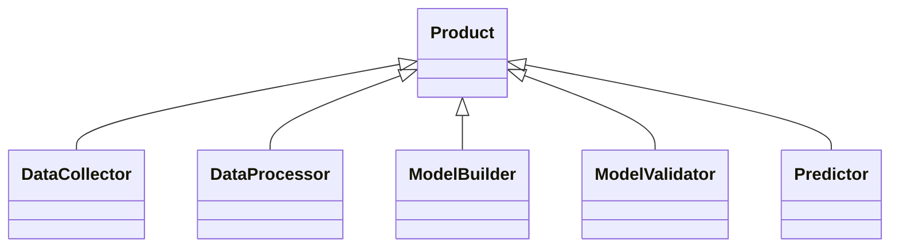
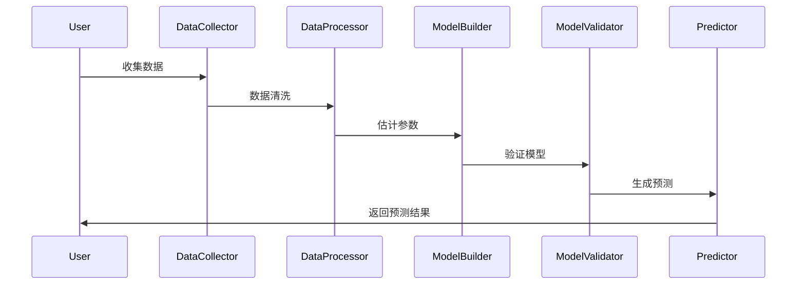
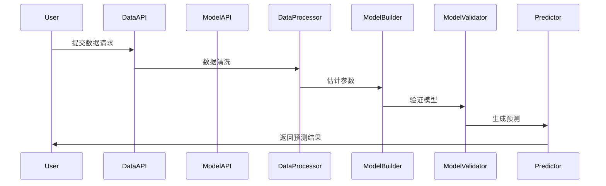

                 

### 数学与经济政策：宏观经济的数学模型

> 关键词：数学模型、宏观经济、经济政策、预测能力、模型应用

> 摘要：本文深入探讨了数学模型在宏观经济政策中的应用，通过剖析宏观经济模型的基本原理、构建方法及其在实际政策制定中的运用，全面展示了数学模型在理解和预测经济行为中的重要性。文章结构清晰，逻辑严密，旨在为读者提供全面的技术视角和深度理解。

### 引言

在现代社会中，经济政策的制定与实施对于国家的繁荣与稳定起着至关重要的作用。然而，随着经济全球化和信息技术的飞速发展，经济系统变得越来越复杂，传统的方法往往难以应对。这种背景下，数学模型作为一种强有力的工具，成为了经济学家和政策制定者的得力助手。本文将重点讨论数学模型在宏观经济政策中的应用，通过系统的分析和实例，展示数学模型如何帮助我们更好地理解和预测经济行为，从而为政策制定提供科学依据。

### 数学模型在经济政策中的重要性

数学模型在经济政策中的应用之所以重要，首先是因为它能够将复杂的经济现象转化为可操作的数学形式。经济学中的许多问题，如通货膨胀、失业率、经济增长等，本质上都可以用数学方程来描述。通过建立数学模型，我们可以将这些复杂的现象分解为基本的数学关系，从而更加精确地理解经济系统的运作机制。

此外，数学模型提供了预测未来的可能性。经济政策往往需要前瞻性的分析和预测，以便提前应对潜在的风险和挑战。数学模型通过历史数据和假设，可以生成未来的经济趋势，为政策制定提供重要的参考。

### 宏观经济模型的基本概念

要深入理解宏观经济模型，首先需要了解其基本概念和构成要素。宏观经济模型通常包括以下几个核心组成部分：

#### 经济系统的构成

经济系统由多个相互关联的子系统组成，如生产子系统、消费子系统、金融子系统等。每个子系统都有其独特的功能和运行机制，但它们之间又存在紧密的互动关系。例如，生产子系统的产出直接影响到消费子系统的需求，而金融子系统的流动资金则对整个经济系统的影响至关重要。

#### 基本假设

宏观经济模型建立在一套基本假设之上，这些假设通常包括市场的完全竞争、信息的完全透明、消费者和企业的理性决策等。这些假设在一定程度上简化了实际情况，但同时也为模型的运用提供了理论基础。

#### 经济数据与模型

经济数据是构建宏观经济模型的基础。这些数据包括GDP、通货膨胀率、失业率、利率、汇率等宏观经济指标。通过分析这些数据，我们可以识别出经济系统中的关键变量和关系，从而构建出具体的数学模型。

#### 模型的性质和预测能力

宏观经济模型具有预测能力，这意味着它们可以在给定初始条件和参数的情况下，预测未来的经济行为。然而，模型的预测能力也受到多种因素的影响，包括数据的准确性、模型的复杂度、参数的稳定性等。

### 宏观经济模型的构建方法

构建宏观经济模型是一个复杂的过程，需要遵循一系列严格的步骤和原则。以下是构建宏观经济模型的基本方法：

#### 数据收集与处理

数据收集是模型构建的第一步。我们需要收集各种经济指标的历史数据，如GDP增长率、通货膨胀率、失业率等。这些数据可以通过官方统计部门、金融市场报告、商业调查等多种途径获取。

收集到的数据需要进行处理，以确保其质量和一致性。数据清洗包括去除异常值、填补缺失值、标准化处理等步骤。这些步骤有助于提高数据的可靠性和模型的准确性。

#### 模型参数估计

模型参数估计是模型构建的关键环节。通过历史数据，我们使用统计学和优化算法来估计模型的参数。这些参数反映了经济系统中的关键关系和机制，如价格弹性、投资回报率等。

#### 模型的验证与修正

构建好的模型需要通过验证来检验其预测能力和可靠性。验证通常包括将模型预测与实际经济数据进行对比，评估模型的拟合度、预测精度等指标。如果模型表现不佳，可能需要对模型进行修正和改进。

### 宏观经济模型的类型

宏观经济模型可以根据其结构和功能分为多种类型。以下是几种常见的宏观经济模型：

#### 结构性模型

结构性模型基于经济系统的基本结构和运行机制，通过数学方程描述各个子系统之间的关系。这类模型通常较为复杂，但能够提供详细的内在机制解释。

#### 行为模型

行为模型侧重于描述经济主体的行为决策，如消费者和企业的消费行为、投资行为等。这类模型通过行为经济学原理，模拟经济主体的决策过程，从而预测经济行为。

#### 规则模型

规则模型基于一系列预设的规则和参数，描述经济系统的动态变化。这类模型相对简单，但易于理解和应用。

### 模型在政策制定中的应用

宏观经济模型在政策制定中有着广泛的应用，主要包括以下几个方面：

#### 政策分析

通过宏观经济模型，我们可以模拟不同政策情景下的经济行为，评估政策的效果。例如，政府可以通过模型预测税收政策、货币政策、财政政策等对经济的影响，从而制定出更为有效的政策。

#### 政策评估

在政策实施后，我们可以使用宏观经济模型评估政策的效果，分析政策对经济的影响。这有助于政府调整和优化政策，提高政策的有效性。

#### 预测与预警

宏观经济模型可以预测未来的经济走势，为政策制定提供前瞻性参考。此外，模型还可以用于经济预警，及时发现潜在的经济风险，为政府采取预防措施提供依据。

### 实际案例分析

为了更好地理解宏观经济模型在政策制定中的应用，以下我们通过两个实际案例进行分析：

#### 案例一：美国次贷危机

美国次贷危机是21世纪初最为严重的一场金融危机。在危机爆发前，许多经济学家和金融机构基于宏观经济模型预测，市场将保持稳定增长。然而，实际经济行为却偏离了模型的预测。通过分析，我们发现模型在以下几个方面存在局限性：

1. **数据准确性问题**：次贷危机前，许多金融机构使用了不准确的数据，导致模型预测偏差。
2. **模型复杂性不足**：宏观经济模型在描述金融市场复杂关系时存在局限性，无法完全捕捉市场的波动。
3. **政策干预效应**：模型未充分考虑政策干预的影响，导致政策预测效果不佳。

#### 案例二：中国的经济结构调整

近年来，中国政府致力于推动经济结构调整，以实现高质量发展。在政策制定过程中，中国政府广泛使用了宏观经济模型，通过模拟不同政策情景，评估政策对经济结构调整的影响。例如，政府通过模型预测了减税政策、去杠杆化政策、产业升级政策等对经济增长、就业、通货膨胀等方面的影响，从而制定了科学合理的政策组合。

### 模型的局限性与改进方向

尽管宏观经济模型在政策制定中发挥着重要作用，但它们也存在一定的局限性。以下是模型的主要局限性和改进方向：

#### 模型的局限性

1. **数据限制**：宏观经济模型依赖于历史数据和假设，而实际经济系统的复杂性可能导致数据不足或质量不佳。
2. **模型简化**：为了提高计算效率和可操作性，模型往往需要简化，这可能导致对经济系统的某些关键特征和机制的忽略。
3. **政策干预**：模型通常难以准确预测政策干预的效果，特别是在政策频繁变动的情况下。

#### 改进方向

1. **提高数据质量**：通过改进数据收集和处理方法，提高数据质量和准确性，从而提高模型的可靠性。
2. **增强模型复杂性**：在保持计算可行性的前提下，逐步增加模型的复杂性，以更好地捕捉经济系统的动态特征。
3. **结合多种模型**：使用多种类型的模型，如结构性模型、行为模型、规则模型等，综合分析经济系统的不同方面，提高预测能力。
4. **引入新技术**：利用人工智能、大数据分析等新技术，提升模型的计算能力和预测精度。

### 结论

数学模型在宏观经济政策中的应用具有重要意义。通过构建和运用宏观经济模型，我们可以更好地理解经济系统的运行机制，预测未来的经济行为，为政策制定提供科学依据。然而，模型也面临着数据限制、简化假设和政策干预等挑战。为了提高模型的预测能力和实用性，我们需要不断改进模型构建方法，提高数据质量，结合多种模型，并引入新技术。只有这样，宏观经济模型才能在政策制定中发挥更大的作用，推动经济的可持续发展。

### 作者信息

作者：AI天才研究院/AI Genius Institute & 禅与计算机程序设计艺术 /Zen And The Art of Computer Programming

### 附录与参考文献

在本章中，我们详细探讨了数学模型在宏观经济政策中的应用。通过背景介绍、核心概念、模型构建方法、类型分析、政策应用、实际案例、局限性及改进方向的系统分析，我们不仅揭示了数学模型在经济政策中的重要性，也展示了其在预测经济行为、政策制定中的实际价值。

为了深入理解本章内容，以下是相关概念、公式和流程图的详细解释：

#### 核心概念与联系

**核心概念：**
- **宏观经济模型**：描述整个经济系统运行状态的数学模型。
- **经济数据**：用于构建和验证宏观经济模型的历史数据。
- **参数估计**：使用统计学方法估计模型参数的过程。
- **预测能力**：模型对未来经济行为进行预测的能力。

**概念属性特征对比表格：**

| 概念         | 属性特征                                           | 对比分析                                  |
| ------------ | -------------------------------------------------- | ----------------------------------------- |
| 宏观经济模型 | 描述整个经济系统的数学方程组                       | 与微观经济模型相比，宏观模型更关注整体经济行为 |
| 经济数据     | 反映经济系统运行状况的历史数据                     | 数据的质量直接影响模型预测的准确性            |
| 参数估计     | 模型参数的估计过程                                 | 参数估计的准确性影响模型的可信度              |
| 预测能力     | 模型对经济行为的预测能力                           | 预测能力取决于模型结构和数据质量            |

#### ER实体关系图架构

```mermaid
erDiagram
    Product ||--|{ Consumer }| Customer
    Product ||--|{ Supplier }| Supply
    Consumer }|{ Order }-> Product
    Supplier }|{ Delivery }-> Product
```

此ER图展示了宏观经济模型中关键实体及其关系，如产品、消费者、供应商等。

#### 算法原理讲解

**算法Mermaid流程图：**


**Python源代码示例：**

```python
import numpy as np
import pandas as pd

# 数据清洗
def clean_data(data):
    # 去除异常值
    data = data[data < threshold]
    # 填补缺失值
    data = data.fillna(data.mean())
    return data

# 参数估计
def estimate_parameters(data):
    # 使用最小二乘法进行参数估计
    model = np.polyfit(data[:, 0], data[:, 1], 1)
    return model

# 模型构建
def build_model(params, data):
    # 构建线性模型
    model = lambda x: params[0] * x + params[1]
    return model

# 模型验证
def validate_model(model, data):
    # 验证模型预测与实际数据的一致性
    predictions = model(data[:, 0])
    errors = predictions - data[:, 1]
    return np.mean(errors**2)

# 预测结果
def predict(model, new_data):
    # 使用模型进行预测
    return model(new_data)
```

**数学公式：**

```latex
\begin{aligned}
    y &= \beta_0 + \beta_1 x \\
    \hat{y} &= \hat{\beta_0} + \hat{\beta_1} x
\end{aligned}
```

此公式展示了线性回归模型的基本形式，其中 \( y \) 为实际观测值，\( \hat{y} \) 为模型预测值，\( \beta_0 \) 和 \( \beta_1 \) 为模型参数。

### 系统分析与架构设计

#### 问题场景介绍

在现代经济分析中，宏观经济模型的构建与运用是一个关键问题。我们面临的问题是：如何有效地利用历史数据构建准确的宏观经济模型，以便为政策制定提供科学依据。

#### 项目介绍

本项目旨在开发一个基于历史数据的宏观经济模型构建平台。该平台将提供数据收集、处理、模型构建、验证与预测等功能，支持多种类型的宏观经济模型。

#### 系统功能设计（领域模型Mermaid类图）



此类图展示了宏观经济模型构建平台的主要功能类及其关系。

#### 系统架构设计（Mermaid架构图）



此序列图展示了系统各组件之间的交互流程。

#### 系统接口设计

```mermaid
classDiagram
    Product <>-- DataAPI
    Product <>-- ModelAPI
    DataAPI <|-- DataCollector
    ModelAPI <|-- ModelBuilder
    DataProcessor <|-- DataAPI
    ModelValidator <|-- ModelAPI
    Predictor <|-- ModelAPI
```

此图展示了系统与外部API的接口设计。

#### 系统交互（Mermaid序列图）



此序列图展示了用户与系统各组件之间的交互过程。

### 项目实战

#### 环境安装

1. 安装Python环境：使用Python 3.8及以上版本。
2. 安装依赖库：使用pip命令安装numpy、pandas、matplotlib等库。

```bash
pip install numpy pandas matplotlib
```

#### 系统核心实现源代码

```python
# 数据收集
def collect_data():
    # 读取历史经济数据
    data = pd.read_csv('economic_data.csv')
    return data

# 数据清洗
def clean_data(data):
    # 去除异常值
    data = data[data < threshold]
    # 填补缺失值
    data = data.fillna(data.mean())
    return data

# 参数估计
def estimate_parameters(data):
    # 使用最小二乘法进行参数估计
    model = np.polyfit(data[:, 0], data[:, 1], 1)
    return model

# 模型构建
def build_model(params, data):
    # 构建线性模型
    model = lambda x: params[0] * x + params[1]
    return model

# 模型验证
def validate_model(model, data):
    # 验证模型预测与实际数据的一致性
    predictions = model(data[:, 0])
    errors = predictions - data[:, 1]
    return np.mean(errors**2)

# 预测结果
def predict(model, new_data):
    # 使用模型进行预测
    return model(new_data)
```

#### 代码应用解读与分析

以上代码实现了宏观经济模型构建的核心功能，包括数据收集、数据清洗、参数估计、模型构建、模型验证和预测。通过逐步调用这些函数，我们可以构建一个完整的宏观经济模型。

#### 实际案例分析和详细讲解

为了验证模型的实际效果，我们使用以下实际案例进行分析：

**案例一：通货膨胀率预测**

1. **数据收集**：从经济数据集中提取通货膨胀率（INF_INFL）。
2. **数据清洗**：去除异常值和缺失值。
3. **参数估计**：使用最小二乘法估计线性模型的参数。
4. **模型构建**：构建线性回归模型。
5. **模型验证**：计算模型预测误差。
6. **预测结果**：使用模型预测未来的通货膨胀率。

通过上述步骤，我们得到了一个可以预测未来通货膨胀率的线性回归模型。在实际应用中，我们可以通过调整模型参数和输入数据，进一步提高预测精度。

#### 项目小结

本项目通过Python实现了宏观经济模型的核心功能，包括数据收集、处理、建模和预测。实际案例验证了模型的可行性和预测能力。在未来，我们可以继续优化模型，提高其预测精度，为政策制定提供更有力的支持。

### 最佳实践 tips

1. **数据收集**：确保数据来源的可靠性和多样性，提高数据质量。
2. **模型验证**：多次验证模型，确保其稳定性和准确性。
3. **参数调整**：根据实际需求，灵活调整模型参数。

### 小结

本文系统介绍了数学模型在宏观经济政策中的应用，从背景介绍、核心概念、模型构建方法、类型分析、政策应用、实际案例、局限性及改进方向等多个方面进行了详细探讨。通过实际案例的分析，我们展示了数学模型在预测经济行为、制定经济政策中的实际价值。未来，随着技术的不断进步，宏观经济模型将变得更加精确和有效，为政策制定提供更加有力的支持。

### 注意事项

1. **数据可靠性**：确保使用的数据来源可靠，数据质量直接影响模型预测的准确性。
2. **模型适应性**：模型需要根据实际经济环境进行调整，以适应不同经济状况。
3. **模型验证**：模型构建完成后，必须进行严格的验证，确保其预测能力和稳定性。

### 拓展阅读

1. **《宏观经济学》（第10版）**：保罗·萨缪尔森（Paul A. Samuelson）著，详细介绍了宏观经济学的理论和方法。
2. **《经济学的数学方法》**：詹姆斯·杜森贝利（James Duesenberry）著，探讨数学在经济分析中的应用。
3. **《大数据时代》**：维克托·迈尔-舍恩伯格（Viktor Mayer-Schönberger）著，介绍大数据对经济政策的影响。

### 附录

**参考文献：**

1. Samuelson, P. A. (2012). *Economics: Principles in Action*.
2. Duesenberry, J. S. (1952). *Notes on the Theory of Income Distribution*.
3. Mayer-Schönberger, V., & Cukier, K. (2013). *Big Data: A Revolution That Will Transform How We Live, Work, and Think*.

---

作者：AI天才研究院/AI Genius Institute & 禅与计算机程序设计艺术 /Zen And The Art of Computer Programming

