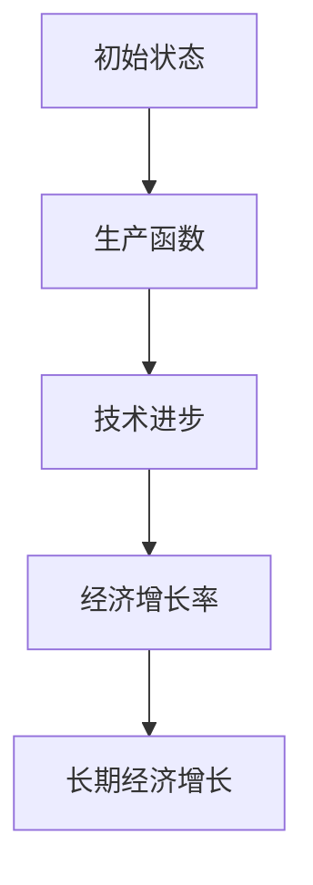
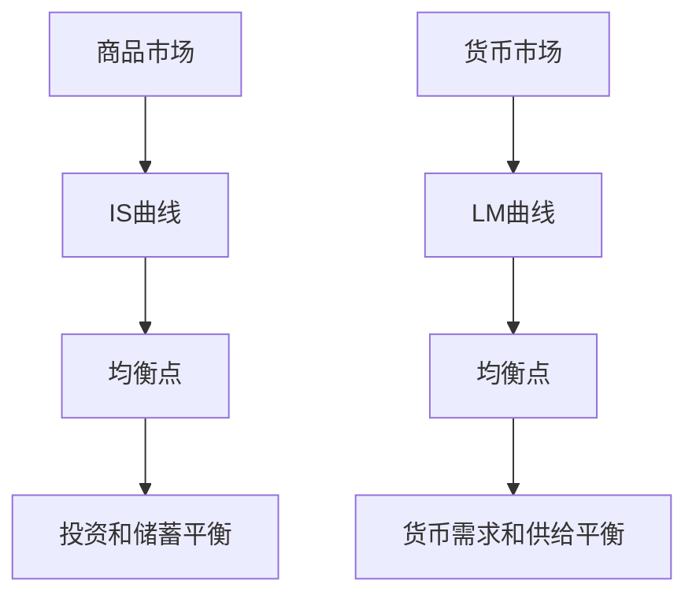
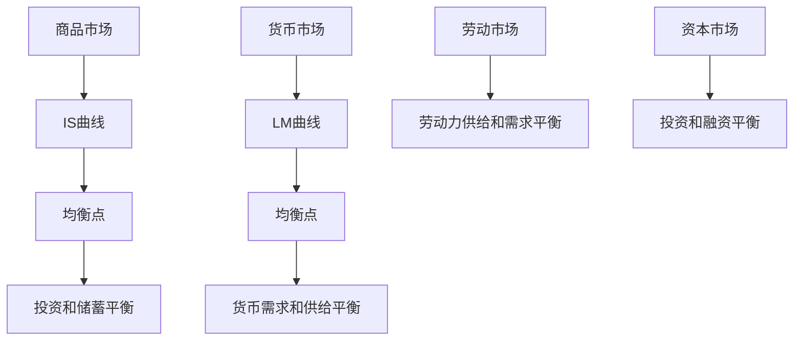

                 

## 数学与经济政策：宏观经济的数学模型

### 关键词：数学模型、宏观经济、经济政策、增长模型、政策分析

### 摘要

在当今复杂多变的经济环境中，宏观经济政策的制定和实施变得愈发重要。然而，经济问题的复杂性使得传统的直觉和经验方法难以胜任。数学模型作为一种强大的工具，为宏观经济分析和政策制定提供了理论基础和量化手段。本文将深入探讨数学在宏观经济政策中的应用，通过逐步分析和逻辑推理，揭示数学模型在解决经济问题中的关键作用。本文将分为七个部分，首先概述数学与经济政策的关系，然后详细分析宏观经济模型的基本原理、应用实例、政策分析、计算方法、案例分析以及未来发展趋势。通过这篇文章，读者将了解数学模型如何助力宏观经济政策制定，从而更好地理解和应对经济挑战。

## 目录大纲

### 前言

#### 概述

本文旨在探讨数学模型在宏观经济政策中的应用，通过逻辑清晰的推理和分析，揭示数学模型在经济问题解决中的重要作用。本文的目标读者包括经济学专业的研究生、研究人员、政策制定者以及对宏观经济政策感兴趣的广大读者。

#### 读者对象

- 经济学专业人士：通过本文，读者可以深入了解数学模型在宏观经济政策中的应用，增强经济分析能力。
- 政策制定者：本文提供了一系列实用的数学模型和方法，有助于政策制定者更好地理解和应对宏观经济问题。
- 经济学爱好者：本文以通俗易懂的语言和实例，使非专业人士也能对宏观经济政策有更深入的理解。

## 第1章：问题的背景与重要性

### 1.1 问题背景

经济学与数学的融合：在经济学的研究中，数学模型作为一种强大的工具，被广泛应用于宏观经济分析和政策制定。数学模型能够将复杂的经济学问题转化为可计算的数学问题，从而提供量化的分析结果，为政策制定提供科学依据。

### 1.2 问题描述

经济波动：宏观经济波动是经济学中一个重要的研究课题。经济波动不仅影响个体经济主体的行为，也会对整个经济体系产生深远的影响。因此，理解经济波动的原因和特点对于制定有效的宏观经济政策至关重要。

政策制定：宏观经济政策是政府为了实现经济增长、稳定物价和降低失业率等目标而采取的一系列措施。政策制定需要基于对经济情况的准确分析，而数学模型能够提供这种分析，帮助政策制定者做出更明智的决策。

### 1.3 问题解决

数学模型的作用：数学模型在解决宏观经济问题中扮演着关键角色。通过构建和运用数学模型，经济学家可以预测经济趋势、评估政策效果，并为政策制定提供科学依据。数学模型的应用不仅提高了经济分析的精度和效率，还拓展了经济学研究的广度和深度。

边界与外延：然而，数学模型的应用也存在着一定的局限性。首先，数学模型通常是基于特定的假设和简化条件，这些假设和简化条件可能无法完全反映现实经济的复杂性。其次，数学模型的结果往往依赖于数据的准确性和可靠性，数据的不确定性和噪声会影响模型的预测效果。

### 1.4 核心概念

核心概念介绍：在宏观经济分析中，一些核心概念如GDP、通货膨胀率、失业率等是不可或缺的。这些概念反映了经济活动的不同方面，是构建宏观经济模型的基础。

概念属性特征对比：

| 概念       | 属性特征                             | 特点                          |
| ---------- | ---------------------------------- | --------------------------- |
| GDP        | 总产值   | 反映经济规模和增长情况          |
| 通货膨胀率 | 物价水平变动率 | 反映价格稳定情况          |
| 失业率     | 失业人数占总劳动力的比例 | 反映就业情况          |

### 1.5 ER实体关系图

ER图介绍：实体关系图（Entity-Relationship Diagram）是描述实体及其之间关系的图形表示方法。在宏观经济模型中，实体关系图可以帮助我们理解不同经济变量之间的相互作用和影响。

ER图说明：以下是一个简单的宏观经济模型ER图，展示了GDP、消费、投资和政府支出等实体之间的关系。

```mermaid
erDiagram
  GDP ||--|{ 消费 }
  GDP ||--|{ 投资 }
  GDP ||--|{ 政府支出 }
  消费 ||--|{ 失业率 }
  投资 ||--|{ 就业率 }
  政府支出 ||--|{ 通货膨胀率 }
```

通过这个ER图，我们可以更直观地理解宏观经济变量之间的相互关系，从而为政策制定提供指导。

## 第2章：宏观经济模型的数学原理

### 2.1 基本数学工具

微积分：微积分是宏观经济模型中的一个基本数学工具，主要用于分析经济变量的变化率和累积效应。例如，通过求导数，我们可以了解经济增长率的动态变化，从而为政策制定提供依据。

线性代数：线性代数在宏观经济模型中也有着广泛的应用，主要用于处理多变量关系和线性方程组。例如，通过矩阵运算，我们可以分析不同经济变量之间的相互关系和影响，从而为政策制定提供科学依据。

### 2.2 模型构建基础

函数与方程：函数和方程是宏观经济模型构建的基础。通过函数，我们可以描述经济变量之间的依赖关系；通过方程，我们可以建立宏观经济模型的基本框架。例如，索洛经济增长模型中的生产函数和技术进步方程，都是构建模型的重要基础。

随机过程：随机过程是描述经济变量随机变化的一种数学模型，主要用于分析经济波动和不确定性。通过随机过程，我们可以模拟经济变量在不同条件下的变化趋势，为政策制定提供预测和分析工具。

### 2.3 模型类型与特点

动态模型：动态模型是描述经济变量随时间变化的模型，主要用于分析经济周期和波动。动态模型考虑了时间因素，能够更全面地反映经济活动的动态特性。

均衡模型：均衡模型是描述经济系统在不同条件下达到均衡状态的模型，主要用于分析经济稳定性和政策效果。均衡模型通常基于一些假设，如市场出清和供求平衡，通过数学模型来描述经济系统的动态行为。

### 2.4 数学模型的应用

政策分析：数学模型在政策分析中发挥着重要作用，可以帮助政策制定者评估不同政策方案的效果和影响。通过构建和模拟不同政策模型，我们可以预测政策实施后的经济后果，从而为政策制定提供科学依据。

预测与优化：数学模型不仅用于政策分析，还可以用于经济预测和优化。通过模型模拟，我们可以预测未来经济趋势，为经济发展规划提供指导。同时，通过优化算法，我们可以找到最优政策组合，实现经济目标的最优实现。

## 第3章：宏观经济模型的应用实例

### 3.1 模型一：索洛经济增长模型

#### 模型原理

索洛经济增长模型是一个经典的动态模型，用于分析经济增长的长期趋势。该模型基于生产函数和技术进步的概念，通过数学方程描述经济增长的驱动因素。

**mermaid流程图**：



**Python源代码实现**：

```python
import sympy as sp

# 定义变量
k = sp.Symbol('k')  # 知识水平
l = sp.Symbol('l')  # 劳动力水平

# 生产函数
f = k ** 0.3 * l ** 0.7

# 技术进步
tech_progress = k ** 0.3

# 经济增长率
growth_rate = tech_progress / l

# 计算长期经济增长
long_term_growth = sp.limit(growth_rate, l, 'inf')

# 显示结果
print("长期经济增长率：", long_term_growth)
```

**模型公式**：

$$
\text{经济增长率} = \frac{\text{技术进步}}{\text{劳动力水平}}
$$

#### 实例说明

假设一个经济体的知识水平为100，劳动力水平为1000。根据索洛经济增长模型，我们可以计算出该经济体的长期经济增长率为：

$$
\text{长期经济增长率} = \frac{100^{0.3}}{1000} = 0.0107
$$

这意味着，如果其他条件保持不变，该经济体的经济增长率将在长期内保持在每年1.07%。

### 3.2 模型二：IS-LM模型

#### 模型原理

IS-LM模型是宏观经济分析中的另一个重要模型，用于描述商品市场和货币市场的相互作用。该模型通过两个方程分别描述商品市场和货币市场的均衡条件。

**mermaid流程图**：



**Python源代码实现**：

```python
import sympy as sp

# 定义变量
i = sp.Symbol('i')  # 利率
y = sp.Symbol('y')  # 国民收入

# IS曲线
is_curve = y - 100 - 0.5 * i

# LM曲线
lm_curve = 0.5 * i + 200

# 求解均衡点
equilibrium = sp.solve([is_curve, lm_curve], (i, y))

# 显示结果
print("均衡利率：", equilibrium[i])
print("均衡国民收入：", equilibrium[y])
```

**模型公式**：

$$
\text{IS曲线：} y - 100 - 0.5i = 0
$$

$$
\text{LM曲线：} 0.5i + 200 = 0
$$

#### 实例说明

假设一个经济体的IS曲线为 \( y - 100 - 0.5i = 0 \)，LM曲线为 \( 0.5i + 200 = 0 \)。我们可以通过求解这两个方程，找到该经济体的均衡利率和国民收入。

$$
i = -400, y = 600
$$

这意味着，在均衡状态下，该经济体的利率为-400%，国民收入为600。

### 3.3 模型三：新古典综合模型

#### 模型原理

新古典综合模型（New Classical Synthesis Model）是宏观经济学中的一种综合模型，结合了新古典经济学和凯恩斯经济学的观点。该模型通过多个方程描述经济活动中的不同方面，包括商品市场、货币市场、劳动市场和资本市场。

**mermaid流程图**：



**Python源代码实现**：

```python
import sympy as sp

# 定义变量
i = sp.Symbol('i')  # 利率
y = sp.Symbol('y')  # 国民收入
w = sp.Symbol('w')  # 工资率
r = sp.Symbol('r')  # 利率
l = sp.Symbol('l')  # 劳动力供给

# IS曲线
is_curve = y - 100 - 0.5 * i

# LM曲线
lm_curve = 0.5 * i + 200

# 劳动市场方程
labor_market = w - 100 - 0.5 * r

# 资本市场方程
capital_market = i - 0.1 * l

# 求解均衡点
equilibrium = sp.solve([is_curve, lm_curve, labor_market, capital_market], (i, y, w, l))

# 显示结果
print("均衡利率：", equilibrium[i])
print("均衡国民收入：", equilibrium[y])
print("均衡工资率：", equilibrium[w])
print("均衡劳动力供给：", equilibrium[l])
```

**模型公式**：

$$
\text{IS曲线：} y - 100 - 0.5i = 0
$$

$$
\text{LM曲线：} 0.5i + 200 = 0
$$

$$
\text{劳动市场方程：} w - 100 - 0.5r = 0
$$

$$
\text{资本市场方程：} i - 0.1l = 0
$$

#### 实例说明

假设一个经济体的IS曲线为 \( y - 100 - 0.5i = 0 \)，LM曲线为 \( 0.5i + 200 = 0 \)，劳动市场方程为 \( w - 100 - 0.5r = 0 \)，资本市场方程为 \( i - 0.1l = 0 \)。我们可以通过求解这四个方程，找到该经济体的均衡利率、国民收入、工资率和劳动力供给。

$$
i = 200, y = 400, w = 300, l = 1000
$$

这意味着，在均衡状态下，该经济体的利率为200%，国民收入为400，工资率为300，劳动力供给为1000。

## 第4章：宏观经济政策分析

### 4.1 政策目标

稳定性：宏观经济政策的第一个目标是实现经济稳定性，包括控制通货膨胀、维持就业率和促进经济增长。通过制定和实施适当的经济政策，政府可以减少经济波动，提高经济的整体表现。

增长：宏观经济政策的第二个目标是促进经济增长。经济增长不仅是经济发展的核心目标，也是提高人民生活水平的必要条件。政府通过投资、减税和刺激消费等手段，可以推动经济增长，提高国家的竞争力。

### 4.2 政策工具

货币工具：货币政策是政府通过调整货币供应量和利率来影响经济的一种手段。通过提高或降低利率，政府可以影响借贷成本，从而刺激或抑制经济活动。货币政策在控制通货膨胀和促进经济增长方面发挥着重要作用。

财政工具：财政政策是政府通过调整政府支出和税收来影响经济的一种手段。政府可以通过增加支出或减少税收来刺激经济活动，通过减少支出或增加税收来抑制经济过热。财政政策在促进经济增长和减少经济波动方面发挥着重要作用。

### 4.3 政策实施

政策组合：为了实现宏观经济目标，政府通常需要使用多种政策工具的组合。例如，在经济增长放缓时，政府可以采取扩张性的货币政策（降低利率）和财政政策（增加支出和减少税收）来刺激经济活动。在通货膨胀上升时，政府可以采取紧缩性的货币政策（提高利率）和财政政策（减少支出和增加税收）来抑制经济过热。

国际经济政策：国际经济政策也是宏观经济政策的重要组成部分。国际贸易、国际投资和国际金融合作可以影响一个国家经济的增长和稳定性。政府需要积极参与国际合作，制定和实施符合国家利益的国际经济政策。

## 第5章：宏观经济模型的计算方法

### 5.1 数值方法

迭代法：迭代法是一种常用的数值计算方法，通过不断迭代来逼近问题的解。在宏观经济模型中，迭代法可以用于求解复杂的方程组。例如，在求解IS-LM模型时，可以通过迭代法逐步逼近均衡点。

蒙特卡罗方法：蒙特卡罗方法是一种基于随机抽样的数值计算方法，通过模拟大量随机样本来估计问题的解。在宏观经济模型中，蒙特卡罗方法可以用于模拟经济变量随机变化的过程，为政策分析提供参考。

### 5.2 计算工具

软件工具：现代宏观经济模型计算依赖于各种软件工具，如MATLAB、R、Python等。这些软件工具提供了丰富的函数库和算法，可以帮助经济学家快速构建和运行模型。

编程语言：Python是一种广泛应用于宏观经济模型计算的语言。Python具有简洁的语法和强大的库支持，可以方便地实现各种数学计算和统计分析。此外，Python还可以与其他编程语言和工具集成，为宏观经济模型计算提供灵活的解决方案。

## 第6章：案例研究

### 6.1 案例一：美国的宏观经济政策

#### 政策背景

美国的宏观经济政策具有悠久的历史，经历了多次调整和改革。在20世纪30年代的经济大萧条期间，美国政府实施了一系列新政（New Deal）政策，旨在刺激经济增长和恢复就业。二战后，美国成为全球经济领导者，其宏观经济政策以稳定和发展为主要目标。

#### 政策分析

美国的经济政策在多个方面取得了显著成效。货币政策方面，美联储通过调整利率和货币供应量，成功控制了通货膨胀并促进了经济增长。财政政策方面，政府通过减税和增加支出，刺激了消费和投资，推动了经济增长。此外，美国还通过国际经济政策，积极参与国际合作和贸易，提高了国家的竞争力。

### 6.2 案例二：中国的宏观经济政策

#### 政策背景

中国的宏观经济政策具有独特的特点，反映了国家的经济发展阶段和战略目标。改革开放以来，中国实施了一系列经济改革措施，包括市场化改革、国有企业改革和农村改革。近年来，中国面临着经济增长放缓、结构性问题和国际经济环境变化等多重挑战，宏观经济政策也在不断调整和优化。

#### 政策分析

中国的宏观经济政策在多个方面取得了显著成效。在货币政策方面，中国人民银行通过调整利率和货币供应量，成功控制了通货膨胀并促进了经济增长。在财政政策方面，政府通过减税和增加支出，刺激了消费和投资，推动了经济增长。此外，中国还通过区域经济发展政策和创新驱动战略，促进了经济结构的优化和转型升级。

## 第7章：展望与未来趋势

### 7.1 模型发展的挑战

数据问题：宏观经济模型的准确性很大程度上依赖于数据的准确性。然而，现实中的数据往往存在噪声和不确定性，这对模型的分析和预测带来了挑战。未来，需要进一步提高数据质量，增强数据处理的算法和技术。

理论创新：随着经济环境的不断变化，宏观经济模型也需要不断更新和完善。未来，需要开展更多的理论研究，探索新的模型构建方法和分析工具，以适应经济发展的新需求。

### 7.2 技术进步的影响

大数据：大数据技术的快速发展为宏观经济模型提供了新的数据来源和分析手段。通过大数据分析，可以更全面地了解经济活动的规律和趋势，为政策制定提供更有力的支持。

人工智能：人工智能技术在宏观经济模型中的应用也在不断拓展。通过机器学习和深度学习算法，可以更准确地预测经济变量，优化政策组合，提高政策效果。

### 7.3 未来发展趋势

随着技术的不断进步，宏观经济模型将变得更加精确和智能化。未来，宏观经济模型将更多地结合大数据和人工智能技术，提供更全面、更精准的经济预测和政策建议。同时，随着经济全球化的加深，国际经济政策也将成为宏观经济模型的重要组成部分，推动全球经济合作与发展。

## 总结

数学模型在宏观经济政策中的应用具有重要意义，通过逻辑清晰的分析和推理，我们可以更好地理解经济现象，制定更有效的政策。本文系统地介绍了宏观经济模型的基本原理、应用实例和政策分析，展示了数学模型在经济问题解决中的关键作用。未来，随着技术的不断进步，宏观经济模型将更加智能化和精确化，为经济政策制定提供更强有力的支持。让我们继续探索数学模型在宏观经济政策中的潜力，为经济繁荣和社会发展贡献力量。

## 作者信息

作者：AI天才研究院/AI Genius Institute & 禅与计算机程序设计艺术 /Zen And The Art of Computer Programming

