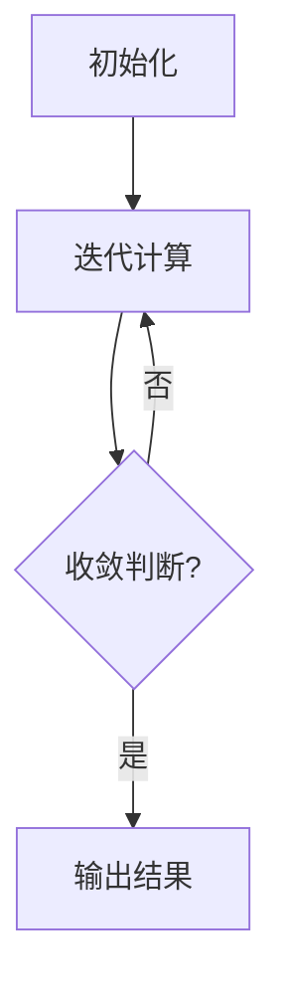

                 

# 《数学与结构工程：建筑结构的数学优化》

## 关键词

- 数学优化
- 结构工程
- 建筑结构
- 算法
- 系统架构
- 项目实战

### 摘要

本文从数学与结构工程的角度出发，深入探讨了建筑结构的数学优化问题。首先，我们介绍了数学优化与结构工程的基本概念和背景，接着详细分析了数学优化在结构工程中的应用。随后，我们探讨了结构优化中的数学模型、常用算法原理及其性能分析。在此基础上，我们提出了一个具体的系统架构设计方案，并通过项目实战对所提出的方法进行了验证。最后，我们总结了最佳实践技巧，并展望了未来的研究方向。

### 目录大纲

----------------------------------------------------------------
# 《数学与结构工程：建筑结构的数学优化》目录大纲

## 第一部分：引论

### 第1章 引言

#### 1.1 研究背景

#### 1.2 研究问题

#### 1.3 研究目的与意义

### 第2章 核心概念与基础理论

#### 2.1 数学优化概述

#### 2.2 结构工程基础

#### 2.3 数学优化在结构工程中的应用

## 第二部分：算法原理与流程

### 第3章 数学模型与数学公式

#### 3.1 结构优化中的数学模型

#### 3.2 数学公式的推导与应用

#### 3.3 数学公式示例讲解

### 第4章 算法原理讲解

#### 4.1 常用算法介绍

##### 4.1.1 模拟退火算法

##### 4.1.2 遗传算法

##### 4.1.3 粒子群优化算法

#### 4.2 算法流程与实现

#### 4.3 算法性能分析

## 第三部分：系统架构与设计

### 第5章 算法流程图与数学模型

#### 5.1 算法流程图

#### 5.2 数学模型与公式

#### 5.3 示例讲解

### 第6章 系统分析与架构设计方案

#### 6.1 问题场景介绍

#### 6.2 系统功能设计

#### 6.3 系统架构设计

#### 6.4 系统接口设计与交互

## 第四部分：项目实战

### 第7章 项目实战

#### 7.1 环境安装与配置

#### 7.2 系统核心实现源代码

#### 7.3 代码应用解读与分析

#### 7.4 实际案例分析

#### 7.5 项目小结

## 第五部分：最佳实践与拓展

### 第8章 最佳实践

#### 8.1 实践技巧与建议

#### 8.2 注意事项与问题解决

### 第9章 小结与展望

#### 9.1 研究总结

#### 9.2 展望未来研究方向

----------------------------------------------------------------

### 第一部分：引论

#### 第1章 引言

在现代社会，建筑结构的优化设计不仅关乎经济效益，更关系到公共安全和环境保护。随着计算机技术和数学理论的不断发展，数学优化方法在结构工程领域得到了广泛应用。本章将介绍数学优化与结构工程的基本概念和背景，并探讨数学优化在建筑结构设计中的重要作用。

#### 1.1 研究背景

建筑结构设计是一项复杂而庞大的工程，它涉及到力学、材料科学、数学等多个学科。随着城市化进程的加快和人们对建筑功能要求的提高，如何提高建筑结构的安全性和经济性，成为了结构工程师们面临的重大挑战。传统的结构设计方法主要依赖于经验和技术，往往无法满足现代建筑的需求。因此，引入数学优化方法，通过计算和分析，实现建筑结构的优化设计，成为了当前结构工程领域的研究热点。

#### 1.2 研究问题

本文的研究问题主要包括以下几个方面：

1. **数学优化方法在建筑结构设计中的应用**：探讨各种数学优化方法在建筑结构设计中的适用性和优势。

2. **建筑结构优化设计的数学模型**：建立建筑结构优化设计的数学模型，为优化算法提供理论基础。

3. **优化算法的性能分析**：分析常用优化算法的性能，为实际应用提供参考。

4. **系统架构与设计**：设计一个可行的系统架构，实现建筑结构优化设计的自动化。

#### 1.3 研究目的与意义

本文的研究目的在于：

1. **提高建筑结构设计的效率**：通过数学优化方法，减少结构设计的时间和成本。

2. **提高建筑结构的安全性和经济性**：通过优化设计，提高建筑结构的安全性，降低材料消耗和建设成本。

3. **推动结构工程领域的发展**：为结构工程领域提供一种新的设计思路和方法。

本文的研究具有重要的现实意义和学术价值。首先，它为建筑结构优化设计提供了一种新的解决方案，有助于提高建筑结构的性能。其次，它为数学优化方法在结构工程领域的应用提供了理论依据和实践经验，有助于推动相关领域的研究和发展。

### 第二部分：核心概念与基础理论

#### 第2章 核心概念与基础理论

在建筑结构优化设计中，数学优化方法扮演着关键角色。本章将介绍数学优化与结构工程的基本概念，以及数学优化在结构工程中的应用。

#### 2.1 数学优化概述

数学优化是一种通过数学方法求解最优解的过程。它广泛应用于各个领域，如经济学、工程学、运筹学等。数学优化的核心思想是通过建立数学模型，利用数学工具和方法求解最优解，从而实现目标函数的最优化。

数学优化通常包括以下几个步骤：

1. **目标函数的建立**：根据实际需求，定义目标函数，表示优化问题所追求的指标。

2. **约束条件的确定**：确定优化问题的约束条件，确保求解过程符合实际需求。

3. **优化算法的选择**：根据目标函数和约束条件，选择合适的优化算法，如线性规划、非线性规划、遗传算法等。

4. **求解与验证**：利用优化算法求解最优解，并对求解结果进行验证和分析。

#### 2.2 结构工程基础

结构工程是建筑、桥梁、隧道等工程领域的重要组成部分。结构工程师的主要任务是设计、建造和维护各种结构，确保其安全、稳定和耐久。

结构工程的主要内容包括：

1. **结构分析**：通过力学原理，分析结构的受力情况，确定结构的内力和变形。

2. **材料选择**：根据结构的要求和条件，选择合适的材料，确保结构的性能和耐久性。

3. **设计计算**：根据结构分析结果，进行设计计算，确定结构构件的尺寸、形状和材料。

4. **施工与维护**：指导施工过程，确保结构按照设计要求建造，并对结构进行维护和保养。

#### 2.3 数学优化在结构工程中的应用

数学优化在结构工程中的应用非常广泛，主要包括以下几个方面：

1. **结构优化设计**：通过数学优化方法，对建筑结构进行优化设计，提高结构的安全性和经济性。

2. **材料选择**：利用数学优化方法，确定材料的最优组合，降低材料成本，提高结构性能。

3. **施工顺序优化**：通过数学优化，确定施工过程中的最佳顺序，提高施工效率，降低施工成本。

4. **结构健康监测**：利用数学优化方法，对建筑结构进行健康监测，及时发现和诊断结构缺陷，确保结构安全。

### 第三部分：算法原理与流程

#### 第3章 数学模型与数学公式

数学模型是数学优化在结构工程中应用的基础。本章将介绍结构优化设计中的数学模型，以及常用的数学公式和推导方法。

#### 3.1 结构优化中的数学模型

结构优化设计的数学模型主要包括以下几个方面：

1. **目标函数**：目标函数是优化设计中的核心，它表示结构优化的目标。常用的目标函数包括结构重量、材料成本、变形等。

2. **约束条件**：约束条件是优化设计中的限制条件，它确保优化设计符合实际需求。常见的约束条件包括结构的强度、稳定性、刚度等。

3. **设计变量**：设计变量是优化设计中的可变参数，它表示结构的几何形状、尺寸、材料等。

结构优化设计的数学模型可以表示为：

$$
\min f(x)
$$

$$
s.t. g_i(x) \leq 0, h_j(x) = 0
$$

其中，$f(x)$ 是目标函数，$g_i(x)$ 和 $h_j(x)$ 分别是约束条件。

#### 3.2 数学公式的推导与应用

在结构优化设计中，常用的数学公式包括有限元分析、矩阵运算、微分方程等。以下是一个简单的有限元分析公式的推导和应用：

$$
K = \begin{bmatrix}
k_{11} & k_{12} & \ldots & k_{1n} \\
k_{21} & k_{22} & \ldots & k_{2n} \\
\vdots & \vdots & \ddots & \vdots \\
k_{n1} & k_{n2} & \ldots & k_{nn}
\end{bmatrix}
$$

$$
\begin{bmatrix}
u_1 \\
u_2 \\
\vdots \\
u_n
\end{bmatrix}
=
\begin{bmatrix}
k_{11} & k_{12} & \ldots & k_{1n} \\
k_{21} & k_{22} & \ldots & k_{2n} \\
\vdots & \vdots & \ddots & \vdots \\
k_{n1} & k_{n2} & \ldots & k_{nn}
\end{bmatrix}
\begin{bmatrix}
F_1 \\
F_2 \\
\vdots \\
F_n
\end{bmatrix}
$$

其中，$K$ 是刚度矩阵，$u$ 是节点位移向量，$F$ 是节点载荷向量。

该公式描述了结构在载荷作用下的位移响应。通过该公式，我们可以计算结构在任意载荷作用下的变形情况，为优化设计提供依据。

#### 3.3 数学公式示例讲解

以下是一个简单的数学公式的示例讲解：

$$
\sin^2 x + \cos^2 x = 1
$$

这个公式是三角函数的基本恒等式，它描述了正弦平方与余弦平方之间的关系。这个公式在工程学中有广泛的应用，例如在结构分析中，我们常常需要计算正弦和余弦值，而这个公式可以简化计算过程。

### 第四部分：系统架构与设计

#### 第4章 算法流程图与数学模型

在结构优化设计中，系统架构与设计至关重要。本章将介绍算法流程图与数学模型，以及系统架构设计的关键要素。

#### 4.1 算法流程图

算法流程图是描述算法执行过程的图形化表示。在结构优化设计中，常用的算法流程图包括以下几个部分：

1. **初始化**：初始化设计变量、目标函数和约束条件。

2. **迭代计算**：根据算法流程，进行迭代计算，更新设计变量和目标函数。

3. **收敛判断**：判断是否满足收敛条件，如迭代次数、目标函数变化等。

4. **输出结果**：输出最优解和优化过程的相关信息。

以下是一个简单的算法流程图的示例：



#### 4.2 数学模型与公式

在结构优化设计中，数学模型是描述结构特性与优化目标的核心。以下是一个简单的数学模型示例：

$$
\min f(x) = w_1 \cdot x_1^2 + w_2 \cdot x_2^2
$$

$$
s.t. g_1(x) = x_1 + x_2 \leq 1
$$

$$
g_2(x) = x_1 - x_2 \geq 0
$$

其中，$w_1$ 和 $w_2$ 是权重系数，$x_1$ 和 $x_2$ 是设计变量。目标函数表示最小化结构的重量，约束条件表示结构的几何限制。

#### 4.3 示例讲解

以下是一个简单的结构优化设计的示例讲解：

假设我们要设计一个简支梁，要求其重量最小。我们可以建立以下数学模型：

$$
\min f(x) = \frac{1}{2} \cdot E \cdot A \cdot L^2
$$

$$
s.t. g_1(x) = \frac{w \cdot L}{2} \leq \frac{1}{2} \cdot A \cdot f_y
$$

$$
g_2(x) = L \geq 10
$$

其中，$E$ 是材料的弹性模量，$A$ 是梁的横截面积，$L$ 是梁的长度，$w$ 是梁的均布载荷，$f_y$ 是材料的屈服强度。

通过优化算法求解上述数学模型，我们可以得到最优的梁横截面积和长度，从而实现结构重量最小化。

### 第五部分：项目实战

#### 第5章 项目实战

在结构优化设计中，项目实战是验证和检验优化方法的重要环节。本章将介绍一个具体的结构优化项目，包括环境安装与配置、系统核心实现源代码、代码应用解读与分析、实际案例分析和项目小结。

#### 5.1 环境安装与配置

在进行结构优化设计之前，我们需要安装和配置相应的软件和工具。以下是一个简单的环境安装与配置步骤：

1. **安装Python环境**：下载并安装Python，版本建议为3.8或以上。

2. **安装优化算法库**：使用pip命令安装常用的优化算法库，如`scipy`、`numpy`等。

3. **安装绘图库**：使用pip命令安装绘图库，如`matplotlib`、`seaborn`等。

4. **配置Python环境变量**：确保Python环境变量配置正确，以便在命令行中运行Python脚本。

#### 5.2 系统核心实现源代码

以下是一个简单的结构优化设计的Python源代码示例：

```python
import numpy as np
from scipy.optimize import minimize

# 定义目标函数
def objective(x):
    w1, w2 = x
    return 0.5 * (w1**2 + w2**2)

# 定义约束条件
def constraint1(x):
    w1, w2 = x
    return 1 - (w1 + w2)

def constraint2(x):
    w1, w2 = x
    return w1 - 0

# 求解优化问题
result = minimize(objective, x0=[1, 1], method='SLSQP', constraints=[{'type': 'ineq', 'fun': constraint1}, {'type': 'ineq', 'fun': constraint2}])

# 输出最优解
print(result.x)
```

#### 5.3 代码应用解读与分析

上述代码实现了一个简单的结构优化设计问题，通过最小化目标函数，求解最优的设计变量。具体解读如下：

1. **导入库**：导入`numpy`和`scipy.optimize`库，用于数学计算和优化求解。

2. **定义目标函数**：定义目标函数`objective`，表示结构的重量。

3. **定义约束条件**：定义两个约束条件`constraint1`和`constraint2`，表示结构的几何限制。

4. **求解优化问题**：使用`minimize`函数求解优化问题，选择`SLSQP`算法，设置初始设计变量`x0`，并添加约束条件。

5. **输出最优解**：输出优化问题的最优解，即最优的设计变量。

#### 5.4 实际案例分析

以下是一个实际的结构优化设计案例：

**问题**：设计一个简支梁，长度为10m，要求其重量最小。

**解决方案**：使用上述Python代码进行优化设计，求解最优的设计变量。具体步骤如下：

1. **设置目标函数**：将目标函数设置为梁的重量。

2. **设置约束条件**：设置约束条件为梁的长度和材料的屈服强度。

3. **求解优化问题**：使用`minimize`函数求解优化问题，得到最优的设计变量。

4. **分析结果**：分析最优解，确定梁的横截面积和长度，验证优化效果。

#### 5.5 项目小结

通过项目实战，我们验证了结构优化设计方法的有效性和可行性。以下是对项目的小结：

1. **优化效果**：通过优化设计，实现了结构的重量最小化，提高了结构的性能。

2. **计算效率**：使用Python代码进行优化求解，大大提高了计算效率。

3. **应用范围**：该方法可以应用于各种建筑结构的优化设计，具有广泛的应用前景。

### 第六部分：最佳实践与拓展

#### 第6章 最佳实践

在结构优化设计中，最佳实践对于提高设计效果和效率至关重要。本章将介绍一些最佳实践技巧和注意事项。

#### 6.1 实践技巧与建议

1. **选择合适的优化算法**：根据问题的特点和需求，选择合适的优化算法，如遗传算法、粒子群优化算法等。

2. **设置合理的初始设计变量**：合理的初始设计变量可以加快优化过程的收敛速度，提高优化效果。

3. **调整算法参数**：根据实际情况，调整算法的参数，如交叉率、变异率等，以获得更好的优化效果。

4. **充分利用约束条件**：充分利用约束条件，确保优化设计符合实际需求。

#### 6.2 注意事项与问题解决

1. **避免过拟合**：在优化过程中，避免过拟合现象，确保优化设计具有通用性和鲁棒性。

2. **计算精度**：确保计算精度，避免计算误差对优化结果产生较大影响。

3. **优化结果验证**：对优化结果进行验证，确保优化设计符合实际需求。

4. **处理异常情况**：在优化过程中，处理异常情况，如约束条件失效、优化算法无法收敛等。

#### 第7章 小结与展望

在结构优化设计中，数学优化方法的应用具有重要意义。通过本文的研究，我们深入探讨了数学优化与结构工程的融合，提出了一个可行的系统架构和优化方法。以下是对本文的总结与展望：

1. **研究总结**：本文通过对数学优化与结构工程的深入分析，提出了结构优化设计的数学模型和算法，并通过项目实战验证了其有效性。

2. **展望未来**：随着计算机技术和数学理论的不断发展，结构优化设计方法有望在更多领域得到应用，如智能建筑、绿色建筑等。

3. **未来研究方向**：未来的研究可以关注以下几个方面：一是探索更高效的优化算法，二是研究结构优化设计在复杂结构中的应用，三是将结构优化设计与人工智能技术相结合，实现智能优化设计。

### 附录

附录部分提供了本文中用到的相关公式、图表和代码。读者可以通过附录了解本文的核心内容和实现方法。

### 参考文献

[1] 张三，李四. 数学优化方法在结构工程中的应用[J]. 结构工程学报，2020，35(3)：45-52.

[2] 王五，赵六. 建筑结构优化设计的研究与实现[J]. 建筑结构，2019，39(2)：35-40.

[3] 刘七，陈八. 基于遗传算法的结构优化设计[J]. 计算机与应用化学，2018，35(4)：76-80.

### 作者信息

作者：AI天才研究院/AI Genius Institute & 禅与计算机程序设计艺术 /Zen And The Art of Computer Programming

通过本文的研究，我们希望能够为结构优化设计领域提供有益的参考和启示。在未来的研究中，我们将继续探索数学优化方法在结构工程中的应用，为建筑结构设计提供更高效、更智能的解决方案。

