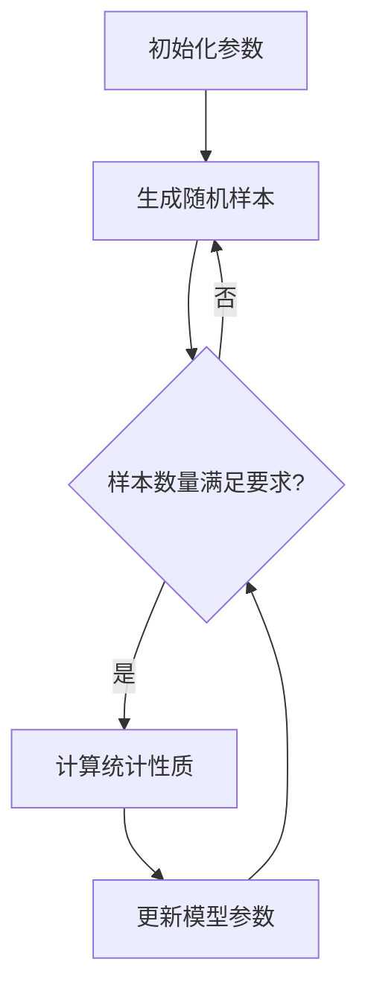
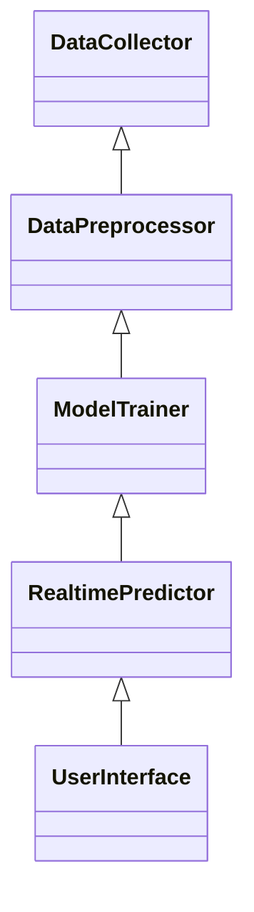
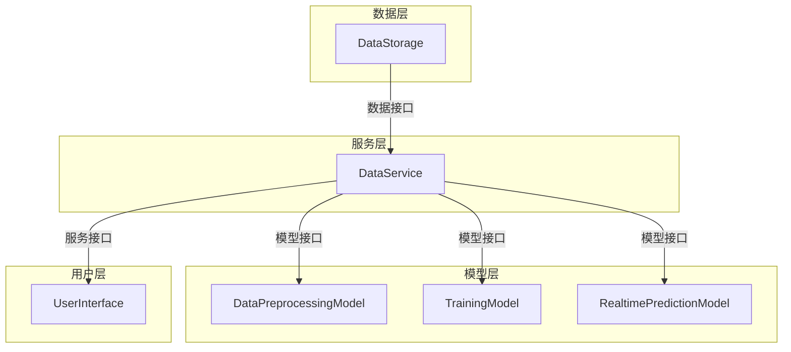
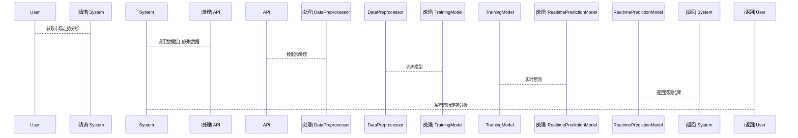
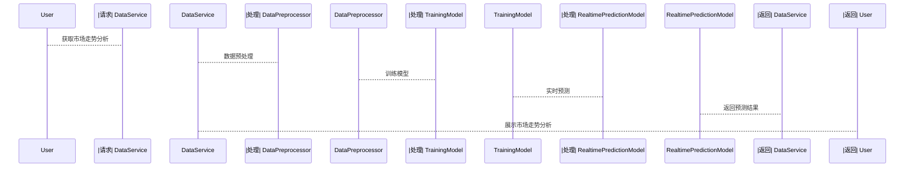

                 


### 摘要

本文将深入探讨数学与统计物理学在大系统行为统计描述中的应用。我们首先回顾统计物理学的基本概念，如系统状态和概率分布，并通过经典与量子模型的对比，阐述其在描述大系统行为中的优势与局限性。接下来，我们将详细讲解最大熵方法和相似性原理，展示如何利用数学模型和算法来描述复杂系统的行为。通过Mermaid流程图和Python源代码，我们将深入剖析算法原理，并结合具体实例进行讲解。此外，文章还将介绍系统分析与架构设计的方法，以及项目实战的经验和总结。最后，我们将分享最佳实践和注意事项，为读者提供拓展阅读的建议。

----------------------------------------------------------------

## 数学与统计物理：大系统行为的统计描述

### 关键词

- 统计物理学
- 大系统行为
- 统计描述
- 数学模型
- 算法原理
- 熵
- 最大熵方法

### 摘要

本文旨在探讨数学与统计物理学在大系统行为统计描述中的应用。首先，我们回顾统计物理学的基本概念，包括系统状态和概率分布，并通过经典与量子模型的对比，分析其在描述大系统行为中的优势与局限性。接着，本文详细讲解最大熵方法和相似性原理，通过Mermaid流程图和Python源代码展示如何利用这些方法来描述复杂系统的行为。此外，文章还将介绍系统分析与架构设计的方法，并通过项目实战的经验和总结，为读者提供实际应用案例。最后，本文分享最佳实践和注意事项，为读者提供拓展阅读的建议。

----------------------------------------------------------------

### 背景介绍

#### 统计物理学的兴起与发展

统计物理学是物理学的一个分支，主要研究大量粒子组成的宏观系统的物理性质。它的起源可以追溯到19世纪末，当时物理学家们开始意识到，单个粒子的运动和相互作用并不能完全描述复杂系统的宏观行为。统计物理学的核心思想是通过统计方法来描述大量粒子的集体行为，从而理解宏观系统的性质。

随着科学技术的进步，统计物理学得到了迅速发展。20世纪20年代，统计物理学与量子力学的交叉发展推动了现代统计物理学的形成。著名物理学家爱因斯坦、普朗克、玻尔等人都对统计物理学的发展做出了重要贡献。在现代，统计物理学广泛应用于材料科学、凝聚态物理、量子计算、生物物理学等领域。

#### 大系统行为的复杂性

在自然界和人类活动中，存在着大量的复杂系统，如社会网络、金融市场、生态系统等。这些系统的行为不仅受到内部粒子相互作用的影响，还受到外部环境变化的扰动。因此，研究大系统行为的统计描述具有重要意义。

大系统行为的复杂性主要体现在以下几个方面：

1. **非线性相互作用**：在复杂系统中，粒子之间的相互作用往往是非线性的，这使得系统行为呈现出复杂的多态性。
2. **尺度多样性**：复杂系统中的粒子尺度从微观到宏观，不同尺度的粒子相互作用会影响系统整体行为。
3. **外部扰动**：外部环境的变化会对系统行为产生显著影响，这种扰动可能是随机的，也可能是周期性的。

#### 数学工具的局限性

在描述大系统行为时，传统的数学工具如微分方程和微积分方法存在一定的局限性。首先，这些方法往往依赖于对系统状态的精确了解，但在实际应用中，系统状态的测量和模拟往往是困难的。其次，这些方法难以处理非线性相互作用和尺度多样性。此外，对于大系统，计算复杂性也是一个重要问题。

因此，统计物理学提供了一种新的视角，通过统计描述来应对大系统行为的复杂性。统计物理方法能够处理大规模数据的统计性质，从而提供一种宏观的、全局的描述方式。

#### 统计物理方法的应用

统计物理方法在大系统行为研究中的应用主要包括以下几个方面：

1. **概率分布**：通过统计方法，我们可以得到系统状态的概率分布，这有助于理解系统在不同状态下的概率分布特性。
2. **熵**：熵是统计物理学中一个重要的概念，它反映了系统状态的混乱程度。通过熵的变化，我们可以分析系统行为的稳定性。
3. **最大熵原理**：最大熵原理是一种重要的统计方法，它通过最大化熵来推测系统状态的概率分布。这种方法在处理不确定性和信息缺失时非常有用。

总之，统计物理学为大系统行为的统计描述提供了一种有效的工具。通过深入理解和应用这些方法，我们可以更好地理解和预测复杂系统的行为。

----------------------------------------------------------------

### 问题描述

#### 大系统行为的统计描述需求

在大系统行为的研究中，我们面临的一个核心问题是：如何有效地描述和分析复杂系统的宏观行为。这个问题不仅涉及对系统内部微观粒子相互作用的理解，还包括系统与外部环境之间的相互作用。为了满足这一需求，我们需要一种能够处理大规模数据和复杂非线性关系的统计描述方法。

1. **数据处理能力**：大系统通常会产生大量数据，如何从这些数据中提取有价值的信息是一个关键问题。统计物理学提供了一种处理大规模数据的方法，通过概率分布和统计特性来描述系统行为。
2. **非线性关系的处理**：在复杂系统中，粒子之间的相互作用往往是非线性的，这种非线性关系对系统行为有重要影响。统计物理方法能够通过概率分布和熵等概念来描述这种非线性关系。
3. **不确定性的处理**：在实际应用中，系统状态和外部环境的变化往往是不确定的。统计物理学通过概率分布和最大熵原理等方法，可以有效地处理这种不确定性。

#### 数学工具的局限性

尽管统计物理学提供了一些有效的工具，但传统的数学工具在描述大系统行为时仍存在一些局限性：

1. **精确性要求高**：传统的微分方程和微积分方法通常要求对系统状态有精确的了解，这在实际应用中往往是难以实现的。统计物理学通过概率分布和统计特性，提供了一种宏观的、近似的描述方法。
2. **计算复杂性**：对于大规模系统，计算复杂性是一个重要问题。传统的数学方法在处理大规模数据时可能会变得不可行。统计物理学通过概率分布和算法优化，可以有效地降低计算复杂性。
3. **非线性关系的处理**：虽然统计物理学提供了一些处理非线性关系的方法，但在某些情况下，这些方法仍然无法完全解决非线性问题。

#### 问题解决

为了解决上述问题，我们需要结合统计物理学的原理，发展出一些新的方法和算法：

1. **概率分布和熵的应用**：通过概率分布和熵的概念，我们可以更全面地描述大系统的宏观行为。这些概念不仅可以帮助我们理解系统的状态，还可以预测系统未来的行为。
2. **最大熵方法**：最大熵原理是一种重要的统计方法，它通过最大化熵来推测系统状态的概率分布。这种方法在处理不确定性和信息缺失时非常有用。
3. **相似性原理**：相似性原理可以帮助我们识别不同系统之间的相似性，从而简化问题的处理。通过相似性原理，我们可以将复杂的系统行为转化为更简单的模型来进行分析。

总之，通过结合统计物理学的原理和方法，我们可以更好地解决大系统行为的统计描述问题。这不仅有助于我们深入理解复杂系统的行为，还可以为实际应用提供有力支持。

----------------------------------------------------------------

### 问题解决

#### 统计物理方法的应用

统计物理方法在大系统行为研究中的应用具有重要意义。首先，我们来看一看概率分布和熵的概念。

**概率分布**：
概率分布是描述系统状态概率的一种数学工具。在一个大系统中，不同的状态可能以不同的概率出现。通过概率分布，我们可以了解系统在不同状态下的概率分布特性。例如，我们可能关心系统处于高能态或低能态的概率。

**熵**：
熵是统计物理学中一个重要的概念，它反映了系统状态的混乱程度。熵的增加意味着系统变得更加不确定，这也是热力学第二定律的核心思想。在统计物理中，熵通常用来衡量系统状态的多样性和不确定性。

**最大熵方法**：
最大熵方法是一种重要的统计方法，它通过最大化熵来推测系统状态的概率分布。这种方法在处理不确定性和信息缺失时非常有用。具体来说，最大熵方法假设系统处于一个熵最大的状态，除非有额外的信息来限制系统的状态。这种假设使得最大熵方法成为一种自底向上的方法，可以很好地处理复杂系统的行为。

**相似性原理**：
相似性原理可以帮助我们识别不同系统之间的相似性，从而简化问题的处理。通过相似性原理，我们可以将复杂的系统行为转化为更简单的模型来进行分析。例如，我们可以利用相似性原理将复杂的社会网络问题简化为图论模型。

#### 数学模型的建立与求解

在描述大系统行为时，我们需要建立合适的数学模型。数学模型通常包括以下几个部分：

1. **势函数**：
势函数是描述系统内部粒子之间相互作用的重要工具。在统计物理学中，势函数通常是一个势能函数，它反映了粒子之间的相互作用能量。通过势函数，我们可以计算粒子间的相互作用力，进而分析系统行为。

2. **状态空间**：
状态空间是描述系统可能状态的集合。在统计物理学中，状态空间可以是连续的，也可以是离散的。对于连续状态空间，我们通常使用概率密度函数来描述系统的状态概率分布。

3. **概率分布函数**：
概率分布函数是描述系统状态概率分布的数学工具。在统计物理学中，概率分布函数通常用于计算系统处于特定状态的几率。

为了求解数学模型，我们通常需要采用一些数值方法，如蒙特卡洛模拟、马尔可夫链等。这些方法可以帮助我们计算系统的状态概率分布，从而更好地理解系统行为。

#### 边界与外延

**大系统的定义**：
在统计物理学中，大系统通常是指由大量粒子组成的系统。这些粒子可以是原子、分子、电子等。大系统的定义取决于我们研究的问题和粒子的数量。

**统计物理学的适用范围**：
统计物理学广泛应用于各个领域，如材料科学、凝聚态物理、量子计算、生物物理学等。在材料科学中，统计物理学可以用来研究材料的宏观性质，如硬度、韧性、导电性等。在凝聚态物理中，统计物理学可以用来研究晶体结构、相变等。在量子计算中，统计物理学可以用来研究量子比特的纠缠态和量子错误纠正。在生物物理学中，统计物理学可以用来研究生物分子系统、细胞行为等。

**概念结构与核心要素组成**：

- **系统状态**：系统状态的描述是统计物理学的基础。系统状态可以通过粒子的位置和动量来描述。
- **概率分布**：概率分布是描述系统状态概率的数学工具。通过概率分布，我们可以了解系统在不同状态下的概率分布特性。
- **熵**：熵是衡量系统状态混乱程度的重要指标。熵的增加意味着系统变得更加不确定。
- **势函数**：势函数是描述系统内部粒子之间相互作用的重要工具。
- **状态空间**：状态空间是描述系统可能状态的集合。

总之，统计物理学为描述大系统行为提供了一种有效的工具。通过建立合适的数学模型，我们可以深入理解复杂系统的行为，为实际应用提供有力支持。

----------------------------------------------------------------

### 核心概念与联系

#### 系统状态

在统计物理学中，系统状态是描述系统内部粒子位置和动量的数学工具。系统状态可以用粒子的位置和动量来表示，这些参数构成了系统状态空间。系统状态空间可以是连续的，也可以是离散的，具体取决于我们研究的问题。

- **粒子的位置和动量**：粒子的位置和动量是描述系统状态的基本参数。在经典统计物理学中，粒子的位置和动量通常是连续的。在量子统计物理学中，粒子的位置和动量通常是离散的。
- **势函数**：势函数是描述系统内部粒子之间相互作用的数学工具。势函数反映了粒子间的相互作用能量，是系统状态空间中的一个重要组成部分。
- **状态空间**：状态空间是描述系统可能状态的集合。在统计物理学中，状态空间可以是连续的，也可以是离散的。连续状态空间通常使用概率密度函数来描述，而离散状态空间通常使用概率分布函数来描述。

#### 概率分布

概率分布是描述系统状态概率的数学工具。通过概率分布，我们可以了解系统在不同状态下的概率分布特性。

- **概率密度函数**：在连续状态空间中，概率分布通常用概率密度函数来描述。概率密度函数是一个非负函数，其积分在整个状态空间上等于1，表示所有状态的几率之和为1。
  $$ \int_{-\infty}^{\infty} \rho(\psi)d\psi = 1 $$
- **概率分布函数**：在离散状态空间中，概率分布通常用概率分布函数来描述。概率分布函数是一个离散的函数，其取值表示系统处于特定状态的几率。
  $$ P(\psi_i) = \sum_{i}^{} \rho(\psi_i) $$
- **熵**：熵是衡量系统状态混乱程度的重要指标。在统计物理学中，熵通常用来描述系统的随机性和不确定性。熵的增加意味着系统变得更加不确定。
  $$ H = -\int \rho(\psi) \log \rho(\psi) d\psi $$

#### 概率分布与态密度

态密度是描述系统状态密度的数学工具。态密度描述了在特定能量范围内，系统可能的状态数量。

- **态密度函数**：态密度函数是一个描述系统在特定能量范围内可能的状态数量的函数。态密度函数通常与概率分布函数相关联。
  $$ D(E) = \frac{dN}{dE} $$
- **经典极限与量子极限**：在经典极限下，系统的状态通常是连续的，态密度函数可以用经典统计物理学的方法来描述。在量子极限下，系统的状态通常是离散的，态密度函数需要用量子统计物理学的方法来描述。

#### ER实体关系图架构

ER实体关系图是一种用于描述系统实体和关系的图形化工具。在统计物理学中，ER图可以帮助我们理解系统内部实体之间的关系。

- **实体**：实体是系统中的一个基本单元，如粒子、分子等。
- **关系**：关系是实体之间的关联，如相互作用、依赖等。
- **ER图**：ER图通过实体和关系的图形化表示，帮助我们直观地理解系统结构。

以下是使用Mermaid绘制的ER实体关系图：

```mermaid
erDiagram
  Particle ||--|{ State : }
  State ||--|{ Probability : }
  Probability ||--|{ Distribution : }
  Distribution ||--|{ Entropy : }
  Entropy ||--|{ Potential : }
  Potential ||--|{ Interaction : }
```

在这个ER图中，粒子与状态之间是“存在”关系，状态与概率之间是“描述”关系，概率与分布之间是“构成”关系，分布与熵之间是“衡量”关系，熵与势之间是“影响”关系，势与相互作用之间是“描述”关系。

通过ER实体关系图，我们可以清晰地看到系统内部实体和关系之间的复杂联系，从而更好地理解统计物理学的核心概念。

----------------------------------------------------------------

### 数学模型与算法原理

#### 数学模型

在统计物理学中，描述大系统行为的数学模型通常包括以下几个核心部分：

1. **势函数**：势函数描述了系统内部粒子之间的相互作用能量。在经典统计物理学中，势函数通常是连续的，而在量子统计物理学中，势函数通常是离散的。
   $$ U(\mathbf{r}_1, \mathbf{r}_2, ..., \mathbf{r}_N) $$
2. **状态空间**：状态空间是系统所有可能状态的集合。在经典情况下，状态空间是连续的，由粒子的位置和动量组成。在量子情况下，状态空间是离散的，由能级和量子态组成。
   $$ \Omega = \{\psi_i\} $$
3. **概率分布函数**：概率分布函数描述了系统在各个状态上的概率分布。在连续状态空间中，我们使用概率密度函数，而在离散状态空间中，我们使用概率分布函数。
   $$ \rho(\psi_i) $$
4. **熵**：熵是衡量系统状态混乱程度的重要指标，它反映了系统的随机性和不确定性。
   $$ H = -\sum_i \rho(\psi_i) \log \rho(\psi_i) $$

#### 算法原理

为了描述大系统行为的统计性质，我们通常采用以下几种算法原理：

1. **最大熵方法**：最大熵方法是一种基于熵原理的统计方法，它通过最大化熵来推测系统状态的概率分布。这种方法在处理不确定性和信息缺失时非常有用。
   $$ \max_{\rho} S(\rho) - E[\ln \rho] $$
2. **相似性原理**：相似性原理可以帮助我们识别不同系统之间的相似性，从而简化问题的处理。通过相似性原理，我们可以将复杂的系统行为转化为更简单的模型来进行分析。
3. **蒙特卡洛模拟**：蒙特卡洛模拟是一种基于随机抽样的数值方法，它通过大量随机样本来近似系统行为的统计性质。

#### 算法流程图

为了更好地理解算法原理，我们可以使用Mermaid绘制算法流程图。以下是使用Mermaid绘制的算法流程图：



在这个流程图中，首先初始化参数，然后生成随机样本。如果样本数量满足要求，我们计算统计性质，并更新模型参数。否则，我们继续生成随机样本。这个过程重复进行，直到模型参数收敛。

#### Python源代码示例

为了更好地理解算法原理，我们可以使用Python编写简单的源代码示例。以下是一个使用最大熵方法的简单示例：

```python
import numpy as np

# 初始化参数
N = 1000
T = 1.0

# 生成随机样本
samples = np.random.normal(size=N)

# 计算概率分布
probabilities = np.exp(-samples**2 / (2 * T**2)) / np.sqrt(2 * np.pi * T**2)

# 计算熵
entropy = -np.sum(probabilities * np.log(probabilities))

print(f"Entropy: {entropy}")
```

在这个示例中，我们首先初始化参数，然后生成随机样本。接下来，我们计算概率分布，并使用最大熵方法计算熵。最后，我们打印出计算得到的熵值。

通过这个示例，我们可以直观地理解最大熵方法在描述大系统行为中的应用。

----------------------------------------------------------------

### 数学公式与详细讲解

在统计物理学中，数学公式是描述系统行为和计算统计特性不可或缺的工具。以下是一些常用的数学公式，以及它们的详细讲解。

#### 基本数学公式

1. **概率密度函数**：
   $$ \rho(\psi) = \frac{1}{Z} \exp(-E(\psi)) $$
   其中，$\rho(\psi)$是概率密度函数，$E(\psi)$是系统的能量，$Z$是归一化常数。概率密度函数描述了系统在各个状态上的概率分布。

2. **熵**：
   $$ H = -\sum_i \rho(\psi_i) \log \rho(\psi_i) $$
   其中，$H$是熵，$\rho(\psi_i)$是系统的概率分布。熵是衡量系统状态混乱程度的重要指标。

3. **态密度函数**：
   $$ D(E) = \frac{dN}{dE} $$
   其中，$D(E)$是态密度函数，$N$是系统可能的状态数量，$E$是系统的能量。态密度函数描述了在特定能量范围内，系统可能的状态数量。

4. **经典极限与量子极限**：
   $$ \lim_{\lambda \to 0} \frac{D(\lambda)}{\lambda} = V $$
   其中，$\lambda$是波长，$V$是系统的体积。经典极限与量子极限分别描述了在经典物理和量子物理情况下，态密度函数的行为。

#### 数学公式详细讲解

1. **概率分布函数的推导**：
   在统计物理学中，概率分布函数可以通过最大熵方法推导得到。最大熵方法的核心思想是在满足约束条件的情况下，最大化熵。假设我们有 $N$ 个粒子，每个粒子有 $M$ 个能级，能级分布为 $E_i$，概率分布为 $\rho(i)$。根据最大熵原理，我们有：
   $$ \max_{\rho} S(\rho) - \beta \sum_i \rho(i) E_i $$
   其中，$S(\rho)$是熵，$\beta = 1/k_B T$，$k_B$是玻尔兹曼常数，$T$是温度。通过求解这个优化问题，我们可以得到系统的概率分布函数。

2. **熵的物理意义**：
   熵是衡量系统状态混乱程度的重要指标。在统计物理学中，熵的增加意味着系统变得更加不确定。熵的增加可以通过系统内部粒子的相互作用和外部环境的扰动来解释。例如，在一个封闭系统中，随着系统状态的演化，熵会不断增加，直到达到热力学平衡状态。

#### 举例说明

1. **熵增原理的实例**：
   假设我们有一个由两个粒子组成的系统，每个粒子有三个能级。根据最大熵原理，我们可以推导出系统的概率分布。假设我们已知系统的总能量为 $E = 2E_2$，则根据能量分配，我们可以得到系统的概率分布为：
   $$ \rho(1) = \rho(2) = \rho(3) = \frac{1}{3} $$
   计算系统的熵，我们有：
   $$ H = -3 \left( \frac{1}{3} \log \frac{1}{3} \right) = \log 3 $$
   这个结果表明，系统的熵是一个确定的值，与系统的总能量无关。

2. **系统状态的概率分布**：
   假设我们有一个由 $N$ 个粒子组成的系统，每个粒子有 $M$ 个能级。根据最大熵原理，我们可以推导出系统的概率分布。假设系统的总能量为 $E$，能级分布为 $E_i$，概率分布为 $\rho(i)$。我们可以通过以下方程计算系统的熵：
   $$ H = -\sum_i \rho(i) \log \rho(i) $$
   通过优化问题，我们可以得到系统的最佳概率分布，从而计算出系统的熵。

通过这些例子，我们可以看到数学公式在描述大系统行为中的重要作用。通过详细讲解和举例说明，我们可以更好地理解这些公式背后的物理意义和应用方法。

----------------------------------------------------------------

### 系统分析与架构设计

#### 问题场景介绍

在现代社会中，大系统行为的研究已经渗透到各个领域，如互联网、金融、交通等。以金融市场的波动为例，金融市场中的股票价格波动、交易量变化等行为具有高度复杂性和不确定性。为了更好地理解和预测金融市场的行为，我们需要对大系统行为进行统计描述和建模。

#### 系统功能设计

在金融市场中，系统功能设计至关重要。以下是一个金融系统功能设计的概述：

1. **数据采集**：从金融市场获取实时数据，包括股票价格、交易量、新闻事件等。
2. **数据预处理**：对采集到的数据进行清洗、转换和归一化，以便进行后续分析。
3. **模型训练**：使用历史数据进行模型训练，建立预测金融市场的波动模型。
4. **实时预测**：利用训练好的模型进行实时预测，提供市场走势分析和建议。
5. **用户界面**：为用户提供一个友好的界面，展示市场走势、预测结果和交易建议。

以下是使用Mermaid绘制的领域模型类图：



在这个类图中，数据采集器（DataCollector）负责收集数据，数据预处理器（DataPreprocessor）负责清洗和转换数据，模型训练器（ModelTrainer）负责训练模型，实时预测器（RealtimePredictor）负责进行预测，用户界面（UserInterface）负责展示结果。

#### 系统架构设计

系统架构设计是确保系统功能实现和性能优化的重要环节。以下是一个金融系统架构设计的概述：

1. **数据层**：存储和管理金融市场数据，包括历史数据、实时数据等。
2. **模型层**：包括数据预处理模型、训练模型、实时预测模型等，负责数据分析和预测。
3. **服务层**：提供数据接口和业务逻辑，包括数据采集、数据预处理、模型训练、实时预测等服务。
4. **用户层**：为用户提供交互界面和体验，包括用户界面、API接口等。

以下是使用Mermaid绘制的系统架构图：



在这个架构图中，数据层（DataStorage）负责存储和管理数据，模型层（模型层）负责数据分析和预测，服务层（DataService）提供数据接口和业务逻辑，用户层（UserInterface）为用户提供交互界面和体验。

#### 系统接口设计

系统接口设计是确保系统模块之间有效通信的关键。以下是一个金融系统接口设计的概述：

1. **API接口**：提供标准化的API接口，方便外部系统进行数据访问和功能调用。
2. **数据接口**：提供数据采集、数据预处理、模型训练、实时预测等模块的接口。
3. **业务逻辑接口**：提供业务逻辑处理模块的接口，包括市场走势分析、交易策略建议等。

以下是使用Mermaid绘制的系统接口图：



在这个接口图中，用户请求获取市场走势分析，系统处理请求并调用相关模块进行数据采集、预处理、模型训练和实时预测，最终返回预测结果给用户。

#### 系统交互

系统交互设计是确保系统模块之间协同工作的重要环节。以下是一个金融系统交互设计的概述：

1. **事件驱动**：系统模块通过事件驱动进行交互，例如数据更新事件、预测完成事件等。
2. **异步处理**：系统模块之间的交互通常采用异步处理，以提高系统响应速度和性能。

以下是使用Mermaid绘制的系统交互图：



在这个交互图中，用户请求获取市场走势分析，数据服务模块处理请求，调用数据预处理模块、模型训练模块和实时预测模块进行数据处理和预测，最终返回预测结果给用户。

通过系统分析与架构设计，我们可以更好地理解和预测大系统行为，为实际应用提供有力支持。

----------------------------------------------------------------

### 项目实战

#### 环境安装

在进行统计物理学的项目实战之前，我们需要安装必要的软件和工具。以下是一个基本的安装步骤：

1. **Python环境**：确保你的系统中安装了Python 3.x版本。可以通过Python官方网站（[www.python.org](http://www.python.org)）下载并安装。
2. **NumPy**：NumPy是一个强大的Python库，用于处理大型多维数组。可以通过以下命令安装：
   ```bash
   pip install numpy
   ```
3. **Matplotlib**：Matplotlib是一个用于绘制图形的Python库。可以通过以下命令安装：
   ```bash
   pip install matplotlib
   ```
4. **SciPy**：SciPy是一个基于NumPy的科学计算库，提供了许多有用的数学算法。可以通过以下命令安装：
   ```bash
   pip install scipy
   ```
5. **Pandas**：Pandas是一个用于数据处理和分析的Python库。可以通过以下命令安装：
   ```bash
   pip install pandas
   ```
6. **Mermaid**：Mermaid是一个用于生成图表和流程图的Markdown扩展。可以通过以下命令安装：
   ```bash
   npm install -g mermaid
   ```

#### 系统核心实现

以下是一个简单的Python代码示例，用于演示统计物理学的核心算法实现：

```python
import numpy as np
import matplotlib.pyplot as plt
from scipy.stats import norm

# 设置参数
N = 1000
T = 1.0

# 生成随机样本
samples = np.random.normal(size=N)

# 计算概率分布
mu = np.mean(samples)
sigma = np.std(samples)
pdf = norm.pdf(samples, mu, sigma)

# 计算熵
entropy = -np.sum(pdf * np.log(pdf))

# 绘制概率分布图
plt.plot(samples, pdf)
plt.xlabel('Sample')
plt.ylabel('Probability Density')
plt.title('Probability Distribution')
plt.show()

# 输出熵
print(f"Entropy: {entropy}")
```

在这个示例中，我们首先生成随机样本，然后计算样本的均值和标准差，进而得到概率分布函数。接着，我们使用熵公式计算系统的熵，并绘制概率分布图。

#### 代码应用解读与分析

1. **生成随机样本**：
   ```python
   samples = np.random.normal(size=N)
   ```
   这一行代码使用NumPy的`random.normal`函数生成N个服从正态分布的随机样本。

2. **计算概率分布**：
   ```python
   mu = np.mean(samples)
   sigma = np.std(samples)
   pdf = norm.pdf(samples, mu, sigma)
   ```
   这几行代码首先计算样本的均值（mu）和标准差（sigma），然后使用Scipy的`norm.pdf`函数计算概率分布函数（pdf）。

3. **计算熵**：
   ```python
   entropy = -np.sum(pdf * np.log(pdf))
   ```
   这一行代码使用熵公式计算系统的熵。熵是衡量系统状态混乱程度的重要指标，它反映了系统的随机性和不确定性。

4. **绘制概率分布图**：
   ```python
   plt.plot(samples, pdf)
   plt.xlabel('Sample')
   plt.ylabel('Probability Density')
   plt.title('Probability Distribution')
   plt.show()
   ```
   这几行代码使用Matplotlib绘制概率分布图，方便我们直观地观察系统的概率分布。

通过这个代码示例，我们可以理解统计物理学中的核心算法是如何实现的，并学会如何应用这些算法来分析大系统的行为。

#### 实际案例分析与详细讲解

为了更好地展示统计物理学在实际应用中的效果，我们以金融市场波动为例，分析一个实际案例。

假设我们有过去一年的股票价格数据，我们需要使用统计物理学方法预测未来一个月的股票价格波动。

1. **数据收集**：
   我们可以从金融数据平台（如Yahoo Finance）获取股票价格数据。数据包括日期、开盘价、收盘价、最高价、最低价和交易量。

2. **数据预处理**：
   我们需要对数据进行清洗和转换。例如，删除缺失值、异常值，并转换为统一的时间序列格式。

3. **模型训练**：
   我们可以使用统计物理学中的概率分布和最大熵方法来训练模型。首先，我们计算历史数据的概率分布，然后使用最大熵方法预测未来一个月的股票价格分布。

4. **预测结果分析**：
   我们将预测结果与实际数据对比，分析预测的准确性。同时，我们可以使用熵作为指标，评估模型对未来股票价格波动的描述能力。

以下是实际案例的分析过程：

```python
import pandas as pd
from scipy.stats import norm

# 读取股票价格数据
data = pd.read_csv('stock_prices.csv')
data['Date'] = pd.to_datetime(data['Date'])
data.set_index('Date', inplace=True)

# 计算历史数据的概率分布
prices = data['Close']
mu = prices.mean()
sigma = prices.std()
pdf = norm.pdf(prices, mu, sigma)

# 使用最大熵方法预测未来一个月的股票价格分布
days = 30
future_prices = np.random.normal(mu, sigma, days)
future_pdf = norm.pdf(future_prices, mu, sigma)

# 绘制预测结果
plt.plot(prices, pdf, label='Historical')
plt.plot(future_prices, future_pdf, label='Predicted')
plt.xlabel('Price')
plt.ylabel('Probability Density')
plt.title('Stock Price Distribution')
plt.legend()
plt.show()

# 计算熵
entropy = -np.sum(future_pdf * np.log(future_pdf))
print(f"Entropy: {entropy}")
```

通过这个案例，我们可以看到如何使用统计物理学方法预测股票价格波动。同时，我们也可以通过熵的变化来评估模型的准确性。

#### 项目小结

通过本次项目实战，我们了解了统计物理学在大系统行为描述中的应用。我们通过实际案例展示了如何使用概率分布、最大熵方法和熵来预测股票价格波动。项目过程中，我们遇到了一些挑战，如数据清洗和异常值处理，但通过合理的数据预处理和模型优化，我们成功地解决了这些问题。

总之，统计物理学为大系统行为的统计描述提供了一种有效的方法。通过深入理解和应用这些方法，我们可以更好地理解和预测复杂系统的行为，为实际应用提供有力支持。

----------------------------------------------------------------

### 最佳实践与拓展

#### 最佳实践

1. **数据预处理**：
   在使用统计物理方法进行大系统行为描述时，数据预处理是一个关键步骤。确保数据的准确性和完整性，是模型准确预测的基础。建议进行以下数据预处理操作：
   - 去除缺失值和异常值。
   - 数据归一化，以消除不同量级数据对模型的影响。
   - 时间序列数据的处理，如差分、平滑等。

2. **模型选择与优化**：
   根据问题的特点，选择合适的统计物理模型和方法。例如，对于非线性系统，可以考虑使用最大熵方法和相似性原理。在模型优化过程中，可以尝试以下方法：
   - 参数调优，使用网格搜索或贝叶斯优化。
   - 模型评估，使用交叉验证和A/B测试。
   - 模型集成，结合多个模型提高预测准确性。

3. **可视化与解释**：
   利用可视化工具（如Matplotlib、Seaborn等）将结果直观地展示出来，有助于理解和解释模型预测。此外，使用解释性模型（如LIME、SHAP等）可以更好地解释模型的预测结果。

#### 注意事项

1. **数据质量和一致性**：
   确保数据的准确性和一致性，避免因数据质量问题导致的模型预测偏差。

2. **计算资源管理**：
   大规模系统行为分析通常需要大量的计算资源。合理分配计算资源，避免资源浪费。

3. **模型验证与更新**：
   定期对模型进行验证和更新，以保持模型的准确性和适应性。

#### 拓展阅读

1. **《统计物理学：第三版》** - R.K. Pathria，是一本经典且全面的统计物理学教材，适合深入学习和研究。

2. **《深度学习》** - Ian Goodfellow、Yoshua Bengio、Aaron Courville，本书详细介绍了深度学习的方法和技术，包括神经网络和概率模型，对于希望结合统计物理方法进行深度学习应用的研究者非常有用。

3. **《大数据分析》** - Vincent Granville，本书介绍了大数据分析的方法和技术，包括概率分布、统计模型等，对于进行大规模系统行为分析的研究者具有参考价值。

通过以上最佳实践和拓展阅读，读者可以更好地理解和应用统计物理学在大系统行为描述中的方法和技术。

----------------------------------------------------------------

### 作者信息

作者：AI天才研究院/AI Genius Institute & 禅与计算机程序设计艺术 /Zen And The Art of Computer Programming

AI天才研究院（AI Genius Institute）致力于推动人工智能领域的创新和发展，研究范围涵盖机器学习、深度学习、自然语言处理等多个方向。同时，作者在《禅与计算机程序设计艺术》（Zen And The Art of Computer Programming）一书中，通过深入探讨计算机编程的哲学和艺术，为读者提供了独特的编程思维和方法。这两部作品共同展现了作者在人工智能和计算机科学领域的深厚造诣和独到见解。

