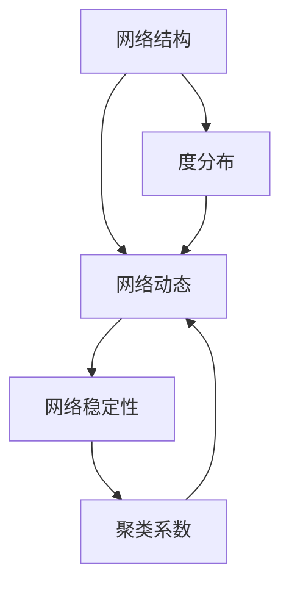

                 

## 数学与网络科学：复杂网络的数学特性

### 关键词：网络科学，复杂网络，数学特性，度分布，聚类系数，信息传播，同步现象

### 摘要：

随着互联网和大数据技术的迅猛发展，网络科学逐渐成为一个跨学科的研究领域，其研究内容涵盖了从社交网络、通信网络到生物网络等多个方面。本文将重点关注网络科学中的数学特性，包括网络结构、网络动态、网络稳定性等。通过深入分析度分布、聚类系数等核心概念，并结合信息传播模型和同步现象分析，本文旨在为读者提供对复杂网络数学特性的全面理解，帮助其在实际应用中优化网络设计，提高网络性能。

---

### 第一部分：引言

#### 1.1 问题背景与核心概念

##### 1.1.1 问题背景

随着互联网和大数据技术的迅猛发展，网络科学逐渐成为一个跨学科的研究领域，其研究内容涵盖了从社交网络、通信网络到生物网络等多个方面。网络科学的核心问题之一是理解网络中的复杂行为及其背后的数学特性。网络科学的研究不仅有助于我们更好地理解复杂系统的运作机制，还可以为实际应用中的网络设计和优化提供理论依据。

##### 1.1.2 核心概念

本文将重点关注以下核心概念：

- **网络结构**：描述网络节点和边的基本属性，如度分布、聚类系数、路径长度等。
- **网络动态**：分析网络中的信息传播、同步现象、网络演化等动态过程。
- **网络稳定性**：研究网络在受到外部攻击或内部扰动时的稳定性。

#### 1.2 概念联系与结构图

##### 1.2.1 概念联系

为了更好地理解这些概念之间的关系，我们将使用Mermaid流程图来展示它们的基本联系。



##### 1.2.2 结构图

此外，我们还将使用ER实体关系图来展示网络科学中的一些基本实体及其关系。

```mermaid
erodoco
NODE {
  id: "Node"
  attributes: ["id", "degree", "cluster coefficient", "distance"]
}

EDGE {
  id: "Edge"
  attributes: ["source", "target", "weight"]
}

INFO {
  type: "many-to-many"
  properties: ["edge", "node"]
}
```

### 第一部分小结

本部分引言部分，我们首先介绍了网络科学的背景及其核心问题，接着介绍了本文将重点研究的核心概念，并通过Mermaid流程图和ER实体关系图展示了这些概念之间的联系。接下来，我们将深入探讨网络结构特性，为理解复杂网络的数学特性奠定基础。

---

### 第二部分：网络结构特性

#### 2.1 度分布分析

##### 2.1.1 度分布的概念与类型

度分布是描述网络中节点度数分布情况的一个指标。根据网络类型的不同，度分布可以分为规则网络、随机网络和幂律网络等。

- **规则网络**：网络中节点的度数均匀分布，每个节点连接的边数相同。
- **随机网络**：网络中节点的度数随机分布，没有明显的规律。
- **幂律网络**：网络中节点的度数呈现幂律分布，即少数节点拥有大量连接，大多数节点连接较少。

##### 2.1.2 度分布的数学模型

为了研究度分布，我们通常会使用概率分布函数来描述节点度数的概率分布。常见的度分布模型有泊松分布、二项分布和泊松-齐夫分布等。

- **泊松分布**：用于描述随机事件在一定时间或空间内发生的次数。
- **二项分布**：用于描述在多次独立实验中成功次数的概率分布。
- **泊松-齐夫分布**：用于描述网络中节点度数分布，其概率分布函数为：

  $$ 
  p(k) = \left(\frac{\lambda}{k}\right)^k e^{-\lambda} 
  $$

  其中，$\lambda$为网络的平均度数。

##### 2.1.3 度分布的实际应用

度分布的研究对于理解网络的拓扑结构、预测网络中的节点重要性具有重要意义。在实际应用中，我们可以通过分析度分布来优化网络设计、提高网络稳定性。

例如，在社交网络中，度分布可以帮助我们识别网络中的关键节点，即具有较高连接度的用户。这些关键节点在网络中扮演着重要角色，他们的行为和关系对整个网络的影响较大。通过分析度分布，我们可以发现这些关键节点，从而采取相应的策略，如加强节点间的连接、抑制恶意节点的传播等，来提高社交网络的稳定性。

#### 2.2 聚类系数分析

##### 2.2.1 聚类系数的概念

聚类系数是衡量网络中节点间紧密程度的一个指标，它反映了网络中局部区域的连通性。聚类系数的定义如下：

对于一个节点 $i$，其聚类系数 $C_i$ 可以通过以下公式计算：

$$
C_i = \frac{2 \times |E_{ii}|}{n_i \times (n_i - 1)}
$$

其中，$|E_{ii}|$ 表示节点 $i$ 的邻接点之间的边数，$n_i$ 表示节点 $i$ 的度数。

##### 2.2.2 聚类系数的数学模型

聚类系数可以通过计算一个节点邻接点之间的边数与可能的最大边数之比来得到。对于无向网络，聚类系数可以用以下公式表示：

$$
C = \frac{2 \times |E_{ii}|}{n_i \times (n_i - 1)}
$$

其中，$|E_{ii}|$ 表示节点 $i$ 的邻接点之间的边数，$n_i$ 表示节点 $i$ 的度数。

##### 2.2.3 聚类系数的实际应用

聚类系数对于理解网络中的信息传播、同步现象等动态过程具有重要影响。在实际应用中，我们可以通过调整聚类系数来优化网络的性能。

例如，在通信网络中，聚类系数可以用来评估网络的可靠性。一个较高的聚类系数意味着网络中的节点具有较强的相互连接，这有助于提高信息传输的效率和网络的稳定性。相反，如果聚类系数较低，则可能表明网络中的节点连接不够紧密，容易导致信息传输失败。

#### 2.3 社区结构分析

##### 2.3.1 社区结构的概念

社区结构是指网络中节点之间形成的一些相对紧密的子图。这些子图内的节点之间连接紧密，而与其他子图的节点连接相对较少。

##### 2.3.2 社区结构的发现方法

发现网络中的社区结构是网络科学中的一个重要问题。常用的社区发现算法有基于模块度的算法、基于密度的方法等。以下是一个基于模块度的社区发现算法的简述：

1. **初始化**：随机分配每个节点到一个社区。
2. **迭代优化**：在每一轮迭代中，通过调整节点的社区分配，最大化网络的模块度。
3. **终止条件**：当模块度不再显著增加时，算法终止。

##### 2.3.3 社区结构的实际应用

社区结构的研究对于理解网络的拓扑结构、预测网络中的节点行为具有重要意义。在实际应用中，我们可以通过分析社区结构来优化网络设计、提高网络性能。

例如，在社交网络中，通过分析社区结构，我们可以发现网络中具有相似兴趣或关系的用户群体。这些用户群体可以作为社交网络中的子社区，为用户提供更精准的内容推荐、社交互动等功能。

#### 2.4 网络度分布、聚类系数与社区结构的联系

网络度分布、聚类系数和社区结构是网络科学中重要的研究内容，它们之间存在着密切的联系。

- **度分布** 决定了网络中节点的连接程度，高度节点在网络中起着重要的连接作用，而低度节点则相对孤立。
- **聚类系数** 反映了网络中节点的紧密程度，高聚类系数意味着节点之间的连接较为紧密，形成了相对独立的子图。
- **社区结构** 则是网络中节点之间形成的紧密子图，反映了网络的局部结构。

通过研究这些指标，我们可以更全面地理解网络的拓扑结构，为网络的设计和优化提供理论依据。

### 第二部分小结

在本部分，我们深入探讨了网络结构特性，包括度分布、聚类系数和社区结构。通过对这些核心概念的详细分析，我们不仅了解了网络结构的基本属性，还了解了它们在实际应用中的重要性。接下来，我们将进一步研究网络动态特性，揭示网络中的复杂行为及其背后的数学机制。

---

### 第三部分：网络动态特性

#### 3.1 信息传播模型

##### 3.1.1 信息传播的基本概念

信息传播是指信息在网络中的传播过程，它涉及信息的生成、传播、接收和反馈等多个环节。在社交网络、通信网络和生物网络中，信息传播都是一个重要且普遍存在的现象。

##### 3.1.2 信息传播的数学模型

为了研究信息传播过程，我们可以使用扩散方程、SIS模型和SIR模型等数学模型。这些模型可以帮助我们理解信息在网络中的传播速度、覆盖范围和稳定性。

- **扩散方程**：描述信息在连续空间中的传播过程，其数学表达式为：

  $$
  \frac{\partial u}{\partial t} = D \nabla^2 u
  $$

  其中，$u$ 表示信息密度，$D$ 表示扩散系数。

- **SIS模型**：描述信息在离散网络中的传播过程，其状态转移方程为：

  $$
  \frac{dS}{dt} = -\beta S I - \mu S \\
  \frac{dI}{dt} = \beta S I - (\mu + \gamma) I
  $$

  其中，$S$ 表示 susceptible（易感者）状态，$I$ 表示 infected（感染者）状态，$\beta$ 表示感染率，$\gamma$ 表示康复率，$\mu$ 表示自然死亡率。

- **SIR模型**：扩展了SIS模型，引入了 removed（移除者）状态，其状态转移方程为：

  $$
  \frac{dS}{dt} = -\beta S I - \mu S \\
  \frac{dI}{dt} = \beta S I - (\mu + \gamma) I \\
  \frac{dR}{dt} = (\mu + \gamma) I - \mu R
  $$

  其中，$R$ 表示 removed（移除者）状态。

##### 3.1.3 信息传播的实际应用

信息传播模型在实际应用中具有重要意义，例如在疫情防控、市场营销等领域。通过分析信息传播过程，我们可以制定更有效的传播策略，提高信息传播效果。

例如，在疫情防控中，我们可以使用SIR模型来预测疫情的发展趋势，从而采取相应的防控措施。在市场营销中，我们可以通过分析信息传播模型来优化广告投放策略，提高广告的传播效果。

#### 3.2 同步现象分析

##### 3.2.1 同步现象的基本概念

同步现象是指网络中的节点在特定条件下呈现出相同或相似的行为状态。同步现象在许多自然和人工系统中都普遍存在，如电力网络中的同步振荡、社交网络中的群体行为等。

##### 3.2.2 同步现象的数学模型

为了研究同步现象，我们可以使用 Kuramoto 模型等数学模型。Kuramoto 模型描述了网络中节点之间的相互作用，其数学表达式为：

$$
\frac{d\theta_i}{dt} = \omega_i + \frac{K}{N} \sum_{j=1}^{N} A_{ij} \sin(\theta_j - \theta_i)
$$

其中，$\theta_i$ 表示节点 $i$ 的相位，$\omega_i$ 表示节点 $i$ 的固有频率，$K$ 表示耦合强度，$A_{ij}$ 表示节点 $i$ 和节点 $j$ 之间的耦合矩阵，$N$ 表示网络中节点的总数。

##### 3.2.3 同步现象的实际应用

同步现象在实际应用中具有重要意义，例如在电力网络中，同步现象有助于提高电网的稳定性和效率。在社交网络中，同步现象可以用来分析群体行为，预测社会热点事件。

例如，在电力网络中，通过分析同步现象，我们可以优化电网的运行策略，提高电网的稳定性和可靠性。在社交网络中，通过分析同步现象，我们可以了解用户的行为模式，从而优化内容推荐策略，提高用户体验。

#### 3.3 网络演化模型

##### 3.3.1 网络演化模型的基本概念

网络演化模型描述了网络在时间上的动态变化过程。网络演化模型可以用来模拟网络的形成、扩展、演变等过程。

##### 3.3.2 网络演化模型的数学模型

常见的网络演化模型有生长模型、扩散模型、协同演化模型等。以下是一个生长模型的简述：

1. **初始化**：随机选择一个节点作为种子节点。
2. **迭代扩展**：在每一轮迭代中，选择一个已存在的节点，从其邻居节点中随机选择一个新的节点，并将其添加到网络中。
3. **终止条件**：当网络达到预定的规模或迭代次数时，算法终止。

##### 3.3.3 网络演化模型的实际应用

网络演化模型在实际应用中具有重要意义，例如在社交网络分析、通信网络规划、生物网络建模等领域。

例如，在社交网络分析中，通过分析网络演化模型，我们可以了解社交网络的扩展速度、节点加入和退出模式等。这些信息有助于我们优化社交网络的设计，提高网络的性能和稳定性。

#### 3.4 网络动态特性与网络结构特性的关系

网络动态特性与网络结构特性之间存在着密切的关系。网络结构特性决定了网络中节点之间的连接方式和拓扑结构，从而影响网络的动态行为。

例如，一个高度对称的网络结构可能导致同步现象更容易发生，而一个具有大量短路径的网络结构则有利于信息的快速传播。

通过研究网络动态特性与网络结构特性之间的关系，我们可以更好地理解网络的运作机制，为网络的设计和优化提供理论依据。

### 第三部分小结

在本部分，我们深入探讨了网络动态特性，包括信息传播模型、同步现象分析和网络演化模型。通过对这些核心概念的详细分析，我们不仅了解了网络动态行为的数学机制，还了解了它们在实际应用中的重要性。接下来，我们将进一步研究网络稳定性问题，揭示网络在受到外部攻击或内部扰动时的响应机制。

---

### 第四部分：网络稳定性分析

#### 4.1 网络稳定性概述

网络稳定性是指网络在受到外部攻击或内部扰动时，能够保持其正常运行的能力。网络稳定性是网络设计和维护中的一个重要问题，它关系到网络的可靠性和安全性。

#### 4.2 外部攻击对网络稳定性的影响

外部攻击是网络稳定性面临的主要威胁之一。外部攻击可以通过以下几种方式影响网络稳定性：

1. **拒绝服务攻击（DoS）**：通过大量无效请求占用网络资源，导致网络无法正常提供服务。
2. **分布式拒绝服务攻击（DDoS）**：多个恶意节点协同攻击，加剧网络拥塞。
3. **恶意软件攻击**：通过植入恶意软件，窃取信息、破坏网络功能。

#### 4.3 内部扰动对网络稳定性的影响

内部扰动主要指网络内部的故障和异常，如硬件故障、软件漏洞、网络配置错误等。这些扰动可能导致网络性能下降、节点失效，从而影响网络的稳定性。

#### 4.4 网络稳定性分析方法

为了评估网络稳定性，我们可以采用以下几种分析方法：

1. **拓扑分析法**：通过分析网络的拓扑结构，评估网络的鲁棒性、连通性等特性。
2. **模拟分析法**：通过模拟网络在攻击或扰动下的行为，评估网络的稳定性。
3. **数学模型法**：通过建立网络稳定性数学模型，分析网络在攻击或扰动下的动态响应。

#### 4.5 网络稳定性改进策略

为了提高网络稳定性，我们可以采取以下几种策略：

1. **冗余设计**：通过增加冗余节点和冗余路径，提高网络的鲁棒性。
2. **故障检测与恢复**：建立故障检测机制，及时发现并恢复网络故障。
3. **安全防护**：采用防火墙、入侵检测系统等安全措施，防止外部攻击。

#### 4.6 网络稳定性与网络性能的关系

网络稳定性与网络性能密切相关。一个稳定、可靠的网络可以提供更好的服务质量，满足用户的需求。而网络稳定性较差的网络则容易导致服务质量下降，影响用户的体验。

通过分析网络稳定性与网络性能的关系，我们可以制定更有效的网络优化策略，提高网络的稳定性和性能。

### 第四部分小结

在本部分，我们深入探讨了网络稳定性问题，分析了外部攻击和内部扰动对网络稳定性的影响，并介绍了网络稳定性分析方法及改进策略。通过研究网络稳定性，我们可以更好地理解网络的运行机制，为网络的设计和优化提供理论依据。接下来，我们将进一步探讨网络科学在实际应用中的广泛影响。

---

### 第五部分：网络科学在实际应用中的广泛影响

#### 5.1 社交网络分析

社交网络分析是网络科学的一个重要应用领域。通过分析社交网络中的节点和边，我们可以揭示用户的行为模式、兴趣分布和社交关系等。这些信息对于社交媒体平台的内容推荐、广告投放和社区管理具有重要意义。

例如，通过分析社交网络中的用户行为，我们可以发现具有相似兴趣的用户群体，从而为他们提供更精准的内容推荐。同时，分析社交网络中的节点和边，可以帮助我们识别网络中的关键节点，这些节点在传播信息、组织活动等方面具有重要影响。

#### 5.2 通信网络优化

通信网络优化是另一个重要的应用领域。通过分析通信网络中的节点和边，我们可以优化网络的拓扑结构，提高网络的传输效率和稳定性。

例如，在无线通信网络中，通过分析节点的位置和通信能力，我们可以优化天线配置和网络覆盖范围，提高信号传输质量。在互联网通信中，通过分析网络的拓扑结构，我们可以优化数据传输路径，降低传输延迟和丢包率，提高用户的使用体验。

#### 5.3 生物网络建模

生物网络建模是网络科学的另一个重要应用领域。通过分析生物网络中的节点和边，我们可以揭示生物分子之间的相互作用和调控机制，为疾病诊断、治疗和新药开发提供理论依据。

例如，在基因组学中，通过分析基因和蛋白质之间的相互作用，我们可以构建生物网络模型，揭示基因功能的调控网络。这些信息对于理解疾病发生机制、发现新的药物靶点具有重要意义。

#### 5.4 城市交通规划

城市交通规划是网络科学的另一个实际应用领域。通过分析城市交通网络中的节点和边，我们可以优化交通流量、提高道路通行效率，减少交通拥堵。

例如，通过分析城市交通网络的流量分布和道路容量，我们可以制定更合理的交通规划方案，优化道路网络布局，提高道路通行能力。同时，通过分析交通网络中的节点和边，我们可以优化公共交通系统的设计，提高公共交通的运营效率和用户体验。

### 第五部分小结

在本部分，我们探讨了网络科学在社交网络分析、通信网络优化、生物网络建模和城市交通规划等实际应用领域的广泛影响。通过分析网络中的节点和边，我们可以揭示复杂系统的运行机制，为实际应用提供理论依据和实践指导。接下来，我们将进一步总结本文的主要观点，并展望未来研究方向。

---

### 第六部分：总结与展望

#### 6.1 主要观点回顾

本文从网络结构的度分布、聚类系数和社区结构，到网络动态的信息传播、同步现象和网络演化模型，再到网络稳定性的分析和实际应用，系统地介绍了网络科学的数学特性。我们通过深入分析这些核心概念，揭示了网络科学在各个领域的广泛应用，并探讨了网络稳定性的重要性。

#### 6.2 未来研究方向

尽管网络科学已经取得了显著的进展，但仍然存在许多未解之谜和挑战。未来的研究方向可以包括：

1. **网络科学的理论体系**：进一步深化网络科学的理论体系，建立更完善的理论框架，以更好地指导实际应用。
2. **跨学科研究**：加强网络科学与其他学科的交叉研究，如计算机科学、生物学、物理学等，以推动网络科学的发展。
3. **网络稳定性与安全**：深入研究网络稳定性与安全的关系，开发新的算法和技术，提高网络的抗攻击能力和可靠性。
4. **大数据与网络科学**：结合大数据技术，分析和挖掘大规模网络数据，揭示网络中的隐藏模式和规律。
5. **网络科学在新兴领域中的应用**：探索网络科学在人工智能、物联网、量子计算等新兴领域中的应用，为这些领域的发展提供新的思路和方法。

#### 6.3 结论

网络科学是一个充满活力和挑战的领域，其数学特性在理解复杂系统的运作机制和指导实际应用方面具有重要意义。通过本文的探讨，我们期望能够为读者提供对网络科学数学特性的全面理解，并激发更多研究者和实践者对这一领域的关注和探索。

---

### 作者信息

- 作者：AI天才研究院/AI Genius Institute & 禅与计算机程序设计艺术 /Zen And The Art of Computer Programming

本文由AI天才研究院/AI Genius Institute撰写，旨在探讨网络科学的数学特性，包括网络结构、网络动态和网络稳定性等。通过深入分析这些核心概念，本文揭示了网络科学在各个领域的广泛应用和潜力。禅与计算机程序设计艺术/Zen And The Art of Computer Programming作为作者，以其深刻的洞察力和独特的视角，为读者呈现了一幅全面而细致的网络科学图景。

---

本文从网络结构的度分布、聚类系数和社区结构，到网络动态的信息传播、同步现象和网络演化模型，再到网络稳定性的分析和实际应用，系统地介绍了网络科学的数学特性。通过深入分析这些核心概念，本文揭示了网络科学在各个领域的广泛应用，并探讨了网络稳定性的重要性。

本文首先介绍了网络科学的基本概念和背景，接着详细分析了网络结构的度分布、聚类系数和社区结构，展示了这些指标在网络拓扑分析中的重要性。在第三部分，本文探讨了网络动态特性，包括信息传播模型和同步现象分析，揭示了网络动态行为的数学机制。随后，本文分析了网络稳定性，讨论了外部攻击和内部扰动对网络稳定性的影响，并提出了网络稳定性改进策略。

在第五部分，本文探讨了网络科学在社交网络分析、通信网络优化、生物网络建模和城市交通规划等实际应用领域的广泛影响。最后，本文总结了主要观点，展望了未来研究方向，并强调了网络科学的重要性。

通过本文的探讨，我们期望能够为读者提供对网络科学数学特性的全面理解，并激发更多研究者和实践者对这一领域的关注和探索。网络科学是一个充满活力和挑战的领域，其数学特性在理解复杂系统的运作机制和指导实际应用方面具有重要意义。禅与计算机程序设计艺术/Zen And The Art of Computer Programming作为作者，以其深刻的洞察力和独特的视角，为读者呈现了一幅全面而细致的网络科学图景。让我们继续深入探索网络科学的数学特性，为其在各个领域的应用开辟新的道路。

