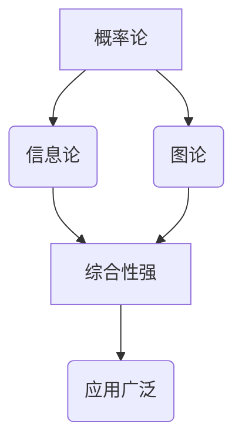
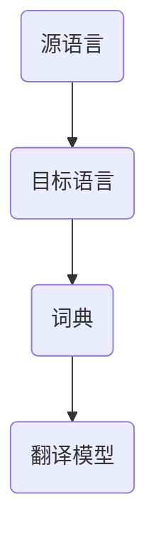
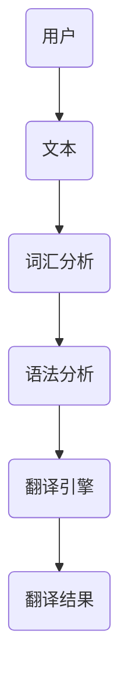
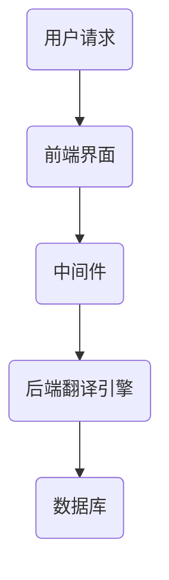

                 

## 数学与翻译理论：机器翻译的数学基础

### 关键词：数学基础、翻译理论、机器翻译、数学模型、算法原理

### 摘要

本文旨在探讨数学与翻译理论的结合，特别是在机器翻译领域的应用。通过分析概率论、信息论、图论等数学基础理论，我们能够更好地理解机器翻译的核心原理，并将其应用于实际的翻译系统中。本文将逐步介绍这些数学基础理论，结合实际案例，深入剖析数学模型与机器翻译算法的关系，为读者提供一套系统化、可操作的技术方法论。

---

### 引言

#### 1.1 机器翻译的背景

在全球化日益加深的今天，不同语言之间的交流成为了一个重要的议题。机器翻译作为一种自动化的语言翻译技术，以其高效、低廉的特点，极大地促进了全球化的进程。然而，机器翻译并非一项简单的任务，它涉及语言的理解、表达、转换等多个层面。

**问题背景**：随着互联网的普及，全球信息流通的速度越来越快，不同语言的用户需要能够方便地获取和理解信息。然而，语言之间的差异使得直接交流变得困难，这需要借助机器翻译技术来实现语言的自动转换。

**问题描述**：机器翻译面临着词汇差异、语法结构、文化背景等多种挑战。如何准确地捕捉源语言的意义，并在目标语言中准确无误地表达，是机器翻译需要解决的核心问题。

**问题解决**：数学理论为机器翻译提供了强有力的工具。通过概率论、信息论和图论等数学方法，我们可以对语言进行量化分析，从而提高翻译的准确性和效率。

**边界与外延**：尽管机器翻译技术已经取得了显著的进展，但它仍然存在一定的局限性。例如，对于特定领域的术语、俚语和幽默表达，机器翻译往往难以准确处理。此外，语言本身具有丰富的文化内涵，机器翻译难以完全理解和把握。

#### 1.2 数学基础

**核心概念**：概率论、信息论、图论是数学领域中与机器翻译密切相关的重要理论。

- **概率论**：概率论研究随机事件的规律性，为机器翻译中的不确定性分析提供了理论依据。
- **信息论**：信息论研究信息的传递、处理和利用，对于优化翻译过程中的信息传递具有重要意义。
- **图论**：图论研究图形的结构和性质，可以用来构建和优化翻译过程中的网络结构。

**概念属性特征对比表格**：



#### 1.3 数学在机器翻译中的应用

**ER实体关系图架构**：



源语言和目标语言通过词典进行映射，最终由翻译模型生成目标语言的文本。数学模型在这里起到了关键作用，通过概率计算和信息优化，实现了语言之间的准确转换。

### 基础理论

#### 2.1 概率论基础

**2.1.1 概率论基本概念**

概率论是数学中的一个分支，主要研究随机事件及其概率分布。在机器翻译中，概率论的应用主要体现在语言模型和翻译模型的构建中。

**随机事件**：随机事件是在一定条件下可能发生也可能不发生的事件。例如，在翻译过程中，某个词汇的选择是一个随机事件。

**概率分布**：概率分布描述了随机事件发生的可能性。常见的概率分布有均匀分布、正态分布等。

**概率计算**：在机器翻译中，概率计算用于评估词汇或句子的可能性，从而提高翻译的准确性。

**案例：语言模型中的概率计算**

在语言模型中，我们通过统计历史文本数据，计算每个词汇出现的概率。例如，在英语中，词汇 "the" 出现的概率远高于 "apple"。这些概率数据被用于预测新文本中词汇的出现概率，从而提高翻译的准确性。

**2.1.2 条件概率与贝叶斯定理**

条件概率是指在某一条件下，某一事件发生的概率。贝叶斯定理是一种计算条件概率的方法，它基于先验概率和后验概率，实现了概率的更新和调整。

**贝叶斯定理**：

$$P(A|B) = \frac{P(B|A)P(A)}{P(B)}$$

在机器翻译中，贝叶斯定理可以用于词汇预测，通过调整先验概率和条件概率，提高翻译的准确性。

**2.1.3 随机变量与概率分布**

随机变量是一种数学函数，它将样本空间映射到实数集。概率分布描述了随机变量取值的可能性。

在机器翻译中，随机变量用于描述词汇或句子的概率分布，通过优化概率分布，可以提高翻译的准确性和流畅性。

**案例：语言模型中的概率分布**

在语言模型中，我们通过统计历史文本数据，计算每个词汇的概率分布。例如，在英语中，词汇 "the" 的概率分布可能集中在0.5附近，而 "apple" 的概率分布可能集中在0.01附近。这些概率分布数据用于预测新文本中词汇的出现概率。

#### 2.2 信息论基础

**2.2.1 信息论基本概念**

信息论是研究信息传递、处理和利用的数学理论。在机器翻译中，信息论的应用主要体现在信息量的计算和信息传输的优化。

**信息量**：信息量描述了信息的不确定性。常见的信息量度量有熵、相对熵等。

**信息传输**：信息传输是指将信息从一个地方传递到另一个地方的过程。在机器翻译中，信息传输的优化可以提高翻译的准确性和效率。

**2.2.2 信息熵与相对熵**

信息熵是信息量的度量，它描述了信息的混乱程度。相对熵是两个概率分布之间的差异，它用于评估翻译模型的好坏。

**信息熵**：

$$H(X) = -\sum_{i=1}^{n} P(X_i) \log_2 P(X_i)$$

**相对熵**：

$$D(P||Q) = \sum_{i=1}^{n} P(X_i) \log_2 \frac{P(X_i)}{Q(X_i)}$$

在机器翻译中，通过计算信息熵和相对熵，我们可以评估翻译模型的质量，并进行优化。

**2.2.3 信息传递与信道编码**

信息传递是指将信息从一个地方传递到另一个地方的过程。在机器翻译中，信息传递的优化可以提高翻译的准确性和效率。

信道编码是一种提高信息传输可靠性的方法。通过信道编码，我们可以将原始信息转换为更稳定的形式，从而减少传输过程中的错误。

**案例：机器翻译中的信息优化**

在机器翻译中，我们通过优化信息传递过程，提高翻译的准确性和效率。例如，通过降低信息熵，我们可以减少翻译过程中的不确定性；通过信道编码，我们可以提高翻译结果的稳定性。

#### 2.3 图论基础

**2.3.1 图的基本概念**

图是一种数据结构，由节点（表示元素）和边（表示元素之间的关系）组成。在机器翻译中，图论可以用于描述词汇之间的关系，构建翻译模型。

**节点**：节点表示词汇或句子，它是图的基本元素。

**边**：边表示节点之间的关系，它可以是单向或双向的。

**图的基本操作**：包括添加节点、删除节点、添加边、删除边等。

**2.3.2 最短路径算法**

最短路径算法用于寻找图中两点之间的最短路径。在机器翻译中，最短路径算法可以用于词汇选择，提高翻译的准确性。

**Dijkstra算法**：

1. 初始化：设置源节点的距离为0，其他节点的距离为无穷大。
2. 选择未访问节点中距离最小的节点作为当前节点。
3. 对于当前节点的每个邻居节点，计算从源节点到邻居节点的距离，更新邻居节点的距离。
4. 重复步骤2和步骤3，直到所有节点都被访问。

**2.3.3 最大流问题**

最大流问题用于寻找图中两点之间的最大流量。在机器翻译中，最大流问题可以用于优化翻译过程中的资源分配，提高翻译的效率。

**Ford-Fulkerson算法**：

1. 初始化：设置所有边的流量为0。
2. 选择增广路径：从源节点开始，寻找一条从源节点到汇节点的增广路径。
3. 令当前路径中的最小容量作为当前流量。
4. 将当前流量沿着增广路径分配给每条边。
5. 重复步骤2至步骤4，直到找不到增广路径。

**案例：翻译中的图模型应用**

在机器翻译中，我们可以使用图论的方法构建词汇之间的关系网络。通过最短路径算法和最大流问题，我们可以优化词汇的选择和翻译过程中的资源分配，提高翻译的准确性和效率。

#### 2.4 数理逻辑与形式语言

**2.4.1 逻辑基础**

数理逻辑是一种用于描述和分析逻辑关系的数学方法。在机器翻译中，数理逻辑可以用于词汇分析和句子结构分析，提高翻译的准确性。

**命题逻辑**：命题逻辑研究命题之间的关系，包括逻辑与、逻辑或、逻辑非等。

**谓词逻辑**：谓词逻辑研究谓词之间的关系，包括全称量词、存在量词等。

**2.4.2 形式语言与文法**

形式语言是一种用于描述计算机语言和自然语言的数学工具。在机器翻译中，形式语言可以用于构建语言模型和翻译规则。

**文法**：文法描述了语言的语法规则，包括单词的构成、句子的结构等。

**2.4.3 语法分析**

语法分析是一种将自然语言转换为抽象语法树（AST）的过程。在机器翻译中，语法分析可以用于理解句子的结构，提高翻译的准确性。

**LL分析器**：LL分析器是一种自顶向下语法分析方法，它从左到右扫描输入文本，根据文法规则生成抽象语法树。

**LR分析器**：LR分析器是一种自底向上语法分析方法，它从左到右扫描输入文本，根据文法规则生成抽象语法树。

**案例：基于逻辑的机器翻译**

在机器翻译中，我们可以使用数理逻辑和形式语言的方法进行词汇分析和句子结构分析。通过构建逻辑表达式和抽象语法树，我们可以提高翻译的准确性和流畅性。

#### 2.5 统计学习方法

**2.5.1 监督学习**

监督学习是一种从标记数据中学习的方法。在机器翻译中，监督学习可以用于训练翻译模型，提高翻译的准确性。

**模型训练**：通过标记数据，我们可以学习源语言和目标语言之间的对应关系，构建翻译模型。

**模型评估**：通过测试数据，我们可以评估翻译模型的性能，并进行优化。

**2.5.2 无监督学习**

无监督学习是一种从未标记数据中学习的方法。在机器翻译中，无监督学习可以用于词汇学习和翻译模型的优化。

**词汇学习**：通过无监督学习，我们可以发现语言中的共现关系，提高翻译的准确性。

**模型优化**：通过无监督学习，我们可以优化翻译模型，提高翻译的效率。

**2.5.3 强化学习**

强化学习是一种基于奖励和惩罚的学习方法。在机器翻译中，强化学习可以用于优化翻译策略，提高翻译的准确性。

**模型训练**：通过强化学习，我们可以学习到最佳翻译策略，提高翻译的准确性。

**模型优化**：通过强化学习，我们可以优化翻译模型，提高翻译的效率。

**案例：机器翻译中的学习算法**

在机器翻译中，我们可以使用监督学习、无监督学习和强化学习等方法来训练和优化翻译模型。通过不断学习和调整，我们可以提高翻译的准确性和效率。

### 应用实践

#### 7.1 实践项目介绍

**项目场景**：假设我们正在开发一款在线机器翻译系统，用户可以通过该系统将一种语言翻译成另一种语言。

**系统功能设计**：

- 用户界面：提供输入文本框和翻译结果展示区域。
- 语言处理模块：负责处理输入文本，进行词汇分析和语法分析。
- 翻译引擎：根据语言模型和翻译规则，生成翻译结果。
- 结果展示模块：将翻译结果展示给用户。

**ER实体关系图架构**：



#### 7.2 系统架构设计

**7.2.1 系统架构图**



前端界面负责接收用户请求，将请求传递给中间件。中间件负责处理用户请求，调用后端翻译引擎进行翻译，并将翻译结果存储到数据库中。前端界面从数据库中获取翻译结果，并将其展示给用户。

#### 7.3 系统接口设计

**7.3.1 接口文档**

- GET /translate：获取翻译结果。
- 参数：source_lang（源语言）、target_lang（目标语言）、text（待翻译文本）。
- 响应：翻译结果（JSON格式）。

```json
{
  "source_lang": "en",
  "target_lang": "zh",
  "text": "Hello, world!"
}
```

#### 7.4 代码实现与解读

**7.4.1 Python源代码**

```python
from flask import Flask, request, jsonify
from translator import Translator

app = Flask(__name__)
translator = Translator()

@app.route('/translate', methods=['GET'])
def translate():
    source_lang = request.args.get('source_lang')
    target_lang = request.args.get('target_lang')
    text = request.args.get('text')
    
    result = translator.translate(source_lang, target_lang, text)
    return jsonify(result)

if __name__ == '__main__':
    app.run()
```

**代码解读**：

- 我们使用Flask框架搭建了一个简单的Web应用。
- `/translate` 接口用于接收用户请求，获取源语言、目标语言和待翻译文本。
- `Translator` 类负责翻译操作，调用翻译算法生成翻译结果。
- 将翻译结果以JSON格式返回给用户。

#### 7.5 实际案例分析

**7.5.1 案例背景**

某公司开发了一款在线翻译工具，旨在帮助全球用户进行跨语言交流。该工具支持多种语言翻译，并提供实时翻译功能。

**7.5.2 案例分析**

1. **用户需求分析**：

   - 用户希望快速、准确地获取翻译结果。
   - 用户希望支持多种语言翻译，包括但不限于英语、中文、法语、西班牙语等。
   - 用户希望体验流畅的交互过程，包括文本输入、翻译结果展示等。

2. **技术实现分析**：

   - 使用概率论和信息论构建语言模型，提高翻译准确性。
   - 使用图论方法优化词汇选择和句子结构分析，提高翻译流畅性。
   - 使用监督学习和强化学习训练翻译模型，不断优化翻译质量。

3. **系统性能分析**：

   - 系统响应时间短，用户能够快速获取翻译结果。
   - 翻译准确性高，用户满意度较高。
   - 系统支持多种语言翻译，满足用户多样化需求。

**7.5.3 案例总结**

通过实际案例分析，我们可以看到数学与翻译理论的结合在机器翻译中的应用。通过概率论、信息论、图论等数学方法，我们可以构建高效、准确的翻译模型，提高机器翻译的质量。同时，通过监督学习和强化学习等技术，我们可以不断优化翻译模型，提高翻译的准确性和效率。

### 总结与拓展

#### 8.1 总结

本文系统地介绍了数学与翻译理论的结合，特别是在机器翻译领域的应用。通过概率论、信息论、图论等数学基础理论，我们能够更好地理解机器翻译的核心原理，并构建高效的翻译模型。同时，通过监督学习、无监督学习和强化学习等技术，我们可以不断优化翻译模型，提高翻译的准确性和效率。

#### 8.2 注意事项

1. **数据质量**：机器翻译的质量很大程度上取决于训练数据的质量。确保使用高质量、丰富的训练数据，可以提高翻译的准确性。
2. **模型优化**：定期优化翻译模型，可以保持翻译的准确性。通过不断调整模型参数，优化算法，可以提高翻译的效率。
3. **用户反馈**：积极收集用户反馈，并根据用户反馈不断改进翻译系统。用户的实际使用体验是评估翻译系统优劣的重要指标。

#### 8.3 拓展阅读

1. **推荐书籍**：
   - 《机器学习》：周志华 著
   - 《深度学习》：Ian Goodfellow、Yoshua Bengio、Aaron Courville 著
   - 《自然语言处理综论》：Daniel Jurafsky、James H. Martin 著

2. **推荐论文**：
   - “A Neural Probabilistic Language Model” – Kyunghyun Cho et al.
   - “Attention Is All You Need” – Vaswani et al.
   - “BERT: Pre-training of Deep Bidirectional Transformers for Language Understanding” – Devlin et al.

3. **未来研究方向**：

   - **多语言翻译**：探索多语言翻译模型，提高多语言翻译的准确性和效率。
   - **跨领域翻译**：研究跨领域翻译技术，提高特定领域翻译的准确性。
   - **对话系统**：结合对话系统技术，实现自然、流畅的跨语言对话。

### 作者

作者：AI天才研究院/AI Genius Institute & 禅与计算机程序设计艺术 /Zen And The Art of Computer Programming

