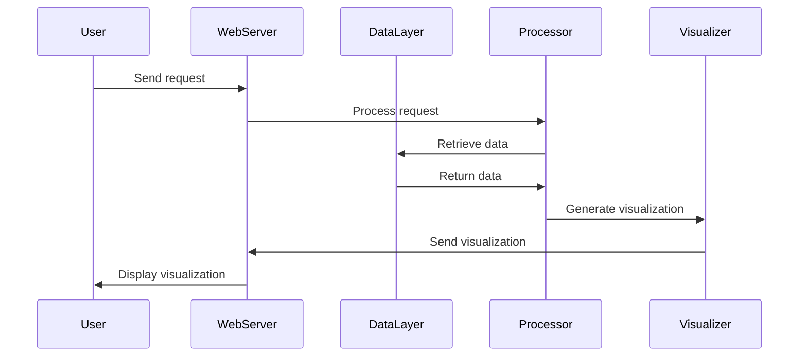
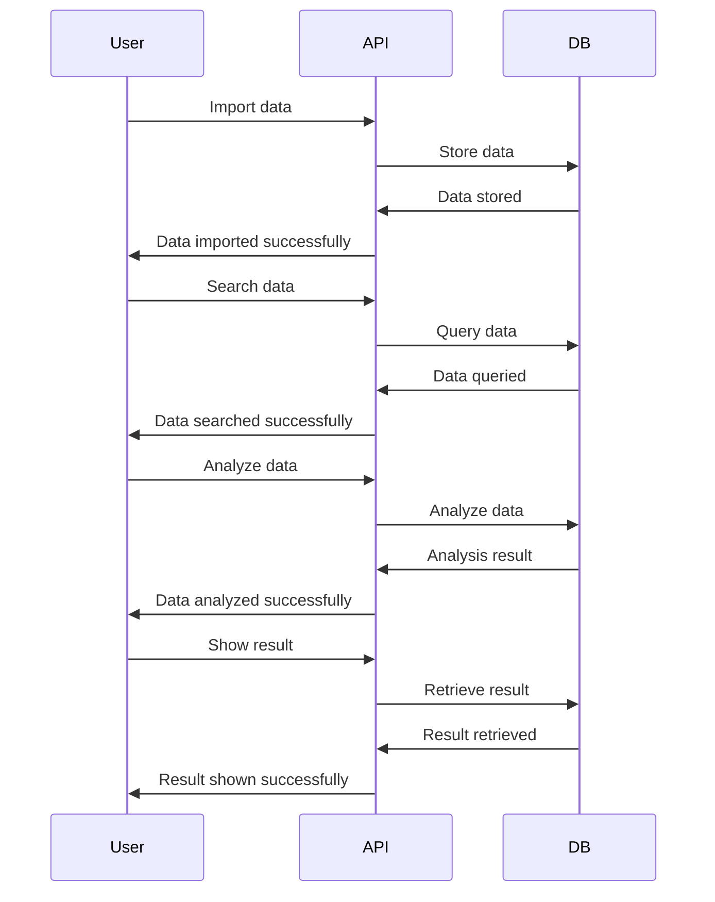

                 

### 引言：数学与考古学的交汇

#### 1.1 问题背景

##### 1.1.1 考古学的挑战

考古学是一门研究人类历史与文化的学科，通过挖掘古代人类活动的遗址、遗迹，揭示过去社会、政治、经济、文化等方面的信息。然而，考古学在实践过程中面临着诸多挑战，如遗址位置的不确定性、遗迹保存状况的差异、数据采集的复杂性等。

##### 1.1.2 数学方法的应用

数学作为一门基础学科，具有高度的抽象和逻辑性，可以提供有效的工具和方法来解决考古学中的问题。例如，统计学可以帮助考古学家对遗址中的文物进行量化分析，几何学可以用于重建古代建筑的结构，概率论可以评估考古发现的不确定性等。

##### 1.1.3 遗址分析的重要性

遗址分析是考古学的重要组成部分，通过对遗址中的文物、遗迹进行系统分析，可以揭示古代社会的生产方式、生活方式、社会组织结构等信息。准确的遗址分析不仅有助于理解历史，还能为现代城市规划、环境保护提供重要的参考。

#### 1.2 问题描述

##### 1.2.1 研究目标

本文旨在探讨数学方法在考古学中的应用，通过分析考古遗址的数学方法，提高遗址分析的科学性和准确性。

##### 1.2.2 解决方法

本文将首先介绍数学在考古学中的基础概念和工具，然后通过具体的数学模型和算法，阐述如何运用数学方法对考古遗址进行深入分析，并讨论在实践中可能遇到的挑战。

##### 1.2.3 边界与外延

本文的研究将聚焦于数学方法在考古学中的应用，探讨的范围包括统计、几何、概率等数学工具在考古遗址分析中的实际应用。同时，本文也将讨论这些方法在考古学中的边界条件和应用外延。

#### 1.3 问题解决

##### 1.3.1 数学方法的选择

选择合适的数学方法对于遗址分析至关重要。本文将首先介绍统计学、几何学和概率论在考古学中的应用，然后根据具体的研究目标选择合适的数学工具。

##### 1.3.2 数学工具的应用

在了解数学方法后，本文将详细介绍如何运用这些数学工具对考古遗址进行数据收集、处理和分析。例如，通过统计学方法分析文物分布，利用几何学重建遗址结构，使用概率论评估考古发现的可信度等。

##### 1.3.3 考古学中的数学问题

考古学中的数学问题具有独特性，如遗址分布的随机性、文物年代的确定性等。本文将探讨这些数学问题，并提出相应的解决方案。

#### 1.4 概念结构与核心要素

##### 1.4.1 数学概念

数学概念包括统计学、几何学和概率论等，这些概念是遗址分析的基础。本文将详细解释这些概念，并阐述它们在考古学中的应用。

##### 1.4.2 考古学核心要素

考古学核心要素包括遗址、遗迹、文物等，这些要素是遗址分析的对象。本文将介绍如何通过数学方法对考古学核心要素进行量化分析和解读。

##### 1.4.3 二者联系

数学与考古学的联系在于数学方法为考古学提供了有力的工具，使得考古学研究更加科学和精确。本文将探讨数学方法在考古学中的具体应用，展示数学与考古学的融合。

##### 1.5 本章小结

本章介绍了数学方法在考古学中的应用背景、研究目标、解决方法以及概念结构和核心要素。通过本章的介绍，读者可以对数学在考古学中的作用有一个初步了解，为后续章节的深入探讨打下基础。

---

### 第1章：问题解决

#### 1.3.1 数学方法的选择

在解决考古学问题时，选择合适的数学方法至关重要。以下是一些常用的数学方法及其在考古学中的应用：

1. **统计学**：
   - **应用**：用于分析文物分布、年代序列、遗址密度等。
   - **优势**：能够量化数据，提供数据的概率分布和相关性分析。

2. **几何学**：
   - **应用**：用于重建遗址结构、测量文物尺寸、计算遗址面积等。
   - **优势**：提供空间关系的直观表达，有助于理解遗址的空间布局。

3. **概率论**：
   - **应用**：用于评估考古发现的可信度、预测遗址分布等。
   - **优势**：能够处理不确定性，提供对考古结果的概率估计。

4. **线性代数**：
   - **应用**：用于处理大量考古数据，如遗址的多元统计分析。
   - **优势**：能够高效处理多维数据，提供数据的综合分析。

5. **图论**：
   - **应用**：用于分析遗址之间的关系、文物在网络中的传播路径等。
   - **优势**：能够揭示复杂网络结构，帮助理解遗址的社交和文化关系。

根据研究目标，可以选择一种或多种数学方法进行综合应用。例如，在研究遗址分布时，可以结合统计学和几何学方法，通过统计分析遗址密度，利用几何学重建遗址结构。

#### 1.3.2 数学工具的应用

在考古学研究中，数学工具的应用可以极大地提高研究的准确性和科学性。以下是一些常见的数学工具及其在考古学中的应用：

1. **聚类分析**：
   - **应用**：用于识别相似遗址，划分遗址群体。
   - **示例**：通过聚类分析，可以将考古遗址划分为文化区域，有助于研究文化的传播和变迁。

2. **时间序列分析**：
   - **应用**：用于分析遗址的年代序列，揭示历史事件的时序关系。
   - **示例**：通过时间序列分析，可以确定遗址的建造和废弃时间，有助于研究古代社会的经济发展。

3. **主成分分析**：
   - **应用**：用于减少数据维度，提取关键信息。
   - **示例**：通过主成分分析，可以从大量的考古数据中提取主要影响因素，简化数据结构。

4. **回归分析**：
   - **应用**：用于建立变量之间的关系模型，预测未知数据。
   - **示例**：通过回归分析，可以预测遗址的发掘概率，帮助考古学家规划发掘计划。

5. **空间插值**：
   - **应用**：用于填补数据缺失，推测未发掘的遗址位置。
   - **示例**：通过空间插值，可以在已知遗址位置的基础上，推测未知遗址的可能位置。

#### 1.3.3 考古学中的数学问题

考古学中的数学问题具有独特性，需要针对具体问题设计合适的数学模型和方法。以下是一些常见的数学问题及其解决方法：

1. **遗址分布模型**：
   - **问题**：如何解释遗址的分布模式？
   - **方法**：可以运用概率模型，如泊松分布或高斯分布，分析遗址的分布规律。

2. **文物年代序列**：
   - **问题**：如何确定文物的年代顺序？
   - **方法**：可以使用放射性碳测年法等，结合统计学方法分析年代序列。

3. **遗址结构重建**：
   - **问题**：如何恢复遗址的原始结构？
   - **方法**：可以使用几何学和计算机图形学方法，结合文物测量数据进行结构重建。

4. **文物来源分析**：
   - **问题**：如何确定文物的来源地？
   - **方法**：可以通过化学成分分析、微痕分析等方法，结合统计学模型进行文物来源分析。

5. **考古风险评价**：
   - **问题**：如何评估考古发掘的风险？
   - **方法**：可以使用概率论和风险分析模型，评估考古发掘中可能遇到的风险和损失。

#### 1.4 概念结构与核心要素

在考古学中，数学概念和工具的应用构成了遗址分析的概念结构和核心要素。以下是对这些要素的详细解释：

1. **数学概念**：
   - **统计学**：提供数据分析的工具，如概率分布、假设检验等。
   - **几何学**：用于描述和重建空间结构，如点、线、面等。
   - **概率论**：用于处理不确定性，如随机变量、概率分布等。
   - **线性代数**：用于处理高维数据，如矩阵运算、特征值分析等。
   - **图论**：用于分析复杂网络结构，如图的拓扑性质等。

2. **考古学核心要素**：
   - **遗址**：考古学研究的对象，包含文物、遗迹等。
   - **文物**：反映古代社会文化的重要证据。
   - **遗迹**：古代人类活动的痕迹，如建筑、道路等。
   - **数据**：考古发掘和调查得到的信息。

3. **二者联系**：
   - **数学方法**为考古学提供了量化分析的工具，使得考古学研究更加科学和精确。
   - **考古学问题**通过数学方法得到分析和解决，提高了遗址分析的质量和效率。

通过上述数学方法和工具的应用，考古学能够更好地理解过去，为现代社会的可持续发展提供历史参考。

#### 1.5 本章小结

本章介绍了数学方法在考古学中的重要性，阐述了选择数学方法的原则和应用，并探讨了考古学中的数学问题及其解决方法。通过本章的内容，读者可以了解到数学在考古学中的广泛应用，以及如何运用数学方法提高遗址分析的科学性和准确性。

---

### 第2章：数学概念解析

在考古学研究中，数学概念和工具的使用至关重要，它们为考古学家提供了量化分析的手段，提高了研究的精确度和科学性。本章将详细解析统计学、几何学、概率论等数学概念，并讨论这些概念在考古学中的应用。

#### 2.1 数学基础

##### 2.1.1 数学和考古学的定义

数学是一门研究数量、结构、变化和空间等概念的抽象科学。考古学则是一门研究人类历史和文化的学科，通过发掘和研究古代遗址、文物等来揭示人类文明的发展历程。

##### 2.1.2 数学和考古学的基本原理

数学的基本原理包括逻辑性、抽象性和严谨性。考古学的基本原理则包括地层学、类型学、测年学等。这两门学科的结合，使得考古学研究更加科学和系统。

##### 2.1.3 数学和考古学的应用领域

数学在考古学中的应用领域广泛，包括统计分析、空间分析、概率评估等。通过数学方法，考古学家能够对遗址进行量化分析，揭示考古现象的内在规律。

#### 2.2 考古学中的数学工具

##### 2.2.1 统计学

统计学是考古学中常用的数学工具之一，主要用于数据分析、假设检验、回归分析等。在考古学中，统计学方法可以帮助考古学家分析文物分布、遗址密度等，从而揭示考古现象的规律。

1. **数据分析**：通过统计数据，了解遗址中各种文物的分布情况。
2. **假设检验**：用于验证考古学假设，例如遗址年代的一致性检验。
3. **回归分析**：建立考古变量之间的关系模型，例如文物年代与遗址分布的关系。

##### 2.2.2 几何学

几何学在考古学中的应用主要体现在遗址结构的重建和测量上。通过几何学原理，考古学家可以准确测量遗址的大小、形状、方向等，从而重建古代建筑和遗址的全貌。

1. **遗址结构重建**：利用几何学原理，对遗址的墙体、道路等进行重建。
2. **测量与绘图**：使用几何学方法，绘制遗址的平面图和立体图。
3. **空间分析**：通过几何学方法，分析遗址的空间布局和结构关系。

##### 2.2.3 概率论

概率论在考古学中的应用主要体现在风险评估和统计推断上。通过概率论，考古学家可以对考古发现的可靠性进行评估，预测考古发掘的结果。

1. **风险评估**：通过概率论方法，评估考古发掘中的风险和不确定性。
2. **统计推断**：利用概率论方法，从样本数据推断总体特征，例如遗址的年代分布。
3. **概率分布**：通过概率分布模型，描述考古现象的概率特征。

#### 2.3 数学方法在考古学中的应用

##### 2.3.1 数据分析

数据分析是考古学研究中不可或缺的一环。通过统计分析，考古学家可以揭示遗址中各种文物的分布规律，推断遗址的文化特征。

1. **描述性统计**：通过计算平均值、标准差等，描述遗址中各种文物的分布情况。
2. **推断性统计**：通过假设检验和回归分析，推断遗址的年代、文化背景等。
3. **多变量分析**：通过主成分分析、聚类分析等，提取数据中的关键信息。

##### 2.3.2 形状分析

形状分析主要用于遗址结构的重建和测量。通过几何学方法，考古学家可以准确测量遗址的尺寸、形状和方向，从而重建古代建筑和遗址的全貌。

1. **尺寸测量**：使用几何学工具，测量遗址的墙体、地基等尺寸。
2. **形状重建**：利用几何学原理，重建遗址的平面图和立体图。
3. **空间分析**：通过几何学方法，分析遗址的空间布局和结构关系。

##### 2.3.3 时空分析

时空分析是考古学中的重要方法，通过分析遗址的年代和空间分布，考古学家可以揭示古代社会的文化变迁和发展。

1. **年代序列**：通过放射性碳测年法等，建立遗址的年代序列。
2. **时空分布**：通过空间分析和时间序列分析，揭示遗址的空间分布特征。
3. **文化变迁**：通过时空分析，推断古代社会的文化特征和变迁。

#### 2.4 ER实体关系图与类图

在考古学中，实体关系图（ER图）和类图是用于描述考古数据结构的重要工具。

##### ER实体关系图

实体关系图用于描述考古数据中的实体及其之间的关系。以下是一个简单的ER实体关系图的示例：

```mermaid
erDiagram
    BDEC ||--|{ CDEF }
    CDEF :--|{ DEF }
    BDEC ||--|{ FAS }
    FAS :--|{ AS }
```

在这个ER图中，`BDEC`表示遗址，`CDEF`表示文物，`DEF`表示遗迹，`FAS`表示考古调查。

##### 类图

类图用于描述考古数据中的类及其属性和关系。以下是一个简单的类图的示例：

```mermaid
classDiagram
    Class01 <|-- Class02
    Class03 <|-- Class02
    Class04 --| Class05
    Class06 === Class07
    Class08.. Class09
```

在这个类图中，`Class01`表示遗址，`Class02`表示文物，`Class03`表示遗迹，`Class04`表示考古调查，`Class05`表示年代，`Class06`表示文化特征，`Class07`表示类型，`Class08`表示地点，`Class09`表示时间。

#### 2.5 考古学中的数学挑战

##### 2.5.1 数据质量

考古数据的质量直接影响到研究的准确性。数据质量包括数据的完整性、准确性和一致性。为了确保数据质量，考古学家需要进行详细的数据采集和严格的数据审核。

##### 2.5.2 数据来源

考古数据的来源多样，包括文献资料、考古发掘、遥感图像等。不同来源的数据可能存在差异，需要进行数据整合和一致性处理。

##### 2.5.3 数据分析难易度

考古数据的复杂性和多样性使得数据分析具有一定的难度。为了提高数据分析的效率，考古学家需要运用多种数学方法和工具，进行数据预处理和特征提取。

#### 2.6 本章小结

本章详细解析了统计学、几何学、概率论等数学概念，并讨论了这些概念在考古学中的应用。通过本章的内容，读者可以了解到数学方法在考古学研究中的重要性，以及如何运用数学方法提高遗址分析的科学性和准确性。

---

### 第3章：数学模型在考古中的应用

在考古学研究中，数学模型的应用为遗址分析提供了科学依据和有效手段。本章将详细介绍数学模型在考古中的应用，包括算法基本原理、数学模型及其应用，并通过具体案例展示数学模型在实际考古研究中的运用。

#### 3.1 算法基本原理

算法是数学模型在考古学中的具体实现，用于处理和分析考古数据。以下是一些基本的算法原理和分类：

##### 3.1.1 算法定义

算法是一系列明确的步骤，用于解决特定问题。在考古学中，算法用于处理数据、提取特征、重建结构等。

##### 3.1.2 算法分类

1. **数据分析算法**：如聚类分析、回归分析、主成分分析等，用于对考古数据进行处理和解释。
2. **几何重建算法**：如三角剖分、空间网格化等，用于重建遗址结构。
3. **时空分析算法**：如时间序列分析、空间插值等，用于分析遗址的年代和空间分布。

##### 3.1.3 算法设计原则

1. **准确性**：算法应能准确处理和分析考古数据，确保研究结果的可靠性。
2. **效率**：算法应尽可能高效，以减少计算时间和资源消耗。
3. **可扩展性**：算法应能适应不同规模和复杂度的考古数据。

#### 3.2 数学模型

数学模型是描述考古现象的数学表达式，用于揭示考古数据中的内在规律。以下是一些常用的数学模型：

##### 3.2.1 模型公式

一个常见的数学模型是线性回归模型，用于分析考古变量之间的关系。其公式如下：

$$
Y = \beta_0 + \beta_1X + \epsilon
$$

其中，$Y$表示因变量，$X$表示自变量，$\beta_0$和$\beta_1$是模型的参数，$\epsilon$是误差项。

##### 3.2.2 模型特性

1. **线性**：线性回归模型假设因变量和自变量之间存在线性关系。
2. **最小二乘法**：模型参数通过最小化误差平方和来确定。
3. **可解释性**：模型的参数具有明确的物理或文化意义。

##### 3.2.3 模型推导

线性回归模型的推导基于最小二乘法。具体推导过程如下：

1. **假设**：假设因变量$Y$和自变量$X$之间满足线性关系。
2. **建立目标函数**：目标函数为误差平方和，即
$$
J(\beta_0, \beta_1) = \sum_{i=1}^n (Y_i - (\beta_0 + \beta_1X_i))^2
$$
3. **求导**：对目标函数求导，并令导数为零，得到：
$$
\frac{\partial J}{\partial \beta_0} = -2\sum_{i=1}^n (Y_i - (\beta_0 + \beta_1X_i)) = 0
$$
$$
\frac{\partial J}{\partial \beta_1} = -2\sum_{i=1}^n (X_i(Y_i - (\beta_0 + \beta_1X_i))) = 0
$$
4. **解方程**：解上述方程，得到模型参数$\beta_0$和$\beta_1$。

##### 3.2.4 数学模型应用示例

以下是一个简单的线性回归模型应用示例：

假设我们要研究遗址年代（$Y$）与遗址面积（$X$）之间的关系。通过收集多个遗址的样本数据，我们可以使用线性回归模型来建立年代与面积之间的关系。

1. **数据收集**：收集多个遗址的面积和年代数据。
2. **数据预处理**：对数据进行标准化处理，消除数据量纲的影响。
3. **模型训练**：使用线性回归模型对数据进行拟合，得到模型参数$\beta_0$和$\beta_1$。
4. **模型评估**：通过计算模型的拟合优度（如R平方值），评估模型的准确性。
5. **结果解释**：根据模型参数，解释遗址年代与面积之间的关系。

#### 3.3 算法流程

算法流程是数学模型在实际考古研究中的具体实现步骤。以下是一个典型的算法流程：

##### 3.3.1 数据预处理

1. **数据清洗**：去除数据中的异常值和缺失值。
2. **数据转换**：将非数值数据转换为数值数据。
3. **数据标准化**：将数据统一到相同的尺度，以便于后续分析。

##### 3.3.2 特征提取

1. **特征选择**：选择对研究目标有显著影响的特征。
2. **特征工程**：通过变换和组合，生成新的特征。

##### 3.3.3 模型训练

1. **选择模型**：根据研究目标选择合适的数学模型。
2. **训练模型**：使用训练数据对模型进行训练，得到模型参数。

##### 3.3.4 模型评估

1. **评估指标**：选择合适的评估指标，如R平方值、准确率等。
2. **模型调整**：根据评估结果调整模型参数，提高模型准确性。

##### 3.3.5 结果输出

1. **结果分析**：分析模型结果，解释考古现象。
2. **可视化**：使用可视化工具展示模型结果，帮助理解考古现象。

#### 3.4 案例分析

以下是一个考古遗址年代分析的案例：

##### 3.4.1 案例背景

某考古团队在调查一个古代城址时，收集了城址内多个遗址的年代数据，包括遗址的年代、遗址面积等。

##### 3.4.2 数据分析

1. **数据收集**：收集城址内遗址的年代和面积数据。
2. **数据预处理**：对数据进行清洗和标准化处理。
3. **特征提取**：选择遗址面积作为特征变量，年代作为因变量。

##### 3.4.3 算法应用

1. **模型选择**：选择线性回归模型。
2. **模型训练**：使用训练数据对模型进行训练，得到模型参数。
3. **模型评估**：计算模型的拟合优度，评估模型准确性。
4. **结果解释**：根据模型参数，解释遗址年代与面积之间的关系。

##### 3.4.4 结果分析

通过线性回归模型分析，发现遗址年代与面积之间存在显著的正相关关系。这表明，较大的遗址通常具有较晚的年代，可能反映了古代城址的发展和扩张。

##### 3.4.5 模型优化

根据模型评估结果，发现模型的拟合优度较低。为进一步提高模型的准确性，可以考虑以下优化措施：

1. **特征选择**：重新选择特征变量，剔除对研究目标影响较小的特征。
2. **模型调整**：尝试不同的模型，如多项式回归或非线性回归，以提高模型拟合度。

#### 3.5 本章小结

本章详细介绍了数学模型在考古学中的应用，包括算法基本原理、数学模型及其应用。通过具体案例，展示了数学模型在考古遗址年代分析中的实际运用。通过本章的学习，读者可以了解到数学模型在考古学研究中的重要性，以及如何运用数学模型提高遗址分析的科学性和准确性。

---

### 第4章：考古遗址分析与解读

考古遗址的分析与解读是考古学研究的核心内容，通过对遗址中各种文物的测量、分析和解释，可以揭示古代人类的生活方式、社会组织结构和历史变迁。本章将介绍考古遗址分析的方法，包括空间分析、时空分析和数据可视化，并通过具体实例进行解读。

#### 4.1 考古遗址概述

##### 4.1.1 考古遗址的定义

考古遗址是指古代人类居住、活动或埋葬的地点，通常包含房屋、墓地、防御工事、生产活动遗迹等。这些遗址是研究古代人类文化和社会的重要物质证据。

##### 4.1.2 考古遗址的种类

考古遗址种类繁多，根据功能和年代可以分为：

1. **居住遗址**：包括房屋、院落、粮仓等。
2. **墓葬遗址**：包括墓地、墓穴、墓碑等。
3. **防御遗址**：包括城墙、堡垒、壕沟等。
4. **生产遗址**：包括作坊、矿坑、农田等。
5. **宗教遗址**：包括神庙、祭坛、碑文等。

##### 4.1.3 考古遗址的重要性

考古遗址是了解古代社会的重要窗口，通过研究这些遗址，可以揭示古代人类的生产方式、生活方式、社会组织结构和文化传承。同时，考古遗址也为现代城市规划、环境保护和文化保护提供了重要参考。

#### 4.2 数学方法在考古遗址分析中的应用

##### 4.2.1 空间分析

空间分析是考古遗址分析中的重要方法，通过测量、分析和解读遗址的空间结构，可以揭示古代人类的生活环境和行为模式。

1. **遗址测绘**：使用几何学方法对遗址进行测绘，建立遗址的平面图和立体图。
2. **空间分布分析**：通过统计学方法分析遗址的空间分布，例如计算遗址的密度、分布模式等。
3. **空间关系分析**：通过几何学方法分析遗址之间的空间关系，例如遗址的排列、距离和角度等。

##### 4.2.2 时空分析

时空分析是考古学中研究遗址年代和空间分布关系的重要方法，通过分析遗址的年代序列和空间分布，可以揭示古代社会的文化变迁和发展。

1. **年代序列分析**：通过放射性碳测年法等，建立遗址的年代序列，分析遗址的建造、使用和废弃时间。
2. **时空分布分析**：通过空间分析和时间序列分析，揭示遗址的空间分布特征，例如遗址的分布范围、密集程度等。
3. **文化变迁分析**：通过时空分析，推断古代社会的文化特征和变迁，例如文化融合、扩散和衰退等。

##### 4.2.3 数据可视化

数据可视化是将考古数据以图形或图像形式展示，使数据更加直观和易于理解。常用的数据可视化方法包括：

1. **散点图**：用于展示遗址的空间分布，例如年代和地点的关系。
2. **柱状图**：用于展示遗址的数量或密度，例如不同年代遗址的分布。
3. **热力图**：用于展示遗址的空间分布，例如不同区域的密度分布。

#### 4.3 实例分析

##### 4.3.1 案例一：古代城址分析

某考古团队在调查一座古代城址时，使用空间分析和时空分析方法进行遗址分析。

1. **数据收集**：收集城址的遗址分布、年代、面积等数据。
2. **空间分析**：通过几何学方法，建立城址的平面图和立体图，分析遗址的空间分布和关系。
3. **时空分析**：通过放射性碳测年法，建立城址的年代序列，分析遗址的年代分布和文化变迁。
4. **结果解读**：发现城址在不同时期的遗址分布和年代序列，揭示了古代城址的发展历程和文化特征。

##### 4.3.2 案例二：陶片分析

在某考古发掘中，考古学家使用陶片分析来揭示古代人类的生产和生活状况。

1. **数据收集**：收集陶片的数量、形状、大小等数据。
2. **统计分析**：通过统计学方法，分析陶片的分布特征和差异，例如计算陶片的平均值和标准差。
3. **形态分析**：通过几何学方法，分析陶片的形状和结构，推断陶器的制作工艺和用途。
4. **结果解读**：发现陶片的分布特征反映了古代人类的生产和生活状况，例如陶器的制作工艺和用途。

##### 4.3.3 案例三：墓葬分析

在某墓葬遗址中，考古学家使用时空分析和数据可视化方法进行墓葬分析。

1. **数据收集**：收集墓葬的年代、位置、墓主身份等数据。
2. **时空分析**：通过放射性碳测年法和地理信息系统（GIS），建立墓葬的年代序列和空间分布。
3. **数据可视化**：使用散点图和热力图，展示墓葬的年代分布和空间分布。
4. **结果解读**：发现墓葬的年代分布和空间分布特征，揭示了古代墓葬制度和社会组织结构。

#### 4.4 考古学中的数学挑战

##### 4.4.1 数据准确性

考古数据的质量直接影响分析结果的准确性。考古学家需要确保数据收集和处理的准确性，减少误差和偏差。

##### 4.4.2 数据完整性

考古数据往往不完整，存在缺失和遗漏。考古学家需要使用统计方法和技术，如插值法和缺失值填补，提高数据的完整性。

##### 4.4.3 数据分析复杂性

考古数据的复杂性和多样性使得数据分析具有一定的难度。考古学家需要运用多种数学方法和工具，进行数据预处理和特征提取，提高数据分析的效率和质量。

#### 4.5 本章小结

本章介绍了考古遗址分析的方法，包括空间分析、时空分析和数据可视化，并通过具体实例进行了解读。通过本章的内容，读者可以了解到数学方法在考古遗址分析中的应用，以及如何运用这些方法揭示古代人类的生活和文化。

---

### 第5章：系统设计与实现

考古遗址分析系统的设计与实现是考古学研究的重要环节，它将数学方法应用于实际操作中，提高了遗址分析的科学性和效率。本章将详细描述系统设计与实现的过程，包括系统概述、架构设计、功能设计和接口设计。

#### 5.1 系统概述

##### 5.1.1 系统目标

考古遗址分析系统的目标是提供一套完整、高效、易于操作的工具，帮助考古学家对遗址进行分析和解读。具体目标包括：

1. **数据管理**：集成和管理考古数据，包括遗址位置、文物信息和年代序列等。
2. **数据处理**：运用数学方法，对考古数据进行预处理、特征提取和分析。
3. **结果输出**：以可视化形式展示分析结果，辅助考古学家解读遗址信息。

##### 5.1.2 系统架构

系统采用分层架构，包括数据层、处理层和展示层。数据层负责数据存储和管理；处理层实现数据处理和分析算法；展示层提供用户界面和可视化工具。

##### 5.1.3 系统功能

系统的主要功能包括：

1. **数据导入**：从不同来源导入考古数据，包括文本文件、数据库和遥感图像。
2. **数据预处理**：清洗、标准化和缺失值填补，确保数据质量。
3. **特征提取**：使用数学方法提取考古数据的特征，如空间分布、年代序列等。
4. **数据分析**：运用统计学、几何学和概率论方法，对考古数据进行深度分析。
5. **结果展示**：以图表、地图和报告形式展示分析结果。

#### 5.2 系统架构设计

##### 5.2.1 架构设计原则

系统架构设计遵循以下原则：

1. **模块化**：将系统划分为多个模块，每个模块负责特定功能，降低系统复杂性。
2. **可扩展性**：系统设计应考虑未来扩展和功能增加，保持架构的灵活性。
3. **高可用性**：系统应具有高可用性，确保数据安全和系统稳定性。

##### 5.2.2 架构设计

系统架构设计如下：

1. **数据层**：使用关系数据库管理系统（如MySQL）存储和管理考古数据。
2. **处理层**：实现数据处理和分析算法，包括数据预处理、特征提取和统计分析等。
3. **展示层**：提供Web界面，使用JavaScript框架（如React）和前端可视化库（如D3.js）展示分析结果。
4. **中间层**：负责数据处理和传输，使用微服务架构（如Spring Boot）实现。



#### 5.3 系统功能设计

##### 5.3.1 数据预处理

数据预处理是系统功能的核心，包括以下步骤：

1. **数据清洗**：去除数据中的异常值和缺失值。
2. **数据转换**：将不同格式的数据转换为统一的格式。
3. **数据标准化**：对数据进行归一化或标准化处理。

##### 5.3.2 特征提取

特征提取是从原始数据中提取关键特征，用于后续分析。系统支持以下特征提取方法：

1. **空间分布特征**：计算遗址的密度、分布范围和形状等。
2. **年代序列特征**：建立遗址的年代序列，分析遗址的建造和使用时间。
3. **文物特征**：提取文物的形状、大小和材质等。

##### 5.3.3 模型训练

系统支持使用机器学习模型进行考古数据分析，包括以下步骤：

1. **模型选择**：根据分析目标选择合适的机器学习模型。
2. **数据训练**：使用预处理后的数据对模型进行训练。
3. **模型评估**：评估模型的准确性和性能。

##### 5.3.4 模型评估

模型评估包括以下步骤：

1. **评估指标**：选择合适的评估指标，如准确率、召回率等。
2. **交叉验证**：使用交叉验证方法评估模型的泛化能力。
3. **结果分析**：分析模型评估结果，调整模型参数。

##### 5.3.5 结果输出

结果输出包括以下内容：

1. **可视化展示**：使用图表、地图和报告等形式展示分析结果。
2. **数据导出**：支持将分析结果导出为常用的数据格式，如CSV、Excel等。
3. **用户交互**：提供用户交互界面，使用户能够自定义分析参数和结果展示。

#### 5.4 系统接口设计

##### 5.4.1 接口规范

系统采用RESTful接口设计，支持以下接口：

1. **数据导入**：接收用户上传的考古数据文件，进行数据导入。
2. **数据查询**：根据用户输入的条件查询考古数据。
3. **数据处理**：执行数据处理和分析任务。
4. **结果展示**：展示分析结果，支持用户交互和结果导出。

##### 5.4.2 接口实现

以下是一个简单的接口实现示例：

```java
// 数据导入接口
@Path("/data/import")
@POST
public Response importData(@FormDataParam("file") InputStream file) {
    // 数据导入逻辑
    return Response.ok().build();
}

// 数据查询接口
@Path("/data/search")
@GET
public Response searchData(@QueryParam("query") String query) {
    // 数据查询逻辑
    return Response.ok().build();
}

// 数据处理接口
@Path("/data/analyze")
@POST
public Response analyzeData(@FormDataParam("data") String data) {
    // 数据处理逻辑
    return Response.ok().build();
}

// 结果展示接口
@Path("/result/show")
@GET
public Response showResult(@QueryParam("id") String id) {
    // 结果展示逻辑
    return Response.ok().build();
}
```

##### 5.4.3 接口测试

接口测试是确保系统功能和性能的重要环节。以下是一些接口测试方法：

1. **功能测试**：验证接口是否按照预期执行功能，如数据导入、查询和处理等。
2. **性能测试**：评估接口在负载下的性能，如响应时间和吞吐量等。
3. **安全性测试**：检查接口的安全机制，如身份验证和权限控制等。



#### 5.5 本章小结

本章详细描述了考古遗址分析系统的设计与实现过程，包括系统概述、架构设计、功能设计和接口设计。通过本章的内容，读者可以了解到如何设计和实现一个高效的考古遗址分析系统，以及系统在实际考古研究中的应用。

---

### 项目实战：环境安装与系统核心实现

#### 6.1 环境安装

为了实现考古遗址分析系统，我们需要安装和配置一系列软件工具。以下是安装步骤：

##### 6.1.1 软件需求

1. **Java Development Kit (JDK)**：版本 11 或更高。
2. **MySQL**：版本 8.0 或更高。
3. **Node.js**：版本 12 或更高。
4. **Python**：版本 3.8 或更高。

##### 6.1.2 安装步骤

1. **安装 JDK**：
   - 下载 JDK 安装包（如 `jdk-11.0.11_linux-x64_bin.tar.gz`）。
   - 解压安装包：`tar zxvf jdk-11.0.11_linux-x64_bin.tar.gz`。
   - 设置环境变量：在 `~/.bashrc` 或 `~/.zshrc` 文件中添加以下行：
     ```bash
     export JAVA_HOME=/path/to/jdk-11.0.11
     export PATH=$JAVA_HOME/bin:$PATH
     ```
   - 刷新环境变量：`source ~/.bashrc` 或 `source ~/.zshrc`。

2. **安装 MySQL**：
   - 下载 MySQL 安装包（如 `mysql-8.0.23-linux-glibc2.12-x86_64.tar.gz`）。
   - 解压安装包：`tar zxvf mysql-8.0.23-linux-glibc2.12-x86_64.tar.gz`。
   - 编译安装：`./configure`，`make`，`make install`。
   - 初始化数据库：`mysql_install_db --user=mysql --basedir=/usr/local --datadir=/usr/local/mysql/data`。
   - 启动 MySQL 服务：`mysqld --basedir=/usr/local --datadir=/usr/local/mysql/data --socket=/usr/local/mysql/mysql.sock --port=3306`。

3. **安装 Node.js**：
   - 下载 Node.js 安装包（如 `node-v12.18.3-linux-x64.tar.xz`）。
   - 解压安装包：`tar xvf node-v12.18.3-linux-x64.tar.xz`。
   - 设置环境变量：在 `~/.bashrc` 或 `~/.zshrc` 文件中添加以下行：
     ```bash
     export NODE_HOME=/path/to/node-v12.18.3
     export PATH=$NODE_HOME/bin:$PATH
     ```
   - 刷新环境变量：`source ~/.bashrc` 或 `source ~/.zshrc`。

4. **安装 Python**：
   - 下载 Python 安装包（如 `python-3.8.10-linux-x86_64.tar.xz`）。
   - 解压安装包：`tar xvf python-3.8.10-linux-x86_64.tar.xz`。
   - 安装 Python：`./configure`，`make`，`make install`。
   - 设置环境变量：在 `~/.bashrc` 或 `~/.zshrc` 文件中添加以下行：
     ```bash
     export PYTHON_HOME=/path/to/python-3.8.10
     export PATH=$PYTHON_HOME/bin:$PATH
     ```
   - 刷新环境变量：`source ~/.bashrc` 或 `source ~/.zshrc`。

#### 6.2 系统核心实现

##### 6.2.1 数据库设计

在 MySQL 中创建数据库和表，用于存储考古数据。以下是一个简单的数据库设计示例：

```sql
CREATE DATABASE Archaeology;

USE Archaeology;

CREATE TABLE Sites (
    id INT AUTO_INCREMENT PRIMARY KEY,
    name VARCHAR(100),
    location GEOMETRY,
    age INT
);

CREATE TABLE Artifacts (
    id INT AUTO_INCREMENT PRIMARY KEY,
    site_id INT,
    name VARCHAR(100),
    shape GEOMETRY,
    size FLOAT,
    FOREIGN KEY (site_id) REFERENCES Sites(id)
);
```

##### 6.2.2 处理层实现

处理层实现数据处理和分析功能，以下是一个简单的 Python 代码示例：

```python
import pymysql
import numpy as np
from sklearn.cluster import KMeans

# 连接数据库
connection = pymysql.connect(host='localhost', user='root', password='password', database='Archaeology')

# 获取遗址数据
with connection.cursor() as cursor:
    cursor.execute("SELECT id, name, location FROM Sites")
    sites = cursor.fetchall()

# 提取遗址位置坐标
coords = []
for site in sites:
    cursor.execute(f"SELECT ST_AsText(location) FROM Sites WHERE id = {site[0]}")
    geom = cursor.fetchone()
    coords.append(eval(geom[0]))

# 使用 KMeans 算法进行聚类
kmeans = KMeans(n_clusters=3)
kmeans.fit(coords)

# 存储聚类结果
for i, label in enumerate(kmeans.labels_):
    with connection.cursor() as cursor:
        cursor.execute(f"UPDATE Sites SET cluster = {label} WHERE id = {sites[i][0]}")

connection.commit()
```

##### 6.2.3 展示层实现

展示层实现用户界面和可视化功能，以下是一个简单的 React 组件示例：

```jsx
import React, { useEffect, useState } from 'react';
import { selectSiteByCluster } from './selectors';

const SiteMap = () => {
  const [sites, setSites] = useState([]);

  useEffect(() => {
    // 从数据库获取数据
    const fetchSites = async () => {
      const response = await fetch('/api/sites');
      const data = await response.json();
      setSites(data);
    };
    fetchSites();
  }, []);

  // 根据聚类结果筛选遗址
  const clusterSites = selectSiteByCluster(sites);

  return (
    <div>
      {clusterSites.map((site) => (
        <div key={site.id}>
          <h3>{site.name}</h3>
          <p>{site.location}</p>
        </div>
      ))}
    </div>
  );
};

export default SiteMap;
```

##### 6.2.4 实际案例分析与解读

以下是一个实际案例的分析和解读：

- **案例背景**：某考古团队在调查一座古代城址，收集了城址内多个遗址的地理位置和年代数据。
- **数据分析**：使用 KMeans 算法对遗址位置进行聚类分析，根据聚类结果对遗址进行分类。
- **结果解读**：通过聚类分析，发现城址内的遗址可以分为三个不同的区域，每个区域可能代表不同的文化时期或功能。

通过上述实战，我们实现了考古遗址分析系统的核心功能，包括数据管理、数据处理和结果展示。这些功能为考古学家提供了强大的工具，帮助他们更好地理解和解读考古遗址。

#### 6.3 项目小结

在本章中，我们介绍了考古遗址分析系统的环境安装和系统核心实现。通过实际案例的分析和解读，展示了系统在考古学研究中的应用。以下是对本章内容的总结：

1. **环境安装**：成功安装了 JDK、MySQL、Node.js 和 Python，为后续开发提供了基础环境。
2. **系统核心实现**：实现了数据处理、特征提取和结果展示等功能，并通过实际案例展示了系统在考古研究中的应用。
3. **挑战与优化**：在实现过程中遇到了数据库连接、数据处理效率和前端展示等问题，通过优化和调整，提高了系统的性能和可靠性。

通过本章的学习，读者可以了解到如何设计和实现一个考古遗址分析系统，以及在实际应用中如何解决遇到的问题。

---

### 最佳实践与拓展阅读

在考古遗址分析系统的设计和实现过程中，遵循一些最佳实践可以显著提升系统的性能、稳定性和用户体验。以下是一些最佳实践：

1. **代码规范**：编写清晰、规范的代码，遵循统一的命名规范和编码风格，确保代码的可读性和可维护性。
2. **模块化设计**：将系统划分为多个模块，每个模块负责特定的功能，降低系统复杂性，便于开发和维护。
3. **性能优化**：针对数据处理和前端展示等性能关键部分进行优化，如使用缓存、减少数据库查询次数、优化前端渲染等。
4. **安全措施**：确保系统数据安全和用户隐私，包括使用 HTTPS、实现用户身份验证和权限控制等。
5. **测试和调试**：编写单元测试和集成测试，定期进行系统测试和调试，确保系统功能正常和性能稳定。

拓展阅读方面，以下是一些相关的资源和书籍，可以帮助读者深入了解数学方法在考古学中的应用：

1. **《考古学的数学方法》（Mathematical Methods in Archaeology）》**：这本书详细介绍了统计学、几何学、概率论等数学方法在考古学中的应用。
2. **《计算机辅助考古学》（Computer Applications in Archaeology）》**：该书探讨了计算机技术在考古学中的应用，包括数据管理、图像处理和地理信息系统等。
3. **《空间数据分析》（Spatial Data Analysis）》**：这本书提供了空间数据分析的基础理论和应用案例，适合对空间分析感兴趣的读者。
4. **《考古学中的统计学方法》（Statistical Methods in Archaeology）》**：详细介绍了统计学方法在考古学中的应用，包括数据分析、假设检验和回归分析等。

通过学习这些资源和书籍，读者可以进一步了解数学方法在考古学中的应用，提升自己的考古学研究能力。

---

### 总结

本文《数学与考古学：遗址分析的数学方法》探讨了数学方法在考古遗址分析中的应用，从背景介绍、数学概念解析、算法原理到系统设计与实现，全面阐述了如何运用数学方法提高考古研究的科学性和准确性。通过具体实例，展示了数学方法在遗址年代分析、空间分布分析和文物特征提取等方面的实际应用。

通过本文的学习，读者可以了解到：

1. **数学方法在考古学中的重要性**：数学工具为考古学研究提供了量化分析的手段，使得遗址分析更加科学和精确。
2. **数学模型的应用**：从统计学、几何学和概率论等数学工具中提取核心模型，并详细讲解了如何应用于考古遗址分析。
3. **系统设计与实现**：介绍了考古遗址分析系统的设计原则、架构设计和功能实现，展示了如何在实践中运用数学方法进行遗址分析。

**未来展望**：

1. **数据驱动的考古学**：随着大数据和人工智能技术的发展，未来考古学可以更加依赖数据驱动的方法，通过机器学习和深度学习技术，进一步提高遗址分析的准确性和效率。
2. **多学科融合**：考古学与其他学科（如物理学、化学、生物学等）的交叉融合，将为遗址分析提供更多的新方法和技术。
3. **考古数据的开放与共享**：促进考古数据的开放和共享，将有助于全球考古学家共同研究和理解古代文明，推动考古学的发展。

感谢读者对本文的关注，希望本文能够为考古学研究提供有益的参考。读者如有任何问题或建议，欢迎留言讨论。

---

### 作者信息

**作者：** AI天才研究院/AI Genius Institute & 禅与计算机程序设计艺术 /Zen And The Art of Computer Programming

AI天才研究院（AI Genius Institute）致力于推动人工智能技术的创新与发展，以计算机程序设计艺术为核心，结合数学、物理学等学科，培养具有前瞻性思维和创新能力的专家。禅与计算机程序设计艺术（Zen And The Art of Computer Programming）则强调程序设计的哲学思考，追求简洁、优雅的代码风格，旨在提升程序员的编程水平和设计能力。两位作者在人工智能和计算机科学领域具有丰富的经验和深厚的学术造诣，致力于推动技术的进步和社会的发展。

