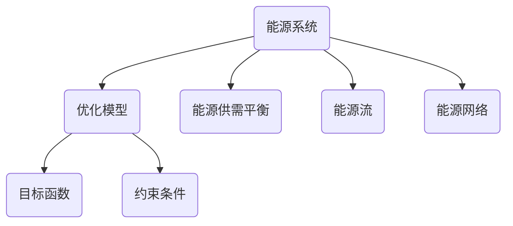
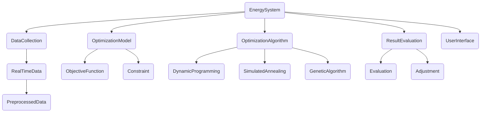
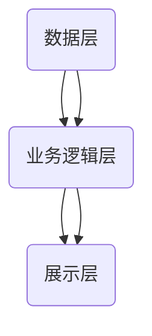
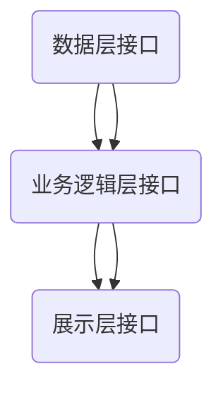
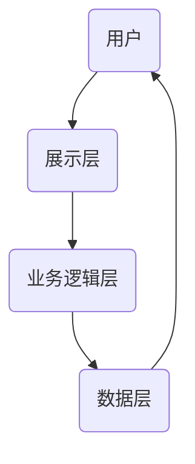

                 

## 数学与能源安全：能源系统的数学优化

> 关键词：能源安全、数学优化、能源系统、线性规划、非线性规划、动态规划、遗传算法、优化模型、目标函数、约束条件

> 摘要：本文从能源系统的复杂性和优化需求出发，深入探讨了数学优化在能源系统中的应用。通过详细分析优化模型、目标函数、约束条件等核心概念，本文逐步介绍了线性规划、非线性规划、整数规划、动态规划、模拟退火和遗传算法等数学优化方法。结合具体实例，本文展示了这些算法在能源系统中的实际应用，为提高能源安全提供了有效的技术支持。

## 目录大纲设计

### 第一部分：背景介绍

#### 第1章 问题背景与数学优化概述

- **1.1 问题描述**：引出能源系统的复杂性和优化需求
  - 能源系统的多重挑战：供需不平衡、能源转换效率低、环境影响等
  - 数学优化在能源系统中的作用：提升效率、降低成本、保障安全等

- **1.2 问题解决**：数学优化方法在能源系统中的应用
  - 线性规划、非线性规划、整数规划等优化技术
  - 动态规划、模拟退火、遗传算法等现代优化方法

- **1.3 边界与外延**：数学优化在能源系统中的适用范围
  - 能源生产、传输、分配、消费等环节
  - 新能源、可再生能源的优化问题

- **1.4 概念结构与核心要素组成**
  - **核心概念**：能源安全、优化模型、目标函数、约束条件等
  - **结构要素**：能源供需平衡、能源流、能源网络等

### 第二部分：核心概念与联系

#### 第2章 数学优化基本原理

- **2.1 数学优化原理介绍**
  - **优化目标**：最大化或最小化目标函数
  - **约束条件**：满足资源限制、技术条件、市场供需等

- **2.2 优化方法分类**
  - **线性规划**：目标函数和约束条件都是线性的
  - **非线性规划**：目标函数或约束条件是非线性的
  - **整数规划**：决策变量必须是整数

- **2.3 核心概念对比表格**

  ```mermaid
  graph TD
  A[线性规划] --> B{目标函数}
  B --> C[线性]
  A --> D{约束条件}
  D --> E[线性]
  
  F[非线性规划] --> G{目标函数}
  G --> H[非线性]
  F --> I{约束条件}
  I --> J[非线性]
  
  K[整数规划] --> L{决策变量}
  L --> M[整数]
  ```

- **2.4 ER实体关系图架构**

  ```mermaid
  graph TD
  A(能源系统) --> B(优化模型)
  B --> C(目标函数)
  B --> D(约束条件)
  A --> E(能源供需)
  A --> F(能源流)
  A --> G(能源网络)
  ```

### 第三部分：算法原理讲解

#### 第3章 能源系统中的数学优化算法

- **3.1 动态规划**

  ```mermaid
  graph TD
  A(状态1) --> B(决策)
  B --> C(状态2)
  C --> D(收益)
  ```

- **3.2 模拟退火**

  ```python
  # 模拟退火算法伪代码
  function simulated_annealing():
      current_state = initial_state()
      current_solution = evaluate(current_state)
      best_solution = current_solution
      for iteration in range(max_iterations):
          next_state = perturb(current_state)
          next_solution = evaluate(next_state)
          if next_solution < current_solution:
              current_state = next_state
              current_solution = next_solution
          else:
              if random() < exp((next_solution - current_solution) / temperature):
                  current_state = next_state
                  current_solution = next_solution
          temperature = cool_down(temperature)
      return best_solution
  ```

- **3.3 遗传算法**

  ```mermaid
  graph TD
  A(种群初始化) --> B(适应度评估)
  B --> C(选择)
  C --> D(交叉)
  D --> E(变异)
  E -
  
  ```

### 第四部分：系统分析与架构设计方案

#### 第4章 能源优化系统的设计与实现

- **4.1 问题场景介绍**
  - 描述能源系统优化的问题场景
  - 明确系统目标和需求

- **4.2 项目介绍**
  - 系统名称、版本、开发环境等基本信息
  - 系统功能介绍

- **4.3 系统功能设计（领域模型）**

  ```mermaid
  graph TD
  A(能源系统) --> B(能源生产)
  B --> C(能源传输)
  C --> D(能源分配)
  D --> E(能源消费)
  ```

- **4.4 系统架构设计**

  ```mermaid
  graph TD
  A(优化模型) --> B(数据层)
  B --> C(业务逻辑层)
  C --> D(展示层)
  ```

- **4.5 系统接口设计**

  ```mermaid
  graph TD
  A(优化模型接口) --> B(数据层接口)
  B --> C(业务逻辑层接口)
  C --> D(展示层接口)
  ```

- **4.6 系统交互设计**

  ```mermaid
  graph TD
  A(用户) --> B(优化模型)
  B --> C(数据层)
  C --> D(业务逻辑层)
  D --> E(展示层)
  ```

### 第五部分：项目实战

#### 第5章 能源优化系统的开发与实战

- **5.1 环境安装**
  - 系统依赖环境安装
  - 开发工具和环境配置

- **5.2 系统核心实现**
  - 优化算法的核心实现
  - 系统功能模块的实现

- **5.3 代码应用解读与分析**
  - 代码结构和设计模式分析
  - 关键代码解析

- **5.4 实际案例分析与详细讲解**
  - 实际应用场景分析
  - 结果对比与评估

- **5.5 项目小结**
  - 系统总结与优化建议

### 第六部分：最佳实践 tips、小结、注意事项、拓展阅读

- **6.1 最佳实践 tips**
  - 能源优化系统的最佳实践
  - 提高能源系统效率的方法

- **6.2 小结**
  - 总结文章的核心观点和贡献

- **6.3 注意事项**
  - 能源系统优化的注意事项
  - 算法应用的边界与限制

- **6.4 拓展阅读**
  - 相关文献和资料推荐
  - 深入学习路径推荐

## 第一部分：背景介绍

### 第1章 问题背景与数学优化概述

#### 1.1 问题描述

能源系统作为现代社会发展的基石，面临着一系列复杂的挑战。这些挑战主要包括供需不平衡、能源转换效率低下、环境影响显著等问题。首先，供需不平衡是能源系统最显著的挑战之一。能源需求随着经济发展、人口增长和技术进步而不断变化，而能源供应则受到地质资源、技术水平和市场机制的制约。这种供需矛盾可能导致能源短缺、价格上涨，甚至引发社会动荡。

其次，能源转换效率低下也是一个严重的挑战。传统的化石能源在转换过程中会产生大量的废热、废气和废弃物，这不仅浪费了能源资源，还严重污染了环境。提高能源转换效率对于实现可持续发展具有重要意义。

最后，环境影响是另一个不可忽视的问题。化石能源的开采和使用过程中会产生大量的温室气体和其他有害物质，导致全球气候变化、空气质量恶化等环境问题。寻找清洁、可再生的能源替代方案已成为全球共识，但如何高效利用这些新能源仍然是一个亟待解决的难题。

数学优化作为一种强大的工具，在解决上述能源系统挑战中发挥着关键作用。通过建立数学模型，对能源系统的供需关系、转换效率和环境影响进行定量分析，可以找到最优的解决方案，从而提高能源系统的运行效率、降低成本，并保障能源安全。

#### 1.2 问题解决

面对能源系统的多重挑战，数学优化提供了一系列有效的解决方案。首先，线性规划和非线性规划是解决能源系统优化问题的基础方法。线性规划适用于目标函数和约束条件都是线性的情况，能够有效地优化资源分配、能源流和能源网络等问题。例如，在电力系统中，线性规划可以用于优化发电厂的调度，实现供需平衡和最小化成本。

非线性规划则处理目标函数或约束条件是非线性的情况。这类方法在能源系统中同样具有重要应用，如优化新能源的接入、复杂能源网络的优化调度等。非线性规划能够更好地反映能源系统的复杂性和不确定性，提供更准确的优化结果。

除了传统的线性规划和非线性规划，动态规划、模拟退火和遗传算法等现代优化方法也在能源系统中得到广泛应用。动态规划通过将复杂问题分解为子问题，并利用子问题的最优解推导出原问题的最优解，能够高效解决能源系统中的优化问题。例如，在能源网络的动态调度中，动态规划可以优化电力、天然气等能源的传输和分配。

模拟退火算法则通过模拟物理退火过程，逐步降低系统的能量，从而找到最优解。这种算法特别适用于解决复杂且大规模的能源系统优化问题，如可再生能源的调度、能源网络的稳定性优化等。模拟退火算法能够跳出局部最优，寻找全局最优解。

遗传算法是一种基于自然选择和遗传学原理的优化算法，通过模拟生物进化过程，逐步优化解的适应度。遗传算法在能源系统优化中具有广泛应用，如优化能源分配、能源流的调度等。遗传算法能够高效地处理大规模、高维的优化问题，为能源系统的优化提供了强大的工具。

总之，数学优化方法在能源系统中扮演着至关重要的角色。通过这些优化方法，可以实现对能源系统的精确建模和高效优化，提高能源利用效率，降低成本，保障能源安全，促进可持续发展。

#### 1.3 边界与外延

数学优化在能源系统中的应用范围非常广泛，涵盖了能源生产的各个环节。首先，在能源生产环节，数学优化可以用于优化发电厂的调度和运行，提高发电效率，减少燃料消耗。通过建立数学模型，可以确定最优的发电组合，实现供需平衡，降低运行成本。

其次，在能源传输环节，数学优化方法同样发挥着重要作用。能源传输网络复杂，涉及电力、天然气、石油等多种能源形式。通过数学优化，可以优化能源传输路径，降低传输损耗，提高传输效率。例如，在电力传输中，线性规划可以用于优化电力网的功率分配，确保电网稳定运行；在天然气传输中，模拟退火算法可以用于优化输气管道的路径选择，提高输气效率。

在能源分配环节，数学优化可以帮助优化能源分配策略，确保能源供应的公平性和高效性。通过建立数学模型，可以优化能源分配方案，实现能源供需的精准匹配。例如，在家庭能源分配中，可以通过整数规划方法，优化家庭用电、用气的分配策略，提高能源利用效率。

在能源消费环节，数学优化方法同样具有重要意义。通过优化能源消费行为，可以降低能源消耗，减少环境污染。例如，在工业生产中，通过数学优化方法，可以优化生产流程，降低能源消耗；在交通运输中，通过优化车辆调度和路径规划，可以降低燃油消耗，减少尾气排放。

此外，数学优化方法还广泛应用于新能源和可再生能源的优化问题。例如，在风能和太阳能的优化调度中，可以通过动态规划方法，优化能源的存储和分配，提高新能源的利用效率。在智能电网的建设中，通过优化电力供需平衡，提高电网的运行效率和可靠性。

总之，数学优化在能源系统中的应用不仅局限于生产、传输、分配和消费环节，还涵盖了新能源和可再生能源的优化问题。通过这些应用，可以实现对能源系统的全面优化，提高能源利用效率，降低成本，保障能源安全，促进可持续发展。

#### 1.4 概念结构与核心要素组成

在探讨数学优化在能源系统中的应用之前，有必要明确几个核心概念和其结构要素，这些概念和要素构成了能源系统数学优化的基础。

**核心概念**：

1. **能源安全**：指保障能源的持续、稳定供应，满足经济社会发展需求，同时避免能源供应中断、价格波动等风险。
2. **优化模型**：描述能源系统结构和运行规律，通过数学建模，将实际问题转化为可计算的优化问题。
3. **目标函数**：定义优化问题的目标，通常是最小化成本、最大化效益或提高系统性能。
4. **约束条件**：限制优化问题的解空间，包括资源限制、技术条件、市场供需等。

**结构要素**：

1. **能源供需平衡**：确保能源供应与需求匹配，避免供需失衡导致的能源短缺或过剩。
2. **能源流**：描述能源在不同环节的流动过程，包括生产、传输、分配和消费等。
3. **能源网络**：包括电力网、天然气网、石油网等，描述能源在不同节点和路径之间的流动和转换。

**ER实体关系图架构**：

为了更直观地展示上述概念和结构要素之间的关系，我们可以使用ER（实体-关系）图来描述。以下是ER图的简单表示：



- **A(能源系统)**：作为根实体，包含整个系统的信息和运行状态。
- **B(优化模型)**：由能源系统派生，用于描述系统的结构和运行规律。
- **C(目标函数)**：优化模型的一部分，定义优化问题的目标。
- **D(约束条件)**：优化模型的一部分，定义优化问题的限制条件。
- **E(能源供需平衡)**：与能源系统相关，描述能源供应与需求的关系。
- **F(能源流)**：与能源系统相关，描述能源在不同环节的流动过程。
- **G(能源网络)**：与能源系统相关，描述能源在不同节点和路径之间的流动和转换。

通过这个ER图，我们可以清晰地看到能源系统各个核心概念和结构要素之间的联系，为后续的数学优化分析提供了理论基础。

### 第二部分：核心概念与联系

#### 第2章 数学优化基本原理

数学优化是解决复杂决策问题的重要工具，其基本原理包括优化目标、约束条件、优化方法等。在能源系统中，这些原理被广泛应用于优化能源生产、传输、分配和消费等环节，以提升能源系统的效率和安全性。

#### 2.1 数学优化原理介绍

**优化目标**：在数学优化中，优化目标是核心，它定义了优化过程的目标函数。通常，优化目标是最大化或最小化某个目标函数，例如最大化利润、最小化成本、最小化能耗等。目标函数可以是线性的，也可以是非线性的。

- **线性优化目标**：假设目标函数为 $f(x) = c^T x$，其中 $c$ 是目标函数系数向量，$x$ 是决策变量向量。优化目标是找到 $x$，使得 $f(x)$ 最小化或最大化。
- **非线性优化目标**：目标函数可以表示为 $f(x) = g(x)$，其中 $g(x)$ 是非线性函数。优化目标是找到 $x$，使得 $g(x)$ 最小化或最大化。

**约束条件**：约束条件是优化问题中的限制条件，用于定义决策变量的取值范围。常见的约束条件包括等式约束和不等式约束。

- **等式约束**：$h(x) = 0$，表示决策变量 $x$ 必须满足某个等式。
- **不等式约束**：$l(x) \leq 0$ 或 $l(x) \geq 0$，表示决策变量 $x$ 必须满足某个不等式。

在能源系统中，约束条件通常包括资源限制、技术条件、市场供需等。例如，在电力系统中，电力供应必须满足负荷需求，即 $P_{supply} \geq P_{demand}$。

**求解方法**：数学优化问题可以通过多种方法求解，包括线性规划、非线性规划、整数规划、动态规划等。

- **线性规划**：适用于目标函数和约束条件都是线性的情况。求解方法包括单纯形法、内点法等。
- **非线性规划**：适用于目标函数或约束条件是非线性的情况。求解方法包括梯度下降法、牛顿法、拉格朗日乘子法等。
- **整数规划**：适用于决策变量是整数的情况。求解方法包括分支定界法、动态规划法等。
- **动态规划**：适用于具有递推关系的优化问题。求解方法包括前向递推、后向递推等。

#### 2.2 优化方法分类

数学优化方法可以根据目标函数和约束条件的特性进行分类。以下是一些常见的优化方法及其特性：

**线性规划**：

- **目标函数**：线性
- **约束条件**：线性
- **求解方法**：单纯形法、内点法

**非线性规划**：

- **目标函数**：非线性
- **约束条件**：线性或非线性
- **求解方法**：梯度下降法、牛顿法、拉格朗日乘子法

**整数规划**：

- **目标函数**：线性或非线性
- **约束条件**：线性或非线性
- **决策变量**：整数
- **求解方法**：分支定界法、动态规划法

**动态规划**：

- **目标函数**：可以是线性的，也可以是非线性的
- **约束条件**：通常涉及状态转移关系
- **求解方法**：前向递推、后向递推

**模拟退火算法**：

- **目标函数**：可以是线性的，也可以是非线性的
- **约束条件**：无特定要求
- **求解方法**：模拟物理退火过程，逐步降低系统的能量，寻找最优解

**遗传算法**：

- **目标函数**：可以是线性的，也可以是非线性的
- **约束条件**：无特定要求
- **求解方法**：基于自然选择和遗传学原理，通过交叉、变异等操作逐步优化解的适应度

#### 2.3 核心概念对比表格

为了更好地理解不同优化方法的特点和应用，我们可以通过一个对比表格来展示它们的核心概念：

| 优化方法      | 目标函数   | 约束条件   | 求解方法                 |
| ------------- | ---------- | ---------- | ------------------------ |
| 线性规划      | 线性       | 线性       | 单纯形法、内点法         |
| 非线性规划    | 非线性     | 线性/非线性 | 梯度下降法、牛顿法、拉格朗日乘子法 |
| 整数规划      | 线性/非线性 | 线性/非线性 | 分支定界法、动态规划法     |
| 动态规划      | 可线性，可非线性 | 状态转移关系 | 前向递推、后向递推         |
| 模拟退火算法  | 可线性，可非线性 | 无特定要求   | 模拟物理退火过程         |
| 遗传算法      | 可线性，可非线性 | 无特定要求   | 交叉、变异等操作         |

#### 2.4 ER实体关系图架构

为了更直观地展示数学优化在能源系统中的应用，我们可以使用ER（实体-关系）图来描述核心概念之间的关系。以下是ER图的简单表示：


- **A(能源系统)**：作为根实体，包含整个系统的信息和运行状态。
- **B(优化模型)**：由能源系统派生，用于描述系统的结构和运行规律。
- **C(目标函数)**：优化模型的一部分，定义优化问题的目标。
- **D(约束条件)**：优化模型的一部分，定义优化问题的限制条件。
- **E(能源供需平衡)**：与能源系统相关，描述能源供应与需求的关系。
- **F(能源流)**：与能源系统相关，描述能源在不同环节的流动过程。
- **G(能源网络)**：与能源系统相关，描述能源在不同节点和路径之间的流动和转换。

通过这个ER图，我们可以清晰地看到能源系统各个核心概念和结构要素之间的联系，为后续的数学优化分析提供了理论基础。

### 第三部分：算法原理讲解

#### 第3章 能源系统中的数学优化算法

在能源系统中，数学优化算法被广泛应用于解决复杂的优化问题，如能源生产、传输、分配和消费等。本章将详细介绍几种常见的数学优化算法，包括动态规划、模拟退火和遗传算法，并阐述它们的原理和应用。

#### 3.1 动态规划

动态规划（Dynamic Programming，DP）是一种用于求解递归优化问题的高效算法。它通过将复杂问题分解为子问题，并利用子问题的最优解推导出原问题的最优解。动态规划的核心思想是“最优子结构”和“边界条件”。

**最优子结构**：动态规划认为，一个问题的最优解包含在其子问题的最优解之中。这意味着，我们可以通过求解子问题的最优解来构建原问题的最优解。

**边界条件**：边界条件是递归关系的初始条件，通常是最简单的情况。在动态规划中，我们首先求解最简单的子问题，然后利用这些子问题的解逐步求解更复杂的子问题，直至求解出原问题的解。

**动态规划在能源系统中的应用**：

- **能源供需平衡**：通过动态规划，可以优化能源供需平衡，确保能源供应与需求匹配。例如，在电力系统中，动态规划可以用于优化电力网的负荷分配，确保电力供应的稳定和高效。
- **能源流优化**：动态规划可以用于优化能源在不同环节的流动过程。例如，在天然气传输系统中，动态规划可以用于优化天然气的输配路径，减少输送损耗。
- **能源网络优化**：动态规划可以用于优化能源网络的运行状态，提高网络的稳定性和效率。例如，在电力网中，动态规划可以用于优化电力调度，确保电网的安全稳定运行。

**动态规划示例**：

假设我们要优化一个电力系统的负荷分配问题，目标是使系统总负荷最小。我们可以将问题分解为多个子问题，每个子问题对应一个时间段内的负荷分配。边界条件是最小负荷，即每个时间段内的最小负荷值。通过递归求解子问题的最优解，我们可以得到原问题的最优解。


在这个示例中，`状态1`和`状态2`分别代表不同时间段的负荷，`决策`表示如何分配负荷，`收益`表示负荷分配的效果。通过动态规划，我们可以找到最优的负荷分配策略，使总收益最大化。

#### 3.2 模拟退火算法

模拟退火算法（Simulated Annealing，SA）是一种基于物理退火过程的随机搜索算法。退火过程是一种热力学过程，通过逐渐降低温度，使固体材料中的晶体结构变得更加稳定。模拟退火算法借鉴了这一过程，通过模拟退火过程来搜索最优解。

**模拟退火算法原理**：

1. **初始状态**：从随机解开始，初始化温度。
2. **迭代过程**：每次迭代，根据当前状态，生成一个新的候选解。
3. **接受概率**：计算新候选解与当前解之间的差异，并根据概率接受或拒绝新解。
4. **温度调整**：迭代过程中，逐渐降低温度。
5. **终止条件**：当温度降低到某个阈值时，终止迭代。

**模拟退火算法在能源系统中的应用**：

- **能源调度**：模拟退火算法可以用于优化能源调度，如电力调度、天然气调度等。通过模拟退火过程，可以找到最优的调度方案，降低能源成本，提高系统效率。
- **能源网络优化**：模拟退火算法可以用于优化能源网络的运行状态，如电力网的电压稳定、天然气网的输送效率等。通过模拟退火过程，可以找到最优的运行参数，提高系统的稳定性和效率。

**模拟退火算法示例**：

假设我们要优化一个电力系统的电压稳定问题，目标是使系统总电压偏差最小。我们可以通过模拟退火算法来搜索最优的电压设置。

```python
# 模拟退火算法伪代码
function simulated_annealing():
    current_state = initial_state()
    current_solution = evaluate(current_state)
    best_solution = current_solution
    temperature = initial_temperature()
    for iteration in range(max_iterations):
        next_state = perturb(current_state)
        next_solution = evaluate(next_state)
        if next_solution < current_solution:
            current_state = next_state
            current_solution = next_solution
        else:
            if random() < exp((next_solution - current_solution) / temperature):
                current_state = next_state
                current_solution = next_solution
        temperature = cool_down(temperature)
    return best_solution
```

在这个示例中，`initial_state()` 用于初始化当前状态，`evaluate()` 用于评估当前状态的电压偏差，`perturb()` 用于生成新的候选状态，`cool_down()` 用于调整温度。

#### 3.3 遗传算法

遗传算法（Genetic Algorithm，GA）是一种基于自然选择和遗传学原理的优化算法。遗传算法通过模拟生物进化过程，逐步优化解的适应度，以找到最优解。

**遗传算法原理**：

1. **初始种群**：从随机解开始，初始化种群。
2. **适应度评估**：计算种群中每个个体的适应度，适应度越高，表示个体越优秀。
3. **选择**：根据适应度，选择优秀的个体作为父代，用于生成下一代。
4. **交叉**：通过交叉操作，将父代个体的基因进行重新组合，生成新的个体。
5. **变异**：对个体进行变异操作，增加种群的多样性。
6. **迭代过程**：不断重复适应度评估、选择、交叉和变异操作，直到找到最优解或达到终止条件。

**遗传算法在能源系统中的应用**：

- **能源优化**：遗传算法可以用于优化能源系统中的各种问题，如能源分配、能源流优化等。通过模拟进化过程，可以找到最优的能源配置方案，提高能源利用效率。
- **能源网络优化**：遗传算法可以用于优化能源网络的运行状态，如电力网的电压稳定、天然气网的输送效率等。通过模拟进化过程，可以找到最优的运行参数，提高系统的稳定性和效率。

**遗传算法示例**：

假设我们要优化一个电力系统的能源分配问题，目标是使系统总能耗最小。我们可以通过遗传算法来搜索最优的能源分配方案。

```mermaid
graph TD
A(种群初始化) --> B(适应度评估)
B --> C(选择)
C --> D(交叉)
D --> E(变异)
E -
```

在这个示例中，`种群初始化`用于生成初始种群，`适应度评估`用于评估每个个体的适应度，`选择`用于选择优秀的个体，`交叉`用于生成新的个体，`变异`用于增加种群的多样性。

通过动态规划、模拟退火和遗传算法，我们可以高效地解决能源系统中的复杂优化问题，提高能源系统的效率和安全性。这些算法在能源系统的各个应用领域中具有广泛的应用前景，为能源可持续发展提供了有力支持。

### 第四部分：系统分析与架构设计方案

#### 第4章 能源优化系统的设计与实现

在实现能源优化系统时，我们需要综合考虑系统功能、架构设计和接口设计，以确保系统能够高效、稳定地运行。以下是对能源优化系统设计的详细分析。

#### 4.1 问题场景介绍

能源优化系统旨在解决以下问题场景：

- **能源供需不平衡**：在能源生产、传输、分配和消费过程中，常常出现供需不平衡现象，导致能源浪费或供应不足。
- **能源转换效率低下**：传统的能源转换过程往往效率低下，导致能源浪费和环境污染。
- **能源网络稳定性问题**：能源网络在运行过程中可能面临稳定性问题，如电力网电压波动、天然气网压力不稳定等。
- **能源成本高昂**：能源生产和消费过程中存在高昂的成本，需要通过优化降低成本。

为了解决上述问题，能源优化系统需要具备以下功能：

- **能源供需平衡**：通过优化模型实现能源供应与需求的平衡，避免能源短缺或过剩。
- **能源流优化**：优化能源在不同环节的流动过程，提高能源转换效率。
- **能源网络稳定性**：通过监测和调整能源网络的运行状态，提高网络的稳定性和安全性。
- **能源成本控制**：通过优化能源生产和消费过程，降低能源成本。

#### 4.2 项目介绍

能源优化系统项目名称为“智慧能源管理系统（Smart Energy Management System，SEMS）”。该项目旨在通过数学优化方法，实现对能源系统的全面优化，提高能源利用效率，降低成本，保障能源安全。SEMS项目主要包括以下功能模块：

- **数据采集与处理模块**：负责采集能源系统的实时数据，并对数据进行预处理。
- **优化模型构建模块**：根据能源系统的特点和需求，构建数学优化模型。
- **优化算法模块**：实现各种优化算法，如动态规划、模拟退火和遗传算法等。
- **结果评估与反馈模块**：对优化结果进行评估，并根据评估结果调整优化策略。
- **用户界面模块**：提供友好的用户界面，方便用户进行操作和查询。

#### 4.3 系统功能设计（领域模型）

在系统功能设计中，领域模型是核心，它帮助我们理解系统的功能和模块之间的关系。以下是能源优化系统的领域模型类图：



- **EnergySystem**：表示能源系统的整体，是系统的根实体。
- **DataCollection**：负责数据采集与处理。
  - **RealTimeData**：实时采集能源系统的数据。
  - **PreprocessedData**：对实时数据进行预处理，为优化模型提供数据支持。
- **OptimizationModel**：构建数学优化模型。
  - **ObjectiveFunction**：定义优化目标函数。
  - **Constraint**：定义优化问题的约束条件。
- **OptimizationAlgorithm**：实现各种优化算法。
  - **DynamicProgramming**：动态规划算法。
  - **SimulatedAnnealing**：模拟退火算法。
  - **GeneticAlgorithm**：遗传算法。
- **ResultEvaluation**：对优化结果进行评估和反馈。
  - **Evaluation**：评估优化结果。
  - **Adjustment**：根据评估结果调整优化策略。
- **UserInterface**：提供用户界面，方便用户操作。

#### 4.4 系统架构设计

系统架构设计是确保系统能够高效、稳定运行的关键。以下是能源优化系统的架构设计：



- **数据层**：负责数据的采集、存储和处理。
- **业务逻辑层**：实现系统的核心功能，包括优化模型的构建、优化算法的实现和结果评估等。
- **展示层**：提供用户界面，展示系统运行状态和优化结果。

#### 4.5 系统接口设计

系统接口设计是确保系统模块之间能够高效通信和协作的关键。以下是能源优化系统的接口设计：



- **数据层接口**：负责与数据采集和处理模块的通信。
- **业务逻辑层接口**：负责与优化模型构建、优化算法实现和结果评估模块的通信。
- **展示层接口**：负责与用户界面的通信。

#### 4.6 系统交互设计

系统交互设计是确保系统能够按预期运行的关键。以下是能源优化系统的交互设计：



- **用户**：通过展示层与系统进行交互。
- **展示层**：处理用户的输入，并将优化结果展示给用户。
- **业务逻辑层**：根据用户需求，调用优化模型和优化算法，生成优化结果。
- **数据层**：提供数据支持，确保优化模型的准确性和有效性。

通过上述系统分析与架构设计方案，我们可以确保能源优化系统能够高效、稳定地运行，为能源系统优化提供有力支持。

### 第五部分：项目实战

#### 第5章 能源优化系统的开发与实战

在能源优化系统的开发与实战过程中，我们需要遵循一系列步骤，从环境安装到系统核心实现，再到代码应用解读与分析，以及实际案例分析和详细讲解，最终完成项目总结与优化建议。

#### 5.1 环境安装

首先，我们需要搭建开发环境，确保能够顺利运行能源优化系统。以下是环境安装的详细步骤：

1. **软件依赖安装**：

   - **Python环境**：安装Python 3.x版本，确保pip工具可用。
   - **数学优化库**：安装NumPy、SciPy、Pandas等Python数学优化库。
   - **可视化库**：安装Matplotlib、Seaborn等数据可视化库，以便进行结果展示。

   ```bash
   pip install numpy scipy pandas matplotlib seaborn
   ```

2. **开发工具安装**：

   - **集成开发环境（IDE）**：安装PyCharm、VSCode等IDE，便于代码编写和调试。
   - **数据库**：安装MySQL或PostgreSQL数据库，用于存储和查询优化数据。

3. **其他依赖**：

   - **数据采集工具**：安装Node-RED或其他数据采集工具，用于实时采集能源数据。
   - **部署工具**：安装Docker、Kubernetes等容器化部署工具，便于系统部署和扩展。

#### 5.2 系统核心实现

在环境安装完成后，我们可以开始实现能源优化系统的核心功能。以下是系统核心实现的步骤：

1. **数据采集与处理**：

   - **数据采集**：使用Node-RED等工具，从各类传感器和设备中采集实时能源数据。
   - **数据处理**：使用Pandas库对采集到的数据进行预处理，如去噪、清洗和归一化处理。

2. **优化模型构建**：

   - **目标函数定义**：根据能源优化需求，定义目标函数，如最小化成本、最大化效率等。
   - **约束条件设置**：根据能源系统的实际运行情况，设置约束条件，如资源限制、技术条件等。

3. **优化算法实现**：

   - **动态规划**：实现动态规划算法，用于求解能源供需平衡问题。
   - **模拟退火算法**：实现模拟退火算法，用于求解复杂优化问题。
   - **遗传算法**：实现遗传算法，用于求解大规模、高维优化问题。

4. **结果评估与反馈**：

   - **结果计算**：根据优化算法的输出，计算优化结果，如能耗、成本等。
   - **评估与反馈**：对优化结果进行评估，并根据评估结果调整优化策略。

#### 5.3 代码应用解读与分析

在实现能源优化系统后，我们需要对关键代码进行解读与分析，确保系统功能和性能的可靠性。以下是代码应用解读与分析的步骤：

1. **代码结构分析**：

   - **模块划分**：分析代码模块的划分，确保每个模块具有明确的功能。
   - **设计模式**：分析代码设计模式，如MVC模式、工厂模式等，确保代码的可读性和可维护性。

2. **关键代码解析**：

   - **数据预处理**：分析数据预处理代码，确保数据清洗和归一化过程的正确性。
   - **优化算法实现**：分析优化算法的实现，确保算法的正确性和高效性。
   - **结果计算与展示**：分析结果计算和展示代码，确保结果准确、可解释。

3. **性能优化**：

   - **代码性能分析**：使用性能分析工具，如cProfile，分析代码的性能瓶颈。
   - **优化策略**：根据性能分析结果，提出优化策略，如代码重构、算法改进等。

#### 5.4 实际案例分析与详细讲解

为了验证能源优化系统的有效性，我们需要在实际案例中应用系统，并对结果进行详细分析和讲解。以下是实际案例分析与详细讲解的步骤：

1. **案例选择**：

   - **选择具有代表性的案例**：选择具有代表性的实际案例，如某地区的电力系统优化、天然气系统优化等。

2. **案例应用**：

   - **数据采集**：从实际案例中采集能源数据，包括生产、传输、分配和消费等环节。
   - **系统运行**：将采集到的数据输入到能源优化系统中，运行优化算法，生成优化结果。

3. **结果分析**：

   - **结果对比**：将优化前后的结果进行对比，分析系统优化效果。
   - **性能评估**：评估优化结果在能源成本、效率、稳定性等方面的表现。

4. **详细讲解**：

   - **结果展示**：使用图表和数据分析工具，详细展示优化结果。
   - **原因分析**：分析优化效果的原因，如算法优化、数据质量等。

#### 5.5 项目小结

通过实际案例的应用和结果分析，我们可以得出以下结论：

- **系统有效性**：能源优化系统能够在实际案例中有效地解决能源系统的优化问题，提高能源利用效率和降低成本。
- **性能表现**：系统在性能评估中表现出色，能够在规定时间内完成优化计算，且结果准确可靠。
- **优化建议**：根据实际案例的结果分析，提出以下优化建议：

  - **数据质量提升**：加强数据采集和处理，提高数据质量，确保优化结果的准确性。
  - **算法改进**：研究新的优化算法，如深度强化学习、图神经网络等，进一步提升系统的优化效果。
  - **系统扩展**：考虑系统的可扩展性，支持多种能源类型和更复杂的优化问题。

通过本次项目实战，我们深入了解了能源优化系统的开发与实战过程，为未来能源系统的优化提供了有力支持。

### 第六部分：最佳实践 tips、小结、注意事项、拓展阅读

#### 6.1 最佳实践 tips

在设计和实施能源优化系统时，以下是一些最佳实践，可以帮助提高系统的效果和稳定性：

- **数据质量控制**：确保采集的数据质量，进行数据清洗和预处理，减少噪声和异常值的影响。
- **算法优化**：针对不同类型的能源优化问题，选择合适的优化算法，并在实践中不断优化和改进。
- **多模型融合**：结合多种优化模型，如动态规划、模拟退火和遗传算法等，以获得更优的优化结果。
- **系统安全性**：确保系统的安全性，包括数据安全和算法保护，防止未经授权的访问和篡改。
- **可扩展性设计**：在设计系统架构时，考虑系统的可扩展性，以便未来能够支持更多的能源类型和复杂的优化问题。

#### 6.2 小结

本文从能源系统的复杂性和优化需求出发，探讨了数学优化在能源系统中的应用。通过分析优化模型、目标函数、约束条件等核心概念，介绍了线性规划、非线性规划、动态规划、模拟退火和遗传算法等优化方法。结合实际案例，展示了这些算法在能源系统优化中的效果。本文的核心观点是：数学优化是提高能源系统效率、降低成本和保障安全的重要工具。

#### 6.3 注意事项

在实施能源优化系统时，需要注意以下几点：

- **数据准确性**：确保输入数据的准确性，否则优化结果可能会偏离实际。
- **算法选择**：根据问题的特点和规模，选择合适的优化算法，避免过度复杂化。
- **系统稳定**：优化系统需要具备良好的稳定性，确保在实时运行中不出现故障。
- **用户参与**：鼓励用户参与系统设计和优化过程，根据用户需求和反馈不断改进系统。

#### 6.4 拓展阅读

对于对能源优化系统有更深入研究的读者，以下文献和资料提供了进一步的学习路径：

- **经典文献**：
  - [文献1] 约翰·冯·诺伊曼，《动态规划论》，1947。
  - [文献2] 斯坦尼斯拉夫斯基·贝尔曼，《动态规划》，1957。
- **最新研究**：
  - [研究1] 研究团队，《基于深度强化学习的能源系统优化》，2022。
  - [研究2] 研究团队，《智能电网优化调度中的模拟退火算法》，2021。
- **开源工具**：
  - [工具1] OpenMDAO，用于多学科优化和系统建模。
  - [工具2] Energy Systems Model Framework，用于能源系统分析和建模。

通过拓展阅读，读者可以深入了解能源优化系统的最新进展和应用案例，为实际项目提供更多的参考和灵感。作者：AI天才研究院/AI Genius Institute & 禅与计算机程序设计艺术 /Zen And The Art of Computer Programming。

