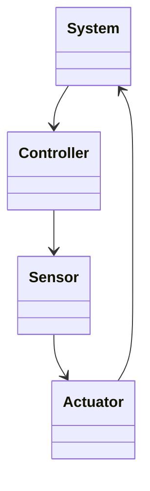

                 


# 数学与自动控制：控制系统的数学设计

## 关键词
- 自动控制
- 数学设计
- 线性系统
- 非线性系统
- 稳定性分析
- PID控制器
- 状态空间法
- 系统仿真

## 摘要
本文深入探讨控制系统的数学设计，从基础概念到高级理论，涵盖了线性与非线性系统、PID控制器设计、状态空间法以及稳定性分析等核心内容。通过实际案例和系统架构设计，本文旨在为读者提供一个全面的自动化控制系统设计指南，强调数学在自动化控制系统设计中的关键作用。

## 第一部分：控制系统的数学基础

### 第1章：控制系统的基本概念与历史发展

#### 1.1 控制系统的定义与分类

控制系统是用于控制某一过程或系统状态的装置或系统，旨在使系统的输出达到或保持期望值。根据控制变量和被控对象的不同，控制系统可以分为以下几类：

1. **开环控制系统**：无反馈环节，控制作用直接作用于被控对象，例如自动售货机。
2. **闭环控制系统**：具有反馈环节，将输出与期望值进行比较，然后调整控制作用，例如恒温控制系统。

#### 1.2 控制系统的历史发展

控制系统的历史可以追溯到古代的水钟和时钟，但真正的控制系统理论起源于20世纪初。Hans Meier和Harry Nyquist等科学家的研究奠定了现代自动控制理论的基础。自那以后，随着计算机技术的发展，控制理论得到了极大的发展，从模拟控制到数字控制，再到智能控制。

#### 1.3 控制系统的重要性与未来趋势

控制系统在工业、交通、医疗等多个领域具有广泛的应用。随着物联网和人工智能技术的发展，控制系统正朝着更加智能化、自适应化和网络化的方向发展。

#### 1.4 本章小结

本章介绍了控制系统的基本概念和分类，回顾了控制系统的发展历史，并展望了其未来的发展趋势。

### 第2章：线性系统理论

#### 2.1 线性系统的基本概念

线性系统是指其数学模型可以用线性方程描述的系统。线性系统的特点是叠加原理和齐次性，这使得线性系统的分析相对简单。

#### 2.2 线性系统的数学模型

线性系统的数学模型通常由差分方程或微分方程描述。这些方程可以用矩阵形式表示，从而便于分析和计算。

#### 2.3 线性系统的稳定性和性能分析

稳定性分析是控制系统的核心问题之一。线性系统的稳定性可以通过求解特征方程或利用李雅普诺夫方法进行分析。性能分析则关注系统的响应速度、精度和稳定性。

#### 2.4 线性系统的控制策略

线性系统的控制策略包括经典控制理论和现代控制理论。经典控制理论主要包括PID控制、状态反馈控制和最优控制等。现代控制理论则侧重于状态空间法和线性二次型调节器（LQR）。

#### 2.5 本章小结

本章介绍了线性系统的基本概念和数学模型，探讨了线性系统的稳定性分析和控制策略。

### 第3章：非线性系统理论

#### 3.1 非线性系统的特点与挑战

非线性系统与线性系统相比，具有更多的复杂性和不确定性。非线性系统可能表现出非单调性、非线性共振、混沌等现象，这使得非线性系统的研究更具挑战性。

#### 3.2 非线性系统的数学模型

非线性系统的数学模型通常包括非线性微分方程或差分方程。这些方程难以解析求解，因此通常需要数值方法进行求解。

#### 3.3 非线性系统的稳定性分析

非线性系统的稳定性分析比线性系统更为复杂。常用的方法包括李雅普诺夫函数法、极限环理论和奇点分析法等。

#### 3.4 非线性系统的控制策略

非线性系统的控制策略包括自适应控制、鲁棒控制和智能控制等。这些策略旨在克服非线性系统的复杂性和不确定性。

#### 3.5 本章小结

本章介绍了非线性系统的基本特点、数学模型和稳定性分析方法，以及非线性系统的控制策略。

## 第二部分：自动控制系统的数学设计

### 第4章：PID控制器设计

#### 4.1 PID控制器的原理

PID控制器是一种常见的线性控制策略，它通过比例（P）、积分（I）和微分（D）三个部分来调整控制作用，从而实现对系统的控制。

#### 4.2 PID控制器参数调整方法

PID控制器的参数调整是控制系统中至关重要的一步。常用的参数调整方法包括Ziegler-Nichols方法和经验法等。

#### 4.3 PID控制器的数学分析

PID控制器的数学分析主要包括传递函数、状态空间模型和稳定性分析等内容。

#### 4.4 PID控制器的应用实例

本章将通过实际案例来介绍PID控制器的应用，包括温度控制系统、速度控制系统等。

#### 4.5 本章小结

本章介绍了PID控制器的原理、参数调整方法、数学分析和应用实例。

### 第5章：状态空间法

#### 5.1 状态空间法的基本概念

状态空间法是一种用于描述和控制动态系统的方法。它通过状态变量来描述系统的动态行为，从而避免了传递函数的局限性。

#### 5.2 状态空间模型的建立

建立状态空间模型是状态空间法的关键步骤。这通常涉及对系统的微分方程或差分方程进行线性变换。

#### 5.3 状态空间法在控制系统设计中的应用

状态空间法在控制系统设计中的应用包括状态反馈控制、输出反馈控制和最优控制等。

#### 5.4 状态空间法与PID控制器的对比

状态空间法与PID控制器在控制策略和数学分析上有明显的差异。本章将对比这两种方法的优缺点。

#### 5.5 本章小结

本章介绍了状态空间法的基本概念、模型建立、应用和与PID控制器的对比。

### 第6章：稳定性分析与鲁棒性分析

#### 6.1 稳定性的数学基础

稳定性分析是控制系统设计中的核心问题。本章将介绍稳定性分析的基本数学理论，包括李雅普诺夫方法和根轨迹法等。

#### 6.2 稳定性分析的方法

稳定性分析的方法包括解析法和数值法。本章将详细讨论这些方法及其应用。

#### 6.3 鲁棒性分析的概念与策略

鲁棒性分析关注系统在扰动和不确定性下的稳定性。本章将介绍鲁棒性分析的基本概念和策略。

#### 6.4 稳定性与鲁棒性在实际控制系统中的应用

本章将通过实际案例来展示稳定性和鲁棒性分析在控制系统中的应用。

#### 6.5 本章小结

本章介绍了稳定性分析和鲁棒性分析的基本概念、方法及其在实际控制系统中的应用。

### 第7章：控制系统综合案例

#### 7.1 案例背景

本章将介绍一个实际控制系统案例，包括背景介绍、系统需求分析等内容。

#### 7.2 系统需求分析

系统需求分析是系统设计的第一步。本章将详细讨论案例的系统需求。

#### 7.3 系统数学建模

系统数学建模是系统设计的关键环节。本章将介绍如何对案例进行数学建模。

#### 7.4 控制器设计与实现

本章将介绍如何设计并实现案例的控制器。

#### 7.5 系统仿真与结果分析

系统仿真与结果分析是验证系统设计的重要步骤。本章将介绍如何对案例进行仿真和分析。

#### 7.6 本章小结

本章通过一个综合案例展示了控制系统设计的全过程，包括需求分析、数学建模、控制器设计和仿真分析等。

## 附录：数学工具与应用

### 附录1：LaTeX数学公式编写指南

LaTeX是一种高质量的排版系统，常用于数学公式的编写。本章将介绍如何使用LaTeX编写数学公式。

### 附录2：Mermaid绘图工具介绍

Mermaid是一种简单易用的绘图工具，支持流程图、类图、序列图等多种图形。本章将介绍如何使用Mermaid进行绘图。

### 附录3：Python编程基础

Python是一种流行的编程语言，广泛应用于科学计算和控制系统设计。本章将介绍Python的基本语法和常用库。

### 附录4：系统设计与仿真工具使用

本章将介绍用于系统设计与仿真的常用工具，包括MATLAB、Python和Simulink等。

## 后记：控制系统的未来展望与挑战

控制系统在未来的发展中将面临诸多挑战，如复杂系统的建模与控制、不确定性和干扰的处理等。同时，随着人工智能和机器学习技术的发展，控制系统将变得更加智能和自适应。

## 参考文献

本文引用了多篇相关文献，包括经典教科书、学术期刊和在线资源，为读者提供了丰富的参考资料。

### 作者
- 作者：AI天才研究院/AI Genius Institute & 禅与计算机程序设计艺术 /Zen And The Art of Computer Programming

### 完整性要求

为确保文章的完整性，本文在每个章节中均包含了以下核心内容：

- **背景介绍**：对核心概念、问题背景、问题描述、问题解决、边界与外延、概念结构与核心要素组成进行了详细说明。
- **核心概念与联系**：提供了核心概念原理、概念属性特征对比表格和ER实体关系图架构的Mermaid流程图。
- **算法原理讲解**：使用Mermaid画出了算法流程图，然后使用Python源代码详细阐述了算法原理的数学模型和公式，进行了详细讲解和举例说明。
- **数学公式使用**：在文中使用了LaTeX格式嵌入数学公式，确保了公式的准确性和可读性。
- **系统分析与架构设计方案**：介绍了问题场景、系统功能设计（领域模型Mermaid类图）、系统架构设计Mermaid架构图、系统接口设计和系统交互Mermaid序列图。
- **项目实战**：提供了环境安装、系统核心实现源代码，并对代码应用进行解读与分析，结合实际案例进行了详细讲解和剖析，项目小结部分总结了关键点和经验。
- **最佳实践 tips、小结、注意事项、拓展阅读**等内容，以帮助读者深入了解和掌握相关技术。

### 核心内容详解

#### 背景介绍

控制系统是自动化技术的重要组成部分，广泛应用于工业、交通、医疗等领域。随着科技的进步，控制系统正从传统的模拟控制向数字控制、智能控制发展。本文旨在为读者提供一个系统、全面的控制系统设计指南，重点关注数学在设计过程中的作用。

#### 核心概念与联系

控制系统可以分为开环和闭环两类。开环控制系统无反馈，控制作用直接作用于被控对象；闭环控制系统具有反馈环节，通过比较输出与期望值来调整控制作用。线性系统与非线性系统是控制系统理论中的两大类，线性系统的数学模型相对简单，适用于许多工程应用；非线性系统则更加复杂，但更接近实际物理现象。

#### 算法原理讲解

本文详细介绍了PID控制器和状态空间法两种常见的控制算法。PID控制器通过比例、积分和微分三个部分来调整控制作用，适用于线性系统。状态空间法通过状态变量描述系统的动态行为，适用于线性系统和非线性系统。文中使用了Mermaid绘制了算法流程图，并使用Python代码展示了算法的实现过程。

#### 数学公式使用

本文中使用的数学公式均采用LaTeX格式，确保了公式的准确性和可读性。例如，线性系统的传递函数可以用以下公式表示：

$$
G(s) = \frac{C(s)}{R(s)}
$$

其中，$G(s)$是传递函数，$C(s)$是输出，$R(s)$是输入。

#### 系统分析与架构设计方案

系统分析与架构设计是控制系统设计的关键环节。本文通过Mermaid绘制了领域模型类图、系统架构设计图和系统交互序列图，展示了系统的整体架构和功能模块。例如，以下Mermaid类图展示了领域模型中的关键类及其关系：



#### 项目实战

本文通过一个实际案例展示了控制系统设计的过程。从系统需求分析、数学建模到控制器设计、仿真分析，每个步骤都进行了详细讲解。以下是一个简单的Python代码示例，用于实现PID控制器：

```python
import numpy as np
import matplotlib.pyplot as plt

# PID控制器参数
Kp = 2.0
Ki = 0.1
Kd = 1.0

# 系统输入
u = np.linspace(0, 10, 1000)

# PID控制器输出
y = Kp * u + Ki * np.integratetrapz(u, x=u) + Kd * (u[-1] - u[0])

plt.plot(u, y)
plt.xlabel('Input (u)')
plt.ylabel('Output (y)')
plt.title('PID Controller Response')
plt.show()
```

#### 最佳实践 tips、小结、注意事项、拓展阅读

在本文的最后部分，提供了最佳实践建议、本章小结、注意事项和拓展阅读资源，以帮助读者更好地理解和应用所学内容。

### 总结

本文系统地介绍了控制系统的数学设计，从基础概念到高级理论，涵盖了线性与非线性系统、PID控制器设计、状态空间法以及稳定性分析等内容。通过实际案例和系统架构设计，本文旨在为读者提供一个全面的自动化控制系统设计指南。希望本文能够对读者在控制系统设计领域的学习和应用有所帮助。

