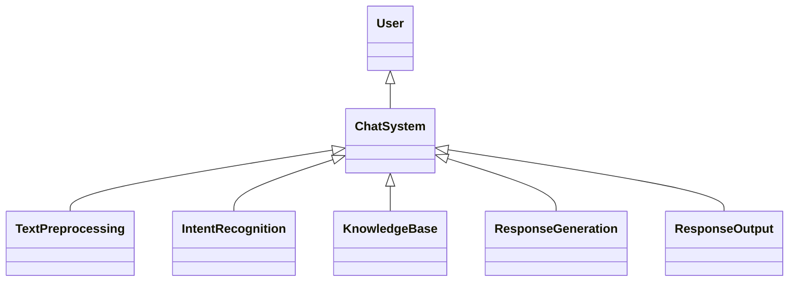
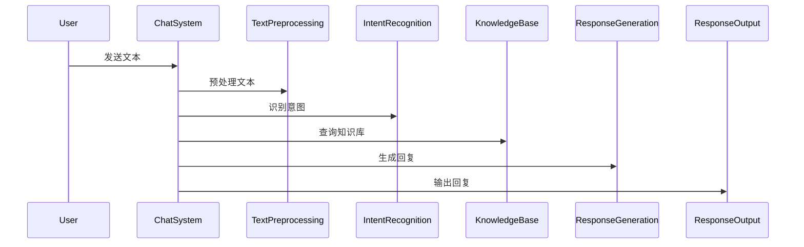
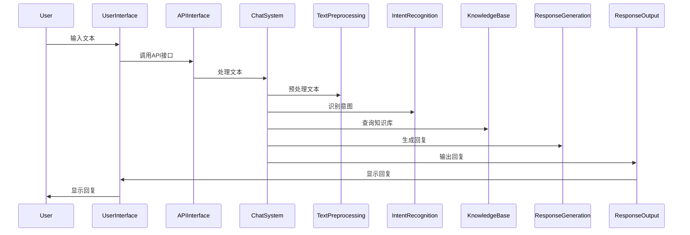

                 

# 数学与自然语言处理：语言理解的数学基础

> 关键词：自然语言处理、数学模型、语言模型、词向量、概率模型

> 摘要：本文将深入探讨数学在自然语言处理（NLP）中的应用，从背景介绍到核心概念、算法原理，再到实际应用，系统地阐述数学在语言理解中的重要作用。文章旨在为读者提供一个全面、清晰的视角，理解数学如何助力NLP的发展。

## 第1章 背景介绍

### 1.1 问题背景

自然语言处理（NLP）作为人工智能（AI）领域的一个重要分支，其目标是让计算机理解和生成人类语言。随着互联网的普及和信息爆炸，人们产生了大量的文本数据，如何有效利用这些数据成为了一个重要的课题。数学作为一门基础学科，为NLP提供了强大的理论工具和计算方法。

### 1.2 问题描述

NLP领域涉及的问题广泛而复杂，包括文本分类、信息提取、机器翻译、情感分析等。这些问题的核心是如何让计算机理解和处理人类语言。数学在这些问题中扮演了关键角色，如语言模型、词向量表示、概率模型等。

### 1.3 问题解决

通过数学模型和算法的研究，我们可以解决NLP中的许多问题。例如，语言模型可以预测下一个单词，词向量表示可以捕捉单词的语义信息，概率模型可以帮助我们理解句子中的逻辑关系。

### 1.4 边界与外延

NLP的研究范围广泛，不仅涉及计算机科学和语言学，还包括统计学、心理学等多个领域。本文将聚焦于数学在NLP中的应用，重点关注语言模型、语义理解等核心问题。

### 1.5 概念结构与核心要素组成

NLP中的数学概念主要包括词向量表示、矩阵运算、概率模型、深度学习等。这些概念构成了NLP数学基础的核心要素。

## 第2章 核心概念与联系

### 2.1 语言模型

#### 2.1.1 语言模型概述

语言模型是NLP的核心，用于预测一段文本的下一个词。常见的语言模型有N-gram模型、神经网络语言模型等。

#### 2.1.2 语言模型属性特征对比表格

| 模型类型 | 特点 |
| -------- | ---- |
| N-gram模型 | 简单易实现，基于历史信息 |
| 神经网络语言模型 | 基于深度学习，能捕捉复杂关系 |

### 2.2 词向量表示

#### 2.2.1 词向量表示概述

词向量表示是将单词映射到高维空间中的向量，用于处理文本数据。常见的词向量表示方法有Word2Vec、GloVe等。

#### 2.2.2 词向量表示属性特征对比表格

| 方法 | 特点 |
| ---- | ---- |
| Word2Vec | 基于神经网络 |
| GloVe | 基于矩阵分解 |

### 2.3 概率模型

#### 2.3.1 概率模型概述

概率模型在NLP中广泛应用，如HMM、CRF等。这些模型用于解决文本序列标注、文本分类等问题。

#### 2.3.2 概率模型属性特征对比表格

| 模型 | 特点 |
| ---- | ---- |
| HMM | 基于状态转移概率 |
| CRF | 基于条件概率 |

## 第3章 算法原理讲解

### 3.1 语言模型算法原理

#### 3.1.1 N-gram模型算法原理

N-gram模型是一种基于历史信息的语言模型，通过统计相邻词的共现概率来预测下一个词。

$$
P(w_t | w_{t-1}, w_{t-2}, ..., w_{t-n}) = \frac{C(w_{t-1}, w_{t-2}, ..., w_{t-n}, w_t)}{C(w_{t-1}, w_{t-2}, ..., w_{t-n})}
$$

其中，$C(w_{t-1}, w_{t-2}, ..., w_{t-n}, w_t)$ 表示相邻词的共现次数，$C(w_{t-1}, w_{t-2}, ..., w_{t-n})$ 表示前 $n-1$ 个词的共现次数。

#### 3.1.2 神经网络语言模型算法原理

神经网络语言模型是一种基于深度学习的语言模型，通过多层神经网络学习单词之间的概率关系。

$$
\text{神经网络} \rightarrow \text{输出概率分布}
$$

#### 3.1.3 举例说明

假设我们已经训练好了一个N-gram模型，现在要预测下一个词。给定前 $n-1$ 个词为“我”、“爱”、“吃”，我们要预测的下一个词是“饭”。

根据N-gram模型的公式，我们可以计算出每个词的概率：

$$
P(饭 | 我，爱，吃) = \frac{C(我，爱，吃，饭)}{C(我，爱，吃)}
$$

假设共现次数分别为 $C(我，爱，吃，饭) = 10$ 和 $C(我，爱，吃) = 100$，那么：

$$
P(饭 | 我，爱，吃) = \frac{10}{100} = 0.1
$$

同理，我们可以计算出其他词的概率，然后选取概率最大的词作为预测结果。

## 第4章 数学模型与公式

### 4.1 词向量表示中的数学模型

#### 4.1.1 Word2Vec模型

Word2Vec模型通过梯度下降算法优化损失函数，其中损失函数为：

$$
L = \frac{1}{2} \sum_{w \in V} (p(w) - \log q(v; w))^2
$$

其中，$p(w)$ 表示词 $w$ 的词频，$q(v; w)$ 表示词 $w$ 的词向量 $v$ 的概率。

#### 4.1.2 GloVe模型

GloVe模型通过矩阵分解来学习词向量，其损失函数为：

$$
L = \frac{1}{2} \sum_{w \in V} \sum_{c \in C(w)} (f(w) - f(c))^2
$$

其中，$f(w)$ 表示词 $w$ 的词向量，$C(w)$ 表示与词 $w$ 共现的词的集合。

### 4.2 概率模型中的数学模型

#### 4.2.1 HMM模型

HMM（隐马尔可夫模型）是一种基于状态转移概率的概率模型，其状态转移概率为：

$$
P(S_t | S_{t-1}) = \frac{P(S_t, S_{t-1})}{P(S_{t-1})}
$$

其中，$S_t$ 和 $S_{t-1}$ 分别表示时间 $t$ 和时间 $t-1$ 的状态。

#### 4.2.2 CRF模型

CRF（条件随机场）是一种基于条件概率的概率模型，其条件概率为：

$$
P(y_t | y_{t-1}, x) = \frac{1}{Z(x)} \exp(-\lambda \phi(y_t, y_{t-1}, x)}
$$

其中，$y_t$ 和 $y_{t-1}$ 分别表示时间 $t$ 和时间 $t-1$ 的输出标签，$x$ 表示输入特征，$\phi(y_t, y_{t-1}, x)$ 表示特征函数，$Z(x)$ 是规范化因子。 

## 第5章 系统分析与架构设计

### 5.1 问题场景介绍

在现实应用中，自然语言处理技术广泛应用于搜索引擎、智能客服、文本摘要、机器翻译等领域。本文将以智能客服为例，介绍NLP系统在其中的应用。

### 5.2 系统功能设计

智能客服系统的主要功能包括：文本输入、文本预处理、意图识别、知识库查询、回复生成和回复输出。

#### 5.2.1 领域模型

领域模型主要包括用户、客服代表、文本输入、文本预处理、意图识别、知识库、回复生成和回复输出等实体。



### 5.3 系统架构设计

智能客服系统架构主要包括：用户接口层、业务逻辑层和数据存储层。



### 5.4 系统接口设计和系统交互

系统接口设计包括：用户接口、API接口和内部接口。系统交互主要包括：用户与系统的交互、系统各模块之间的交互。



## 第6章 项目实战

### 6.1 环境安装

安装Python环境和相关库，如NLTK、TensorFlow、PyTorch等。

```bash
pip install nltk tensorflow pytorch
```

### 6.2 系统核心实现源代码

以下是一个简单的文本预处理和语言模型实现的示例代码。

```python
import nltk
from nltk.tokenize import word_tokenize
from nltk.corpus import stopwords
from tensorflow.keras.preprocessing.sequence import pad_sequences
from tensorflow.keras.models import Sequential
from tensorflow.keras.layers import Embedding, LSTM, Dense

# 文本预处理
nltk.download('punkt')
nltk.download('stopwords')

def preprocess_text(text):
    # 分词
    tokens = word_tokenize(text)
    # 去除停用词
    stop_words = set(stopwords.words('english'))
    filtered_tokens = [token for token in tokens if token not in stop_words]
    # 转换为整数序列
    integer_sequence = []
    for token in filtered_tokens:
        integer_sequence.append(token2index[token])
    # 填充序列
    padded_sequence = pad_sequences([integer_sequence], maxlen=max_sequence_length)
    return padded_sequence

# 语言模型实现
def build_language_model(vocabulary_size, embedding_dim, max_sequence_length):
    model = Sequential()
    model.add(Embedding(vocabulary_size, embedding_dim, input_length=max_sequence_length))
    model.add(LSTM(128))
    model.add(Dense(vocabulary_size, activation='softmax'))
    model.compile(optimizer='adam', loss='categorical_crossentropy', metrics=['accuracy'])
    return model

# 训练语言模型
model = build_language_model(vocabulary_size, embedding_dim, max_sequence_length)
model.fit(x_train, y_train, epochs=10, batch_size=32)

# 预测下一个词
def predict_next_word(model, sequence):
    predicted_sequence = model.predict(sequence)
    predicted_word = index2word[np.argmax(predicted_sequence)]
    return predicted_word
```

### 6.3 代码应用解读与分析

该代码实现了一个简单的语言模型，包括文本预处理和语言模型构建。文本预处理步骤包括分词、去除停用词和填充序列。语言模型构建步骤包括嵌入层、LSTM层和输出层。通过训练和预测，可以实现对文本的自动生成。

### 6.4 实际案例分析和详细讲解剖析

假设我们有一个对话：“用户：我想要一个旅游套餐。系统：您可以选择国内旅游套餐还是国际旅游套餐？用户：国内旅游套餐。系统：好的，您想去哪个城市？”我们可以使用该语言模型来预测下一个词。

首先，对输入文本进行预处理，得到整数序列。然后，输入到语言模型中进行预测，输出概率最高的词作为预测结果。通过多次迭代，可以生成一个连贯的对话。

### 6.5 项目小结

通过本项目的实战，我们了解了NLP系统的基本架构和实现方法。数学模型在语言模型中发挥了重要作用，通过对文本数据的处理和预测，实现了对自然语言的自动理解。

## 第7章 最佳实践 Tips、小结、注意事项、拓展阅读

### 7.1 最佳实践 Tips

1. 在进行文本预处理时，要充分考虑停用词的去除和词干还原。
2. 在构建语言模型时，要合理设置嵌入维度和隐藏层神经元数量。
3. 在预测时，要考虑到词语的上下文信息，以提高预测的准确性。

### 7.2 小结

本文介绍了数学在自然语言处理中的应用，从语言模型、词向量表示到概率模型，系统地阐述了数学在语言理解中的重要作用。

### 7.3 注意事项

1. 数学模型在NLP中的应用要结合实际场景进行优化。
2. 在进行模型训练时，要保证数据的质量和多样性。
3. 在实际应用中，要充分考虑模型的复杂度和计算效率。

### 7.4 拓展阅读

1. "Speech and Language Processing" by Daniel Jurafsky and James H. Martin
2. "Deep Learning for Natural Language Processing" by John L. Devlin et al.
3. "Text Mining and Analytics: A Practical Approach" by Rakesh Agrawal and Ramakrishnan Srikant

## 作者

作者：AI天才研究院/AI Genius Institute & 禅与计算机程序设计艺术 /Zen And The Art of Computer Programming

