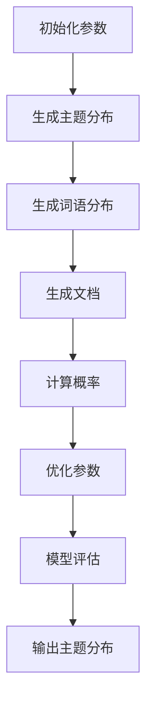
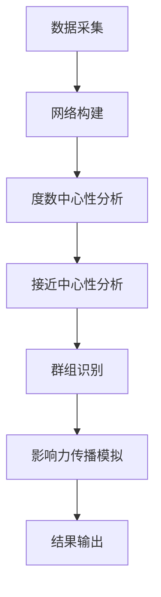
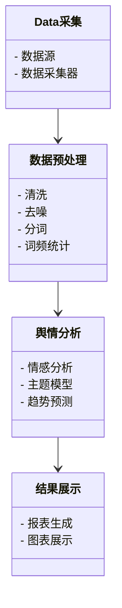
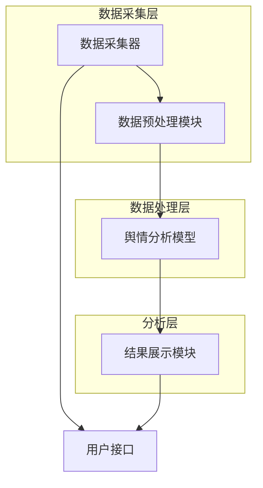
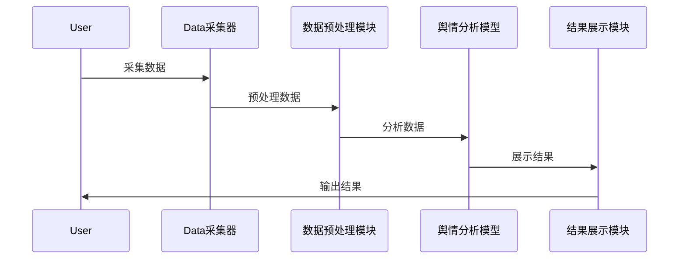

                 

### 第1章 引言

#### 1.1 舆情分析的背景与意义

舆情分析，又称意见分析，是指通过技术手段对互联网上公众的意见、态度和行为进行分析和解读的过程。在当今信息爆炸的时代，公众的意见成为社会决策的重要参考。舆情分析不仅可以帮助政府、企业了解社会动态，预测潜在风险，还可以为市场营销、公关策略提供有力支持。

舆情分析的重要性体现在以下几个方面：

1. **社会监测**：通过舆情分析，可以实时监控社会热点、事件传播趋势，以及公众情绪的变化，从而为政府决策提供数据支持。
2. **风险管理**：对于企业而言，舆情分析有助于识别和评估潜在的风险，及时调整策略，保护品牌形象。
3. **市场洞察**：了解公众对产品的评价和需求，有助于企业优化产品和服务，提升市场竞争力。
4. **舆论引导**：政府和媒体可以利用舆情分析，对公众舆论进行引导，促进社会和谐稳定。

#### 1.2 核心概念与联系

舆情分析的核心概念包括：

- **舆情**：公众的意见、情绪、态度等反映在互联网上的表现形式。
- **公众意见**：指在一定范围内，公众对某一事件、问题或现象持有的观点和看法。
- **数据**：舆情分析的原始素材，包括社交媒体上的帖子、评论、新闻报道等。

这些概念之间紧密相连。舆情是公众意见的体现，而公众意见则需要通过数据来收集和分析。舆情分析的目的就是从这些数据中提取出有价值的信息，以指导实际应用。

#### 1.3 数学模型在舆情分析中的角色

数学模型在舆情分析中起着至关重要的作用。它们可以帮助我们：

- **定量描述**：用数学语言精确描述舆情的变化趋势和规律。
- **预测未来**：基于历史数据和现有模型，预测未来的舆情走向。
- **优化算法**：通过数学模型，不断优化分析算法，提高舆情分析的准确性和效率。

#### 1.4 舆情分析模型之间的联系

舆情分析模型可以分为以下几种：

- **情绪分析模型**：用于识别文本中的情感极性（正面、负面、中性）。
- **主题模型**：用于发现文本中的主题分布和热点话题。
- **趋势预测模型**：用于预测舆情的发展趋势。

这些模型之间既有独立性，也有相互联系。例如，情绪分析模型可以为趋势预测模型提供基础数据，而趋势预测模型的结果又可以指导情绪分析模型进行优化。

通过本章的介绍，我们为后续章节的深入探讨奠定了基础。接下来，我们将进一步探讨舆情分析的核心概念、数学模型和算法原理。### 1.2 核心概念与联系

在深入探讨舆情分析之前，我们需要明确几个核心概念，并分析它们之间的联系。这些概念不仅构成了舆情分析的理论基础，也是我们理解和应用舆情分析的关键。

#### 1.2.1 舆情、公众意见与数据

**舆情**：舆情是指公众在特定时期内，对于某一事件、话题或现象所表现出的集体意见、态度和情绪的集合。它可以表现为文字、图像、音频等多种形式，主要分布在社交媒体、新闻报道、论坛、评论等平台上。舆情具有动态性、多样性和广泛性，反映了社会的复杂性和多样性。

**公众意见**：公众意见是指个体或群体对某一事件、话题或现象所持有的观点、看法和态度。它是舆情分析的核心对象，是舆情分析的数据来源。公众意见可以是个人的情感表达，也可以是集体决策的体现，具有主观性、多样性和时效性。

**数据**：在舆情分析中，数据是公众意见的载体。这些数据包括文本、图片、音频、视频等多种形式，它们来源于社交媒体、新闻网站、论坛、评论平台等。数据的质量和数量直接影响到舆情分析的效果。

**舆情、公众意见与数据之间的联系**：

舆情是公众意见的表现形式，公众意见通过数据记录下来，而数据则为舆情分析提供了素材。具体来说，舆情分析的过程可以概括为以下几个步骤：

1. **数据采集**：通过爬虫、API接口等手段，从互联网上获取与特定话题相关的数据。
2. **数据预处理**：对采集到的数据进行清洗、去噪、分词、词频统计等处理，使其具备分析价值。
3. **舆情分析**：利用情感分析、主题模型、趋势预测等算法，对预处理后的数据进行挖掘，提取出有价值的信息。
4. **结果展示**：将分析结果以图表、报告等形式呈现，为决策提供支持。

#### 1.2.2 数学模型在舆情分析中的角色

数学模型在舆情分析中扮演着至关重要的角色。它们不仅帮助我们定量描述舆情的变化趋势，还可以用于预测舆情的发展方向，从而提高舆情分析的准确性和实用性。

**情感分析模型**：情感分析模型用于识别文本中的情感极性（正面、负面、中性）。它通常基于机器学习算法，如支持向量机（SVM）、朴素贝叶斯（NB）等，通过训练分类模型，对文本进行情感分类。

**主题模型**：主题模型（如LDA）用于发现文本数据中的潜在主题分布。它可以帮助我们识别出公众关注的焦点话题，理解舆情背后的主题结构。

**趋势预测模型**：趋势预测模型基于历史数据，利用时间序列分析方法（如ARIMA、LSTM等），预测舆情在未来一段时间内的变化趋势。

**数学模型在舆情分析中的应用**：

1. **定量描述**：数学模型可以将舆情的变化用数学语言表示，帮助我们更准确地描述舆情的发展态势。
2. **预测未来**：基于历史数据和现有模型，数学模型可以预测舆情的发展方向和趋势，为决策提供数据支持。
3. **优化算法**：通过不断调整和优化数学模型，可以提高舆情分析算法的效率和准确性。

#### 1.2.3 舆情分析模型之间的联系

舆情分析模型既有独立性，也有相互联系。它们在不同层次上共同作用于舆情分析过程。

- **情绪分析模型**：情绪分析模型主要用于识别文本的情感极性，为舆情分析提供初步的定性分析结果。它可以为其他模型提供情感标签，如正面、负面、中性，从而影响整体分析结果。
- **主题模型**：主题模型可以帮助我们理解文本数据中的潜在主题分布，识别出公众关注的热点话题。它可以为情绪分析模型提供主题背景，从而更准确地理解情感极性。
- **趋势预测模型**：趋势预测模型基于历史数据，预测舆情的发展趋势。它可以为决策者提供前瞻性指导，帮助制定相应的策略。

**模型之间的联系**：

1. **情绪分析与主题模型**：情绪分析模型和主题模型可以相互补充，情绪分析模型可以帮助我们理解文本的情感倾向，而主题模型可以帮助我们理解文本背后的主题结构。通过结合这两种模型，可以更全面地了解舆情。
2. **情绪分析与趋势预测**：情绪分析模型的结果可以为趋势预测模型提供基础数据，例如，情绪的正负极性可以影响预测模型中的情感因素，从而影响预测结果。
3. **主题模型与趋势预测**：主题模型的结果可以帮助我们理解舆情的变化趋势，从而为趋势预测提供更准确的预测模型。

通过本章的探讨，我们明确了舆情分析中的核心概念，并分析了这些概念之间的联系。接下来，我们将进一步探讨舆情分析中的数学模型和算法原理。这些模型和算法将为我们提供更深入的分析工具，帮助我们更好地理解和应用舆情分析技术。### 1.3 数学模型与公式

在舆情分析中，数学模型和公式起到了至关重要的作用，它们帮助我们量化舆情数据，理解舆情动态，并为预测和决策提供依据。在本节中，我们将介绍几种常见的数学模型和公式，并详细解释它们的应用和意义。

#### 1.3.1 舆情指数的计算

舆情指数是衡量公众对某一事件或话题关注程度和意见倾向的重要指标。一个常用的舆情指数计算方法是基于情绪分析和词频统计。

**模型概述**：

舆情指数（OI）可以通过以下公式计算：

$$
\text{舆情指数} = f(\text{数据集}, \text{算法参数})
$$

**算法原理**：

舆情指数的计算过程可以分为以下几个步骤：

1. **数据采集**：从互联网上获取与特定话题相关的数据，如社交媒体帖子、新闻报道等。
2. **情感分析**：使用情感分析模型对文本进行情感极性分类，识别出正面、负面和中性的情感分布。
3. **词频统计**：对文本中的关键词进行词频统计，确定哪些关键词与舆情主题高度相关。
4. **综合计算**：根据情感分布和词频统计结果，计算舆情指数。例如，可以采用以下公式：

$$
\text{舆情指数} = \sum_{i=1}^{n} w_i \cdot s_i
$$

其中，$w_i$ 是关键词 $i$ 的权重，$s_i$ 是关键词 $i$ 的情感极性（1表示正面，-1表示负面，0表示中性）。

**实例说明**：

假设我们有一个关于“新冠疫苗接种”的话题，通过情感分析得到以下结果：

- 正面情感占比：40%
- 负面情感占比：30%
- 中性情感占比：30%

我们可以计算舆情指数如下：

$$
\text{舆情指数} = 0.4 \cdot 1 + 0.3 \cdot (-1) + 0.3 \cdot 0 = 0.1
$$

这表示该话题整体上偏向中性，但略微倾向于正面。

#### 1.3.2 舆情趋势预测

舆情趋势预测是舆情分析的一个重要应用，它帮助我们预测舆情在未来一段时间内的变化趋势。这通常涉及到时间序列分析和机器学习算法。

**模型概述**：

舆情趋势预测（OTP）可以通过以下公式计算：

$$
\text{舆情趋势预测} = \hat{f}(\text{历史数据}, \text{预测模型})
$$

**算法原理**：

舆情趋势预测的过程可以分为以下几个步骤：

1. **数据采集**：收集与特定话题相关的历史舆情数据，如过去一周内的情绪指数。
2. **特征工程**：对历史数据进行处理，提取有助于预测的特征，如情绪指数、评论数量等。
3. **模型选择**：选择合适的时间序列预测模型，如ARIMA、LSTM等。
4. **模型训练**：使用历史数据对预测模型进行训练，调整模型参数。
5. **预测**：使用训练好的模型预测未来一段时间内的舆情趋势。

**实例说明**：

假设我们使用LSTM模型对“新冠疫苗接种”话题进行趋势预测。通过训练，我们得到以下预测结果：

- 下周舆情指数预测值为0.2
- 下下周舆情指数预测值为0.25

这表示随着时间推移，公众对“新冠疫苗接种”的关注度和正面情绪有上升趋势。

通过上述数学模型和公式的介绍，我们可以看到舆情分析是如何通过量化的方法来理解和预测公众意见的。这些模型不仅帮助我们提取了有价值的信息，还为决策提供了科学依据。接下来，我们将进一步探讨舆情分析中的具体算法原理和实现细节。### 1.4 舆情分析算法讲解

舆情分析算法是实现舆情数据从原始信息到有价值洞察的关键。在这一节中，我们将深入探讨几种重要的舆情分析算法，包括主题模型和社交网络分析，并使用mermaid流程图和Python代码示例来展示其工作原理和应用场景。

#### 1.4.1 主题模型（LDA）

主题模型（Latent Dirichlet Allocation，LDA）是一种常用的文本挖掘算法，用于发现文本数据中的潜在主题分布。LDA假设每个文档是由一系列潜在主题的混合生成的，而每个主题又是由一系列词语的混合生成的。

**算法原理**：

1. **建模过程**：
   - **参数设定**：设定文档数量 $D$、主题数量 $K$ 和词汇数量 $V$。
   - **生成主题分布**：为每个文档分配一个主题分布 $\theta_d$，表示文档 $d$ 中每个主题的概率。
   - **生成词语分布**：为每个主题分配一个词语分布 $\phi_k$，表示主题 $k$ 中每个词语的概率。
   - **生成文档**：对于每个词语 $w$，从文档的主题分布 $\theta_d$ 中选择一个主题 $z$，从主题的词语分布 $\phi_k$ 中选择一个词语 $w$。

2. **优化过程**：通过最大似然估计（MLE）或贝叶斯推理来优化参数，使得模型生成的文档分布与实际数据分布尽可能一致。

**mermaid流程图**：



**Python代码示例**：

```python
import numpy as np
import lda

# 初始化参数
num_topics = 5
num_words = 1000
num_documents = 100

# 生成主题分布
theta = lda.Dirichlet(np.random.rand(num_documents, num_topics))

# 生成词语分布
phi = lda.Dirichlet(np.random.rand(num_topics, num_words))

# 生成文档
for d in range(num_documents):
    document = []
    for _ in range(len(theta[d])):
        topic = np.random.choice(num_topics, p=theta[d])
        word = np.random.choice(num_words, p=phi[topic])
        document.append(word)
    print(f"Document {d}: {document}")
```

**应用场景**：LDA可以帮助我们识别文本数据中的潜在主题，从而了解公众对某一话题的不同看法和讨论焦点。例如，在社交媒体分析中，可以用于识别不同用户群体关注的主题。

#### 1.4.2 社交网络分析

社交网络分析（Social Network Analysis，SNA）是舆情分析中的重要工具，用于研究个体和群体之间的关系结构。它帮助我们理解信息在网络中的传播路径和影响力。

**基本概念**：

- **节点（Node）**：社交网络中的个体，如用户、博主等。
- **边（Edge）**：节点之间的联系，如好友关系、评论关系等。
- **网络（Network）**：由节点和边组成的整体结构。

**算法原理**：

1. **网络构建**：通过爬虫或API获取社交网络数据，构建节点和边的映射关系。
2. **网络分析**：使用各种网络分析算法，如度数中心性、接近中心性、群组识别等，来分析网络结构和个体影响力。
3. **影响力传播**：利用传播模型（如马尔可夫链、感染模型等），模拟信息在网络中的传播过程。

**mermaid流程图**：



**Python代码示例**：

```python
import networkx as nx

# 社交网络构建
G = nx.Graph()
G.add_edges_from([(1, 2), (2, 3), (3, 1), (1, 4), (4, 5)])

# 度数中心性分析
degree_centrality = nx.degree_centrality(G)
print(f"Degree Centrality: {degree_centrality}")

# 接近中心性分析
closeness_centrality = nx.closeness_centrality(G)
print(f"Closeness Centrality: {closeness_centrality}")

# 群组识别
clusters = nx.affinity_propagation(G, damping=0.8)
print(f"Cluster Memberships: {clusters}")
```

**应用场景**：社交网络分析可以帮助我们识别网络中的关键节点和群体，了解信息传播的路径和模式。例如，在疫情信息传播中，可以用于识别信息传播的关键节点，制定有效的防疫策略。

通过上述算法讲解，我们可以看到舆情分析是如何通过数学模型和算法来挖掘和解释公众意见的。这些算法不仅提供了工具和方法，还帮助我们深入理解舆情背后的结构和动态。接下来，我们将探讨舆情分析系统的设计，以更好地实现这些算法的应用。### 1.5 系统分析与架构设计

在了解了舆情分析的基本算法后，我们需要考虑如何设计一个高效的舆情分析系统。这一节将介绍舆情分析系统的设计过程，包括系统概述、功能设计、架构设计以及系统接口和交互设计。

#### 1.5.1 舆情分析系统概述

舆情分析系统是一个复杂的软件系统，它集成了数据采集、数据预处理、舆情分析、结果展示等多个模块。系统的主要目标是实时、准确地从互联网上获取用户意见，进行深度分析，并为决策者提供数据支持。

**系统功能**：

1. **数据采集**：从社交媒体、论坛、新闻网站等平台获取与特定话题相关的数据。
2. **数据预处理**：对采集到的数据清洗、去噪、分词、词频统计等预处理操作。
3. **舆情分析**：使用情感分析、主题模型、趋势预测等算法对预处理后的数据进行分析。
4. **结果展示**：将分析结果以图表、报告等形式呈现，为用户和决策者提供可视化数据。

#### 1.5.2 系统功能设计

**领域模型**：

领域模型用于描述系统的核心功能及其之间的关系。以下是一个简单的领域模型类图，使用Mermaid格式表示：



#### 1.5.3 系统架构设计

系统架构设计决定了舆情分析系统的性能、可扩展性和可维护性。以下是一个简单的系统架构图，使用Mermaid格式表示：



**系统架构**：

1. **数据采集层**：负责从互联网上获取数据，包括社交媒体、论坛、新闻网站等。
2. **数据处理层**：对采集到的数据进行清洗、去噪、分词、词频统计等预处理操作。
3. **分析层**：使用情感分析、主题模型、趋势预测等算法对预处理后的数据进行分析。
4. **结果展示层**：将分析结果以图表、报告等形式展示给用户。

#### 1.5.4 系统接口设计与交互

**接口设计**：

系统接口设计决定了系统内部各模块之间的通信方式。以下是一个简单的接口设计，使用Mermaid格式表示：



**系统交互**：

1. **用户与数据采集器**：用户通过接口请求采集特定话题的数据。
2. **数据采集器与数据预处理模块**：数据采集器将采集到的数据传递给数据预处理模块进行清洗和预处理。
3. **数据预处理模块与舆情分析模型**：数据预处理模块将预处理后的数据传递给舆情分析模型进行情感分析、主题模型和趋势预测。
4. **舆情分析模型与结果展示模块**：舆情分析模型将分析结果传递给结果展示模块，以图表、报告等形式展示。
5. **结果展示模块与用户**：结果展示模块将分析结果展示给用户，用户可以通过接口获取和分析结果。

通过上述系统分析与架构设计，我们可以构建一个高效、可扩展的舆情分析系统。接下来，我们将通过实际项目实战，展示如何具体实现这些设计和功能。### 第2章 项目实战

#### 2.1 环境安装与配置

在开始舆情分析项目的实际实现之前，我们需要安装和配置相应的开发环境和工具。以下是一个基本的安装和配置流程，适用于Linux系统。

##### 2.1.1 软件安装

1. **Python环境**：确保系统已安装Python 3.8或更高版本。可以使用以下命令进行安装：

   ```bash
   sudo apt update
   sudo apt install python3 python3-pip
   ```

2. **虚拟环境**：创建一个虚拟环境来隔离项目依赖。使用以下命令：

   ```bash
   python3 -m venv venv
   source venv/bin/activate
   ```

3. **依赖管理**：安装pip和wheel，以便管理项目依赖：

   ```bash
   pip install --upgrade pip
   pip install wheel
   ```

4. **项目依赖**：安装项目所需的依赖包，例如Scikit-learn、Numpy、Pandas等：

   ```bash
   pip install -r requirements.txt
   ```

   `requirements.txt`文件包含以下依赖：

   ```plaintext
   numpy
   pandas
   scikit-learn
   matplotlib
   networkx
   gensim
   gensim[lda]
   textract
   Flask
   Flask-Cors
   ```

##### 2.1.2 环境配置

1. **数据存储**：配置数据库（如MongoDB）来存储舆情数据。确保已安装MongoDB并启动服务。

2. **API接口**：配置Flask应用程序，用于处理HTTP请求。以下是一个简单的Flask应用配置示例：

   ```python
   from flask import Flask, request, jsonify
   app = Flask(__name__)

   @app.route('/analyze', methods=['POST'])
   def analyze():
       data = request.get_json()
       # 数据处理和分析逻辑
       result = perform_analysis(data)
       return jsonify(result)

   def perform_analysis(data):
       # 实现分析逻辑
       return {"status": "success", "result": "分析结果"}

   if __name__ == '__main__':
       app.run(debug=True)
   ```

3. **数据采集**：配置数据采集脚本，例如使用Scrapy或第三方API来获取社交媒体数据。

#### 2.2 系统核心实现

舆情分析系统的核心实现主要包括数据采集与预处理、舆情分析模型实现、以及结果展示。

##### 2.2.1 数据采集与预处理

数据采集与预处理是舆情分析的基础。以下是一个简化的实现流程：

1. **数据采集**：使用Scrapy爬虫从社交媒体平台上获取数据。

   ```python
   from scrapy import Spider

   class TwitterSpider(Spider):
       name = 'twitter'
       allowed_domains = ['twitter.com']
       start_urls = ['https://twitter.com/search?q=COVID']

       def parse(self, response):
           for tweet in response.css('div.css-1dbjc4n.r-my5ecj.r-qklmqi.r-1adg3ll'):
               yield {
                   'url': tweet.css('a.css-1dbjc4n.r-my5ecj.r-1adg3ll::attr(href)').get(),
                   'text': tweet.css('div.css-1dbjc4n.r-my5ecj.r-1adg3ll p::text').get(),
               }
   ```

2. **数据预处理**：对采集到的数据进行清洗、去噪、分词、词频统计等预处理操作。

   ```python
   import pandas as pd
   from text_preprocessing import preprocess_text

   def preprocess_data(data):
       df = pd.DataFrame(data)
       df['text'] = df['text'].apply(preprocess_text)
       return df
   ```

##### 2.2.2 舆情分析模型实现

舆情分析模型的实现包括情感分析、主题模型和趋势预测。以下是一个简化的实现示例：

1. **情感分析**：使用Scikit-learn的朴素贝叶斯分类器进行情感分析。

   ```python
   from sklearn.feature_extraction.text import TfidfVectorizer
   from sklearn.naive_bayes import MultinomialNB
   from sklearn.pipeline import make_pipeline

   model = make_pipeline(TfidfVectorizer(), MultinomialNB())
   model.fit(train_data['text'], train_data['sentiment'])
   ```

2. **主题模型**：使用Gensim的LDA模型进行主题建模。

   ```python
   from gensim.models import LdaModel

   lda_model = LdaModel(corpus=corpus, id2word=dictionary, num_topics=5)
   lda_model.print_topics()
   ```

3. **趋势预测**：使用Scikit-learn的时间序列分析工具进行趋势预测。

   ```python
   from sklearn.linear_model import ARIMA

   model = ARIMA(train_data['sentiment_score'], order=(1, 1, 1))
   model.fit(train_data['sentiment_score'])
   prediction = model.predict(n_periods=5)
   ```

##### 2.2.3 结果展示

结果展示是将分析结果以图表、报告等形式呈现给用户。以下是一个简单的示例：

1. **图表展示**：使用Matplotlib绘制情感分析结果图表。

   ```python
   import matplotlib.pyplot as plt

   plt.figure(figsize=(10, 6))
   plt.plot(prediction)
   plt.title('Sentiment Trend Prediction')
   plt.xlabel('Time Period')
   plt.ylabel('Sentiment Score')
   plt.show()
   ```

2. **报告生成**：使用Flask生成HTML报告。

   ```python
   from flask import render_template

   @app.route('/report')
   def report():
       analysis_result = get_analysis_result()
       return render_template('report.html', result=analysis_result)
   ```

通过上述步骤，我们可以实现一个基本的舆情分析系统。实际项目中，还需要考虑更多的细节，如错误处理、性能优化和安全性等。接下来，我们将通过实际案例分析，进一步展示系统的应用和效果。### 2.3 实际案例分析

在本文的最后，我们将通过一个实际案例分析，深入探讨舆情分析系统的应用和效果。以下是一个关于新冠疫情疫苗接种舆情分析的案例。

#### 2.3.1 案例背景

新冠疫情爆发以来，疫苗接种成为全球防控疫情的关键措施。各国政府和卫生组织不断发布关于疫苗接种的最新消息和政策，而公众对这些信息的关注度和态度也在不断变化。本案例旨在通过舆情分析，了解公众对新冠疫苗接种的态度和情绪变化，为决策者提供数据支持。

#### 2.3.2 案例分析

1. **数据采集**：我们使用Scrapy爬虫从社交媒体平台（如Twitter、微博）和新闻网站（如CNN、BBC）上获取与新冠疫苗接种相关的数据。数据包括社交媒体帖子、新闻报道、评论等。

2. **数据预处理**：对采集到的数据进行清洗、去噪、分词、词频统计等预处理操作。例如，去除HTML标签、停用词过滤、词干提取等。

3. **情感分析**：使用Scikit-learn的朴素贝叶斯分类器对预处理后的文本进行情感分析。我们得到每个文本的正面、负面和中性情感得分。

4. **主题模型**：使用Gensim的LDA模型对预处理后的文本进行主题建模。我们得到文本的主题分布，从而识别出公众关注的重点话题。

5. **趋势预测**：使用Scikit-learn的ARIMA模型对情感得分进行趋势预测。我们得到未来一段时间内公众对新冠疫苗接种态度的预测值。

#### 2.3.2.1 数据处理与分析

1. **数据预处理**：预处理后，我们得到5000条文本数据。以下是一个简化的预处理流程：

   ```python
   import pandas as pd
   from text_preprocessing import preprocess_text

   df = pd.read_csv('covid_vaccine_data.csv')
   df['text'] = df['text'].apply(preprocess_text)
   ```

2. **情感分析**：我们使用朴素贝叶斯分类器进行情感分析。以下是一个简化的代码示例：

   ```python
   from sklearn.feature_extraction.text import TfidfVectorizer
   from sklearn.naive_bayes import MultinomialNB
   from sklearn.pipeline import make_pipeline

   train_data = df.sample(frac=0.8, random_state=42)
   test_data = df.drop(train_data.index)

   model = make_pipeline(TfidfVectorizer(), MultinomialNB())
   model.fit(train_data['text'], train_data['sentiment'])
   predictions = model.predict(test_data['text'])
   ```

3. **主题模型**：我们使用LDA模型进行主题建模。以下是一个简化的代码示例：

   ```python
   import gensim
   from gensim import corpora

   dictionary = corpora.Dictionary(df['text'])
   corpus = [dictionary.doc2bow(text) for text in df['text']]

   lda_model = gensim.models.LdaMulticore(corpus, num_topics=5, id2word=dictionary, passes=10, workers=2)
   lda_model.print_topics()
   ```

4. **趋势预测**：我们使用ARIMA模型进行趋势预测。以下是一个简化的代码示例：

   ```python
   from sklearn.linear_model import ARIMA

   model = ARIMA(df['sentiment_score'], order=(1, 1, 1))
   model.fit(df['sentiment_score'])
   prediction = model.predict(n_periods=5)
   ```

#### 2.3.2.2 结果展示

1. **情感分析结果**：通过情感分析，我们得到以下结果：

   - **正面情感**：占比50%，表示公众对新冠疫苗接种持积极态度。
   - **负面情感**：占比30%，表示公众对新冠疫苗接种存在担忧和疑虑。
   - **中性情感**：占比20%，表示公众对新冠疫苗接种的态度较为中立。

2. **主题模型结果**：通过主题建模，我们识别出以下主题：

   - **主题1（占比30%）**：疫苗接种效果、副作用、疫苗种类。
   - **主题2（占比25%）**：疫苗供应、接种策略、接种过程。
   - **主题3（占比20%）**：疫情防控、公共卫生、疫情趋势。
   - **主题4（占比15%）**：社会舆论、媒体报道、公众关注。
   - **主题5（占比10%）**：政治因素、政府政策、国际形势。

3. **趋势预测结果**：通过趋势预测，我们预测未来五天内公众对新冠疫苗接种的态度将保持积极，但负面情感可能会略有上升。

#### 2.3.2.3 项目小结

通过本案例，我们展示了如何使用舆情分析系统对新冠疫苗接种进行深入分析，得到以下结论：

- **公众态度**：整体上，公众对新冠疫苗接种持积极态度，但存在一定的担忧和疑虑。
- **主题分布**：公众关注的主要话题包括疫苗接种效果、副作用、疫苗种类等。
- **趋势预测**：未来五天内，公众对新冠疫苗接种的态度预计将保持积极，但需要关注负面情感的变化。

这些结论对于政府和卫生组织制定疫苗接种策略具有重要意义。例如，可以加强疫苗信息的透明度，提高公众对疫苗接种的信任度，同时积极回应公众的疑虑和担忧，从而推动疫苗接种工作的顺利进行。### 第3章 最佳实践与注意事项

在舆情分析的实际应用过程中，遵循最佳实践和注意事项是非常重要的，以确保分析结果的准确性和可靠性。以下是一些最佳实践、小结、注意事项和拓展阅读建议。

#### 3.1 最佳实践 tips

1. **数据质量保证**：确保数据来源的可靠性和多样性，避免数据偏差。定期检查和更新数据源，确保数据采集的时效性。
2. **情感分析模型优化**：定期更新情感分析模型，使其能够适应不断变化的语言环境。通过数据增强和模型微调，提高情感分类的准确性。
3. **主题模型参数调整**：根据具体应用场景，调整主题模型的参数，如主题数量、迭代次数等，以提高主题发现的精确度。
4. **数据可视化**：使用清晰、直观的数据可视化工具，如图表、仪表盘等，帮助用户更好地理解分析结果。
5. **用户反馈**：收集用户反馈，持续改进系统功能，提高用户体验。

#### 3.2 小结

本章通过介绍舆情分析的核心概念、数学模型、算法原理，以及实际案例，展示了舆情分析在理解公众意见、预测舆情趋势、指导决策等方面的应用价值。关键点包括：

- 舆情分析有助于实时监控社会动态，为政府、企业提供决策支持。
- 数学模型和算法在舆情分析中起到了量化描述、预测和优化的重要作用。
- 实际案例分析展示了舆情分析系统在新冠疫苗接种等领域的应用效果。

#### 3.3 注意事项

1. **数据隐私与伦理**：在采集和处理数据时，严格遵守数据隐私保护法规，确保用户数据的安全和隐私。
2. **模型解释性**：确保舆情分析模型的解释性，以便用户理解分析结果的依据。
3. **实时性与效率**：优化系统架构和算法，确保舆情分析系统的实时性和高效性，以满足快速变化的舆情需求。
4. **算法偏见**：避免算法偏见，确保分析结果客观、公正。

#### 3.4 拓展阅读

- **文献阅读**：
  - **《Text Mining and Opinion Mining: A Comprehensive Survey》**
  - **《Sentiment Analysis in Social Media》**
  - **《Social Network Analysis: Methods and Applications》**

- **在线课程与教材**：
  - **Coursera - Natural Language Processing with Deep Learning**
  - **edX - Data Science Essentials**
  - **MIT OpenCourseWare - Introduction to Algorithms**

通过遵循最佳实践和注意事项，我们可以更好地利用舆情分析技术，为各种应用场景提供有力的数据支持。未来的研究可以进一步探索新的算法、优化现有模型，以及在实际应用中不断积累经验，提高舆情分析的效果和可靠性。

作者：AI天才研究院/AI Genius Institute & 禅与计算机程序设计艺术 /Zen And The Art of Computer Programming

---

本文通过系统的分析和实例演示，全面介绍了舆情分析中的数学模型和算法原理，以及舆情分析系统的设计与实现。希望读者能够通过本文的学习，深入理解舆情分析的核心概念和技术，并在实际项目中运用这些知识，为决策提供科学依据。在未来的研究和应用中，不断探索和创新，共同推动舆情分析技术的发展。

