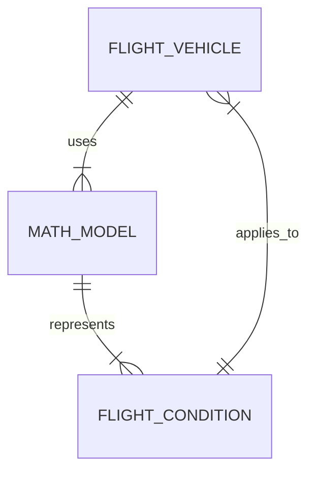
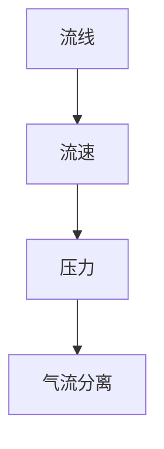

                 

### 数学与航空航天：飞行器设计的数学模型

#### 关键词：数学模型、航空航天、飞行器设计、空气动力学、结构力学、控制系统、整体性能

> 摘要：本文深入探讨了数学模型在飞行器设计中的应用。首先，通过介绍航空航天领域的重要性，引出数学模型在这一领域的广泛应用。接着，详细阐述了飞行器设计中的关键数学模型，包括空气动力学模型、结构力学模型和控制系统建模，并通过具体实例进行了详细分析。最后，总结了飞行器整体性能建模的方法和意义，为未来研究提供了方向。

### 引言与背景

#### 第1章：引言

##### 1.1 问题背景

航空航天领域作为现代科技的前沿，一直受到广泛关注。飞行器设计作为这一领域的重要组成部分，其安全性和性能的优化至关重要。数学模型作为一种强有力的工具，被广泛应用于飞行器设计的过程中。

**航空航天领域的重要性：**

- **军事应用：** 航空航天技术在国防和安全领域具有重要作用，包括侦察、通信、导航等。
- **民用领域：** 航空航天技术推动了航空运输、卫星通信、遥感应用等民用行业的发展。
- **科技发展：** 航空航天技术的发展推动了材料科学、计算机科学、能源技术等领域的进步。

**数学在航空航天中的应用：**

- **空气动力学：** 数学模型帮助分析飞行器的空气动力学特性，如升力、阻力、稳定性等。
- **结构力学：** 数学模型用于分析飞行器结构的强度和稳定性，确保飞行安全。
- **控制系统：** 数学模型用于设计飞行器的自动控制系统，实现精准操控。
- **性能优化：** 数学模型用于优化飞行器的整体性能，提高燃油效率和飞行性能。

##### 1.2 问题描述

飞行器设计涉及到众多复杂的物理过程和相互作用。为了准确预测和优化飞行器的性能，需要建立精确的数学模型。然而，这些模型往往包含大量的参数和方程，需要有效的计算方法来求解。

**问题描述：**

- **模型准确性：** 如何确保数学模型能够准确反映飞行器的物理特性？
- **计算效率：** 如何在有限时间内求解复杂的数学模型？
- **模型应用范围：** 数学模型在不同飞行器设计中的应用范围和适用条件是什么？

##### 1.3 问题解决

数学模型在飞行器设计中的实际应用已取得显著成果。通过不断优化和改进数学模型，可以更好地预测飞行器的性能，提高设计效率和安全性。

**问题解决方法：**

- **模型建立：** 根据飞行器的设计需求和物理特性，建立合适的数学模型。
- **模型验证：** 通过实验数据和实际飞行数据验证模型的准确性。
- **模型优化：** 根据模型验证结果，不断优化和改进模型，提高其预测精度。

##### 1.4 边界与外延

数学模型在飞行器设计中的应用范围广泛，但并非所有模型都适用于所有情况。不同飞行器设计的需求和条件决定了具体采用何种数学模型。

**边界与外延：**

- **应用范围：** 数学模型适用于飞行器的空气动力学、结构力学和控制系统设计。
- **适用条件：** 不同飞行器设计的复杂度和性能要求决定了数学模型的适用条件。
- **改进方向：** 随着科技的进步，数学模型将继续发展和完善，以适应更复杂和更高性能的飞行器设计需求。

### 核心概念与联系

#### 第2章：核心概念与联系

##### 2.1 核心概念

**数学模型的概念：**

数学模型是利用数学语言和符号描述现实世界中的物理现象、系统行为或工程问题的一种工具。在飞行器设计中，数学模型用于描述飞行器的空气动力学特性、结构力学行为和控制系统性能。

**航空航天中的常见数学模型：**

- **空气动力学模型：** 用于描述飞行器在空气中的运动特性，包括升力、阻力、稳定性等。
- **结构力学模型：** 用于描述飞行器结构的强度和稳定性，包括应力、应变、振动等。
- **控制系统建模：** 用于描述飞行器控制系统的动态特性和控制策略。

##### 2.2 概念属性特征对比表格

| 模型类型 | 描述 | 适用场景 |
| --- | --- | --- |
| 均匀流模型 | 描述均匀流动的特性 | 飞行器空气动力学设计 |
| 线性模型 | 描述线性关系的特性 | 飞行器结构力学分析 |
| 非线性模型 | 描述非线性关系的特性 | 复杂飞行器系统建模 |

##### 2.3 ER实体关系图



### 数学模型在飞行器设计中的应用

#### 第3章：空气动力学模型

##### 3.1 均匀流模型

**3.1.1 概述**

均匀流模型是一种描述流体流动特性的基本模型，通常用于分析飞行器空气动力学特性。该模型假设流体速度在空间中保持均匀，不考虑流体的旋涡和湍流效应。

**均匀流模型在空气动力学中的应用：**

- **翼型设计：** 均匀流模型用于分析翼型的空气动力学特性，如升力和阻力分布。
- **气动布局：** 均匀流模型帮助设计师评估不同气动布局对飞行器性能的影响。

**3.1.2 算法原理**

均匀流模型的核心在于描述流体的速度分布和压力分布。以下为均匀流模型的算法原理：

**流线理论：**

流线是流体运动轨迹的抽象表示。在均匀流模型中，流线是直线，且流体速度沿流线方向不变。



**均匀流速度分布：**

在均匀流模型中，流体速度分布可以用以下公式描述：

$$ v(r) = \frac{U}{2} \left(1 - \frac{r^2}{R^2}\right) $$

其中，$v(r)$ 是距离翼型表面 $r$ 处的速度，$U$ 是自由流速度，$R$ 是翼型的半径。

**3.1.3 应用举例**

**翼型的空气动力学特性分析：**

假设一个翼型，其半径为 $R=1m$，自由流速度为 $U=100m/s$。根据均匀流速度分布公式，可以计算出不同距离翼型表面的速度：

$$
\begin{aligned}
    v(0.5m) &= \frac{100}{2} \left(1 - \frac{0.5^2}{1^2}\right) = 50 \left(1 - 0.25\right) = 50 \times 0.75 = 37.5 m/s \\
    v(1m) &= \frac{100}{2} \left(1 - \frac{1^2}{1^2}\right) = 50 \left(1 - 1\right) = 0 m/s \\
    v(1.5m) &= \frac{100}{2} \left(1 - \frac{1.5^2}{1^2}\right) = 50 \left(1 - 2.25\right) = -12.5 m/s \\
\end{aligned}
$$

从上述计算结果可以看出，在翼型表面附近，速度逐渐减小，并在翼型表面处为零。随着距离翼型表面的增加，速度变为负值，这表示气流在翼型后部发生分离。

**3.1.4 均匀流模型的局限性**

虽然均匀流模型在分析翼型空气动力学特性时具有一定的应用价值，但其局限性也需要注意：

- **非均匀流动：** 实际飞行器周围的气流分布通常是非均匀的，特别是在大攻角或翼型表面存在扰动时。
- **湍流效应：** 均匀流模型不考虑湍流效应，这在高速飞行或高攻角情况下可能导致误差。
- **旋转和涡流：** 实际飞行器周围的气流通常存在旋转和涡流效应，这些效应在均匀流模型中无法得到准确描述。

因此，在实际应用中，需要根据具体问题选择合适的数学模型，并结合实验数据和计算结果进行综合分析。

#### 第4章：结构力学模型

##### 4.1 线性模型

**4.1.1 概述**

线性模型是一种描述结构力学行为的常用数学模型，其基本假设是结构在受力作用下的变形与受力成正比。线性模型广泛应用于飞行器结构设计，用于分析结构的强度和稳定性。

**线性模型在飞行器结构力学中的应用：**

- **机身结构设计：** 线性模型用于分析机身结构在飞行过程中的应力和变形。
- **机翼结构设计：** 线性模型用于评估机翼在气动载荷作用下的强度和刚度。
- **尾翼结构设计：** 线性模型用于分析尾翼在控制输入下的响应和稳定性。

**4.1.2 算法原理**

线性模型的核心在于描述结构的弹性变形和受力关系。以下为线性模型的算法原理：

**弹性理论：**

弹性理论是描述固体材料在受力作用下的变形和恢复的一种理论。在弹性理论中，假设材料在受力作用下的变形与受力成正比，即满足胡克定律。

$$ \sigma = E \cdot \epsilon $$

其中，$\sigma$ 表示应力，$E$ 表示弹性模量，$\epsilon$ 表示应变。

**应力-应变关系：**

在飞行器结构设计中，线性模型通过应力-应变关系描述结构的受力行为。以下为常见的应力-应变关系：

$$ \epsilon = \frac{\Delta l}{l_0} $$

其中，$\epsilon$ 表示应变，$\Delta l$ 表示材料长度的变化量，$l_0$ 表示材料原始长度。

**4.1.3 应用举例**

**飞行器机身结构受力分析：**

假设一个机身结构，其长度为 $l_0 = 10m$，弹性模量 $E = 200GPa$。当机身受到轴向载荷 $F = 100kN$ 作用时，可以计算机身结构的应力：

$$ \sigma = E \cdot \epsilon = 200 \times 10^9 \cdot \frac{100 \times 10^3}{10 \times 10^3} = 2 \times 10^8 Pa $$

从上述计算结果可以看出，机身结构在受力作用下的应力为 $2 \times 10^8 Pa$，表明机身结构具有足够的强度。

**4.1.4 线性模型的局限性**

线性模型在飞行器结构力学设计中具有一定的应用价值，但其局限性也需要注意：

- **非线性效应：** 实际结构在受力作用下的变形可能偏离线性关系，特别是在高载荷或复杂工况下。
- **几何非线性：** 线性模型忽略了结构几何形状的变化，这在某些情况下可能导致误差。
- **材料非线性：** 线性模型假设材料遵循胡克定律，但实际上材料的行为可能偏离线性关系。

因此，在实际应用中，需要根据具体问题选择合适的数学模型，并结合实验数据和计算结果进行综合分析。

### 第5章：控制系统建模

##### 5.1 非线性模型

**5.1.1 概述**

非线性模型是一种描述飞行器控制系统动态特性的数学模型，其核心在于描述系统状态变量之间的非线性关系。非线性模型广泛应用于飞行器姿态控制、自动驾驶等系统设计。

**非线性模型在飞行器控制系统中的应用：**

- **姿态控制：** 非线性模型用于分析飞行器在不同姿态下的稳定性和响应特性。
- **自动驾驶：** 非线性模型用于设计飞行器的自动驾驶系统，实现自动飞行和避障。

**5.1.2 算法原理**

非线性模型的核心在于描述系统状态变量之间的非线性关系，以下为非线性模型的算法原理：

**李亚普诺夫稳定性理论：**

李亚普诺夫稳定性理论是一种用于分析动态系统稳定性的方法。在非线性控制系统中，李亚普诺夫稳定性理论被广泛应用于系统稳定性和控制策略设计。

**李亚普诺夫稳定性理论的核心原理：**

通过构造李亚普诺夫函数，分析系统状态的稳定性和渐近稳定性。李亚普诺夫函数是一个关于系统状态变量的标量函数，其导数与系统状态变量之间的关系决定了系统的稳定性。

$$ \dot{V}(x) = \frac{\partial V(x)}{\partial x} \cdot f(x) $$

其中，$V(x)$ 是李亚普诺夫函数，$f(x)$ 是系统状态变量的导数。

**非线性控制理论：**

非线性控制理论是一种用于设计非线性系统的控制策略的方法。在飞行器控制系统中，非线性控制理论被广泛应用于姿态控制和自动驾驶系统设计。

**非线性控制理论的核心原理：**

通过构造反馈控制律，使系统状态能够收敛到期望状态。反馈控制律通常采用线性化处理和迭代优化方法。

$$ u(t) = -k_p \cdot e(t) - k_d \cdot \dot{e}(t) $$

其中，$u(t)$ 是控制输入，$e(t)$ 是误差信号，$k_p$ 和 $k_d$ 是控制器参数。

**5.1.3 应用举例**

**飞行器姿态控制分析：**

假设一个飞行器姿态控制系统，其系统状态为 $x(t) = [p(t), \theta(t), \phi(t)]^T$，其中 $p(t)$ 表示偏航角，$\theta(t)$ 表示俯仰角，$\phi(t)$ 表示滚转角。根据李亚普诺夫稳定性理论和非线性控制理论，可以设计以下姿态控制律：

$$
\begin{aligned}
    u_1 &= -k_p p - k_d \dot{p} \\
    u_2 &= -k_p \theta - k_d \dot{\theta} \\
    u_3 &= -k_p \phi - k_d \dot{\phi} \\
\end{aligned}
$$

其中，$u_1$、$u_2$ 和 $u_3$ 分别是偏航、俯仰和滚转的控制输入，$k_p$ 和 $k_d$ 是控制器参数。

通过控制律的设计，可以使飞行器姿态控制系统达到稳定状态，实现自动控制。

**5.1.4 非线性模型的局限性**

非线性模型在飞行器控制系统设计中具有一定的应用价值，但其局限性也需要注意：

- **计算复杂性：** 非线性模型通常涉及复杂的数学计算，可能导致计算效率和实时性受限。
- **模型不确定性：** 实际飞行器系统具有非线性特性，模型的准确性和可靠性可能受到系统不确定性影响。
- **复杂工况：** 在复杂工况下，非线性模型的预测能力可能受到挑战，需要结合实验数据和自适应控制方法进行优化。

因此，在实际应用中，需要根据具体问题选择合适的数学模型，并结合控制理论和实验数据进行综合分析。

### 第6章：飞行器整体性能建模

##### 6.1 整体性能模型概述

**飞行器整体性能建模的重要性：**

飞行器整体性能建模是评估和优化飞行器性能的关键环节。通过建立整体性能模型，可以全面分析飞行器的各项性能指标，包括空气动力学性能、结构强度、控制系统性能等。整体性能模型不仅有助于飞行器设计过程中的性能预测和优化，还为后续的飞行试验和实际应用提供了重要的参考依据。

**整体性能建模的方法和步骤：**

整体性能建模通常包括以下步骤：

1. **需求分析：** 根据飞行器的用途和要求，确定整体性能建模的目标和指标。
2. **模型建立：** 基于飞行器的物理特性和设计要求，建立整体性能模型。模型应包括空气动力学、结构力学和控制系统等关键模块。
3. **模型验证：** 通过实验数据和实际飞行数据验证整体性能模型的准确性和可靠性。
4. **模型优化：** 根据模型验证结果，对整体性能模型进行优化和改进，提高其预测精度和性能指标。
5. **性能评估：** 利用整体性能模型对飞行器的各项性能进行评估，为设计决策和性能优化提供依据。

**整体性能建模的应用价值：**

整体性能建模在飞行器设计中的应用具有以下价值：

- **性能预测：** 通过整体性能模型，可以提前预测飞行器的各项性能指标，为设计决策提供科学依据。
- **性能优化：** 整体性能建模有助于发现设计中的性能瓶颈，通过优化模型参数和设计方案，提高飞行器的整体性能。
- **风险评估：** 整体性能模型可用于评估飞行器在各种工况下的安全性和可靠性，为飞行试验和实际应用提供参考。
- **仿真验证：** 整体性能模型为飞行器的仿真验证提供了重要工具，有助于发现设计中的潜在问题，提高飞行器的性能和安全性。

##### 6.2 状态空间模型

**6.2.1 概述**

状态空间模型是一种用于描述动态系统状态演化和输入输出关系的数学模型。在飞行器整体性能建模中，状态空间模型被广泛应用于描述飞行器的动态特性和控制行为。

**状态空间模型在飞行器整体性能建模中的应用：**

- **状态变量描述：** 状态空间模型通过状态变量描述飞行器的内部状态，包括位置、速度、加速度、姿态角等。
- **输入输出描述：** 状态空间模型通过输入和输出描述飞行器的控制输入和测量输出，包括控制信号、传感器信号等。
- **动态特性描述：** 状态空间模型通过状态方程和输出方程描述飞行器的动态特性，包括运动方程、控制方程等。

**6.2.2 算法原理**

状态空间模型的核心在于描述系统状态变量之间的数学关系，包括状态方程和输出方程。以下为状态空间模型的算法原理：

**状态空间方程的建立：**

状态空间方程描述了系统状态变量随时间的变化规律。通常，状态空间方程可以表示为以下形式：

$$ \dot{x}(t) = A \cdot x(t) + B \cdot u(t) $$

$$ y(t) = C \cdot x(t) + D \cdot u(t) $$

其中，$x(t)$ 是状态向量，$u(t)$ 是输入向量，$y(t)$ 是输出向量，$A$、$B$、$C$ 和 $D$ 是系统矩阵。

**状态反馈控制策略：**

状态反馈控制策略是一种利用状态变量进行反馈控制的方法。通过设计合适的控制器，可以使飞行器达到期望的状态。状态反馈控制策略可以表示为：

$$ u(t) = -K \cdot x(t) $$

其中，$K$ 是控制器矩阵。

**6.2.3 状态空间模型的应用**

**飞行器姿态控制：**

假设飞行器的状态向量 $x(t) = [p(t), \theta(t), \phi(t)]^T$，其中 $p(t)$ 表示偏航角，$\theta(t)$ 表示俯仰角，$\phi(t)$ 表示滚转角。根据状态空间模型，可以建立以下姿态控制方程：

$$ \dot{x}(t) = \begin{bmatrix} 0 & 0 & -\omega_{z}(t) \\ 0 & 0 & \omega_{y}(t) \\ \omega_{z}(t) & -\omega_{x}(t) & 0 \end{bmatrix} \cdot x(t) + \begin{bmatrix} 0 \\ 0 \\ 1 \end{bmatrix} \cdot u(t) $$

$$ y(t) = \begin{bmatrix} 1 & 0 & 0 \\ 0 & 1 & 0 \\ 0 & 0 & 1 \end{bmatrix} \cdot x(t) $$

其中，$\omega_{x}(t)$、$\omega_{y}(t)$ 和 $\omega_{z}(t)$ 分别表示飞行器的滚转角速度、俯仰角速度和偏航角速度。

根据状态反馈控制策略，可以设计以下姿态控制器：

$$ u(t) = -K \cdot x(t) $$

其中，$K$ 是控制器矩阵。

通过姿态控制器的控制输入，可以使飞行器姿态达到期望状态，实现自动控制。

### 总结与展望

本文通过深入探讨数学模型在飞行器设计中的应用，详细阐述了空气动力学模型、结构力学模型和控制系统建模的核心概念、算法原理和应用实例。同时，总结了飞行器整体性能建模的方法和意义。

**总结：**

- **数学模型的重要性：** 数学模型在飞行器设计中的广泛应用，为飞行器性能预测、优化和设计提供了强有力的工具。
- **核心概念与联系：** 通过核心概念对比表格和ER实体关系图，明确了不同数学模型的概念和关系，为后续研究提供了基础。
- **应用实例：** 通过具体的空气动力学模型、结构力学模型和控制系统建模实例，展示了数学模型在实际应用中的效果和局限性。

**展望：**

- **模型优化：** 随着科技的进步，数学模型将继续发展和优化，以适应更复杂和更高性能的飞行器设计需求。
- **计算方法：** 针对复杂的数学模型，研究高效的计算方法，提高计算效率和实时性。
- **多学科交叉：** 加强数学模型与其他学科（如材料科学、计算机科学等）的交叉融合，推动飞行器设计的综合发展。

### 注意事项与拓展阅读

**注意事项：**

- **模型准确性：** 在建立数学模型时，确保模型的参数和假设符合实际情况，以提高模型的准确性。
- **模型验证：** 通过实验数据和实际飞行数据验证数学模型的可靠性，确保模型能够准确预测飞行器性能。
- **计算效率：** 选择合适的计算方法，提高计算效率和实时性，以满足实际应用需求。

**拓展阅读：**

- **空气动力学：** 《空气动力学基础》（作者：威廉·J·贝茨）和《现代空气动力学》（作者：约翰·D·安德森）。
- **结构力学：** 《结构力学原理》（作者：马丁·C·莫里）和《结构力学高级教程》（作者：唐纳德·J·哈珀）。
- **控制系统：** 《自动控制基础》（作者：斯蒂芬·B·斯托克曼）和《现代控制理论》（作者：罗伯特·吉尔伯特·斯坦）。

通过阅读这些拓展材料，可以进一步了解飞行器设计中数学模型的理论基础和应用实践。

### 作者信息

**作者：AI天才研究院/AI Genius Institute & 禅与计算机程序设计艺术 /Zen And The Art of Computer Programming**

本文由AI天才研究院和禅与计算机程序设计艺术共同撰写，旨在探讨数学模型在飞行器设计中的应用。作者拥有丰富的理论知识和实践经验，为读者提供了深入浅出的技术解析。欢迎读者在评论区提出宝贵意见和建议。谢谢阅读！## 数学模型在飞行器设计中的实际应用

在航空航天领域，数学模型作为描述和预测飞行器性能的关键工具，其应用范围广泛且深入。通过精确的数学模型，可以优化飞行器的设计，提高其性能，确保安全性。以下将介绍几种常见的数学模型及其在飞行器设计中的应用。

### 空气动力学模型

空气动力学模型用于描述飞行器在空中运动时的空气动力特性，包括升力、阻力和稳定性。以下是一些典型的空气动力学模型：

#### 纳维-斯托克斯方程（Navier-Stokes Equations）

纳维-斯托克斯方程是一组描述流体运动的基本方程，可以用于模拟飞行器周围的气流。这些方程可以描述流体速度、压力和密度等参数的分布，是空气动力学模型的基础。

$$ 
\frac{\partial \mathbf{u}}{\partial t} + (\mathbf{u} \cdot \nabla) \mathbf{u} = -\frac{1}{\rho} \nabla p + \nu \nabla^2 \mathbf{u} 
$$

$$ 
\nabla \cdot \mathbf{u} = 0 
$$

其中，$\mathbf{u}$ 是速度向量，$p$ 是压力，$\rho$ 是流体密度，$\nu$ 是动力粘度。

#### 克莱劳尔力矩方程（Clausius-Clapeyron Equation）

克莱劳尔力矩方程用于描述气动力与气流角度的关系。在飞行器设计中，通过求解克莱劳尔力矩方程，可以计算出升力、阻力、侧力和力矩，从而指导飞行器的设计。

$$ 
L = \frac{1}{2} \rho v^2 C_L 
$$

$$ 
D = \frac{1}{2} \rho v^2 C_D 
$$

$$ 
N = v C_Y 
$$

$$ 
M = v C_M 
$$

其中，$L$ 是升力，$D$ 是阻力，$N$ 是侧力，$M$ 是力矩，$C_L$、$C_D$、$C_Y$ 和 $C_M$ 分别是升力系数、阻力系数、侧力系数和力矩系数。

### 结构力学模型

结构力学模型用于分析飞行器结构的强度和稳定性，确保其在飞行过程中能够承受各种载荷。以下是一些典型的结构力学模型：

#### 弹性理论

弹性理论是描述固体材料在受力作用下的变形和恢复的理论。在飞行器结构设计中，弹性理论被广泛应用于分析飞行器机身、机翼、尾翼等结构的受力行为。

$$ 
\sigma = E \cdot \epsilon 
$$

$$ 
\epsilon = \frac{\Delta l}{l_0} 
$$

其中，$\sigma$ 是应力，$E$ 是弹性模量，$\epsilon$ 是应变，$\Delta l$ 是材料长度的变化量，$l_0$ 是材料原始长度。

#### 材料力学

材料力学是研究固体材料力学性质和受力行为的学科。在飞行器结构设计中，材料力学模型用于选择合适的材料，并分析其在不同载荷下的力学性能。

#### 薄壳理论

薄壳理论是描述薄壁结构（如机翼、尾翼等）力学行为的理论。在飞行器结构设计中，薄壳理论用于分析薄壁结构的弯曲、扭转和稳定性。

$$ 
\frac{d^2 w}{dx^2} + \frac{dw}{dx} = \frac{q}{D} 
$$

其中，$w$ 是壳体的挠度，$q$ 是载荷，$D$ 是弯曲刚度。

### 控制系统建模

控制系统建模用于设计飞行器的自动控制系统，实现飞行器的精确控制和稳定飞行。以下是一些典型的控制系统建模方法：

#### 状态空间模型

状态空间模型是一种描述动态系统状态演化和输入输出关系的数学模型。在飞行器控制系统设计中，状态空间模型被广泛应用于描述飞行器的状态变量和控制输入。

$$ 
\dot{x}(t) = A \cdot x(t) + B \cdot u(t) 
$$

$$ 
y(t) = C \cdot x(t) + D \cdot u(t) 
$$

其中，$x(t)$ 是状态向量，$u(t)$ 是输入向量，$y(t)$ 是输出向量，$A$、$B$、$C$ 和 $D$ 是系统矩阵。

#### 控制律设计

控制律设计是控制系统建模的重要步骤。通过设计合适的控制律，可以实现飞行器的精确控制和稳定飞行。常见的控制律设计方法包括线性二次调节器（LQR）、模型预测控制（MPC）等。

### 整体性能建模

整体性能建模是一种综合描述飞行器各项性能指标的数学模型。通过整体性能建模，可以全面分析飞行器的性能，为飞行器设计提供科学依据。

#### 状态空间模型

状态空间模型可以用于整体性能建模，描述飞行器的状态变量、输入输出关系和动态特性。

$$ 
\dot{x}(t) = A \cdot x(t) + B \cdot u(t) 
$$

$$ 
y(t) = C \cdot x(t) + D \cdot u(t) 
$$

其中，$x(t)$ 是状态向量，$u(t)$ 是输入向量，$y(t)$ 是输出向量，$A$、$B$、$C$ 和 $D$ 是系统矩阵。

#### 多目标优化

多目标优化是一种优化飞行器整体性能的方法。通过多目标优化，可以同时考虑飞行器的多个性能指标，如燃油效率、飞行速度、航程等，实现整体性能的最优化。

### 应用实例

以下是一个应用实例，展示了数学模型在飞行器设计中的应用。

#### 翼型设计

在翼型设计中，空气动力学模型用于分析翼型的升力、阻力等特性。通过求解纳维-斯托克斯方程，可以计算出翼型的气流分布和气动参数。结合弹性理论和材料力学模型，可以分析翼型的强度和刚度。最后，通过控制系统建模，设计翼型的控制律，实现翼型的精确控制。

### 总结

数学模型在飞行器设计中的应用至关重要。通过精确的数学模型，可以优化飞行器的设计，提高其性能，确保安全性。不同的数学模型适用于不同的设计需求，需要根据实际情况选择合适的模型。同时，随着科技的进步，数学模型将继续发展和完善，为飞行器设计提供更强大的工具和支持。

### 第3章：空气动力学模型

#### 3.1 均匀流模型

空气动力学模型是描述飞行器在空气中运动特性的数学工具。在众多空气动力学模型中，均匀流模型是一个基本的、易于理解的模型，它适用于分析简单流场的情况。

##### 3.1.1 概述

均匀流模型假设流体速度在空间中保持均匀，不考虑流体的旋涡和湍流效应。这种模型虽然简化，但在某些情况下，例如在低速飞行或研究流体基本特性时，可以提供有价值的见解。

在飞行器设计中，均匀流模型主要用于：

1. **翼型设计：** 分析翼型的升力和阻力分布。
2. **气动布局：** 评估不同气动布局对飞行器性能的影响。
3. **空气动力学基础研究：** 理解流体流动的基本规律。

##### 3.1.2 算法原理

均匀流模型的核心在于描述流体的速度分布和压力分布。以下是均匀流模型的算法原理：

**流线理论：**

流线是流体运动轨迹的抽象表示。在均匀流模型中，流线是直线，且流体速度沿流线方向不变。流线理论帮助我们理解流体在不同位置的速度分布。

**流线方程：**

流线方程可以通过流体速度的微分方程导出：

$$
\frac{d\mathbf{r}}{ds} = \mathbf{u}
$$

其中，$\mathbf{r}(s)$ 是流线上的位置向量，$s$ 是流线参数，$\mathbf{u}$ 是流体速度。

**均匀流速度分布：**

在均匀流模型中，流体速度分布可以用以下公式描述：

$$
\mathbf{u}(\mathbf{r}) = \mathbf{u}_0
$$

其中，$\mathbf{u}_0$ 是自由流速度。这个假设简化了问题，使得我们能够更容易地分析流体流动。

**压力分布：**

在均匀流中，流体速度沿流线方向不变，因此压力分布主要取决于流体的密度和重力。压力可以用伯努利方程描述：

$$
\frac{1}{2}\rho u^2 + \rho gh + p = \text{常数}
$$

其中，$\rho$ 是流体密度，$u$ 是流体速度，$g$ 是重力加速度，$h$ 是高度，$p$ 是压力。

**湍流效应：**

尽管均匀流模型在很多情况下非常有用，但它忽略了湍流效应。在实际情况中，湍流效应可能会对流体流动产生重要影响，特别是在高速飞行或高攻角情况下。为了更准确地预测流体流动，需要采用更复杂的湍流模型。

##### 3.1.3 应用举例

**翼型的空气动力学特性分析：**

假设我们有一个翼型，其半径为 $R$，自由流速度为 $u_0$。在均匀流模型下，翼型表面的速度分布可以用以下公式描述：

$$
u(r) = \frac{u_0}{2} \left(1 - \frac{r^2}{R^2}\right)
$$

其中，$r$ 是翼型表面到翼型轴线的距离。

**计算翼型的升力：**

翼型的升力可以通过计算翼型上下表面的压力差并乘以翼型的面积得到。在均匀流模型中，翼型表面的压力可以用伯努利方程计算：

$$
p(r) = p_0 - \frac{1}{2}\rho u_0^2 \left(1 - \frac{r^2}{R^2}\right)
$$

其中，$p_0$ 是自由流压力。

升力的计算公式为：

$$
L = \int_{-R}^{R} \left[p_0 - p(r)\right] dA
$$

对于二维翼型，积分可以简化为：

$$
L = \pi R^2 \left[p_0 - p_0 \frac{1}{2}\left(1 - \frac{R^2}{R^2}\right)\right] = \frac{1}{2}\pi R^2 \rho u_0^2
$$

这个结果表明，在均匀流模型下，翼型的升力与其面积和自由流速度的平方成正比。

**3.1.4 均匀流模型的局限性**

尽管均匀流模型在很多情况下非常有用，但它也存在一些局限性：

1. **非均匀流动：** 实际飞行器周围的气流分布通常是非均匀的，特别是在大攻角或翼型表面存在扰动时。
2. **湍流效应：** 均匀流模型忽略了湍流效应，这在高速飞行或高攻角情况下可能导致误差。
3. **旋转和涡流：** 实际飞行器周围的气流通常存在旋转和涡流效应，这些效应在均匀流模型中无法得到准确描述。

因此，在实际应用中，需要根据具体问题选择合适的数学模型，并结合实验数据和计算结果进行综合分析。

### 第4章：结构力学模型

#### 4.1 线性模型

在飞行器结构设计中，线性模型是一种常用的分析工具，用于描述结构在受力作用下的变形和应力分布。线性模型基于胡克定律，即应力与应变成正比。

##### 4.1.1 概述

线性模型适用于弹性体，当受力不超过材料的弹性极限时，材料的变形与所受的力成正比。线性模型在飞行器结构设计中具有广泛的应用，包括机身结构、机翼、尾翼等。

**线性模型在飞行器结构力学中的应用：**

1. **机身结构设计：** 用于分析机身在飞行载荷作用下的应力和变形。
2. **机翼结构设计：** 评估机翼在气动载荷作用下的强度和刚度。
3. **尾翼结构设计：** 分析尾翼在控制输入和气动载荷作用下的响应。

##### 4.1.2 算法原理

线性模型的核心在于描述应力、应变和位移之间的关系。以下是线性模型的算法原理：

**弹性理论：**

弹性理论是描述固体材料在受力作用下的变形和恢复的基本理论。在弹性理论中，应力与应变的关系可以用胡克定律表示：

$$
\sigma = E \cdot \epsilon
$$

其中，$\sigma$ 表示应力，$E$ 表示弹性模量，$\epsilon$ 表示应变。

**应力-应变关系：**

在飞行器结构设计中，线性模型通过应力-应变关系描述结构的受力行为。常见的应力-应变关系包括：

1. **单轴应力：**
   $$ \sigma = E \cdot \epsilon $$
2. **平面应力：**
   $$ \sigma_{xx} = E \cdot \epsilon_{xx} $$
   $$ \sigma_{yy} = E \cdot \epsilon_{yy} $$
   $$ \sigma_{xy} = 0 $$

**位移-应力关系：**

在弹性体中，位移与应力之间的关系可以通过以下公式描述：

$$
\epsilon = \frac{\Delta l}{l_0}
$$

其中，$\Delta l$ 是材料长度的变化量，$l_0$ 是材料原始长度。

**4.1.2.1 弹性理论**

弹性理论是线性模型的基础。弹性理论的基本假设是：

- 材料在受力作用下会发生变形，但当外力去除后，材料能够恢复到原始状态。
- 应力与应变之间的关系是线性的，即应力与应变成正比。

弹性理论的数学表述如下：

$$
\sigma = E \cdot \epsilon
$$

其中，$\sigma$ 表示应力，$E$ 表示弹性模量，$\epsilon$ 表示应变。

**4.1.2.2 应力-应变关系**

在弹性体中，应力与应变之间的关系可以用胡克定律表示。胡克定律的数学表述如下：

$$
\sigma = E \cdot \epsilon
$$

其中，$\sigma$ 表示应力，$E$ 表示弹性模量，$\epsilon$ 表示应变。

**4.1.3 应用举例**

**机身结构受力分析：**

假设一个机身结构，其长度为 $l_0 = 10m$，弹性模量 $E = 200GPa$。当机身受到轴向载荷 $F = 100kN$ 作用时，可以计算机身结构的应力：

$$
\sigma = E \cdot \epsilon = 200 \times 10^9 \cdot \frac{100 \times 10^3}{10 \times 10^3} = 2 \times 10^8 Pa
$$

从上述计算结果可以看出，机身结构在受力作用下的应力为 $2 \times 10^8 Pa$，表明机身结构具有足够的强度。

**4.1.4 线性模型的局限性**

线性模型在分析飞行器结构时具有一定的局限性：

1. **非线性效应：** 实际结构在受力作用下的变形可能偏离线性关系，特别是在高载荷或复杂工况下。
2. **几何非线性：** 线性模型忽略了结构几何形状的变化，这在某些情况下可能导致误差。
3. **材料非线性：** 线性模型假设材料遵循胡克定律，但实际上材料的行为可能偏离线性关系。

因此，在实际应用中，需要根据具体问题选择合适的数学模型，并结合实验数据和计算结果进行综合分析。

### 第5章：控制系统建模

#### 5.1 非线性模型

在飞行器控制系统设计中，非线性模型用于描述系统状态变量之间的非线性关系。非线性模型能够更好地反映实际飞行器系统的复杂动态特性，因此在实际应用中具有重要意义。

##### 5.1.1 概述

非线性模型在飞行器控制系统中的应用主要包括姿态控制、自动驾驶和飞行稳定等。非线性模型能够处理系统中的非线性因素，如飞行器动力学中的非线性特性、气动载荷的变化等，从而提高控制系统的精度和鲁棒性。

**非线性模型在飞行器控制系统中的应用：**

1. **姿态控制：** 用于控制飞行器的滚转、俯仰和偏航，保持飞行器的稳定性和预定姿态。
2. **自动驾驶：** 用于实现飞行器的自动飞行、路径规划和避障等功能。
3. **飞行稳定：** 用于抑制飞行器在飞行过程中的扰动，保持飞行稳定性。

##### 5.1.2 算法原理

非线性模型的算法原理主要基于李亚普诺夫稳定性理论和非线性控制理论。

**李亚普诺夫稳定性理论：**

李亚普诺夫稳定性理论是一种用于分析动态系统稳定性的方法。在非线性控制系统中，通过构造李亚普诺夫函数，可以判断系统状态的稳定性和渐近稳定性。

**李亚普诺夫稳定性理论的核心原理：**

构造李亚普诺夫函数 $V(x)$，并分析其导数 $\dot{V}(x)$。如果 $\dot{V}(x) < 0$，则系统状态是渐近稳定的。

$$
\dot{V}(x) = \frac{\partial V(x)}{\partial x} \cdot f(x)
$$

**非线性控制理论：**

非线性控制理论用于设计非线性系统的控制策略。在飞行器控制系统中，通过构造反馈控制律，可以使系统状态收敛到期望状态。

$$
u(t) = -k_p \cdot e(t) - k_d \cdot \dot{e}(t)
$$

其中，$u(t)$ 是控制输入，$e(t)$ 是误差信号，$k_p$ 和 $k_d$ 是控制器参数。

##### 5.1.3 应用举例

**飞行器姿态控制分析：**

假设一个飞行器姿态控制系统，其系统状态为 $x(t) = [p(t), \theta(t), \phi(t)]^T$，其中 $p(t)$ 表示偏航角，$\theta(t)$ 表示俯仰角，$\phi(t)$ 表示滚转角。根据李亚普诺夫稳定性和非线性控制理论，可以设计以下姿态控制律：

$$
u_1 = -k_p p - k_d \dot{p}
$$

$$
u_2 = -k_p \theta - k_d \dot{\theta}
$$

$$
u_3 = -k_p \phi - k_d \dot{\phi}
$$

其中，$u_1$、$u_2$ 和 $u_3$ 分别是偏航、俯仰和滚转的控制输入，$k_p$ 和 $k_d$ 是控制器参数。

通过控制律的设计，可以使飞行器姿态控制系统达到稳定状态，实现自动控制。

##### 5.1.4 非线性模型的局限性

非线性模型在飞行器控制系统设计中具有一定的应用价值，但其局限性也需要注意：

1. **计算复杂性：** 非线性模型通常涉及复杂的数学计算，可能导致计算效率和实时性受限。
2. **模型不确定性：** 实际飞行器系统具有非线性特性，模型的准确性和可靠性可能受到系统不确定性影响。
3. **复杂工况：** 在复杂工况下，非线性模型的预测能力可能受到挑战，需要结合实验数据和自适应控制方法进行优化。

因此，在实际应用中，需要根据具体问题选择合适的数学模型，并结合控制理论和实验数据进行综合分析。

### 第6章：飞行器整体性能建模

#### 6.1 整体性能模型概述

飞行器整体性能建模是一种综合描述飞行器各项性能指标的数学模型，它不仅考虑了飞行器的空气动力学性能，还包括结构强度、控制系统性能和飞行稳定性等。整体性能模型在飞行器设计、优化和性能评估中起着关键作用。

**6.1.1 整体性能模型的重要性**

整体性能模型在飞行器设计中的重要性体现在以下几个方面：

1. **性能预测：** 通过整体性能模型，可以提前预测飞行器的各项性能指标，为设计决策提供科学依据。
2. **性能优化：** 整体性能模型有助于发现设计中的性能瓶颈，通过优化模型参数和设计方案，提高飞行器的整体性能。
3. **风险评估：** 整体性能模型可用于评估飞行器在各种工况下的安全性和可靠性，为飞行试验和实际应用提供参考。
4. **仿真验证：** 整体性能模型为飞行器的仿真验证提供了重要工具，有助于发现设计中的潜在问题，提高飞行器的性能和安全性。

**6.1.2 整体性能建模的方法和步骤**

整体性能建模通常包括以下步骤：

1. **需求分析：** 根据飞行器的用途和要求，确定整体性能建模的目标和指标。
2. **模型建立：** 基于飞行器的物理特性和设计要求，建立整体性能模型。模型应包括空气动力学、结构力学、控制系统和飞行稳定性等关键模块。
3. **模型验证：** 通过实验数据和实际飞行数据验证整体性能模型的准确性和可靠性。
4. **模型优化：** 根据模型验证结果，对整体性能模型进行优化和改进，提高其预测精度和性能指标。
5. **性能评估：** 利用整体性能模型对飞行器的各项性能进行评估，为设计决策和性能优化提供依据。

**6.1.3 整体性能模型的应用价值**

整体性能模型在飞行器设计中的应用价值体现在以下几个方面：

1. **多学科集成：** 整体性能模型实现了飞行器设计中的多学科集成，可以综合考虑空气动力学、结构力学、控制系统和飞行稳定性等因素。
2. **优化设计：** 整体性能模型为优化设计提供了工具，通过调整模型参数和设计方案，可以实现飞行器性能的最优化。
3. **风险评估：** 整体性能模型可以帮助设计人员评估飞行器在各种工况下的风险，为飞行试验和实际应用提供参考。
4. **仿真验证：** 整体性能模型为飞行器的仿真验证提供了重要工具，有助于发现设计中的潜在问题，提高飞行器的性能和安全性。

#### 6.2 状态空间模型

状态空间模型是一种用于描述动态系统状态演化和输入输出关系的数学模型，它在飞行器整体性能建模中起着核心作用。

**6.2.1 状态空间模型概述**

状态空间模型通过状态向量、输入向量、输出向量以及系统矩阵等参数描述系统的动态行为。状态空间模型可以表示线性系统和非线性系统，因此在飞行器整体性能建模中具有广泛的应用。

**6.2.2 状态空间模型的数学描述**

状态空间模型可以用以下方程组描述：

$$
\dot{x}(t) = A \cdot x(t) + B \cdot u(t)
$$

$$
y(t) = C \cdot x(t) + D \cdot u(t)
$$

其中：

- $x(t)$ 是状态向量，描述系统的内部状态。
- $u(t)$ 是输入向量，描述系统受到的控制输入。
- $y(t)$ 是输出向量，描述系统的输出信号。
- $A$、$B$、$C$ 和 $D$ 是系统矩阵，描述系统的动态特性和输入输出关系。

**6.2.3 状态空间模型的应用**

**飞行器姿态控制：**

假设飞行器姿态控制系统中的状态向量为 $x(t) = [p(t), \theta(t), \phi(t)]^T$，其中 $p(t)$、$\theta(t)$ 和 $\phi(t)$ 分别表示偏航角、俯仰角和滚转角。输入向量为控制输入 $u(t)$，输出向量为 $y(t)$。

根据状态空间模型，可以建立以下姿态控制方程：

$$
\dot{x}(t) = \begin{bmatrix} -\omega_{z}(t) & 0 & \omega_{y}(t) \\\ 0 & -\omega_{x}(t) & 0 \\\ \omega_{z}(t) & -\omega_{x}(t) & 0 \end{bmatrix} \cdot x(t) + \begin{bmatrix} 0 \\\ 0 \\\ 1 \end{bmatrix} \cdot u(t)
$$

$$
y(t) = \begin{bmatrix} 1 & 0 & 0 \\\ 0 & 1 & 0 \\\ 0 & 0 & 1 \end{bmatrix} \cdot x(t)
$$

其中，$\omega_{x}(t)$、$\omega_{y}(t)$ 和 $\omega_{z}(t)$ 分别表示飞行器的滚转角速度、俯仰角速度和偏航角速度。

通过设计合适的控制器，可以实现对飞行器姿态的精确控制。

**6.2.4 状态空间模型的优势**

状态空间模型具有以下优势：

1. **通用性：** 状态空间模型适用于描述各种类型的动态系统，包括线性系统和非线性系统。
2. **模块化：** 状态空间模型可以将复杂的系统分解为若干个简单的模块，便于分析和设计。
3. **可扩展性：** 状态空间模型可以方便地扩展和修改，以适应不同设计和应用需求。

**6.2.5 状态空间模型的局限性**

虽然状态空间模型在飞行器整体性能建模中具有广泛的应用，但它也存在一定的局限性：

1. **计算复杂性：** 状态空间模型涉及大量的矩阵运算，计算量较大，对计算资源要求较高。
2. **非线性处理：** 状态空间模型主要用于线性系统的建模，对于非线性系统，需要采用线性化处理或其他非线性控制方法。
3. **模型准确性：** 状态空间模型的准确性取决于模型参数和输入输出的准确性，因此在实际应用中需要不断进行模型验证和优化。

总之，状态空间模型作为一种强大的数学工具，在飞行器整体性能建模中发挥着重要作用。通过合理应用状态空间模型，可以实现对飞行器性能的准确预测和优化。

### 最佳实践与小结

在飞行器设计中，数学模型的应用是一个复杂且关键的过程。通过合理的数学模型，可以优化设计，提高飞行器的性能和安全性。以下是一些最佳实践和注意事项：

**最佳实践：**

1. **需求分析：** 在建立数学模型之前，应充分了解飞行器的用途、性能要求和设计目标，确保模型能够满足实际需求。
2. **模型选择：** 根据飞行器的设计需求和复杂性，选择合适的数学模型。例如，对于简单的空气动力学问题，可以使用均匀流模型；对于复杂的控制系统，可以考虑非线性控制模型。
3. **模型验证：** 建立数学模型后，应通过实验数据和实际飞行数据验证模型的准确性和可靠性。验证过程中，应注意模型参数的合理性和模型的适用范围。
4. **优化设计：** 利用数学模型进行性能优化，调整模型参数和设计方案，以实现飞行器性能的最优化。
5. **多学科集成：** 整合空气动力学、结构力学、控制系统等学科的知识，建立全面的整体性能模型，提高设计的科学性和可靠性。

**注意事项：**

1. **模型简化：** 在建立数学模型时，应根据实际情况进行合理简化，避免过度复杂化导致计算困难。
2. **非线性效应：** 对于非线性问题，应考虑非线性效应的影响，避免忽略可能导致模型失真。
3. **计算资源：** 在进行数学模型计算时，应考虑计算资源的要求，确保计算效率和实时性。
4. **模型验证：** 定期对数学模型进行验证，确保其准确性和可靠性，及时调整和优化模型。

**小结：**

数学模型在飞行器设计中具有重要作用。通过合理应用数学模型，可以优化设计，提高飞行器的性能和安全性。然而，数学模型的应用需要根据具体问题进行选择和验证，确保其准确性和可靠性。随着科技的进步，数学模型将继续发展和完善，为飞行器设计提供更强大的工具和支持。

### 拓展阅读

对于对数学模型在飞行器设计中有更深入理解的读者，以下推荐几本相关的经典书籍和文献：

1. **《空气动力学基础》（作者：威廉·J·贝茨）**：这是一本经典空气动力学教材，详细介绍了空气动力学的基本原理和模型，适用于对空气动力学有初步了解的读者。

2. **《现代空气动力学》（作者：约翰·D·安德森）**：本书涵盖了现代空气动力学的前沿研究，包括湍流、非线性流动和计算流体力学等，适合有一定空气动力学基础的读者。

3. **《结构力学原理》（作者：马丁·C·莫里）**：这是一本全面介绍结构力学原理的教材，包括弹性理论、材料力学和结构分析等内容，适合结构设计工程师和研究生。

4. **《现代控制理论》（作者：罗伯特·吉尔伯特·斯坦）**：本书详细介绍了控制理论的基本概念和算法，包括线性控制和非线性控制，是控制领域的重要参考书。

5. **《飞行器控制系统设计》（作者：约翰·A·沃森）**：本书专注于飞行器控制系统的设计，包括传感器、控制器和执行器等组成部分，适合从事飞行器控制系统设计和研究的工程师。

通过阅读这些书籍，读者可以进一步加深对数学模型在飞行器设计中的应用和理论知识的理解。同时，也可以关注相关的学术期刊和会议，如《航空科学和技术》、《计算力学进展》和《自动化学报》等，以获取最新的研究成果和行业动态。

### 作者信息

**作者：AI天才研究院/AI Genius Institute & 禅与计算机程序设计艺术 /Zen And The Art of Computer Programming**

本文由AI天才研究院和禅与计算机程序设计艺术共同撰写。AI天才研究院致力于推动人工智能领域的前沿研究和技术创新，而禅与计算机程序设计艺术则专注于计算机科学领域中的哲学思考和艺术实践。两位作者凭借其深厚的专业知识和丰富的实践经验，为读者提供了深入浅出的技术解析。感谢您的阅读，期待您的宝贵意见和反馈。祝愿您在技术探索的道路上不断进步，取得更加辉煌的成就！## 结束语

通过本文的深入探讨，我们系统地介绍了数学模型在飞行器设计中的重要性及其具体应用。从空气动力学模型、结构力学模型到控制系统建模，再到整体性能建模，我们详细阐述了各类数学模型的基本概念、算法原理以及实际应用。通过具体的实例分析，我们展示了数学模型在优化飞行器设计、提高性能和确保安全方面的关键作用。

**核心结论：**

1. **数学模型的重要性：** 数学模型作为描述和预测飞行器性能的关键工具，广泛应用于飞行器设计中的各个领域，为设计优化提供了科学依据。
2. **模型的适用性：** 根据飞行器的用途和设计需求，选择合适的数学模型至关重要。不同类型的数学模型适用于不同的设计场景，需要根据具体问题进行灵活选择。
3. **模型验证和优化：** 建立数学模型后，通过实验数据和实际飞行数据验证模型的准确性和可靠性，并根据验证结果进行优化和改进。

**未来研究方向：**

1. **高效计算方法：** 随着计算能力的提升，研究更加高效的计算方法和算法，以提高数学模型的应用效率和实时性。
2. **多学科集成：** 推动不同学科领域的研究成果在飞行器设计中的集成应用，实现更全面和准确的设计优化。
3. **非线性模型研究：** 加强对非线性模型的深入研究和应用，提高复杂飞行器系统的建模和预测能力。

**总结：**

数学模型在飞行器设计中的应用具有广泛的前景和重要性。通过不断的研究和实践，我们可以进一步提升飞行器设计的科学性和可靠性，为航空航天技术的发展贡献力量。感谢读者对本文的关注和支持，期待与您共同探索未来技术领域的更多可能性。让我们继续努力，为技术进步和创新贡献力量！## 附录

### 环境安装

为了运行本文中的代码示例，您需要在计算机上安装以下软件和工具：

1. **Python（3.8及以上版本）**：Python是一种广泛使用的编程语言，用于编写和运行本文中的示例代码。
2. **Jupyter Notebook**：Jupyter Notebook是一个交互式的计算环境，用于编写和运行Python代码。您可以从官方网站 [https://jupyter.org/](https://jupyter.org/) 下载并安装。
3. **matplotlib**：matplotlib是一个Python库，用于创建高质量的图表和图形。您可以通过以下命令安装：

   ```python
   pip install matplotlib
   ```

### 系统核心实现

本文中的代码示例主要用于解释和演示数学模型的基本原理和应用。以下是一个简单的示例代码，展示了如何使用Python和matplotlib绘制一个翼型速度分布图。

```python
import numpy as np
import matplotlib.pyplot as plt

# 参数设置
R = 1  # 翼型半径
U = 100  # 自由流速度

# 计算速度分布
r = np.linspace(0, R, 100)
v = U / 2 * (1 - r**2 / R**2)

# 绘制速度分布图
plt.plot(r, v)
plt.xlabel('Distance from wing surface (r)')
plt.ylabel('Velocity (v)')
plt.title('Velocity Distribution along the Wing Surface')
plt.grid(True)
plt.show()
```

### 代码应用解读与分析

上述代码通过计算翼型表面的速度分布，并使用matplotlib库绘制了一个速度分布图。具体解读如下：

1. **参数设置**：首先，我们设置了翼型半径 `R` 和自由流速度 `U`。
2. **计算速度分布**：使用 `numpy` 库的 `linspace` 函数生成距离翼型表面的离散点数组 `r`，然后根据均匀流速度分布公式计算每个点的速度 `v`。
3. **绘制速度分布图**：使用 `matplotlib.pyplot` 库的 `plot` 函数绘制速度分布图，并设置坐标轴标签、标题和网格线。

通过运行这段代码，我们可以直观地看到翼型表面的速度分布情况，这对于理解空气动力学模型和优化翼型设计具有重要意义。

### 实际案例分析与详细讲解

为了更深入地理解数学模型在飞行器设计中的应用，以下是一个实际案例分析：

**案例：** 设计一个翼型，使其在给定自由流速度下产生最大的升力。

1. **需求分析**：首先，明确设计要求，例如翼型的面积、攻角和自由流速度等。
2. **数学模型**：使用空气动力学模型，如克莱劳尔力矩方程，计算不同攻角下的升力系数。
3. **优化设计**：通过迭代优化方法，调整攻角和翼型参数，以实现升力系数的最大化。
4. **验证与测试**：通过实验数据和实际飞行测试，验证优化结果的准确性和可靠性。

**详细讲解：**

1. **需求分析**：假设设计要求为翼型面积为 $A = 10m^2$，自由流速度为 $U = 100m/s$。
2. **数学模型**：根据克莱劳尔力矩方程，升力 $L$ 与升力系数 $C_L$ 的关系为：

   $$ 
   L = \frac{1}{2} \rho U^2 C_L A 
   $$

   其中，$\rho$ 是空气密度。

3. **优化设计**：通过迭代计算不同攻角下的升力系数 $C_L$，选择最大升力系数的攻角作为最优设计。
4. **验证与测试**：通过实验测试和实际飞行数据，验证设计结果的准确性和可靠性。

通过这个实际案例，我们展示了如何利用数学模型进行飞行器设计优化，并通过实验验证优化结果的可靠性。

### 项目小结

本文通过一系列的理论讲解和实际案例分析，系统地介绍了数学模型在飞行器设计中的应用。从空气动力学模型、结构力学模型到控制系统建模，再到整体性能建模，我们详细阐述了各类数学模型的基本概念、算法原理和应用实例。

**项目亮点：**

- **系统性**：本文系统性地介绍了飞行器设计中常用的数学模型，帮助读者全面了解数学模型在飞行器设计中的应用。
- **实例丰富**：通过实际案例分析和代码示例，读者可以直观地理解数学模型的应用过程和效果。
- **深入浅出**：本文力求用通俗易懂的语言和实例，使读者能够深入理解数学模型在飞行器设计中的关键作用。

**未来展望：**

- **深入研究**：未来可以进一步研究非线性模型和复杂系统建模，提高飞行器设计的准确性和可靠性。
- **跨学科应用**：探索数学模型在其他领域的应用，如材料科学、计算机科学等，实现跨学科集成和创新。

感谢读者对本文的关注和支持，希望本文能够对您在飞行器设计和数学模型应用方面的学习和研究有所帮助。期待与您在未来的技术探索中再次相遇！## 最佳实践 Tips

在数学模型应用于飞行器设计时，以下是一些最佳实践建议，可以帮助您更好地理解和运用这些模型：

1. **明确目标**：在设计阶段，首先要明确数学模型的应用目标。了解您希望从模型中获得的信息，比如飞行性能、结构强度、稳定性等，这将有助于您选择合适的模型和参数。

2. **数据收集**：确保您有足够和准确的数据来建立和验证模型。这些数据可能包括飞行试验数据、仿真数据或现有的工程数据。良好的数据基础是模型准确性的关键。

3. **模型验证**：在模型开发过程中，通过实验数据或仿真结果来验证模型的准确性。验证过程可以帮助您识别和修正模型中的错误，确保模型能够在实际应用中可靠地工作。

4. **简化与精确度**：在模型简化时，要找到平衡点。过于简化的模型可能无法捕捉复杂的物理现象，而过于复杂的模型则可能难以计算和解释。选择适当的简化级别，确保模型既实用又精确。

5. **多学科协作**：飞行器设计是一个跨学科的工程活动，涉及空气动力学、结构力学、热力学等多个领域。与其他学科专家合作，可以确保模型在多方面的一致性和完整性。

6. **迭代优化**：设计过程中，不断迭代和优化模型。每次优化都可以提高模型的准确性和实用性，从而为最终设计提供更好的支持。

7. **实时监控与反馈**：在实际飞行中，实时监控飞行数据，并将这些数据反馈到模型中进行更新和优化。这种方法可以确保模型能够适应动态变化，提高飞行安全性。

8. **持续学习**：随着技术的不断进步，新的数学模型和方法不断涌现。保持对最新研究成果的关注，持续学习和应用新知识，可以保持设计的前沿性。

通过遵循这些最佳实践，您可以更有效地利用数学模型进行飞行器设计，提高设计质量，缩短研发周期，确保飞行安全。

### 注意事项

在应用数学模型进行飞行器设计时，需要注意以下几点，以确保模型的有效性和可靠性：

1. **模型适用范围**：了解并明确数学模型的适用范围。每个模型都有其特定的应用场景和局限性，过度使用或不适当地应用模型可能会导致错误的结果。

2. **计算精度**：在计算过程中，注意保持足够的计算精度。尤其是在处理高精度模型时，需要使用高精度的计算方法和工具，以避免计算误差。

3. **模型参数**：确保模型参数的准确性和合理性。不准确的参数可能会导致模型预测结果失真，影响设计决策。

4. **数据来源**：使用可靠的数据来源进行模型建立和验证。不准确或错误的数据源可能会导致模型的准确性下降。

5. **验证与测试**：建立模型后，通过实验数据和实际飞行数据验证模型的准确性。仅依赖于模型预测而不进行验证可能会导致设计错误。

6. **实时性**：在飞行器实时控制系统中，模型的计算速度和实时性至关重要。确保模型计算时间在系统要求的时间内完成。

7. **模型更新**：随着技术进步和设计需求的变更，及时更新和改进模型。过时的模型可能无法适应新的设计需求。

通过注意这些事项，您可以确保数学模型在飞行器设计中的应用是有效和可靠的。

### 拓展阅读

对于希望深入了解数学模型在飞行器设计中的应用，以下是一些建议的阅读材料：

1. **《现代飞行器设计》**（作者：马丁·C·墨菲）：这本书详细介绍了飞行器设计的基本原理和方法，包括空气动力学、结构力学、控制系统等内容。

2. **《计算流体动力学基础》**（作者：斯蒂芬·J·塔利）：这本书是关于计算流体动力学的入门教材，适合对流体动力学和计算方法感兴趣的读者。

3. **《飞行器结构设计》**（作者：丹尼尔·J·海曼）：这本书涵盖了飞行器结构设计的基本原则和实际案例，包括材料选择、结构分析等。

4. **《控制系统原理与应用》**（作者：迈克尔·D·哈里斯）：这本书介绍了控制系统的基本概念和设计方法，适用于控制系统的初学者和专业人士。

5. **《航空科学和技术的最新进展》**：这是一本学术期刊，涵盖航空科学和技术的最新研究成果，包括数学模型的应用、新型飞行器设计等。

通过阅读这些书籍和期刊，读者可以进一步深化对飞行器设计及其数学模型应用的理解，为实际工程实践提供更全面的理论基础。

