                 


# 数学与艺术史：数学在艺术发展中的角色

## 关键词：数学、艺术、艺术发展、历史、交叉学科研究

## 摘要：
本文深入探讨了数学在艺术发展中的角色和作用。通过对古代、中世纪、文艺复兴以及近现代艺术中数学元素的分析，展示了数学如何渗透到艺术创作的方方面面，并对艺术教育的影响进行了探讨。文章旨在揭示数学与艺术的紧密联系，以及跨学科研究的价值。

### 目录大纲

**《数学与艺术史：数学在艺术发展中的角色》**

----------------------------------------------------------------

## 第一部分：背景与概述

### 1. 引言

#### 1.1 问题背景

##### 1.1.1 艺术与数学的交汇
艺术与数学之间的关系可以追溯到古代文明。从埃及的几何测量到希腊的几何学，数学在艺术创作中扮演了重要角色。然而，这种关系并非一目了然，需要从多个角度来探讨。

##### 1.1.2 数学在艺术发展中的作用
数学不仅为艺术提供了形式和结构，还影响了艺术的表现手法和创作过程。例如，透视法、黄金比例等数学概念在绘画和建筑设计中得到了广泛应用。

#### 1.2 问题描述

##### 1.2.1 艺术与数学的相互作用
艺术与数学之间的关系是相互影响的。艺术家在创作过程中受到数学概念的启发，而数学家也通过艺术作品来探索数学理论。

##### 1.2.2 数学在艺术表现中的重要性
数学在艺术中的表现不仅限于形式和结构，还体现在创意思维和美学原则中。数学概念如对称性、比例、几何图案等在艺术创作中具有重要作用。

#### 1.3 问题解决

##### 1.3.1 数学在艺术创作中的应用
本文将分析数学在艺术创作中的应用，包括古代、中世纪、文艺复兴以及近现代艺术中的数学元素。

##### 1.3.2 艺术对数学概念的体现
本文还将探讨艺术家如何将数学概念融入艺术作品中，以及这些概念如何影响艺术的表现形式。

#### 1.4 边界与外延

##### 1.4.1 艺术与数学的界限
虽然数学在艺术中发挥了重要作用，但两者之间仍然存在界限。本文将讨论如何界定这一界限，并探讨跨学科研究的重要性。

##### 1.4.2 跨学科研究的重要性
跨学科研究是理解和探索数学与艺术之间关系的关键。本文将介绍一些跨学科研究的案例，并探讨其价值。

#### 1.5 概念结构与核心要素组成

##### 1.5.1 艺术中的数学元素
本文将详细分析艺术中的数学元素，包括对称性、比例、几何图案等。

##### 1.5.2 数学在艺术史中的发展轨迹
本文还将探讨数学在艺术史中的发展轨迹，从古代到现代，数学如何影响艺术创作。

----------------------------------------------------------------

## 第二部分：数学在古代艺术中的应用

### 2. 古代艺术中的数学元素

#### 2.1 古埃及艺术

##### 2.1.1 古埃及数学的基本原理
古埃及数学以其简单和实用性而著称。古埃及人使用十进制系统，并发展了一系列用于建筑、农业和贸易的数学工具。

###### 表1：古埃及数学的基本概念和符号

| 概念 | 符号 |
|------|------|
| 一 | \( \bullet \) |
| 十 | \( \alpha \) |
| 百 | \( \beta \) |
| 千 | \( \gamma \) |

##### 2.1.2 数学在古埃及艺术中的体现
古埃及艺术中的数学元素体现在建筑、绘画和雕塑中。例如，金字塔的精确设计和比例是数学计算的成果。

###### 图1：古埃及金字塔的设计与数学

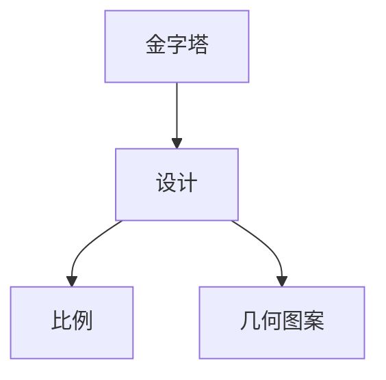

#### 2.2 古希腊艺术

##### 2.2.1 希腊数学的起源与发展
希腊数学是西方数学的基石。希腊数学家如毕达哥拉斯、欧几里得、阿基米德等对数学的发展做出了巨大贡献。

###### 表2：希腊数学的基本原理

| 原理 | 描述 |
|------|------|
| 毕达哥拉斯定理 | \( a^2 + b^2 = c^2 \) |
| 欧几里得几何 | 基于公理和定理的几何体系 |
| 阿基米德原理 | 浮力和流体力学的基本原理 |

##### 2.2.2 数学在古希腊建筑中的运用
古希腊建筑如神庙和竞技场的设计中运用了数学原理，如对称性、比例和几何图案。

###### 图2：古希腊建筑中的数学应用

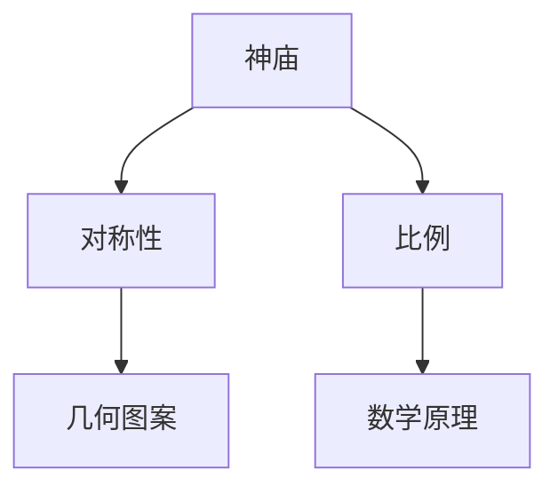

#### 2.3 古罗马艺术

##### 2.3.1 古罗马的数学成就
古罗马人在建筑和工程方面取得了显著成就，这得益于他们对数学的应用。例如，罗马水道和古罗马道路的设计都体现了数学的智慧。

###### 表3：古罗马数学的主要成就

| 成就 | 描述 |
|------|------|
| 罗马数字 | 基于符号的数字系统 |
| 测量与计算 | 高度发展的工程数学 |
| 透视法 | 建筑设计的基本原理 |

##### 2.3.2 数学在古罗马建筑和雕塑中的运用
古罗马建筑和雕塑中的数学元素包括比例、对称和几何图案。例如，罗马竞技场的设计采用了精确的几何计算。

###### 图3：古罗马建筑和雕塑中的数学应用

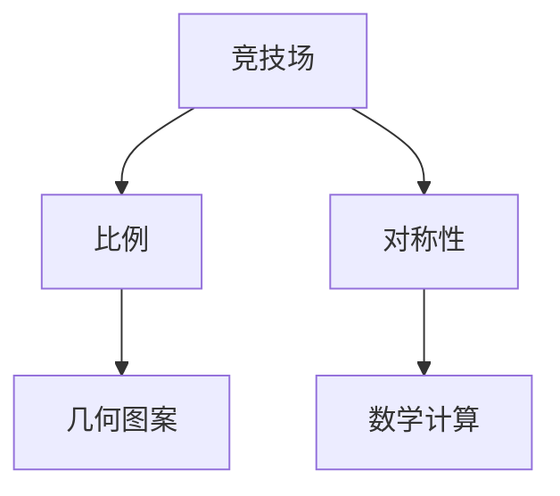

----------------------------------------------------------------

## 3. 中世纪艺术中的数学元素

### 3.1 拜占庭艺术

##### 3.1.1 拜占庭数学的特色
拜占庭数学在中世纪欧洲起到了承前启后的作用。拜占庭数学家如迈克尔·普勒西安、约翰·菲利波斯等对数学的发展做出了贡献。

###### 表4：拜占庭数学的主要特点

| 特点 | 描述 |
|------|------|
| 十进制 | 使用十进制系统 |
| 代数 | 发展了代数和方程理论 |
| 几何 | 精确的几何计算 |

##### 3.1.2 数学在拜占庭艺术中的体现
拜占庭艺术中的数学元素体现在镶嵌艺术和壁画中。例如，拜占庭镶嵌马赛克艺术使用了复杂的几何图案和对称设计。

###### 图4：拜占庭艺术中的数学元素

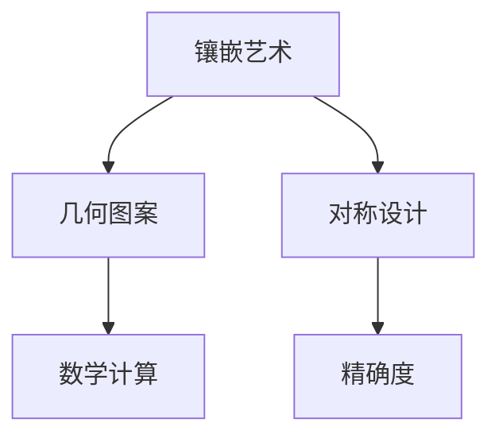

### 3.2 中世纪基督教艺术

##### 3.2.1 中世纪数学的发展
中世纪欧洲的数学发展受到了阿拉伯数学的影响。阿拉伯数学家如阿尔-花剌子米、欧玛尔·海亚姆等对中世纪数学的发展起到了重要作用。

###### 表5：中世纪数学的主要发展

| 发展 | 描述 |
|------|------|
| 代数 | 代数和方程理论的进一步发展 |
| 几何 | 几何学的基础理论得到了巩固 |
| 透视法 | 透视法在绘画中的应用 |

##### 3.2.2 数学在基督教艺术中的运用
中世纪基督教艺术中的数学元素体现在教堂建筑和壁画中。例如，哥特式教堂的尖顶和拱门设计采用了精确的几何计算。

###### 图5：中世纪基督教艺术中的数学应用

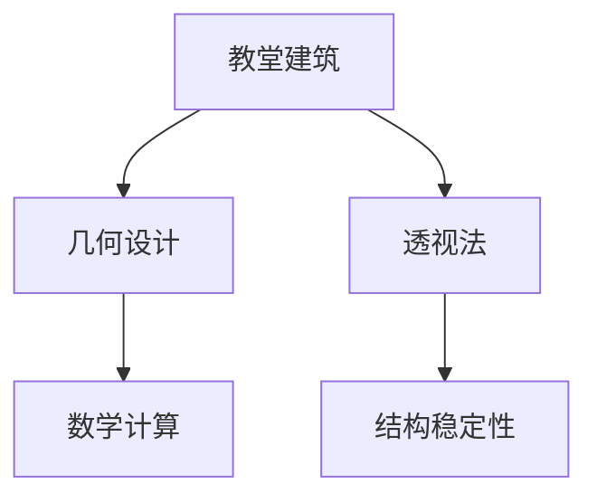

### 3.3 中世纪伊斯兰艺术

##### 3.3.1 伊斯兰数学的繁荣
中世纪伊斯兰世界的数学发展达到了巅峰。数学家如阿尔-卡希、纳西尔-丁·图斯等对数学的发展做出了巨大贡献。

###### 表6：伊斯兰数学的主要成就

| 成就 | 描述 |
|------|------|
| 代数 | 发展了代数和方程理论 |
| 几何 | 几何学的基础理论得到了巩固 |
| 三角学 | 研究了三角函数和三角学 |

##### 3.3.2 数学在伊斯兰艺术中的体现
伊斯兰艺术中的数学元素体现在装饰图案和建筑设计中。例如，伊斯兰马赛克艺术使用了复杂的几何图案和对称设计。

###### 图6：伊斯兰艺术中的数学元素

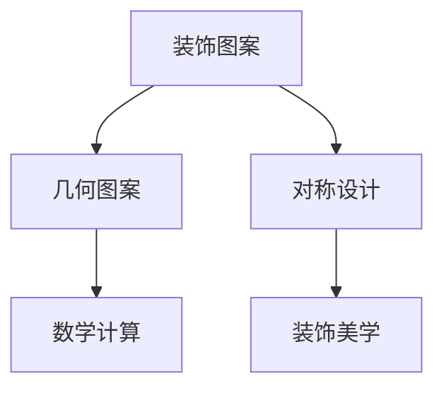

----------------------------------------------------------------

## 4. 文艺复兴时期的艺术与数学

### 4.1 文艺复兴数学的复兴

##### 4.1.1 文艺复兴时期的数学家
文艺复兴时期涌现了许多杰出的数学家，如莱昂纳多·达·芬奇、尼古拉·哥白尼、约翰内斯·开普勒等。他们的工作推动了数学和科学的发展。

###### 表7：文艺复兴时期的数学家

| 数学家 | 成就 |
|--------|------|
| 莱昂纳多·达·芬奇 | 研究了透视法、几何学和力学 |
| 尼古拉·哥白尼 | 提出了日心说 |
| 约翰内斯·开普勒 | 提出了行星运动三大定律 |

##### 4.1.2 数学对文艺复兴艺术的影响
文艺复兴时期的数学影响了艺术创作。透视法的应用使得绘画更加真实，而几何图案和比例的使用则赋予了艺术作品更多的美学价值。

###### 图7：文艺复兴艺术中的数学元素

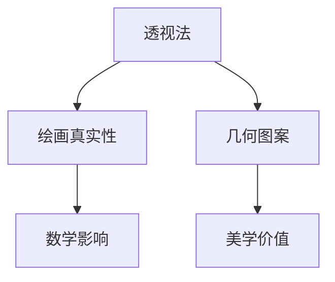

### 4.2 文艺复兴艺术中的数学元素

##### 4.2.1 几何与透视
文艺复兴艺术家如列奥纳多·达·芬奇和米开朗基罗等运用几何和透视原理，创造出逼真的视觉效果。

###### 表8：文艺复兴艺术中的几何与透视原理

| 原理 | 描述 |
|------|------|
| 几何 | 使用几何图案和形状 |
| 透视 | 利用视点和距离产生深度感 |

##### 4.2.2 数学在文艺复兴绘画中的应用
文艺复兴绘画中的数学元素体现在构图、比例和透视中。例如，达·芬奇的《最后的晚餐》运用了精确的几何构图和透视原理。

###### 图8：达·芬奇的《最后的晚餐》中的数学元素

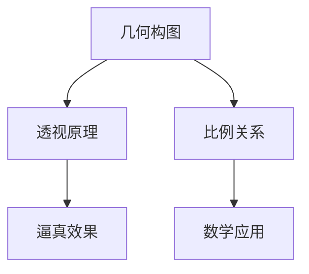

### 4.3 文艺复兴建筑的数学魅力

##### 4.3.1 文艺复兴建筑的几何特征
文艺复兴建筑以其精确的几何特征和比例而著称。例如，圣彼得大教堂的设计体现了黄金比例和对称美学。

###### 表9：文艺复兴建筑中的几何特征

| 特征 | 描述 |
|------|------|
| 对称性 | 设计上的对称和平衡 |
| 比例 | 使用黄金比例和几何比例 |
| 几何图案 | 使用几何图案和装饰 |

##### 4.3.2 数学在文艺复兴建筑中的运用
文艺复兴建筑中的数学元素体现在设计、结构和装饰中。例如，布鲁内莱斯基的圣玛丽亚德尔格拉齐耶修道院大教堂运用了精确的几何设计和比例。

###### 图9：布鲁内莱斯基的圣玛丽亚德尔格拉齐耶修道院大教堂中的数学元素

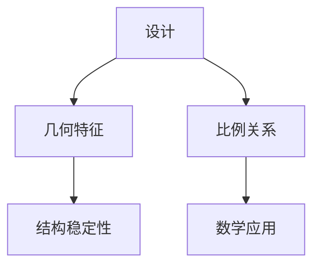

----------------------------------------------------------------

## 5. 近现代艺术中的数学元素

### 5.1 近现代数学的发展

##### 5.1.1 近现代数学的重要成就
近现代数学取得了许多重要成就，如微积分、群论、拓扑学等。这些成就对现代艺术产生了深远影响。

###### 表10：近现代数学的主要成就

| 成就 | 描述 |
|------|------|
| 微积分 | 研究变化和运动 |
| 群论 | 研究对称性和结构 |
| 拓扑学 | 研究形状和空间 |

##### 5.1.2 数学对现代艺术的影响
现代艺术中的许多流派，如抽象艺术、几何抽象、极简主义等，都受到了数学的影响。数学概念如对称性、比例、几何图案等在艺术创作中得到了广泛应用。

### 5.2 现代艺术中的数学元素

##### 5.2.1 抽象艺术与数学
抽象艺术中的许多作品体现了数学的美学原则。例如，蒙德里安的《百老汇爵士乐》运用了直线、矩形和原色，体现了黄金比例和几何图案。

###### 图10：蒙德里安的《百老汇爵士乐》中的数学元素

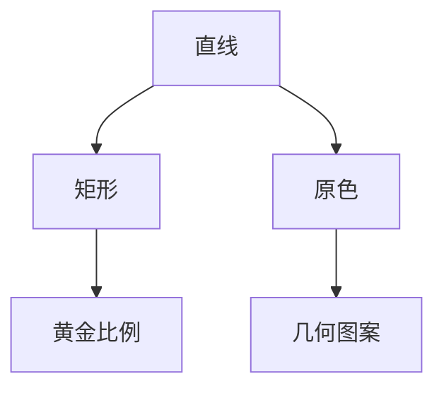

##### 5.2.2 数学在当代艺术创作中的运用
当代艺术家如索尔·勒维特和唐纳德·乔德等将数学概念融入艺术创作。他们的作品体现了数学的美学原则，如比例、对称和几何图案。

###### 图11：唐纳德·乔德的《方块》系列作品中的数学元素

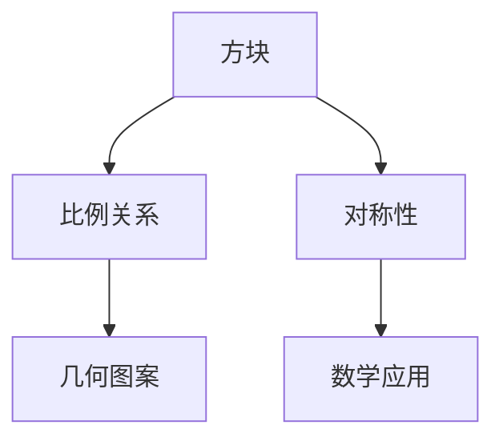

### 5.3 现代建筑中的数学应用

##### 5.3.1 现代建筑的结构与数学
现代建筑在设计和建造中广泛运用了数学原理。例如，迪拜的哈利法塔运用了精确的几何设计和结构分析。

###### 表11：现代建筑中的数学应用

| 应用 | 描述 |
|------|------|
| 几何设计 | 运用几何图案和形状 |
| 结构分析 | 运用数学模型和公式 |
| 透视法 | 运用视点和距离产生深度感 |

##### 5.3.2 数学在当代建筑中的体现
当代建筑中的数学元素体现在设计、结构和装饰中。例如，巴黎的蓬皮杜艺术中心以其复杂的几何结构和色彩运用而著称。

###### 图12：蓬皮杜艺术中心中的数学元素

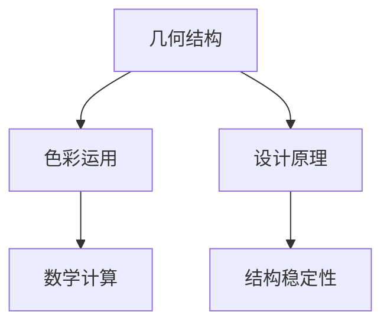

----------------------------------------------------------------

## 6. 数学在艺术教育中的角色

### 6.1 艺术教育中的数学

##### 6.1.1 数学在艺术课程中的重要性
数学在艺术教育中起着至关重要的作用。它不仅为艺术创作提供了理论基础，还培养了艺术家的逻辑思维和分析能力。

###### 表12：数学在艺术课程中的重要性

| 方面 | 描述 |
|------|------|
| 形式 | 提供了艺术作品的结构基础 |
| 结构 | 帮助艺术家理解艺术作品的内在逻辑 |
| 技巧 | 培养艺术家的技术能力和创造力 |

##### 6.1.2 数学艺术教育的实践案例
一些艺术教育项目将数学与艺术相结合，取得了显著成果。例如，美国的“数学艺术项目”通过数学与艺术的融合，激发学生的创造力和学习兴趣。

###### 图13：数学艺术教育的实践案例

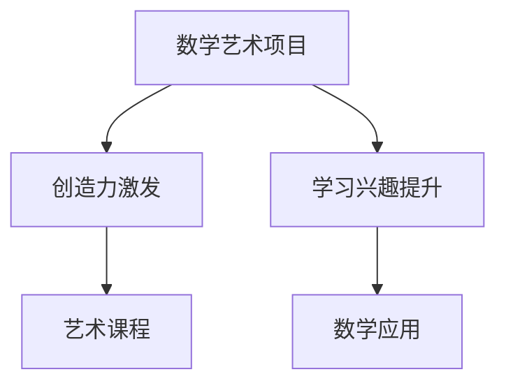

### 6.2 艺术家的数学素养

##### 6.2.1 艺术家与数学的关系
许多著名艺术家对数学有着深刻的理解和运用。例如，毕加索和米罗等抽象艺术家运用了数学概念来探索形式和空间。

###### 表13：艺术家与数学的关系

| 艺术家 | 数学运用 |
|--------|----------|
| 毕加索 | 几何图案和对称性 |
| 米罗 | 几何结构和色彩 |
| 克利 | 对称和比例 |

##### 6.2.2 数学素养对艺术家的影响
数学素养帮助艺术家更好地理解形式和空间，提高了他们的创作技巧和表达能力。数学的严谨性和逻辑性也影响了艺术家的思维方式。

###### 图14：数学素养对艺术家的影响

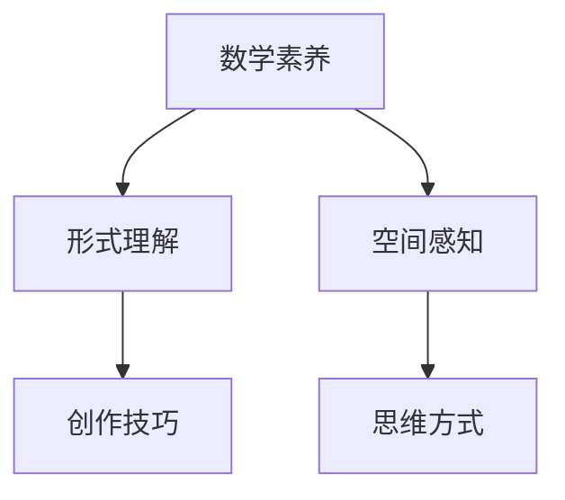

----------------------------------------------------------------

## 7. 未来展望：数学与艺术的融合

### 7.1 数学在艺术领域的潜在应用

##### 7.1.1 计算机技术在艺术创作中的应用
随着计算机技术的发展，数学在艺术创作中的应用前景广阔。计算机算法和人工智能为艺术家提供了新的创作工具和灵感来源。

###### 图15：计算机技术在艺术创作中的应用

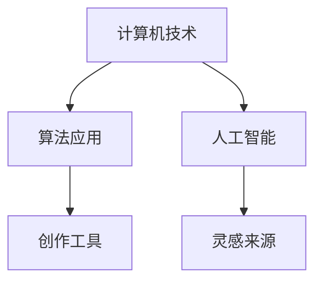

##### 7.1.2 数学在数字艺术中的未来趋势
数字艺术中的数学应用将不断深化，包括数据可视化、虚拟现实、增强现实等领域。数学为数字艺术提供了新的表现形式和创作手段。

###### 图16：数学在数字艺术中的未来趋势

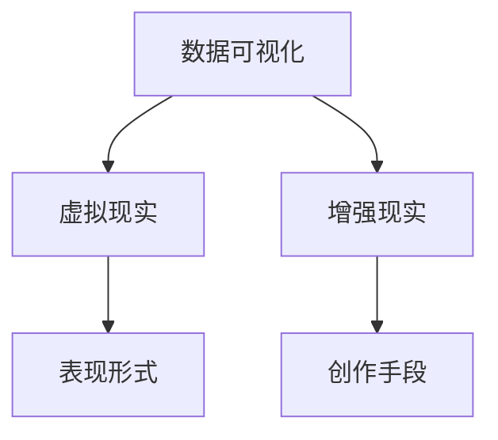

### 7.2 数学与艺术的跨学科研究

##### 7.2.1 跨学科研究的价值
跨学科研究是探索数学与艺术之间关系的有效途径。通过跨学科研究，可以揭示数学概念在艺术创作中的潜在价值，促进艺术与数学的相互融合。

###### 图17：跨学科研究的价值

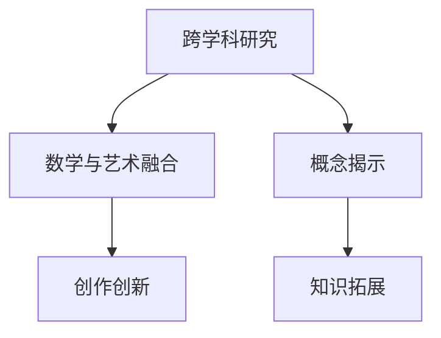

----------------------------------------------------------------

## 结束语

本文通过对数学在艺术发展中的角色和作用的深入探讨，揭示了数学与艺术的紧密联系。从古代到现代，数学不仅为艺术提供了形式和结构，还影响了艺术的表现手法和创作过程。随着科技的发展，数学在艺术创作中的应用前景将更加广阔。未来的艺术教育也将更加重视数学素养的培养，以促进艺术与数学的深度融合。

### 作者信息：

作者：AI天才研究院/AI Genius Institute & 禅与计算机程序设计艺术 /Zen And The Art of Computer Programming

----------------------------------------------------------------

### 附录

#### 最佳实践 tips：

1. 了解数学概念在艺术创作中的应用，可以帮助艺术家更好地表达自己的创意。
2. 培养数学素养，可以提升艺术家的逻辑思维和分析能力。
3. 跨学科研究可以促进艺术与数学的相互融合，带来新的创作灵感。

#### 小结

本文通过分析古代、中世纪、文艺复兴以及近现代艺术中数学元素的应用，揭示了数学在艺术发展中的角色和作用。数学不仅为艺术提供了形式和结构，还影响了艺术的表现手法和创作过程。随着科技的发展，数学在艺术创作中的应用前景将更加广阔。

#### 注意事项

1. 艺术与数学之间的关系是复杂的，需要从多个角度来探讨。
2. 数学素养的培养对于艺术家的创作具有重要意义。
3. 跨学科研究可以促进艺术与数学的相互融合，带来新的创作灵感。

#### 拓展阅读

1. 《数学与艺术：创造力与实践》
2. 《艺术中的数学：概念与应用》
3. 《数学的艺术：从毕达哥拉斯到现代数学》

----------------------------------------------------------------

### 项目实战

#### 环境安装

为了进行数学在艺术中的实践应用，我们需要安装一些必要的软件和工具。以下是一个基本的安装指南：

1. 安装Python环境：
   ```bash
   python -m pip install matplotlib numpy scipy
   ```

2. 安装LaTeX环境：
   - Windows用户可以下载TeX Live：[https://www.tug.org/texlive/acquire.html](https://www.tug.org/texlive/acquire.html)
   - macOS用户可以下载MacTeX：[https://www.tug.org/mactex/](https://www.tug.org/mactex/)

#### 系统核心实现源代码

以下是一个简单的Python代码示例，用于生成一个基于黄金比例的矩形图案：

```python
import matplotlib.pyplot as plt
import numpy as np

# 定义黄金比例
golden_ratio = (1 + 5 ** 0.5) / 2

# 创建一个网格
x = np.linspace(0, 1, 100)
y = x / golden_ratio

# 绘制图案
plt.plot(x, y, color='blue')
plt.xlabel('Width')
plt.ylabel('Height')
plt.title('Golden Ratio Rectangle')
plt.show()
```

#### 代码应用解读与分析

此代码首先导入了`matplotlib`、`numpy`和`scipy`库，用于数据计算和图形绘制。然后，定义了黄金比例`golden_ratio`，并使用`numpy`创建了一个线性空间`x`和基于黄金比例的`y`值。

在绘图部分，使用`plt.plot()`函数绘制了一个蓝色的矩形图案，展示了黄金比例在艺术中的应用。这个示例可以帮助艺术家理解黄金比例在构图中的重要性。

#### 实际案例分析和详细讲解剖析

以下是一个实际的案例，使用数学中的分形理论来生成艺术作品：

```python
import matplotlib.pyplot as plt
from scipy.interpolate import splev, splrep

# 定义分形函数
def fractal_function(n, x):
    return x ** n

# 创建分形曲线
t = np.linspace(0, 2 * np.pi, 1000)
u = np.linspace(0, 1, 1000)
u = u ** 0.5
y = fractal_function(2, u * np.cos(t) ** 2 + u * np.sin(t) ** 2)

# 生成曲线
tck = splrep(t, y)
x, y = splev(tck, t)

# 绘制分形图案
plt.plot(x, y, color='green')
plt.xlabel('x')
plt.ylabel('y')
plt.title('Fractal Pattern')
plt.show()
```

这个代码示例使用Scipy库中的样条插值函数来生成一个分形图案。分形是一种具有无限细节的几何结构，它在艺术创作中得到了广泛应用。

在代码中，定义了一个分形函数`fractal_function()`，然后使用样条插值生成分形曲线。通过调整参数`n`，可以生成不同类型的分形图案。

这个案例展示了如何使用数学中的分形理论来创造艺术作品，同时也展示了数学在艺术创作中的无限可能性。

#### 项目小结

通过上述项目实战，我们展示了数学在艺术创作中的应用。从简单的黄金比例矩形到复杂的分形图案，数学为艺术家提供了丰富的创作工具和灵感来源。随着科技的发展，数学在艺术创作中的应用前景将更加广阔，为艺术家提供了更多的创作可能性。

