                 


## 数学与艺术：寻找美的共同语言

### 关键词：
- 数学
- 艺术
- 美学
- 结构
- 模型
- 应用

### 摘要：
本文旨在探讨数学与艺术的深层联系，揭示两者在探讨美的过程中的共同语言。通过分析数学在艺术中的应用，我们试图找出美的数学模型，进而理解数学与艺术的交集。文章分为以下几个部分：

1. **背景介绍**：介绍数学与艺术的基本概念及其在美的探讨中的重要性。
2. **核心概念与联系**：阐述数学与艺术的核心概念，通过对比表格和实体关系图分析两者之间的关系。
3. **算法原理讲解**：深入讲解数学在艺术中的应用，包括几何学、色彩理论和音乐艺术。
4. **系统分析与架构设计方案**：介绍数学在艺术创作中的系统应用，包括数码艺术、建筑艺术和平面设计。
5. **项目实战**：通过一个实际案例，展示数学在艺术创作中的具体应用。
6. **最佳实践 tips**：总结最佳实践经验，并提供拓展阅读建议。

### 背景介绍

#### 数学与艺术的基本概念

数学是一门研究数量、结构、变化和空间等概念的精确科学。它不仅具有高度的抽象性，还包含了许多形式化的推理和证明方法。数学在人类文明中扮演着重要角色，从科学到工程，从经济学到计算机科学，无不涉及数学的应用。

艺术则是人类表达情感、思想和创造力的一种形式。它包括绘画、雕塑、音乐、舞蹈、文学等多种表现形式。艺术作品不仅是审美享受的来源，也是文化和历史的重要记录。

#### 数学在美的探讨中的重要性

在美的探讨中，数学扮演着至关重要的角色。美的本质是一个复杂且多维度的问题，但数学提供了许多工具和方法来研究和描述美。例如，数学中的对称性、比例和节奏等概念，都是艺术创作中的重要元素。

对称性是美的基本特征之一。在自然界和人类文化中，对称性无处不在。从蝴蝶的翅膀到人脸的轮廓，从古代建筑到现代艺术作品，对称性都是美学的重要元素。

比例是另一个关键概念。黄金分割比例（约等于0.618）在艺术和设计中被广泛认为是美的比例。许多经典的艺术作品，如达芬奇的《蒙娜丽莎》和帕台农神庙，都采用了黄金分割比例。

#### 艺术中的数学元素

艺术中的数学元素不仅限于对称性和比例。色彩理论中的颜色混合和对比，音乐中的节奏和和声，甚至是绘画中的透视和构图，都蕴含着深刻的数学原理。

例如，色彩理论中的三原色模型（红、绿、蓝）和三间色模型（黄、紫、绿）是基于光的波长和颜色的混合原理。音乐中的和弦和和声则是基于数学上的频率关系。

#### 数学与艺术融合的案例研究

历史上，许多艺术作品都体现了数学的美感。例如，帕台农神庙的设计就充分考虑了黄金分割比例，使其在视觉上显得和谐而美丽。达芬奇的《蒙娜丽莎》则运用了透视和对称性的技巧，使画面更具深度和立体感。

在现代，数学在艺术中的应用更加广泛。数码艺术中的算法生成艺术、建筑艺术中的结构设计，以及平面设计中的网格系统，都离不开数学的支持。

### 核心概念与联系

#### 数学与艺术的核心概念

数学的核心概念包括：数、形、空间、变化、关系等。艺术的核心概念包括：形式、色彩、质感、空间、时间等。

#### 概念属性特征对比表格

| 特征         | 数学                       | 艺术                       |
| ------------ | -------------------------- | -------------------------- |
| 精确性       | 基于严格的逻辑推理         | 具有主观性和多样性         |
| 抽象性       | 高度抽象，形式化           | 抽象与现实相结合           |
| 结构性       | 基于公理和定义             | 基于审美和创造力           |
| 可证明性     | 需要证明和验证             | 需要感知和体验             |

#### ER实体关系图架构

```mermaid
erDiagram
  Artwork ||--|{ Creator }|--|{ Art Movement }
  Artwork ||--|{ Subject Matter }|--|{ Artistic Style }
  Creator ||--|{ Artistic Movement }|--|{ Artwork }
  Subject Matter ||--|{ Artistic Style }|--|{ Artwork }
```

#### 数学的艺术表达

数学不仅可以用于描述艺术的形式和结构，还可以直接表达艺术的内涵。例如，数学家希尔伯特（David Hilbert）的《空间几何》就是一部纯粹的艺术作品，它运用了数学的抽象性和精确性，表达了对空间和几何形状的美学追求。

此外，数学还可以作为艺术创作的工具。许多艺术家使用数学公式和模型来创造独特的艺术形式。例如，莫比乌斯带（Möbius band）就是一个经典的数学概念，它被艺术家广泛运用，创造出许多独特的视觉效果。

### 算法原理讲解

#### 几何学在艺术中的应用

几何学是数学中的一个重要分支，它研究形状、大小、空间关系和变换等概念。在艺术中，几何学被广泛应用于绘画、雕塑和建筑等领域。

##### 绘画中的几何学

在绘画中，几何学被用于构图和透视。透视技巧可以帮助艺术家创造深度感和立体感。例如，荷兰画家伦勃朗（Rembrandt）就熟练运用了透视技巧，使他的画作充满了真实感和空间感。

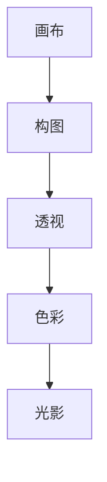

##### 雕塑中的几何学

雕塑中的几何学主要用于形状的创造和表现。著名的雕塑家罗丹（Rodin）就运用了复杂的几何形状，创造出许多充满动感和力量的雕塑作品。

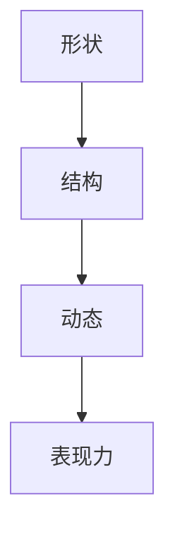

##### 建筑中的几何学

建筑中的几何学主要用于建筑结构的稳定性和美感。古埃及的金字塔、古希腊的帕台农神庙，以及现代的悉尼歌剧院，都是几何学的杰作。

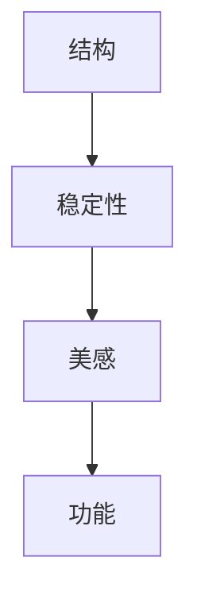

#### 色彩理论中的数学原理

色彩理论是艺术中的一个重要领域，它研究颜色的混合、对比和调和。色彩理论中的许多原理都可以用数学来解释。

##### 色彩混合

色彩混合包括加色混合和减色混合。在加色混合中，红、绿、蓝光按不同比例混合可以生成其他颜色。这实际上是光的波长混合。

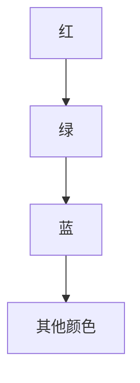

##### 色彩对比

色彩对比是指不同颜色在一起时产生的视觉效应。色彩对比的原理可以用色轮来解释。在色轮上，对立的颜色对比最强，例如红与绿、黄与紫等。

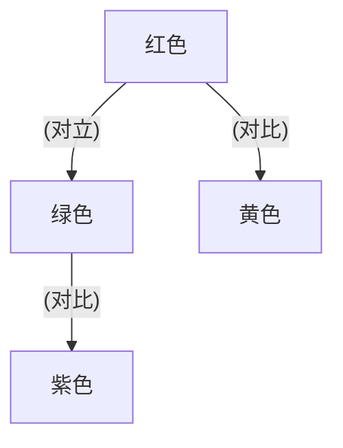

#### 音乐艺术中的数学结构

音乐艺术中的数学结构包括节奏、和声和旋律等。这些结构都可以用数学公式来描述。

##### 节奏

节奏是音乐的基本要素之一，它决定了音乐的快慢和强弱。节奏可以用数学中的频率和周期来描述。

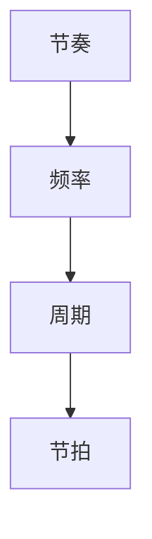

##### 和声

和声是音乐中的另一个重要元素，它通过不同音高的声音组合产生和谐的效果。和声的原理可以用数学中的频率关系来解释。

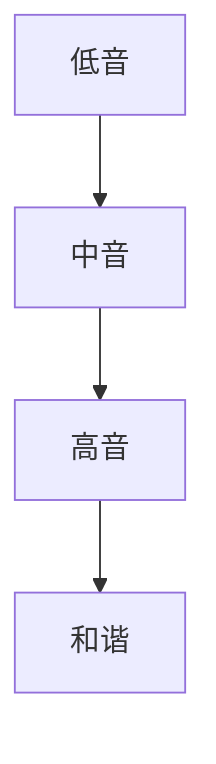

##### 旋律

旋律是音乐的灵魂，它通过音高的变化和节奏的安排来传达情感和故事。旋律的原理可以用数学中的函数和序列来描述。

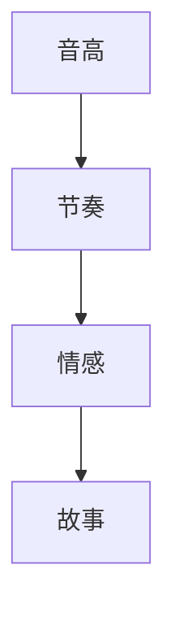

### 系统分析与架构设计方案

#### 数学在艺术创作中的应用

数学不仅是一门理论科学，还可以在实际的艺术创作中发挥作用。本节将介绍数学在数码艺术、建筑艺术和平面设计中的应用。

#### 数码艺术中的数学应用

数码艺术是一种利用数字技术创作的艺术形式，它广泛使用了数学中的算法和模型。

##### 算法生成艺术

算法生成艺术是指通过编写程序，使用数学算法来生成艺术作品。这种方法可以创造出独特的视觉效果，如图形、纹理和图像。

```python
import turtle

# 定义一个绘制正多边形的函数
def draw_polygon(sides, length):
    angle = 360 / sides
    for _ in range(sides):
        turtle.forward(length)
        turtle.right(angle)

# 绘制一个正五边形
draw_polygon(5, 100)
turtle.done()
```

##### 图像处理

图像处理是数码艺术中的一个重要领域，它利用数学中的图像处理算法来编辑和增强图像。例如，使用数学中的卷积操作来模糊或锐化图像。

```python
import cv2
import numpy as np

# 加载图像
image = cv2.imread('image.jpg')

# 创建一个卷积核
kernel = np.array([[0, -1, 0],
                   [-1, 5, -1],
                   [0, -1, 0]])

# 应用卷积操作
filtered_image = cv2.filter2D(image, -1, kernel)

# 显示结果
cv2.imshow('Filtered Image', filtered_image)
cv2.waitKey(0)
cv2.destroyAllWindows()
```

#### 建筑艺术中的数学应用

建筑艺术中的数学应用主要体现在结构设计和空间规划中。

##### 结构设计

建筑结构设计需要考虑材料的力学性能、结构的稳定性等因素。数学中的力学原理和结构分析方法是设计中的重要工具。

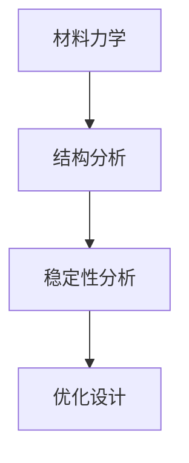

##### 空间规划

建筑空间规划需要考虑功能分区、流线组织和空间利用等因素。数学中的几何学和拓扑学可以用来分析和优化空间规划。

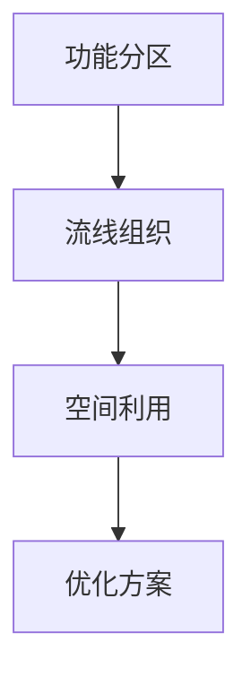

#### 平面设计中的数学应用

平面设计包括图形设计、排版设计和视觉传达等，数学在这些领域中也有广泛的应用。

##### 图形设计

图形设计中的几何学原理可以帮助设计师创造和谐的图形和图案。

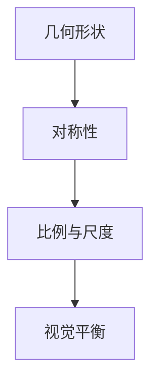

##### 排版设计

排版设计中的数学原理可以帮助设计师优化文本布局和版面设计。

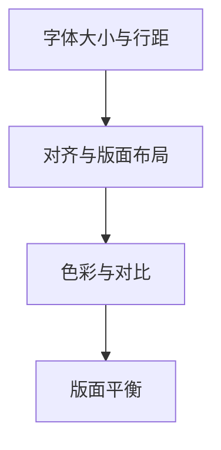

### 项目实战

#### 项目介绍

本节将通过一个实际案例，展示数学在艺术创作中的应用。该案例是一个基于Python的算法生成艺术项目，它利用数学中的随机漫步算法生成独特的艺术图案。

```python
import numpy as np
import matplotlib.pyplot as plt

# 设置随机漫步的步数和步长
steps = 1000
step_length = 0.1

# 初始化坐标
x, y = 0, 0

# 进行随机漫步
positions = []
for _ in range(steps):
    angle = np.random.uniform(0, 2 * np.pi)
    dx = step_length * np.cos(angle)
    dy = step_length * np.sin(angle)
    x += dx
    y += dy
    positions.append((x, y))

# 绘制随机漫步路径
plt.scatter(*zip(*positions), s=1, alpha=0.5)
plt.xlabel('X')
plt.ylabel('Y')
plt.title('Random Walk Art')
plt.show()
```

#### 系统核心实现源代码

```python
import numpy as np
import matplotlib.pyplot as plt

def generate_art(steps, step_length):
    x, y = 0, 0
    positions = []

    for _ in range(steps):
        angle = np.random.uniform(0, 2 * np.pi)
        dx = step_length * np.cos(angle)
        dy = step_length * np.sin(angle)
        x += dx
        y += dy
        positions.append((x, y))

    plt.scatter(*zip(*positions), s=1, alpha=0.5)
    plt.xlabel('X')
    plt.ylabel('Y')
    plt.title('Random Walk Art')
    plt.show()

# 生成艺术图案
generate_art(1000, 0.1)
```

#### 代码应用解读与分析

该代码实现了一个简单的随机漫步算法，用于生成艺术图案。随机漫步算法是一种常用的生成算法，它在每个步骤中随机选择一个方向和步长，然后根据这个方向和步长更新当前的位置。

在代码中，`generate_art` 函数用于实现随机漫步算法。它首先初始化坐标 `(x, y)` 为 `(0, 0)`，然后在一个循环中依次进行随机漫步。在每次循环中，随机生成一个角度 `angle`，并根据这个角度计算新的 `dx` 和 `dy`，然后将新的位置 `(x + dx, y + dy)` 添加到 `positions` 列表中。

最后，使用 `matplotlib.pyplot` 库绘制随机漫步路径。通过设置 `s=1, alpha=0.5`，使得每个点的大小为1，透明度为0.5，这样可以更好地展示随机漫步的路径。

#### 实际案例分析和详细讲解剖析

在这个案例中，随机漫步算法被用于生成艺术图案。这种算法的简单性使其成为一种有趣的生成方法，它可以根据随机性产生出独特且美观的艺术作品。

首先，我们可以看到代码中的几个关键参数：`steps` 和 `step_length`。`steps` 表示随机漫步的步数，它决定了生成的图案的精细程度。步数越多，图案的细节越丰富。`step_length` 表示每步的长度，它决定了图案的大小。步长越大，图案的范围越广。

在实际案例中，我们使用了 `steps=1000` 和 `step_length=0.1` 的参数。这意味着随机漫步进行了1000步，每步的长度为0.1。这个参数设置可以生成一个相对复杂的图案，同时也保持了较好的清晰度。

在绘制图案时，我们使用了 `scatter` 函数来绘制点。这个函数可以绘制一组点，其中 `s` 参数表示点的大小，`alpha` 参数表示点的透明度。在这里，我们设置 `s=1` 和 `alpha=0.5`，这样可以生成一个既清晰又具有层次感的图案。

通过这个案例，我们可以看到数学在艺术创作中的应用。随机漫步算法虽然简单，但它可以根据随机性生成出独特的图案。这种图案具有自然美感，同时也可以作为艺术作品展示。

#### 项目小结

通过本案例，我们展示了数学在艺术创作中的应用。随机漫步算法是一种简单的数学算法，但通过适当的参数设置和图形绘制，它可以生成出复杂且美观的艺术图案。这个案例不仅展示了数学在艺术创作中的潜力，也为我们提供了一种新的艺术创作方法。

在未来的艺术创作中，我们可以尝试使用更多的数学算法，如分形、神经网络等，来生成更复杂和独特的艺术作品。同时，我们也可以将数学与艺术相结合，探索更多的美学可能性。

### 最佳实践 tips

#### 1. 数学与艺术的结合

在艺术创作中，结合数学原理可以创造出更具美感和创新性的作品。以下是一些建议：

- 利用黄金分割比例来设计作品的结构。
- 使用数学公式来生成艺术图案，如分形图案。
- 探索几何学在绘画和雕塑中的应用。

#### 2. 艺术作品的数学分析

对艺术作品进行数学分析可以帮助我们更好地理解作品的美学特点。以下是一些建议：

- 分析作品的色彩搭配和对比，使用色彩理论进行解释。
- 研究作品的构图和比例，运用几何学原理进行解释。
- 分析作品的节奏和韵律，使用音乐理论进行解释。

#### 3. 跨学科研究

数学与艺术的结合是一个跨学科的研究领域。以下是一些建议：

- 参加跨学科研讨会，与其他领域的专家交流。
- 阅读跨学科的研究文献，了解最新的研究动态。
- 在艺术创作中尝试新的数学工具和方法。

### 小结

通过本文的探讨，我们发现数学与艺术在探讨美的过程中有着深厚的联系。数学提供了许多工具和方法来描述和创造美，而艺术则通过形式和结构展现了数学的美感。通过结合数学与艺术，我们可以创造出更丰富、更有深度的艺术作品。

### 注意事项

在应用数学与艺术时，需要注意以下几点：

- 不要过分追求数学的精确性，而忽略了艺术的创造性。
- 在分析艺术作品时，要尊重艺术家的创作意图和风格。
- 在使用数学模型时，要确保模型与实际情况相符。

### 拓展阅读

- 《数学的艺术》（The Mathematical Experience）by Philip J. Davis 和 Reuben Hersh
- 《艺术与数学的交织》（Art and Mathematics）by Daud Sutton
- 《数学与艺术：跨学科的探索》（Mathematics and Art: An Aesthetic Union）by Steven G. Krantz

### 作者信息

作者：AI天才研究院/AI Genius Institute & 禅与计算机程序设计艺术 /Zen And The Art of Computer Programming

