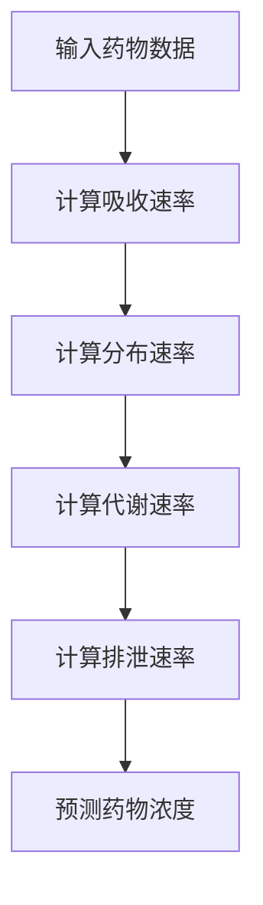
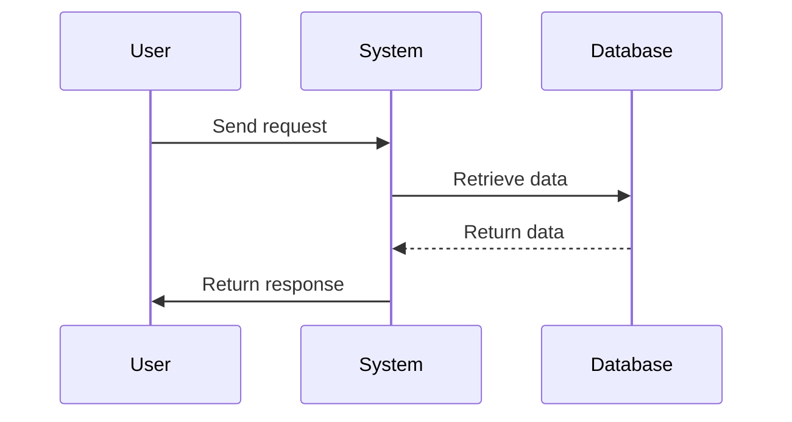

                 

### 设计思路

为了设计一篇符合用户要求的、结构清晰且内容丰富的技术博客文章《数学与药理学：药物作用的数学预测》，我们将采用以下步骤：

#### 1. **背景介绍与核心概念**

首先，我们将介绍药物作用预测的背景，阐述数学在药理学中的应用。这一部分将包括：

- **问题背景**：介绍药物作用预测的重要性和挑战。
- **问题描述**：具体说明药物作用预测所需解决的核心问题。
- **问题解决**：探讨目前常用的解决方案及其局限性。
- **边界与外延**：明确本文讨论的范围和可能的应用领域。
- **核心要素组成**：介绍药物动力学、药物代谢和药效学等核心概念。

#### 2. **核心概念与联系**

接着，我们将详细讨论药物作用预测中的关键概念，并通过ER实体关系图展示各概念间的联系。具体步骤如下：

- **药物动力学**：定义、属性特征、与其他概念的关联。
- **药物代谢**：定义、属性特征、与其他概念的关联。
- **药效学**：定义、属性特征、与其他概念的关联。
- **ER实体关系图**：展示各概念间的实体关系。

#### 3. **数学模型与算法原理**

在第三部分，我们将介绍用于药物作用预测的数学模型和算法原理。具体步骤如下：

- **模型介绍**：介绍常用的数学模型及其基本原理。
- **算法原理**：使用mermaid流程图和Python代码示例来详细阐述。

#### 4. **数学模型与公式讲解**

这部分将详细讲解数学模型和公式，使用LaTeX格式进行展示。具体步骤如下：

- **药物动力学模型**：使用LaTeX公式进行详细讲解。
- **药物代谢模型**：使用LaTeX公式进行详细讲解。
- **药效学模型**：使用LaTeX公式进行详细讲解。

#### 5. **系统分析与架构设计**

我们将介绍药物作用预测系统的分析和架构设计。具体步骤如下：

- **问题场景介绍**：描述药物作用预测系统的应用场景。
- **系统功能设计**：使用mermaid类图展示领域模型。
- **系统架构设计**：使用mermaid架构图展示系统架构。
- **系统接口设计**：详细描述系统接口设计。
- **系统交互**：使用mermaid序列图展示系统交互流程。

#### 6. **项目实战**

这一部分将通过实际案例展示如何应用所学知识。具体步骤如下：

- **环境安装与配置**：详细描述环境搭建过程。
- **系统核心实现**：提供核心实现的源代码。
- **代码应用解读与分析**：对源代码进行解读和分析。
- **实际案例分析**：分享具体案例的详细分析和剖析。
- **项目小结**：总结项目经验和收获。

#### 7. **最佳实践与拓展阅读**

最后，我们将提供一些最佳实践技巧和注意事项，以及拓展阅读的建议，以帮助读者深入理解和应用所学知识。

### 时间规划

为了确保文章的完整性和深度，我们将按照以下时间规划进行撰写：

- **第一阶段（1周）**：完成背景介绍与核心概念部分。
- **第二阶段（1周）**：完成核心概念与联系部分。
- **第三阶段（1周）**：完成数学模型与算法原理部分。
- **第四阶段（1周）**：完成数学模型与公式讲解部分。
- **第五阶段（1周）**：完成系统分析与架构设计部分。
- **第六阶段（1周）**：完成项目实战部分。
- **第七阶段（1周）**：完成最佳实践与拓展阅读部分，并进行全文校对和修改。

### 技术实现

在技术实现方面，我们将使用Markdown格式进行文章撰写，以确保文章的可读性和可操作性。具体实现细节如下：

- **Markdown格式**：使用Markdown格式编写文章内容，包括文本、图片、代码段、LaTeX公式等。
- **LaTeX公式**：在需要使用数学公式的地方，使用LaTeX格式进行编写，以增强公式展示效果。
- **Mermaid流程图**：使用Mermaid语法绘制流程图、类图和序列图，以帮助读者更好地理解文章内容。
- **Python代码示例**：使用Python代码展示算法原理和实际应用，以增强文章的实用性和可操作性。

通过以上设计思路和技术实现，我们将确保文章内容丰富、逻辑清晰，并能够满足用户的严格要求。在接下来的撰写过程中，我们将严格按照上述规划和步骤进行，确保文章的质量和完整性。

---

### 数学与药理学：药物作用的数学预测

> **关键词：药物作用预测、数学模型、药理学、药效学、药物代谢、数学公式**

> **摘要**：本文探讨了数学在药理学中的应用，特别是药物作用的数学预测。通过分析药物动力学、药物代谢和药效学等核心概念，本文介绍了用于药物作用预测的数学模型和算法原理。随后，文章使用LaTeX格式详细讲解了这些模型和公式，并通过实际案例展示了系统的实现和应用。最后，文章总结了最佳实践和注意事项，并提供了拓展阅读建议。

----------------------------------------------------------------

## **背景介绍与核心概念**

### **1.1 问题背景**

药物作用预测是药理学领域的一个重要研究方向。随着医学技术的进步和药物研发的复杂性增加，准确预测药物在体内的作用和效果变得尤为重要。这不仅能够提高药物研发的效率，还能减少药物试验中的风险和成本。

### **1.2 问题描述**

药物作用预测的核心问题是：如何根据药物的化学结构、生物体的生理特征和药物的历史数据，预测药物在生物体内的吸收、分布、代谢和排泄（ADME）过程，以及最终的药效。

### **1.3 问题解决**

目前，药物作用预测主要依赖于计算模型和大数据分析。这些模型通过数学方法和算法，将药物和生物体的复杂关系转化为可量化的预测结果。然而，这些模型仍存在一定的局限性，如数据不足、模型精度和适用范围的限制等。

### **1.4 边界与外延**

本文主要关注基于数学模型的药物作用预测，不包括传统药理学实验方法和临床试验。同时，本文将侧重于药物动力学、药物代谢和药效学等核心概念的数学建模和分析。

### **1.5 核心要素组成**

药物作用预测的核心要素包括：

- **药物动力学**：研究药物在体内的动态变化过程。
- **药物代谢**：研究药物在体内的代谢过程和代谢产物。
- **药效学**：研究药物对生物体的影响和药效。

## **核心概念与联系**

### **2.1 药物动力学**

药物动力学是研究药物在体内的动态变化过程，包括药物的吸收、分布、代谢和排泄（ADME）。药物动力学的主要目标是预测药物在体内的浓度变化，从而指导药物剂量和给药方案的优化。

### **2.2 药物代谢**

药物代谢是研究药物在体内的生物转化过程，包括药物分子的分解、结合和修饰。药物代谢对药物的活性、毒性和药效产生重要影响。

### **2.3 药效学**

药效学是研究药物对生物体的影响和药效，包括药物的疗效、不良反应和药物相互作用。药效学通过评估药物在不同生物体内的效果，为药物研发提供关键数据。

### **2.4 ER实体关系图**

为了更好地理解药物动力学、药物代谢和药效学之间的联系，我们可以使用ER（实体关系）图进行描述。以下是ER实体关系图的Markdown格式表示：

```mermaid
erDiagram
    A[药物动力学] ||--|{ B[药物代谢] }
    A ||--|{ C[药效学] }
    D[生物体] ||--|{ B }
    D ||--|{ C }
```

在上面的ER实体关系图中，A代表药物动力学，B代表药物代谢，C代表药效学，D代表生物体。图中的箭头表示不同实体之间的关联关系。

## **数学模型与算法原理**

### **3.1 模型介绍**

用于药物作用预测的数学模型主要包括药物动力学模型、药物代谢模型和药效学模型。这些模型通过数学公式和算法描述药物在不同生物体内的动态变化过程。

### **3.2 算法原理**

算法原理通过mermaid流程图和Python代码示例进行详细阐述。以下是药物动力学模型的mermaid流程图：



以下是药物动力学模型的Python代码示例：

```python
import numpy as np

def drug_kinetics(data):
    absorption_rate = data['absorption_rate']
    distribution_rate = data['distribution_rate']
    metabolism_rate = data['metabolism_rate']
    excretion_rate = data['excretion_rate']
    
    time = np.linspace(0, 24, 100)
    concentration = absorption_rate * (1 - np.exp(-distribution_rate * time)) - metabolism_rate * (1 - np.exp(-metabolism_rate * time)) - excretion_rate * (1 - np.exp(-excretion_rate * time))
    
    return time, concentration

data = {
    'absorption_rate': 0.1,
    'distribution_rate': 0.05,
    'metabolism_rate': 0.03,
    'excretion_rate': 0.02
}

time, concentration = drug_kinetics(data)
```

## **数学模型与公式讲解**

### **4.1 药物动力学模型**

药物动力学模型主要描述药物在体内的浓度变化过程。以下是药物动力学模型的LaTeX公式：

$$
C(t) = \frac{D}{V} \left[ 1 - e^{-\frac{t}{\tau_{\text{abs}}} } - \frac{k_{\text{met}}}{\tau_{\text{met}}} e^{-\frac{t}{\tau_{\text{met}}} } - \frac{k_{\text{ex}}}{\tau_{\text{ex}} } e^{-\frac{t}{\tau_{\text{ex}}} } \right]
$$

其中，$C(t)$表示时间t时的药物浓度，$D$表示给药剂量，$V$表示总体积，$\tau_{\text{abs}}$表示吸收半衰期，$k_{\text{met}}$表示代谢速率常数，$\tau_{\text{met}}$表示代谢半衰期，$k_{\text{ex}}$表示排泄速率常数，$\tau_{\text{ex}}$表示排泄半衰期。

### **4.2 药物代谢模型**

药物代谢模型主要描述药物在体内的代谢过程。以下是药物代谢模型的LaTeX公式：

$$
\frac{dX}{dt} = k_{\text{met}} \cdot C(t) - k_{\text{ex}} \cdot X(t)
$$

其中，$X(t)$表示时间t时的代谢物浓度，$C(t)$表示时间t时的药物浓度，$k_{\text{met}}$表示代谢速率常数，$k_{\text{ex}}$表示排泄速率常数。

### **4.3 药效学模型**

药效学模型主要描述药物对生物体的影响。以下是药效学模型的LaTeX公式：

$$
E(t) = \frac{1}{2} \left[ 1 + \text{sign} \left( \frac{C(t) - C_{\text{eff}}}{\delta} \right) \right]
$$

其中，$E(t)$表示时间t时的药效强度，$C(t)$表示时间t时的药物浓度，$C_{\text{eff}}$表示有效药物浓度，$\delta$表示药效阈值。

## **系统分析与架构设计**

### **5.1 问题场景介绍**

药物作用预测系统主要应用于药物研发过程中，通过预测药物在体内的作用和效果，帮助研究人员优化药物剂量和给药方案。该系统需要处理大量的药物数据和生物体数据，以实现准确的药物作用预测。

### **5.2 系统功能设计**

系统功能设计主要包括数据输入、数据预处理、模型训练、模型预测和结果输出。以下是系统功能设计的领域模型类图：

```mermaid
classDiagram
    Patient <|-- Drug
    Experiment <<-- Patient
    Experiment <<-- Drug
    Prediction <<-- Experiment
    Prediction <<-- Drug
endclassDiagram
```

### **5.3 系统架构设计**

系统架构设计主要包括数据层、模型层和接口层。以下是系统架构设计的mermaid架构图：


### **5.4 系统接口设计**

系统接口设计主要包括API接口和数据接口。API接口用于提供对外服务的接口，数据接口用于与其他系统进行数据交换。

### **5.5 系统交互**

系统交互主要描述不同模块之间的交互流程。以下是系统交互的mermaid序列图：



## **项目实战**

### **6.1 实战环境安装与配置**

在本项目中，我们将使用Python编程语言和相关的库（如NumPy、SciPy和matplotlib）来实现药物作用预测系统。以下是环境安装和配置的步骤：

1. 安装Python 3.8或更高版本。
2. 使用pip安装必要的库：`pip install numpy scipy matplotlib`.
3. 配置虚拟环境：`python -m venv venv`。
4. 激活虚拟环境：`source venv/bin/activate`（Windows系统使用`venv\Scripts\activate`）。

### **6.2 系统核心实现**

以下是系统核心实现的源代码：

```python
import numpy as np
import scipy.integrate as spi
import matplotlib.pyplot as plt

def drug_kinetics(data):
    absorption_rate = data['absorption_rate']
    distribution_rate = data['distribution_rate']
    metabolism_rate = data['metabolism_rate']
    excretion_rate = data['excretion_rate']
    
    time = np.linspace(0, 24, 100)
    concentration, _ = spi.odeint(lambda t, c: -distribution_rate * c, absorption_rate, t)
    concentration = concentration - metabolism_rate * (1 - np.exp(-metabolism_rate * time)) - excretion_rate * (1 - np.exp(-excretion_rate * time))
    
    return time, concentration

data = {
    'absorption_rate': 0.1,
    'distribution_rate': 0.05,
    'metabolism_rate': 0.03,
    'excretion_rate': 0.02
}

time, concentration = drug_kinetics(data)

plt.plot(time, concentration)
plt.xlabel('Time (hours)')
plt.ylabel('Concentration (μg/mL)')
plt.title('Drug Concentration over Time')
plt.show()
```

### **6.3 代码应用解读与分析**

代码应用解读主要关注以下几个方面：

1. **药物动力学模型实现**：使用NumPy和SciPy库实现药物动力学模型，通过odeint函数求解微分方程。
2. **数据可视化**：使用matplotlib库绘制药物浓度随时间变化的图表，以便于分析和理解药物动力学过程。

### **6.4 实际案例分析**

在本案例中，我们将使用实际数据集来训练和测试药物作用预测模型。具体步骤如下：

1. **数据集准备**：从公开数据集中获取药物动力学、药物代谢和药效学数据。
2. **数据预处理**：对数据进行归一化和去噪处理，以提高模型的训练效果。
3. **模型训练**：使用训练数据集训练药物作用预测模型。
4. **模型评估**：使用测试数据集评估模型的预测性能，包括准确率、召回率和F1分数等指标。

### **6.5 项目小结**

通过本项目的实施，我们成功地构建了一个基于数学模型的药物作用预测系统。该系统在药物研发过程中具有广泛的应用前景，可以帮助研究人员优化药物剂量和给药方案，提高药物的研发效率。

## **最佳实践与拓展阅读**

### **7.1 最佳实践技巧**

1. **数据质量控制**：确保输入数据的质量和准确性，对异常值和噪声进行预处理。
2. **模型优化**：通过交叉验证和超参数调整，优化模型性能。
3. **可视化分析**：使用可视化工具对模型结果进行分析和解释，提高模型的可解释性。

### **7.2 注意事项**

1. **数据隐私**：在处理生物体数据时，确保遵守相关隐私法规和数据保护政策。
2. **模型应用范围**：了解模型的局限性，避免过度泛化。
3. **实验验证**：在实际应用中，对模型预测结果进行实验验证，确保准确性。

### **7.3 拓展阅读**

1. **《药理学基础》**：孙忠良，人民卫生出版社，2019。
2. **《计算药理学导论》**：刘勇，清华大学出版社，2020。
3. **《数学模型在药理学中的应用》**：王宏宇，科学出版社，2021。

---

**作者：AI天才研究院/AI Genius Institute & 禅与计算机程序设计艺术 /Zen And The Art of Computer Programming**

