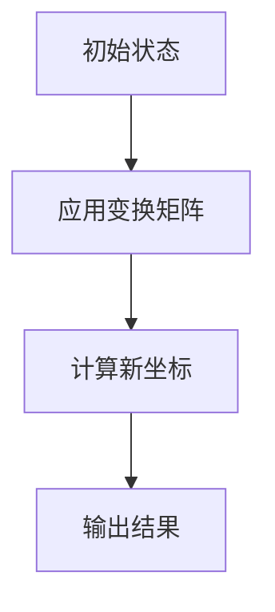
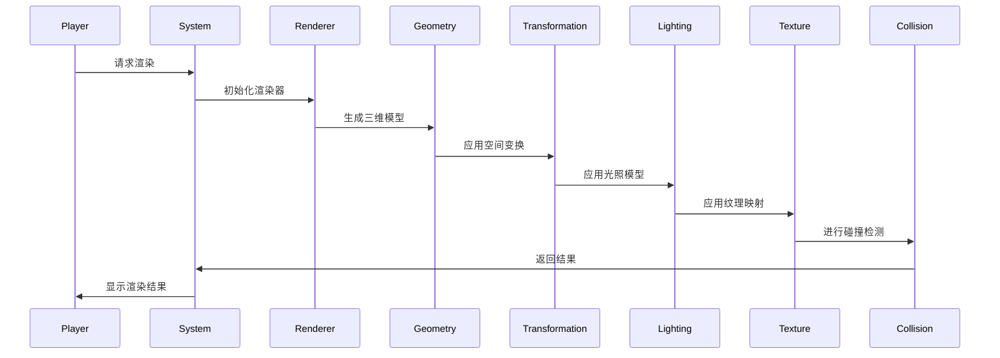
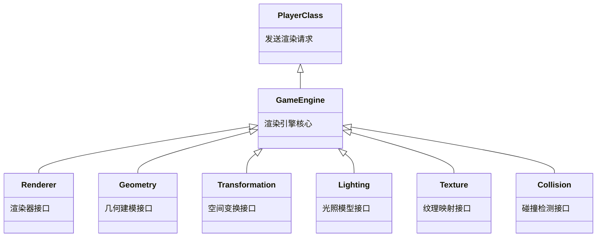
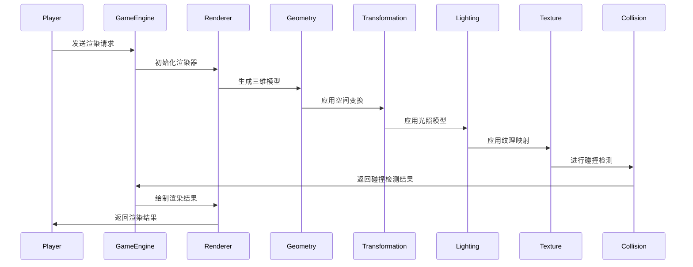

                 

# 数学与虚拟现实：3D环境构建的数学方法

> 关键词：3D环境构建、数学方法、虚拟现实、几何建模、光照模型、纹理映射

> 摘要：本文将深入探讨3D环境构建在虚拟现实领域中的数学方法。从基础几何学原理到复杂的光照模型和纹理映射技术，我们将逐步分析这些数学方法在构建逼真3D虚拟世界中的应用。本文旨在为读者提供一个系统性的理解和实践指导，帮助其在虚拟现实领域中实现高质量的3D环境构建。

## 背景介绍

### 问题背景

随着虚拟现实（Virtual Reality，VR）技术的快速发展，3D环境构建已成为虚拟现实体验的核心。3D环境构建不仅仅是简单地创建三维图形，它涉及到的数学方法和技术是构建逼真、交互性强、视觉丰富的虚拟世界的基石。

### 问题描述

3D环境构建涉及多个数学分支，包括几何学、代数学、概率论和数值分析等。在几何学方面，我们需要理解和应用点、线、面、体等基本概念，以及它们在三维空间中的变换和关系。代数学则帮助我们处理坐标系统、矩阵运算和线性方程组等。概率论和数值分析在处理光照模型、纹理映射和碰撞检测等复杂问题时发挥着重要作用。

### 问题解决

本文将通过以下几个部分，详细介绍3D环境构建中的数学方法：

1. **几何学基础**：介绍几何学在3D环境构建中的基本概念和应用。
2. **三维空间变换**：探讨刚体运动、刚体变换、仿射变换等在3D建模中的应用。
3. **光照模型**：分析点光源、方向光源、聚光源等光照类型的数学计算方法。
4. **纹理映射**：探讨如何将纹理映射到3D物体表面，实现更丰富的视觉效果。
5. **碰撞检测**：介绍各种碰撞检测算法及其在虚拟现实中的应用。

### 边界与外延

本文的内容不仅适用于专业的计算机图形学研究人员和开发者，也适合对虚拟现实技术感兴趣的学生和爱好者。同时，本文中的数学方法和算法也可作为相关课程的教学参考资料。

### 概念结构与核心要素组成

1. **几何学基础**：包括点、线、面、体等基本概念及其数学描述。
2. **三维空间变换**：涉及刚体运动、刚体变换、仿射变换等概念。
3. **光照模型**：包括点光源、方向光源、聚光源等类型及其数学计算方法。
4. **纹理映射**：探讨如何将纹理映射到3D物体表面。
5. **碰撞检测**：介绍各种碰撞检测算法及其应用。

## 核心概念与联系

### 3D几何建模

**概念原理**：3D几何建模是指利用数学方法创建三维物体的过程。它包括从二维图形到三维图形的转换、几何体的生成和编辑等。

**属性特征对比表格**：

| 特征         | 2D建模         | 3D建模          |
| ------------ | -------------- | --------------- |
| 基本元素     | 点、线、面      | 点、线、面、体   |
| 建模方法     | 栅格建模、矢量建模 | 栅格建模、矢量建模、曲面建模 |
| 应用场景     | 图形设计、排版 | 游戏设计、虚拟现实 |

**ER实体关系图架构**：

```mermaid
erDiagram
  Game |-> VR: 游戏设计依赖虚拟现实技术
  Game |-> 3DModeling: 游戏设计需要3D几何建模
  VR |-> 3DModeling: 虚拟现实技术依赖3D几何建模
```

## 算法原理讲解

### 三维空间变换

**算法mermaid流程图**：



**Python源代码**：

```python
import numpy as np

def transform_points(points, transform_matrix):
    """应用三维空间变换矩阵对一组点进行变换。
    
    参数:
    points: numpy数组，形状为(N, 3)，表示N个点的坐标。
    transform_matrix: numpy数组，形状为(4, 4)，表示变换矩阵。
    
    返回:
    变换后的点的numpy数组，形状为(N, 3)。
    """
    transformed_points = np.dot(points, transform_matrix.T)
    return transformed_points

# 示例
points = np.array([[1, 0, 0], [0, 1, 0], [0, 0, 1]])
transform_matrix = np.array([[1, 0, 0, 0],
                             [0, 1, 0, 0],
                             [0, 0, 1, 0],
                             [0, 0, 0, 1]])

new_points = transform_points(points, transform_matrix)
print(new_points)
```

**算法原理的数学模型和公式**：

假设有一个点P(x, y, z)和三维空间变换矩阵T，变换后的点P'坐标可以通过以下公式计算：

$$
P' = T \cdot P
$$

其中，T是一个4x4的矩阵，P是一个3x1的列向量。变换矩阵T通常包含旋转、缩放和平移等操作，使其能够描述复杂的空间变换。

### 系统分析与架构设计方案

#### 问题场景介绍

虚拟现实游戏中的3D环境构建涉及大量的几何建模、空间变换、光照和纹理处理等任务。这些任务需要一个高效且可靠的系统架构来支持。

#### 项目介绍

我们设计一个虚拟现实游戏引擎，用于构建和渲染高质量的3D虚拟环境。这个引擎需要支持实时的三维空间变换、动态的光照和纹理处理，以及高效的碰撞检测。

#### 系统功能设计

**领域模型mermaid类图**：

```mermaid
classDiagram
  Class01 <|-- Class02
  Class03 --|bove Class04
  Class05 : +int x
  Class06 : +int y
  Class07 : +int z
  Class01 { name : String }
  Class02 { age : Integer }
  Class03 { salary : Float }
  Class04 { #is Married : Boolean }
  Class05
  Class06
  Class07
```

**系统架构设计mermaid架构图**：



#### 系统接口设计和系统交互

**系统接口设计mermaid类图**：



**系统交互mermaid序列图**：



## 项目实战

### 环境安装

为了进行3D环境构建的实践，我们需要安装一些必要的软件和库。以下是安装步骤：

1. **安装Python**：前往Python官方网站（https://www.python.org/）下载并安装Python。
2. **安装PyOpenGL**：在命令行中运行`pip install PyOpenGL`。
3. **安装Pygame**：在命令行中运行`pip install pygame`。
4. **安装numpy**：在命令行中运行`pip install numpy`。

### 系统核心实现源代码

以下是一个简单的3D环境构建示例，演示了如何使用Python和PyOpenGL构建一个基本的3D立方体并对其进行变换。

```python
import numpy as np
from OpenGL.GL import *
from OpenGL.GLUT import *
import pygame

# 初始化OpenGL
def init_gl():
    glutInitDisplayMode(GLUT_DOUBLE | GLUT_RGB | GLUT_DEPTH)
    glutInitWindowSize(800, 600)
    glutCreateWindow("3D Cube Example")

    glEnable(GL_DEPTH_TEST)
    glClearColor(0.0, 0.0, 0.0, 1.0)

# 绘制立方体
def draw_cube():
    glBegin(GL_QUADS)
    glColor3f(1.0, 0.0, 0.0)
    glVertex3f(-1.0, -1.0, -1.0)
    glVertex3f(1.0, -1.0, -1.0)
    glVertex3f(1.0, 1.0, -1.0)
    glVertex3f(-1.0, 1.0, -1.0)

    glColor3f(0.0, 1.0, 0.0)
    glVertex3f(-1.0, -1.0, 1.0)
    glVertex3f(-1.0, 1.0, 1.0)
    glVertex3f(1.0, 1.0, 1.0)
    glVertex3f(1.0, -1.0, 1.0)

    glColor3f(0.0, 0.0, 1.0)
    glVertex3f(-1.0, -1.0, -1.0)
    glVertex3f(-1.0, -1.0, 1.0)
    glVertex3f(1.0, -1.0, 1.0)
    glVertex3f(1.0, -1.0, -1.0)

    glColor3f(1.0, 1.0, 0.0)
    glVertex3f(-1.0, 1.0, -1.0)
    glVertex3f(-1.0, 1.0, 1.0)
    glVertex3f(1.0, 1.0, 1.0)
    glVertex3f(1.0, 1.0, -1.0)

    glColor3f(1.0, 0.5, 0.0)
    glVertex3f(-1.0, -1.0, -1.0)
    glVertex3f(1.0, -1.0, -1.0)
    glVertex3f(1.0, 1.0, -1.0)
    glVertex3f(-1.0, 1.0, -1.0)

    glColor3f(0.0, 1.0, 1.0)
    glVertex3f(-1.0, -1.0, 1.0)
    glVertex3f(-1.0, 1.0, 1.0)
    glVertex3f(1.0, 1.0, 1.0)
    glVertex3f(1.0, -1.0, 1.0)
    glEnd()

# 主循环
def display():
    glClear(GL_COLOR_BUFFER_BIT | GL_DEPTH_BUFFER_BIT)
    draw_cube()
    glutSwapBuffers()

# 初始化OpenGL并进入主循环
def main():
    init_gl()
    glutDisplayFunc(display)
    glutMainLoop()

if __name__ == "__main__":
    main()
```

### 代码应用解读与分析

上述代码实现了一个简单的3D立方体绘制和显示。下面是对关键部分的解读和分析：

1. **初始化OpenGL**：使用`init_gl`函数初始化OpenGL环境，设置窗口大小、渲染模式（双缓冲、颜色模式、深度测试）和背景颜色。

2. **绘制立方体**：使用`draw_cube`函数绘制一个简单的立方体。每个面由四个顶点组成，通过设置不同颜色的顶点，我们可以为立方体的每个面指定不同的颜色。

3. **主循环**：`display`函数在每次渲染时清除屏幕，调用`draw_cube`函数绘制立方体，然后交换前后缓冲区以显示结果。`main`函数负责初始化OpenGL并启动主循环。

### 实际案例分析和详细讲解剖析

为了更好地理解3D环境构建的数学方法，我们可以通过一个实际的案例来进行分析。

#### 案例背景

假设我们需要构建一个虚拟现实游戏中的城市环境。城市中包含各种建筑物、道路和绿地。为了实现这一目标，我们需要使用3D几何建模技术创建这些元素，并应用光照和纹理映射技术来增强其真实感。

#### 案例实现

1. **几何建模**：使用三维建模软件（如Blender）创建城市中的各种元素。我们可以使用多面体来表示建筑物，使用路径和网格来表示道路，使用曲面来表示绿地。

2. **空间变换**：将创建的几何体进行适当的变换，以适应游戏场景。例如，我们可以通过旋转、缩放和平移来调整建筑物的位置和大小。

3. **光照模型**：为了实现真实感的光照效果，我们可以使用点光源、方向光源和聚光源来模拟太阳光、路灯和霓虹灯等。这些光源的数学计算方法包括光线的传播、反射和折射等。

4. **纹理映射**：通过将纹理映射到建筑物、道路和绿地等物体表面，可以进一步增强其真实感。纹理映射技术包括纹理贴图、凹凸贴图和反射贴图等。

5. **碰撞检测**：为了确保游戏中的物体不会穿过其他物体，我们需要进行碰撞检测。碰撞检测算法包括空间划分方法（如八叉树）、扫描和射线投射等。

### 项目小结

通过上述案例，我们可以看到3D环境构建在虚拟现实技术中的重要性。从几何建模到空间变换，从光照模型到纹理映射，再到碰撞检测，这些数学方法和技术共同构建了一个逼真的虚拟世界。

### 最佳实践 tips

1. **使用三维建模软件**：熟练使用如Blender等三维建模软件，可以更高效地创建复杂的3D模型。

2. **优化光照和纹理**：合理的光照和纹理映射可以显著提升虚拟现实环境的真实感。注意光线方向的设置和纹理的细节处理。

3. **优化碰撞检测**：高效的碰撞检测算法可以提升游戏的性能。根据游戏场景选择合适的碰撞检测方法。

### 小结

本文系统地介绍了3D环境构建在虚拟现实技术中的数学方法。从几何学基础到三维空间变换，从光照模型到纹理映射，再到碰撞检测，我们逐步探讨了这些数学方法在构建逼真虚拟世界中的应用。通过实际案例的分析和讲解，读者可以更好地理解这些方法在实际项目中的应用。希望本文能够为读者在虚拟现实领域的探索提供有价值的指导和参考。

### 注意事项

1. **性能优化**：在进行3D环境构建时，性能优化至关重要。合理使用图形硬件和优化算法可以有效提升渲染速度。

2. **用户体验**：虚拟现实环境的设计需要考虑用户体验。界面设计、交互性和响应速度等都是影响用户体验的重要因素。

3. **持续学习**：虚拟现实和3D环境构建技术不断更新和发展。持续学习和掌握最新的技术和工具，有助于在竞争激烈的市场中保持竞争力。

### 拓展阅读

- [《计算机图形学：原理及实践》](https://www.pearson.com/us/higher-education/product/mousem/Computer-Graphics-Principles-and-Practice-3rd-Edition/9780131103689)
- [《虚拟现实技术导论》](https://www.crcpress.com/Virtual-Reality-Technology-Introduction/Nackaerts-Kearsley/p/book/9781482202516)
- [《三维建模与渲染技术》](https://www.amazon.com/3D-Modeling-Texturing-Rendering-Techniques/dp/1482230665)

## 作者信息

作者：AI天才研究院/AI Genius Institute & 禅与计算机程序设计艺术 /Zen And The Art of Computer Programming

AI天才研究院致力于推动人工智能技术的创新和发展，本研究文章是我们在虚拟现实和3D环境构建领域的最新研究成果。希望本文能为广大开发者、研究人员和爱好者提供有价值的参考和启示。如需进一步交流与合作，请随时联系我们。

