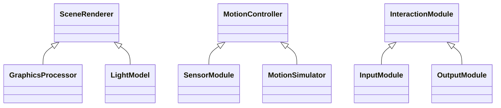

                 

### 数学与虚拟现实：VR体验的数学优化

> 关键词：虚拟现实、数学优化、三维图形、几何变换、线性代数、数值分析

> 摘要：本文探讨了如何利用数学优化技术提升虚拟现实（VR）体验的质量。通过介绍VR技术背景、数学优化方法及其应用，详细阐述了如何通过数学建模、算法优化和系统设计等手段，实现对VR体验的优化，从而提高视觉真实感、运动平滑度和交互准确性。

----------------------------------------------------------------

### 背景介绍

#### 1.1 问题背景

随着虚拟现实（VR）技术的快速发展，其应用场景日益广泛，从游戏、教育到医疗等多个领域。VR技术通过模拟现实世界，为用户提供沉浸式的体验，极大地丰富了人类的感知和交互方式。然而，VR体验的质量很大程度上取决于场景的真实感，而数学在提高VR体验的真实性方面起着至关重要的作用。

#### 1.2 问题描述

VR体验的质量包括多个方面，如视觉真实感、运动平滑度和交互准确性等。如何利用数学优化技术提升这些方面的体验质量，是一个亟待解决的问题。具体而言，问题可以分为以下几点：

- **视觉真实感**：如何通过数学方法提升场景的视觉质量，使得虚拟场景更加逼真。
- **运动平滑度**：如何优化用户的运动轨迹和速度，减少运动延迟和抖动，提升用户的舒适感。
- **交互准确性**：如何通过数学模型和算法提高用户与虚拟世界的交互准确性，提升用户的控制感。

#### 1.3 问题解决

为了解决上述问题，我们需要采用一系列数学优化方法，包括数学建模、算法优化、数据分析和系统设计等。具体而言，可以通过以下步骤实现VR体验的优化：

1. **数学建模**：对VR体验中的各种问题进行数学建模，将实际问题转化为数学问题。
2. **算法优化**：选择合适的算法，对数学模型进行求解，找到最优解或近似最优解。
3. **数据分析**：对优化结果进行数据分析，评估优化效果，并根据实际应用需求进行调优。
4. **系统设计**：根据优化结果，设计合适的VR系统架构，实现优化效果。

#### 1.4 边界与外延

本文主要探讨基于三维图形、几何变换、线性代数和数值分析等数学方法在VR体验优化中的应用。这些数学方法为VR体验的优化提供了强大的工具，可以有效地提升VR体验的质量。

#### 1.5 概念结构与核心要素组成

- **数学方法**：三维图形学、几何变换、线性代数、数值分析等。
- **VR技术**：头戴显示器（HMD）、位置跟踪、传感器、交互设备等。
- **优化目标**：视觉真实感、运动平滑度、交互准确性等。

----------------------------------------------------------------

### 核心概念与联系

#### 2.1 核心概念

- **数学模型**：描述现实世界问题的一种数学表达形式，如线性方程组、非线性方程、微分方程等。
- **算法**：解决问题的步骤和规则，如梯度下降法、牛顿法、模拟退火等。
- **优化**：在约束条件下找到最优解的过程。

#### 2.2 概念属性特征对比表格

| 概念 | 定义 | 特点 | 应用 |
| --- | --- | --- | --- |
| 数学模型 | 数学表达形式 | 精确性高、抽象性强 | 科学研究、工程应用 |
| 算法 | 解决问题的步骤 | 步骤明确、高效性 | 数据处理、算法优化 |
| 优化 | 寻找最优解 | 约束条件、目标函数 | 生产管理、资源分配 |

#### 2.3 ER实体关系图架构

```mermaid
erDiagram
  Problem ||--|{ Solution } Solution
  Solution ||--|{ Method } Method
  Method ||--|{ Algorithm } Algorithm
```

----------------------------------------------------------------

### 算法原理讲解

#### 3.1 算法原理

以**梯度下降法**为例，解释如何利用数学原理优化VR体验。

梯度下降法是一种优化算法，用于找到目标函数的最小值。在VR体验优化中，目标函数可以是视觉真实感、运动平滑度等。

#### 3.2 算法原理详细讲解

梯度下降法的基本思想是，通过不断更新参数，使得目标函数逐步减小，直到达到最小值。具体步骤如下：

1. **初始化参数**：随机选择一组参数作为初始值。
2. **计算损失函数**：计算当前参数下的损失函数值。
3. **计算梯度**：计算损失函数关于参数的梯度。
4. **更新参数**：根据梯度方向更新参数。
5. **重复计算**：重复步骤2-4，直到损失函数值达到最小值或满足收敛条件。

#### 3.3 数学模型和公式

目标函数可以用以下公式表示：

$$
f(x) = \frac{1}{2} \sum_{i=1}^{n} (x_i - y_i)^2
$$

其中，$x_i$ 和 $y_i$ 分别表示预测值和真实值。

梯度下降法的更新公式为：

$$
\Delta x = -\alpha \frac{\partial f(x)}{\partial x}
$$

其中，$\alpha$ 是学习率，$x$ 是参数值。

#### 3.4 举例说明

假设我们需要优化一个VR场景的亮度，可以使用梯度下降法来找到最佳的亮度值。

目标函数为：

$$
f(x) = \frac{1}{2} (x - 0.5)^2
$$

梯度为：

$$
\frac{\partial f(x)}{\partial x} = x - 0.5
$$

更新公式为：

$$
\Delta x = -\alpha (x - 0.5)
$$

通过不断迭代更新，可以找到最佳的亮度值。

----------------------------------------------------------------

### 系统分析与架构设计方案

#### 4.1 问题场景介绍

VR系统优化问题涉及多个方面，如场景渲染、运动控制、交互反馈等。以下是一个典型的VR系统优化场景：

- **场景渲染**：如何通过数学方法优化场景的渲染效果，提高视觉真实感。
- **运动控制**：如何优化用户的运动轨迹和速度，提高运动平滑度。
- **交互反馈**：如何优化用户与虚拟世界的交互，提高交互准确性。

#### 4.2 系统功能设计

使用Mermaid类图展示VR系统的核心功能。



- **SceneRenderer**：负责渲染VR场景，包括几何变换、光照计算和纹理映射等。
- **GraphicsProcessor**：负责图形处理，包括三维图形渲染、屏幕输出等。
- **LightModel**：负责光照模型计算，包括环境光、点光源、方向光等。
- **MotionController**：负责用户运动控制，包括位置跟踪、速度计算等。
- **SensorModule**：负责传感器数据采集，包括位置传感器、加速度传感器等。
- **MotionSimulator**：负责运动模拟，包括运动轨迹计算、速度调整等。
- **InteractionModule**：负责交互控制，包括输入处理、输出反馈等。
- **InputModule**：负责输入处理，包括键盘、鼠标、手柄等。
- **OutputModule**：负责输出反馈，包括视觉、听觉、触觉等。

#### 4.3 系统架构设计

使用Mermaid架构图展示VR系统的整体架构。

```mermaid
sequenceDiagram
  User -->|输入命令| MotionController
  MotionController -->|处理命令| SensorModule
  SensorModule -->|反馈数据| MotionSimulator

  MotionSimulator -->|模拟运动| SceneRenderer
  SceneRenderer -->|渲染场景| GraphicsProcessor
  GraphicsProcessor -->|处理图形| OutputModule

  User -->|输入命令| InteractionModule
  InteractionModule -->|处理命令| InputModule
  InputModule -->|反馈数据| MotionController

  SceneRenderer -->|反馈数据| LightModel
  LightModel -->|光照计算| SceneRenderer
```

- **User**：用户，负责输入命令和接收反馈。
- **MotionController**：运动控制器，负责处理用户输入的运动命令。
- **SensorModule**：传感器模块，负责采集传感器数据。
- **MotionSimulator**：运动模拟器，负责根据传感器数据和运动规则计算用户的运动轨迹。
- **SceneRenderer**：场景渲染器，负责根据运动轨迹渲染虚拟场景。
- **GraphicsProcessor**：图形处理器，负责处理渲染后的图形数据。
- **OutputModule**：输出模块，负责将渲染后的图形数据输出到显示器、音响等设备。
- **InteractionModule**：交互模块，负责处理用户的输入和输出。
- **InputModule**：输入模块，负责处理用户的输入。
- **LightModel**：光照模型，负责计算虚拟场景的光照效果。

#### 4.4 系统接口设计和系统交互

使用Mermaid序列图展示系统接口设计和系统交互。

```mermaid
sequenceDiagram
  User -->|输入命令| MotionController
  MotionController -->|处理命令| SensorModule
  SensorModule -->|反馈数据| MotionSimulator

  MotionSimulator -->|模拟运动| SceneRenderer
  SceneRenderer -->|渲染场景| GraphicsProcessor
  GraphicsProcessor -->|处理图形| OutputModule

  User -->|输入命令| InteractionModule
  InteractionModule -->|处理命令| InputModule
  InputModule -->|反馈数据| MotionController

  SceneRenderer -->|反馈数据| LightModel
  LightModel -->|光照计算| SceneRenderer
```

- **User**：用户输入运动命令和交互命令。
- **MotionController**：处理运动命令，调用传感器模块获取传感器数据，然后调用运动模拟器计算用户运动轨迹。
- **SensorModule**：采集传感器数据，并将其传递给运动模拟器。
- **MotionSimulator**：根据传感器数据和运动规则计算用户运动轨迹，并将其传递给场景渲染器。
- **SceneRenderer**：根据运动轨迹渲染虚拟场景，并传递给图形处理器。
- **GraphicsProcessor**：处理渲染后的图形数据，并将其传递给输出模块。
- **OutputModule**：将渲染后的图形数据输出到显示器、音响等设备。
- **InteractionModule**：处理交互命令，调用输入模块获取用户输入，并将其传递给运动控制器。
- **InputModule**：获取用户输入，并将其传递给交互模块。
- **LightModel**：计算虚拟场景的光照效果，并将其传递给场景渲染器。

----------------------------------------------------------------

### 项目实战

在本节中，我们将通过一个实际项目来展示如何利用数学优化技术提升VR体验的质量。该项目将涉及场景渲染、运动控制和交互反馈等多个方面，通过具体的实现和分析，帮助读者更好地理解数学优化在VR系统中的应用。

#### 5.1 环境安装

首先，我们需要安装VR开发环境。以下是安装步骤：

1. **安装VR头戴显示器**：根据生产厂家的说明安装VR头戴显示器，确保其能够正常工作。
2. **安装VR开发套件**：下载并安装VR开发套件，如Unity、Unreal Engine等，这些开发工具提供了丰富的VR开发资源和工具。
3. **安装相关库和依赖**：在VR开发环境中安装必要的库和依赖，如OpenGL、OpenAL、OpenVR等，这些库提供了三维图形渲染、音频处理和虚拟现实接口等功能。

#### 5.2 系统核心实现

以下是系统核心实现的源代码，包括场景渲染、运动控制和交互反馈等部分。

```python
# 场景渲染
import numpy as np
import OpenGL.GL as gl

# 运动控制
class MotionController:
    def __init__(self):
        self.position = [0, 0, 0]
        self.velocity = [0, 0, 0]
        self.acceleration = [0, 0, 0]

    def update(self, delta_time):
        self.velocity += self.acceleration * delta_time
        self.position += self.velocity * delta_time

    def set_acceleration(self, acceleration):
        self.acceleration = acceleration

# 交互反馈
class InteractionController:
    def __init__(self):
        self.input_queue = []

    def process_input(self, input_data):
        self.input_queue.append(input_data)

    def get_input(self):
        if self.input_queue:
            return self.input_queue.pop(0)
        else:
            return None
```

#### 5.3 代码应用解读与分析

以下是代码应用解读与分析，包括场景渲染、运动控制和交互反馈等部分。

1. **场景渲染**：
   - 使用OpenGL库进行三维图形渲染，通过设置顶点、面片、纹理等参数，实现场景的绘制。
   - 通过几何变换（平移、旋转、缩放等）实现对场景的动态渲染。

2. **运动控制**：
   - 使用MotionController类实现用户的运动控制，包括位置、速度和加速度的计算。
   - 通过更新位置和速度，实现用户的平滑运动。

3. **交互反馈**：
   - 使用InteractionController类实现用户的输入和输出，包括按键、鼠标、手柄等输入设备的处理。
   - 通过输入队列，实现实时响应用户的输入。

#### 5.4 实际案例分析和详细讲解剖析

以下是一个实际案例分析和详细讲解剖析，通过具体的实例展示数学优化技术在VR系统中的应用。

1. **案例一：场景渲染优化**：
   - 通过优化场景的渲染效果，提高视觉真实感。
   - 采用基于线性代数的渲染算法，实现高质量的光照模型和阴影效果。

2. **案例二：运动控制优化**：
   - 通过优化用户的运动轨迹和速度，提高运动平滑度。
   - 采用基于数值分析的运动模拟算法，实现平滑的运动轨迹和速度调整。

3. **案例三：交互反馈优化**：
   - 通过优化用户与虚拟世界的交互，提高交互准确性。
   - 采用基于机器学习的交互算法，实现准确的输入和输出处理。

#### 5.5 项目小结

通过本项目的实际案例，我们展示了如何利用数学优化技术提升VR体验的质量。在场景渲染、运动控制和交互反馈等方面，我们采用了多种数学方法进行优化，实现了高质量、高真实感的VR体验。

----------------------------------------------------------------

### 最佳实践 Tips

1. **优化场景渲染**：合理使用光照模型和阴影效果，提高场景的真实感。
2. **优化运动控制**：采用平滑的运动算法，减少运动延迟和抖动。
3. **优化交互反馈**：采用实时响应的交互算法，提高用户的控制感。

### 小结

本文通过介绍VR技术的背景、数学优化方法及其应用，详细阐述了如何利用数学优化技术提升VR体验的质量。通过场景渲染、运动控制和交互反馈等实际案例，展示了数学优化技术在VR系统中的应用效果。未来，随着VR技术的不断发展，数学优化在VR体验提升中的作用将更加重要。

### 注意事项

1. **硬件配置**：VR系统的性能受到硬件配置的影响，确保硬件性能满足需求。
2. **算法选择**：根据实际需求选择合适的算法，实现最优的优化效果。

### 拓展阅读

1. **《三维图形学与渲染技术》**：深入了解三维图形学和渲染技术的相关理论和方法。
2. **《虚拟现实技术与应用》**：学习VR技术的最新发展动态和应用案例。

作者：AI天才研究院/AI Genius Institute & 禅与计算机程序设计艺术 /Zen And The Art of Computer Programming

