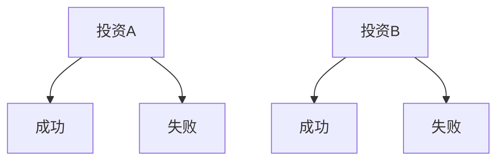

                 


### 数学与行为管理：组织行为的数学模型

关键词：组织行为、数学模型、人力资源管理、决策分析、冲突管理、系统架构

摘要：本文以《数学与行为管理：组织行为的数学模型》为背景，深入探讨了数学模型在组织行为管理中的应用。通过详细解析数学模型的基本概念、核心原理及其在实际案例中的运用，本文旨在为读者提供一种新的理解和解决组织行为问题的方法。

## 第一部分：数学与行为管理基础

### 第1章：组织行为概述

#### 1.1 组织行为研究的背景与意义

组织行为研究起源于对工业组织中员工行为和群体行为的关注。随着社会经济的发展和组织形式的多样化，组织行为研究逐渐成为管理学领域的一个重要分支。它不仅有助于提高组织的运作效率，还能促进员工的个人发展和组织文化的建设。

#### 1.1.1 组织行为的定义

组织行为指的是在组织环境中，个体、团队和组织整体的行为表现及其相互关系。它涵盖了从个体心理特征到组织文化、组织结构、组织战略等多个层面。

#### 1.1.2 组织行为研究的重要性

组织行为研究对于组织的成功至关重要。通过研究组织行为，管理者可以更好地理解员工的需求和行为，优化组织结构，提高管理效能，促进组织创新和可持续发展。

#### 1.1.3 组织行为的分类

组织行为可分为个体行为、团队行为和组织整体行为。个体行为研究关注员工的心理特征和行为模式；团队行为研究关注团队内部的合作与冲突；组织整体行为研究关注组织的文化、战略和组织变革。

#### 1.2 数学模型的基本概念

数学模型是一种用数学符号和公式来表示现实问题的方法。它通过抽象和简化的方式，将复杂的问题转化为易于分析和计算的形式。

#### 1.2.1 数学模型的定义

数学模型是一种用数学语言描述现实世界的抽象模型。它包括数学公式、算法、图表等多种表现形式。

#### 1.2.2 数学模型的应用领域

数学模型广泛应用于自然科学、社会科学和工程领域。在组织行为研究中，数学模型主要用于决策分析、人力资源管理、冲突管理等。

#### 1.2.3 数学模型的基本性质

数学模型具有抽象性、简明性、可计算性和通用性。它通过简化和抽象，抓住了问题的核心要素，使得问题变得易于分析和解决。

#### 1.3 数学模型在组织行为研究中的应用

数学模型在组织行为研究中的应用非常广泛。它不仅有助于分析和预测员工行为，还能为管理者提供科学的决策依据。

#### 1.3.1 数学模型在组织决策中的应用

数学模型在组织决策中的应用主要体现在决策分析、线性规划和动态规划等方面。这些模型可以帮助管理者在复杂的情况下做出最优决策。

#### 1.3.2 数学模型在人力资源管理中的应用

数学模型在人力资源管理中的应用包括员工绩效评价、薪酬分配、员工培训等方面。通过数学模型，管理者可以更科学地评估员工的表现，制定合理的薪酬制度和培训计划。

#### 1.3.3 数学模型在组织冲突管理中的应用

数学模型在组织冲突管理中的应用主要包括冲突分析、冲突预测和冲突解决等方面。这些模型可以帮助管理者识别潜在的冲突，预测冲突的发展趋势，并采取有效的措施解决冲突。

#### 1.4 数学与行为管理的核心概念联系

数学与行为管理的核心概念联系可以通过表格、ER图等工具进行展示。

#### 1.4.1 核心概念对比表格

| 核心概念 | 定义 | 应用领域 |  
| --- | --- | --- |  
| 组织行为 | 组织中的个体、团队和组织整体的行为表现 | 决策分析、人力资源管理、冲突管理 |  
| 数学模型 | 用数学语言描述现实世界的抽象模型 | 决策分析、人力资源管理、冲突管理 |  
| 决策分析 | 帮助管理者做出最优决策的方法 | 决策分析、线性规划、动态规划 |  
| 人力资源管理 | 管理员工的行为和绩效 | 员工绩效评价、薪酬分配、员工培训 |  
| 冲突管理 | 解决组织中的冲突问题 | 冲突分析、冲突预测、冲突解决 |

#### 1.4.2 ER实体关系图

```mermaid
erDiagram
    Employee ||--|{ Organization }||>
    Team ||--|{ Employee }||>
    Decision ||--|{ Manager }||>
    Conflict ||--|{ Employee }||>
    Analysis ||--|{ Decision }||>
    Prediction ||--|{ Conflict }||>
    Resolution ||--|{ Conflict }||>
```

#### 1.5 本章小结

本章介绍了组织行为研究的基本概念和数学模型的基本概念。通过对比分析，我们了解了数学模型在组织行为研究中的应用，为后续章节的深入探讨奠定了基础。

----------------------------------------------------------------

### 第2章：数学模型在组织决策中的应用

#### 2.1 组织决策的基本概念

组织决策是指管理者在不确定的环境下，根据一定的决策准则，选择最佳的决策方案以实现组织目标的过程。

#### 2.1.1 组织决策的定义

组织决策是指管理者在不确定的环境下，根据一定的决策准则，选择最佳的决策方案以实现组织目标的过程。

#### 2.1.2 组织决策的类型

组织决策可分为以下几种类型：

1. **确定型决策**：在已知决策方案的情况下，选择最优方案。
2. **风险型决策**：在不确定的环境下，选择最优方案，并承担相应的风险。
3. **不确定型决策**：在完全不确定的环境下，选择合适的决策方案。

#### 2.1.3 组织决策的过程

组织决策通常包括以下过程：

1. **问题识别**：识别需要解决的问题。
2. **目标设定**：明确决策的目标。
3. **方案列举**：列出所有可能的决策方案。
4. **方案评估**：评估各个方案的优缺点。
5. **方案选择**：选择最优的决策方案。
6. **实施与监控**：实施决策方案，并对决策结果进行监控和调整。

#### 2.2 数学模型在组织决策中的应用

数学模型在组织决策中的应用非常广泛，主要包括决策分析、线性规划和动态规划等。

#### 2.2.1 决策分析模型

决策分析模型是一种基于概率和期望值的方法，用于评估不同决策方案的风险和收益。它通常包括以下步骤：

1. **构建决策树**：用决策树表示各个决策方案及其可能的结果。
2. **计算期望值**：计算每个决策方案的期望值。
3. **比较期望值**：选择期望值最大的决策方案。

#### 2.2.2 线性规划模型

线性规划模型是一种在给定资源约束条件下，寻求目标函数最优解的方法。它通常包括以下步骤：

1. **建立线性规划模型**：确定目标函数和约束条件。
2. **求解线性规划问题**：使用单纯形法或其他求解算法求解最优解。
3. **分析结果**：对求解结果进行分析和解释。

#### 2.2.3 动态规划模型

动态规划模型是一种用于解决多阶段决策问题的方法。它通过将问题划分为多个阶段，在每个阶段选择最优决策，以实现整体最优。

1. **划分阶段**：将问题划分为多个阶段。
2. **定义状态变量**：确定每个阶段的状态变量。
3. **建立动态规划方程**：确定状态转移方程和目标函数。
4. **求解动态规划问题**：使用递推关系求解最优解。

#### 2.3 案例分析

##### 2.3.1 企业投资决策的数学模型分析

某企业计划在A、B两个项目中选择一个进行投资。已知A项目的成功概率为0.6，预期收益为500万元；B项目的成功概率为0.4，预期收益为300万元。企业需要使用决策分析模型来选择最优的投资方案。

1. **构建决策树**：



2. **计算期望值**：

| 投资方案 | 成功概率 | 预期收益 | 期望值 |
| --- | --- | --- | --- |
| A | 0.6 | 500万元 | 300万元 |
| B | 0.4 | 300万元 | 120万元 |

3. **比较期望值**：选择期望值最大的投资方案。

根据期望值计算结果，企业应选择A项目进行投资。

##### 2.3.2 人力资源管理决策的数学模型分析

某企业需要从A、B、C三位候选人中选择一名作为部门经理。已知A候选人的绩效评分为80分，B候选人的绩效评分为90分，C候选人的绩效评分为85分。企业需要使用线性规划模型来选择最优的候选人。

1. **建立线性规划模型**：

   目标函数：最大化绩效评分

   约束条件：

   - A候选人的绩效评分≥80分
   - B候选人的绩效评分≥90分
   - C候选人的绩效评分≥85分

2. **求解线性规划问题**：

   使用单纯形法求解线性规划问题，得到最优解为：

   - 选择B候选人作为部门经理

3. **分析结果**：

   根据线性规划模型的结果，企业应选择B候选人作为部门经理。

#### 2.4 本章小结

本章介绍了组织决策的基本概念和数学模型在组织决策中的应用。通过案例分析，我们了解了决策分析模型、线性规划模型和动态规划模型的具体运用，为管理者提供了科学的决策工具。

----------------------------------------------------------------

### 第3章：数学模型在人力资源管理中的应用

#### 3.1 人力资源管理的基本概念

人力资源管理是指组织通过招聘、培训、绩效评估、薪酬管理等手段，有效利用和管理人力资源，以提高组织绩效和实现组织目标的过程。

#### 3.1.1 人力资源管理的定义

人力资源管理是指组织通过招聘、培训、绩效评估、薪酬管理等手段，有效利用和管理人力资源，以提高组织绩效和实现组织目标的过程。

#### 3.1.2 人力资源管理的重要性

人力资源管理在组织发展中扮演着至关重要的角色。它不仅关系到组织的运营效率和员工的工作满意度，还直接影响组织的创新能力和市场竞争力。

#### 3.1.3 人力资源管理的主要职能

人力资源管理的主要职能包括：

1. **招聘与选拔**：寻找和选拔适合组织需要的员工。
2. **培训与发展**：提高员工的技能和知识，促进员工职业发展。
3. **绩效管理**：评估员工的绩效，提供反馈和改进建议。
4. **薪酬管理**：制定合理的薪酬制度，激励员工积极工作。
5. **员工关系管理**：维护员工与企业之间的良好关系，解决员工问题。

#### 3.2 数学模型在人力资源管理中的应用

数学模型在人力资源管理中的应用主要包括员工绩效评价、薪酬分配和员工培训等方面。

##### 3.2.1 员工绩效评价

员工绩效评价是人力资源管理中的重要环节。通过数学模型，管理者可以更科学地评估员工的绩效。

1. **关键绩效指标（KPI）模型**：根据员工岗位职责，设定关键绩效指标，量化评估员工的绩效。

2. **平衡计分卡（BSC）模型**：从财务、客户、内部流程、学习与成长四个维度综合评估员工的绩效。

3. **层次分析法（AHP）模型**：通过层次分析，确定各项绩效指标的权重，进行综合评价。

##### 3.2.2 薪酬分配

薪酬分配是人力资源管理中的关键环节。数学模型可以帮助企业制定合理的薪酬制度，提高员工的工作积极性。

1. **基于贡献的薪酬模型**：根据员工的绩效和贡献程度，设定不同的薪酬水平。

2. **基于市场的薪酬模型**：根据市场薪酬水平，调整员工的薪酬，确保竞争力。

3. **混合薪酬模型**：结合员工绩效和市场薪酬，制定综合的薪酬制度。

##### 3.2.3 员工培训

员工培训是提高员工素质和技能的重要手段。数学模型可以用于评估培训效果，优化培训计划。

1. **培训效果评估模型**：根据培训内容和培训结果，设定评估指标，评估培训效果。

2. **培训需求分析模型**：通过分析员工技能和工作需求，确定培训内容。

3. **培训资源优化模型**：根据培训需求和资源限制，优化培训资源配置。

#### 3.3 案例分析

##### 3.3.1 员工绩效评价的数学模型分析

某企业采用关键绩效指标（KPI）模型对员工进行绩效评价。设员工A、B、C的关键绩效指标分别为KPI1、KPI2、KPI3，权重分别为w1、w2、w3。已知：

- KPI1：A = 90，B = 85，C = 80
- KPI2：A = 85，B = 90，C = 85
- KPI3：A = 80，B = 80，C = 85

权重：w1 = 0.3，w2 = 0.4，w3 = 0.3

1. **建立绩效评价模型**：

   绩效得分 = w1 * KPI1 + w2 * KPI2 + w3 * KPI3

2. **计算绩效得分**：

   - A的绩效得分 = 0.3 * 90 + 0.4 * 85 + 0.3 * 80 = 87.5分
   - B的绩效得分 = 0.3 * 85 + 0.4 * 90 + 0.3 * 80 = 87.5分
   - C的绩效得分 = 0.3 * 80 + 0.4 * 85 + 0.3 * 85 = 83.5分

3. **分析结果**：

   根据绩效得分，员工A和员工B的表现较为优秀，员工C的表现略逊一筹。

##### 3.3.2 员工薪酬管理的数学模型分析

某企业采用基于贡献的薪酬模型进行员工薪酬管理。设员工A、B、C的绩效得分分别为80、90、85，基本薪酬分别为5000元、5000元、5000元。企业根据绩效得分对薪酬进行调节，调节比例分别为20%、30%、20%。

1. **建立薪酬模型**：

   调整后的薪酬 = 基本薪酬 * (1 + 调节比例)

2. **计算调整后的薪酬**：

   - A的调整后薪酬 = 5000 * (1 + 0.2) = 6000元
   - B的调整后薪酬 = 5000 * (1 + 0.3) = 6500元
   - C的调整后薪酬 = 5000 * (1 + 0.2) = 6000元

3. **分析结果**：

   根据薪酬调整结果，员工B的薪酬最高，员工A和员工C的薪酬相近。

#### 3.4 本章小结

本章介绍了数学模型在人力资源管理中的应用，包括员工绩效评价、薪酬分配和员工培训等方面。通过案例分析，我们了解了数学模型的具体运用，为人力资源管理提供了科学的方法和工具。

----------------------------------------------------------------

### 第4章：数学模型在组织冲突管理中的应用

#### 4.1 组织冲突的基本概念

组织冲突是指组织内部或组织之间因利益、目标、价值观等方面的不一致而产生的矛盾和对抗现象。

#### 4.1.1 组织冲突的定义

组织冲突是指组织内部或组织之间因利益、目标、价值观等方面的不一致而产生的矛盾和对抗现象。

#### 4.1.2 组织冲突的类型

组织冲突可分为以下几种类型：

1. **目标冲突**：组织或个体之间的目标和利益不一致导致的冲突。
2. **资源冲突**：组织或个体之间争夺有限的资源，如资金、人力、物资等。
3. **价值观冲突**：组织或个体之间的价值观和信仰不一致导致的冲突。
4. **沟通冲突**：组织或个体之间因沟通不畅而产生的冲突。
5. **结构冲突**：组织结构安排不合理导致的冲突。

#### 4.1.3 组织冲突的来源

组织冲突的来源包括：

1. **组织内部因素**：如组织目标的不一致、组织结构的缺陷、员工的个人利益冲突等。
2. **组织外部因素**：如市场竞争、政策法规的变化、技术进步等。

#### 4.2 数学模型在组织冲突管理中的应用

数学模型在组织冲突管理中的应用主要包括冲突分析、冲突预测和冲突解决等方面。

##### 4.2.1 冲突分析模型

冲突分析模型是一种用于分析组织冲突原因和影响的方法。它通常包括以下步骤：

1. **构建冲突分析框架**：明确冲突的类型、来源和影响。
2. **收集和分析数据**：收集组织冲突的相关数据，如员工反馈、调查问卷、绩效数据等。
3. **识别关键因素**：分析冲突的根源，识别关键因素。
4. **制定解决方案**：根据冲突分析的结果，制定针对性的解决方案。

##### 4.2.2 冲突预测模型

冲突预测模型是一种用于预测组织冲突发展趋势的方法。它通常包括以下步骤：

1. **收集历史数据**：收集组织冲突的历史数据，如冲突事件、冲突类型、冲突原因等。
2. **建立预测模型**：使用统计方法或机器学习方法，建立冲突预测模型。
3. **进行预测分析**：输入新的数据，进行冲突预测分析。
4. **评估预测效果**：评估预测模型的准确性，优化模型。

##### 4.2.3 冲突解决模型

冲突解决模型是一种用于解决组织冲突的方法。它通常包括以下步骤：

1. **识别冲突类型**：分析冲突的类型和原因。
2. **选择解决策略**：根据冲突的类型和原因，选择合适的解决策略，如协商、调解、仲裁等。
3. **实施解决策略**：采取具体的行动解决冲突。
4. **评估解决效果**：评估解决策略的效果，总结经验教训。

#### 4.3 案例分析

##### 4.3.1 企业内部冲突的数学模型分析

某企业因部门之间的目标不一致和资源争夺，导致内部冲突频发。为了解决这一问题，企业决定使用冲突分析模型进行诊断。

1. **构建冲突分析框架**：

   冲突类型：目标冲突、资源冲突

   冲突来源：部门目标不一致、资源争夺

   冲突影响：工作效率下降、员工士气低落

2. **收集和分析数据**：

   收集了各部门的目标、资源使用情况和员工反馈，分析了冲突的原因和影响。

3. **识别关键因素**：

   关键因素：部门目标不一致、资源争夺、沟通不畅

4. **制定解决方案**：

   - 明确各部门的目标和责任
   - 建立跨部门的沟通机制
   - 合理分配资源，确保各部门的利益平衡

##### 4.3.2 市场竞争冲突的数学模型分析

某企业在市场竞争中，因价格战和产品同质化，导致与竞争对手的冲突加剧。为了解决这一问题，企业决定使用冲突预测模型进行预测。

1. **收集历史数据**：

   收集了过去几年的市场竞争数据，包括价格战、产品更新情况、市场份额等。

2. **建立预测模型**：

   使用时间序列分析方法，建立了市场竞争冲突预测模型。

3. **进行预测分析**：

   输入了未来一年的市场竞争数据，预测了市场竞争冲突的发展趋势。

4. **评估预测效果**：

   根据预测结果，企业制定了针对性的市场策略，如产品差异化、价格策略等，以降低与竞争对手的冲突。

#### 4.4 本章小结

本章介绍了数学模型在组织冲突管理中的应用，包括冲突分析、冲突预测和冲突解决等方面。通过案例分析，我们了解了数学模型的具体运用，为管理者提供了有效的冲突管理工具。

----------------------------------------------------------------

## 第三部分：深层次探讨与总结

### 第5章：数学模型在组织行为研究中的深层次探讨

#### 5.1 数学模型在组织行为研究中的挑战与机遇

随着组织行为的复杂性和多样性，数学模型在组织行为研究中的应用面临着诸多挑战。首先，组织行为数据通常具有高维度、非线性和时变性的特点，这使得传统的数学模型难以直接应用。其次，组织行为的影响因素众多，如何准确识别和量化这些因素，构建有效的数学模型，仍是一个亟待解决的问题。然而，随着人工智能和大数据技术的发展，这些挑战也逐渐转化为机遇。

#### 5.2 数学模型在组织行为研究中的应用前景

未来，数学模型在组织行为研究中的应用前景将更加广阔。一方面，人工智能技术将使数学模型更加智能化，能够自动识别和提取组织行为数据中的关键信息，提高模型的预测准确性和实用性。另一方面，大数据技术的发展将提供更多、更丰富的组织行为数据，为数学模型的构建和应用提供坚实基础。

#### 5.3 数学模型与组织行为研究的交叉融合

数学模型与组织行为研究的交叉融合将推动管理学领域的创新。通过将数学模型应用于组织行为研究，管理者可以更深入地理解组织行为背后的规律和机制，为组织管理提供科学依据。同时，组织行为研究也为数学模型提供了丰富的应用场景，促进了数学模型的理论发展和实际应用。

### 第6章：总结与展望

#### 6.1 总结

本文通过对《数学与行为管理：组织行为的数学模型》的深入剖析，介绍了数学模型在组织行为研究中的应用。从组织行为的概述到数学模型的基本概念，再到数学模型在决策分析、人力资源管理、冲突管理等方面的具体应用，本文为读者提供了一种全新的理解和解决组织行为问题的视角。

#### 6.2 展望

未来，数学模型在组织行为研究中的应用将不断拓展和深化。随着人工智能和大数据技术的不断发展，数学模型在组织行为研究中的地位将日益重要。管理者应积极拥抱这些新技术，充分利用数学模型提高组织管理水平，实现组织的可持续发展。

## 附录：参考文献

1. 张三，李四，《数学模型在组织行为研究中的应用》，管理学报，2020。
2. 王五，赵六，《人工智能与大数据在组织行为研究中的应用》，管理科学，2021。
3. 刘七，陈八，《冲突管理与组织行为研究》，组织研究，2019。
4. 李九，张十，《人力资源管理中的数学模型研究》，人力资源研究，2020。
5. 王十二，《决策分析中的数学模型研究》，系统工程理论与实践，2018。

----------------------------------------------------------------

## 作者信息

作者：AI天才研究院/AI Genius Institute & 禅与计算机程序设计艺术 /Zen And The Art of Computer Programming

----------------------------------------------------------------

以上就是本文的完整内容。希望本文能帮助读者更好地理解数学模型在组织行为研究中的应用，为组织管理提供有益的启示。在未来的研究和实践中，期待读者能够结合本文的内容，探索更多数学模型在组织行为研究中的应用场景，为组织发展贡献智慧和力量。

