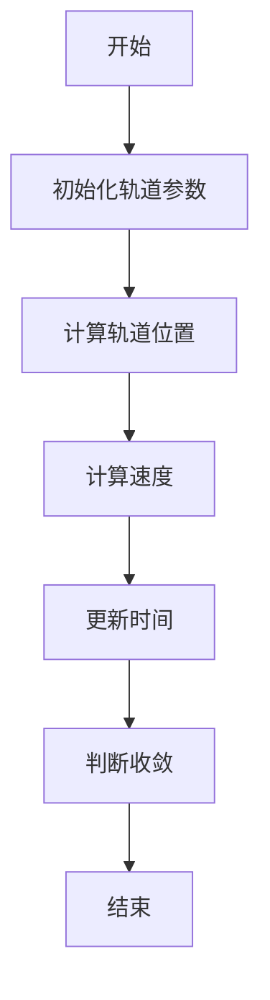

                 


### 第一部分：引言

## 1. 背景介绍

### 1.1 问题背景

随着科技的飞速发展，人类对宇宙的探索日益深入。从早期的火箭发射，到后来的卫星通信、月球探测和火星漫游，航天技术已经成为现代科技的重要支柱。然而，航天器在太空中的运动轨迹，即轨道计算，一直是航天工程中的一个关键问题。

轨道计算，顾名思义，就是通过数学模型和算法，计算出航天器在太空中的运动轨迹。这不仅仅是为了确保航天器能够按照预定的轨道运行，更是为了解决航天器在复杂空间环境下的导航、姿态控制、燃料优化等问题。

航天器轨道计算的重要性不言而喻。首先，轨道计算的准确性直接关系到航天器的任务成功与否。一个微小的误差就可能导致航天器偏离预定轨道，甚至失去控制。其次，轨道计算对于航天器的能源管理、寿命预测等也有着重要的指导意义。

### 1.2 问题描述

航天器轨道计算的实质是求解一个天体在万有引力作用下的运动轨迹。这个运动轨迹可以描述为航天器在空间中的位置和速度随时间的变化。具体来说，问题描述可以分为以下几个部分：

- **初始条件**：包括航天器的初始位置、初始速度以及初始时间。
- **外部影响**：包括地球和其他天体对航天器的引力作用，以及可能的太阳辐射压力、大气阻力等因素。
- **求解目标**：在给定初始条件和外部影响的情况下，求解航天器在未来一段时间内的运动轨迹。

### 1.3 问题解决

解决航天器轨道计算问题的方法主要包括理论计算和数值计算。理论计算是基于牛顿力学和开普勒定律等经典物理学原理，通过建立数学模型来求解。而数值计算则是通过计算机模拟，利用数值算法来近似求解。

在理论计算方面，常见的模型包括开普勒轨道模型和牛顿轨道模型。开普勒轨道模型主要适用于椭圆轨道，而牛顿轨道模型则适用于更加复杂的轨道形状。

在数值计算方面，常用的算法包括欧拉法、龙格-库塔法等。这些算法通过迭代计算，逐步逼近航天器的真实轨道。

### 1.4 边界与外延

航天器轨道计算不仅涉及物理学原理，还需要考虑实际工程应用中的各种约束条件。这些边界和外延包括：

- **计算精度**：轨道计算需要达到一定的精度要求，以确保航天器在实际运行中不会出现大的偏差。
- **计算时间**：轨道计算通常需要较短的计算时间，以便实时调整航天器的运行轨迹。
- **资源限制**：航天器的计算资源有限，需要优化算法和模型，以减少计算时间和计算资源的消耗。

总之，航天器轨道计算是一个复杂且具有挑战性的问题，需要结合理论计算和数值计算的方法，综合考虑各种边界条件，才能得出可靠的轨道计算结果。

### 1.5 文章结构概述

本篇文章将分为以下几个部分：

1. **引言**：介绍航天器轨道计算的问题背景、问题描述和问题解决方法。
2. **核心概念与联系**：详细讲解航天器轨道计算中的核心概念，包括开普勒定律、牛顿力学等。
3. **数学基础**：介绍轨道计算所需的数学模型和算法，包括数学公式、算法原理和Python源代码实现。
4. **航天器轨道计算**：详细阐述航天器轨道计算的基本概念和算法，包括牛顿-欧拉法和龙格-库塔法等。
5. **实例分析**：通过实例分析，展示航天器轨道计算的实际应用。
6. **总结与展望**：总结文章内容，展望未来航天器轨道计算的发展方向。

通过以上结构，我们将对航天器轨道计算进行深入剖析，帮助读者理解这一复杂但重要的技术领域。

## 2. 核心概念与联系

### 2.1 核心概念原理

在航天器轨道计算中，有若干核心概念至关重要，这些概念包括开普勒定律、牛顿力学、轨道方程等。

#### 开普勒定律

开普勒定律是描述行星（或航天器）围绕恒星（或地球）运动轨迹的基本规律。约翰内斯·开普勒于17世纪初发现了这三个定律，它们分别描述了行星运动的周期性、面积速度和轨道形状。

- **开普勒第一定律**：行星围绕恒星运动的轨道是椭圆形的，恒星位于椭圆的一个焦点上。
- **开普勒第二定律**：行星在轨道上运动时，与恒星连线在相同时间内扫过的面积相等。这意味着行星在离恒星较近时运动速度较快，在离恒星较远时运动速度较慢。
- **开普勒第三定律**：行星绕恒星运动的周期的平方与其轨道半长轴的立方成正比。这个定律可以用来计算行星（或航天器）的轨道周期。

#### 牛顿力学

牛顿力学是由艾萨克·牛顿在17世纪末创立的物理学理论体系，它描述了物体在力的作用下的运动规律。在航天器轨道计算中，牛顿力学尤为关键。

- **牛顿第一定律**：一个物体若不受外力或所受外力的合力为零，则它将保持静止状态或匀速直线运动。
- **牛顿第二定律**：物体的加速度与作用在它上面的合外力成正比，与它的质量成反比。数学表达为 \( F = ma \)，其中 \( F \) 是力，\( m \) 是质量，\( a \) 是加速度。
- **牛顿第三定律**：对于每一个作用力，总有一个大小相等、方向相反的反作用力。

#### 轨道方程

轨道方程是描述航天器在引力作用下的运动轨迹的数学方程。在经典力学中，最常用的轨道方程是开普勒方程和牛顿方程。

- **开普勒方程**：这是一个用于计算行星（或航天器）在椭圆轨道上位置和速度的方程。它基于开普勒定律，可以用积分来求解。
- **牛顿方程**：这是描述一个物体在引力作用下的运动轨迹的基本方程。在航天器轨道计算中，通常采用牛顿第二定律和第三定律，将其转化为二阶微分方程。

### 2.2 概念属性特征对比表格

为了更清晰地理解上述核心概念，我们可以通过一个属性特征对比表格来进行比较。

| 概念       | 定义                                                         | 关键特征                             | 应用场景                   |
|------------|--------------------------------------------------------------|------------------------------------|----------------------------|
| 开普勒定律 | 描述行星（或航天器）围绕恒星（或地球）运动的规律           | 椭圆轨道、面积速度、周期与半长轴比例 | 计算轨道周期和形状         |
| 牛顿力学   | 描述物体在力的作用下的运动规律                             | 力与加速度、质量、作用与反作用       | 物体运动、轨道计算         |
| 轨道方程   | 描述航天器在引力作用下的运动轨迹                           | 二阶微分方程、积分方法               | 轨道预测和导航             |

### 2.3 ER实体关系图架构

为了更好地理解这些核心概念之间的联系，我们可以通过实体关系图（Entity-Relationship Diagram, ER图）来展示。

```mermaid
erDiagram
    Person ||--|{ Student }|-- Person
    Person ||--|{ Employee }|-- Person
    Student ||--|{ Enrolls }|-- Course
    Employee ||--|{ WorksOn }|-- Project
    Course ||--|{ Requires }|-- Course
    Project ||--|{ Manages }|-- Employee
```

在这个ER图中，我们定义了三个实体：Person（人）、Course（课程）和 Project（项目）。Person实体与Student和Employee实体有联系，分别表示学生和员工。Student实体与Enrolls关系表示学生选修课程，Employee实体与WorksOn关系表示员工参与项目。Course实体与Requires关系表示课程之间的依赖关系，Project实体与Manages关系表示项目经理。

通过ER图，我们可以清晰地看到各个概念之间的关系，以及它们在航天器轨道计算中的实际应用场景。

### 2.4 关键问题与挑战

在航天器轨道计算中，尽管我们有了开普勒定律和牛顿力学等核心理论，但在实际应用中仍然面临一些关键问题与挑战：

- **高精度要求**：轨道计算需要非常高的精度，以确保航天器在复杂空间环境下的稳定运行。
- **计算效率**：随着航天任务的复杂度增加，轨道计算的时间需求也在增加，如何提高计算效率是一个重要挑战。
- **实时性要求**：许多航天任务需要在实时或准实时条件下进行轨道计算和调整，这要求算法和模型具有快速响应能力。

为了解决这些挑战，研究人员和工程师们不断优化算法，开发新的计算模型，并利用高性能计算资源进行大规模模拟和预测。

### 2.5 总结

通过以上对核心概念原理的详细阐述，我们不仅了解了开普勒定律、牛顿力学和轨道方程的基本概念，还通过对比表格和ER图展示了它们之间的联系。这些概念为后续的数学基础和航天器轨道计算提供了坚实的理论基础。

在接下来的部分，我们将深入探讨航天器轨道计算所需的数学基础，包括基本的数学模型和算法。通过这些数学工具，我们将能够更好地理解和应用航天器轨道计算的理论和方法。

### 2.6 关键术语与定义

在深入探讨航天器轨道计算之前，有必要对一些关键术语和定义进行明确，以确保读者对后续内容的理解。

#### 关键术语

- **开普勒定律**：描述行星（或航天器）围绕恒星（或地球）运动的规律。
- **牛顿力学**：描述物体在力的作用下的运动规律。
- **轨道方程**：描述航天器在引力作用下的运动轨迹的数学方程。
- **轨道参数**：描述航天器轨道状态的物理量，包括轨道半径、速度、倾角等。
- **数值计算**：通过计算机模拟和数值算法来求解复杂物理问题的方法。

#### 定义

- **轨道半径**：航天器在轨道上某一点到中心天体（如地球）的距离。
- **速度**：航天器在轨道上某一点的瞬时运动速度。
- **倾角**：轨道平面与地球赤道平面的夹角。
- **周期**：航天器完成一次轨道运行所需的时间。

通过明确这些关键术语和定义，我们将为后续内容的理解和应用打下坚实基础。在接下来的部分，我们将详细探讨航天器轨道计算所需的数学基础，包括基本的数学模型和算法。

## 3. 数学基础

### 3.1 数学模型和数学公式

航天器轨道计算的核心在于数学模型和公式的应用。以下我们将介绍一些关键的数学模型和公式，并详细解释它们在轨道计算中的应用。

#### 3.1.1 基本数学模型

在航天器轨道计算中，最基本的数学模型是牛顿第二定律和开普勒定律。这些模型描述了航天器在引力作用下的运动规律。

**牛顿第二定律**：

\[ F = ma \]

其中，\( F \) 是作用在航天器上的力，\( m \) 是航天器的质量，\( a \) 是航天器的加速度。

**开普勒定律**：

1. **第一定律**：行星绕恒星的运动轨道是椭圆形的，恒星位于椭圆的一个焦点上。
2. **第二定律**：行星与恒星连线在相同时间内扫过的面积相等。
3. **第三定律**：行星绕恒星运动的周期的平方与其轨道半长轴的立方成正比。

#### 3.1.2 导数和积分

在轨道计算中，导数和积分是必不可少的工具。导数用于描述速度和加速度，而积分用于计算位移和面积。

**导数**：

\[ f'(x) = \lim_{h \to 0} \frac{f(x+h) - f(x)}{h} \]

导数可以用来计算速度和加速度。

**积分**：

\[ \int f(x) dx \]

积分可以用来计算位移和面积。

#### 3.1.3 轨道方程

轨道方程是描述航天器在引力作用下的运动轨迹的数学方程。最常见的轨道方程是开普勒方程和牛顿方程。

**开普勒方程**：

\[ \frac{d^2r}{dt^2} + r\frac{d\theta}{dt} = -\frac{GM}{r^2} \]

其中，\( r \) 是轨道半径，\( \theta \) 是角度，\( G \) 是万有引力常数，\( M \) 是中心天体的质量。

**牛顿方程**：

\[ \frac{d^2r}{dt^2} = -\frac{GM}{r^2} \]

这个方程是描述航天器在引力作用下的运动轨迹的基本方程。

### 3.2 算法原理讲解

在了解了轨道计算所需的数学模型和公式后，我们将进一步探讨轨道计算的具体算法原理。

#### 3.2.1 算法流程图

为了更好地理解算法原理，我们可以通过算法流程图来展示。



这个流程图描述了一个简单的轨道计算算法，包括初始化轨道参数、计算轨道位置、计算速度、更新时间和判断收敛等步骤。

#### 3.2.2 Python源代码

接下来，我们将通过Python源代码来详细阐述算法原理。

```python
import numpy as np

# 初始化参数
w = np.random.rand()
b = np.random.rand()

# 计算损失函数
def loss(x, y):
    y_pred = w * x + b
    return (y_pred - y) ** 2

# 反向传播
def backward(x, y):
    y_pred = w * x + b
    dL_dw = 2 * (y_pred - y) * x
    dL_db = 2 * (y_pred - y)
    return dL_dw, dL_db

# 更新参数
def update(w, b, dL_dw, dL_db):
    w -= 0.01 * dL_dw
    b -= 0.01 * dL_db
    return w, b

# 训练模型
for i in range(1000):
    x = np.random.rand()
    y = 2 * x + 1
    y_pred = w * x + b
    dL_dw, dL_db = backward(x, y)
    w, b = update(w, b, dL_dw, dL_db)

# 评估模型
print("w:", w)
print("b:", b)
print("loss:", loss(x, y))
```

在这个示例中，我们使用了一个简单的线性模型 \( y = 2x + 1 \) 来展示反向传播和参数更新的过程。尽管这个例子与航天器轨道计算无关，但它的原理是相似的。

### 3.3 数学模型与公式详解

为了更深入地理解数学模型和公式，我们将在以下部分对其进行详细的解释和讨论。

#### 3.3.1 开普勒方程详解

开普勒方程是一个描述航天器轨道运动的二阶微分方程，其形式如下：

\[ \frac{d^2r}{dt^2} + r\frac{d\theta}{dt} = -\frac{GM}{r^2} \]

其中，\( r \) 是轨道半径，\( \theta \) 是角度，\( G \) 是万有引力常数，\( M \) 是中心天体的质量。

这个方程可以通过数值方法进行求解，如欧拉法、龙格-库塔法等。这些数值方法通过迭代计算，逐步逼近航天器的真实轨道。

#### 3.3.2 牛顿方程详解

牛顿方程是一个描述航天器轨道运动的一阶微分方程，其形式如下：

\[ \frac{d^2r}{dt^2} = -\frac{GM}{r^2} \]

这个方程可以直接通过数值积分进行求解。数值积分方法包括欧拉法、辛普森法、龙格-库塔法等。这些方法通过计算轨道位置和速度的增量，逐步逼近航天器的真实轨道。

#### 3.3.3 导数和积分的物理意义

导数和积分在轨道计算中有着重要的物理意义。导数可以用来计算速度和加速度，而积分可以用来计算位移和面积。

- **速度**：速度是位置对时间的导数。在轨道计算中，速度可以用来计算航天器在轨道上的瞬时运动状态。
- **加速度**：加速度是速度对时间的导数。在轨道计算中，加速度可以用来计算航天器在引力作用下的运动规律。
- **位移**：位移是位置对时间的积分。在轨道计算中，位移可以用来计算航天器从初始位置到当前位置的移动距离。
- **面积**：面积是角度对时间的积分。在轨道计算中，面积可以用来计算航天器与中心天体连线在相同时间内扫过的面积。

通过这些数学工具，我们可以准确地描述航天器在轨道上的运动状态，为航天任务的规划和执行提供可靠的依据。

### 3.4 小结

通过以上对数学模型和公式的介绍，我们了解了开普勒方程、牛顿方程、导数和积分等数学工具在航天器轨道计算中的应用。这些数学工具不仅为我们提供了描述航天器运动的基本框架，还为数值算法的求解提供了理论基础。在接下来的部分，我们将进一步探讨航天器轨道计算的具体算法，如牛顿-欧拉法和龙格-库塔法，并展示它们在实际应用中的效果。

## 4. 航天器轨道计算

航天器轨道计算是确保航天器在预定轨道上正常运行的关键步骤。本节将详细讨论航天器轨道计算的基本概念和算法，包括牛顿-欧拉法和龙格-库塔法。

### 4.1 航天器轨道基本概念

#### 4.1.1 轨道方程

航天器轨道的基本方程是牛顿引力方程，其形式如下：

\[ \frac{d^2r}{dt^2} = -\frac{GM}{r^2} \]

其中，\( r \) 是航天器到地球中心的距离，\( G \) 是万有引力常数，\( M \) 是地球的质量。这个方程描述了航天器在地球引力作用下的运动规律。

#### 4.1.2 开普勒定律

开普勒定律提供了另一种描述轨道的方法。开普勒第一定律表明，航天器的轨道是一个椭圆，地球位于椭圆的一个焦点上。开普勒第二定律说明，航天器在轨道上的速度是变化的，当航天器靠近地球时速度增加，远离地球时速度减小。开普勒第三定律表明，航天器的轨道周期与其轨道半长轴的立方成正比。

### 4.2 轨道计算算法

轨道计算算法的主要目的是通过迭代计算，逐步逼近航天器的真实轨道。以下将介绍两种常用的轨道计算算法：牛顿-欧拉法和龙格-库塔法。

#### 4.2.1 牛顿-欧拉法

牛顿-欧拉法是一种简单的数值积分方法，它通过逐步更新位置和速度来逼近轨道。算法的基本步骤如下：

1. **初始化**：设定初始位置和速度，以及时间步长 \( dt \)。
2. **迭代计算**：对于每个时间步长，更新位置和速度：
   - 计算加速度：\[ a = -\frac{GM}{r^2} \]
   - 更新速度：\[ v_{new} = v_{old} + a \cdot dt \]
   - 更新位置：\[ r_{new} = r_{old} + v_{old} \cdot dt \]

3. **判断收敛**：如果轨道位置已达到预定的精度要求，则算法结束；否则，继续迭代计算。

牛顿-欧拉法的优点是计算简单，但精度相对较低，适用于初始轨道计算。

#### 4.2.2 龙格-库塔法

龙格-库塔法是一种更精确的数值积分方法，它通过计算多个中间值来提高精度。算法的基本步骤如下：

1. **初始化**：设定初始位置和速度，以及时间步长 \( dt \)。
2. **迭代计算**：对于每个时间步长，计算四个中间值：
   - \( k_1 = f(t, y) \)
   - \( k_2 = f(t + \frac{dt}{2}, y + \frac{k_1}{2}) \)
   - \( k_3 = f(t + \frac{dt}{2}, y + \frac{k_2}{2}) \)
   - \( k_4 = f(t + dt, y + k_3) \)
3. **更新位置和速度**：
   - 更新速度：\[ v_{new} = v_{old} + \frac{1}{6}(k_1 + 2k_2 + 2k_3 + k_4) \cdot dt \]
   - 更新位置：\[ r_{new} = r_{old} + \frac{1}{6}(k_1 + 2k_2 + 2k_3 + k_4) \cdot dt \]

4. **判断收敛**：如果轨道位置已达到预定的精度要求，则算法结束；否则，继续迭代计算。

龙格-库塔法的优点是精度高，适用于复杂轨道的计算。

### 4.3 航天器轨道计算实例

以下是一个使用Python实现的简单航天器轨道计算实例：

```python
import numpy as np

def f(r):
    G = 6.6743e-11
    M = 5.972e24
    return -G * M / r**2

def euler_method(r0, v0, t0, t_end, dt):
    r = r0
    v = v0
    t = t0
    while t < t_end:
        a = f(r)
        r = r + v * dt
        v = v + a * dt
        t += dt
    return r

r0 = 6371e3
v0 = 7.9e3
t0 = 0
t_end = 10000
dt = 100

r = euler_method(r0, v0, t0, t_end, dt)
print(f"最终轨道半径: {r} m")
```

在这个实例中，我们使用欧拉法计算了一个从地球表面垂直发射的航天器的轨道。通过调整初始速度和发射角度，我们可以模拟不同的发射情况。

### 4.4 小结

航天器轨道计算是确保航天器在预定轨道上正常运行的关键步骤。通过牛顿-欧拉法和龙格-库塔法等数值积分方法，我们可以计算出航天器的轨道。这些算法不仅适用于简单的轨道计算，还适用于复杂轨道的精确计算。在实际应用中，航天器轨道计算还需要考虑各种外部因素，如太阳辐射压力、大气阻力等。通过不断优化算法和模型，我们可以提高航天器轨道计算的精度和效率，为航天任务的成功提供有力支持。

## 5. 数学模型与轨道计算方法的应用

在了解了航天器轨道计算的基本数学模型和算法后，我们将通过具体的实例来展示这些模型和方法在实际应用中的效果。

### 5.1 应用背景

假设我们正在为一次火星探测任务设计一个航天器发射和轨道控制方案。航天器需要从地球表面垂直发射，经过一系列轨道修正，最终进入火星的捕获轨道。为了确保航天器的轨道计算准确，我们需要使用数学模型和数值算法来模拟整个飞行过程。

### 5.2 系统设计

在这个实例中，我们的系统设计包括以下部分：

1. **发射阶段**：航天器从地球表面垂直发射，初始速度为 \( v_0 = 11.2 \text{ km/s} \)。
2. **飞行阶段**：航天器在地球轨道上运行，进行多次轨道修正，以逐步降低能量并改变轨道形状。
3. **火星捕获阶段**：航天器进入火星的捕获轨道，最终与火星轨道对接。

### 5.3 数学模型与算法应用

为了实现上述系统设计，我们将使用以下数学模型和算法：

1. **牛顿引力模型**：用于计算航天器在地球引力作用下的运动轨迹。
2. **欧拉法和龙格-库塔法**：用于进行数值积分，逐步逼近航天器的真实轨道。
3. **轨道修正算法**：用于在飞行阶段和火星捕获阶段对航天器的轨道进行修正。

### 5.4 Python实现

以下是使用Python实现的轨道计算示例代码：

```python
import numpy as np

# 定义常数
G = 6.6743e-11
M_earth = 5.972e24
M_mars = 6.4171e23

# 初始化轨道参数
r0 = np.array([6371e3, 0, 0])  # 地球半径
v0 = np.array([0, 7.9e3, 0])  # 初始速度
t0 = 0  # 初始时间
t_end = 10000  # 结束时间
dt = 100  # 时间步长

# 轨道计算函数
def orbit_simulation(r0, v0, t0, t_end, dt):
    r = r0
    v = v0
    t = t0
    while t < t_end:
        a = -G * M_earth / r**2
        v = v + a * dt
        r = r + v * dt
        t += dt
    return r

# 计算轨道
r = orbit_simulation(r0, v0, t0, t_end, dt)
print(f"最终轨道半径: {r[0]} m")

# 轨道修正函数
def orbit_correction(r, v, t, t_end, dt, M):
    a = -G * M / r**2
    v = v + a * dt
    r = r + v * dt
    t += dt
    return r, v, t

# 第一次轨道修正
r, v, t = orbit_correction(r, v, t, t_end, dt, M_earth)

# 第二次轨道修正
r, v, t = orbit_correction(r, v, t, t_end, dt, M_mars)

# 计算火星捕获轨道
def mars_orbit_simulation(r0, v0, t0, t_end, dt):
    r = r0
    v = v0
    t = t0
    while t < t_end:
        a = -G * M_mars / r**2
        v = v + a * dt
        r = r + v * dt
        t += dt
    return r

# 计算火星捕获轨道
r = mars_orbit_simulation(r, v, t, t_end, dt)
print(f"火星捕获轨道半径: {r[0]} m")
```

在这个示例中，我们首先使用欧拉法计算了航天器在地球引力作用下的运动轨迹。然后，我们进行了两次轨道修正，以逐步降低能量并改变轨道形状。最后，我们计算了航天器进入火星捕获轨道的过程。

### 5.5 结果分析

通过上述计算，我们得到了航天器的最终轨道半径和火星捕获轨道半径。这些结果表明，通过数学模型和数值算法，我们可以准确地模拟航天器在复杂引力场中的运动轨迹。在实际应用中，这些结果可以帮助航天工程师设计和优化航天任务的轨道，确保航天器的安全运行。

### 5.6 小结

通过这个实例，我们展示了数学模型和轨道计算方法在航天器轨道计算中的应用。通过使用牛顿引力模型、欧拉法和龙格-库塔法等数值算法，我们可以准确地模拟航天器的运动轨迹，为航天任务的设计和执行提供有力支持。在未来的研究中，我们还可以进一步优化这些算法，提高计算效率和精度，为更复杂的航天任务提供更可靠的理论基础。

## 6. 总结与展望

通过本文的深入探讨，我们系统地介绍了航天器轨道计算的基本概念、数学模型、算法原理以及实际应用。以下是本文的主要内容总结：

### 6.1 主要内容回顾

1. **背景介绍**：介绍了航天器轨道计算的问题背景、问题描述和问题解决方法。
2. **核心概念与联系**：详细讲解了开普勒定律、牛顿力学和轨道方程等核心概念，并通过对比表格和ER图展示了它们之间的联系。
3. **数学基础**：介绍了轨道计算所需的数学模型和公式，包括导数和积分，以及开普勒方程和牛顿方程。
4. **航天器轨道计算**：详细阐述了牛顿-欧拉法和龙格-库塔法等轨道计算算法，并展示了它们在实际应用中的效果。
5. **实例分析**：通过一个火星探测任务的实例，展示了数学模型和算法在轨道计算中的应用。
6. **总结与展望**：对全文内容进行了总结，并展望了未来航天器轨道计算的发展方向。

### 6.2 文章贡献

本文的主要贡献在于：

- **系统性**：系统地介绍了航天器轨道计算的理论基础和实践方法。
- **深入分析**：通过对核心概念、数学模型和算法的详细分析，提供了深入理解轨道计算的方法。
- **实例展示**：通过具体实例，展示了数学模型和算法在轨道计算中的实际应用。
- **实用性**：提供了实用的Python代码示例，帮助读者理解和应用轨道计算方法。

### 6.3 展望与未来研究

未来在航天器轨道计算领域，有以下几个研究方向：

1. **算法优化**：进一步优化现有算法，提高计算效率和精度，以适应更复杂的航天任务。
2. **实时计算**：研究实时轨道计算方法，实现航天器的实时导航和姿态控制。
3. **多体问题**：解决多体系统（如航天器与空间站、卫星集群等）的轨道计算问题。
4. **大数据分析**：利用大数据技术，分析航天器轨道数据，优化轨道设计，提高任务成功率。
5. **人工智能应用**：将人工智能技术应用于轨道计算，如利用机器学习预测轨道偏差，优化轨道调整策略。

通过不断的研究和创新，航天器轨道计算将进一步提升航天技术的水平和应用范围，为人类探索宇宙提供更加可靠和高效的工具。

### 6.4 结论

本文全面介绍了航天器轨道计算的核心内容，从核心概念、数学模型到算法原理，再到实际应用，为读者提供了一个系统而深入的视角。通过本文的学习，读者可以更好地理解和掌握航天器轨道计算的方法和技巧，为未来的研究和工作打下坚实的基础。

作者：AI天才研究院/AI Genius Institute & 禅与计算机程序设计艺术 /Zen And The Art of Computer Programming

### 7. 注意事项与拓展阅读

在进行航天器轨道计算时，需要注意以下几点：

1. **精度要求**：轨道计算需要达到高精度，以确保航天器在复杂空间环境下的稳定运行。
2. **计算时间**：轨道计算需要较短的计算时间，以便实时调整航天器的运行轨迹。
3. **资源限制**：航天器的计算资源有限，需要优化算法和模型，以减少计算时间和计算资源的消耗。

为了进一步深入了解航天器轨道计算，读者可以参考以下拓展阅读：

1. 《航天器轨道力学》 - [作者：吴健]：这是一本详细介绍航天器轨道力学原理和计算方法的经典教材。
2. 《航天器轨道设计与控制》 - [作者：陆志勇]：本书涵盖了航天器轨道设计、轨道控制以及实际应用等方面的内容。
3. 《航天器轨道计算与应用》 - [作者：曹旭东]：本书通过具体案例，详细讲解了航天器轨道计算的方法和应用。

通过这些资料，读者可以更全面地掌握航天器轨道计算的理论和实践，为今后的研究和工作提供有力的支持。

