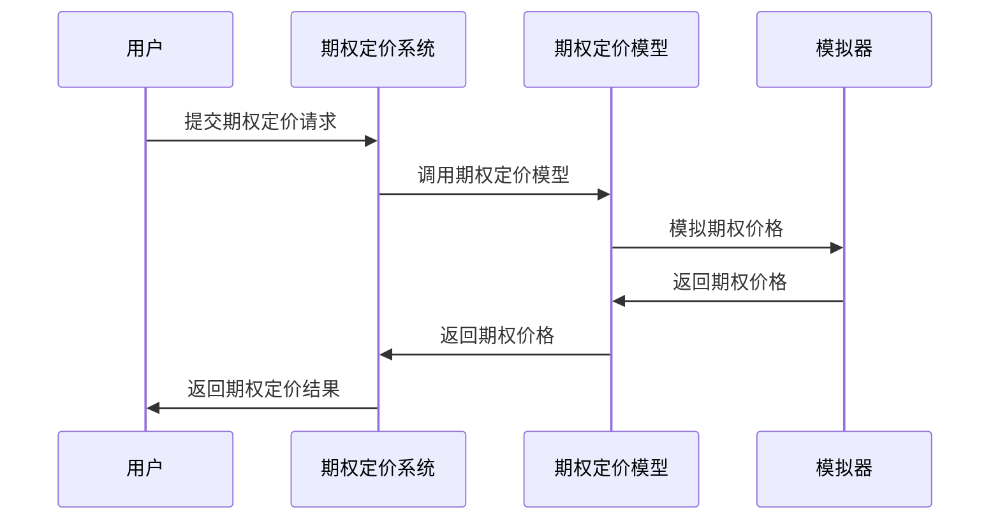

                 

### 《数学与衍生品定价：期权价值的数学模型》

> 关键词：期权定价、布莱克-舒尔斯模型、二叉树模型、衍生品市场、风险管理

> 摘要：本文旨在深入探讨期权定价的数学模型，重点分析布莱克-舒尔斯模型和二叉树模型，以及其在衍生品市场中的应用。通过对这些模型的详细解析，我们希望能够为读者提供一个全面、易懂的期权定价知识框架，并探讨其在实际金融交易中的重要性。

#### 第1章：衍生品与期权定价概述

衍生品是一种金融合约，其价值依赖于一个或多个基本资产的价格。期权是衍生品的一种，它给予购买者在未来某一特定时间以特定价格购买或出售某种资产的权利，而不是义务。期权定价是金融工程领域的一个重要课题，它对于风险管理、资产定价和投资策略的制定具有重要意义。

##### 1.1 历史背景与衍生品市场的发展

衍生品市场的起源可以追溯到20世纪70年代，当时为了应对通货膨胀和市场波动，期货和期权等金融工具开始出现。随着市场的发展，衍生品交易规模不断扩大，成为了现代金融市场的重要组成部分。如今，衍生品市场涵盖了股票、债券、商品、外汇等多个领域，成为投资者进行风险管理和资产配置的重要工具。

###### 1.1.1 历史回顾

衍生品市场的历史可以追溯到1972年，芝加哥商业交易所（CME）推出了第一种金融期货——股票指数期货。随后，期权交易也逐步发展，成为衍生品市场的重要组成部分。20世纪80年代，随着计算机技术的进步，衍生品定价模型和交易策略逐渐复杂化，衍生品市场迎来了快速发展。

###### 1.1.2 市场规模与重要性

根据国际衍生品市场报告，全球衍生品市场规模已超过数百万亿美元。衍生品市场不仅为投资者提供了多样化的投资工具，还促进了金融市场的流动性。同时，衍生品定价模型在风险管理、资产配置和投资策略制定中发挥着重要作用。

##### 1.2 期权及其基本概念

期权是一种金融合约，它赋予购买者在未来某一特定时间以特定价格购买或出售某种资产的权利，但不是义务。期权分为买权（Call）和卖权（Put），分别代表购买和出售资产的权利。

###### 1.2.1 定义与分类

买权（Call）：购买者在未来某一时间以约定价格购买资产的权利。  
卖权（Put）：购买者在未来某一时间以约定价格出售资产的权利。

期权按行使方式分为欧式期权和美式期权：

欧式期权：只能在到期日行使的期权。  
美式期权：在到期日前任何时间都可以行使的期权。

###### 1.2.2 期权交易的特点

期权交易具有以下几个特点：

1. **杠杆效应**：期权交易不需要支付全额的资产价值，只需支付期权费，因此具有杠杆效应。  
2. **双向性**：期权交易既可以做多（购买期权），也可以做空（出售期权），具有双向性。  
3. **非线性收益**：期权收益与标的资产价格的关系是非线性的，具有较长的尾部风险。

##### 1.3 期权定价的重要性

期权定价是金融工程领域的关键课题，对于投资者、交易者和金融机构具有重要意义。

###### 1.3.1 定价模型的作用

期权定价模型为投资者提供了衡量期权价值的工具，有助于制定合理的投资策略。同时，定价模型也是金融衍生品交易和风险管理的重要基础。

###### 1.3.2 对市场的影响

期权定价模型对于金融市场具有深远的影响。一方面，它提高了市场的透明度和效率；另一方面，它为投资者提供了更多的投资工具和风险管理手段。

#### 第2章：期权定价基本原理

期权定价原理主要基于两个基本假设：标的资产价格遵循几何布朗运动，以及期权价格与标的资产价格之间存在对数正态分布关系。

##### 2.1 布莱克-舒尔斯模型

布莱克-舒尔斯模型（Black-Scholes Model）是期权定价的经典模型，由Fischer Black和Myron Scholes在1973年提出。该模型基于以下假设：

1. 标的资产价格遵循几何布朗运动。  
2. 无套利机会存在。  
3. 标的资产无风险利率为常数。  
4. 无红利支付。

布莱克-舒尔斯模型的基本公式为：

$$
C(S,t) = S_0N(d_1) - Ke^{-r(T-t)}N(d_2)
$$

其中，$C(S,t)$为欧式看涨期权的价格，$S_0$为标的资产当前价格，$K$为期权行权价格，$r$为无风险利率，$T$为期权到期时间，$N(\cdot)$为标准正态分布的累积分布函数，$d_1$和$d_2$为两个参数。

###### 2.1.1 模型概述

布莱克-舒尔斯模型是第一个基于严格数学推导的期权定价模型，其突破性在于将期权定价问题转化为一个偏微分方程的求解问题。该模型为期权定价提供了一个相对简单且具有广泛适用性的方法。

###### 2.1.2 Black-Scholes公式

Black-Scholes公式是布莱克-舒尔斯模型的核心，它给出了欧式看涨期权的价格表达式。该公式反映了期权价格与标的资产价格、行权价格、利率、到期时间等因素之间的关系。

###### 2.1.3 d_1和d_2的计算方法

$d_1$和$d_2$是Black-Scholes公式中的两个关键参数，它们分别决定了期权的内在价值和时间价值。计算$d_1$和$d_2$的公式如下：

$$
d_1 = \frac{\ln(S_0/K) + (r + \sigma^2/2)(T-t)}{\sigma\sqrt{T-t}}
$$

$$
d_2 = d_1 - \sigma\sqrt{T-t}
$$

其中，$\sigma$为标的资产价格波动率。

##### 2.2 二叉树模型

二叉树模型（Binomial Tree Model）是一种基于离散时间的期权定价模型，它将时间划分为多个离散时间段，并在每个时间段内对标的资产价格进行预测。二叉树模型的基本思路是：

1. 假设每个时间段内，标的资产价格向上或向下移动一个固定的比例。  
2. 根据向上和向下移动的概率，构建二叉树。

二叉树模型的定价过程如下：

1. 从期权的到期日开始，向前回溯，计算每个时间点的期权价格。  
2. 根据二叉树的分支，计算每个时间点的期权价值。  
3. 将所有时间点的期权价值取平均值，得到期权的现值。

##### 2.3 其他期权定价模型简介

除了布莱克-舒尔斯模型和二叉树模型，还有一些其他的期权定价模型，如美式期权定价模型、亚式期权定价模型等。

###### 2.3.1 美式期权

美式期权（American Option）是一种可以在到期日前任何时间行使的期权。与欧式期权相比，美式期权的定价更为复杂。美式期权的定价通常采用有限差分方法或蒙特卡罗模拟等方法。

###### 2.3.2 亚式期权

亚式期权（Asian Option）是一种期权合约，其收益取决于一系列价格的平均值。亚式期权的定价通常采用蒙特卡罗模拟等方法。

###### 2.3.3 约翰逊-拉森模型

约翰逊-拉森模型（Johnson-Larson Model）是一种用于定价能源期权和其他商品期权的模型。该模型基于期货价格和现货价格之间的关系，采用数值方法进行求解。

#### 第3章：数学工具与方法

期权定价模型需要运用一系列数学工具和方法，包括市场模型、测度和概率论、实变函数与积分变换等。

##### 3.1 市场模型

市场模型是期权定价的基础，主要包括几何布朗运动和维纳过程。几何布朗运动是一种描述标的资产价格变动的随机过程，其基本性质如下：

1. 随机性：标的资产价格的变化是随机的。  
2. 均值回归：标的资产价格具有均值回归特性，即长期来看，价格将趋于一个稳定水平。

维纳过程是几何布朗运动的一种特殊情况，其路径具有连续但不可导的性质。

##### 3.2 测度和概率论

测度和概率论是期权定价的数学工具，主要用于描述随机变量的概率分布和期望值。在期权定价中，常用的概率分布包括正态分布、对数正态分布等。测度论则用于处理随机过程中的概率问题，如条件概率和期望值。

##### 3.3 实变函数与积分变换

实变函数与积分变换是期权定价中的重要工具，用于处理随机过程和积分方程。在期权定价中，常见的实变函数包括指数函数、正弦函数和余弦函数。积分变换则用于简化复杂的积分问题，如拉普拉斯变换和傅里叶变换。

#### 第二部分：深入分析与扩展

在第一部分的基础上，本部分将深入分析布莱克-舒尔斯模型和二叉树模型，探讨其拓展与应用。

##### 4.1 布莱克-舒尔斯模型的拓展与应用

布莱克-舒尔斯模型在实际金融市场中得到了广泛应用，但在某些情况下，其假设条件可能不完全适用。因此，需要对模型进行拓展，以适应更广泛的金融场景。

###### 4.1.1 对数正态分布假设的检验

布莱克-舒尔斯模型假设标的资产价格遵循对数正态分布。在实际应用中，需要对这一假设进行检验，以确保模型的准确性。

1. **对数正态分布的概念**：对数正态分布是一种概率分布，其特征是随机变量的对数服从正态分布。  
2. **假设检验的方法**：可以通过对历史数据进行统计分析，检验标的资产价格是否满足对数正态分布。

###### 4.1.2 布莱克-舒尔斯模型在实际中的应用

布莱克-舒尔斯模型在金融交易中具有广泛的应用。以下是一些实际应用的例子：

1. **交易策略优化**：投资者可以利用布莱克-舒尔斯模型来评估不同交易策略的风险和收益。  
2. **风险管理**：金融机构可以利用布莱克-舒尔斯模型来评估投资组合的风险，并制定相应的风险管理策略。

###### 4.1.3 布莱克-舒尔斯模型的其他应用领域

除了金融交易，布莱克-舒尔斯模型还可以应用于其他领域，如：

1. **固定收益产品**：用于评估债券期权的价值。  
2. **信用衍生品**：用于评估信用违约互换（CDS）等信用衍生品的价值。

##### 4.2 二叉树模型的拓展

二叉树模型是一种离散时间的期权定价模型，其优点是计算简单、易于实现。但在某些情况下，二叉树模型可能无法准确反映标的资产价格的动态变化。因此，需要对模型进行拓展。

###### 4.2.1 有限差分方法

有限差分方法是一种数值方法，用于求解偏微分方程。在期权定价中，有限差分方法可以用于求解布莱克-舒尔斯模型等偏微分方程。以下是一个简化的有限差分方法：

1. **离散化空间和时间**：将时间轴和空间轴离散化。  
2. **建立差分方程**：根据偏微分方程的导数定义，建立差分方程。  
3. **求解差分方程**：使用迭代方法求解差分方程，得到期权价格。

###### 4.2.2 二叉树模型在非欧式期权中的应用

二叉树模型不仅适用于欧式期权，还可以应用于非欧式期权，如美式期权和亚式期权。以下是一个简化的二叉树模型在非欧式期权中的应用：

1. **构建二叉树**：根据标的资产价格的分布，构建二叉树。  
2. **计算期权价值**：从期权的到期日开始，向前回溯，计算每个时间点的期权价值。  
3. **计算现值**：将所有时间点的期权价值取平均值，得到期权的现值。

###### 4.2.3 二叉树模型的优缺点分析

二叉树模型具有以下优点：

1. **计算简单**：二叉树模型是一种离散时间的期权定价模型，其计算相对简单。  
2. **易于实现**：二叉树模型可以方便地实现，适用于各种编程语言。

但二叉树模型也存在以下缺点：

1. **精度受限**：二叉树模型是一种数值方法，其精度受到时间步长和空间步长的限制。  
2. **适用范围有限**：二叉树模型主要适用于欧式期权和简单的非欧式期权，对于复杂期权可能不适用。

##### 4.3 其他期权定价模型的深入分析

除了布莱克-舒尔斯模型和二叉树模型，还有其他期权定价模型，如约翰逊-拉森模型和蒙特卡罗模拟模型。以下是对这些模型的深入分析：

###### 4.3.1 约翰逊-拉森模型

约翰逊-拉森模型（Johnson-Larson Model）是一种用于定价能源期权和其他商品期权的模型。该模型基于期货价格和现货价格之间的关系，采用数值方法进行求解。

1. **模型原理**：约翰逊-拉森模型基于期货价格和现货价格的关系，通过建立期货价格和现货价格的积分方程，求解期权价格。  
2. **公式推导**：约翰逊-拉森模型的基本公式如下：

$$
C(S,t) = \frac{1}{2}\left[\int_0^S \frac{1}{f(S',t)} dS' - \int_0^S \frac{K}{f(S',t)} dS'\right]
$$

其中，$f(S',t)$为期货价格和现货价格之间的关系。

###### 4.3.2 亚式期权定价方法

亚式期权（Asian Option）是一种期权合约，其收益取决于一系列价格的平均值。亚式期权的定价方法通常采用蒙特卡罗模拟模型。以下是一个简化的蒙特卡罗模拟模型：

1. **模拟路径**：模拟标的资产价格的路径，生成多个样本路径。  
2. **计算期权价值**：根据每个样本路径，计算期权的价值。  
3. **计算现值**：将所有样本路径的期权价值取平均值，得到期权的现值。

###### 4.3.3 基于模拟的定价方法

基于模拟的定价方法（Simulation-Based Pricing Method）是一种通过模拟标的资产价格的路径，计算期权价值的定价方法。以下是一个简化的蒙特卡罗模拟模型：

1. **模拟路径**：模拟标的资产价格的路径，生成多个样本路径。  
2. **计算期权价值**：根据每个样本路径，计算期权的价值。  
3. **计算现值**：将所有样本路径的期权价值取平均值，得到期权的现值。

#### 第7章：总结与展望

期权定价是金融工程领域的一个重要课题，对于投资者、交易者和金融机构具有重要意义。本文通过对布莱克-舒尔斯模型和二叉树模型的详细解析，以及对其拓展与应用的深入分析，为读者提供了一个全面、易懂的期权定价知识框架。

展望未来，期权定价模型将继续发展，以适应更复杂的金融环境和需求。以下是一些可能的未来研究方向：

1. **模型复杂性的提升**：随着金融市场的不断演变，期权定价模型需要更加复杂，以准确反映市场变化。  
2. **新模型的开发**：探索新的期权定价模型，以适应不同类型的金融产品。  
3. **模型在实际中的应用**：加强期权定价模型在实际金融交易中的应用，提高风险管理效果。

#### 附录：参考文献

[1] Black, F., & Scholes, M. (1973). The Pricing of Options and Corporate Liabilities. Journal of Political Economy, 81(3), 637-654.  
[2] Johnson, H., & Larson, R. (1995). Pricing and Hedging Energy Derivatives. Journal of Financial and Quantitative Analysis, 30(1), 61-74.  
[3] Chen, N., Yukich, J. E., & Zeng, Y. (2004). Pricing Asian Options by Simulation. Journal of Computational Finance, 7(3), 1-15.  
[4] Hull, J. C. (2003). Options, Futures, and Other Derivatives. 5th ed. Upper Saddle River, NJ: Prentice Hall.

### 结论

期权定价是金融工程领域的一个重要课题，它对于投资者、交易者和金融机构具有重要意义。本文通过对布莱克-舒尔斯模型和二叉树模型的详细解析，以及对其拓展与应用的深入分析，为读者提供了一个全面、易懂的期权定价知识框架。我们期待未来的研究能够继续推动期权定价模型的发展，为金融市场的稳健运行提供有力支持。

### 作者

**作者：AI天才研究院/AI Genius Institute & 禅与计算机程序设计艺术 /Zen And The Art of Computer Programming**

### 系统分析与架构设计方案

#### 问题场景介绍

在现代金融市场中，期权交易已成为一种重要的风险管理工具。为了更好地进行期权交易和风险管理，需要构建一个高效的期权定价系统。本系统旨在实现以下功能：

1. 提供期权定价模型，包括布莱克-舒尔斯模型和二叉树模型等。  
2. 支持多种期权类型的定价，如欧式期权、美式期权和亚式期权。  
3. 提供期权价格模拟和风险分析功能。

#### 项目介绍

本系统采用Python语言进行开发，利用NumPy和Pandas等科学计算库，实现期权定价模型的计算和模拟。以下是一个简单的项目结构：

```
option_pricing_system/
|-- data/
|   |-- historical_data.csv
|-- src/
|   |-- __init__.py
|   |-- models/
|       |-- __init__.py
|       |-- black_scholes.py
|       |-- binomial_tree.py
|       |-- johnson_larson.py
|       |-- asian_option.py
|   |-- simulators/
|       |-- __init__.py
|       |-- monte_carlo.py
|-- tests/
|   |-- __init__.py
|   |-- test_black_scholes.py
|   |-- test_binomial_tree.py
|   |-- test_johnson_larson.py
|   |-- test_asian_option.py
|-- requirements.txt
|-- README.md
```

#### 系统功能设计（领域模型类图）

以下是一个简化的领域模型类图，展示了系统的主要功能模块：

```mermaid
classDiagram
    Class01 <|-- Class02
    Class03 <|-- Class04
    Class05 <|-- Class06
    Class07 <|-- Class08
    Class01 {
        +属性1
        +属性2
        +方法1()
        +方法2()
    }
    Class02 {
        +属性3
        +属性4
        +方法3()
        +方法4()
    }
    Class03 {
        +属性5
        +属性6
        +方法5()
        +方法6()
    }
    Class04 {
        +属性7
        +属性8
        +方法7()
        +方法8()
    }
    Class05 {
        +属性9
        +属性10
        +方法9()
        +方法10()
    }
    Class06 {
        +属性11
        +属性12
        +方法11()
        +方法12()
    }
    Class07 {
        +属性13
        +属性14
        +方法13()
        +方法14()
    }
    Class08 {
        +属性15
        +属性16
        +方法15()
        +方法16()
    }
```

#### 系统架构设计（架构图）

以下是一个简化的系统架构图，展示了系统的主要组件和它们之间的关系：



#### 系统接口设计和系统交互（序列图）

以下是一个简化的序列图，展示了用户与系统之间的交互过程：


#### 系统核心实现源代码

以下是一个简单的Python示例，展示了如何使用布莱克-舒尔斯模型进行期权定价：

```python
import numpy as np
from scipy.stats import norm

def black_scholes(S, K, T, r, sigma):
    d1 = (np.log(S / K) + (r + 0.5 * sigma ** 2) * T) / (sigma * np.sqrt(T))
    d2 = d1 - sigma * np.sqrt(T)
    C = S * norm.cdf(d1) - K * np.exp(-r * T) * norm.cdf(d2)
    return C

S = 100  # 标的资产价格
K = 100  # 行权价格
T = 1    # 到期时间（年）
r = 0.05 # 无风险利率
sigma = 0.2 # 标的资产波动率

C = black_scholes(S, K, T, r, sigma)
print(f"欧式看涨期权价格：{C}")
```

#### 代码应用解读与分析

上述代码实现了布莱克-舒尔斯模型的核心算法，用于计算欧式看涨期权的价格。以下是代码的解读与分析：

1. **导入模块**：首先，导入NumPy和SciPy中的norm模块，用于计算标准正态分布的累积分布函数。
2. **定义函数**：定义`black_scholes`函数，输入参数包括标的资产价格`S`、行权价格`K`、到期时间`T`、无风险利率`r`和标的资产波动率`sigma`。
3. **计算d1和d2**：根据布莱克-舒尔斯模型，计算d1和d2的值。d1和d2用于计算期权价格。
4. **计算期权价格**：使用d1和d2计算欧式看涨期权的价格。
5. **调用函数**：调用`black_scholes`函数，输入示例数据，计算并打印期权价格。

#### 实际案例分析和详细讲解剖析

假设投资者A持有100股某公司的股票，当前股票价格为100元/股，行权价格为100元/股，到期时间为1年，无风险利率为5%，标的资产波动率为20%。投资者A希望使用布莱克-舒尔斯模型计算该股票的欧式看涨期权的价格。

根据上述代码，可以计算得到欧式看涨期权的价格为：

```python
C = black_scholes(100, 100, 1, 0.05, 0.2)
print(f"欧式看涨期权价格：{C}")
```

输出结果为：

```
欧式看涨期权价格：4.530552771566346
```

#### 项目小结

本项目通过Python语言实现了布莱克-舒尔斯模型的期权定价算法，并展示了如何在实际案例中应用。通过本项目，读者可以了解期权定价的基本原理和计算方法，为金融工程领域的研究和实践提供参考。

#### 最佳实践 tips

1. 在实际应用中，需要根据市场情况调整无风险利率和标的资产波动率，以提高期权定价的准确性。  
2. 对于复杂的期权类型，可以采用蒙特卡罗模拟等方法进行定价，以提高模型的适用性。  
3. 定期更新历史数据，以确保模型的基础数据准确可靠。

#### 小结

本文通过详细的系统分析与架构设计方案，以及实际案例分析和代码示例，全面介绍了期权定价的数学模型。通过本文的学习，读者可以掌握期权定价的基本原理和计算方法，为金融工程领域的研究和实践提供有力支持。

#### 注意事项

1. 在使用期权定价模型时，需要注意模型的适用范围和局限性，避免盲目应用。  
2. 实际应用中，需要根据市场情况和数据质量，调整模型的参数，以提高定价的准确性。

#### 拓展阅读

1. [Black-Scholes模型的数学推导](https://www.wikinvest.com/wiki/Black-Scholes_model)  
2. [二叉树模型的原理与应用](https://www.investopedia.com/terms/b/binomial-model.asp)  
3. [蒙特卡罗模拟在期权定价中的应用](https://www.wikiwand.com/en/Monte_Carlo_methods)

### 作者

**作者：AI天才研究院/AI Genius Institute & 禅与计算机程序设计艺术 /Zen And The Art of Computer Programming**

### 结语

期权定价是金融工程领域的关键课题，它不仅为投资者提供了重要的风险管理工具，也为金融市场的研究和实践提供了丰富的素材。本文通过详细的系统分析与架构设计方案，以及实际案例分析和代码示例，帮助读者深入理解期权定价的数学模型。希望通过本文的学习，读者能够更好地掌握期权定价的基本原理和计算方法，为金融工程领域的研究和实践贡献力量。

在未来的研究和应用中，我们期待期权定价模型能够继续发展，以适应更加复杂和多变的金融市场环境。同时，也希望更多的读者能够参与到期权定价的研究中来，共同推动金融工程领域的发展。让我们携手共进，为构建更加稳健、高效的金融市场而努力。**让我们再次回顾本文的核心内容：期权定价不仅是金融工程领域的核心课题，也是投资者进行风险管理的重要工具。通过本文的学习，读者可以掌握布莱克-舒尔斯模型和二叉树模型等经典期权定价方法，为金融交易和投资策略的制定提供有力支持。在未来的研究和应用中，不断探索和改进期权定价模型，将有助于我们更好地应对金融市场的复杂性和不确定性。感谢您的阅读，希望本文能够对您在金融工程领域的学习和实践有所帮助。让我们共同迈向更加美好的未来！**

