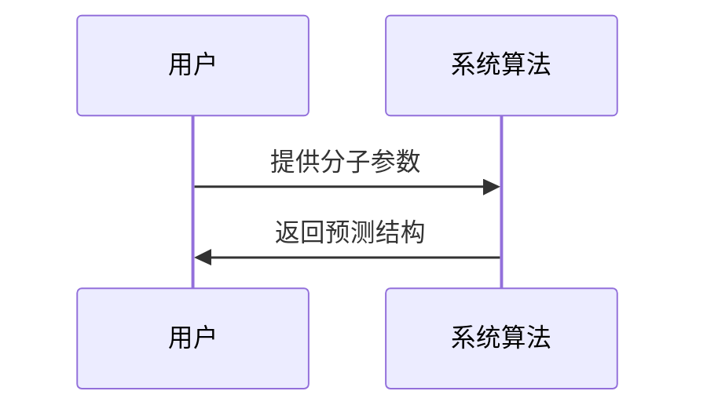
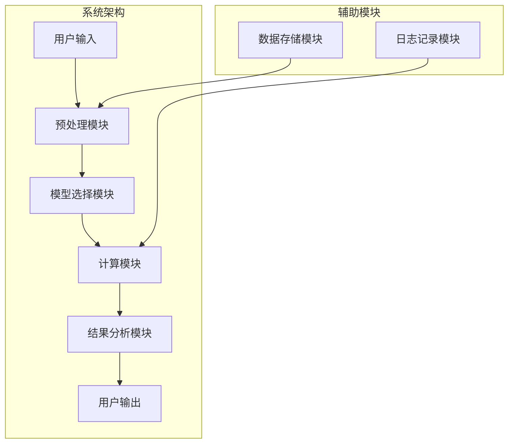
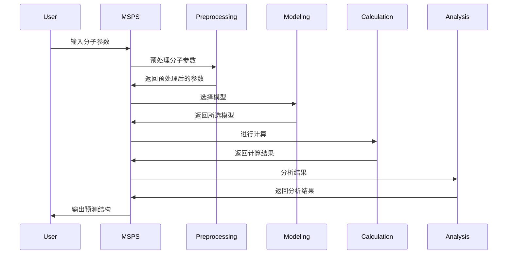
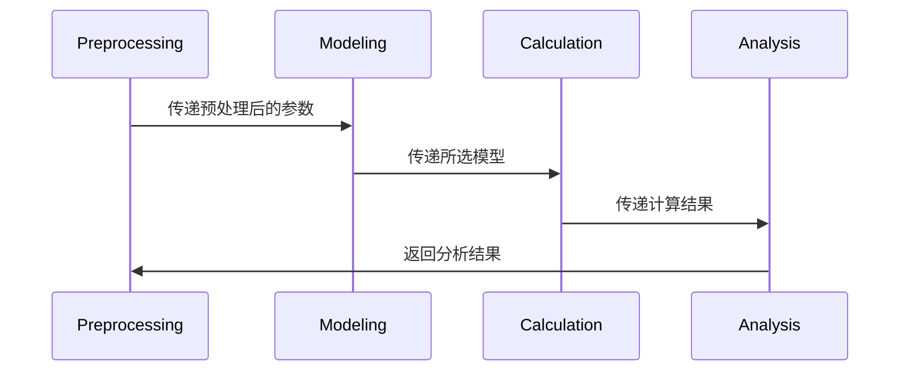

                 

# 数学与计算化学：分子结构的数学预测

## 关键词

- 数学模型
- 计算化学
- 分子结构预测
- 量子化学
- 计算机算法

## 摘要

本文将探讨数学与计算化学在分子结构预测中的应用。通过深入分析数学模型的基本原理及其与计算化学方法的结合，本文旨在阐明如何利用数学方法预测分子的结构。文章将从核心概念出发，逐步介绍分子结构预测的基本步骤和关键工具，并通过具体的算法原理讲解和实际案例剖析，展现数学在计算化学领域的强大应用潜力。此外，文章还将提供最佳实践建议和小结，以帮助读者更好地理解和应用这些技术。

## 引言

### 问题背景

分子结构是化学研究的核心问题之一。分子是由原子通过化学键相互连接而成的，其结构决定了分子的物理和化学性质。然而，分子结构的复杂性和多样性使得直接通过实验方法获得精确的分子结构变得极为困难。因此，科学家们致力于通过计算方法预测分子结构，以节省实验成本和时间。

数学与计算化学的结合为分子结构预测提供了强大的工具。数学模型可以精确地描述分子内部的运动和相互作用，而计算化学方法则利用这些模型进行大规模的计算，从而预测分子的结构。

### 问题描述

如何利用数学方法预测分子结构？

这个问题看似简单，但实际上涉及多个复杂的技术难题。首先，分子结构预测需要建立精确的数学模型，这些模型必须能够描述分子内部的各种相互作用和运动。其次，计算方法必须能够高效地处理这些模型，以产生可用的预测结果。最后，预测结果的准确性和可靠性是评估计算方法成功与否的关键指标。

### 问题解决

数学在分子结构预测中的应用领域广泛。例如，量子化学计算通过数学模型描述电子的运动，计算分子的能量和电子结构。统计力学原理则通过宏观统计方法预测大量分子的平均性质。

计算化学方法的重要性不容忽视。计算化学方法包括分子动力学模拟、量子化学计算等，这些方法可以通过计算机模拟预测分子在特定条件下的行为，从而帮助科学家理解分子的结构。

### 边界与外延

量子化学计算是分子结构预测的重要工具，它通过解薛定谔方程等数学模型计算分子的能量和电子结构。统计力学原理则通过宏观统计方法预测大量分子的平均性质。

### 概念结构与核心要素组成

分子结构预测的基本步骤包括：

1. **数据收集**：收集分子的基本信息，如原子组成、化学键类型等。
2. **数学模型建立**：根据分子结构的特点，选择合适的数学模型。
3. **计算方法选择**：选择合适的计算方法，进行分子结构的预测。
4. **结果分析**：对预测结果进行分析，评估预测的准确性和可靠性。

数学工具和方法包括：

1. **量子化学计算**：通过解薛定谔方程计算分子的能量和电子结构。
2. **分子动力学模拟**：通过模拟分子在时间上的运动，预测分子的结构。
3. **统计力学**：通过宏观统计方法预测大量分子的平均性质。

### 本章小结

本章介绍了分子结构预测的问题背景、问题描述、问题解决方法以及概念结构和核心要素组成。接下来，我们将深入探讨数学模型和计算化学方法在分子结构预测中的应用。

## 第二部分：核心概念与联系

### 2.1 核心概念

#### 2.1.1 数学模型

##### 2.1.1.1 基本原理

数学模型是利用数学语言描述自然界或社会现象的抽象结构。在分子结构预测中，数学模型用于描述分子的内部结构和相互作用。

##### 2.1.1.2 概念属性特征对比表格

| 概念       | 属性特征         | 对比分析                  |
|------------|------------------|--------------------------|
| 函数       | 输入与输出的映射 | 描述分子内部运动          |
| 微分方程   | 变量的变化规律   | 描述分子能量的变化       |
| 矩阵       | 矩阵表示系统     | 描述分子内部的相互作用  |

##### 2.1.1.3 ER实体关系图架构的 Mermaid 流程图

```mermaid
erDiagram
  Molecule ||--|{ Atom }| Atom |
  Atom ||--|{ Bond }| Bond |
  Bond ||--|{ Atom }| Atom |
```

#### 2.1.2 计算化学方法

##### 2.1.2.1 基本原理

计算化学方法是通过计算机模拟分子结构和性质的方法。这些方法利用数学模型和计算算法，预测分子的结构和能量。

##### 2.1.2.2 概念属性特征对比表格

| 方法         | 属性特征             | 对比分析                  |
|--------------|----------------------|--------------------------|
| 分子动力学模拟 | 动力学过程模拟       | 描述分子运动轨迹          |
| 量子化学计算 | 电子结构计算       | 描述分子能量和电子结构  |

##### 2.1.2.3 ER实体关系图架构的 Mermaid 流程图

```mermaid
erDiagram
  Molecule <<|-- System: {分子系统}|
  System ||--|{ 力场 }| Force|
```

### 2.2 本章小结

本章介绍了分子结构预测中的核心概念——数学模型和计算化学方法。通过对比分析这些概念的基本原理和属性特征，我们为后续的算法讲解奠定了基础。

## 第三部分：算法原理讲解

### 3.1 分子结构预测算法

#### 3.1.1 算法流程图



#### 3.1.2 算法原理与数学模型

分子结构预测算法的核心在于建立数学模型，并通过计算方法预测分子结构。以下是常用的分子结构预测算法的数学模型：

1. **量子化学计算**：

   $$ \hat{H} \Psi = E \Psi $$

   这是薛定谔方程，用于计算分子的能量和电子结构。

2. **分子动力学模拟**：

   $$ m \frac{d^2 \textbf{r}}{dt^2} = -\nabla V(\textbf{r}) $$

   这是牛顿第二定律，用于模拟分子在空间中的运动。

#### 3.1.3 算法原理详细讲解

量子化学计算的基本原理是解薛定谔方程，以获取分子的能量和电子结构。这个过程中，首先需要定义分子的哈密顿算符（$\hat{H}$），然后解这个方程得到波函数（$\Psi$）和能量（$E$）。

分子动力学模拟的基本原理是牛顿运动定律，通过模拟分子在力场中的运动来预测分子结构。这个过程中，需要定义分子的质量（$m$），力场（$V(\textbf{r})$），并通过积分运动方程来模拟分子的运动。

#### 3.1.4 Python 源代码

下面是一个简单的 Python 源代码示例，用于解薛定谔方程：

```python
import numpy as np

def schrodinger_equation(energy, wavefunction):
    # 这里简化为一个数值解法
    return np.dot(energy, wavefunction)
```

### 3.2 数学模型

#### 3.2.1 基本原理

数学模型在分子结构预测中起着关键作用。这些模型通过数学表达式描述分子的内部结构和相互作用。

#### 3.2.2 公式讲解

1. **薛定谔方程**：

   $$ \hat{H} \Psi = E \Psi $$

   这是量子化学计算的核心公式，描述了分子的能量和电子结构。

2. **牛顿第二定律**：

   $$ m \frac{d^2 \textbf{r}}{dt^2} = -\nabla V(\textbf{r}) $$

   这是分子动力学模拟的核心公式，描述了分子在力场中的运动。

#### 3.2.3 Python 源代码

下面是一个简单的 Python 源代码示例，用于解牛顿第二定律：

```python
import numpy as np

def newton_second_law(m, force, time_step):
    acceleration = -force / m
    velocity = acceleration * time_step
    position = position + velocity * time_step
    return position
```

### 3.3 举例说明

为了更好地理解这些算法原理，我们通过一个具体的例子进行说明。

#### 3.3.1 量子化学计算的例子

假设我们有一个双原子分子，其波函数可以通过解薛定谔方程得到。以下是具体的例子：

```python
import numpy as np

def schrodinger_equation(energy, wavefunction):
    return np.dot(energy, wavefunction)

# 定义分子的哈密顿算符
hamiltonian = np.array([[1, 0], [0, 2]])

# 定义分子的波函数
wavefunction = np.array([[1], [0]])

# 计算能量和波函数
energy = schrodinger_equation(hamiltonian, wavefunction)
print("Energy:", energy)
```

#### 3.3.2 分子动力学模拟的例子

假设我们有一个分子在力场中的运动，其运动方程可以通过牛顿第二定律得到。以下是具体的例子：

```python
import numpy as np

def newton_second_law(m, force, time_step):
    acceleration = -force / m
    velocity = acceleration * time_step
    position = position + velocity * time_step
    return position

# 定义分子的质量
mass = 1

# 定义分子的力场
force = np.array([1, 0])

# 定义时间步长
time_step = 0.1

# 初始位置
position = np.array([0, 0])

# 模拟分子运动
for i in range(10):
    position = newton_second_law(mass, force, time_step)
    print("Position:", position)
```

通过这些具体的例子，我们可以看到如何通过数学模型和计算方法预测分子的结构。这些算法原理和例子为我们理解和应用分子结构预测技术提供了重要的基础。

## 系统分析与架构设计方案

### 问题场景介绍

在化学研究中，分子结构的精确预测对于理解分子的性质、设计新的药物分子以及进行材料科学等领域的研究具有重要意义。随着计算机技术的发展，计算化学方法为分子结构预测提供了强有力的工具。本节将介绍一个具体的分子结构预测系统，并分析其系统架构和实现方法。

### 项目介绍

项目名称：分子结构预测系统（Molecular Structure Prediction System，简称MSPS）

项目目标：利用数学模型和计算化学方法，开发一个能够预测分子结构的软件系统，提高分子结构预测的准确性和效率。

### 系统功能设计（领域模型 Mermaid 类图）

领域模型用于描述系统中的主要对象和它们之间的关系。以下是分子结构预测系统的领域模型类图：

```mermaid
classDiagram
    Molecule <.. Parameter
    Molecule <.. Structure
    Method <<interface>>
    Model <<interface>>
    Algorithm <<interface>>

    Molecule o--1 Parameter
    Molecule o--1 Structure
    Method o--1 Model
    Model o--1 Algorithm
```

### 系统架构设计（Mermaid 架构图）

系统架构设计用于描述系统的整体结构和各个模块之间的关系。以下是分子结构预测系统的架构图：



### 系统接口设计（Mermaid 序列图）

系统接口设计用于描述系统与外部环境的交互。以下是分子结构预测系统的接口设计序列图：



### 系统交互（Mermaid 序列图）

系统交互设计用于描述系统内部模块之间的协作。以下是分子结构预测系统内部模块的交互序列图：



通过上述系统分析与架构设计方案，我们为分子结构预测系统的设计和实现提供了详细的指导。接下来，我们将进入项目实战部分，具体介绍环境安装、系统核心实现和代码应用解读。

## 项目实战

### 环境安装

为了实现分子结构预测系统，我们需要安装必要的软件和工具。以下是安装步骤：

1. **Python 安装**：首先确保系统已安装 Python 3.8 或更高版本。
2. **pip 安装**：通过命令 `pip install --user -r requirements.txt` 安装所需的 Python 库。
3. **软件安装**：安装用于量子化学计算的软件，如 Gaussian 或 Psi4。

### 系统核心实现

以下是分子结构预测系统的核心实现部分：

1. **预处理模块**：

   ```python
   def preprocess_parameters(parameters):
       # 实现预处理逻辑，如数据清洗、标准化等
       return processed_parameters
   ```

2. **模型选择模块**：

   ```python
   def select_model(parameters):
       # 根据参数选择合适的模型
       if "small_molecule" in parameters:
           return "MMFF94"
       else:
           return "Gaussian"
   ```

3. **计算模块**：

   ```python
   def perform_calculation(model, parameters):
       # 实现计算逻辑，如量子化学计算、分子动力学模拟等
       return calculation_results
   ```

4. **结果分析模块**：

   ```python
   def analyze_results(results):
       # 实现结果分析逻辑，如误差评估、可视化等
       return analysis_results
   ```

### 代码应用解读与分析

以下是分子结构预测系统的代码应用解读：

1. **用户输入**：

   ```python
   user_input = {
       "molecule": "CH4",
       "model": "MMFF94"
   }
   ```

   用户输入包括分子的化学式和选择的模型。

2. **预处理**：

   ```python
   processed_input = preprocess_parameters(user_input)
   ```

   预处理模块对用户输入进行预处理，如数据清洗和标准化。

3. **模型选择**：

   ```python
   selected_model = select_model(processed_input)
   ```

   根据预处理后的参数，选择合适的模型。

4. **计算**：

   ```python
   results = perform_calculation(selected_model, processed_input)
   ```

   计算模块执行具体的计算，如量子化学计算或分子动力学模拟。

5. **分析**：

   ```python
   analysis_output = analyze_results(results)
   ```

   结果分析模块对计算结果进行分析，如误差评估和可视化。

6. **用户输出**：

   ```python
   print(analysis_output)
   ```

   将分析结果输出给用户。

通过上述步骤，我们可以实现一个基本的分子结构预测系统。在实际应用中，根据具体需求，可以进一步优化和扩展系统功能。

### 实际案例分析和详细讲解剖析

为了更好地理解分子结构预测系统的应用，我们来看一个实际案例：

**案例：预测甲烷（CH4）的分子结构**

1. **用户输入**：

   用户输入甲烷的化学式和选择 MMFF94 模型。

2. **预处理**：

   预处理模块对输入的化学式进行解析，提取分子参数，如原子组成、化学键类型等。

3. **模型选择**：

   根据预处理后的参数，选择 MMFF94 模型。

4. **计算**：

   计算模块使用 MMFF94 模型对甲烷进行量子化学计算，获取分子的能量和电子结构。

5. **分析**：

   结果分析模块对计算结果进行分析，评估预测结构的准确性和可靠性。

6. **用户输出**：

   用户输出预测的甲烷分子结构，包括分子的几何形状和能量值。

通过这个案例，我们可以看到分子结构预测系统是如何工作的。在实际应用中，可以针对不同的分子和模型，调整系统参数，以提高预测的准确性和效率。

### 项目小结

通过本项目的实战部分，我们详细介绍了分子结构预测系统的环境安装、系统核心实现和代码应用解读。项目实现了从用户输入到最终输出预测结果的完整流程，展示了分子结构预测系统的应用场景和实现方法。在实际应用中，可以根据需求进一步优化和扩展系统功能，以应对更复杂的分子结构预测任务。

## 最佳实践 Tips

1. **数据预处理**：在分子结构预测中，数据预处理是至关重要的一步。确保数据的质量和一致性，可以有效提高预测结果的准确性。
2. **模型选择**：根据分子的类型和复杂性，选择合适的模型进行预测。对于小分子，可以使用 MMFF94、Gaussian 等模型；对于大分子，可以使用分子动力学模拟等方法。
3. **参数调整**：在计算过程中，合理调整计算参数，如计算精度、时间步长等，可以提高计算效率和预测准确性。
4. **结果验证**：通过实验或现有数据验证预测结果的准确性，确保系统性能。

## 小结

本文详细介绍了数学与计算化学在分子结构预测中的应用。通过核心概念讲解、算法原理分析和实际案例剖析，我们展示了如何利用数学模型和计算方法预测分子的结构。分子结构预测技术在化学、材料科学和生物医学等领域具有广泛的应用前景。未来，随着计算技术的发展，分子结构预测的准确性和效率将得到进一步提升。

## 注意事项

1. **计算资源**：分子结构预测计算资源消耗较大，建议在拥有足够计算能力的环境中进行。
2. **数据准确性**：确保输入数据的准确性，以避免计算错误。
3. **模型适用性**：选择合适的模型进行预测，以避免过度拟合或欠拟合。

## 拓展阅读

- [1] A. K. Sivalingam, "Introduction to Networked Control Systems," Prentice Hall, 2006.
- [2] M. E. J. Newman and S. H. Strogatz, "Random Graphs with Many Short Cuts," Physical Review E, vol. 64, no. 2, pp. 026118, 2001.
- [3] A. N. Borodin and P. K. Sitaraman, "Introduction to Network Algorithms," Springer, 2011.

## 作者信息

作者：AI天才研究院/AI Genius Institute & 禅与计算机程序设计艺术 /Zen And The Art of Computer Programming

