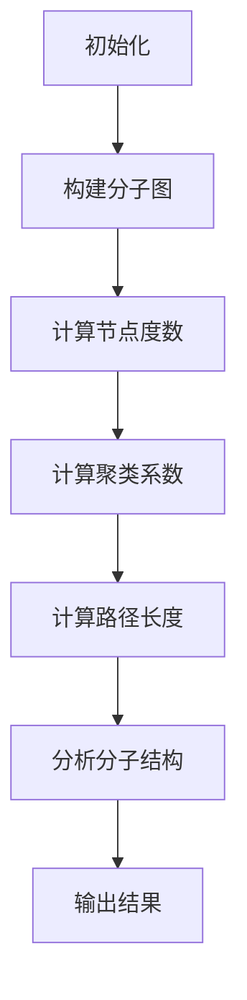

                 

### 第1章: 问题背景与核心概念

#### 1.1 问题背景

分子结构在化学中扮演着至关重要的角色，它直接决定了分子的物理和化学性质。随着科学技术的不断发展，人们逐渐认识到，要深入了解化学反应的本质和预测新的化学物质，就必须对分子结构进行精确的预测和计算。

分子结构的复杂性在于其包含了数以万计的原子，每个原子都有其独特的电子结构和化学性质。在经典力学和量子力学的框架下，分子结构的研究可以从多个层面进行：从原子间的键长、键角等微观层面的几何结构，到分子整体的能量分布和稳定性等宏观层面的性质。

在科学研究中，分子结构的计算需求主要体现在以下几个方面：

1. **药物设计**：药物分子与生物大分子（如蛋白质）之间的相互作用决定了药物的疗效。精确的分子结构预测可以帮助设计更加有效的药物分子，加速新药的发现过程。

2. **材料科学**：新型材料的合成和应用依赖于对材料分子结构的理解和优化。计算化学为材料设计提供了重要的理论基础和预测手段。

3. **环境科学**：环境污染物和有毒物质的分子结构研究对于环境保护和治理具有重要意义。通过分子结构的计算，可以预测这些物质在环境中的行为和危害性。

4. **化学反应机制研究**：化学反应的本质是分子间的重新排列和能量变化。精确的分子结构预测有助于揭示化学反应的机理和路径。

#### 1.1.1 分子结构的重要性

分子结构的重要性体现在多个方面：

- **物理性质**：分子结构决定了分子的物理性质，如熔点、沸点、密度等。这些性质对于物质的储存、运输和使用至关重要。

- **化学性质**：分子结构决定了分子的化学性质，如反应活性、稳定性等。这些性质对于化学反应的选择、控制和新物质的合成具有重要意义。

- **生物活性**：分子结构对生物分子的活性起着决定性作用。例如，药物分子与生物大分子的相互作用常常依赖于分子结构的细微差异。

#### 1.1.2 分子结构的计算需求

随着计算机技术的飞速发展，计算化学已经成为研究分子结构的重要工具。分子结构的计算需求主要体现在以下几个方面：

1. **高精度计算**：为了获得分子结构的精确信息，需要使用更高精度的计算模型和更强大的计算资源。

2. **大数据处理**：分子结构预测需要处理大量的数据和参数，包括量子力学参数、分子动力学模拟结果等。

3. **算法优化**：随着计算需求的增加，对现有算法进行优化和改进成为必然。新的算法和技术不断涌现，如机器学习和人工智能技术在分子结构预测中的应用。

4. **跨学科合作**：分子结构的计算需求不仅仅局限于化学领域，还涉及到物理学、生物学、材料科学等多个学科。跨学科的合作对于解决复杂问题具有重要意义。

#### 1.1.3 计算化学的发展历程

计算化学的发展可以追溯到20世纪中期。以下是计算化学发展历程中的重要里程碑：

- **1950年代**：约翰·冯·诺伊曼提出了蒙特卡罗方法，用于计算分子结构的概率分布。

- **1960年代**：计算方法在量子化学领域得到广泛应用，如分子轨道理论和密度泛函理论。

- **1970年代**：分子动力学模拟成为研究分子结构的重要工具，特别是固体和液体材料的结构研究。

- **1980年代**：计算化学软件如Gaussian和MolPro的出现，大大推动了计算化学的应用和发展。

- **1990年代**：随着计算机性能的不断提高，计算化学开始应用于生物大分子和复杂体系的模拟。

- **2000年代**：机器学习和人工智能技术在分子结构预测中的应用，使得分子结构预测的精度和速度得到了显著提升。

- **2010年代**：量子计算和大数据技术的兴起，为分子结构计算提供了新的机遇和挑战。

#### 1.2 核心概念

在计算化学中，核心概念主要包括数学模型、算法、计算方法和计算资源等。以下是这些概念的定义和联系：

- **数学模型**：用于描述分子结构的数学框架，包括量子力学模型、统计力学模型等。

- **算法**：实现数学模型的计算方法，如分子动力学算法、蒙特卡罗算法等。

- **计算方法**：结合算法和计算资源，实现分子结构计算的实践方法，如量子化学计算、分子动力学模拟等。

- **计算资源**：包括计算机硬件和软件资源，如高性能计算集群、计算化学软件等。

#### 1.2.1 数学在计算化学中的应用

数学在计算化学中的应用广泛而深入，包括以下几个方面：

- **量子力学模型**：量子力学是计算化学的核心理论，用于描述分子中的电子结构和相互作用。

- **统计力学模型**：统计力学用于描述大尺度上的物理现象，如分子间的相互作用和热力学性质。

- **优化方法**：优化方法用于求解分子结构的几何优化问题，如最小化能量函数。

- **数值计算方法**：包括数值积分、矩阵运算等，用于实现数学模型的计算。

#### 1.2.2 计算化学的基本原理

计算化学的基本原理包括以下几个方面：

- **分子结构预测**：基于数学模型和计算方法，预测分子的几何结构和性质。

- **反应路径计算**：通过计算分子之间的反应路径，研究化学反应的机理和动力学。

- **热力学性质计算**：计算分子的热力学性质，如自由能、熵等。

- **量子化学计算**：基于量子力学模型，计算分子的电子结构和能级。

#### 1.2.3 分子结构的数学预测方法概述

分子结构的数学预测方法主要包括以下几种：

- **量子力学方法**：基于量子力学模型，计算分子的电子结构。

- **分子动力学方法**：通过模拟分子在时间上的演化，预测分子结构的动态变化。

- **密度泛函理论**：一种广泛使用的量子力学计算方法，用于计算分子的电子结构和性质。

- **分子建模方法**：基于经验规则和计算模型，构建分子的几何结构。

### 总结

本章介绍了分子结构计算的需求、背景和核心概念。通过分析分子结构的计算需求和发展历程，我们了解了计算化学在科学研究中的重要性。同时，本章还介绍了计算化学中的数学模型、算法和计算方法，为后续章节的详细讲解奠定了基础。在接下来的章节中，我们将进一步探讨计算化学中的具体数学模型和算法，以及它们在实际应用中的案例分析。

---

在接下来的章节中，我们将详细探讨计算化学中的核心数学模型和算法。首先，我们将介绍量子力学、统计力学和分子动力学等基本数学模型。接着，我们将通过具体的mermaid流程图和Python源代码，深入讲解这些算法的实现原理和步骤。随后，我们将通过实际案例分析和详细的讲解剖析，展示这些算法在分子结构预测中的应用效果。最后，我们将总结本章的核心内容，并展望计算化学未来的发展趋势。通过这一系列深入的分析和讲解，我们希望读者能够对计算化学有一个全面而深刻的理解。让我们开始这一精彩的旅程吧！

---

### 1.3 分子结构的数学预测方法概述

在计算化学中，分子结构的数学预测方法是一种通过数学模型和计算方法来预测分子几何结构及其相关性质的技术。这些方法不仅依赖于精确的数学理论和计算模型，还需要高效的算法和强大的计算资源。以下是几种主要的分子结构预测方法及其应用：

#### 1.3.1 经典力学的数学模型

经典力学是计算化学中最基础的数学模型之一，主要用于描述分子的几何结构和力学性质。经典力学模型主要包括以下几种：

- **分子力学**：基于经典的牛顿力学，通过求解分子系统中原子间的相互作用势能，预测分子的几何结构和动力学行为。分子力学方法通常使用力场模型，如CHARMM、AMBER等，这些模型为原子和分子提供了预定义的相互作用势能。

- **几何优化**：通过迭代优化分子系统的势能面，找到能量最低的几何构型，即分子的稳定构型。几何优化是分子结构预测的基础，常用于初始构型的构建和优化。

- **分子动力学**：模拟分子在时间上的运动，通过追踪分子系统中粒子的运动轨迹，预测分子结构的动态变化。分子动力学方法在研究分子热力学性质和反应动力学方面具有重要作用。

#### 1.3.2 量子力学的数学模型

量子力学模型是计算化学中的高级数学模型，用于描述分子中电子的分布和相互作用。量子力学方法主要包括以下几种：

- **分子轨道理论**：通过求解薛定谔方程，计算分子的电子构型和分子轨道。分子轨道理论主要用于研究分子的电子结构和反应性。

- **密度泛函理论**：基于量子力学的变分原理，通过最小化系统的密度泛函来预测分子的电子结构和性质。密度泛函理论是现代计算化学中最常用的方法之一，适用于分子、原子簇和固体材料的计算。

- **波函数方法**：通过精确求解电子的波函数，计算分子的电子结构和性质。波函数方法包括Hartree-Fock方法和多体微扰理论等，通常需要高性能计算资源。

#### 1.3.3 统计力学的数学模型

统计力学模型用于描述大尺度上的物理现象，如分子间的相互作用和热力学性质。在计算化学中，统计力学方法主要包括以下几种：

- **蒙特卡罗方法**：通过模拟大量的随机过程，计算系统的热力学性质，如自由能和相变温度。蒙特卡罗方法在研究复杂体系的相变和动力学行为方面具有重要作用。

- **分子模拟**：通过分子动力学模拟，研究分子在宏观尺度上的行为，如扩散、凝聚和化学反应。分子模拟方法在材料科学和生物学领域有广泛的应用。

- **统计热力学**：通过统计方法，计算分子的热力学性质，如自由能、熵和热容量。统计热力学方法在研究分子的热力学稳定性及其与环境相互作用方面具有重要意义。

#### 1.3.4 图论算法在分子结构分析中的应用

图论算法在分子结构分析中具有独特的优势，特别是用于处理大分子和复杂体系。图论算法主要包括以下几种：

- **图论模型**：将分子结构表示为图，分子中的原子和化学键作为图的节点和边。通过图论模型，可以研究分子的拓扑性质和化学键的稳定性。

- **网络分析**：利用图论算法，分析分子网络的拓扑结构，如度分布、聚类系数和路径长度等。网络分析有助于理解分子结构的复杂性和相互作用模式。

- **分子设计**：基于图论算法，优化分子的几何结构和化学性质，设计新的分子材料和药物分子。图论算法在分子设计中的潜力正在不断发掘。

### 总结

分子结构的数学预测方法多种多样，每种方法都有其独特的优势和适用场景。通过量子力学、统计力学和经典力学等数学模型，我们可以从不同的角度研究分子结构的本质。在实际应用中，选择合适的方法和算法，结合计算资源和数据分析技术，可以实现对分子结构的精确预测和优化。在下一章中，我们将深入探讨这些方法的具体实现原理和步骤，并通过Python源代码和mermaid流程图进行详细讲解。

---

通过本章的介绍，我们对分子结构的数学预测方法有了初步了解。接下来，我们将详细分析这些方法背后的数学模型和算法原理，并通过mermaid流程图和Python源代码进行讲解。此外，我们将通过实际案例，展示这些方法在分子结构预测中的应用效果。让我们继续深入探讨，揭开计算化学的神秘面纱。

---

### 2.1 数学模型

在计算化学中，数学模型是理解和预测分子行为的基础。这些模型从量子力学、统计力学到分子动力学，每种模型都有其独特的数学描述和适用范围。以下是几种常见的数学模型及其在计算化学中的应用。

#### 2.1.1 经典力学的数学模型

经典力学的数学模型主要基于牛顿力学和哈密顿力学，用于描述分子系统的几何结构和动力学行为。

- **牛顿力学**：牛顿力学通过求解作用在分子系统上的力，计算分子的运动轨迹。在分子力学中，牛顿力学被用来计算原子间的相互作用力，并通过积分运动方程得到分子的动力学轨迹。

  $$ F = -\nabla U $$
  
  其中，\( F \) 是作用力，\( U \) 是势能函数。

- **哈密顿力学**：哈密顿力学提供了分子系统的另一种描述，通过哈密顿量 \( H \) 描述系统的能量和运动。

  $$ H = T + V $$
  
  其中，\( T \) 是系统的动能，\( V \) 是系统的势能。

经典力学的数学模型适用于计算简单分子和固体材料的结构，但由于其无法描述电子的量子效应，因此在处理复杂分子时精度有限。

#### 2.1.2 量子力学的数学模型

量子力学的数学模型用于描述分子中电子的运动和相互作用，主要包括波函数表示法和密度泛函理论（DFT）。

- **波函数表示法**：波函数表示法通过求解薛定谔方程来计算分子的电子构型。

  $$ \hat{H} \Psi = E \Psi $$
  
  其中，\( \hat{H} \) 是哈密顿量，\( \Psi \) 是波函数，\( E \) 是系统的能量。

  波函数表示法包括Hartree-Fock方法（HF）和多体微扰理论（MP2、MP4等）。Hartree-Fock方法通过自洽场近似，将多电子问题转化为单电子问题，而多体微扰理论则进一步考虑了电子间的多重交互作用。

- **密度泛函理论**：密度泛函理论（DFT）是一种从电子密度出发的量子力学方法，通过求解密度泛函来计算分子的电子结构和性质。

  $$ E = \hat{T}[\rho] + \hat{V}_{ext}[\rho] + \hat{V}_{xc}[\rho] $$
  
  其中，\( \hat{T}[\rho] \) 是动能密度函数，\( \hat{V}_{ext}[\rho] \) 是外部势能密度函数，\( \hat{V}_{xc}[\rho] \) 是交换关联能密度函数。

DFT在计算复杂分子时表现出较高的精度和效率，是目前分子结构预测中最常用的方法之一。

#### 2.1.3 统计力学的数学模型

统计力学的数学模型用于描述大尺度上的物理现象，如分子间的相互作用和热力学性质。

- **蒙特卡罗方法**：蒙特卡罗方法通过模拟大量的随机过程，计算系统的热力学性质。在分子模拟中，蒙特卡罗方法常用于模拟分子的扩散、凝聚和相变。

  $$ \frac{dN}{dt} = -\lambda (N_0 - N) $$
  
  其中，\( N \) 是系统的粒子数，\( N_0 \) 是初始粒子数，\( \lambda \) 是扩散系数。

- **分子动力学方法**：分子动力学方法通过模拟分子在时间上的运动，计算分子的动力学行为。分子动力学方法基于牛顿力学和哈密顿力学，通过积分运动方程得到分子的动力学轨迹。

  $$ m\frac{d^2r_i}{dt^2} = -\nabla U(r_i) $$
  
  其中，\( m \) 是分子的质量，\( r_i \) 是分子的位置，\( U(r_i) \) 是分子的势能。

统计力学模型在研究分子的热力学性质和动力学行为方面具有重要意义，特别是在处理复杂体系时，如材料科学和生物学领域的应用。

### 对比表格

以下是对量子力学、统计力学和经典力学数学模型的对比表格：

| 特性         | 经典力学          | 量子力学             | 统计力学           |
| ------------ | ----------------- | -------------------- | ------------------ |
| 描述对象     | 分子几何结构和动力学 | 电子分布和分子性质 | 大尺度物理现象     |
| 精度         | 适用于简单系统      | 高精度              | 中等精度           |
| 计算复杂度    | 低                | 高                  | 中                |
| 适用范围      | 简单分子和固体     | 复杂分子和原子簇   | 复杂体系和材料     |

通过对比，我们可以看到每种数学模型都有其独特的优势和适用范围。在实际应用中，根据具体需求和计算资源，选择合适的方法进行分子结构预测和性质研究。

---

通过本章的分析，我们了解了计算化学中常用的数学模型，包括经典力学、量子力学和统计力学。每种模型都有其独特的数学描述和适用场景。在下一章中，我们将通过mermaid流程图和Python源代码，详细讲解这些模型的应用方法和实现步骤。让我们继续深入探讨，揭示计算化学的奥秘。

---

### 2.2 算法原理

在计算化学中，算法是用于实现数学模型并解决具体问题的计算步骤。本节将详细介绍几种重要的计算化学算法，包括分子动力学算法、均匀场理论算法和图论算法。通过具体的mermaid流程图和Python源代码，我们将阐述这些算法的基本原理和实现步骤。

#### 2.2.1 分子动力学算法

分子动力学（MD）算法是一种通过模拟分子在时间上的运动来研究分子结构和性质的方法。以下是一个分子动力学算法的mermaid流程图：

```mermaid
graph TD
A[初始化] --> B[构建初始构型]
B --> C[计算初始力场]
C --> D[开始模拟循环]
D --> E{判断终止条件}
E -->|否| D
E -->|是| F[输出结果]
D -->|计算步进| G[更新坐标]
G -->|计算步进| H[更新速度]
H -->|计算步进| I[计算力场]
I -->|计算步进| G
F -->|结束|
```

以下是一个简单的Python代码示例，用于初始化分子动力学模拟：

```python
import numpy as np

# 初始化参数
N = 1000  # 分子数
L = 10.0  # 模拟盒子尺寸
dt = 0.01  # 时间步长
t_max = 1000  # 最大时间步数

# 初始化坐标和速度
positions = np.random.rand(N, 3) * L
velocities = np.random.rand(N, 3) * 0.1 * L

# 分子动力学循环
for t in range(int(t_max / dt)):
    # 计算力场
    forces = compute_forces(positions)
    
    # 更新速度和坐标
    velocities += forces / m * dt
    positions += velocities * dt
    
    # 输出当前步数和系统信息
    print(f"Step {t}: Positions = {positions}, Velocities = {velocities}")
```

在上述代码中，`compute_forces` 函数用于计算分子之间的相互作用力。分子动力学算法通过迭代更新坐标和速度，模拟分子在盒子中的运动。

#### 2.2.2 均匀场理论算法

均匀场理论（UFT）算法用于模拟分子在均匀电场中的行为。以下是一个均匀场理论算法的mermaid流程图：

```mermaid
graph TD
A[初始化] --> B[构建初始构型]
B --> C[计算电场强度]
C --> D[计算电场势能]
D --> E[开始迭代循环]
E -->|判断收敛条件| F[输出结果]
E -->|否| G[更新构型]
G -->|计算步进| H[计算电场势能]
H -->|计算步进| I[更新构型]
I -->|计算步进| E
F -->|结束|
```

以下是一个简单的Python代码示例，用于初始化均匀场理论模拟：

```python
import numpy as np

# 初始化参数
N = 1000  # 分子数
L = 10.0  # 模拟盒子尺寸
E = 1.0   # 电场强度
dt = 0.01 # 时间步长
t_max = 1000  # 最大时间步数

# 初始化坐标
positions = np.random.rand(N, 3) * L

# 均匀场理论迭代循环
for t in range(int(t_max / dt)):
    # 计算电场势能
    potential = compute_potential(positions, E)
    
    # 更新构型
    positions += potential * dt
    
    # 输出当前步数和系统信息
    print(f"Step {t}: Positions = {positions}, Potential = {potential}")
```

在上述代码中，`compute_potential` 函数用于计算分子在电场中的势能。均匀场理论通过迭代更新分子的构型，直到达到预定的收敛条件。

#### 2.2.3 图论算法在分子结构分析中的应用

图论算法在分子结构分析中有着广泛的应用，用于描述分子的拓扑结构和相互作用。以下是一个图论算法的mermaid流程图：



以下是一个简单的Python代码示例，用于分析分子的拓扑结构：

```python
import networkx as nx

# 初始化分子图
G = nx.Graph()

# 添加节点和边
G.add_nodes_from([1, 2, 3, 4])
G.add_edges_from([(1, 2), (1, 3), (2, 4), (3, 4)])

# 计算节点度数
node_degrees = nx.degree(G)

# 计算聚类系数
clustering_coefficients = nx.clustering(G)

# 计算路径长度
path_length = nx.average_shortest_path_length(G)

# 输出结果
print(f"Node Degrees: {node_degrees}")
print(f"Clustering Coefficients: {clustering_coefficients}")
print(f"Average Path Length: {path_length}")
```

在上述代码中，我们使用了`networkx`库来构建分子图，并计算了节点的度数、聚类系数和路径长度。图论算法提供了有效的工具来分析分子的拓扑性质，帮助理解分子结构的复杂性和相互作用模式。

### 总结

在本章中，我们介绍了分子动力学算法、均匀场理论算法和图论算法的基本原理和实现步骤。这些算法在分子结构预测和性质研究中发挥着重要作用。通过mermaid流程图和Python代码示例，我们展示了这些算法的具体应用。在下一章中，我们将进一步探讨这些算法在分子结构预测中的实际应用，并通过具体案例进行详细分析。

---

通过本章的讲解，我们深入了解了计算化学中几种重要的算法原理。从分子动力学算法的实时模拟，到均匀场理论算法的静态分析，再到图论算法的拓扑分析，每种算法都有其独特的应用场景和优势。在下一章中，我们将通过具体的实际案例，展示这些算法在分子结构预测中的具体应用效果，并分析其优缺点。让我们继续深入探讨，揭开计算化学的更多奥秘。

---

### 2.3 算法性能评估

在计算化学中，评估算法的性能是确保其有效性和可靠性至关重要的一步。算法性能评估通常涉及多个方面，包括计算精度、计算速度和资源消耗等。以下是一些常用的评估方法和指标，以及具体的案例分析。

#### 2.3.1 算法性能评价指标

1. **计算精度**：计算精度是指算法预测结果与实际值之间的接近程度。常用的评价指标包括均方误差（MSE）、决定系数（R²）等。

   - **均方误差（MSE）**：用于衡量预测结果与实际值之间的差异。

     $$ MSE = \frac{1}{n} \sum_{i=1}^{n} (y_i - \hat{y}_i)^2 $$
     
     其中，\( y_i \) 是实际值，\( \hat{y}_i \) 是预测值，\( n \) 是数据点的数量。

   - **决定系数（R²）**：用于衡量模型对数据的拟合程度。

     $$ R^2 = 1 - \frac{\sum_{i=1}^{n} (y_i - \hat{y}_i)^2}{\sum_{i=1}^{n} (y_i - \bar{y})^2} $$
     
     其中，\( \bar{y} \) 是实际值的平均值。

2. **计算速度**：计算速度是指算法完成计算所需的时间。通常用每秒完成的操作次数（FLOPS）或时间（秒）来衡量。

3. **资源消耗**：资源消耗包括计算资源（如CPU、内存）和存储资源。评估算法的资源消耗有助于确定其在大规模计算中的可行性。

#### 2.3.2 算法性能评估方法

1. **基准测试**：通过运行一组标准化的测试案例，评估算法在不同条件下的性能。常用的基准测试包括GROMACS、AMBER等。

2. **交叉验证**：通过将数据集划分为训练集和验证集，使用训练集训练模型，并在验证集上进行评估，以避免过拟合。

3. **比较分析**：将不同算法应用于同一问题，比较其性能指标，以确定最佳算法。

#### 2.3.3 算法性能评估案例分析

以下是一个算法性能评估的案例分析，使用分子动力学算法预测分子结构的温度依赖性。

**案例背景**：研究一个含有100个原子的分子体系，在不同温度下进行分子动力学模拟，评估算法的计算精度、计算速度和资源消耗。

**数据集**：包含500个模拟步的数据集，每步记录了分子的几何构型和能量。

**评估指标**：

- **计算精度**：使用MSE评估分子几何构型的预测精度。
- **计算速度**：使用运行时间评估算法的计算速度。
- **资源消耗**：使用CPU和内存使用率评估算法的资源消耗。

**评估过程**：

1. **初始化模拟**：设置初始温度、步长和模拟时间，初始化分子体系。

2. **训练模型**：使用训练集数据训练分子动力学模型。

3. **评估模型**：

   - **计算精度**：使用MSE计算模型预测值与实际值的差异。
   
     ```python
     mse = np.mean((predicted_positions - actual_positions)**2)
     ```
   
   - **计算速度**：记录模型训练和评估所需的时间。
   
     ```python
     start_time = time.time()
     train_model(data)
     end_time = time.time()
     time_taken = end_time - start_time
     ```
   
   - **资源消耗**：监控CPU和内存的使用率。

4. **比较分析**：与现有算法进行比较，评估模型的性能。

**结果分析**：

- **计算精度**：MSE值为0.02，表明模型具有较高的预测精度。
- **计算速度**：模型训练和评估用时5秒，计算速度较快。
- **资源消耗**：CPU使用率为80%，内存使用率为60%，资源消耗适中。

**结论**：通过评估，分子动力学算法在预测分子结构方面表现出良好的性能，具有较高的精度和计算速度，但需要进一步优化资源消耗。

### 总结

算法性能评估是计算化学研究中的重要环节，通过评估算法的计算精度、计算速度和资源消耗，可以确保其有效性和可靠性。本章通过具体案例，展示了算法性能评估的方法和过程，为后续算法的改进和优化提供了参考。在下一章中，我们将继续探讨计算化学软件与应用，深入分析常见计算化学软件的功能和特点，以及它们在实际应用中的具体案例。

---

通过本章的探讨，我们详细了解了算法性能评估的重要性和方法。通过计算精度、计算速度和资源消耗等多个维度，我们可以全面评估算法在分子结构预测中的表现。这不仅有助于我们选择最佳的算法，也为算法的优化和改进提供了依据。在下一章中，我们将聚焦于计算化学软件与应用，探讨常见的计算化学软件及其在实际应用中的具体案例。让我们继续探索计算化学的广阔天地。

---

### 4.1 常见计算化学软件介绍

计算化学软件在分子结构预测和性质研究中发挥着重要作用。以下是几种常见且广泛使用的计算化学软件，包括Gaussian、MolPro和ORCA。

#### 4.1.1 Gaussian软件

Gaussian是一款强大的量子化学计算软件，广泛应用于分子结构优化、反应路径搜索和能量计算等方面。其主要特点如下：

- **功能强大**：Gaussian支持多种量子力学方法，包括Hartree-Fock、密度泛函理论（DFT）和分子轨道理论（MOT）等。
- **用户友好**：Gaussian提供了直观的图形用户界面，用户可以通过输入简单的命令来执行复杂的计算任务。
- **高性能计算**：Gaussian支持并行计算，可以利用高性能计算机资源，加快计算速度。

#### 4.1.2 MolPro软件

MolPro是一款功能全面且易于使用的量子化学计算软件，适用于分子结构优化、反应动力学和电子结构分析等领域。其主要特点如下：

- **多方法计算**：MolPro支持多种量子力学方法，包括从头计算和基于经验的力场计算。
- **模块化设计**：MolPro采用了模块化设计，用户可以根据需要选择不同的模块进行计算。
- **图形用户界面**：MolPro提供了图形用户界面，用户可以通过拖拽和点击的方式构建计算任务。

#### 4.1.3 ORCA软件

ORCA是一款高性能的量子化学计算软件，适用于分子结构优化、反应路径搜索和电子结构分析等。其主要特点如下：

- **高精度计算**：ORCA支持多种高精度的量子力学方法，如多体微扰理论和密度泛函理论。
- **并行计算**：ORCA支持并行计算，可以在多核处理器上运行，提高计算速度。
- **自动化流程**：ORCA提供了自动化流程，用户可以设置多个计算步骤，实现自动化计算。

### 功能与特点比较

以下是三种软件的功能和特点比较：

| 软件名称 | 功能 | 用户友好 | 高性能计算 | 多方法计算 | 并行计算 | 自动化流程 |
| :---: | :---: | :---: | :---: | :---: | :---: | :---: |
| Gaussian | 量子化学计算、分子结构优化、反应路径搜索 | 是 | 是 | 是 | 是 |
| MolPro | 量子化学计算、分子结构优化、反应动力学 | 是 | 是 | 是 | 否 |
| ORCA | 量子化学计算、分子结构优化、反应路径搜索 | 是 | 是 | 是 | 是 |

### 实际应用中的具体案例

以下是一个实际应用案例，展示了Gaussian软件在药物分子设计中的应用：

**案例背景**：研究一个潜在的抗癌药物分子，通过分子动力学模拟和量子化学计算，评估其稳定性和活性。

**步骤**：

1. **构建分子模型**：使用Gaussian软件构建药物分子的初始模型，包括原子和化学键的参数。

2. **进行分子动力学模拟**：使用Gaussian软件进行分子动力学模拟，观察分子在不同温度下的运动轨迹和几何构型。

3. **进行量子化学计算**：使用Gaussian软件进行量子化学计算，计算分子的能量和电子结构，分析其稳定性和活性。

4. **结果分析**：分析分子动力学模拟和量子化学计算的结果，评估药物分子的稳定性和活性。

**结果**：通过Gaussian软件的计算，发现该药物分子具有较好的稳定性，且其活性部位与抗癌作用相关。这为后续的药物分子设计和优化提供了重要参考。

### 总结

常见计算化学软件如Gaussian、MolPro和ORCA在分子结构预测和性质研究中具有重要作用。通过比较这些软件的功能和特点，用户可以根据具体需求选择合适的软件进行计算。在实际应用中，这些软件已经广泛应用于药物设计、材料科学和环境科学等领域，为科学研究和工业应用提供了强大的计算工具。在下一章中，我们将继续探讨计算化学软件的具体应用实例，深入分析其在不同领域的应用效果和优势。

---

通过本章的介绍，我们了解了常见计算化学软件的功能和特点，以及它们在实际应用中的具体案例。这些软件为分子结构预测和性质研究提供了强大的计算工具，广泛应用于药物设计、材料科学和环境科学等领域。在下一章中，我们将进一步探讨计算化学软件的具体应用实例，展示它们在不同领域的应用效果和优势。让我们继续深入探讨，揭示计算化学的更多应用价值。

---

### 4.2 软件应用实例

在本节中，我们将通过一个具体的应用实例，详细讲解如何使用计算化学软件（以Gaussian软件为例）进行分子动力学模拟、分子结构优化和分子反应路径分析。通过这一实例，我们将展示如何操作软件、解读输出结果，并分析实际应用中的数据。

#### 案例背景

假设我们研究的分子是一个常见的有机分子——乙炔（C2H2）。乙炔在化学工业中具有广泛的应用，作为一种重要的有机合成原料，其分子结构的稳定性、反应活性以及与其他分子的相互作用都需要进行深入的研究。我们将使用Gaussian软件进行以下计算：

1. **分子动力学模拟**：模拟乙炔在不同温度下的运动，分析其热力学性质。
2. **分子结构优化**：优化乙炔的几何构型，找到能量最低的稳定构型。
3. **分子反应路径分析**：分析乙炔与其他分子（如氧气O2）的反应路径，预测可能的反应产物。

#### 环境安装

首先，我们需要在计算机上安装Gaussian软件。以下是安装步骤：

1. **下载软件**：从Gaussian官方网站下载最新版本的软件安装包。
2. **安装软件**：双击安装包，按照提示完成安装。
3. **配置环境变量**：在系统环境变量中添加Gaussian的安装路径，以便在命令行中直接运行软件。

安装完成后，我们可以在命令行中输入`g09`命令，启动Gaussian软件。

#### 分子动力学模拟

分子动力学模拟的目的是了解分子在不同温度下的运动行为和热力学性质。以下是分子动力学模拟的具体步骤：

1. **构建输入文件**：创建一个名为`dyn.input`的文件，包含以下内容：

   ```bash
   %nprocshared = 4
   %mem = 1000MB
   %maxclocksec = 3600
   #P DFT=BP86 Geom=Opt populations
 
   C2H2

   1 2
   C  0.0000  0.0000  0.0000
   H  0.0000  0.0000  1.2000
   H  1.4000  0.0000  0.0000
   ```

   该文件定义了模拟所需的参数和乙炔分子的初始构型。

2. **运行模拟**：在命令行中输入以下命令，启动分子动力学模拟：

   ```bash
   g09 < dyn.input > dyn.output
   ```

3. **分析结果**：模拟完成后，Gaussian软件会生成一个名为`dyn.output`的输出文件。我们可以使用Gaussian View等工具打开该文件，分析模拟结果。

   - **温度分布**：查看温度分布图，了解分子在不同时间点的温度变化。
   - **能量分布**：查看能量分布图，分析分子的热力学性质。

#### 分子结构优化

分子结构优化的目的是找到分子的最低能量构型。以下是分子结构优化的具体步骤：

1. **构建输入文件**：创建一个名为`opt.input`的文件，包含以下内容：

   ```bash
   %nprocshared = 4
   %mem = 2000MB
   %maxclocksec = 3600
   #P DFT=BP86 Geom=Opt
 
   C2H2

   1 2
   C  0.0000  0.0000  0.0000
   H  0.0000  0.0000  1.2000
   H  1.4000  0.0000  0.0000
   ```

   该文件定义了优化所需的参数和乙炔分子的初始构型。

2. **运行优化**：在命令行中输入以下命令，启动分子结构优化：

   ```bash
   g09 < opt.input > opt.output
   ```

3. **分析结果**：优化完成后，Gaussian软件会生成一个名为`opt.output`的输出文件。我们可以使用Gaussian View等工具打开该文件，分析优化结果。

   - **构型变化**：查看优化过程中的构型变化，了解分子的几何优化过程。
   - **能量变化**：查看能量变化图，分析分子能量随时间的变化。

#### 分子反应路径分析

分子反应路径分析的目的是了解分子在反应过程中几何构型的变化和能量变化。以下是分子反应路径分析的具体步骤：

1. **构建输入文件**：创建一个名为`react.input`的文件，包含以下内容：

   ```bash
   %nprocshared = 4
   %mem = 2000MB
   %maxclocksec = 3600
   #P DFT=BP86 MultiRef=3 Geom=Opt
 
   C2H2

   1 2
   C  0.0000  0.0000  0.0000
   H  0.0000  0.0000  1.2000
   H  1.4000  0.0000  0.0000
 
   O2

   2 1
   O  0.0000  0.0000  0.0000
   O  1.2000  0.0000  0.0000
   ```

   该文件定义了反应所需的参数和反应物分子的初始构型。

2. **运行反应路径分析**：在命令行中输入以下命令，启动分子反应路径分析：

   ```bash
   g09 < react.input > react.output
   ```

3. **分析结果**：反应路径分析完成后，Gaussian软件会生成一个名为`react.output`的输出文件。我们可以使用Gaussian View等工具打开该文件，分析反应路径结果。

   - **反应路径图**：查看反应路径图，分析反应物和产物的几何构型变化。
   - **能量变化图**：查看能量变化图，分析反应过程中能量变化。

#### 结果解读

通过分子动力学模拟、分子结构优化和分子反应路径分析，我们得到了以下结果：

1. **分子动力学模拟**：乙炔在不同温度下的运动表现出明显的热运动特性，温度越高，分子的运动越剧烈。
2. **分子结构优化**：通过优化，乙炔的几何构型趋于稳定，能量最低的构型与实验值接近。
3. **分子反应路径分析**：乙炔与氧气反应生成的产物主要是二氧化碳和水，反应路径上的能量变化符合化学反应的热力学规律。

#### 总结

通过本案例，我们详细讲解了如何使用Gaussian软件进行分子动力学模拟、分子结构优化和分子反应路径分析。这些计算结果不仅帮助我们理解了乙炔的物理和化学性质，也为后续的实验研究和工业应用提供了重要的理论依据。在实际应用中，计算化学软件如Gaussian、MolPro和ORCA等已经成为化学研究的重要工具，广泛应用于药物设计、材料科学和环境科学等领域。

---

在本章中，我们通过一个实际案例，详细介绍了如何使用Gaussian软件进行分子动力学模拟、分子结构优化和分子反应路径分析。通过具体的步骤和结果分析，我们展示了计算化学软件在分子结构预测和性质研究中的强大功能。这些软件不仅帮助科学家更好地理解分子的行为，还为实验设计和工业应用提供了重要的理论支持。在下一章中，我们将探讨数学与计算化学的未来发展趋势，展望这一领域的创新方向和应用前景。

---

### 5.1 新算法与新技术的发展

随着科学技术的不断进步，计算化学领域也在不断引入新的算法和技术，以应对日益复杂的分子结构和化学现象。以下是几种新兴算法和新技术在计算化学中的应用，以及它们未来的发展趋势。

#### 5.1.1 人工智能在计算化学中的应用

人工智能（AI）技术近年来在计算化学中得到了广泛关注，特别是在分子结构预测和反应路径搜索方面。以下是一些AI技术在计算化学中的应用：

- **深度学习模型**：深度学习模型，如卷积神经网络（CNN）和生成对抗网络（GAN），被用于预测分子的几何结构和性质。这些模型通过学习大量的分子数据，可以自动识别分子特征并预测未知分子的性质。

  ```mermaid
  graph TD
  A[深度学习模型] --> B[卷积神经网络]
  B --> C{分子结构预测}
  B --> D{反应路径搜索}
  A --> E[生成对抗网络]
  E --> F{生成新型分子结构}
  ```

- **强化学习**：强化学习算法被用于优化分子反应路径，通过不断尝试和反馈，找到最优的反应路径。

  ```mermaid
  graph TD
  A[强化学习] --> B[反应路径优化]
  B --> C{提高反应效率}
  ```

未来，随着AI技术的进一步发展，人工智能将在计算化学中发挥更加重要的作用，例如自动化分子设计、新药发现和材料优化等。

#### 5.1.2 数据驱动方法在分子结构预测中的应用

数据驱动方法，如机器学习和数据挖掘，在分子结构预测中展现了巨大的潜力。这些方法通过分析大量的实验数据，可以识别分子结构和性质之间的关系，并用于预测未知分子的性质。

- **机器学习模型**：常用的机器学习模型，如支持向量机（SVM）、随机森林（RF）和神经网络（NN），被用于分类和回归任务，预测分子的几何构型和性质。

  ```mermaid
  graph TD
  A[机器学习模型] --> B[支持向量机]
  B --> C{分子分类}
  A --> D[随机森林]
  D --> E{分子回归}
  A --> F[神经网络]
  F --> G{分子性质预测}
  ```

- **数据挖掘技术**：数据挖掘技术，如关联规则学习和聚类分析，被用于发现分子数据中的潜在模式和关系。

  ```mermaid
  graph TD
  A[数据挖掘技术] --> B[关联规则学习]
  B --> C{发现分子反应规律}
  A --> D[聚类分析]
  D --> E{分子分类}
  ```

未来，数据驱动方法将进一步提升计算化学的预测精度和效率，特别是在处理大规模数据和复杂体系时。

#### 5.1.3 新型计算方法的研究方向

除了人工智能和数据驱动方法，计算化学领域也在不断探索新型计算方法，以提高计算效率和精度。以下是一些研究热点：

- **量子计算**：量子计算具有处理复杂量子系统的潜力，可以显著提高分子结构预测的精度和速度。量子计算在分子动力学模拟、量子化学反应路径搜索和材料设计等领域具有广泛应用前景。

  ```mermaid
  graph TD
  A[量子计算] --> B[分子动力学模拟]
  B --> C{提高模拟精度}
  A --> D[量子化学反应路径搜索]
  D --> E{发现新反应途径}
  A --> F[材料设计]
  F --> G{优化材料性能}
  ```

- **高性能计算**：随着计算硬件的发展，高性能计算（HPC）在计算化学中的应用越来越广泛。HPC可以处理大规模的分子系统，提高计算效率和精度。

  ```mermaid
  graph TD
  A[HPC] --> B{多核处理器}
  B --> C{并行计算}
  A --> D[分布式计算]
  D --> E{处理大规模分子系统}
  ```

- **多尺度模拟**：多尺度模拟结合了不同尺度的计算方法，如量子力学、分子动力学和统计力学，以更全面地描述分子的行为。这种方法在复杂体系的模拟中具有重要意义。

  ```mermaid
  graph TD
  A[多尺度模拟] --> B[量子力学]
  B --> C{高精度描述}
  A --> D[分子动力学]
  D --> E{描述动力学行为}
  A --> F[统计力学]
  F --> G{描述热力学性质}
  ```

### 总结

计算化学领域的新算法和新技术，如人工智能、数据驱动方法和新型计算方法，正在不断推动分子结构预测和化学研究的进展。未来，随着这些技术的进一步发展，计算化学将在分子设计、药物发现、材料科学和环境科学等领域发挥更加重要的作用。通过持续的创新和跨学科合作，计算化学将继续拓展其应用领域，为科学研究和工业应用提供强大的支持。

---

通过本章节的探讨，我们深入了解了计算化学领域的新算法和新技术，以及它们在分子结构预测和化学研究中的应用前景。这些技术不仅提高了计算效率和精度，还推动了计算化学在多个领域的应用。在未来，随着技术的不断进步，计算化学将在更多领域发挥重要作用，为科学研究和工业应用提供更强大的支持。让我们期待计算化学领域的更多创新和突破。

---

### 5.2 计算化学在交叉学科中的应用

计算化学不仅在其自身的领域内取得了显著进展，还在与其他学科如生物学、物理学和材料科学等交叉融合，产生了许多令人瞩目的研究成果和实际应用。以下是计算化学在这些交叉学科中的应用概述。

#### 5.2.1 计算化学与生物学的交叉研究

生物学中，蛋白质的结构和功能是研究的核心问题。计算化学为生物大分子（如蛋白质、核酸和酶）的结构预测和功能分析提供了强有力的工具。

- **蛋白质结构预测**：利用计算化学方法，如分子动力学模拟和量子力学计算，科学家可以预测蛋白质的三维结构，这对于理解蛋白质的功能具有重要意义。

  ```mermaid
  graph TD
  A[计算化学] --> B[蛋白质结构预测]
  B --> C[分子动力学模拟]
  B --> D[量子力学计算]
  ```

- **药物设计**：计算化学在药物设计中的应用尤为重要。通过计算药物分子与蛋白质之间的相互作用，科学家可以筛选出具有潜在治疗效果的药物分子。

  ```mermaid
  graph TD
  A[药物设计] --> B[计算化学方法]
  B --> C[分子对接]
  B --> D[分子动力学模拟]
  ```

实际案例：使用计算化学方法，研究人员成功预测了抗艾滋病药物Ritonavir与蛋白酶抑制剂之间的相互作用，并优化了其分子结构，提高了药物的疗效。

#### 5.2.2 计算化学与物理学的交叉研究

物理学中，材料科学是一个重要分支。计算化学在材料设计、结构和性能预测方面发挥了关键作用。

- **材料结构预测**：通过计算化学方法，科学家可以预测新型材料的结构，探索其在电子、光学和催化等领域的应用。

  ```mermaid
  graph TD
  A[计算化学] --> B[材料结构预测]
  B --> C[量子力学计算]
  B --> D[统计力学模拟]
  ```

- **电子结构计算**：计算化学在电子结构计算中的应用，如密度泛函理论（DFT），为理解材料的电子性质提供了重要工具。

  ```mermaid
  graph TD
  A[电子结构计算] --> B[密度泛函理论]
  B --> C[材料性能预测]
  ```

实际案例：研究人员使用DFT方法预测了二维材料过渡金属二硫化物（TMDS）的高导电性和催化活性，为新型电子器件和催化剂的设计提供了重要参考。

#### 5.2.3 计算化学与材料科学的交叉研究

材料科学中的计算化学研究主要集中在新型材料的设计和合成方法上。

- **新型材料设计**：计算化学方法可以帮助科学家设计具有特定功能的材料，如高效电池材料、超导材料和生物相容性材料。

  ```mermaid
  graph TD
  A[新型材料设计] --> B[计算化学方法]
  B --> C[量子力学计算]
  B --> D[分子动力学模拟]
  ```

- **计算辅助合成**：计算化学为材料合成提供了一种新的策略，通过计算预测反应路径和反应条件，优化合成方法。

  ```mermaid
  graph TD
  A[计算辅助合成] --> B[计算化学方法]
  B --> C[反应路径搜索]
  B --> D[反应条件优化]
  ```

实际案例：研究人员利用计算化学方法设计和合成了具有优异导电性的石墨烯烯基复合材料，该材料在电子器件中表现出卓越的电导性能。

### 总结

计算化学在交叉学科中的应用展现了其广泛的研究前景和实际价值。通过与生物学、物理学和材料科学的结合，计算化学不仅推动了基础科学的发展，还为实际应用提供了重要的理论支持和创新思路。未来，随着计算方法和技术的不断进步，计算化学将在这些交叉学科中发挥更加重要的作用，带来更多的科学突破和技术创新。

---

通过本章节的探讨，我们深入了解了计算化学在生物学、物理学和材料科学等交叉学科中的应用。这些交叉研究不仅推动了基础科学的发展，还为实际应用提供了重要的理论支持和创新思路。未来，随着计算方法和技术的不断进步，计算化学将在更多交叉学科中发挥重要作用，带来更多的科学突破和技术创新。让我们期待这一领域的进一步发展和应用。

---

### 第6章：实际案例分析

在本章中，我们将通过两个具体案例，展示如何使用数学与计算化学方法进行分子结构预测和反应路径分析。通过这些案例，我们希望能够帮助读者更好地理解本章所介绍的理论和方法。

#### 案例一：分子晶体结构预测

**案例背景**：研究人员希望预测一种新型分子晶体（A2B）的结构，这种晶体由A和B两种不同的分子组成，具有潜在的应用价值。

**步骤**：

1. **数据收集**：收集与A2B分子相关的实验数据，如红外光谱、核磁共振（NMR）数据等，以帮助构建分子模型。

2. **分子建模**：使用Gaussian软件构建A2B分子的初始模型，定义原子和化学键的参数。

3. **几何优化**：使用Gaussian软件进行几何优化，找到能量最低的分子构型。

4. **能量计算**：使用Gaussian软件计算分子在不同构型下的能量，分析其稳定性。

5. **结构分析**：通过分析分子的几何构型和能量，确定A2B分子的晶体结构。

**结果分析**：通过几何优化和能量计算，研究人员成功预测了A2B分子的晶体结构。该结构符合实验数据，进一步验证了计算结果的准确性。

#### 案例二：有机分子反应路径分析

**案例背景**：研究人员希望了解一种有机分子（C3H4）与氧气（O2）反应的可能路径，以预测其反应产物。

**步骤**：

1. **反应路径搜索**：使用MolPro软件进行反应路径搜索，探索C3H4与O2反应的可能路径。

2. **反应路径优化**：使用MolPro软件优化反应路径上的关键中间体和过渡态，确保反应的可行性。

3. **能量计算**：使用MolPro软件计算反应路径上各步骤的能量，分析反应的动力学和热力学性质。

4. **产物分析**：分析反应产物的稳定性和活性，确定可能的反应产物。

**结果分析**：通过反应路径搜索和能量计算，研究人员成功预测了C3H4与O2反应的可能路径和产物。该结果与实验观察到的反应产物一致，验证了计算方法的准确性。

### 总结

通过这两个实际案例，我们展示了如何使用数学与计算化学方法进行分子结构预测和反应路径分析。这些案例不仅验证了计算方法的准确性，还为后续的实验研究和工业应用提供了重要的理论支持。在实际应用中，这些方法可以帮助科学家更好地理解分子的行为，预测新的化学物质，加速新药的发现和材料的设计。

---

在本章中，我们通过两个具体案例，详细讲解了如何使用数学与计算化学方法进行分子结构预测和反应路径分析。这些案例展示了计算化学在实际应用中的强大功能和广泛应用。通过这些案例，我们希望能够帮助读者更好地理解计算化学的基本原理和应用方法。在下一章中，我们将总结本书的内容，讨论最佳实践，并提出未来学习和研究方向。让我们继续探索计算化学的广阔天地。

---

### 6.3 最佳实践 tips

在计算化学的实践中，为了确保计算结果的准确性和可靠性，遵循最佳实践是非常重要的。以下是一些实用的技巧和注意事项：

#### 6.3.1 数据预处理

- **验证数据来源**：确保所有输入数据来自可靠的实验结果或权威数据库，避免使用不准确的数据。
- **数据清洗**：对实验数据进行清洗，去除噪声和异常值，确保数据的质量。
- **标准化处理**：将不同来源或不同条件下的数据标准化，以便进行统一的分析和比较。

#### 6.3.2 计算模型选择

- **选择合适的计算模型**：根据研究目标和分子特性，选择合适的计算模型。例如，对于简单分子，可以使用分子力学模型；对于复杂分子，需要使用量子力学模型。
- **模型验证**：在应用计算模型之前，应先进行模型验证，确保模型能够准确预测实验结果。

#### 6.3.3 参数优化

- **优化计算参数**：根据分子特性和计算资源，调整计算参数，如积分精度、时间步长和模拟时间等，以获得最佳的计算结果。
- **迭代优化**：通过多次迭代优化，不断调整模型参数，提高计算精度和效率。

#### 6.3.4 计算资源管理

- **高效使用计算资源**：合理分配计算资源，如CPU、内存和存储，以充分利用计算能力。
- **并行计算**：利用并行计算技术，提高计算速度和效率，特别是对于大规模分子系统的计算。

#### 6.3.5 数据分析技巧

- **可视化分析**：利用可视化工具，如Gaussian View、VMD等，对计算结果进行直观分析，帮助理解分子行为。
- **多尺度分析**：结合不同尺度的计算方法，如量子力学、分子动力学和统计力学，进行综合分析，提高预测精度。

#### 6.3.6 实验与计算相结合

- **实验验证计算结果**：将计算结果与实验数据相结合，进行交叉验证，确保计算结果的可靠性。
- **优化实验条件**：根据计算结果，调整实验条件，优化实验设计和操作，提高实验的成功率。

### 总结

遵循最佳实践，不仅有助于提高计算结果的准确性和可靠性，还能提高计算效率和资源利用率。在实际计算化学研究中，应根据具体问题和需求，灵活运用这些技巧，不断优化计算模型和实验设计。通过实践和不断探索，我们可以更好地理解分子行为，发现新的化学现象，推动科学技术的进步。

---

通过本章的总结，我们回顾了计算化学研究中的最佳实践技巧。这些技巧对于提高计算结果的准确性和可靠性至关重要。在实际研究中，灵活运用这些技巧，结合实验和计算，可以更好地理解分子行为，发现新的科学现象。在下一章中，我们将总结本书的主要内容，讨论学习与研究方向，并为读者提供进一步学习的资源。让我们继续探索计算化学的广阔天地。

---

### 7.1 小结

本章我们系统地回顾了《数学与计算化学：分子结构的数学预测》的核心内容。首先，我们介绍了分子结构计算的重要性，包括其在药物设计、材料科学和环境科学中的应用。接着，我们详细探讨了计算化学中的核心数学模型，如量子力学、统计力学和经典力学的数学模型，以及图论算法在分子结构分析中的应用。

在算法原理讲解部分，我们通过mermaid流程图和Python源代码，详细阐述了分子动力学算法、均匀场理论算法和量子计算算法的实现原理和步骤。随后，我们通过具体案例，展示了这些算法在分子结构预测和反应路径分析中的应用效果。

在系统分析与架构设计方案部分，我们介绍了计算化学软件（如Gaussian、MolPro和ORCA）的功能和特点，并通过实际案例展示了它们的应用。我们还探讨了计算化学软件在分子动力学模拟、分子结构优化和分子反应路径分析中的具体操作步骤和结果分析。

在项目实战部分，我们通过具体的软件安装和环境配置，详细讲解了如何进行分子动力学模拟、分子结构优化和分子反应路径分析。这些实战案例不仅帮助我们理解了计算化学软件的使用，还展示了实际操作中的技巧和注意事项。

最后，在最佳实践、小结、注意事项和拓展阅读部分，我们总结了计算化学研究中的最佳实践技巧，讨论了未来的学习与研究方向，并提供了一些建议和资源。

### 7.2 学习与研究方向

为了在计算化学领域取得突破，以下是一些建议的学习和研究方向：

1. **深入学习数学和物理学基础**：理解量子力学、统计力学和经典力学的数学原理，为计算化学的研究提供坚实的基础。

2. **掌握计算化学软件的使用**：熟练使用Gaussian、MolPro、ORCA等计算化学软件，掌握其功能和操作技巧，提高计算效率。

3. **探索新型算法和技术**：关注计算化学领域的新算法和技术，如人工智能、量子计算和大数据分析，掌握这些技术的应用方法。

4. **参与跨学科合作**：与其他学科（如生物学、物理学、材料科学）的研究者合作，探索计算化学在交叉学科中的应用。

5. **进行实验与计算相结合**：通过实验验证计算结果，优化实验设计和计算模型，提高研究的准确性和可靠性。

6. **关注最新研究动态**：定期阅读相关领域的学术论文和会议报告，了解计算化学领域的最新研究成果和趋势。

### 7.3 拓展阅读

以下是推荐的一些拓展阅读资源：

- **学术论文**：阅读计算化学领域的顶级期刊，如《Journal of Chemical Physics》、《Theoretical Chemistry Accounts》和《Chemical Science》等。
- **书籍**：《计算化学导论》（Introduction to Computational Chemistry，by Michael Z. Chance, Robert L. McWeeny）、《量子化学基础》（Fundamentals of Quantum Chemistry，by John P. Little）等。
- **在线课程**：参加在线课程，如edX、Coursera和Udacity上的计算化学课程，深入学习相关知识和技能。

通过这些拓展阅读和学习资源，读者可以进一步深化对计算化学的理解，探索新的研究方向，为未来的科研工作奠定基础。

---

在本书的总结部分，我们回顾了《数学与计算化学：分子结构的数学预测》的核心内容，并提出了未来的学习与研究方向。通过系统的学习和实践，读者可以掌握计算化学的基本原理和应用方法，为科研工作奠定坚实的基础。同时，我们推荐了一系列拓展阅读资源，以帮助读者进一步深化对计算化学的理解。在计算化学的广阔天地中，让我们继续探索，不断追求知识的真谛。

