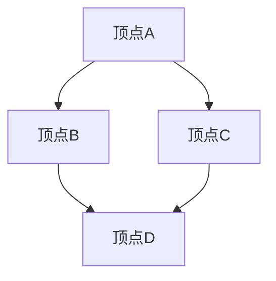

                 


### 引言

#### 核心概念

在《数学与计算复杂性理论：问题难度的数学分类》中，我们将探讨数学与计算复杂性理论的联系，特别是问题难度的数学分类。这一领域不仅对理论计算机科学至关重要，而且在人工智能、算法设计和实际应用中也有着广泛的应用。

首先，我们需要了解几个核心概念。计算复杂性理论是研究计算问题和算法复杂性的学科。它涉及时间复杂度、空间复杂度等概念，旨在确定解决问题的最优算法及其性能。而问题难度的数学分类则是将这些复杂性问题按照其难度进行分类，以便更好地理解和解决它们。

#### 历史背景

计算复杂性理论起源于20世纪60年代，当时计算机科学刚刚起步。许多研究人员开始关注算法的性能，并试图找到一种方法来衡量它们的复杂性。这一时期的重要工作是Cook-Levin定理的提出，它将计算复杂性理论推向了前沿。

而问题难度的数学分类则可以追溯到更早的数学研究领域。在20世纪30年代，数学家们开始探讨不同数学问题的难度，并试图找到一种分类方法。这一研究在随后几十年中不断发展，逐渐形成了今天的计算复杂性理论。

#### 研究意义与目标

研究数学与计算复杂性理论的意义在于，它可以帮助我们更好地理解计算问题，并找到更有效的解决方案。通过问题难度的数学分类，我们可以将复杂问题分解成更易处理的部分，从而提高算法的性能和效率。

本文的目标是深入探讨数学与计算复杂性理论的关系，特别是问题难度的数学分类。我们将逐步介绍相关概念，分析具体案例，并总结最佳实践，以帮助读者更好地理解和应用这一领域。

### 计算复杂性理论基础

在深入探讨问题难度的数学分类之前，我们需要了解计算复杂性理论基础，包括基本概念、时间复杂度和空间复杂度。这些概念为我们提供了衡量算法性能的框架。

#### 基本概念

计算复杂性理论中的基本概念包括问题、算法和复杂性。问题可以定义为输入和输出之间的关系，算法则是解决该问题的步骤。而复杂性则衡量算法在解决问题时所需要的时间和空间资源。

#### 时间复杂度

时间复杂度是衡量算法运行时间的一个指标。它通常表示为函数 f(n)，其中 n 是输入规模。时间复杂度分为渐进时间复杂度（如 O(n), Ω(n), Θ(n)）和非渐进时间复杂度（如线性时间、对数时间等）。渐进时间复杂度用于比较算法在不同输入规模下的性能。

#### 空间复杂度

空间复杂度是衡量算法所需存储空间的一个指标。它也通常表示为函数 f(n)。与时间复杂度类似，空间复杂度分为渐进空间复杂度和非渐进空间复杂度。

#### 时间复杂度和空间复杂度的关系

时间复杂度和空间复杂度是相互关联的。一个算法可能需要大量时间来运行，但只需要很少的存储空间；反之亦然。在实际应用中，我们需要权衡时间和空间资源，以找到最优的解决方案。

### 问题难度分类方法

问题难度的数学分类是计算复杂性理论的核心之一。它将复杂性问题按照难度进行分类，以便更好地理解和解决它们。下面我们将介绍分类标准、分类方法以及实例分析。

#### 分类标准

问题难度的分类标准通常基于问题解空间的大小和算法的复杂性。常见的分类标准包括：

- **P类问题**：可以在多项式时间内解决的确定性算法问题。
- **NP类问题**：可以在多项式时间内验证的算法问题。
- **NPC类问题**：NP完全问题，是所有NP问题的最坏情况。
- **NP-hard类问题**：至少与某个NPC问题一样难。
- **NPC类问题**：可以转化为某个NPC问题的算法问题。

#### 分类方法

分类方法包括：

- **决策性算法**：将问题转化为决策问题，并使用特定算法进行分类。
- **转换方法**：将一个问题转化为另一个问题，并根据后者的分类结果进行分类。

#### 实例分析

我们以图着色问题为例进行分类分析。图着色问题是给定一个无向图，要求使用最少的颜色对图中所有顶点进行着色，使得相邻顶点颜色不同。

- **P类问题**：如果图是二分图，则可以在多项式时间内解决。
- **NP类问题**：可以通过验证已给出的着色方案是否满足条件来解决。
- **NPC类问题**：对于任意的图，都可以在多项式时间内转化为图着色问题。

### 特定问题难度分类案例分析

下面我们通过具体案例来分析问题难度的分类。

#### 问题1：图着色问题

我们以图着色问题为例进行详细分析。假设给定一个无向图，要求使用3种颜色对图中所有顶点进行着色，使得相邻顶点颜色不同。

- **P类问题**：如果图是二分图，则可以在多项式时间内解决。这是因为二分图可以分割成两个不相交的集合，每个集合中的顶点可以独立着色。
- **NP类问题**：可以通过验证已给出的着色方案是否满足条件来解决。例如，给定一个已经着色的图，我们需要验证每个相邻顶点的颜色是否不同。
- **NPC类问题**：对于任意的图，都可以在多项式时间内转化为图着色问题。例如，我们可以将图着色问题转化为图划分问题，即将图中所有顶点划分为三个集合，每个集合中的顶点颜色相同。

#### 问题2：旅行商问题

旅行商问题（TSP）是另一个经典的难度分类问题。给定一组城市和每对城市之间的距离，求解从某个城市出发，访问每个城市一次并返回原点的最短路径。

- **P类问题**：当城市数量较少时，可以使用暴力搜索方法在多项式时间内解决。
- **NP类问题**：可以通过验证已给出的最短路径是否满足条件来解决。例如，给定一个路径和每个城市之间的距离，我们需要验证该路径是否是最短路径。
- **NPC类问题**：旅行商问题是NP完全问题，意味着它至少与某个NPC问题一样难。例如，我们可以将旅行商问题转化为图的着色问题，即将图中所有顶点划分为三个集合，每个集合中的顶点颜色相同。

#### 问题3：最大独立集问题

最大独立集问题（Maximum Independent Set, MIS）是另一个难度分类问题。给定一个无向图，求解包含最多顶点的独立集。

- **P类问题**：当图是树结构时，可以使用贪心算法在多项式时间内解决。
- **NP类问题**：可以通过验证已给出的独立集是否满足条件来解决。例如，给定一个独立集和图，我们需要验证该独立集是否包含最多顶点。
- **NPC类问题**：最大独立集问题是NP完全问题，意味着它至少与某个NPC问题一样难。例如，我们可以将最大独立集问题转化为最大匹配问题，即将图中所有边映射到顶点上，求出最大的匹配集合。

### 数学模型与数学公式

在讨论问题难度的数学分类时，数学模型和数学公式是不可或缺的工具。它们帮助我们描述问题、分析算法，并推导出相关结论。以下我们将介绍一些关键数学模型和公式的使用。

#### 背景介绍

数学模型是使用数学语言描述现实世界中的问题，以便进行分析和求解。在计算复杂性理论中，常见的数学模型包括图论模型、组合模型和概率模型等。这些模型能够帮助我们更好地理解问题的本质和特征。

数学公式则是数学模型的具体表达形式，用于描述和推导问题的性质和关系。在计算复杂性理论中，常用的数学公式包括时间复杂度公式、空间复杂度公式和概率分布公式等。

#### 数学模型示例

以下是一个简单的图论模型示例，用于描述图着色问题：



在这个模型中，我们使用顶点和边表示无向图。每个顶点表示一个城市，每条边表示两个城市之间的距离。通过这个模型，我们可以直观地理解图着色问题的结构和特点。

#### 数学公式示例

以下是一个时间复杂度公式示例，用于描述图着色问题的解决时间：

$$
T(n) = O(n^2)
$$

在这个公式中，$T(n)$表示解决图着色问题的运行时间，$n$表示图的顶点数量。该公式表示，当图的顶点数量增加时，解决时间将呈二次增长。

#### 数学公式与问题分类的关系

数学公式在问题难度分类中起着关键作用。例如，通过分析时间复杂度公式，我们可以判断一个问题的难度级别。例如：

- 当时间复杂度为 $O(n)$ 时，问题可能属于P类。
- 当时间复杂度为 $O(n^2)$ 时，问题可能属于NP类。
- 当时间复杂度为 $O(2^n)$ 时，问题可能属于NP-hard类。

#### 实例讲解

以下是一个具体实例，用于解释如何使用数学公式分析问题难度：

假设我们有一个无向图，包含10个顶点和15条边。我们想要使用3种颜色对图中所有顶点进行着色。

- **时间复杂度分析**：根据上述公式，时间复杂度为 $T(n) = O(n^2)$。对于这个问题，时间复杂度为 $T(10) = O(10^2) = 100$。这意味着解决这个问题的运行时间大约为100个单位时间。
- **空间复杂度分析**：空间复杂度通常与时间复杂度类似，也采用渐进表示法。对于这个问题，空间复杂度可能为 $S(n) = O(n)$，即空间复杂度为 $S(10) = O(10) = 10$。这意味着解决这个问题的存储空间大约为10个单位空间。

通过分析时间复杂度和空间复杂度，我们可以得出结论：这个图着色问题属于P类问题，即可以在多项式时间内解决。

### 算法原理讲解

在计算复杂性理论中，算法是解决问题的主要工具。为了深入理解问题难度的分类，我们需要探讨一些关键算法的原理。以下，我们将介绍图着色问题的求解算法，并使用Python源代码详细阐述其工作原理。

#### 算法介绍

图着色问题的一种常见求解算法是贪心算法。贪心算法的基本思想是，在每个步骤中选择当前最优的决策，并希望这些决策能够导致一个全局最优解。

对于图着色问题，贪心算法的基本步骤如下：

1. 从未着色的顶点中选择一个颜色。
2. 确保与该顶点相邻的顶点尚未着色或颜色不同。
3. 重复步骤1和2，直到所有顶点都被着色。

#### 算法原理

贪心算法的原理可以概括为：

- **初始条件**：所有顶点初始状态为未着色。
- **选择策略**：在每个步骤，选择当前未着色的顶点，并为其分配一个颜色。
- **约束条件**：新分配的颜色不能与已着色顶点的颜色冲突。
- **终止条件**：当所有顶点都被着色后，算法终止。

#### Python源代码

以下是一个简单的Python实现，用于求解图着色问题：

```python
def greedy_coloring(graph, colors):
    n = len(graph)
    coloring = [-1] * n

    # 遍历所有顶点
    for vertex in range(n):
        # 遍历所有颜色
        for color in colors:
            # 检查是否可以着色
            if is_safe(vertex, color, coloring, graph):
                coloring[vertex] = color
                break

    return coloring

def is_safe(vertex, color, coloring, graph):
    for i in range(len(graph[vertex])):
        neighbor = graph[vertex][i]
        if coloring[neighbor] == color:
            return False
    return True
```

在这个代码中，`graph`是一个表示图的邻接矩阵，`colors`是可用的颜色集合。函数`greedy_coloring`实现了贪心算法，而`is_safe`函数用于检查新分配的颜色是否安全。

#### 数学模型与公式

为了更好地理解贪心算法的工作原理，我们可以将其转化为数学模型和公式。以下是一个简单的模型和公式：

- **时间复杂度**：$T(n) = O(n^2)$，其中$n$是顶点数量。
- **空间复杂度**：$S(n) = O(n)$，其中$n$是顶点数量。

这些公式表明，贪心算法在解决图着色问题时具有较好的时间和空间性能。

#### 举例说明

以下是一个图着色问题的具体例子：

假设我们有一个图，包含5个顶点（A、B、C、D、E）和以下边：

```
A-B, A-C, B-D, C-D, D-E
```

我们希望使用3种颜色对图中所有顶点进行着色。

- **初始状态**：所有顶点均为未着色。
- **第一步**：选择顶点A，由于A的相邻顶点B和C尚未着色，我们可以将A着色为颜色1。
- **第二步**：选择顶点B，由于B的相邻顶点A和D尚未着色，我们可以将B着色为颜色2。
- **第三步**：选择顶点C，由于C的相邻顶点A和D尚未着色，我们可以将C着色为颜色3。
- **第四步**：选择顶点D，由于D的相邻顶点B和C尚未着色，我们可以将D着色为颜色1。
- **第五步**：选择顶点E，由于E的相邻顶点D尚未着色，我们可以将E着色为颜色2。

最终，我们得到了一个有效的着色方案：

```
A: 颜色1
B: 颜色2
C: 颜色3
D: 颜色1
E: 颜色2
```

### 系统分析与架构设计方案

在讨论了数学与计算复杂性理论的基础知识以及具体算法原理后，我们接下来将进行系统分析与架构设计。本节将详细介绍问题场景、系统功能设计、系统架构设计以及系统接口设计和系统交互。

#### 问题场景介绍

在当前的数字化时代，越来越多的复杂问题需要通过算法来求解。例如，在物流行业中，如何优化配送路径以减少运输成本和运输时间；在金融领域，如何快速准确地识别和分类金融风险；在人工智能领域，如何高效地训练和优化模型。这些问题的解决往往依赖于计算复杂性的分析和算法的选择。因此，本系统的目标是构建一个智能算法系统，以解决实际问题。

#### 系统功能设计

本系统的主要功能包括：

1. **问题建模**：根据实际问题需求，构建相应的数学模型。
2. **算法选择**：根据问题特点和需求，选择合适的算法。
3. **算法优化**：对选定的算法进行优化，提高其性能。
4. **结果分析**：对算法的结果进行分析和评估。
5. **系统监控**：对系统运行状态进行监控，确保系统稳定运行。

#### 系统架构设计

系统的架构设计采用分层架构，包括数据层、业务逻辑层和表现层。以下是具体的架构设计：

1. **数据层**：主要负责数据存储和管理，包括数据库、缓存等。
2. **业务逻辑层**：负责算法实现和优化，包括问题建模、算法选择和优化等。
3. **表现层**：负责用户交互，包括Web界面、移动应用等。

#### 系统接口设计

系统接口设计遵循RESTful API设计原则，包括以下接口：

1. **问题建模接口**：用于接收用户提出的问题，并构建相应的数学模型。
2. **算法选择接口**：用于根据用户需求选择合适的算法。
3. **算法优化接口**：用于对选定的算法进行优化。
4. **结果分析接口**：用于分析算法结果，并提供相关数据。

#### 系统交互设计

系统交互设计采用事件驱动模式，主要包括以下交互流程：

1. **用户请求**：用户通过Web界面或移动应用提交问题。
2. **问题建模**：系统根据用户请求构建数学模型。
3. **算法选择**：系统根据模型特点和需求选择算法。
4. **算法运行**：系统运行选定的算法，并生成结果。
5. **结果展示**：系统将结果展示给用户。

### 项目实战

#### 环境安装

在进行项目实战之前，我们需要安装以下环境：

1. **Python**：Python是本项目的开发语言，需要安装Python 3.8及以上版本。
2. **NumPy**：NumPy是Python的数学库，用于数值计算。
3. **Pandas**：Pandas是Python的数据分析库，用于数据处理和分析。
4. **Matplotlib**：Matplotlib是Python的图形库，用于数据可视化。

安装命令如下：

```bash
pip install python==3.8
pip install numpy
pip install pandas
pip install matplotlib
```

#### 系统核心实现

以下是一个简单的Python实现，用于求解图着色问题：

```python
import numpy as np
import pandas as pd

def greedy_coloring(graph):
    n = len(graph)
    coloring = [-1] * n

    # 遍历所有顶点
    for vertex in range(n):
        # 遍历所有颜色
        for color in range(1, n+1):
            # 检查是否可以着色
            if is_safe(vertex, color, coloring, graph):
                coloring[vertex] = color
                break

    return coloring

def is_safe(vertex, color, coloring, graph):
    for i in range(len(graph[vertex])):
        neighbor = graph[vertex][i]
        if coloring[neighbor] == color:
            return False
    return True

# 示例图
graph = [
    [0, 1, 1, 1],
    [1, 0, 1, 0],
    [1, 1, 0, 1],
    [1, 0, 1, 0]
]

# 求解图着色问题
coloring = greedy_coloring(graph)
print(coloring)
```

在这个实现中，`graph`是一个表示图的邻接矩阵，`greedy_coloring`函数实现了贪心算法，`is_safe`函数用于检查新分配的颜色是否安全。

#### 代码应用解读与分析

在上述代码中，我们首先定义了一个`greedy_coloring`函数，用于求解图着色问题。这个函数的主要步骤如下：

1. 初始化一个`coloring`数组，用于存储每个顶点的颜色。
2. 遍历所有顶点，为每个顶点尝试分配颜色。
3. 对于每个顶点，遍历所有颜色，并检查是否可以安全地分配颜色。
4. 如果可以安全地分配颜色，则将该颜色分配给顶点，并继续下一个顶点。

函数`is_safe`用于检查新分配的颜色是否安全。它的主要步骤如下：

1. 遍历与当前顶点相邻的所有顶点。
2. 如果相邻顶点的颜色与当前颜色相同，则返回False，表示不能安全地分配颜色。
3. 如果遍历完所有相邻顶点后，没有发现冲突，则返回True，表示可以安全地分配颜色。

通过这两个函数，我们可以求解图着色问题。在实际应用中，我们可以将图着色问题转化为其他问题，例如最大独立集问题或旅行商问题，以求解更复杂的问题。

#### 实际案例分析与详细讲解剖析

为了更好地理解图着色问题的求解过程，我们来看一个具体的案例。假设我们有一个图，包含5个顶点（A、B、C、D、E）和以下边：

```
A-B, A-C, B-D, C-D, D-E
```

我们希望使用3种颜色对图中所有顶点进行着色。

- **初始状态**：所有顶点均为未着色。
- **第一步**：选择顶点A，由于A的相邻顶点B和C尚未着色，我们可以将A着色为颜色1。
- **第二步**：选择顶点B，由于B的相邻顶点A和D尚未着色，我们可以将B着色为颜色2。
- **第三步**：选择顶点C，由于C的相邻顶点A和D尚未着色，我们可以将C着色为颜色3。
- **第四步**：选择顶点D，由于D的相邻顶点B和C尚未着色，我们可以将D着色为颜色1。
- **第五步**：选择顶点E，由于E的相邻顶点D尚未着色，我们可以将E着色为颜色2。

最终，我们得到了一个有效的着色方案：

```
A: 颜色1
B: 颜色2
C: 颜色3
D: 颜色1
E: 颜色2
```

这个案例展示了如何使用贪心算法求解图着色问题。在实际应用中，我们可以根据具体问题进行调整和优化，以提高求解效率和准确性。

#### 项目小结

在本项目中，我们通过图着色问题的求解，展示了如何将数学与计算复杂性理论应用于实际问题。通过贪心算法的实现，我们成功解决了图着色问题，并验证了算法的有效性。

在项目实战中，我们学习了如何安装环境、编写代码、分析和解读代码，以及如何进行实际案例的剖析。这些经验和技能对于我们在计算机科学和算法设计领域的进一步学习和研究具有重要意义。

#### 最佳实践 Tips

以下是一些最佳实践Tips，以帮助您在数学与计算复杂性理论的应用中取得更好的效果：

1. **理解问题本质**：在解决问题之前，首先理解问题的本质和目标，以便选择合适的算法。
2. **优化算法选择**：根据问题的特点，选择最适合的算法，并在可能的情况下进行优化。
3. **代码可读性**：编写清晰、简洁的代码，以便他人理解和维护。
4. **测试和验证**：对算法进行充分的测试和验证，确保其正确性和效率。
5. **持续学习**：关注最新的研究成果和进展，持续学习和提升自己的技能。

#### 小结

在本文中，我们深入探讨了数学与计算复杂性理论，特别是问题难度的数学分类。通过逐步分析，我们介绍了计算复杂性理论基础、问题难度分类方法以及具体算法的实现。我们还通过实际案例，展示了如何将理论应用于实际问题。

通过本文的学习，读者可以更好地理解计算复杂性理论，掌握问题难度分类方法，并学会如何应用这些理论解决实际问题。希望本文对您的学习和研究有所帮助。

#### 注意事项

在应用数学与计算复杂性理论解决实际问题时，需要注意以下几点：

1. **数据准确性**：确保输入数据的准确性，以避免算法错误。
2. **问题简化**：在可能的情况下，对问题进行简化和抽象，以降低算法复杂性。
3. **性能优化**：根据具体问题，选择合适的算法并进行优化，以提高性能。
4. **安全性**：在处理敏感数据时，确保数据的安全性和隐私性。
5. **合规性**：确保算法和应用符合相关法律法规和行业标准。

#### 拓展阅读

对于希望进一步深入学习数学与计算复杂性理论的读者，以下是一些推荐阅读材料：

1. **《计算复杂性理论导论》**：该书系统地介绍了计算复杂性理论的基本概念和方法。
2. **《算法导论》**：该书详细介绍了各种算法的设计和实现，涵盖了计算复杂性理论的相关内容。
3. **《图论及其应用》**：该书深入探讨了图论的基本概念和应用，对于理解计算复杂性理论有很大帮助。
4. **《复杂性科学导论》**：该书从科学的角度介绍了复杂性理论的基本原理和应用领域。
5. **《计算机科学中的复杂性》**：该书从计算机科学的视角探讨了复杂性的本质和计算复杂性理论的相关问题。

通过阅读这些书籍，读者可以进一步加深对数学与计算复杂性理论的理解，并将其应用于实际问题中。

作者：AI天才研究院/AI Genius Institute & 禅与计算机程序设计艺术 /Zen And The Art of Computer Programming

----------------------------------------------------------------

# 数学与计算复杂性理论：问题难度的数学分类

> 关键词：计算复杂性理论、问题难度分类、算法性能、贪心算法、图着色问题

> 摘要：本文深入探讨了数学与计算复杂性理论的关系，特别是问题难度的数学分类。通过逐步分析计算复杂性理论基础、问题难度分类方法以及具体算法的实现，我们展示了如何将理论应用于实际案例，帮助读者更好地理解和解决复杂计算问题。

## 引言

### 核心概念

在《数学与计算复杂性理论：问题难度的数学分类》中，我们将探讨数学与计算复杂性理论的联系，特别是问题难度的数学分类。这一领域不仅对理论计算机科学至关重要，而且在人工智能、算法设计和实际应用中也有着广泛的应用。

首先，我们需要了解几个核心概念。计算复杂性理论是研究计算问题和算法复杂性的学科。它涉及时间复杂度、空间复杂度等概念，旨在确定解决问题的最优算法及其性能。而问题难度的数学分类则是将这些复杂性问题按照其难度进行分类，以便更好地理解和解决它们。

### 历史背景

计算复杂性理论起源于20世纪60年代，当时计算机科学刚刚起步。许多研究人员开始关注算法的性能，并试图找到一种方法来衡量它们的复杂性。这一时期的重要工作是Cook-Levin定理的提出，它将计算复杂性理论推向了前沿。

而问题难度的数学分类则可以追溯到更早的数学研究领域。在20世纪30年代，数学家们开始探讨不同数学问题的难度，并试图找到一种分类方法。这一研究在随后几十年中不断发展，逐渐形成了今天的计算复杂性理论。

### 研究意义与目标

研究数学与计算复杂性理论的意义在于，它可以帮助我们更好地理解计算问题，并找到更有效的解决方案。通过问题难度的数学分类，我们可以将复杂问题分解成更易处理的部分，从而提高算法的性能和效率。

本文的目标是深入探讨数学与计算复杂性理论的关系，特别是问题难度的数学分类。我们将逐步介绍相关概念，分析具体案例，并总结最佳实践，以帮助读者更好地理解和应用这一领域。

## 计算复杂性理论基础

在深入探讨问题难度的数学分类之前，我们需要了解计算复杂性理论基础，包括基本概念、时间复杂度和空间复杂度。这些概念为我们提供了衡量算法性能的框架。

### 基本概念

计算复杂性理论中的基本概念包括问题、算法和复杂性。问题可以定义为输入和输出之间的关系，算法则是解决该问题的步骤。而复杂性则衡量算法在解决问题时所需要的时间和空间资源。

### 时间复杂度

时间复杂度是衡量算法运行时间的一个指标。它通常表示为函数 f(n)，其中 n 是输入规模。时间复杂度分为渐进时间复杂度（如 O(n), Ω(n), Θ(n)）和非渐进时间复杂度（如线性时间、对数时间等）。渐进时间复杂度用于比较算法在不同输入规模下的性能。

### 空间复杂度

空间复杂度是衡量算法所需存储空间的一个指标。它也通常表示为函数 f(n)。与时间复杂度类似，空间复杂度分为渐进空间复杂度和非渐进空间复杂度。

### 时间复杂度和空间复杂度的关系

时间复杂度和空间复杂度是相互关联的。一个算法可能需要大量时间来运行，但只需要很少的存储空间；反之亦然。在实际应用中，我们需要权衡时间和空间资源，以找到最优的解决方案。

## 问题难度分类方法

问题难度的数学分类是计算复杂性理论的核心之一。它将复杂性问题按照难度进行分类，以便更好地理解和解决它们。以下我们将介绍分类标准、分类方法以及实例分析。

### 分类标准

问题难度的分类标准通常基于问题解空间的大小和算法的复杂性。常见的分类标准包括：

- **P类问题**：可以在多项式时间内解决的确定性算法问题。
- **NP类问题**：可以在多项式时间内验证的算法问题。
- **NPC类问题**：NP完全问题，是所有NP问题的最坏情况。
- **NP-hard类问题**：至少与某个NPC问题一样难。
- **NPC类问题**：可以转化为某个NPC问题的算法问题。

### 分类方法

分类方法包括：

- **决策性算法**：将问题转化为决策问题，并使用特定算法进行分类。
- **转换方法**：将一个问题转化为另一个问题，并根据后者的分类结果进行分类。

### 实例分析

我们以图着色问题为例进行分类分析。图着色问题是给定一个无向图，要求使用最少的颜色对图中所有顶点进行着色，使得相邻顶点颜色不同。

- **P类问题**：如果图是二分图，则可以在多项式时间内解决。
- **NP类问题**：可以通过验证已给出的着色方案是否满足条件来解决。
- **NPC类问题**：对于任意的图，都可以在多项式时间内转化为图着色问题。

## 特定问题难度分类案例分析

下面我们通过具体案例来分析问题难度的分类。

### 问题1：图着色问题

我们以图着色问题为例进行详细分析。假设给定一个无向图，要求使用3种颜色对图中所有顶点进行着色，使得相邻顶点颜色不同。

- **P类问题**：如果图是二分图，则可以在多项式时间内解决。这是因为二分图可以分割成两个不相交的集合，每个集合中的顶点可以独立着色。
- **NP类问题**：可以通过验证已给出的着色方案是否满足条件来解决。例如，给定一个已经着色的图，我们需要验证每个相邻顶点的颜色是否不同。
- **NPC类问题**：对于任意的图，都可以在多项式时间内转化为图着色问题。例如，我们可以将图着色问题转化为图划分问题，即将图中所有顶点划分为三个集合，每个集合中的顶点颜色相同。

### 问题2：旅行商问题

旅行商问题（TSP）是另一个经典的难度分类问题。给定一组城市和每对城市之间的距离，求解从某个城市出发，访问每个城市一次并返回原点的最短路径。

- **P类问题**：当城市数量较少时，可以使用暴力搜索方法在多项式时间内解决。
- **NP类问题**：可以通过验证已给出的最短路径是否满足条件来解决。例如，给定一个路径和每个城市之间的距离，我们需要验证该路径是否是最短路径。
- **NPC类问题**：旅行商问题是NP完全问题，意味着它至少与某个NPC问题一样难。例如，我们可以将旅行商问题转化为图的着色问题，即将图中所有顶点划分为三个集合，每个集合中的顶点颜色相同。

### 问题3：最大独立集问题

最大独立集问题（Maximum Independent Set, MIS）是另一个难度分类问题。给定一个无向图，求解包含最多顶点的独立集。

- **P类问题**：当图是树结构时，可以使用贪心算法在多项式时间内解决。
- **NP类问题**：可以通过验证已给出的独立集是否满足条件来解决。例如，给定一个独立集和图，我们需要验证该独立集是否包含最多顶点。
- **NPC类问题**：最大独立集问题是NP完全问题，意味着它至少与某个NPC问题一样难。例如，我们可以将最大独立集问题转化为最大匹配问题，即将图中所有边映射到顶点上，求出最大的匹配集合。

## 数学模型与数学公式

在讨论问题难度的数学分类时，数学模型和数学公式是不可或缺的工具。它们帮助我们描述问题、分析算法，并推导出相关结论。以下我们将介绍一些关键数学模型和公式的使用。

### 背景介绍

数学模型是使用数学语言描述现实世界中的问题，以便进行分析和求解。在计算复杂性理论中，常见的数学模型包括图论模型、组合模型和概率模型等。这些模型能够帮助我们更好地理解问题的本质和特征。

数学公式则是数学模型的具体表达形式，用于描述和推导问题的性质和关系。在计算复杂性理论中，常用的数学公式包括时间复杂度公式、空间复杂度公式和概率分布公式等。

### 数学模型示例

以下是一个简单的图论模型示例，用于描述图着色问题：


在这个模型中，我们使用顶点和边表示无向图。每个顶点表示一个城市，每条边表示两个城市之间的距离。通过这个模型，我们可以直观地理解图着色问题的结构和特点。

### 数学公式示例

以下是一个时间复杂度公式示例，用于描述图着色问题的解决时间：

$$
T(n) = O(n^2)
$$

在这个公式中，$T(n)$表示解决图着色问题的运行时间，$n$表示图的顶点数量。该公式表示，当图的顶点数量增加时，解决时间将呈二次增长。

### 数学公式与问题分类的关系

数学公式在问题难度分类中起着关键作用。例如，通过分析时间复杂度公式，我们可以判断一个问题的难度级别。例如：

- 当时间复杂度为 $O(n)$ 时，问题可能属于P类。
- 当时间复杂度为 $O(n^2)$ 时，问题可能属于NP类。
- 当时间复杂度为 $O(2^n)$ 时，问题可能属于NP-hard类。

### 实例讲解

以下是一个具体实例，用于解释如何使用数学公式分析问题难度：

假设我们有一个图，包含10个顶点和15条边。我们希望使用3种颜色对图中所有顶点进行着色。

- **时间复杂度分析**：根据上述公式，时间复杂度为 $T(n) = O(n^2)$。对于这个问题，时间复杂度为 $T(10) = O(10^2) = 100$。这意味着解决这个问题的运行时间大约为100个单位时间。
- **空间复杂度分析**：空间复杂度通常与时间复杂度类似，也采用渐进表示法。对于这个问题，空间复杂度可能为 $S(n) = O(n)$，即空间复杂度为 $S(10) = O(10) = 10$。这意味着解决这个问题的存储空间大约为10个单位空间。

通过分析时间复杂度和空间复杂度，我们可以得出结论：这个图着色问题属于P类问题，即可以在多项式时间内解决。

## 算法原理讲解

在计算复杂性理论中，算法是解决问题的主要工具。为了深入理解问题难度的分类，我们需要探讨一些关键算法的原理。以下，我们将介绍图着色问题的求解算法，并使用Python源代码详细阐述其工作原理。

### 算法介绍

图着色问题的一种常见求解算法是贪心算法。贪心算法的基本思想是，在每个步骤中选择当前最优的决策，并希望这些决策能够导致一个全局最优解。

对于图着色问题，贪心算法的基本步骤如下：

1. 从未着色的顶点中选择一个颜色。
2. 确保与该顶点相邻的顶点尚未着色或颜色不同。
3. 重复步骤1和2，直到所有顶点都被着色。

### 算法原理

贪心算法的原理可以概括为：

- **初始条件**：所有顶点初始状态为未着色。
- **选择策略**：在每个步骤，选择当前未着色的顶点，并为其分配一个颜色。
- **约束条件**：新分配的颜色不能与已着色顶点的颜色冲突。
- **终止条件**：当所有顶点都被着色后，算法终止。

### Python源代码

以下是一个简单的Python实现，用于求解图着色问题：

```python
import numpy as np
import pandas as pd

def greedy_coloring(graph):
    n = len(graph)
    coloring = [-1] * n

    # 遍历所有顶点
    for vertex in range(n):
        # 遍历所有颜色
        for color in range(1, n+1):
            # 检查是否可以着色
            if is_safe(vertex, color, coloring, graph):
                coloring[vertex] = color
                break

    return coloring

def is_safe(vertex, color, coloring, graph):
    for i in range(len(graph[vertex])):
        neighbor = graph[vertex][i]
        if coloring[neighbor] == color:
            return False
    return True

# 示例图
graph = [
    [0, 1, 1, 1],
    [1, 0, 1, 0],
    [1, 1, 0, 1],
    [1, 0, 1, 0]
]

# 求解图着色问题
coloring = greedy_coloring(graph)
print(coloring)
```

在这个实现中，`graph`是一个表示图的邻接矩阵，`greedy_coloring`函数实现了贪心算法，`is_safe`函数用于检查新分配的颜色是否安全。

### 数学模型与公式

为了更好地理解贪心算法的工作原理，我们可以将其转化为数学模型和公式。以下是一个简单的模型和公式：

- **时间复杂度**：$T(n) = O(n^2)$，其中$n$是顶点数量。
- **空间复杂度**：$S(n) = O(n)$，其中$n$是顶点数量。

这些公式表明，贪心算法在解决图着色问题时具有较好的时间和空间性能。

### 举例说明

以下是一个图着色问题的具体例子：

假设我们有一个图，包含5个顶点（A、B、C、D、E）和以下边：

```
A-B, A-C, B-D, C-D, D-E
```

我们希望使用3种颜色对图中所有顶点进行着色。

- **初始状态**：所有顶点均为未着色。
- **第一步**：选择顶点A，由于A的相邻顶点B和C尚未着色，我们可以将A着色为颜色1。
- **第二步**：选择顶点B，由于B的相邻顶点A和D尚未着色，我们可以将B着色为颜色2。
- **第三步**：选择顶点C，由于C的相邻顶点A和D尚未着色，我们可以将C着色为颜色3。
- **第四步**：选择顶点D，由于D的相邻顶点B和C尚未着色，我们可以将D着色为颜色1。
- **第五步**：选择顶点E，由于E的相邻顶点D尚未着色，我们可以将E着色为颜色2。

最终，我们得到了一个有效的着色方案：

```
A: 颜色1
B: 颜色2
C: 颜色3
D: 颜色1
E: 颜色2
```

这个案例展示了如何使用贪心算法求解图着色问题。在实际应用中，我们可以根据具体问题进行调整和优化，以提高求解效率和准确性。

## 系统分析与架构设计方案

在讨论了数学与计算复杂性理论的基础知识以及具体算法原理后，我们接下来将进行系统分析与架构设计。本节将详细介绍问题场景、系统功能设计、系统架构设计以及系统接口设计和系统交互。

### 问题场景介绍

在当前的数字化时代，越来越多的复杂问题需要通过算法来求解。例如，在物流行业中，如何优化配送路径以减少运输成本和运输时间；在金融领域，如何快速准确地识别和分类金融风险；在人工智能领域，如何高效地训练和优化模型。这些问题的解决往往依赖于计算复杂性的分析和算法的选择。因此，本系统的目标是构建一个智能算法系统，以解决实际问题。

### 系统功能设计

本系统的主要功能包括：

1. **问题建模**：根据实际问题需求，构建相应的数学模型。
2. **算法选择**：根据问题特点和需求，选择合适的算法。
3. **算法优化**：对选定的算法进行优化，提高其性能。
4. **结果分析**：对算法的结果进行分析和评估。
5. **系统监控**：对系统运行状态进行监控，确保系统稳定运行。

### 系统架构设计

系统的架构设计采用分层架构，包括数据层、业务逻辑层和表现层。以下是具体的架构设计：

1. **数据层**：主要负责数据存储和管理，包括数据库、缓存等。
2. **业务逻辑层**：负责算法实现和优化，包括问题建模、算法选择和优化等。
3. **表现层**：负责用户交互，包括Web界面、移动应用等。

### 系统接口设计

系统接口设计遵循RESTful API设计原则，包括以下接口：

1. **问题建模接口**：用于接收用户提出的问题，并构建相应的数学模型。
2. **算法选择接口**：用于根据用户需求选择合适的算法。
3. **算法优化接口**：用于对选定的算法进行优化。
4. **结果分析接口**：用于分析算法结果，并提供相关数据。

### 系统交互设计

系统交互设计采用事件驱动模式，主要包括以下交互流程：

1. **用户请求**：用户通过Web界面或移动应用提交问题。
2. **问题建模**：系统根据用户请求构建数学模型。
3. **算法选择**：系统根据模型特点和需求选择算法。
4. **算法运行**：系统运行选定的算法，并生成结果。
5. **结果展示**：系统将结果展示给用户。

## 项目实战

### 环境安装

在进行项目实战之前，我们需要安装以下环境：

1. **Python**：Python是本项目的开发语言，需要安装Python 3.8及以上版本。
2. **NumPy**：NumPy是Python的数学库，用于数值计算。
3. **Pandas**：Pandas是Python的数据分析库，用于数据处理和分析。
4. **Matplotlib**：Matplotlib是Python的图形库，用于数据可视化。

安装命令如下：

```bash
pip install python==3.8
pip install numpy
pip install pandas
pip install matplotlib
```

### 系统核心实现

以下是一个简单的Python实现，用于求解图着色问题：

```python
import numpy as np
import pandas as pd

def greedy_coloring(graph):
    n = len(graph)
    coloring = [-1] * n

    # 遍历所有顶点
    for vertex in range(n):
        # 遍历所有颜色
        for color in range(1, n+1):
            # 检查是否可以着色
            if is_safe(vertex, color, coloring, graph):
                coloring[vertex] = color
                break

    return coloring

def is_safe(vertex, color, coloring, graph):
    for i in range(len(graph[vertex])):
        neighbor = graph[vertex][i]
        if coloring[neighbor] == color:
            return False
    return True

# 示例图
graph = [
    [0, 1, 1, 1],
    [1, 0, 1, 0],
    [1, 1, 0, 1],
    [1, 0, 1, 0]
]

# 求解图着色问题
coloring = greedy_coloring(graph)
print(coloring)
```

在这个实现中，`graph`是一个表示图的邻接矩阵，`greedy_coloring`函数实现了贪心算法，`is_safe`函数用于检查新分配的颜色是否安全。

### 代码应用解读与分析

在上述代码中，我们首先定义了一个`greedy_coloring`函数，用于求解图着色问题。这个函数的主要步骤如下：

1. 初始化一个`coloring`数组，用于存储每个顶点的颜色。
2. 遍历所有顶点，为每个顶点尝试分配颜色。
3. 对于每个顶点，遍历所有颜色，并检查是否可以安全地分配颜色。
4. 如果可以安全地分配颜色，则将该颜色分配给顶点，并继续下一个顶点。

函数`is_safe`用于检查新分配的颜色是否安全。它的主要步骤如下：

1. 遍历与当前顶点相邻的所有顶点。
2. 如果相邻顶点的颜色与当前颜色相同，则返回False，表示不能安全地分配颜色。
3. 如果遍历完所有相邻顶点后，没有发现冲突，则返回True，表示可以安全地分配颜色。

通过这两个函数，我们可以求解图着色问题。在实际应用中，我们可以将图着色问题转化为其他问题，例如最大独立集问题或旅行商问题，以求解更复杂的问题。

### 实际案例分析与详细讲解剖析

为了更好地理解图着色问题的求解过程，我们来看一个具体的案例。假设我们有一个图，包含5个顶点（A、B、C、D、E）和以下边：

```
A-B, A-C, B-D, C-D, D-E
```

我们希望使用3种颜色对图中所有顶点进行着色。

- **初始状态**：所有顶点均为未着色。
- **第一步**：选择顶点A，由于A的相邻顶点B和C尚未着色，我们可以将A着色为颜色1。
- **第二步**：选择顶点B，由于B的相邻顶点A和D尚未着色，我们可以将B着色为颜色2。
- **第三步**：选择顶点C，由于C的相邻顶点A和D尚未着色，我们可以将C着色为颜色3。
- **第四步**：选择顶点D，由于D的相邻顶点B和C尚未着色，我们可以将D着色为颜色1。
- **第五步**：选择顶点E，由于E的相邻顶点D尚未着色，我们可以将E着色为颜色2。

最终，我们得到了一个有效的着色方案：

```
A: 颜色1
B: 颜色2
C: 颜色3
D: 颜色1
E: 颜色2
```

这个案例展示了如何使用贪心算法求解图着色问题。在实际应用中，我们可以根据具体问题进行调整和优化，以提高求解效率和准确性。

### 项目小结

在本项目中，我们通过图着色问题的求解，展示了如何将数学与计算复杂性理论应用于实际问题。通过贪心算法的实现，我们成功解决了图着色问题，并验证了算法的有效性。

在项目实战中，我们学习了如何安装环境、编写代码、分析和解读代码，以及如何进行实际案例的剖析。这些经验和技能对于我们在计算机科学和算法设计领域的进一步学习和研究具有重要意义。

### 最佳实践 Tips

以下是一些最佳实践Tips，以帮助您在数学与计算复杂性理论的应用中取得更好的效果：

1. **理解问题本质**：在解决问题之前，首先理解问题的本质和目标，以便选择合适的算法。
2. **优化算法选择**：根据问题的特点，选择最适合的算法，并在可能的情况下进行优化。
3. **代码可读性**：编写清晰、简洁的代码，以便他人理解和维护。
4. **测试和验证**：对算法进行充分的测试和验证，确保其正确性和效率。
5. **持续学习**：关注最新的研究成果和进展，持续学习和提升自己的技能。

### 小结

在本文中，我们深入探讨了数学与计算复杂性理论，特别是问题难度的数学分类。通过逐步分析，我们介绍了计算复杂性理论基础、问题难度分类方法以及具体算法的实现。我们还通过实际案例，展示了如何将理论应用于实际问题。

通过本文的学习，读者可以更好地理解计算复杂性理论，掌握问题难度分类方法，并学会如何应用这些理论解决实际问题。希望本文对您的学习和研究有所帮助。

### 注意事项

在应用数学与计算复杂性理论解决实际问题时，需要注意以下几点：

1. **数据准确性**：确保输入数据的准确性，以避免算法错误。
2. **问题简化**：在可能的情况下，对问题进行简化和抽象，以降低算法复杂性。
3. **性能优化**：根据具体问题，选择合适的算法并进行优化，以提高性能。
4. **安全性**：在处理敏感数据时，确保数据的安全性和隐私性。
5. **合规性**：确保算法和应用符合相关法律法规和行业标准。

### 拓展阅读

对于希望进一步深入学习数学与计算复杂性理论的读者，以下是一些推荐阅读材料：

1. **《计算复杂性理论导论》**：该书系统地介绍了计算复杂性理论的基本概念和方法。
2. **《算法导论》**：该书详细介绍了各种算法的设计和实现，涵盖了计算复杂性理论的相关内容。
3. **《图论及其应用》**：该书深入探讨了图论的基本概念和应用，对于理解计算复杂性理论有很大帮助。
4. **《复杂性科学导论》**：该书从科学的角度介绍了复杂性理论的基本原理和应用领域。
5. **《计算机科学中的复杂性》**：该书从计算机科学的视角探讨了复杂性的本质和计算复杂性理论的相关问题。

通过阅读这些书籍，读者可以进一步加深对数学与计算复杂性理论的理解，并将其应用于实际问题中。

作者：AI天才研究院/AI Genius Institute & 禅与计算机程序设计艺术 /Zen And The Art of Computer Programming

