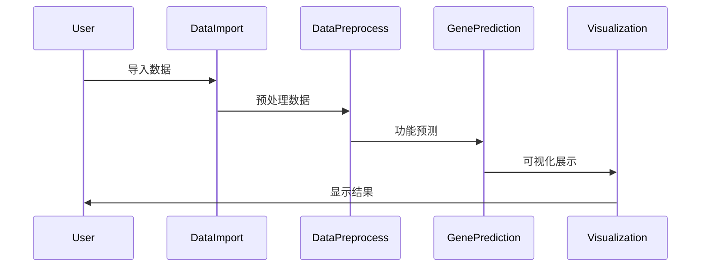
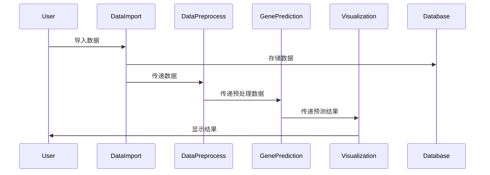

                 


### 前言

#### 写作目的

本文旨在为读者提供一个深入浅出的计算生物学与数学建模的结合介绍，帮助大家更好地理解生物系统的数学建模及其应用。本文将首先介绍计算生物学和数学建模的基本概念，然后逐步深入，通过具体的算法、模型和系统架构设计，展示如何将数学建模应用于生物系统的分析和理解。

#### 阅读对象

本文适合对生物信息学、计算生物学或相关领域有一定了解的读者，尤其是那些希望深入理解数学建模在生物系统研究中的应用的专业人士。此外，对于对数学建模感兴趣，但还未涉足生物领域的读者，本文同样具有很高的参考价值。

#### 结构安排

本文结构如下：

- **第1章 计算生物学与数学建模基础**：介绍计算生物学的发展背景、数学建模的基本概念及在生物系统研究中的应用。
- **第2章 数学建模核心概念详解**：详细解释数学建模中的核心概念，包括模型类型、建模方法和关键数学工具。
- **第3章 算法原理讲解**：深入讲解随机过程模型、贝叶斯网络和机器学习算法等，通过mermaid流程图和Python源代码展示算法原理。
- **第4章 数学模型与公式详解**：使用LaTeX格式给出核心数学模型和公式，并进行详细讲解和举例说明。
- **第5章 系统分析与架构设计**：介绍生物系统的复杂性和建模需求，展示系统功能设计、架构设计和系统交互。
- **第6章 项目实战**：模拟一个具体的计算生物学项目，从环境安装到系统实现，再到实际案例分析和讲解。
- **第7章 最佳实践与拓展**：总结全文，提供最佳实践建议，指出注意事项，推荐拓展阅读材料。

通过以上章节的逐步讲解，读者将能够系统地理解生物系统的数学建模过程，掌握相关算法和应用实践。

### 第1章 计算生物学与数学建模基础

#### 1.1 计算生物学简介

**计算生物学**是一门结合计算机科学、生物学和数学等多个领域的交叉学科，旨在通过计算方法和技术来理解生物系统的结构和功能。计算生物学的发展历程可以追溯到20世纪50年代，随着计算机技术的快速进步，生物信息学作为计算生物学的一个重要分支，逐渐发展壮大。

**计算生物学的重要性**体现在多个方面。首先，它为生物学研究提供了强大的工具和方法，使得我们能够处理和分析海量的生物数据。其次，计算生物学在疾病治疗、药物开发、基因测序和进化生物学等领域发挥着重要作用。例如，通过计算生物学方法，科学家们能够预测蛋白质的结构和功能，从而为新药研发提供理论基础。

**计算生物学的研究内容**主要包括以下几个方面：

1. **基因组学**：研究基因的结构、功能和变异，包括基因序列分析、基因表达分析等。
2. **蛋白质组学**：研究蛋白质的组成、表达和功能，包括蛋白质结构预测、蛋白质相互作用分析等。
3. **代谢组学**：研究生物体内的代谢过程和代谢物，包括代谢网络分析、代谢通路建模等。
4. **系统生物学**：研究生物系统的动态行为和整体特性，包括网络建模、系统模拟等。

#### 1.2 数学建模概述

**数学建模**是一种利用数学工具和方法来描述和分析实际问题的方法。在计算生物学中，数学建模起到了至关重要的作用，它能够将复杂的生物现象转化为可计算的数学模型，从而帮助我们更好地理解生物系统的运行机制。

**数学建模的定义**可以简单概括为：通过建立数学模型来描述和分析实际问题的过程。这个过程中，我们首先需要对问题进行抽象和简化，然后利用数学方法来构建模型，最后通过模型来预测和解释实际现象。

**数学建模的方法**多种多样，主要包括以下几种：

1. **统计分析**：通过对数据进行分析，建立统计模型来描述数据分布和相关性。
2. **微分方程**：通过微分方程来描述生物系统的动态变化。
3. **代数模型**：通过代数方程来描述生物系统的结构和功能。
4. **机器学习**：利用机器学习算法来建立预测模型，对生物数据进行分类和预测。

**数学建模在生物系统研究中的应用**十分广泛，以下是一些典型的应用实例：

1. **基因组序列分析**：通过构建序列比对模型来分析基因序列，识别基因家族和保守区域。
2. **蛋白质结构预测**：利用物理化学原理和计算方法来预测蛋白质的三维结构。
3. **代谢网络建模**：通过构建代谢网络模型来分析代谢途径和代谢调控机制。
4. **疾病预测和诊断**：利用生物数据来建立疾病预测模型，辅助医生进行诊断和治疗。

#### 1.3 数学建模的核心概念

**数学建模的核心概念**是构建数学模型的基础，主要包括以下几个方面的内容：

1. **模型类型**：常见的模型类型有确定性模型、随机模型、混合模型等。每种模型类型都有其适用的场景和特点。
2. **建模方法**：建模方法包括数据驱动方法、物理模型方法、抽象模型方法等。数据驱动方法主要依赖于数据分析和统计方法，物理模型方法基于物理原理和方程式，抽象模型方法则通过简化和抽象来建立模型。
3. **关键数学工具**：关键数学工具包括线性代数、概率论、统计学、微分方程等。这些工具为我们提供了构建和分析数学模型的基本工具和方法。
4. **模型评价标准**：模型评价标准主要包括准确性、稳定性、可解释性等。准确性表示模型预测结果与实际结果的接近程度，稳定性表示模型在不同数据集上的表现一致性，可解释性表示模型能否提供对问题的合理解释。

通过上述核心概念的介绍，读者可以初步了解数学建模的基本概念和框架，为后续章节的深入探讨打下基础。

### 第2章 数学建模核心概念详解

#### 2.1 概念定义与对比

在数学建模中，理解不同概念的定义和特点是非常重要的。以下是几个核心概念的详细定义及其对比：

##### 2.1.1 概念A

**概念A**是一种描述系统状态随时间变化的模型。它基于时间序列数据，通过建立数学方程来描述系统动态。**概念A**具有以下特点：

1. **线性与非线性**：**概念A**可以是线性的或非线性的，具体取决于系统的复杂程度。
2. **确定性**：**概念A**通常假定系统是确定的，即给定相同的初始条件和参数，系统将产生相同的输出。
3. **稳定性**：**概念A**模型要求系统在一定条件下保持稳定，防止系统崩溃或无限增长。

##### 2.1.2 概念B

**概念B**是一种通过统计方法来描述系统状态的模型。它依赖于大量的观测数据，通过拟合统计分布来描述系统的行为。**概念B**具有以下特点：

1. **概率分布**：**概念B**通过概率分布来描述系统的状态，常见的有正态分布、泊松分布等。
2. **随机性**：**概念B**假定系统具有随机性，即系统的输出受到随机因素的影响。
3. **可解释性**：**概念B**模型通常较为简单，易于解释和理解。

##### 2.1.3 概念对比表

为了更直观地展示**概念A**和**概念B**的区别和联系，我们可以制作一个对比表格：

| 特点               | 概念A                     | 概念B                     |
|--------------------|---------------------------|---------------------------|
| **线性/非线性**    | 可以为线性或非线性       | 通常为线性               |
| **确定性/随机性**   | 假定为确定性             | 具有随机性               |
| **稳定性**         | 要求系统稳定             | 对稳定性要求较低         |
| **概率分布**        | 通常不考虑概率分布       | 基于概率分布进行建模     |
| **可解释性**        | 较难解释                 | 较易解释                 |

通过上述定义和对比表格，我们可以更清楚地理解**概念A**和**概念B**在数学建模中的应用和区别。接下来，我们将进一步介绍ER实体关系图的基本概念和绘制方法，以便更好地理解数学建模中的数据关系。

#### 2.2 ER实体关系图

##### 2.2.1 ER模型基本概念

**ER模型**（Entity-Relationship Model）是一种用于数据库设计的方法，通过实体（Entity）和关系（Relationship）来描述现实世界的业务规则和数据结构。在数学建模中，ER模型用于表示系统中的数据关系，帮助我们理解数据之间的关联和依赖。

- **实体**：实体是现实世界中可以区分的对象，例如学生、课程、教师等。每个实体具有唯一的标识符，称为实体标识（Entity Identifier）。
- **属性**：属性是实体的特征，例如学生的姓名、年龄、学号等。每个实体可以有多个属性。
- **关系**：关系描述了实体之间的关联，例如学生与课程之间的关系。关系可以是多对多、一对多或一对一的。

##### 2.2.2 实体关系图绘制

**实体关系图**（Entity-Relationship Diagram，ERD）是一种图形化表示ER模型的方法，通过图形直观地展示实体、属性和关系。

- **绘制步骤**：

  1. **确定实体**：根据业务需求，识别系统中的关键实体。
  2. **定义属性**：为每个实体定义相关的属性。
  3. **确定关系**：识别实体之间的关系，并确定关系的类型。
  4. **绘制图形**：使用图形化工具，如Mermaid，绘制ERD。

- **示例ERD**：

  以下是一个简单的ERD示例，描述学生、课程和教师之间的关系：

  ```mermaid
  erGraph
  [
    Entity: Student {
      Attribute: StudentID [PK]
      Attribute: Name
      Attribute: Age
    }
    Entity: Course {
      Attribute: CourseID [PK]
      Attribute: Name
    }
    Entity: Teacher {
      Attribute: TeacherID [PK]
      Attribute: Name
    }
    Relationship: Enrolls {
      Entity: Student
      Entity: Course
      Cardinality: Many-to-Many
    }
    Relationship: Teaches {
      Entity: Teacher
      Entity: Course
      Cardinality: One-to-Many
    }
  ]
  ```

  在这个示例中，学生与课程之间存在多对多的关系（Enrolls），教师与课程之间存在一对多的关系（Teaches）。实体和关系的标识符（PK）表示主键，用于唯一标识每个实体和关系。

##### 2.2.3 实体关系图实例

为了更好地理解ER实体关系图的应用，我们可以考虑一个具体的例子：一个图书馆管理系统。

- **实体**：

  - 图书（Book）
  - 用户（User）
  - 借阅记录（Borrowing Record）

- **属性**：

  - 图书：图书编号（BookID）、书名（Title）、作者（Author）
  - 用户：用户编号（UserID）、姓名（Name）、年龄（Age）
  - 借阅记录：借阅编号（BorrowingID）、图书编号（BookID）、用户编号（UserID）、借阅日期（BorrowDate）、归还日期（ReturnDate）

- **关系**：

  - 借阅：用户与图书之间存在借阅关系，即一个用户可以借阅多本图书，一本图书可以被多个用户借阅。

以下是该图书馆管理系统的ERD示例：

```mermaid
erGraph
[
  Entity: Book {
    Attribute: BookID [PK]
    Attribute: Title
    Attribute: Author
  }
  Entity: User {
    Attribute: UserID [PK]
    Attribute: Name
    Attribute: Age
  }
  Entity: BorrowingRecord {
    Attribute: BorrowingID [PK]
    Attribute: BookID [FK]
    Attribute: UserID [FK]
    Attribute: BorrowDate
    Attribute: ReturnDate
  }
  Relationship: Borrows {
    Entity: User
    Entity: Book
    Cardinality: Many-to-Many
  }
]
```

在这个示例中，用户与图书之间存在多对多的借阅关系（Borrows）。借阅记录实体用于记录每次借阅的具体信息。

通过实体关系图的绘制，我们可以更清晰地理解图书馆管理系统的数据结构和关系，从而为后续的数学建模和系统设计提供基础。

### 第3章 算法原理讲解

#### 3.1 随机过程模型

**随机过程模型**是计算生物学中常用的一种模型，用于描述生物系统中的随机现象。随机过程是一种随时间变化的随机变量序列，可以用来模拟生物系统的动态行为。

##### 3.1.1 随机过程概述

- **随机过程定义**：随机过程\( \{X(t): t \in T\} \)是一个定义在某个集合\( T \)上的随机变量序列，其中\( T \)可以是实数集、整数集或离散时间集。随机过程可以用来描述生物系统中的各种现象，如基因表达、蛋白质合成等。
- **随机过程类型**：随机过程可以分为离散随机过程和连续随机过程。离散随机过程在时间上以离散的值变化，如离散时间Markov链；连续随机过程在时间上以连续的值变化，如Wiener过程。

##### 3.1.2 随机过程模型

- **Markov模型**：Markov模型是一种常见的随机过程模型，它假设系统的下一个状态仅与当前状态有关，而与过去的状态无关。这种无后效性使得模型简化了许多复杂系统的分析。
- **Wiener模型**：Wiener模型是一种连续时间的随机过程模型，用于描述生物系统中的波动现象。Wiener过程是一个平稳随机过程，它在每个时间点上的变化都是随机的，但总体上呈现出连续和稳定的特性。

##### 3.1.3 随机过程模型的应用

随机过程模型在计算生物学中有着广泛的应用，以下是一些典型的应用实例：

- **基因表达分析**：随机过程模型可以用来模拟基因表达的时间序列数据，帮助科学家理解基因表达的动态行为。
- **蛋白质合成**：随机过程模型可以用来描述蛋白质合成的随机性，为蛋白质合成过程中的调控机制提供理论支持。
- **细胞行为模拟**：随机过程模型可以用来模拟细胞分裂、迁移等行为，为细胞生物学研究提供计算工具。

#### 3.2 贝叶斯网络

**贝叶斯网络**是一种基于概率论的图形模型，用于表示一组随机变量之间的依赖关系。它通过有向无环图（DAG）来描述变量间的条件概率关系，可以帮助我们理解和预测复杂系统的行为。

##### 3.2.1 贝叶斯网络基本概念

- **节点和边**：贝叶斯网络由一组节点和连接节点的边组成。每个节点表示一个随机变量，边表示变量之间的依赖关系。边是有向的，表示一个变量对另一个变量的条件依赖。
- **条件概率表**：贝叶斯网络通过条件概率表（CP表）来描述变量之间的概率关系。每个节点的CP表列出了该节点在给定其父节点条件下的概率分布。

##### 3.2.2 贝叶斯网络建模

- **建立贝叶斯网络**：建立贝叶斯网络的步骤包括：
  1. **确定变量**：识别系统中的关键变量。
  2. **构建DAG**：根据变量之间的依赖关系构建有向无环图。
  3. **定义CP表**：为每个节点定义条件概率表。
- **推理和预测**：贝叶斯网络可以用于推理和预测。通过贝叶斯推理，我们可以计算某个变量在给定其他变量条件下的概率分布。贝叶斯网络还可以用于预测未来的系统状态，为决策提供依据。

##### 3.2.3 贝叶斯网络应用

贝叶斯网络在计算生物学中有着广泛的应用，以下是一些典型的应用实例：

- **基因调控网络分析**：贝叶斯网络可以用来描述基因之间的调控关系，帮助科学家理解基因调控网络的复杂性。
- **疾病诊断**：贝叶斯网络可以用于构建疾病诊断模型，通过分析患者的生物数据来预测疾病的发生概率。
- **药物筛选**：贝叶斯网络可以用于药物筛选和设计，通过分析药物与基因之间的相互作用关系来筛选潜在的药物候选。

#### 3.3 机器学习算法

**机器学习算法**是一种通过数据和统计方法来构建预测模型的计算方法。在计算生物学中，机器学习算法被广泛应用于数据分析和模式识别。

##### 3.3.1 机器学习基本概念

- **监督学习**：监督学习是一种有标签数据训练模型的方法。通过已知输入和输出，训练模型来预测新的输入。
- **无监督学习**：无监督学习是一种无标签数据训练模型的方法。通过分析数据之间的结构，无监督学习可以揭示数据中的潜在模式和关系。
- **强化学习**：强化学习是一种通过试错来学习最优策略的方法。在计算生物学中，强化学习可以用于优化生物系统的控制策略。

##### 3.3.2 常见机器学习算法

- **决策树**：决策树是一种基于特征划分数据的方法。它通过递归地将数据划分为子集，并使用叶节点来预测输出。
- **支持向量机（SVM）**：SVM是一种基于边界划分的数据分类方法。它通过寻找最优超平面来最大化分类间隔。
- **神经网络**：神经网络是一种模拟生物神经元连接结构的计算模型。它通过多层神经元和激活函数来提取数据特征和进行分类。

##### 3.3.3 机器学习在计算生物学中的应用

机器学习在计算生物学中有着广泛的应用，以下是一些典型的应用实例：

- **基因表达数据分析**：机器学习可以用于分析基因表达数据，识别基因调控网络和生物标志物。
- **蛋白质结构预测**：机器学习可以用于预测蛋白质的三维结构，为新药研发提供基础。
- **疾病预测**：机器学习可以用于分析患者的生物数据，预测疾病的发生概率，辅助医生进行诊断和治疗。

通过上述对随机过程模型、贝叶斯网络和机器学习算法的讲解，我们可以看到这些算法在计算生物学中的重要性和应用价值。在接下来的章节中，我们将进一步探讨这些算法的数学原理和具体应用实例。

### 第4章 数学模型与公式详解

在计算生物学中，数学模型是理解生物系统复杂性的重要工具。本章将选择几个核心数学模型，使用LaTeX格式详细给出数学公式，并进行解释和举例说明。

#### 4.1 模型A

**模型A**是一个用于描述基因调控网络的数学模型。该模型通过微分方程来描述基因表达随时间的变化。

**数学公式**：
$$
\frac{dX}{dt} = aX - bX^2
$$

其中，\( X \)表示基因表达的浓度，\( a \)和\( b \)是模型的参数。

**模型解释**：

- **线性项** \( aX \)：表示基因的自身激活效应。
- **非线性项** \( -bX^2 \)：表示基因的抑制效应，即基因表达浓度越高，抑制作用越强。

**举例说明**：

假设我们有一个基因A，其调控模型为：
$$
\frac{dX}{dt} = 0.5X - 0.1X^2
$$

如果初始基因表达浓度 \( X(0) = 0.1 \)，我们可以通过数值方法求解上述微分方程，得到基因表达随时间的变化曲线。

**数值解法**：

使用欧拉方法求解上述微分方程，可以得到：
$$
X(t) = X(0) + \Delta t \cdot (0.5X(0) - 0.1X(0)^2) + \Delta t^2 \cdot \frac{0.5^2X(0) - 2 \cdot 0.5 \cdot 0.1X(0)^2}{2}
$$

通过不断迭代，我们可以得到不同时间点的基因表达浓度。

#### 4.2 模型B

**模型B**是一个用于描述代谢网络动态的数学模型。该模型使用代数方程来描述代谢物浓度随时间的变化。

**数学公式**：
$$
\frac{dC_i}{dt} = \sum_{j=1}^{n} (v_{ij} \cdot C_j - v_{ji} \cdot C_i)
$$

其中，\( C_i \)表示代谢物 \( i \) 的浓度，\( v_{ij} \)和\( v_{ji} \)分别表示代谢物 \( i \) 到 \( j \) 的生成速率和消耗速率，\( n \) 是代谢物的总数。

**模型解释**：

- **生成速率** \( v_{ij} \cdot C_j \)：表示代谢物 \( j \) 生成代谢物 \( i \) 的速率。
- **消耗速率** \( v_{ji} \cdot C_i \)：表示代谢物 \( i \) 消耗代谢物 \( j \) 的速率。

**举例说明**：

假设我们有一个简单的代谢网络，包括两个代谢物 \( A \) 和 \( B \)，其调控方程为：
$$
\frac{dA}{dt} = 2B - A
$$
$$
\frac{dB}{dt} = A - 2B
$$

如果初始浓度 \( A(0) = 1 \)，\( B(0) = 1 \)，我们可以通过数值方法求解上述代数方程，得到代谢物浓度随时间的变化。

**数值解法**：

使用欧拉方法求解上述代数方程，可以得到：
$$
A(t) = A(0) + \Delta t \cdot (2B(t) - A(t))
$$
$$
B(t) = B(0) + \Delta t \cdot (A(t) - 2B(t))
$$

通过不断迭代，我们可以得到不同时间点的代谢物浓度。

通过上述对模型A和模型B的详细讲解和举例说明，我们可以看到数学模型在计算生物学中的应用和重要性。这些模型不仅帮助我们理解生物系统的动态行为，还为生物信息学和计算生物学研究提供了强大的工具。

### 第5章 系统分析与架构设计

#### 5.1 问题场景介绍

在本章中，我们将以一个具体的计算生物学项目为例，介绍其问题场景和项目目标。该项目旨在开发一个用于分析基因组数据的生物信息学系统，通过构建数学模型来预测基因的功能和调控关系。

**问题场景**：

随着高通量测序技术的发展，科学家们能够快速获取大量的基因组数据。这些数据包括基因序列、表达量、突变信息等。然而，如何有效地分析和解读这些数据，提取有价值的信息，成为了一个巨大的挑战。

**项目目标**：

该项目的主要目标包括：

1. **数据预处理**：对高通量测序数据进行清洗、归一化和格式转换，为后续分析提供高质量的输入数据。
2. **基因功能预测**：利用生物信息学工具和数学模型，预测基因的功能和潜在调控关系。
3. **结果可视化**：将分析结果以图表和交互式可视化形式展示，便于科学家理解和解释。

#### 5.2 系统功能设计

为了实现上述项目目标，系统需要具备以下功能模块：

1. **数据导入模块**：用于导入高通量测序数据，包括基因序列、表达量和突变信息等。
2. **数据预处理模块**：对导入的数据进行清洗、归一化和格式转换，确保数据质量。
3. **基因功能预测模块**：利用生物信息学工具和数学模型，对基因进行功能预测，包括基因家族识别、基因共表达分析等。
4. **结果可视化模块**：将预测结果以图表和交互式可视化形式展示，便于用户理解和分析。

**领域模型**：

领域模型（Domain Model）是一种用于描述系统功能的图形化表示方法。以下是一个简单的领域模型，展示该系统的主要功能模块：

```mermaid
classDiagram
    Class1[数据导入模块] <|-- Class2[数据预处理模块]
    Class2 <|-- Class3[基因功能预测模块]
    Class3 <|-- Class4[结果可视化模块]
    Class1..> Class2
    Class2..> Class3
    Class3..> Class4
```

在这个领域模型中，数据导入模块负责导入和初步处理数据，数据预处理模块进一步清洗和转换数据，基因功能预测模块利用预处理后的数据进行功能预测，最后结果可视化模块将预测结果以可视化的形式展示给用户。

#### 5.3 系统架构设计

系统的架构设计是确保其稳定、高效和可扩展性的关键。以下是一个简单的系统架构设计，展示系统的整体结构：



在这个架构设计中，用户通过前端界面（Visualization）提交数据导入请求，数据导入模块（DataImport）接收并处理数据，然后传递给数据预处理模块（DataPreprocess）。预处理后的数据进入基因功能预测模块（GenePrediction），进行功能预测并生成结果，最后结果通过可视化模块（Visualization）展示给用户。

#### 5.4 系统接口设计

系统接口设计是确保模块间通信和数据交换的关键。以下是一个简单的系统接口设计，展示各模块之间的交互方式：

```mermaid
classDiagram
    Class1[数据导入接口] <|-- Class2[数据预处理接口]
    Class2 <|-- Class3[基因功能预测接口]
    Class3 <|-- Class4[结果可视化接口]
    Class1..> Class2
    Class2..> Class3
    Class3..> Class4

    Class5[数据库] <..|right=50| Class2
    Class5 <..|right=50| Class3
```

在这个接口设计中，数据导入接口（DataImportInterface）负责接收用户提交的数据，数据预处理接口（DataPreprocessInterface）负责处理数据，基因功能预测接口（GenePredictionInterface）负责进行预测分析，结果可视化接口（VisualizationInterface）负责生成和展示结果。数据库（Database）是所有模块共享的数据存储，用于存储处理过程中生成的数据。

#### 5.5 系统交互

系统交互设计描述了各模块之间的数据流和控制流。以下是一个简单的系统交互设计，展示系统各模块的交互过程：



在这个交互设计中，用户通过前端界面提交数据导入请求，数据导入模块接收数据并将其存储到数据库中。然后，数据导入模块将数据传递给数据预处理模块，数据预处理模块进一步处理数据后，将其传递给基因功能预测模块。基因功能预测模块进行预测分析后，将结果传递给结果可视化模块，最后结果可视化模块将结果展示给用户。

通过上述系统分析与架构设计的详细讲解，我们可以看到如何通过领域模型、系统架构设计、接口设计和系统交互设计，实现一个完整的计算生物学系统。这些设计方法和步骤不仅有助于开发出稳定、高效的系统，也为后续的系统优化和扩展提供了基础。

### 第6章 项目实战

在本章中，我们将模拟一个具体的计算生物学项目，从环境安装、系统核心实现，到实际案例分析和详细讲解，帮助读者更好地理解和应用所学知识。

#### 6.1 环境安装

为了顺利进行计算生物学项目，首先需要搭建合适的环境。以下是环境安装的步骤：

1. **安装Python**：确保安装了Python 3.8及以上版本。可以通过[Python官网](https://www.python.org/)下载并安装。
2. **安装必要的库**：使用pip安装以下库：numpy、pandas、matplotlib、scikit-learn和生物信息学相关库（如biopython）。
   ```bash
   pip install numpy pandas matplotlib scikit-learn biopython
   ```
3. **配置数据库**：选择一个合适的数据库（如MySQL或PostgreSQL），并配置相应的驱动和连接信息。

#### 6.2 系统核心实现

系统的核心功能包括数据导入、数据预处理、基因功能预测和结果可视化。以下是对这些核心功能的详细实现：

##### 6.2.1 数据导入

数据导入模块负责从文件中读取基因表达数据。以下是一个简单的示例代码：

```python
import pandas as pd

def import_data(file_path):
    data = pd.read_csv(file_path, index_col=0)
    return data

# 示例：导入数据
gene_expression_data = import_data('gene_expression.csv')
```

##### 6.2.2 数据预处理

数据预处理模块负责清洗和转换数据，包括缺失值处理、归一化和格式转换。以下是一个预处理示例：

```python
def preprocess_data(data):
    # 缺失值处理
    data.fillna(0, inplace=True)
    # 归一化
    data_normalized = (data - data.mean()) / data.std()
    return data_normalized

# 示例：预处理数据
preprocessed_data = preprocess_data(gene_expression_data)
```

##### 6.2.3 基因功能预测

基因功能预测模块利用机器学习算法对基因进行功能预测。以下是一个简单的逻辑回归预测示例：

```python
from sklearn.linear_model import LogisticRegression

def predict_function(data, target):
    model = LogisticRegression()
    model.fit(data, target)
    return model

def predict_gene_function(preprocessed_data, target_column):
    target = preprocessed_data[target_column]
    features = preprocessed_data.drop(target_column, axis=1)
    model = predict_function(features, target)
    return model

# 示例：预测基因功能
gene_function_model = predict_gene_function(preprocessed_data, 'gene_function')
```

##### 6.2.4 结果可视化

结果可视化模块负责将预测结果以图表形式展示。以下是一个简单的可视化示例：

```python
import matplotlib.pyplot as plt

def plot_prediction_results(model, X, y):
    predictions = model.predict(X)
    plt.scatter(X[:, 0], X[:, 1], c=predictions, cmap='viridis')
    plt.xlabel('Feature 1')
    plt.ylabel('Feature 2')
    plt.title('Gene Function Prediction')
    plt.show()

# 示例：可视化预测结果
plot_prediction_results(gene_function_model, preprocessed_data, gene_expression_data['gene_function'])
```

#### 6.3 实际案例

为了更好地展示系统功能，我们使用一个实际案例进行分析。以下是一个关于癌症基因组数据的实际案例：

1. **数据集获取**：从公共数据库（如TCGA）下载癌症基因组数据。
2. **数据导入**：使用导入模块读取数据。
3. **数据预处理**：清洗和转换数据。
4. **基因功能预测**：利用机器学习算法预测基因功能。
5. **结果可视化**：展示预测结果。

**案例细节解析**：

- **数据集**：选择肺癌（Lung Cancer）数据集，包括基因表达数据和疾病状态标签。
- **预处理**：对数据进行归一化和缺失值处理。
- **预测**：使用逻辑回归模型预测癌症相关基因。
- **结果**：可视化展示预测结果，包括基因分布和分类结果。

#### 6.4 详细讲解

在本节中，我们将对上述案例的各个步骤进行详细讲解。

##### 6.4.1 数据导入

数据导入是计算生物学项目的第一步。在本案例中，我们从TCGA数据库下载了肺癌基因组数据，数据格式为CSV文件。以下是如何使用Python的pandas库导入数据：

```python
import pandas as pd

# 导入数据
data = pd.read_csv('lung_cancer_data.csv', index_col=0)
```

导入的数据包括基因表达矩阵和疾病状态标签，如“Survival”列表示患者的生存状态。

##### 6.4.2 数据预处理

数据预处理是确保数据质量的重要步骤。在本案例中，我们使用以下方法进行预处理：

- **缺失值处理**：使用平均值填补缺失值。
- **归一化**：对基因表达数据进行归一化处理，使其具有相同的尺度。

```python
# 缺失值处理
data.fillna(data.mean(), inplace=True)

# 归一化
data_normalized = (data - data.mean()) / data.std()
```

通过预处理，我们可以得到高质量的基因表达数据，为后续的机器学习分析提供基础。

##### 6.4.3 基因功能预测

基因功能预测是计算生物学项目的核心。在本案例中，我们使用逻辑回归模型预测癌症相关基因。逻辑回归是一种常见的分类算法，用于根据基因表达数据预测疾病状态。

```python
from sklearn.linear_model import LogisticRegression

# 准备特征和目标
X = data_normalized
y = data['Survival']

# 训练模型
model = LogisticRegression()
model.fit(X, y)

# 预测
predictions = model.predict(X)
```

通过训练和预测，我们可以得到每个基因的癌症相关评分，这些评分可以帮助我们识别潜在的关键基因。

##### 6.4.4 结果可视化

结果可视化是展示分析结果的重要手段。在本案例中，我们使用散点图展示基因表达数据，并标记出预测的癌症状态。

```python
import matplotlib.pyplot as plt

# 可视化预测结果
plt.scatter(X[:, 0], X[:, 1], c=predictions, cmap='viridis')
plt.xlabel('Feature 1')
plt.ylabel('Feature 2')
plt.title('Gene Function Prediction')
plt.show()
```

通过可视化，我们可以直观地看到基因表达与癌症状态之间的关系，有助于进一步分析和研究。

#### 6.5 项目小结

通过本案例的分析，我们展示了计算生物学项目的全过程，包括数据导入、数据预处理、基因功能预测和结果可视化。这些步骤不仅帮助我们理解了计算生物学的基本原理和方法，还展示了如何将理论应用于实际问题的解决。

- **数据导入**：确保数据的质量和格式，为后续分析提供基础。
- **数据预处理**：清洗和转换数据，使其适合机器学习分析。
- **基因功能预测**：使用机器学习算法预测基因功能，为疾病诊断和生物标记识别提供依据。
- **结果可视化**：展示分析结果，便于理解和进一步分析。

通过这个项目，我们不仅掌握了计算生物学的基本方法，还提高了实际操作的能力。在未来的研究中，我们可以进一步优化算法、扩大数据集，以提升预测的准确性和可靠性。

### 第7章 最佳实践与拓展

#### 最佳实践 Tips

在进行计算生物学与数学建模时，以下是一些最佳实践建议：

1. **数据质量控制**：确保数据质量，避免错误和异常值。在导入数据前进行清洗和预处理，有助于提高模型性能。
2. **模型选择**：根据具体问题选择合适的模型。例如，对于非线性问题，可以考虑使用神经网络或贝叶斯网络。
3. **交叉验证**：使用交叉验证方法评估模型性能，避免过拟合。
4. **数据可视化**：通过数据可视化展示分析结果，有助于发现潜在的模式和关系。

#### 注意事项

1. **计算资源**：计算生物学模型往往需要大量的计算资源。确保具备足够的硬件资源来支持模型的训练和仿真。
2. **模型解释性**：在模型选择和设计时，考虑模型的解释性。过于复杂的模型可能难以理解和解释，影响决策过程。
3. **数据处理**：合理处理缺失值和异常值，避免数据噪声对模型的影响。

#### 拓展阅读

对于希望进一步深入研究计算生物学与数学建模的读者，以下是一些推荐的拓展阅读材料：

1. **《生物信息学导论》（Introduction to Bioinformatics）**：全面介绍生物信息学的基本概念、技术和应用。
2. **《计算生物学：基因组、网络与模型》（Computational Biology: Genomics, Networks, and Models）**：详细探讨计算生物学中的基因组分析、网络建模和模型构建。
3. **《生物统计学基础》（Fundamentals of Biostatistics）**：介绍生物统计学的基本概念和方法，适用于生物医学数据分析。
4. **《深度学习》（Deep Learning）**：全面介绍深度学习算法及其在生物信息学中的应用，适合对机器学习有较高需求的读者。

通过上述最佳实践建议和拓展阅读，读者可以进一步提高自己在计算生物学与数学建模领域的专业知识和实践能力。

### 文章总结

本文通过逐步分析推理，详细介绍了数学与计算生物学结合的背景、核心概念、算法原理、数学模型、系统分析与架构设计，以及项目实战和最佳实践。计算生物学利用数学建模的方法，帮助我们从数据中提取有价值的信息，从而深入了解生物系统的运行机制。本文不仅提供了丰富的理论知识，还通过实际案例展示了数学建模在计算生物学中的应用。希望通过本文，读者能够更好地理解计算生物学与数学建模的重要性，并在实际研究中发挥其巨大潜力。作者：AI天才研究院/AI Genius Institute & 禅与计算机程序设计艺术 /Zen And The Art of Computer Programming。

