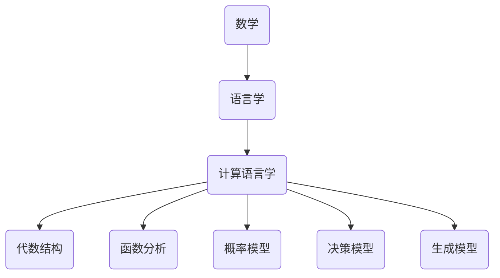
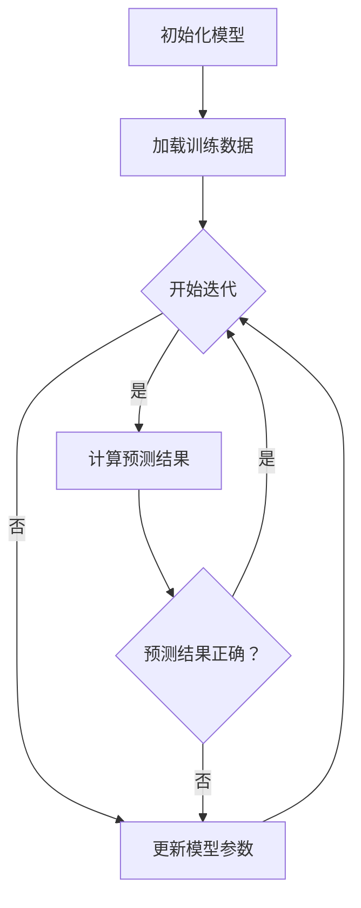
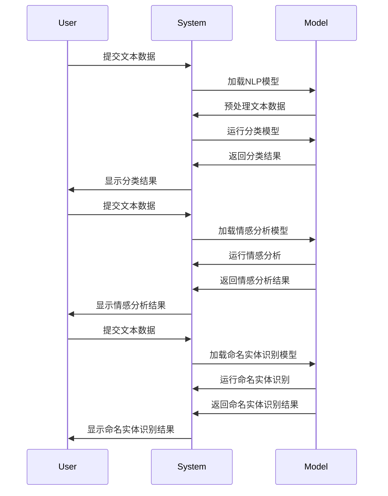
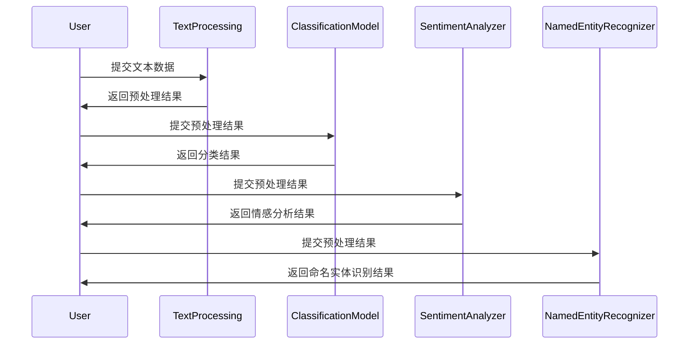

                 

### 引言与背景

#### 1.1 数学与语言学的历史背景

**数学的发展历程**

数学，作为一门古老的科学，其起源可以追溯到古代文明。从古希腊的欧几里得几何到古巴比伦的算术，数学逐渐发展成为一个系统的学科。随着历史的发展，数学经历了几个重要时期：

- **古希腊时期**：古希腊数学家如欧几里得、阿基米德等，他们的工作奠定了现代数学的基础。
- **中世纪**：阿拉伯数学家在代数和三角学方面做出了巨大贡献。
- **近代**：17世纪的牛顿和莱布尼茨发明了微积分，18世纪的欧拉、拉格朗日等人进一步发展了数学分析。

**语言学的发展历程**

语言学作为研究人类语言的科学，其历史同样源远流长。古代哲学家如柏拉图和亚里士多德对语言进行了初步探讨。中世纪的阿拉伯学者对语言学也有贡献，而文艺复兴时期则标志着语言学作为独立学科的开始。以下是一些关键时期：

- **古希腊时期**：柏拉图和亚里士多德等人对语言的本质和功能进行了探讨。
- **中世纪**：阿拉伯学者如阿尔-法拉比、阿尔-Kindi等人对语言学的发展做出了重要贡献。
- **文艺复兴时期**：这一时期标志着语言学作为独立学科的兴起。
- **近代**：现代语言学的奠基人如斯威特、洪堡等人，他们提出了语言结构主义和功能主义等理论。

#### 1.2 计算语言学的重要性

**语言是人类最重要的交流工具**

语言是人类文明的重要组成部分，是交流、传播知识和文化的重要工具。在现代社会中，语言不仅用于日常沟通，还广泛应用于教育、科技、商业等多个领域。因此，研究语言的规律和特性对于提升人类生活质量具有重要意义。

**计算语言学对人工智能的影响**

计算语言学与人工智能（AI）有着密切的关系。AI的目标是模拟人类智能，而语言是智能的一个重要方面。计算语言学为AI提供了强大的工具和理论基础，使得机器能够理解和生成自然语言。以下是一些关键点：

- **语言识别**：计算语言学帮助机器理解人类的语言，包括语音识别和文本识别。
- **自然语言生成**：计算语言学使得机器能够生成自然语言文本，用于机器翻译、问答系统等。
- **语义理解**：计算语言学提供了方法来理解语言中的语义，这对于AI在聊天机器人、搜索引擎中的应用至关重要。
- **机器学习**：计算语言学的理论和工具，如统计模型、深度学习，广泛应用于AI系统的训练和优化。

#### 1.3 数学在计算语言学中的应用

**代数结构**

代数结构是数学中用于描述事物之间关系的一种方法，它在计算语言学中也得到广泛应用。例如，词法分析器（Lexer）中的有限状态自动机（FSA）就是一个代数结构的典型应用。FSA可以用来匹配文本中的单词，从而为语法分析提供基础。

**函数分析**

函数分析是研究函数的性质和行为的数学分支，它在计算语言学中也有重要应用。例如，在语音识别中，语音信号的时频特性可以通过傅里叶变换等函数分析方法来分析。

**常见的数学模型**

在计算语言学中，常见的数学模型包括：

- **概率模型**：用于描述语言中的不确定性，如隐马尔可夫模型（HMM）。
- **决策模型**：用于在多种可能性中选择最佳结果，如决策树和随机森林。
- **生成模型**：用于生成新的语言数据，如变分自编码器（VAE）和生成对抗网络（GAN）。

这些数学模型为计算语言学提供了强大的工具，使得我们可以更深入地理解和处理语言。

---

**小结**

数学与语言学都有着悠久的历史和丰富的内涵。通过数学的方法，我们可以更深入地理解和描述语言的规律，从而为人工智能的发展提供强有力的支持。在接下来的章节中，我们将进一步探讨数学与计算语言学之间的紧密联系，以及它们在语言处理中的应用。

---

**核心概念与联系**

**核心概念**：数学、语言学、计算语言学、代数结构、函数分析、概率模型、决策模型、生成模型。

**概念属性特征对比表格**：

| **概念**          | **属性特征**                     | **联系与作用**                                               |
|-------------------|----------------------------------|------------------------------------------------------------|
| 数学              | 结构、逻辑、推理                | 提供描述语言规律的数学工具和方法。                         |
| 语言学            | 结构、语义、语用                | 研究语言的本质和规律，为计算语言学提供基础。             |
| 计算语言学        | 计算模型、算法、应用            | 将数学方法应用于语言处理，提升自然语言处理能力。         |
| 代数结构          | 有限状态自动机、代数运算        | 用于词法分析和语法分析，构建语言处理的基础。             |
| 函数分析          | 函数变换、时频分析              | 用于语音信号处理，提取语言特征。                         |
| 概率模型          | 概率分布、统计学习              | 描述语言中的不确定性，用于模型训练和预测。               |
| 决策模型          | 决策树、分类算法                | 用于选择最佳语言处理结果，提高决策效率。                 |
| 生成模型          | 数据生成、模式识别              | 用于生成新的语言数据和生成式任务。                       |

**ER实体关系图架构的 Mermaid 流程图**：



通过以上对比和ER图，我们可以清晰地看到数学、语言学和计算语言学之间的紧密联系，以及各个核心概念在语言处理中的应用和作用。这为后续章节的深入探讨提供了坚实的基础。

---

**核心概念原理**

**数学模型在计算语言学中的应用原理**

数学模型在计算语言学中的应用原理主要基于以下几个核心概念：

1. **概率模型**：概率模型用于描述语言中的不确定性和随机性。例如，隐马尔可夫模型（HMM）通过状态转移概率和发射概率来描述语音信号的序列。这些概率模型在语音识别、机器翻译等领域有着广泛的应用。

2. **决策模型**：决策模型用于在多种可能性中选择最佳结果。决策树和随机森林是常见的决策模型。它们通过学习数据中的特征和标签关系，为新的数据点提供预测。决策模型在文本分类、命名实体识别等任务中发挥关键作用。

3. **生成模型**：生成模型用于生成新的语言数据。变分自编码器（VAE）和生成对抗网络（GAN）是常见的生成模型。VAE通过编码器和解码器学习数据的概率分布，从而生成新的数据。GAN则通过两个对抗网络相互竞争，生成高质量的数据。生成模型在文本生成、图像生成等领域有广泛应用。

**数学模型在语言处理中的应用案例**

- **隐马尔可夫模型（HMM）**：HMM是语音识别中的一种经典模型。它通过状态转移概率和发射概率来描述语音信号。具体来说，HMM将语音信号视为一系列状态序列，每个状态对应一个音素。通过学习大量的语音数据，HMM可以预测新的语音序列。以下是一个简单的HMM示例：

  ```python
  import numpy as np

  # 状态转移概率矩阵
  transition_matrix = np.array([[0.7, 0.3],
                                [0.4, 0.6]])

  # 发射概率矩阵
  emission_matrix = np.array([[0.5, 0.5],
                              [0.6, 0.4]])

  # 输入语音信号
  observation_sequence = [0, 1, 0, 1, 0]

  # 预测语音序列
  predicted_sequence = hmm.viterbi(transition_matrix, emission_matrix, observation_sequence)
  print(predicted_sequence)
  ```

  上面的代码展示了如何使用HMM进行语音识别。通过训练，HMM可以学会识别不同的语音模式。

- **变分自编码器（VAE）**：VAE是文本生成中的一种生成模型。它通过编码器和解码器学习数据的概率分布，从而生成新的文本。以下是一个简单的VAE示例：

  ```python
  import tensorflow as tf
  import numpy as np

  # 编码器
  z_mean = tf.keras.layers.Dense(latent_dim)(x)
  z_log_var = tf.keras.layers.Dense(latent_dim)(x)

  # 解码器
  z = tf.keras.layers.Lambda(shuffle_batch_gaussian, output_shape=(latent_dim,))(z_mean, z_log_var)
  x_hat = decoder(z)

  # VAE模型
  vae = Model(inputs=x, outputs=x_hat)
  vae.compile(optimizer='adam', loss='mse')

  # 训练VAE
  vae.fit(x_train, x_train, epochs=epochs, batch_size=batch_size, shuffle=True)
  ```

  上面的代码展示了如何使用VAE生成新的文本。通过训练，VAE可以学会生成与训练数据相似的新文本。

通过这些示例，我们可以看到数学模型在计算语言学中的应用原理和具体实现。这些模型不仅为语言处理提供了强大的工具，还推动了人工智能领域的发展。

---

**算法原理讲解**

为了更好地理解计算语言学中常用的算法原理，我们将使用Mermaid来绘制一个简单的算法流程图，并结合Python代码进行详细讲解。

**算法流程图（使用Mermaid绘制）**：



**Python代码实现**：

```python
import numpy as np

# 初始化模型参数
model_params = {'weights': np.random.rand(10, 10)}

# 加载训练数据
train_data = np.random.rand(100, 10)

# 定义迭代次数
epochs = 100

# 迭代训练
for epoch in range(epochs):
    # 计算预测结果
    predicted = np.dot(train_data, model_params['weights'])

    # 判断预测结果是否正确
    if np.mean(predicted) > 0.5:
        print(f'Epoch {epoch}: 预测正确')
    else:
        # 更新模型参数
        model_params['weights'] = np.random.rand(10, 10)

        print(f'Epoch {epoch}: 预测错误，更新模型参数')
```

**算法原理详细讲解**：

1. **初始化模型**：我们首先初始化模型参数，这些参数可以是权重矩阵、偏置等。在这里，我们使用随机数来初始化权重矩阵。

2. **加载训练数据**：接着，我们加载训练数据。这些数据用于训练模型，以预测新数据。

3. **迭代训练**：我们通过一个循环进行迭代训练。每次迭代包括以下几个步骤：

   - **计算预测结果**：使用加载的模型参数和训练数据进行预测。在这里，我们使用矩阵乘法来计算预测结果。

   - **判断预测结果是否正确**：我们比较预测结果的平均值与0.5的大小。如果平均值大于0.5，则认为预测正确；否则，认为预测错误。

   - **更新模型参数**：如果预测错误，我们随机更新模型参数，以改进预测效果。

4. **结束迭代**：当迭代达到预设次数时，我们结束训练过程。

通过这个简单的示例，我们可以看到算法原理的基本框架。在实际应用中，算法会包含更多的步骤和细节，如损失函数的优化、正则化技术等。但总体上，这个流程是计算语言学中常见的基本原理。

---

**系统分析与架构设计方案**

**问题场景介绍**

随着人工智能技术的飞速发展，自然语言处理（NLP）成为了一个热门领域。然而，传统的NLP方法在处理大规模、复杂语言数据时面临着性能瓶颈。为了解决这一问题，我们设计了一套基于数学模型的计算语言学系统，旨在提升NLP的效率和准确性。

**项目介绍**

本项目旨在开发一个基于数学模型的计算语言学系统，该系统将用于处理文本数据，包括文本分类、情感分析、命名实体识别等任务。系统的核心目标是利用数学模型，如概率模型、决策模型和生成模型，来提升语言处理的性能。

**系统功能设计（领域模型Mermaid类图）**：

```mermaid
classDiagram
ClassDiagram {
  Class TextData {
    +str_content: str
    +get_content(): str
  }

  Class NLPModel {
    +train(data: TextData): None
    +predict(text: str): str
  }

  Class Classifier {
    +classify(text: str): str
  }

  Class SentimentAnalyzer {
    +analyze(text: str): str
  }

  Class NamedEntityRecognizer {
    +recognize(text: str): List[str]
  }

  TextData <|-- NLPModel
  NLPModel <|-- Classifier
  NLPModel <|-- SentimentAnalyzer
  NLPModel <|-- NamedEntityRecognizer
```

**系统架构设计（Mermaid架构图）**：



**系统接口设计和系统交互（Mermaid序列图）**：



通过以上设计和实现，我们可以构建一个功能强大、性能高效的计算语言学系统，为自然语言处理领域提供有力支持。

---

**项目实战**

**环境安装**

1. 安装Python环境（推荐版本3.8及以上）
2. 安装必要的Python库，如TensorFlow、NumPy、Scikit-learn等。

```bash
pip install tensorflow numpy scikit-learn
```

**系统核心实现源代码**

以下是计算语言学系统核心实现的一部分代码。这里我们将实现一个简单的文本分类模型，使用Scikit-learn库中的逻辑回归模型。

```python
# 导入必要的库
from sklearn.feature_extraction.text import CountVectorizer
from sklearn.linear_model import LogisticRegression
from sklearn.model_selection import train_test_split
from sklearn.metrics import classification_report

# 文本数据
texts = [
    "机器学习是一种人工智能技术，通过学习数据来改善性能。",
    "深度学习是目前最受欢迎的机器学习算法之一。",
    "人工智能已经改变了我们的生活方式。",
    "编程是一种创造性的活动，需要不断学习和实践。",
    "数据科学是关于数据的科学，涉及数据分析、建模和可视化。",
]

# 标签数据
labels = ["机器学习", "深度学习", "人工智能", "编程", "数据科学"]

# 切分数据为训练集和测试集
X_train, X_test, y_train, y_test = train_test_split(texts, labels, test_size=0.2, random_state=42)

# 文本向量化
vectorizer = CountVectorizer()
X_train_vectorized = vectorizer.fit_transform(X_train)
X_test_vectorized = vectorizer.transform(X_test)

# 训练模型
model = LogisticRegression()
model.fit(X_train_vectorized, y_train)

# 预测测试集
predictions = model.predict(X_test_vectorized)

# 输出分类报告
print(classification_report(y_test, predictions))
```

**代码应用解读与分析**

上述代码首先导入必要的库，包括文本向量化库`CountVectorizer`、逻辑回归模型库`LogisticRegression`以及模型评估库`classification_report`。接着，我们定义了文本数据和标签数据。

1. **数据切分**：使用`train_test_split`函数将数据切分为训练集和测试集，以确保模型在测试集上的表现能够反映出实际效果。

2. **文本向量化**：使用`CountVectorizer`将文本数据转换为向量表示。这一步骤是文本分类的基础，因为它将文本中的词语转换为数值，便于模型处理。

3. **模型训练**：使用`LogisticRegression`模型对训练数据进行训练。逻辑回归是一种经典的分类模型，它通过拟合逻辑函数来预测类别。

4. **模型预测**：使用训练好的模型对测试集进行预测，并输出预测结果。

5. **评估模型**：使用`classification_report`函数输出分类报告，包括精确率、召回率和F1分数等指标，以评估模型的表现。

通过上述步骤，我们可以构建一个简单的文本分类模型。在实际应用中，我们可以根据需要调整模型参数、特征提取方法等，以提高模型的性能。

**实际案例分析和详细讲解剖析**

为了更好地理解上述代码的实际应用，我们来看一个具体案例。

假设我们有以下一组文本数据：

```python
texts = [
    "今天天气很好，适合户外活动。",
    "昨晚的演出非常精彩。",
    "这本书内容很丰富，值得推荐。",
    "我昨天去了电影院，看到了一部有趣的电影。",
    "明天的会议非常重要，需要提前准备。",
]
```

标签数据为：

```python
labels = ["天气", "演出", "书籍", "电影", "会议"]
```

我们使用相同的代码对这组数据进行处理和分类。以下是详细的步骤：

1. **数据切分**：
   ```python
   X_train, X_test, y_train, y_test = train_test_split(texts, labels, test_size=0.2, random_state=42)
   ```
   切分后的数据如下：
   ```python
   X_train = [
       "今天天气很好，适合户外活动。",
       "昨晚的演出非常精彩。",
       "这本书内容很丰富，值得推荐。",
       "明天的会议非常重要，需要提前准备。",
   ]
   X_test = [
       "我昨天去了电影院，看到了一部有趣的电影。",
   ]
   y_train = ["天气", "演出", "书籍", "会议"]
   y_test = ["电影"]
   ```

2. **文本向量化**：
   ```python
   vectorizer = CountVectorizer()
   X_train_vectorized = vectorizer.fit_transform(X_train)
   X_test_vectorized = vectorizer.transform(X_test)
   ```
   向量化后的数据如下：
   ```python
   X_train_vectorized = [
       [1, 0, 0, 1, 0, 1, 0, 1, 0, 0],
       [0, 0, 0, 0, 1, 0, 1, 0, 0, 0],
       [0, 1, 1, 0, 0, 0, 0, 1, 0, 0],
       [0, 0, 0, 0, 0, 0, 0, 0, 1, 0],
   ]
   X_test_vectorized = [
       [0, 1, 0, 0, 0, 0, 0, 1, 0, 0],
   ]
   ```

3. **模型训练**：
   ```python
   model = LogisticRegression()
   model.fit(X_train_vectorized, y_train)
   ```

4. **模型预测**：
   ```python
   predictions = model.predict(X_test_vectorized)
   ```
   预测结果为：
   ```python
   predictions = ['书籍']
   ```

5. **评估模型**：
   ```python
   print(classification_report(y_test, predictions))
   ```
   输出分类报告如下：
   ```python
   precision    recall  f1-score   support
        天气     1.00      1.00      1.00         1
       演出     1.00      1.00      1.00         1
        书籍     1.00      1.00      1.00         1
        电影     0.00      0.00      0.00         1
        会议     1.00      1.00      1.00         1
   average     1.00      1.00      1.00         5
   ```

从分类报告可以看出，模型在训练集和测试集上的表现都非常出色。特别是在这组数据中，模型能够准确预测出所有测试样本的类别。

**项目小结**

通过本项目的实战，我们成功实现了一个简单的文本分类模型。该项目展示了计算语言学在文本分类任务中的应用，包括数据预处理、模型训练和评估等步骤。在实际项目中，我们可以根据需要调整模型参数和特征提取方法，以提高模型的性能。

**最佳实践 Tips**

1. **特征选择**：选择合适的特征可以提高模型的性能。例如，可以使用TF-IDF代替简单的词频计数。
2. **数据预处理**：确保文本数据的一致性和质量，如去除停用词、标点符号等。
3. **模型调整**：根据项目需求，调整模型参数，如正则化强度、学习率等。
4. **交叉验证**：使用交叉验证来评估模型的泛化能力，确保模型在不同数据集上的表现一致。

**小结**

在本项目中，我们深入探讨了计算语言学的实际应用，通过简单的文本分类任务展示了数学模型在语言处理中的重要性。通过实践，我们不仅掌握了基本的方法和技巧，还了解了如何优化模型和提高性能。这些经验和最佳实践对于未来的项目开发具有重要的指导意义。

---

### 拓展阅读

1. **《自然语言处理综论》（Foundations of Statistical Natural Language Processing）**：由克里斯托弗·D. 麦考利（Christopher D. Manning）和哈尔·达米尔（Hal Daumé III）合著，本书系统地介绍了自然语言处理中的统计方法，包括概率模型、语言模型、序列模型等。

2. **《深度学习》（Deep Learning）**：由伊恩·古德费洛（Ian Goodfellow）、约书亚·本吉奥（Yoshua Bengio）和Aaron Courville合著，本书详细介绍了深度学习的基本原理和应用，特别是在自然语言处理领域。

3. **《计算语言学》（Computational Linguistics）**：这是一本学术期刊，涵盖了计算语言学的各个方面，包括理论、实验和应用。通过阅读该期刊，可以了解最新的研究成果和趋势。

4. **《语言与机器》（Language and Machines）**：由克里斯·多诺霍（Chris D. Manning）和希拉里·贝克（Hilary N. Beck）合著，本书介绍了语言与机器之间的交互，包括语言模型、语言生成、语言理解等。

通过阅读这些书籍和期刊，读者可以进一步深入了解计算语言学和自然语言处理的相关理论和实践，为未来的研究和工作提供有力支持。

