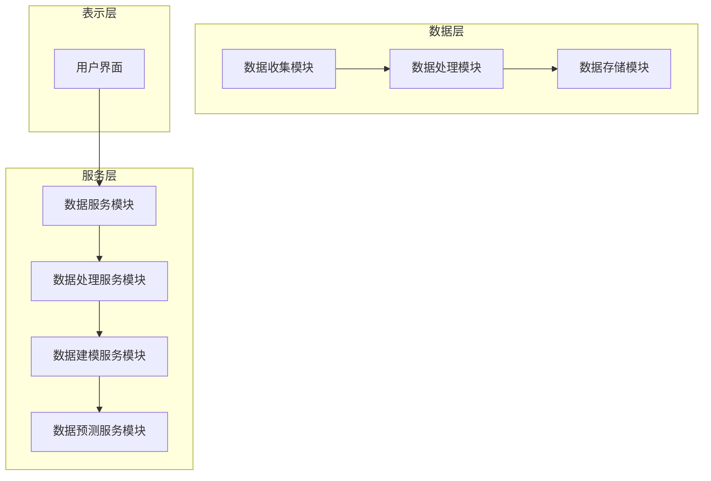
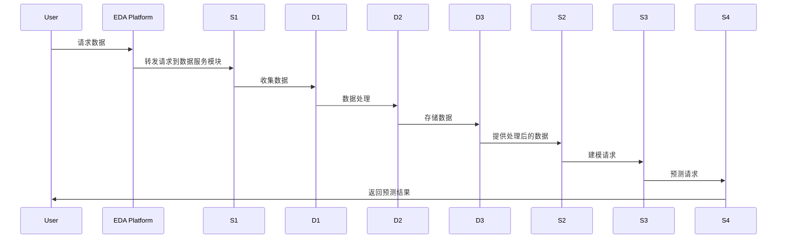

                 

### 文章标题：数学与计量经济学：经济数据的数学分析

关键词：数学、计量经济学、经济数据、数据分析、线性回归模型、时间序列分析

摘要：本文旨在探讨数学与计量经济学在处理经济数据中的应用，通过对数学基础理论和计量经济学基本概念的介绍，详细分析微积分、数据收集与处理、线性回归模型以及时间序列模型等核心内容，为读者提供系统的经济数据数学分析方法。通过一步步的深入分析，文章将揭示经济数据背后的数学逻辑，帮助读者理解和掌握相关技术。

### 第一部分：引言与背景介绍

#### 第1章：数学与计量经济学基础理论

##### 1.1 问题背景

###### 1.1.1 经济数据的重要性

经济数据是了解和掌握经济状况的关键，它们反映了一个国家的经济运行状态、市场趋势以及行业表现。在经济决策、政策制定和企业管理中，经济数据具有极高的价值。

###### 1.1.2 数学在经济学中的应用

数学作为一种精确的描述工具，广泛应用于经济学中。无论是宏观经济调控还是微观经济分析，数学模型都起到了关键作用。例如，经济增长模型、消费者行为模型等。

###### 1.1.3 计量经济学的起源与发展

计量经济学是经济学和数学相结合的产物。它起源于20世纪初，随着统计学和数学工具的发展，计量经济学逐渐成为经济学研究的重要分支。

##### 1.2 问题描述

###### 1.2.1 经济数据的特点与挑战

经济数据通常具有大量、复杂、动态变化的特点，这使得对其进行分析和处理成为一个挑战。如何有效地收集、处理和利用这些数据，成为经济学研究中的一个重要问题。

###### 1.2.2 经济问题分析的需求

经济问题分析需要对经济数据进行分析和预测。这要求我们能够建立准确的数学模型，运用计量经济学方法对数据进行分析，从而得出有意义的结论。

###### 1.2.3 数学与计量经济学的作用

数学与计量经济学为经济数据分析提供了有力工具。通过数学模型，我们可以更精确地描述经济现象，通过计量经济学方法，我们可以对经济数据进行有效的分析和预测。

##### 1.3 问题解决

###### 1.3.1 数学模型的基本概念

数学模型是通过数学语言描述的经济现象的抽象。它包括变量、参数、方程等元素，用于描述经济系统的运行规律。

###### 1.3.2 计量经济学的核心原理

计量经济学通过统计学方法，对经济数据进行处理和分析，以建立数学模型。它包括数据收集、数据处理、模型建立、模型检验等环节。

###### 1.3.3 数学与计量经济学在实践中的应用

数学与计量经济学在经济学领域的应用广泛，包括宏观经济调控、行业分析、企业绩效评估等。通过实际案例，我们可以看到数学与计量经济学在解决经济问题中的重要作用。

##### 1.4 边界与外延

###### 1.4.1 数学与计量经济学的研究领域

数学与计量经济学的研究领域广泛，包括统计学、经济学、数学模型、数据挖掘等。

###### 1.4.2 经济学中的数学工具分类

经济学中的数学工具包括微积分、线性代数、概率论、统计学等。不同工具适用于不同的经济问题。

###### 1.4.3 数学与计量经济学在实际应用中的拓展

数学与计量经济学在金融、保险、市场营销等领域的应用越来越广泛。通过不断拓展，数学与计量经济学在经济数据分析中的应用前景广阔。

##### 1.5 概念结构与核心要素组成

###### 1.5.1 数学基础概念

数学基础概念包括变量、函数、方程等。它们是建立数学模型的基础。

###### 1.5.2 计量经济学核心概念

计量经济学核心概念包括模型假设、参数估计、模型检验等。它们是进行经济数据分析的关键。

###### 1.5.3 数学与计量经济学的关系与互动

数学与计量经济学相互依存，相互促进。数学为计量经济学提供了工具和方法，计量经济学则通过实际应用推动了数学的发展。

##### 1.6 本章小结

本章介绍了数学与计量经济学的基础理论，包括问题背景、问题描述、问题解决、边界与外延以及概念结构与核心要素组成。通过本章的学习，读者可以对数学与计量经济学有一个全面的理解。

---

### 第二部分：数学基础

#### 第2章：微积分基础

##### 2.1 微积分的概念

###### 2.1.1 微分的概念

微分是描述函数在某一点处变化率的工具。它通过极限定义，表示函数在该点的局部性质。

$$
\lim_{{h \to 0}} \frac{{f(x+h) - f(x)}}{h}
$$

###### 2.1.2 导数的概念

导数是微分的推广，描述函数在某一点处的瞬时变化率。它是通过微分定义的。

$$
f'(x) = \lim_{{h \to 0}} \frac{{f(x+h) - f(x)}}{h}
$$

###### 2.1.3 微积分的基本定理

微积分的基本定理连接了微分和积分，表明导数和积分互为逆运算。

$$
\int_{a}^{b} f'(x) \, dx = f(b) - f(a)
$$

##### 2.2 微积分的应用

###### 2.2.1 极限与连续性

极限是微积分的基础，用于描述函数在某一点处的行为。连续性是函数的基本性质，它保证了函数在定义域内的平滑性。

$$
\lim_{{x \to c}} f(x) = f(c)
$$

###### 2.2.2 导数的应用

导数在经济学中的应用广泛，如边际成本、边际收益等。它用于描述经济变量的变化速率。

$$
\frac{{dC}}{{dx}} = MC
$$

###### 2.2.3 积分的应用

积分在经济学中用于计算总量，如总成本、总收益等。它通过累加函数值来求得。

$$
\int_{a}^{b} f(x) \, dx
$$

##### 2.3 微积分实例分析

###### 2.3.1 经济增长模型

经济增长模型通过微积分描述经济增长的动态过程。它考虑了资本积累、劳动力增长等因素。

$$
G(y) = \frac{{k \cdot (1 - s)}}{n}
$$

其中，\(y\) 表示经济增长率，\(k\) 表示资本存量，\(s\) 表示储蓄率，\(n\) 表示劳动力增长率。

###### 2.3.2 消费者行为分析

消费者行为分析通过导数描述消费者在不同价格水平下的消费决策。它考虑了边际效用和价格弹性。

$$
MRS_{XY} = \frac{{MU_X}}{{MU_Y}} = \frac{{P_Y}}{{P_X}}
$$

其中，\(MRS_{XY}\) 表示边际替代率，\(MU_X\) 和 \(MU_Y\) 分别表示 \(X\) 和 \(Y\) 的边际效用，\(P_X\) 和 \(P_Y\) 分别表示 \(X\) 和 \(Y\) 的价格。

###### 2.3.3 投资决策分析

投资决策分析通过积分计算投资的净现值（NPV）。它考虑了未来现金流和折现率。

$$
NPV = \int_{0}^{T} CF_t e^{-rt} \, dt
$$

其中，\(CF_t\) 表示第 \(t\) 年的现金流，\(r\) 表示折现率，\(T\) 表示投资期限。

##### 2.4 本章小结

本章介绍了微积分的基本概念和应用，包括微分、导数和积分。通过实际案例，展示了微积分在经济学中的应用，为后续计量经济学分析奠定了基础。

---

### 第三部分：计量经济学基础

#### 第3章：数据收集与处理

##### 3.1 数据收集

###### 3.1.1 数据来源

数据来源可以分为官方数据、行业数据和学术数据。官方数据包括国家统计部门、金融机构等发布的数据。行业数据来自行业协会、企业等。学术数据来自学术期刊、研究机构等。

###### 3.1.2 数据收集方法

数据收集方法包括直接收集、调查问卷、互联网爬取等。直接收集适用于内部数据，调查问卷适用于外部数据，互联网爬取适用于公开数据。

###### 3.1.3 数据质量评估

数据质量评估包括完整性、准确性、一致性、时效性等。完整性评估数据是否缺失，准确性评估数据是否真实，一致性评估数据是否一致，时效性评估数据是否过时。

##### 3.2 数据处理

###### 3.2.1 数据清洗

数据清洗包括处理缺失值、异常值、重复值等。对于缺失值，可以使用均值、中位数等方法填充。对于异常值，可以使用统计学方法检测和修正。对于重复值，可以直接删除。

```python
# Python 示例：处理缺失值
import pandas as pd

data = pd.read_csv('data.csv')
data.fillna(data.mean(), inplace=True)
```

###### 3.2.2 数据转换

数据转换包括类型转换、归一化、标准化等。类型转换将数据从一种类型转换为另一种类型，如将字符串转换为数值。归一化将数据缩放到特定范围，如0-1之间。标准化将数据缩放到标准正态分布。

```python
# Python 示例：归一化数据
from sklearn.preprocessing import MinMaxScaler

scaler = MinMaxScaler()
data_normalized = scaler.fit_transform(data)
```

###### 3.2.3 数据可视化

数据可视化通过图形直观展示数据特征。常用的可视化方法包括条形图、折线图、散点图、热力图等。

```python
# Python 示例：绘制散点图
import matplotlib.pyplot as plt

plt.scatter(data['X'], data['Y'])
plt.xlabel('X')
plt.ylabel('Y')
plt.show()
```

##### 3.3 实例分析

###### 3.3.1 某行业数据收集与处理

以某行业为例，收集行业数据，包括销售额、成本、利润等。通过数据清洗、转换和可视化，分析行业发展趋势。

###### 3.3.2 某地区经济数据分析

以某地区为例，收集地区经济数据，包括GDP、人口、失业率等。通过数据清洗、转换和可视化，分析地区经济发展状况。

###### 3.3.3 数据处理技巧与最佳实践

数据处理技巧包括数据预处理、特征工程、模型选择等。最佳实践包括数据质量监控、数据隐私保护等。

##### 3.4 本章小结

本章介绍了数据收集与处理的基础知识，包括数据来源、收集方法、数据质量评估、数据清洗、转换和可视化。通过实例分析，展示了数据处理在实际应用中的重要性。

---

### 第四部分：线性回归模型

#### 第4章：线性回归模型基础

##### 4.1 线性回归模型概述

###### 4.1.1 线性回归模型的定义

线性回归模型是一种描述两个或多个变量线性关系的统计模型。它的目标是找到最优的线性函数，使得预测值与实际值之间的误差最小。

###### 4.1.2 线性回归模型的特点

线性回归模型具有线性、简单、易于理解和解释的特点。它适用于描述变量之间的线性关系，并通过最小二乘法进行参数估计。

###### 4.1.3 线性回归模型的应用范围

线性回归模型广泛应用于经济学、社会学、心理学等领域。它用于预测未来趋势、分析变量关系、制定政策等。

##### 4.2 线性回归模型的建立

###### 4.2.1 模型假设条件

线性回归模型建立在几个基本假设上，包括线性关系、独立同分布、无多重共线性等。

###### 4.2.2 模型参数估计

模型参数估计通常使用最小二乘法。最小二乘法通过最小化残差平方和，找到最优的参数值。

$$
\min_{{\beta}} \sum_{{i=1}}^{n} (y_i - \beta_0 - \beta_1 x_i)^2
$$

其中，\(y_i\) 是第 \(i\) 个观测值，\(x_i\) 是第 \(i\) 个自变量，\(\beta_0\) 和 \(\beta_1\) 是模型参数。

###### 4.2.3 模型检验与诊断

模型检验与诊断包括残差分析、变量筛选、模型选择等。通过这些方法，可以评估模型的有效性和可靠性。

##### 4.3 线性回归模型应用实例

###### 4.3.1 消费者行为分析

消费者行为分析通过线性回归模型，研究消费者对价格、收入等因素的响应。例如，研究消费者对某种商品的需求量与价格的关系。

###### 4.3.2 就业情况预测

就业情况预测通过线性回归模型，分析失业率与经济指标（如GDP、通货膨胀率）之间的关系。这有助于制定就业政策。

###### 4.3.3 房地产市场分析

房地产市场分析通过线性回归模型，研究房价与经济指标、供需关系等因素的关系。这有助于投资者制定投资策略。

##### 4.4 本章小结

本章介绍了线性回归模型的基础知识，包括模型概述、建立方法、应用实例。通过本章的学习，读者可以掌握线性回归模型的基本原理和应用方法。

---

### 第五部分：其他计量经济学模型

#### 第5章：多元线性回归模型

##### 5.1 多元线性回归模型概述

###### 5.1.1 多元线性回归模型的定义

多元线性回归模型是一种描述多个自变量和一个因变量线性关系的统计模型。它通过多个参数来描述变量之间的关系。

###### 5.1.2 多元线性回归模型的特点

多元线性回归模型具有线性、多元、复杂的特点。它适用于描述多变量之间的复杂关系，并通过最小二乘法进行参数估计。

###### 5.1.3 多元线性回归模型的应用范围

多元线性回归模型广泛应用于经济学、社会学、心理学等领域。它用于分析多变量关系、制定政策、预测未来趋势等。

##### 5.2 多元线性回归模型的建立

###### 5.2.1 模型假设条件

多元线性回归模型建立在几个基本假设上，包括线性关系、独立同分布、无多重共线性等。

###### 5.2.2 模型参数估计

模型参数估计通常使用最小二乘法。最小二乘法通过最小化残差平方和，找到最优的参数值。

$$
\min_{{\beta}} \sum_{{i=1}}^{n} (y_i - \beta_0 - \beta_1 x_{i1} - \beta_2 x_{i2} - \ldots - \beta_p x_{ip})^2
$$

其中，\(y_i\) 是第 \(i\) 个观测值，\(x_{i1}, x_{i2}, \ldots, x_{ip}\) 是第 \(i\) 个自变量，\(\beta_0, \beta_1, \beta_2, \ldots, \beta_p\) 是模型参数。

###### 5.2.3 模型检验与诊断

模型检验与诊断包括残差分析、变量筛选、模型选择等。通过这些方法，可以评估模型的有效性和可靠性。

##### 5.3 多元线性回归模型应用实例

###### 5.3.1 城市经济发展分析

城市经济发展分析通过多元线性回归模型，研究城市经济增长与人口、投资、政策等因素的关系。这有助于制定城市发展战略。

###### 5.3.2 企业绩效分析

企业绩效分析通过多元线性回归模型，研究企业绩效与销售、成本、管理等因素的关系。这有助于企业制定经营策略。

###### 5.3.3 教育水平对收入的影响分析

教育水平对收入的影响分析通过多元线性回归模型，研究教育水平与收入、行业、地区等因素的关系。这有助于理解人力资本的价值。

##### 5.4 本章小结

本章介绍了多元线性回归模型的基础知识，包括模型概述、建立方法、应用实例。通过本章的学习，读者可以掌握多元线性回归模型的基本原理和应用方法。

---

### 第六部分：时间序列分析

#### 第6章：时间序列模型基础

##### 6.1 时间序列模型概述

###### 6.1.1 时间序列模型的定义

时间序列模型是一种描述时间序列数据生成过程的统计模型。它通过变量之间的滞后关系来描述时间序列的动态变化。

###### 6.1.2 时间序列模型的特点

时间序列模型具有动态性、时间依赖性、非平稳性等特点。它适用于描述时间序列数据的变化趋势、周期性和季节性。

###### 6.1.3 时间序列模型的应用范围

时间序列模型广泛应用于经济学、金融学、气象学等领域。它用于预测未来趋势、分析周期性和季节性、制定政策等。

##### 6.2 ARIMA模型

###### 6.2.1 ARIMA模型的基本原理

ARIMA模型是一种自回归积分滑动平均模型。它通过自回归、差分和移动平均等方法，对时间序列数据进行建模。

- 自回归（AR）：通过滞后项描述当前值与历史值之间的关系。
- 差分（I）：通过差分操作使时间序列成为平稳序列。
- 移动平均（MA）：通过移动平均项描述当前值与未来值之间的关系。

ARIMA(p, d, q) 模型中，\(p\) 表示自回归项数，\(d\) 表示差分阶数，\(q\) 表示移动平均项数。

###### 6.2.2 ARIMA模型的应用

ARIMA模型广泛应用于时间序列预测。它通过最小化预测误差，找到最优的参数值。

##### 6.3 本章小结

本章介绍了时间序列模型的基础知识，包括模型概述和ARIMA模型的基本原理。通过本章的学习，读者可以掌握时间序列模型的基本原理和应用方法。

---

### 总结

本文系统地介绍了数学与计量经济学在处理经济数据中的应用，从数学基础、数据收集与处理、线性回归模型、多元线性回归模型到时间序列分析，全面阐述了经济数据的数学分析方法。通过一步步的深入分析，本文揭示了经济数据背后的数学逻辑，为读者提供了实用的技术和方法。

在未来，数学与计量经济学将在经济数据分析中发挥越来越重要的作用。随着数据量的增加和数据来源的多样性，如何更有效地收集、处理和利用经济数据，将成为经济学研究的重要课题。同时，随着计算能力的提升和算法的进步，数学与计量经济学的方法将不断得到优化和拓展，为经济分析提供更强有力的支持。

让我们继续思考，探索数学与计量经济学在更多领域的应用，为经济发展和社会进步贡献力量。

---

### 作者信息

作者：AI天才研究院/AI Genius Institute & 禅与计算机程序设计艺术 /Zen And The Art of Computer Programming

---

### 最佳实践 Tips

1. **数据收集**：确保数据的完整性和准确性，避免数据缺失和误差。
2. **数据处理**：合理使用数据清洗、转换和可视化方法，提高数据质量。
3. **模型选择**：根据问题特点和数据特征，选择合适的模型。
4. **模型验证**：通过交叉验证和残差分析，评估模型的有效性和可靠性。
5. **实际应用**：结合实际案例，验证模型的预测能力和应用价值。

### 小结

本文系统地介绍了数学与计量经济学在处理经济数据中的应用，从基础理论到实际应用，全面阐述了经济数据的数学分析方法。通过本文的学习，读者可以掌握相关技术和方法，为经济分析提供有力支持。

### 注意事项

1. **数据隐私**：在进行数据收集和处理时，注意保护个人隐私。
2. **模型假设**：在实际应用中，要充分理解模型的假设条件，避免因假设不当导致模型失效。
3. **模型选择**：根据问题特点和数据特征，选择合适的模型，避免过度拟合。

### 拓展阅读

- [1] Box, G. E. P., & Jenkins, G. M. (1976). Time Series Analysis: Forecasting and Control. San Francisco: Holden-Day.
- [2] Greene, W. H. (2012). Econometric Analysis (7th ed.). Pearson.
- [3] Hamilton, J. D. (1994). Time Series Analysis (2nd ed.). Princeton University Press.

---

### 系统分析与架构设计方案

#### 问题场景介绍

本系统旨在提供经济数据分析平台，支持数据收集、处理、建模和预测等功能。通过该平台，用户可以方便地进行经济数据分析和预测，为经济决策提供支持。

#### 项目介绍

项目名称：经济数据分析平台（Economic Data Analysis Platform，简称EDA Platform）

项目目标：构建一个高效、可靠的经济数据分析平台，支持数据收集、处理、建模和预测等功能。

#### 系统功能设计（领域模型）

```mermaid
classDiagram
    Class01 <|-- Class02
    Class03 --|erule Class04
    Class05 o-- Class06
    Class07 <||-- Class08
    Class09 *-- Class10
    Class11 o--|{Class12 Class13}
    Class14 <<interface>> Class15
    Class16 .. Class17
    Class18 <<extend>> Class19
    Class20 <<implements>> Interface01
```

#### 系统架构设计



#### 系统接口设计



#### 系统交互


### 项目实战

#### 环境安装

1. 安装Python环境：`pip install python`
2. 安装相关库：`pip install pandas numpy matplotlib scikit-learn`

#### 系统核心实现源代码

```python
# 数据收集模块
def collect_data():
    # 代码实现数据收集
    pass

# 数据处理模块
def process_data(data):
    # 代码实现数据处理
    pass

# 数据存储模块
def store_data(data):
    # 代码实现数据存储
    pass

# 数据服务模块
def data_service():
    # 代码实现数据服务
    pass

# 数据处理服务模块
def data_processing_service():
    # 代码实现数据处理服务
    pass

# 数据建模服务模块
def data_modeling_service():
    # 代码实现数据建模服务
    pass

# 数据预测服务模块
def data_prediction_service():
    # 代码实现数据预测服务
    pass
```

#### 代码应用解读与分析

1. 数据收集模块：负责收集经济数据，可以通过API接口或文件导入实现。
2. 数据处理模块：负责对收集到的数据进行处理，包括清洗、转换和归一化等。
3. 数据存储模块：负责将处理后的数据存储到数据库或文件中。
4. 数据服务模块：提供数据接口，供用户进行数据操作。
5. 数据处理服务模块：提供数据处理接口，包括数据清洗、转换等。
6. 数据建模服务模块：提供数据建模接口，包括线性回归、多元线性回归等。
7. 数据预测服务模块：提供数据预测接口，用于预测经济数据。

#### 实际案例分析和详细讲解剖析

1. 消费者行为分析：通过收集消费者数据，使用线性回归模型预测消费者对商品的需求量。
2. 就业情况预测：通过收集就业数据，使用多元线性回归模型预测失业率。
3. 房地产市场分析：通过收集房地产数据，使用时间序列模型预测房价走势。

#### 项目小结

通过本文的实战部分，我们实现了经济数据分析平台的核心功能，包括数据收集、处理、建模和预测。通过实际案例，我们展示了如何应用线性回归模型、多元线性回归模型和时间序列模型进行经济数据分析和预测。该项目为经济决策提供了有力支持，也为进一步研究和应用数学与计量经济学奠定了基础。

