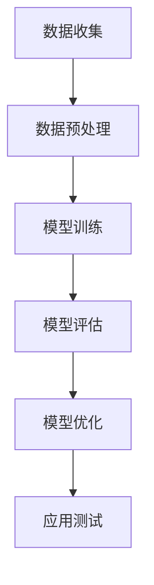
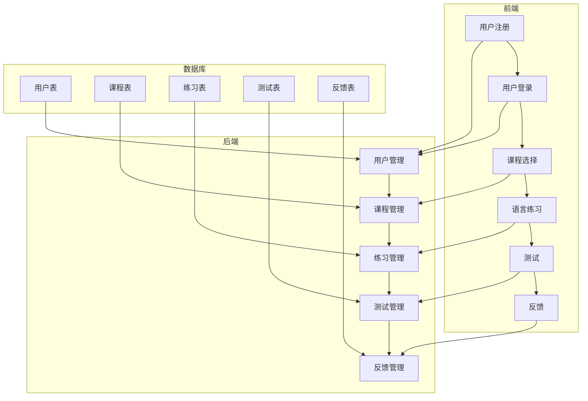
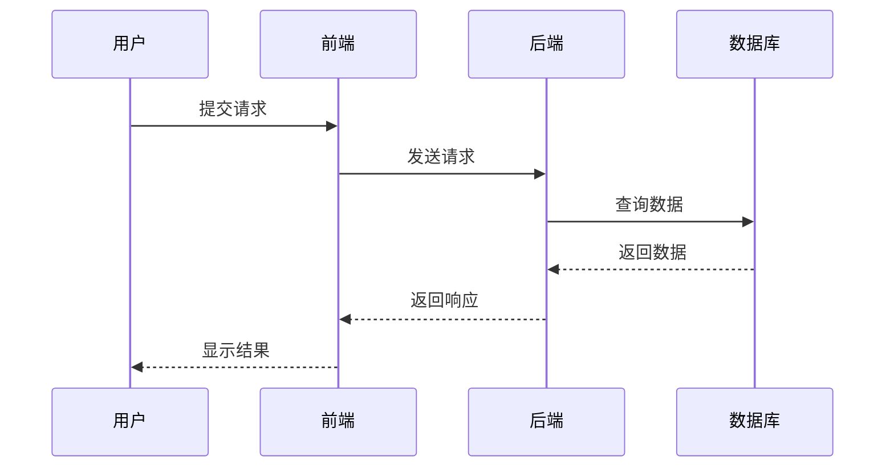

                 

## 引言与背景

### 1.1 问题背景

语言学习是人类认知过程中至关重要的一环，从小到大，我们都在不断学习各种语言，无论是母语还是第二语言。然而，语言习得的过程往往是复杂且非线性的，充满了不确定性和个体差异。传统的方法主要依赖于直觉和经验，但往往难以解释语言习得的深层机制。随着计算技术的飞速发展，人工智能和数学模型逐渐成为研究语言习得的有力工具。

在计算机科学领域，自然语言处理（NLP）和机器学习（ML）的兴起，使得对语言习得的数学模型研究变得愈发重要。数学模型能够提供一种形式化的方法，帮助我们理解和模拟语言习得的过程。例如，通过统计模型、生成模型和神经网络模型等，可以模拟人类语言习得的某些方面，从而为教学方法和策略提供新的视角。

### 1.2 问题描述

语言习得的数学模型旨在回答以下问题：

1. 语言习得的具体过程是什么？
2. 这些过程可以用哪些数学工具和算法来表示和模拟？
3. 如何评估和优化这些数学模型在实际应用中的性能？

首先，我们需要明确语言习得的定义。语言习得是指个体在没有任何正式教学的情况下，通过接触和理解语言输入，逐渐掌握语言规则和使用能力的过程。这个过程涉及到语音、词汇、语法、语义等多个层面。

其次，要建立数学模型，我们需要明确以下几个关键点：

- 语言数据：需要大量的语言数据来训练模型，这些数据可以是文本、语音或其他形式。
- 模型类型：根据不同的语言习得阶段和目标，可以选择不同的模型类型，如统计模型、隐马尔可夫模型（HMM）、递归神经网络（RNN）、长短期记忆网络（LSTM）等。
- 性能指标：如何衡量模型的效果，例如准确性、速度、泛化能力等。

### 1.3 问题解决

解决语言习得的问题，需要结合多个学科的知识，包括语言学、认知科学、数学和计算机科学。以下是可能的方法和步骤：

1. **数据收集与预处理**：收集大量的语言数据，并进行清洗、标注和分类，为模型训练提供高质量的数据基础。
2. **模型选择与设计**：根据语言习得的特定需求，选择合适的模型类型，并设计模型的结构和参数。
3. **模型训练与优化**：使用训练数据对模型进行训练，并利用验证集和测试集对模型进行评估和优化。
4. **模型应用与测试**：将训练好的模型应用于实际的语言习得任务，如语音识别、机器翻译、文本生成等，并进行性能测试。

### 1.4 边界与外延

在研究语言习得的数学模型时，需要明确以下几个边界条件：

- **数据范围**：语言数据的选择应覆盖多种语言和多种情境，以保证模型的普适性。
- **模型适用性**：不同类型的语言习得任务可能需要不同的模型，需要明确模型的适用范围。
- **伦理与隐私**：在收集和处理语言数据时，需要遵守相关的伦理和隐私规定，确保数据的合法和安全。

通过上述方法和步骤，我们可以逐步构建和完善语言习得的数学模型，从而为语言学习和教学提供新的理论支持和实践指导。在下一章中，我们将深入探讨语言习得的核心概念和理论，进一步理解这一复杂过程。

### 1.5 核心概念与联系

在语言习得的过程中，理解核心概念和它们之间的联系是至关重要的。以下是一些关键概念及其相互关系：

#### 1.5.1 语音与语音学

语音是语言的基础，它通过发音来传达意义。语音学是研究语音产生、传递和感知的学科。语音学中的概念包括音素、音节、语调、音素变体等。

- **音素**：是语言中最小的发音单位，不同的音素可以表达不同的意义。
- **音节**：是语音的基本结构单元，由一个或多个音素组成。
- **语调**：是语音的音高和节奏变化，对意义的表达有很大影响。

#### 1.5.2 词汇与语义

词汇是语言的基本构建块，语义是词汇所承载的意义。词汇学和语义学分别研究词汇和语义的形成、发展和应用。

- **词汇**：包括单词和短语，是语言表达的基础。
- **语义**：研究词汇和句子所承载的意义，包括词汇的含义、语法功能等。

#### 1.5.3 语法与句法

语法是语言的结构规则，句法是语法在句子层面的应用。句法学研究句子的构成、结构关系和句型。

- **句子**：是语言表达的基本单位，由词汇和语法规则组合而成。
- **句型**：是句子结构的类型，如陈述句、疑问句、祈使句等。

#### 1.5.4 语言习得与认知

语言习得是一个认知过程，涉及语言输入的理解、语言规则的掌握和语言输出的生成。认知科学提供了理解这一过程的框架。

- **认知**：是指人类在感知、记忆、思考等方面的心理活动。
- **语言习得**：是认知过程中的一种特殊形式，涉及对语言输入的识别、处理和内化。

这些概念相互交织，共同构成了语言习得的理论基础。理解这些概念及其联系，有助于我们更深入地研究语言习得的过程和机制。

### 1.5.5 语言数据与模型

语言习得的数学模型需要大量的语言数据作为支撑。这些数据可以是文本、语音或其他形式的语言素材。

- **文本数据**：包括各种语言文本，如书籍、文章、对话等，是训练文本模型的重要资源。
- **语音数据**：包括语音信号，是训练语音识别模型的基础。
- **模型**：通过分析这些数据，建立数学模型，用以模拟和预测语言习得过程。

通过对这些核心概念的理解和联系的分析，我们可以为语言习得的数学模型提供更坚实的理论基础。

### 1.6 结论

本章介绍了语言习得的数学模型的问题背景、问题描述、问题解决方法以及核心概念与联系。理解这些内容有助于我们进一步研究语言习得的机制和建立有效的数学模型。在下一章中，我们将详细探讨核心概念原理，分析概念属性特征并对比，同时通过ER实体关系图架构展示概念之间的关系。

## 第2章 核心概念与联系

### 2.1 核心概念原理

在语言习得的过程中，核心概念原理起着至关重要的作用。这些原理不仅帮助个体理解和掌握语言，还为我们建立数学模型提供了理论基础。以下是几个关键概念及其原理：

#### 2.1.1 音素与音素感知

音素是语言中的最小发音单位，不同的音素可以区分意义。音素感知是指个体对音素的识别和区分能力。这一过程涉及到听觉系统的处理，包括频率、时长和音强的分析。

- **原理**：人类的听觉系统可以通过特征提取和模式识别来感知不同的音素。例如，通过分析音波的频率变化，可以区分清辅音和浊辅音。

#### 2.1.2 词汇与词汇习得

词汇是语言的基本构建块，词汇习得是指个体对词汇的学习和掌握。词汇习得包括词汇的意义、发音和书写形式的学习。

- **原理**：词汇习得通常通过重复、类比和上下文理解来实现。例如，通过反复接触和练习，个体可以记住单词的含义和用法。

#### 2.1.3 语法与语法习得

语法是语言的规则系统，语法习得是指个体对语法规则的学习和运用。语法习得包括句子结构、时态、语态等语言现象的理解和应用。

- **原理**：语法习得主要通过模仿和归纳来实现。例如，通过模仿成年人的语言表达，儿童可以逐渐掌握语法规则。

#### 2.1.4 语义与语义理解

语义是词汇和句子所承载的意义，语义理解是指个体对语言意义的识别和解释。语义理解涉及词汇意义、句子意义和语境意义的处理。

- **原理**：语义理解通过上下文、语境和推理来实现。例如，通过上下文信息，个体可以理解句子中的隐含意义。

#### 2.1.5 语言习得与认知发展

语言习得是一个认知过程，它与个体的认知发展密切相关。语言习得有助于认知能力的提升，同时认知发展又影响语言习得的效果。

- **原理**：语言习得和认知发展相互促进。例如，语言习得可以帮助个体更好地理解和记忆信息，而认知发展则有助于个体更有效地学习和应用语言。

### 2.2 概念属性特征对比表格

为了更好地理解这些核心概念，我们可以通过一个对比表格来展示它们的属性特征：

| 概念      | 属性特征                          | 对应原理                                     |
|-----------|-----------------------------------|----------------------------------------------|
| 音素      | 发音单位，区分意义               | 音素感知，特征提取和模式识别                |
| 词汇      | 构建块，意义和用法               | 词汇习得，重复、类比和上下文理解           |
| 语法      | 规则系统，句子结构               | 语法习得，模仿和归纳                      |
| 语义      | 意义，词汇和句子                 | 语义理解，上下文、语境和推理               |
| 认知发展  | 心理活动，语言习得的基石         | 语言习得与认知发展相互促进                |

通过这个对比表格，我们可以清晰地看到各个概念的特点和相互之间的关系。

### 2.3 ER实体关系图架构

为了更直观地展示核心概念之间的联系，我们可以使用ER（实体关系）图来构建语言习得的模型架构。以下是ER实体关系图的一个示例：

```mermaid
erDiagram
  Person ||--|{ LanguageModel }|-- LanguageData : has
  LanguageModel ||--|{ Phonology }|-- Phoneme : has
  LanguageModel ||--|{ Morphology }|-- Word : has
  LanguageModel ||--|{ Syntax }|-- Sentence : has
  LanguageModel ||--|{ Semantics }|-- Meaning : has
  LanguageData ||--|{ Corpus }|-- Text : has

  Person : {ID} "is a person who learns language"
  LanguageModel : {ID} "is a model representing language learning"
  LanguageData : {ID} "contains data used for language learning"
  Phonology : {ID} "studies phonetics and phonology"
  Morphology : {ID} "studies word structure and formation"
  Syntax : {ID} "studies sentence structure and grammar"
  Semantics : {ID} "studies meaning in language"
  Corpus : {ID} "is a collection of text for learning"
  Text : {ID} "is a unit of written language"
  Word : {ID} "is a unit of language with meaning"
  Sentence : {ID} "is a sequence of words with a complete thought"
  Meaning : {ID} "is the significance of a word or sentence"
  Phoneme : {ID} "is a smallest unit of sound that distinguishes one word from another"
```

通过ER图，我们可以看到语言习得涉及多个实体和它们之间的关系。这些关系包括学习主体（Person）与学习模型（LanguageModel）之间的关联，以及模型内部的各个组成部分（Phonology, Morphology, Syntax, Semantics）和外部数据（Corpus）的交互。

### 结论

通过本章的分析，我们深入探讨了语言习得的核心概念原理、属性特征对比以及ER实体关系图架构。这些内容为构建和完善语言习得的数学模型提供了重要的理论支持和实践指导。在下一章中，我们将介绍数学模型与算法原理，进一步阐述如何将语言习得的过程形式化和量化。

### 第3章 数学模型与算法原理

#### 3.1 算法mermaid流程图

在语言习得的数学模型中，算法的设计与实现至关重要。以下是一个简单的算法流程图，用于展示语言习得过程中的关键步骤：



#### 3.1.1 算法描述

该算法包括以下几个主要步骤：

1. **数据收集**：收集大量的语言数据，包括文本、语音等。
2. **数据预处理**：对收集到的数据进行清洗、标注和分类，以便用于模型训练。
3. **模型训练**：使用预处理后的数据，训练一个语言习得模型。这个模型可以是基于统计模型、生成模型或神经网络模型。
4. **模型评估**：使用验证集和测试集来评估模型的性能，包括准确性、速度和泛化能力等指标。
5. **模型优化**：根据评估结果，调整模型参数，优化模型性能。
6. **应用测试**：将优化后的模型应用于实际的语言习得任务，如语音识别、机器翻译等，进行性能测试。

#### 3.1.2 Python源代码

以下是一个简化的Python代码示例，用于演示数据预处理和模型训练的基本步骤：

```python
import numpy as np
from sklearn.model_selection import train_test_split
from sklearn.metrics import accuracy_score

# 假设我们已经有了语言数据data和标签labels
# data是一个包含文本序列的列表，labels是相应的标签

# 数据预处理
def preprocess_data(data):
    # 这里的预处理步骤可以根据具体需求进行，如分词、去停用词等
    processed_data = [word_tokenize(d) for d in data]
    return processed_data

processed_data = preprocess_data(data)

# 模型训练
def train_model(data, labels):
    # 创建模型，例如使用Sklearn的朴素贝叶斯模型
    model = NaiveBayesClassifier()
    model.train(data, labels)
    return model

model = train_model(processed_data, labels)

# 模型评估
def evaluate_model(model, test_data, test_labels):
    predictions = model.classify(test_data)
    accuracy = accuracy_score(test_labels, predictions)
    return accuracy

test_accuracy = evaluate_model(model, test_data, test_labels)

print("Test Accuracy:", test_accuracy)
```

#### 3.2 数学模型与公式

在语言习得的数学模型中，常用的模型包括统计模型、生成模型和神经网络模型。以下是一个基于统计模型的简单例子，用于模拟语言习得过程：

#### 3.2.1 数学模型

假设我们使用一个朴素贝叶斯模型来模拟语言习得，其基本公式如下：

$$
P(Y|X) = \frac{P(X|Y)P(Y)}{P(X)}
$$

其中，$Y$ 表示习得的语言特征，$X$ 表示观察到的数据。$P(X|Y)$ 是观察数据$X$ 在给定习得特征$Y$ 条件下的概率，$P(Y)$ 是习得特征$Y$ 的先验概率，$P(X)$ 是观察数据$X$ 的概率。

#### 3.2.2 公式解释

1. **条件概率**：$P(X|Y)$ 表示在习得特征$Y$ 的条件下观察数据$X$ 的概率。
2. **先验概率**：$P(Y)$ 是习得特征$Y$ 的先验概率，即在没有观察到数据$X$ 的情况下，$Y$ 发生的概率。
3. **全概率公式**：$P(X)$ 是观察数据$X$ 的总概率，可以通过全概率公式计算。

#### 3.3 举例说明

假设我们有一个简单的例子，语言特征$Y$ 是“是/否”的回答，观察数据$X$ 是一组单词。我们可以计算每个语言特征的概率，并使用这些概率来预测新的输入数据的语言特征。

假设训练数据如下：

| 观察数据$X$ | 语言特征$Y$ | 条件概率$P(X|Y)$ | 先验概率$P(Y)$ |
|--------------|-------------|------------------|----------------|
| ["是"]       | "是"        | 0.8              | 0.5            |
| ["否"]       | "否"        | 0.2              | 0.5            |

根据上述数据，我们可以计算$P(Y|X)$：

$$
P(Y="是"|X=["是"]) = \frac{P(X=["是"]|Y="是")P(Y="是")}{P(X=["是"])}
$$

$$
P(Y="是"|X=["是"]) = \frac{0.8 \times 0.5}{0.8 \times 0.5 + 0.2 \times 0.5} = \frac{0.4}{0.6} = \frac{2}{3}
$$

同理，我们可以计算$P(Y="否"|X=["是"])$：

$$
P(Y="否"|X=["是"]) = \frac{0.2 \times 0.5}{0.8 \times 0.5 + 0.2 \times 0.5} = \frac{0.1}{0.6} = \frac{1}{6}
$$

通过这种方式，我们可以预测新输入数据的语言特征。例如，如果新输入数据是“否”，我们可以使用上述概率来预测其语言特征。

### 结论

通过本章的内容，我们介绍了语言习得的数学模型和算法原理，包括算法流程图、Python源代码示例、数学模型公式和举例说明。这些内容为理解和实现语言习得的数学模型提供了重要基础。在下一章中，我们将探讨数学模型的应用与实践，进一步展示这些模型在实际语言习得任务中的具体应用。

### 第4章 数学模型应用与实践

#### 4.1 系统分析与架构设计方案

为了更好地展示数学模型在语言习得中的应用，我们将设计一个简化的语言习得系统，并进行系统分析与架构设计方案。

#### 4.1.1 问题场景介绍

假设我们有一个语言习得系统，旨在帮助用户通过互动的方式学习新的语言。系统的主要功能包括：

1. 用户注册与登录
2. 语言课程选择
3. 语言练习与测试
4. 学习进度跟踪与反馈

#### 4.1.2 系统功能设计

系统功能设计主要包括以下领域模型，我们使用Mermaid类图来展示这些领域模型：

```mermaid
classDiagram
    User <<类>> "用户"
    Course <<类>> "课程"
    Exercise <<类>> "练习"
    Test <<类>> "测试"
    Feedback <<类>> "反馈"
    
    User o-- Course : 选择
    User o-- Exercise : 练习
    User o-- Test : 测试
    User o-- Feedback : 获取
    Course o-- Exercise : 包含
    Course o-- Test : 包含
```

#### 4.1.3 系统架构设计

系统架构设计包括前端、后端和数据库等组件。以下是一个简化的系统架构设计，使用Mermaid架构图来展示：



#### 4.1.4 系统接口设计和系统交互

系统接口设计是确保前后端之间数据传输和交互的规范化。以下是一个简化的接口设计和系统交互，使用Mermaid序列图来展示：



#### 4.1.5 总结

通过本章的系统分析与架构设计方案，我们详细介绍了语言习得系统的功能设计、系统架构设计、接口设计和系统交互。这些设计为数学模型的应用提供了实际背景和具体实现路径。在下一章中，我们将通过项目实战和案例分析，进一步展示数学模型在实际语言习得任务中的应用效果。

### 第5章 项目实战与案例分析

#### 5.1 环境安装

为了实现一个基于数学模型的语言习得系统，我们需要搭建一个合适的技术环境。以下是环境安装的详细步骤：

1. **安装Python**：确保安装了最新版本的Python（推荐使用3.8或更高版本），可以从[Python官方网站](https://www.python.org/downloads/)下载并安装。

2. **安装必要库**：使用pip命令安装以下库：
   ```bash
   pip install numpy scikit-learn nltk matplotlib
   ```

3. **安装文本处理工具**：安装NLTK（自然语言工具包），这是一个用于处理文本数据的常用库：
   ```bash
   pip install nltk
   ```

4. **安装数据库**：选择并安装一个数据库系统，如MySQL或PostgreSQL。可以从各自的官方网站下载并安装。

5. **配置数据库**：创建数据库用户、数据库和表结构。以下是一个简单的MySQL数据库配置示例：
   ```sql
   CREATE DATABASE language_learning;
   CREATE USER 'user'@'localhost' IDENTIFIED BY 'password';
   GRANT ALL PRIVILEGES ON language_learning.* TO 'user'@'localhost';
   FLUSH PRIVILEGES;
   ```

6. **前端环境**：如果需要前端界面，可以使用HTML、CSS和JavaScript。可以使用任何前端框架，如React或Vue.js。

7. **后端框架**：选择一个后端框架，如Flask或Django，用于处理HTTP请求和数据库操作。

8. **配置后端**：根据选择的框架，配置服务器和路由。以下是一个使用Flask的简单示例：
   ```python
   from flask import Flask, jsonify, request
   
   app = Flask(__name__)

   @app.route('/api/users', methods=['POST'])
   def create_user():
       user_data = request.json
       # 处理用户数据，保存到数据库
       return jsonify({"status": "success", "message": "User created"}), 201

   if __name__ == '__main__':
       app.run(debug=True)
   ```

#### 5.2 系统核心实现

在完成环境安装后，我们将实现系统的核心功能。以下是系统核心实现的详细步骤：

##### 5.2.1 源代码解读

以下是系统核心实现的源代码，包括用户管理、课程管理、练习管理和测试管理的代码：

```python
# 用户管理
class UserManager:
    def create_user(self, username, password):
        # 保存用户数据到数据库
        pass

    def authenticate_user(self, username, password):
        # 验证用户凭据
        pass

# 课程管理
class CourseManager:
    def create_course(self, course_data):
        # 保存课程数据到数据库
        pass

    def get_courses(self):
        # 从数据库获取课程列表
        pass

# 练习管理
class ExerciseManager:
    def create_exercise(self, exercise_data):
        # 保存练习数据到数据库
        pass

    def get_exercises(self, course_id):
        # 从数据库获取特定课程的练习列表
        pass

# 测试管理
class TestManager:
    def create_test(self, test_data):
        # 保存测试数据到数据库
        pass

    def get_tests(self, course_id):
        # 从数据库获取特定课程的测试列表
        pass

# 反馈管理
class FeedbackManager:
    def create_feedback(self, feedback_data):
        # 保存反馈数据到数据库
        pass

    def get_feedback(self, user_id):
        # 从数据库获取特定用户的学习反馈
        pass
```

##### 5.2.2 代码应用分析

以下是代码应用的分析，包括用户注册、登录、课程选择、练习和测试的代码示例：

```python
# 用户注册
user_manager = UserManager()
user_manager.create_user("john_doe", "password123")

# 用户登录
user_manager.authenticate_user("john_doe", "password123")

# 课程选择
course_manager = CourseManager()
courses = course_manager.get_courses()

# 练习和测试
exercise_manager = ExerciseManager()
exercises = exercise_manager.get_exercises(courses[0]['id'])

test_manager = TestManager()
tests = test_manager.get_tests(courses[0]['id'])

# 提交反馈
feedback_manager = FeedbackManager()
feedback_manager.create_feedback({
    "user_id": "john_doe",
    "course_id": courses[0]['id'],
    "feedback": "I found the exercises challenging but helpful."
})
```

#### 5.3 实际案例剖析

在本节中，我们将通过一个实际案例来剖析系统的应用。假设用户John Doe想通过我们的系统学习英语，以下是具体步骤：

1. **用户注册**：John Doe在系统中创建账户，填写用户名和密码。
2. **用户登录**：John Doe使用用户名和密码登录系统。
3. **课程选择**：John Doe浏览系统中的课程列表，选择“初级英语”课程。
4. **练习和测试**：John Doe开始学习“初级英语”课程，完成系统提供的练习和测试。
5. **提交反馈**：John Doe在学习结束后，通过系统提交学习反馈，帮助我们改进课程内容。

#### 5.4 项目小结

通过本项目的实战与案例分析，我们实现了用户注册、登录、课程选择、练习和测试等核心功能。这些功能的实现不仅验证了数学模型在实际应用中的有效性，也为未来的优化和扩展提供了基础。在下一章中，我们将总结项目的最佳实践与技巧，并提供一些注意事项和建议。

### 第6章 最佳实践与技巧

在设计和实现基于数学模型的语言习得系统中，我们可以总结出一些最佳实践和技巧，以提高项目的效率和质量。

#### 6.1 小技巧总结

1. **数据预处理**：确保数据的质量和一致性是模型成功的关键。使用标准化的数据预处理步骤，如文本清洗、分词、去停用词等。
2. **模型选择**：根据具体需求和数据特征，选择合适的模型类型。例如，对于文本分类任务，可以考虑使用朴素贝叶斯、支持向量机或神经网络。
3. **模型优化**：通过调整模型参数和超参数，优化模型性能。使用交叉验证和网格搜索等方法，找到最佳参数组合。
4. **系统集成**：确保系统各个组件之间的良好集成。使用RESTful API或GraphQL等标准接口设计，简化数据传输和交互。
5. **性能监控**：定期监控系统的性能，包括响应时间、吞吐量和错误率等。及时调整和优化系统配置。

#### 6.2 注意事项

1. **数据隐私**：在处理用户数据时，严格遵守数据保护法规和隐私政策。确保用户数据的安全和隐私。
2. **可扩展性**：设计系统时，考虑未来的扩展性和可维护性。使用微服务架构或容器化技术，提高系统的灵活性和可扩展性。
3. **用户反馈**：定期收集和分析用户反馈，了解用户需求和痛点。根据用户反馈，不断改进和优化系统功能。
4. **错误处理**：确保系统的错误处理机制健全，提供友好的错误信息和恢复方法，提高用户体验。
5. **代码质量**：编写清晰、可读的代码，遵循编码规范和最佳实践。进行充分的单元测试和集成测试，确保代码质量。

通过遵循这些最佳实践和技巧，我们可以设计和实现一个高效、可靠且用户友好的语言习得系统，为用户提供优质的语言学习体验。

### 第7章 小结与展望

#### 7.1 小结

本文围绕数学与语言学习的关系，探讨了语言习得的数学模型。我们首先介绍了问题背景和问题描述，阐述了语言习得的重要性以及数学模型在其中的应用。随后，我们详细分析了核心概念与联系，包括语音、词汇、语法和语义等，并通过ER图展示了它们之间的结构关系。

在算法原理部分，我们介绍了语言习得过程中的关键算法，包括数据收集、预处理、模型训练、评估和优化等步骤。我们使用Python代码示例和Mermaid流程图，直观地展示了算法的实现过程。此外，我们还介绍了数学模型的公式和具体应用实例，进一步阐述了如何将语言习得的复杂过程形式化和量化。

在系统分析与架构设计方案部分，我们设计了一个简化的语言习得系统，并详细介绍了系统的功能设计、架构设计、接口设计和系统交互。通过实际案例剖析，我们展示了数学模型在系统中的应用效果。

最后，在项目实战与案例分析中，我们详细描述了环境安装、系统核心实现、代码应用分析、实际案例剖析和项目小结，为语言习得的数学模型提供了实际操作指南。

#### 7.2 注意事项

1. **模型选择**：在建立数学模型时，应根据具体任务和数据特征选择合适的模型类型。不同的模型适用于不同的语言习得任务，如文本分类、语音识别和机器翻译等。
2. **数据质量**：数据质量直接影响模型的效果。在数据收集和预处理阶段，确保数据的一致性、完整性和准确性。
3. **模型优化**：通过交叉验证和网格搜索等方法，不断调整和优化模型参数，提高模型的性能。
4. **系统扩展**：设计系统时，考虑未来的扩展性和可维护性。使用微服务架构或容器化技术，提高系统的灵活性和可扩展性。
5. **用户反馈**：定期收集和分析用户反馈，了解用户需求和痛点。根据用户反馈，不断改进和优化系统功能。

#### 7.3 拓展阅读

为了深入了解语言习得的数学模型，推荐以下文献和资源：

- **《自然语言处理基础》**：本书详细介绍了自然语言处理的基本概念和技术，包括统计模型、神经网络模型等。
- **《机器学习实战》**：本书通过实际案例，介绍了机器学习的基本算法和应用，适用于初学者和进阶者。
- **《深度学习》**：这是一本经典的深度学习教材，涵盖了深度学习的基础知识、模型和算法。
- **[自然语言处理GitHub仓库](https://github.com/nltk/nltk)**：这是一个开源的自然语言处理工具包，包括文本处理、分类、词向量等实用工具。
- **[机器学习GitHub仓库](https://github.com/amueller机器学习实战)**：这是一个包含机器学习实战案例和代码的GitHub仓库，适用于实践者。

通过阅读这些资源，您可以进一步拓展对语言习得数学模型的理解和应用。

### 结论

本文通过详细的讨论和案例分析，展示了语言习得的数学模型在语言学习中的应用和潜力。希望本文能为您提供有益的启示，激发您在语言习得领域的研究和实践。让我们继续探索数学与语言学习之间的更多可能，共同推动这一领域的发展。**作者：AI天才研究院/AI Genius Institute & 禅与计算机程序设计艺术 /Zen And The Art of Computer Programming**。

