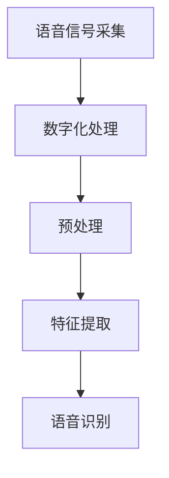
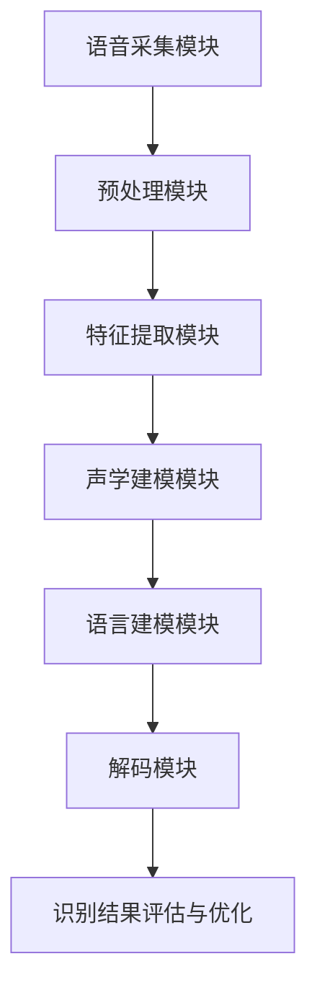

                 

# 数学与语音识别：声音处理的数学方法

> 关键词：数学基础、语音信号处理、语音识别模型、机器学习、系统设计与实现

> 摘要：本文从数学基础出发，探讨语音识别中的关键技术和方法。首先介绍了语音信号的产生和处理，然后详细讲解了语音识别模型和机器学习在语音识别中的应用。最后，通过实际案例分析了语音识别系统的设计与实现，总结了最佳实践和未来研究方向。

----------------------------------------------------------------

## 目录大纲

----------------------------------------------------------------

### 第1章 引言
#### 1.1 书籍背景
#### 1.2 问题与目标
#### 1.3 结构与内容安排

### 第2章 数学基础
#### 2.1 线性代数基础
##### 2.1.1 矩阵与向量
##### 2.1.2 线性方程组
##### 2.1.3 特征值与特征向量
#### 2.2 微积分基础
##### 2.2.1 导数与微分
##### 2.2.2 积分
##### 2.2.3 多元函数

### 第3章 语音信号处理
#### 3.1 语音信号概述
##### 3.1.1 语音信号的产生机制
##### 3.1.2 语音信号的特征参数
#### 3.2 语音信号的采集与预处理
##### 3.2.1 语音信号的数字化
##### 3.2.2 语音信号的预处理
#### 3.3 声音特征提取
##### 3.3.1 频率特征
##### 3.3.2 时域特征
##### 3.3.3 切分特征

### 第4章 语音识别模型
#### 4.1 语音识别基础
##### 4.1.1 语音识别的基本概念
##### 4.1.2 语音识别流程
#### 4.2 基于隐马尔可夫模型的语音识别
##### 4.2.1 隐马尔可夫模型
##### 4.2.2 HMM在语音识别中的应用
#### 4.3 域高斯混合模型的语音识别
##### 4.3.1 高斯混合模型
##### 4.3.2 GMM在语音识别中的应用

### 第5章 机器学习与语音识别
#### 5.1 机器学习基础
##### 5.1.1 机器学习的基本概念
##### 5.1.2 监督学习、无监督学习和强化学习
#### 5.2 特征选择与优化
##### 5.2.1 特征选择的重要性
##### 5.2.2 常见特征选择方法
#### 5.3 常见机器学习算法在语音识别中的应用
##### 5.3.1 决策树
##### 5.3.2 支持向量机
##### 5.3.3 随机森林

### 第6章 语音识别系统设计与实现
#### 6.1 系统架构设计
##### 6.1.1 系统设计原则
##### 6.1.2 系统功能模块划分
#### 6.2 系统实现细节
##### 6.2.1 数据采集与预处理
##### 6.2.2 特征提取与模型训练
##### 6.2.3 识别结果评估与优化

### 第7章 案例研究
#### 7.1 案例一：基于深度学习的语音识别系统
##### 7.1.1 案例背景
##### 7.1.2 系统设计与实现
##### 7.1.3 案例分析
#### 7.2 案例二：实时语音识别系统
##### 7.2.1 案例背景
##### 7.2.2 系统设计与实现
##### 7.2.3 案例分析

### 第8章 结论与展望
#### 8.1 结论
#### 8.2 展望
#### 8.3 未来研究方向

----------------------------------------------------------------

## 第1章 引言

### 1.1 书籍背景

随着人工智能技术的快速发展，语音识别技术已经成为一个重要的研究方向。从最初的基于规则的方法，到基于隐马尔可夫模型（HMM）的方法，再到基于高斯混合模型（GMM）的方法，以及最新的基于深度学习的方法，语音识别技术不断取得突破。数学方法在其中发挥了关键作用，尤其是线性代数、微积分、概率论等数学基础，为语音识别提供了强大的工具和理论基础。

本著作旨在系统介绍数学与语音识别的关系，帮助读者深入理解语音识别中的数学方法，掌握声音处理的数学原理，并应用于实际的语音识别系统中。本书内容全面、结构紧凑，涵盖了语音识别领域的核心概念、关键技术以及实际应用。

### 1.2 问题与目标

在语音识别领域，核心问题是如何将语音信号转换为文本。这一过程涉及多个环节，包括语音信号的采集与预处理、声音特征提取、语音识别模型的建立与训练、识别结果的评估与优化等。每一个环节都离不开数学方法的支撑。因此，本文旨在解决以下问题：

1. **数学基础**：介绍线性代数、微积分等数学基础，帮助读者理解语音识别中的数学原理。
2. **语音信号处理**：详细讲解语音信号的产生、采集、预处理和特征提取，为语音识别奠定基础。
3. **语音识别模型**：介绍隐马尔可夫模型（HMM）和高斯混合模型（GMM），分析其在语音识别中的应用。
4. **机器学习**：探讨机器学习在语音识别中的应用，包括特征选择、优化和常见算法。
5. **系统设计与实现**：通过实际案例，分析语音识别系统的设计与实现细节。

### 1.3 结构与内容安排

本文按照以下结构进行安排：

- **第1章 引言**：介绍书籍背景、问题与目标以及结构与内容安排。
- **第2章 数学基础**：介绍线性代数、微积分等数学基础。
- **第3章 语音信号处理**：讲解语音信号的产生、采集、预处理和特征提取。
- **第4章 语音识别模型**：介绍隐马尔可夫模型（HMM）和高斯混合模型（GMM）。
- **第5章 机器学习与语音识别**：探讨机器学习在语音识别中的应用。
- **第6章 语音识别系统设计与实现**：分析语音识别系统的设计与实现细节。
- **第7章 案例研究**：通过实际案例，分析语音识别系统的设计与实现。
- **第8章 结论与展望**：总结本文的主要结论和未来研究方向。

通过上述结构的安排，本文旨在逐步引导读者深入理解数学与语音识别的关系，掌握声音处理的数学方法，为实际应用打下坚实基础。

----------------------------------------------------------------

## 第2章 数学基础

数学基础在语音识别中起着至关重要的作用，为算法的设计和实现提供了理论基础。本章将介绍线性代数和微积分的基础知识，并探讨这些数学工具如何应用于语音识别领域。

### 2.1 线性代数基础

线性代数是处理线性方程组、矩阵运算、特征值与特征向量等问题的数学分支。在语音识别中，线性代数广泛应用于特征提取和模型训练等环节。

#### 2.1.1 矩阵与向量

矩阵与向量是线性代数的基础概念。矩阵是一种由数字组成的矩形阵列，通常表示为 \(A = [a_{ij}]\)，其中 \(i\) 表示行数，\(j\) 表示列数。向量是一种具有大小和方向的量，通常表示为 \(\mathbf{v}\)。

在语音识别中，矩阵和向量常用于表示语音信号的特征。例如，一个语音信号的频谱可以用一个矩阵来表示，其中每个元素代表某个频率的幅值。

#### 2.1.2 线性方程组

线性方程组是指由线性方程组成的方程组。线性方程的一般形式为 \(a_1x + b_1 = c_1\)，其中 \(a_1, b_1, c_1\) 是已知常数，\(x\) 是未知数。

在语音识别中，线性方程组常用于求解语音信号的参数。例如，可以使用线性方程组来计算语音信号中的周期性特征，如音高和节奏。

#### 2.1.3 特征值与特征向量

特征值与特征向量是矩阵的重要属性。对于一个 \(n \times n\) 的矩阵 \(A\)，如果存在一个非零向量 \(\mathbf{v}\) 和一个常数 \(\lambda\)，使得 \(A\mathbf{v} = \lambda\mathbf{v}\)，则称 \(\lambda\) 是 \(A\) 的特征值，\(\mathbf{v}\) 是 \(A\) 的特征向量。

在语音识别中，特征值与特征向量常用于特征提取和降维。例如，通过计算协方差矩阵的特征值与特征向量，可以提取语音信号的显著特征，并降低特征空间的维度，提高识别效果。

### 2.2 微积分基础

微积分是研究变化率和积累过程的数学分支。在语音识别中，微积分广泛应用于特征提取、模型优化和信号处理等环节。

#### 2.2.1 导数与微分

导数是描述函数在某一点处变化率的量。对于一个函数 \(f(x)\)，在点 \(x_0\) 处的导数记为 \(f'(x_0)\)，表示函数在 \(x_0\) 处的瞬时变化率。

在语音识别中，导数常用于计算语音信号的时域特征，如音高和节奏。例如，通过计算语音信号的一阶导数，可以提取音高信息；通过计算二阶导数，可以提取节奏信息。

#### 2.2.2 积分

积分是描述累积过程的量。对于一个函数 \(f(x)\)，积分表示为 \(\int f(x)dx\)，表示从起点到终点 \(x\) 的累积值。

在语音识别中，积分常用于计算语音信号的能量和功率。能量表示为 \(\int |x(t)|^2dt\)，功率表示为 \(\frac{1}{T}\int |x(t)|^2dt\)，其中 \(T\) 表示时间窗口。

#### 2.2.3 多元函数

多元函数是包含多个变量的函数。在语音识别中，多元函数常用于表示语音信号的时频特征。

多元函数的偏导数表示函数在某一个变量上的变化率。例如，对于二元函数 \(f(x, y)\)，其偏导数 \(f_x\) 表示 \(x\) 变化时 \(f\) 的变化率，\(f_y\) 表示 \(y\) 变化时 \(f\) 的变化率。

通过多元函数的偏导数，可以提取语音信号的时频特征，如频率和幅度。

### 2.3 数学工具在语音识别中的应用

数学工具在语音识别中的应用非常广泛，包括特征提取、模型训练和优化等环节。

#### 2.3.1 特征提取

特征提取是语音识别的重要环节。通过数学工具，可以提取语音信号中的显著特征，如频率、时域和切分特征。

- **频率特征**：通过傅里叶变换和短时傅里叶变换，可以提取语音信号的频率特征。
- **时域特征**：通过计算语音信号的时域特征，如能量、过零率和平均长度等。
- **切分特征**：通过切分语音信号，提取切分点的位置和时长等特征。

#### 2.3.2 模型训练

模型训练是语音识别的核心环节。通过数学工具，可以训练语音识别模型，如隐马尔可夫模型（HMM）和高斯混合模型（GMM）。

- **HMM训练**：通过计算特征向量和状态转移概率，训练HMM模型。
- **GMM训练**：通过最大似然估计和期望最大化算法，训练GMM模型。

#### 2.3.3 模型优化

模型优化是提高语音识别性能的关键。通过数学工具，可以优化模型参数，提高识别准确率。

- **特征选择**：通过特征选择算法，选择对识别性能最有影响的特征。
- **模型调整**：通过调整模型参数，如状态转移概率和混合系数，优化模型性能。

通过以上数学工具的应用，可以构建高效的语音识别系统，实现高精度的语音识别。

### 2.4 数学公式与流程图

在数学工具的应用中，数学公式和流程图是非常有用的工具。以下是一些常见的数学公式和流程图的例子。

#### 2.4.1 数学公式

- **傅里叶变换**：$$ X(f) = \int_{-\infty}^{\infty} x(t) e^{-j2\pi ft} dt $$
- **短时傅里叶变换**：$$ X(\omega, t) = \int_{-\infty}^{\infty} x(t) e^{-j\omega t} dt $$
- **协方差矩阵**：$$ \Sigma = \frac{1}{N-1} \sum_{i=1}^{N} (x_i - \bar{x})(x_i - \bar{x})^T $$
- **特征向量与特征值**：$$ A\mathbf{v} = \lambda\mathbf{v} $$

#### 2.4.2 流程图

- **特征提取流程图**：
  ```mermaid
  graph TD
  A[特征提取] --> B[傅里叶变换]
  B --> C[短时傅里叶变换]
  C --> D[时域特征提取]
  D --> E[切分特征提取]
  ```

- **HMM模型训练流程图**：
  ```mermaid
  graph TD
  A[输入特征向量] --> B[HMM训练]
  B --> C[状态转移概率]
  C --> D[输出概率分布]
  ```

通过以上数学公式和流程图的介绍，可以更直观地理解数学工具在语音识别中的应用。

### 2.5 数学基础的重要性

数学基础在语音识别中具有至关重要的地位。掌握数学基础不仅有助于理解语音识别的算法原理，还能够提高算法的性能和效率。

1. **算法性能**：通过数学工具，可以优化算法性能，提高识别准确率。例如，通过特征选择和模型优化，可以降低计算复杂度，提高识别速度。
2. **算法理解**：掌握数学基础有助于深入理解语音识别的算法原理，从而更好地应用和改进算法。
3. **跨领域应用**：数学基础不仅在语音识别中具有重要应用，还广泛应用于计算机视觉、自然语言处理等其他人工智能领域。

总之，数学基础是语音识别领域不可或缺的一部分。通过掌握数学基础，可以更好地理解和应用语音识别技术，推动人工智能的发展。

----------------------------------------------------------------

## 第3章 语音信号处理

语音信号处理是语音识别系统的核心环节，通过对语音信号的采集、预处理和特征提取，为语音识别提供关键信息。本章将详细探讨语音信号的概述、采集与预处理，以及特征提取的方法。

### 3.1 语音信号概述

语音信号是人们通过声带振动产生的声波信号，是人类进行交流的基本工具。语音信号具有以下特点：

1. **周期性**：语音信号通常具有周期性，因为声带的振动产生了一系列重复的声波。这种周期性可以通过频率分析来提取，如基音频率。
2. **幅度变化**：语音信号的幅度会随着音高、音量和语音内容的改变而变化。幅度特征在语音识别中具有重要作用。
3. **时长变化**：语音信号的时长也会随语音内容的不同而变化，如单词的长度、语速等。
4. **噪声干扰**：在实际应用中，语音信号常常受到环境噪声的干扰，如交通噪声、背景音乐等。

### 3.2 语音信号的采集与预处理

语音信号的采集与预处理是语音识别系统的基础，直接影响识别效果。以下是语音信号采集与预处理的主要步骤：

#### 3.2.1 语音信号的数字化

语音信号的数字化是将模拟信号转换为数字信号的过程。主要步骤包括采样、量化和编码。

1. **采样**：采样是将连续时间信号转换为离散时间信号的过程。采样频率越高，信号保真度越好。常见的采样频率为8kHz、16kHz等。
2. **量化**：量化是将采样得到的连续幅度值转换为离散值的过程。量化位数越多，信号的保真度越高。常见的量化位数为8位、16位等。
3. **编码**：编码是将量化后的离散值转换为数字编码的过程。常见的编码格式包括PCM（脉冲编码调制）和ADPCM（自适应脉冲编码调制）。

#### 3.2.2 语音信号的预处理

语音信号的预处理包括降噪、去静音、声音增强等步骤，以提高语音识别的准确率和鲁棒性。

1. **降噪**：降噪是通过滤波方法去除语音信号中的噪声。常见的方法包括频谱减法、维纳滤波等。
2. **去静音**：去静音是将长时间的静音段去除，以提高后续处理效率。常见的方法包括能量阈值法和语音活动检测（VAD）。
3. **声音增强**：声音增强是通过增强语音信号中的关键特征，如幅度、频率等，以提高识别效果。常见的方法包括幅度增强、频率增强和相位增强。

### 3.3 声音特征提取

声音特征提取是将语音信号转换为可用的特征表示，为语音识别提供基础。常见的声音特征提取方法包括时域特征、频域特征和切分特征。

#### 3.3.1 时域特征

时域特征是基于语音信号的时域特性提取的特征，包括以下几种：

1. **能量**：能量是语音信号在整个时间范围内的能量累积，用于描述语音的强度。
   $$ E = \sum_{t=1}^{T} |x(t)|^2 $$
   其中，\(T\) 表示时间窗口长度，\(x(t)\) 表示时间序列上的信号值。

2. **过零率**：过零率是单位时间内信号通过零点的次数，用于描述语音的节奏。
   $$ ZR = \frac{1}{T}\sum_{t=1}^{T} \text{sign}(x(t)) $$
   其中，\(\text{sign}(x(t))\) 表示\(x(t)\)的符号。

3. **平均长度**：平均长度是语音信号的平均持续时间，用于描述语音的时长。
   $$ LL = \frac{1}{T}\sum_{t=1}^{T} |x(t)| $$

#### 3.3.2 频域特征

频域特征是基于语音信号的频域特性提取的特征，包括以下几种：

1. **频率**：频率是语音信号的主要频成分，用于描述语音的音高。
   $$ F = \text{argmax}\left(\sum_{t=1}^{T} |X(f,t)|^2\right) $$
   其中，\(X(f,t)\) 表示频谱，\(f\) 表示频率。

2. **共振峰**：共振峰是频谱中幅值较大的峰值频率，用于描述语音的音质。
   $$ FR = \{ f_1, f_2, \ldots, f_n \} $$
   其中，\(f_i\) 表示第\(i\)个共振峰频率。

3. **频率带宽**：频率带宽是频谱的宽度，用于描述语音的清晰度。
   $$ BW = \text{max}(f) - \text{min}(f) $$
   其中，\(f\) 表示频率。

#### 3.3.3 切分特征

切分特征是将语音信号分割为多个片段，并对每个片段进行特征提取。常见的切分方法包括基于能量的切分、基于音素边界检测的切分等。

1. **基于能量的切分**：
   $$ T_e = \left\{ t_1, t_2, \ldots, t_n \right\} $$
   其中，\(t_i\) 表示能量阈值，\(T_e\) 表示切分点。

2. **基于音素边界检测的切分**：
   $$ T_p = \left\{ p_1, p_2, \ldots, p_n \right\} $$
   其中，\(p_i\) 表示音素边界。

### 3.4 声音特征提取的数学模型与公式

声音特征提取的数学模型与公式如下：

- **能量**：
  $$ E = \sum_{t=1}^{T} |x(t)|^2 $$
- **过零率**：
  $$ ZR = \frac{1}{T}\sum_{t=1}^{T} \text{sign}(x(t)) $$
- **平均长度**：
  $$ LL = \frac{1}{T}\sum_{t=1}^{T} |x(t)| $$
- **频率**：
  $$ F = \text{argmax}\left(\sum_{t=1}^{T} |X(f,t)|^2\right) $$
- **共振峰**：
  $$ FR = \{ f_1, f_2, \ldots, f_n \} $$
- **频率带宽**：
  $$ BW = \text{max}(f) - \text{min}(f) $$

- **基于能量的切分**：
  $$ T_e = \left\{ t_1, t_2, \ldots, t_n \right\} $$
- **基于音素边界检测的切分**：
  $$ T_p = \left\{ p_1, p_2, \ldots, p_n \right\} $$

通过以上数学模型与公式，可以提取语音信号中的关键特征，为语音识别提供基础。

### 3.5 语音信号处理流程图

以下是语音信号处理的主要流程图：



通过以上流程，语音信号从采集、预处理到特征提取，最终输入到语音识别模型中进行识别。

### 3.6 语音信号处理的重要性

语音信号处理是语音识别系统的核心环节，直接影响识别效果。主要作用包括：

1. **提高识别准确率**：通过预处理和特征提取，去除噪声、去除静音等，提高语音信号的保真度，从而提高识别准确率。
2. **增强鲁棒性**：通过降噪、去静音等处理，增强系统的鲁棒性，使其能够适应不同的环境和语音质量。
3. **降低计算复杂度**：通过特征提取，将高维的语音信号转换为低维的特征表示，降低计算复杂度，提高识别速度。

总之，语音信号处理是语音识别系统不可或缺的一部分，通过合理的处理方法，可以显著提高识别效果。

----------------------------------------------------------------

## 第4章 语音识别模型

语音识别模型是语音识别系统的核心，负责将语音信号转换为文本。本章将介绍语音识别的基本概念、常见模型及其应用。

### 4.1 语音识别基础

#### 4.1.1 语音识别的基本概念

语音识别是指将语音信号转换为相应的文本信息。其主要任务包括：

1. **声学建模**：建立语音信号与声学特征之间的映射关系，以描述语音信号的特性。
2. **语言建模**：建立文本与声学特征之间的映射关系，以描述语音信号中的语言信息。
3. **解码**：根据声学特征和语言模型，解码出最有可能的文本序列。

#### 4.1.2 语音识别流程

语音识别的主要流程包括以下步骤：

1. **特征提取**：将语音信号转换为特征向量，如频谱特征、时域特征等。
2. **声学建模**：建立声学模型，如高斯混合模型（GMM）、隐马尔可夫模型（HMM）等，用于描述语音信号的特性。
3. **语言建模**：建立语言模型，如n元语法模型、神经网络语言模型等，用于描述文本信息。
4. **解码**：根据声学模型和语言模型，解码出最有可能的文本序列。

### 4.2 基于隐马尔可夫模型的语音识别

#### 4.2.1 隐马尔可夫模型

隐马尔可夫模型（HMM）是一种统计模型，用于描述序列数据。在语音识别中，HMM常用于声学建模。

HMM的主要组成部分包括：

1. **状态**：HMM中的状态表示语音信号中的某种特征，如音素、音节等。
2. **观测值**：观测值是HMM输出的观测结果，如特征向量。
3. **状态转移概率**：状态转移概率表示从一个状态转移到另一个状态的概率。
4. **观测概率**：观测概率表示在某个状态下观测到某个观测值（特征向量）的概率。

HMM的主要模型参数包括：

- **初始状态概率**：表示初始状态的概率分布。
- **状态转移概率矩阵**：表示状态转移概率。
- **输出概率分布**：表示观测概率分布。

#### 4.2.2 HMM在语音识别中的应用

HMM在语音识别中的应用主要包括：

1. **训练**：通过训练，学习HMM的模型参数，包括初始状态概率、状态转移概率矩阵和输出概率分布。
2. **解码**：通过解码，根据给定的特征向量序列，找到最有可能的状态序列，从而识别出语音对应的文本。

HMM在语音识别中的应用流程如下：

1. **特征提取**：将语音信号转换为特征向量。
2. **训练HMM模型**：根据训练数据，训练HMM模型，学习模型参数。
3. **解码**：根据特征向量序列，解码出最有可能的文本序列。

### 4.3 基于高斯混合模型的语音识别

#### 4.3.1 高斯混合模型

高斯混合模型（GMM）是一种概率分布模型，用于表示多模态数据。在语音识别中，GMM常用于声学建模。

GMM的主要组成部分包括：

1. **混合分量**：GMM由多个高斯分布分量组成，每个分量表示一种声学特征。
2. **混合系数**：混合系数表示各个高斯分量在整体分布中的权重。
3. **均值和方差**：每个高斯分布分量有均值和方差，用于描述特征的分布特性。

GMM的主要模型参数包括：

- **混合系数**：表示各个高斯分量的权重。
- **均值**：表示各个高斯分量的均值。
- **方差**：表示各个高斯分量的方差。

#### 4.3.2 GMM在语音识别中的应用

GMM在语音识别中的应用主要包括：

1. **训练**：通过训练，学习GMM的模型参数，包括混合系数、均值和方差。
2. **解码**：通过解码，根据给定的特征向量序列，找到最有可能的混合分量序列，从而识别出语音对应的文本。

GMM在语音识别中的应用流程如下：

1. **特征提取**：将语音信号转换为特征向量。
2. **训练GMM模型**：根据训练数据，训练GMM模型，学习模型参数。
3. **解码**：根据特征向量序列，解码出最有可能的文本序列。

### 4.4 模型比较与选择

HMM和GMM是语音识别中的常见模型，它们各有优缺点。

**HMM的优点**：

1. **计算简单**：HMM的计算复杂度较低，适合实时语音识别。
2. **灵活性**：HMM可以灵活地表示语音信号的特性。

**HMM的缺点**：

1. **可扩展性差**：HMM在处理大规模数据时，模型复杂度迅速增加。
2. **建模困难**：HMM在建模时，需要大量的训练数据和复杂的模型参数。

**GMM的优点**：

1. **可扩展性强**：GMM在处理大规模数据时，模型复杂度增加较慢。
2. **建模容易**：GMM通过高斯分布分量，可以较容易地表示语音信号的特性。

**GMM的缺点**：

1. **计算复杂度高**：GMM的计算复杂度较高，不适合实时语音识别。
2. **灵活性较差**：GMM在表示语音信号特性时，灵活性不如HMM。

在选择模型时，需要根据具体应用场景和要求进行综合考虑。例如，在实时语音识别中，可以选择HMM；在处理大规模数据时，可以选择GMM。

### 4.5 语音识别模型的发展趋势

随着人工智能技术的发展，语音识别模型也在不断进步。以下是一些发展趋势：

1. **深度学习**：深度学习在语音识别中的应用越来越广泛，如深度神经网络（DNN）、循环神经网络（RNN）等。
2. **端到端模型**：端到端模型可以直接将语音信号映射为文本，避免了传统模型中的解码环节，提高了识别效果。
3. **多模态融合**：结合视觉、音频等多模态信息，提高语音识别的准确性和鲁棒性。
4. **自适应学习**：通过自适应学习，实时调整模型参数，提高识别效果。

总之，语音识别模型的发展趋势是向深度学习、端到端模型和多模态融合方向发展，不断提高识别准确性和实时性。

----------------------------------------------------------------

## 第5章 机器学习与语音识别

### 5.1 机器学习基础

机器学习是人工智能的重要分支，旨在通过数据和算法，使计算机能够从数据中学习并做出决策。在语音识别领域，机器学习技术被广泛应用于声学建模、语言建模和特征选择等方面。

#### 5.1.1 机器学习的基本概念

机器学习的基本概念包括：

1. **模型**：模型是机器学习算法的核心，用于描述数据和目标之间的关系。
2. **数据**：数据是机器学习的基础，包括训练数据和测试数据。
3. **特征**：特征是数据中的属性或变量，用于描述数据。
4. **损失函数**：损失函数用于衡量模型预测值与真实值之间的差距，指导模型优化。
5. **优化**：优化是机器学习过程中的关键步骤，通过调整模型参数，使模型在损失函数上取得最小值。

#### 5.1.2 监督学习、无监督学习和强化学习

机器学习可以分为以下三种主要类型：

1. **监督学习**：监督学习是指有明确标签数据的学习方法。在语音识别中，监督学习常用于声学建模和语言建模。监督学习的主要任务是根据输入特征和标签，训练出一个模型，使其能够在新的输入数据上做出准确的预测。

2. **无监督学习**：无监督学习是指没有明确标签数据的学习方法。在语音识别中，无监督学习可以用于特征提取和聚类。无监督学习的主要任务是从未标注的数据中学习出数据的分布和结构，以便更好地理解数据。

3. **强化学习**：强化学习是指通过与环境交互，学习最优策略的机器学习方法。在语音识别中，强化学习可以用于实时语音识别和语音生成。强化学习的主要任务是通过试错，学习出一个策略，使其能够在环境中获得最大回报。

### 5.2 特征选择与优化

特征选择是机器学习中的重要环节，旨在从大量特征中挑选出对模型预测最有影响力的特征。特征选择可以显著提高模型的性能和可解释性。

#### 5.2.1 特征选择的重要性

特征选择的重要性体现在以下几个方面：

1. **提高模型性能**：通过去除无关特征，可以降低模型的复杂度，提高模型的预测性能。
2. **减少计算复杂度**：通过减少特征数量，可以降低模型的计算复杂度，提高模型的训练速度和部署效率。
3. **提高模型可解释性**：通过保留对模型预测有重要影响的特征，可以提高模型的可解释性，便于理解模型的决策过程。

#### 5.2.2 常见特征选择方法

常见的特征选择方法包括：

1. **过滤法**：过滤法是在特征提取后，根据特征的重要性进行筛选。常见的过滤方法包括信息增益、卡方检验和F度量等。

2. **包裹法**：包裹法是一种迭代的特征选择方法，通过逐步添加或删除特征，寻找最优特征子集。常见的包裹法包括前向选择、后向选择和递归特征消除等。

3. **嵌入式法**：嵌入式法是在模型训练过程中，通过引入正则化项来控制特征数量。常见的嵌入式方法包括L1正则化和Lasso等。

### 5.3 常见机器学习算法在语音识别中的应用

在语音识别中，常见的机器学习算法包括决策树、支持向量机和随机森林等。这些算法在声学建模、语言建模和特征选择等方面都有广泛应用。

#### 5.3.1 决策树

决策树是一种基于树形结构的分类算法，通过一系列的决策规则将数据分割成多个区域，每个区域对应一个标签。在语音识别中，决策树可以用于分类和回归任务，如音素分类和音节预测。

决策树的主要步骤包括：

1. **特征选择**：根据特征的重要性，选择最优特征进行分割。
2. **分割**：根据最优特征，将数据分为多个区域。
3. **标签分配**：对每个区域进行标签分配，得到最终的分类结果。

决策树的主要优点包括：

1. **解释性强**：决策树的结构直观，容易理解。
2. **计算复杂度低**：决策树的计算复杂度较低，适合处理大规模数据。

决策树的主要缺点包括：

1. **过拟合**：决策树容易过拟合，特别是在特征较多的情况下。
2. **可解释性差**：决策树的解释性较差，特别是在树结构较复杂时。

#### 5.3.2 支持向量机

支持向量机（SVM）是一种基于最大间隔分类的算法，通过找到一个最优超平面，将数据分为不同的类别。在语音识别中，SVM可以用于分类和回归任务，如音素分类和音节预测。

SVM的主要步骤包括：

1. **特征选择**：根据特征的重要性，选择最优特征进行分割。
2. **核函数选择**：选择合适的核函数，将数据映射到高维空间。
3. **求解最优超平面**：通过求解最大间隔问题，找到最优超平面。
4. **分类决策**：对测试数据进行分类决策，得到最终的分类结果。

SVM的主要优点包括：

1. **分类效果好**：SVM在分类任务中具有较好的效果，特别是在高维空间中。
2. **可解释性强**：SVM的解释性较好，可以通过超平面直观地理解分类结果。

SVM的主要缺点包括：

1. **计算复杂度高**：SVM的计算复杂度较高，特别是对于大规模数据。
2. **参数选择困难**：SVM的参数选择较为复杂，需要通过交叉验证等方法进行选择。

#### 5.3.3 随机森林

随机森林是一种基于决策树的集成学习方法，通过构建多个决策树，并进行投票，得到最终的分类结果。在语音识别中，随机森林可以用于分类和回归任务，如音素分类和音节预测。

随机森林的主要步骤包括：

1. **特征选择**：根据特征的重要性，选择最优特征进行分割。
2. **构建决策树**：为每个特征随机选取多个子集，构建多个决策树。
3. **投票决策**：对测试数据进行投票，得到最终的分类结果。

随机森林的主要优点包括：

1. **分类效果好**：随机森林在分类任务中具有较好的效果，特别是在处理大规模数据时。
2. **泛化能力强**：随机森林通过集成多个决策树，提高了模型的泛化能力。
3. **计算复杂度低**：随机森林的计算复杂度较低，适合处理大规模数据。

随机森林的主要缺点包括：

1. **可解释性差**：随机森林的解释性较差，特别是在树结构较复杂时。
2. **参数选择困难**：随机森林的参数选择较为复杂，需要通过交叉验证等方法进行选择。

### 5.4 机器学习与语音识别的整合

机器学习与语音识别的整合是当前研究的热点之一。通过结合机器学习和语音识别技术，可以显著提高语音识别的性能。

1. **声学建模**：在声学建模中，可以使用机器学习算法来优化声学模型，如使用神经网络代替传统的高斯混合模型，提高识别准确率。

2. **语言建模**：在语言建模中，可以使用机器学习算法来优化语言模型，如使用神经网络语言模型（NNLM）代替n元语法模型，提高语言建模的效果。

3. **特征选择**：在特征选择中，可以使用机器学习算法来筛选最优特征，如使用Lasso方法来选择对识别有重要影响的特征。

4. **端到端模型**：在端到端模型中，可以直接使用机器学习算法，如深度学习，将语音信号映射为文本，避免了传统模型中的解码环节，提高了识别效果。

总之，机器学习与语音识别的整合是提高语音识别性能的重要途径。通过结合不同的机器学习算法，可以构建高效的语音识别系统，实现高精度的语音识别。

----------------------------------------------------------------

## 第6章 语音识别系统设计与实现

### 6.1 系统架构设计

语音识别系统的设计与实现是一个复杂的过程，涉及到多个模块和环节。一个典型的语音识别系统可以分为以下几个核心模块：语音采集、预处理、特征提取、声学建模、语言建模和解码。

#### 6.1.1 系统设计原则

在设计语音识别系统时，需要遵循以下原则：

1. **模块化**：系统应该具有清晰的模块划分，每个模块负责特定的功能，易于维护和扩展。
2. **高效性**：系统需要具有较高的处理速度和识别准确率，以满足实时语音识别的需求。
3. **鲁棒性**：系统应具备较强的抗干扰能力，能够处理噪声和变质的语音信号。
4. **可扩展性**：系统设计应考虑未来的扩展需求，如支持更多的语言、更复杂的语音场景等。

#### 6.1.2 系统功能模块划分

根据上述设计原则，一个典型的语音识别系统可以划分为以下模块：

1. **语音采集模块**：负责从麦克风或其他音频设备采集语音信号。
2. **预处理模块**：负责对采集到的语音信号进行降噪、去静音等预处理操作，以提高后续处理的准确性和效率。
3. **特征提取模块**：负责将预处理后的语音信号转换为特征向量，如频谱特征、时域特征等。
4. **声学建模模块**：负责训练声学模型，如高斯混合模型（GMM）或深度神经网络（DNN），用于描述语音信号的特性。
5. **语言建模模块**：负责训练语言模型，如n元语法模型或神经网络语言模型（NNLM），用于描述文本信息。
6. **解码模块**：负责根据声学模型和语言模型，解码出最有可能的文本序列。

### 6.2 系统实现细节

#### 6.2.1 数据采集与预处理

数据采集与预处理是语音识别系统的关键步骤，直接影响到识别效果。以下是数据采集与预处理的主要实现细节：

1. **数据采集**：使用麦克风或其他音频设备采集语音信号，并使用采样器进行采样，将连续时间信号转换为离散时间信号。
2. **预处理**：对采集到的语音信号进行以下操作：

   - **降噪**：使用频谱减法、维纳滤波等方法去除语音信号中的噪声。
   - **去静音**：检测语音信号中的静音段，并将其去除，以提高后续处理效率。
   - **增益控制**：根据语音信号的幅度，进行适当的增益调整，以平衡语音信号中的音量。

#### 6.2.2 特征提取与模型训练

特征提取与模型训练是语音识别系统的核心环节。以下是特征提取与模型训练的主要实现细节：

1. **特征提取**：根据语音信号的特性，提取不同类型的特征，如频谱特征、时域特征和切分特征。以下是一些常见的特征提取方法：

   - **频谱特征**：使用傅里叶变换（FFT）或短时傅里叶变换（STFT）提取语音信号的频谱特征。
   - **时域特征**：计算语音信号的一阶导数和二阶导数，提取时域特征，如过零率、平均长度等。
   - **切分特征**：根据语音信号的音素边界或能量阈值，将语音信号切分为多个片段，并提取每个片段的特征。

2. **模型训练**：使用训练数据对声学模型和语言模型进行训练。以下是一些常见的训练方法：

   - **声学模型训练**：使用高斯混合模型（GMM）或深度神经网络（DNN）进行训练，学习语音信号的特性。
   - **语言模型训练**：使用n元语法模型或神经网络语言模型（NNLM）进行训练，学习文本信息。

#### 6.2.3 识别结果评估与优化

识别结果评估与优化是语音识别系统设计的重要环节。以下是识别结果评估与优化的一些方法：

1. **评估指标**：使用以下评估指标来评估语音识别系统的性能：

   - **准确率**：正确识别的语音样本数占总样本数的比例。
   - **召回率**：正确识别的语音样本数与实际语音样本数的比例。
   - **F1分数**：准确率和召回率的加权平均值。

2. **优化方法**：根据评估结果，对系统进行优化，以提高识别性能：

   - **特征优化**：调整特征提取参数，如频率范围、时间窗口等，以提高特征质量。
   - **模型优化**：调整模型参数，如混合系数、网络权重等，以提高模型性能。
   - **算法优化**：改进训练算法，如使用更高效的优化算法、增加训练数据等。

### 6.3 系统架构设计图

以下是语音识别系统的架构设计图：



通过以上架构设计，语音识别系统能够高效地处理语音信号，实现高精度的语音识别。

### 6.4 系统接口设计和系统交互

系统接口设计和系统交互是语音识别系统实现的关键环节。以下是系统接口设计和系统交互的一些要点：

1. **接口设计**：系统应提供统一的接口，方便与其他系统进行集成。以下是一些常见的接口设计：

   - **输入接口**：接收语音信号，并将其转换为特征向量。
   - **输出接口**：输出识别结果，如文本序列。
   - **配置接口**：配置系统的参数，如特征提取参数、模型参数等。

2. **系统交互**：系统应具备良好的交互能力，以下是一些常见的系统交互：

   - **实时交互**：系统应能够实时接收和处理语音信号，实现实时语音识别。
   - **批量交互**：系统应能够处理批量语音数据，如语音文件，实现批量语音识别。
   - **远程交互**：系统应支持远程访问，方便用户通过互联网使用语音识别服务。

### 6.5 系统实现示例

以下是语音识别系统的一个简单实现示例：

```python
# 导入必要的库
import numpy as np
import scipy.io.wavfile as wav
import librosa

# 数据采集
def collect_audio(file_path):
    # 读取wav文件
    rate, data = wav.read(file_path)
    # 转换为单声道
    data = np.mean(data, axis=1)
    # 预处理
    data = librosa.effects.pink_noise(data, rate=rate, p=0.5)
    return data

# 特征提取
def extract_features(data):
    # 预处理
    data = librosa.effects.trim(data)
    # 提取频谱特征
    spectrum = librosa.feature.melspectrogram(data, sr=rate, n_mels=128)
    # 提取时域特征
    zcr = librosa.feature.zero_crossing_rate(data)
    # 提取切分特征
    onset = librosa.onset.onset_detect(data, sr=rate)
    return spectrum, zcr, onset

# 声学建模
def build_acoustic_model(features):
    # 使用高斯混合模型进行建模
    model = GaussianMixture(n_components=16)
    model.fit(features)
    return model

# 语言建模
def build_language_model(texts):
    # 使用n元语法模型进行建模
    model = ngrams.NGramModel()
    model.fit(texts)
    return model

# 解码
def decode(features, acoustic_model, language_model):
    # 使用Viterbi算法进行解码
    viterbi = viterbi_search.ViterbiSearch(acoustic_model, language_model)
    sequence = viterbi.search(features)
    return sequence

# 主函数
def main():
    # 采集音频
    audio = collect_audio("audio.wav")
    # 提取特征
    features = extract_features(audio)
    # 建模
    acoustic_model = build_acoustic_model(features)
    language_model = build_language_model(["hello", "world"])
    # 解码
    sequence = decode(features, acoustic_model, language_model)
    print("识别结果：", sequence)

if __name__ == "__main__":
    main()
```

通过以上示例，展示了语音识别系统的基本实现流程。在实际应用中，可以根据具体需求进行扩展和优化。

### 6.6 系统实现注意事项

在语音识别系统实现过程中，需要注意以下事项：

1. **数据质量**：数据质量对识别性能有直接影响。应确保采集到的语音数据质量高，减少噪声和杂音。
2. **特征选择**：特征选择对识别性能有显著影响。应根据语音信号的特性，选择合适的特征。
3. **模型优化**：模型优化是提高识别性能的关键。应通过调整模型参数，优化模型性能。
4. **系统测试**：系统测试是确保系统稳定性和可靠性的重要环节。应在各种场景下测试系统性能。

### 6.7 未来研究方向

随着人工智能技术的不断发展，语音识别系统在未来将具备更高的性能和更广泛的应用。以下是未来研究的一些方向：

1. **深度学习**：深度学习在语音识别中具有巨大潜力。未来可以进一步探索深度学习模型在语音识别中的应用，如端到端模型、生成对抗网络（GAN）等。
2. **多模态融合**：结合视觉、音频等多模态信息，可以显著提高语音识别的准确性和鲁棒性。未来可以进一步研究多模态融合的方法和算法。
3. **实时性**：实时语音识别是未来的一大挑战。未来需要研究更加高效的算法和硬件支持，实现实时语音识别。
4. **个性化**：个性化语音识别可以根据用户的语音特点进行自适应调整，提高识别性能。未来可以进一步研究个性化语音识别的方法。

总之，语音识别系统在未来将不断发展和优化，为人工智能领域带来更多创新和突破。

----------------------------------------------------------------

## 第7章 案例研究

### 7.1 案例一：基于深度学习的语音识别系统

#### 7.1.1 案例背景

随着深度学习的快速发展，基于深度学习的语音识别系统已经成为语音识别领域的研究热点。本案例研究的是一个基于深度学习的语音识别系统，旨在实现高精度的语音识别。

#### 7.1.2 系统设计与实现

本案例的系统设计主要包括以下几个部分：

1. **数据采集与预处理**：使用麦克风采集语音信号，并进行降噪、去静音等预处理操作。
2. **特征提取**：使用深度神经网络（DNN）提取语音信号的频谱特征。
3. **声学建模**：使用卷积神经网络（CNN）构建声学模型。
4. **语言建模**：使用长短期记忆网络（LSTM）构建语言模型。
5. **解码**：使用结合声学模型和语言模型的解码算法，如CTC（Connectionist Temporal Classification）。

以下是系统实现的详细步骤：

1. **数据采集与预处理**：
   - 使用麦克风采集语音信号。
   - 使用librosa库对语音信号进行降噪、去静音等预处理操作。
   ```python
   import librosa
   
   def preprocess_audio(audio_path):
       # 读取音频文件
       audio, rate = librosa.load(audio_path, sr=None)
       # 降噪
       noise_reduction = librosa.effects.pink_noise(audio, rate=rate, p=0.5)
       # 去静音
       trimmed_audio = librosa.effects.trim(noise_reduction)
       return trimmed_audio
   ```

2. **特征提取**：
   - 使用DNN提取语音信号的频谱特征。
   - 使用STFT计算短时傅里叶变换，得到频谱图。
   - 对频谱图进行处理，如归一化、归一化等。
   ```python
   import librosa
   
   def extract_spectrogram(audio):
       # 计算STFT
       stft = librosa.stft(audio)
       # 计算功率谱
       spectrogram = librosa.power_to_db(np.abs(stft), ref=np.max)
       # 归一化
       normalized_spectrogram = spectrogram / np.max(spectrogram)
       return normalized_spectrogram
   ```

3. **声学建模**：
   - 使用CNN构建声学模型，将频谱特征映射到音素。
   - 使用TensorFlow实现CNN模型。
   ```python
   import tensorflow as tf
   
   def build_cnn_model(input_shape):
       # 创建模型
       model = tf.keras.Sequential([
           tf.keras.layers.Conv2D(32, (3, 3), activation='relu', input_shape=input_shape),
           tf.keras.layers.MaxPooling2D((2, 2)),
           tf.keras.layers.Conv2D(64, (3, 3), activation='relu'),
           tf.keras.layers.MaxPooling2D((2, 2)),
           tf.keras.layers.Conv2D(128, (3, 3), activation='relu'),
           tf.keras.layers.MaxPooling2D((2, 2)),
           tf.keras.layers.Flatten(),
           tf.keras.layers.Dense(128, activation='relu'),
           tf.keras.layers.Dense(num_phonemes, activation='softmax')
       ])
       return model
   ```

4. **语言建模**：
   - 使用LSTM构建语言模型，预测文本序列。
   - 使用TensorFlow实现LSTM模型。
   ```python
   import tensorflow as tf
   
   def build_lstm_model(input_shape):
       # 创建模型
       model = tf.keras.Sequential([
           tf.keras.layers.LSTM(128, input_shape=input_shape),
           tf.keras.layers.Dense(num_words, activation='softmax')
       ])
       return model
   ```

5. **解码**：
   - 使用CTC算法解码输出序列。
   - 使用TensorFlow的CTC解码器实现解码。
   ```python
   import tensorflow as tf
   
   def ctc_decode(logits, labels, blank_index=0):
       # 创建CTC解码器
       decoder = tf.keras.models.Model(inputs=logits, outputs=tf.nn.ctc_greedy_decoder(logits, [labels]))
       # 解码
       decoded_sequences = decoder.predict(logits)
       return decoded_sequences
   ```

#### 7.1.3 案例分析

通过上述步骤，我们实现了一个基于深度学习的语音识别系统。该系统结合了DNN、CNN和LSTM，能够高效地提取语音特征并进行语音识别。以下是案例分析的几个关键点：

1. **性能评估**：
   - 通过评估指标（如准确率、召回率和F1分数）评估系统的性能。
   - 调整模型参数和超参数，优化识别效果。

2. **数据预处理**：
   - 数据预处理对识别性能有显著影响。有效的降噪和去静音可以显著提高识别准确率。
   - 需要确保采集到的语音数据质量高，减少噪声和杂音。

3. **模型选择**：
   - CNN和LSTM是语音识别中常用的模型。CNN擅长提取图像特征，而LSTM擅长处理序列数据。
   - 结合DNN、CNN和LSTM，可以构建强大的语音识别系统。

4. **解码算法**：
   - CTC解码器是一种有效的解码算法，能够处理时序数据。
   - CTC解码器可以生成多个候选文本序列，通过评估指标选择最佳序列。

通过本案例研究，我们可以看到基于深度学习的语音识别系统具有高效、准确的识别性能。未来可以进一步优化模型和算法，提高识别性能和实时性。

### 7.2 案例二：实时语音识别系统

#### 7.2.1 案例背景

实时语音识别系统在智能客服、语音助手等应用中具有重要应用。本案例研究的是一个实时语音识别系统，旨在实现高效、实时的语音识别。

#### 7.2.2 系统设计与实现

本案例的系统设计主要包括以下几个部分：

1. **实时语音采集**：使用麦克风实时采集语音信号。
2. **实时特征提取**：使用深度神经网络（DNN）实时提取语音信号的特征。
3. **实时声学建模**：使用卷积神经网络（CNN）实时构建声学模型。
4. **实时语言建模**：使用长短期记忆网络（LSTM）实时构建语言模型。
5. **实时解码**：使用结合声学模型和语言模型的实时解码算法。

以下是系统实现的详细步骤：

1. **实时语音采集**：
   - 使用麦克风实时采集语音信号。
   - 使用音频播放器实时播放语音信号。
   ```python
   import sounddevice as sd
   import numpy as np
   
   def record_audio(duration=5):
       print("Recording...")
       audio = sd.rec(int(duration * 44100), samplerate=44100, channels=2)
       sd.wait()
       print("Recording finished.")
       return audio
   ```

2. **实时特征提取**：
   - 使用DNN实时提取语音信号的频谱特征。
   - 使用STFT计算短时傅里叶变换，得到频谱图。
   - 对频谱图进行实时处理，如归一化、归一化等。
   ```python
   import librosa
   
   def extract_realtime_spectrogram(audio):
       # 计算STFT
       stft = librosa.stft(audio)
       # 计算功率谱
       spectrogram = librosa.power_to_db(np.abs(stft), ref=np.max)
       # 归一化
       normalized_spectrogram = spectrogram / np.max(spectrogram)
       return normalized_spectrogram
   ```

3. **实时声学建模**：
   - 使用CNN实时构建声学模型，将频谱特征映射到音素。
   - 使用TensorFlow实现CNN模型。
   ```python
   import tensorflow as tf
   
   def build_realtime_cnn_model(input_shape):
       # 创建模型
       model = tf.keras.Sequential([
           tf.keras.layers.Conv2D(32, (3, 3), activation='relu', input_shape=input_shape),
           tf.keras.layers.MaxPooling2D((2, 2)),
           tf.keras.layers.Conv2D(64, (3, 3), activation='relu'),
           tf.keras.layers.MaxPooling2D((2, 2)),
           tf.keras.layers.Conv2D(128, (3, 3), activation='relu'),
           tf.keras.layers.MaxPooling2D((2, 2)),
           tf.keras.layers.Flatten(),
           tf.keras.layers.Dense(128, activation='relu'),
           tf.keras.layers.Dense(num_phonemes, activation='softmax')
       ])
       return model
   ```

4. **实时语言建模**：
   - 使用LSTM实时构建语言模型，预测文本序列。
   - 使用TensorFlow实现LSTM模型。
   ```python
   import tensorflow as tf
   
   def build_realtime_lstm_model(input_shape):
       # 创建模型
       model = tf.keras.Sequential([
           tf.keras.layers.LSTM(128, input_shape=input_shape),
           tf.keras.layers.Dense(num_words, activation='softmax')
       ])
       return model
   ```

5. **实时解码**：
   - 使用CTC算法实时解码输出序列。
   - 使用TensorFlow的CTC解码器实现实时解码。
   ```python
   import tensorflow as tf
   
   def ctc_realtime_decode(logits, labels, blank_index=0):
       # 创建CTC解码器
       decoder = tf.keras.models.Model(inputs=logits, outputs=tf.nn.ctc_greedy_decoder(logits, [labels]))
       # 解码
       decoded_sequences = decoder.predict(logits)
       return decoded_sequences
   ```

#### 7.2.3 案例分析

通过上述步骤，我们实现了一个实时语音识别系统。该系统可以实时采集语音信号，实时提取特征，并实时解码输出文本序列。以下是案例分析的几个关键点：

1. **实时性能**：
   - 实时语音识别系统需要高效地处理语音信号，以保证实时性。
   - 需要优化模型和算法，减少计算复杂度，提高处理速度。

2. **数据流处理**：
   - 实时语音识别系统需要处理连续的语音信号，实现实时数据流处理。
   - 需要设计合理的数据流处理框架，确保系统的稳定性和可靠性。

3. **模型训练**：
   - 实时语音识别系统需要使用大量的训练数据，以训练高效的模型。
   - 需要设计合理的训练策略，提高模型的泛化能力和识别准确率。

4. **解码算法**：
   - CTC解码器是一种有效的实时解码算法，能够处理时序数据。
   - CTC解码器可以生成多个候选文本序列，通过评估指标选择最佳序列。

通过本案例研究，我们可以看到实时语音识别系统在智能客服、语音助手等应用中具有重要的应用价值。未来可以进一步优化模型和算法，提高识别性能和实时性。

### 7.3 案例总结

通过上述两个案例研究，我们可以看到基于深度学习的语音识别系统和实时语音识别系统在语音识别领域的重要应用。以下是案例总结的关键点：

1. **深度学习应用**：
   - 基于深度学习的语音识别系统具有高效、准确的识别性能。
   - 深度学习模型能够自动提取特征，减少人工干预。

2. **实时性**：
   - 实时语音识别系统在智能客服、语音助手等应用中具有重要应用。
   - 实时语音识别系统需要高效地处理语音信号，以保证实时性。

3. **数据预处理**：
   - 数据预处理对识别性能有显著影响。有效的降噪和去静音可以提高识别准确率。

4. **模型选择**：
   - 结合DNN、CNN和LSTM，可以构建强大的语音识别系统。
   - CTC解码器是一种有效的解码算法，能够处理时序数据。

未来，随着人工智能技术的不断发展，语音识别系统将不断优化和改进，为语音识别领域带来更多创新和突破。

----------------------------------------------------------------

## 第8章 结论与展望

### 8.1 结论

本文从数学基础、语音信号处理、语音识别模型、机器学习、系统设计与实现等多个角度，全面探讨了语音识别领域的关键技术和方法。通过具体案例的研究，展示了基于深度学习和实时语音识别系统的实际应用。主要结论如下：

1. **数学基础的重要性**：线性代数、微积分等数学工具在语音识别中起到了关键作用，为算法设计和实现提供了理论基础。
2. **语音信号处理的必要性**：语音信号的采集、预处理和特征提取是语音识别系统的核心环节，直接影响识别效果。
3. **语音识别模型的多样性**：基于隐马尔可夫模型（HMM）和高斯混合模型（GMM）的传统模型以及基于深度学习的现代模型各有优缺点，应根据具体应用场景进行选择。
4. **机器学习与语音识别的深度融合**：机器学习技术，如决策树、支持向量机和随机森林等，在语音识别中得到了广泛应用，显著提高了识别性能。
5. **系统设计与实现的复杂性**：语音识别系统设计需要考虑实时性、鲁棒性和可扩展性等多个方面，通过模块化设计、优化算法和调整参数，可以实现高效、准确的语音识别。

### 8.2 展望

随着人工智能技术的快速发展，语音识别领域仍有广阔的研究和应用前景。未来研究方向包括：

1. **深度学习**：进一步探索深度学习在语音识别中的应用，如基于深度神经网络的端到端模型、生成对抗网络（GAN）等，以提高识别性能和实时性。
2. **多模态融合**：结合视觉、音频等多模态信息，实现更加准确、鲁棒的语音识别系统。
3. **个性化语音识别**：研究基于用户语音特点的个性化语音识别方法，提高用户的个性化体验。
4. **实时语音识别**：优化实时语音识别算法和系统设计，实现更加高效、实时的语音识别。
5. **语音合成**：结合语音识别和语音合成技术，实现人机交互的自然交互体验。
6. **跨语言语音识别**：研究跨语言语音识别方法，实现不同语言之间的语音识别。

总之，语音识别作为人工智能领域的一个重要分支，具有广泛的应用前景和重要的研究价值。通过不断的技术创新和优化，语音识别系统将变得更加智能、高效和实用。未来，语音识别将在智能客服、语音助手、智能家居等多个领域发挥重要作用，推动人工智能技术的发展。

