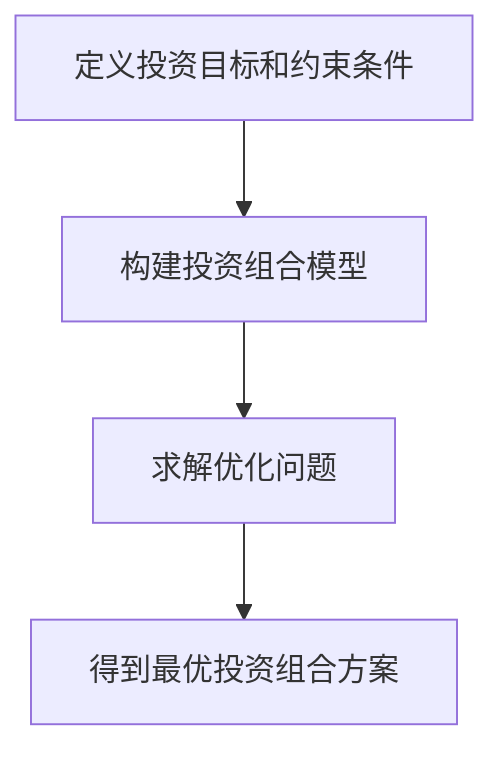
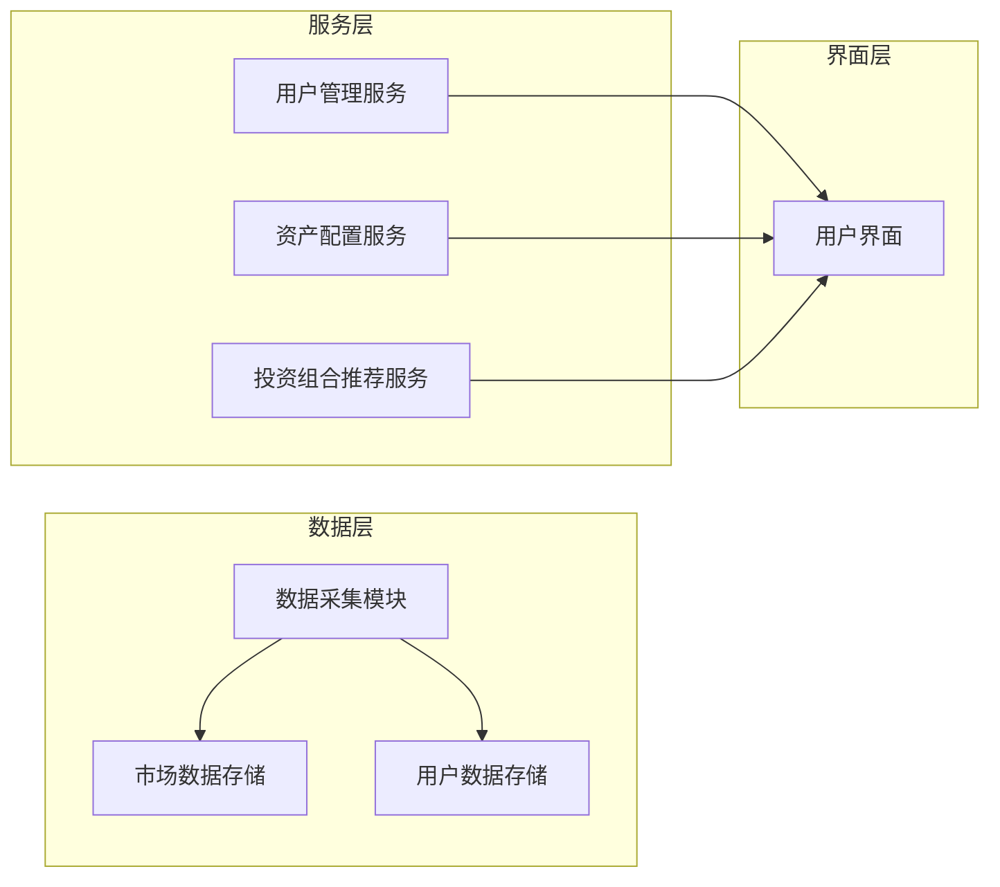
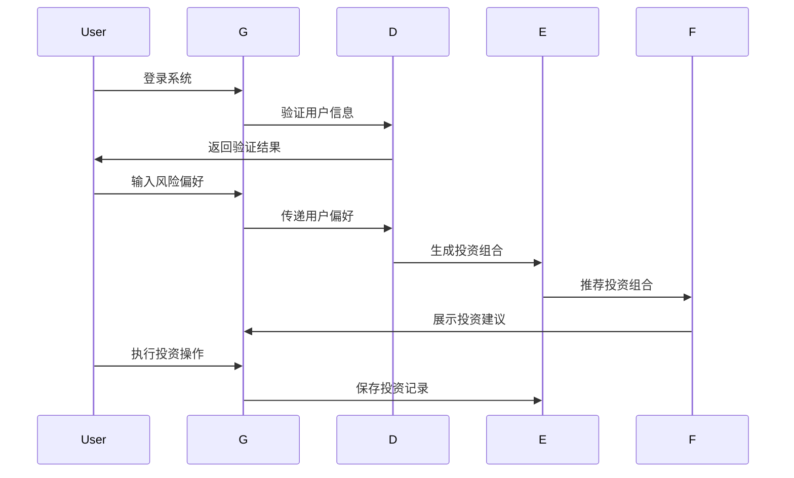

                 

### 文章标题：数学与财富管理：资产配置的数学策略

> 关键词：数学策略、资产配置、财富管理、投资组合、风险控制

> 摘要：本文将探讨如何在财富管理中运用数学策略进行资产配置，分析投资组合理论、市场风险模型、资产定价模型以及动态资产配置策略，旨在为投资者提供一种科学有效的财富管理方法。

### 第一部分：背景介绍

#### 问题背景

在当今全球金融市场日益复杂、不确定性的背景下，如何实现资产的合理配置和有效的财富管理，成为投资者和金融机构共同关注的焦点。传统的财富管理方法大多基于经验和简单的财务模型，而随着大数据、人工智能等现代技术的快速发展，基于数学模型的资产配置策略逐渐受到重视。

#### 问题描述

《数学与财富管理：资产配置的数学策略》一书旨在为读者提供一种全新的财富管理视角，通过数学模型和算法，帮助投资者更好地理解和应用资产配置策略。书中将探讨如何利用数学方法分析市场风险，构建最优资产组合，以及如何进行动态调整以应对市场变化。

#### 问题解决

本书通过系统性地介绍资产配置的基本概念、数学原理和实际应用，帮助读者理解数学模型在财富管理中的重要性。书中不仅提供了理论讲解，还通过案例分析，展示了数学模型在资产配置中的实际应用效果。

#### 边界与外延

本书主要讨论现代财富管理中的数学策略，包括但不限于投资组合理论、市场风险分析、资产定价模型和动态资产配置策略。同时，本书也会涉及相关的基础数学知识和计算机技术，以便读者能够更好地理解和应用这些策略。

#### 概念结构与核心要素组成

1. **投资组合理论**：探讨如何通过多样化的投资组合降低风险，实现资产的合理配置。
2. **市场风险分析**：研究市场波动对资产价值的影响，以及如何通过数学模型进行风险控制。
3. **资产定价模型**：介绍几种常见的资产定价模型，如CAPM、Black-Scholes模型等，并分析其应用场景。
4. **动态资产配置策略**：讨论如何根据市场变化，动态调整资产组合，以最大化收益或最小化风险。

### 第二部分：核心概念与联系

#### 核心概念

1. **资产配置**：指根据投资目标、风险承受能力和市场环境，将资金分配到不同资产类别中的过程。
2. **风险与收益**：风险与收益是投资过程中不可分割的组成部分，风险越大，潜在的收益也越高。
3. **市场效率**：市场效率是指市场价格是否能够迅速反映所有可用信息。
4. **贝塔系数**：衡量资产相对于市场整体波动性的指标。

#### 概念属性特征对比表格

| 概念             | 特征1           | 特征2           | 特征3           |
|------------------|----------------|----------------|----------------|
| 资产配置         | 多样化         | 风险管理        | 目标导向        |
| 风险与收益       | 相辅相成       | 相对性          | 可控性          |
| 市场效率         | 信息反映       | 波动性          | 动态性          |
| 贝塔系数         | 相对波动性     | 风险衡量        | 风险管理工具    |

#### 概念联系

- **资产配置**与**风险与收益**密切相关，合理的资产配置能够有效平衡风险与收益。
- **市场效率**是资产配置策略制定的前提，高效的金融市场能够更快地反映信息，为投资者提供更准确的决策依据。
- **贝塔系数**是评估资产风险的常用指标，它与资产配置策略密切相关，可用于调整资产组合中的风险水平。

### 第三部分：算法原理讲解

#### 3.1 投资组合优化算法

#### 投资组合优化算法的基本概念

投资组合优化算法是一种通过数学模型优化投资组合的方法，旨在实现特定投资目标（如最大化收益或最小化风险）。

#### 投资组合优化算法的核心步骤

1. **定义投资目标和约束条件**：明确投资组合的预期收益、风险承受能力和投资期限等。
2. **构建投资组合模型**：根据投资目标和约束条件，建立数学模型描述投资组合。
3. **求解优化问题**：使用数学优化方法求解投资组合模型，得到最优投资组合方案。

#### 投资组合优化算法的mermaid流程图



#### 投资组合优化算法的Python实现

```python
import numpy as np
from scipy.optimize import minimize

# 投资组合优化问题的数学模型
def objective_function(x, expected_returns, covariance_matrix, risk_free_rate):
    # x: 投资组合中各类资产的投资比例
    # expected_returns: 各类资产的预期收益率
    # covariance_matrix: 各类资产收益的协方差矩阵
    # risk_free_rate: 无风险收益率
    portfolio_return = np.dot(x, expected_returns)
    portfolio_variance = np.dot(x.dot(covariance_matrix), x)
    portfolio_risk = np.sqrt(portfolio_variance)
    return -(portfolio_return - risk_free_rate) * portfolio_return + portfolio_risk

# 求解优化问题
def optimize_portfolio(expected_returns, covariance_matrix, risk_free_rate):
    # expected_returns: 各类资产的预期收益率
    # covariance_matrix: 各类资产收益的协方差矩阵
    # risk_free_rate: 无风险收益率
    x0 = np.ones(len(expected_returns)) / len(expected_returns)  # 初始解，均匀投资
    result = minimize(objective_function, x0, args=(expected_returns, covariance_matrix, risk_free_rate), method='SLSQP')
    return result.x

# 示例数据
expected_returns = [0.06, 0.08, 0.10]  # 各类资产的预期收益率
covariance_matrix = [[0.04, 0.05, 0.06], [0.05, 0.06, 0.07], [0.06, 0.07, 0.08]]  # 各类资产收益的协方差矩阵
risk_free_rate = 0.03  # 无风险收益率

# 优化投资组合
optimal_weights = optimize_portfolio(expected_returns, covariance_matrix, risk_free_rate)
print("最优投资组合比例：", optimal_weights)
```

#### 投资组合优化算法的数学模型

1. **目标函数**：最大化（或最小化）预期收益与风险之间的权衡。
2. **约束条件**：投资比例的非负约束、总资产投资比例约束等。

$$
\begin{align*}
\min_{x} & \quad -\omega_p \\
\text{subject to} & \quad x_i \geq 0, \quad \forall i \\
& \quad \sum_{i} x_i = 1 \\
& \quad \omega_p = \sum_{i} x_i \cdot \mu_i - \rho_f \\
& \quad \omega_v = \sum_{i} x_i \cdot \sigma_i^2
\end{align*}
$$

其中，$x_i$ 是第 $i$ 类资产的投资比例，$\mu_i$ 是第 $i$ 类资产的预期收益率，$\sigma_i^2$ 是第 $i$ 类资产的方差，$\rho_f$ 是无风险收益率。

### 第四部分：系统分析与架构设计方案

#### 问题场景介绍

假设一家投资公司需要为其客户构建一个资产配置系统，以帮助客户实现财富增值和风险控制。该系统需要能够根据市场数据和客户的风险偏好，自动推荐最优的投资组合。

#### 项目介绍

**项目名称**：财富管理智能配置系统

**项目目标**：开发一个基于数学策略的资产配置系统，实现自动推荐最优投资组合。

**项目功能**：
1. **数据采集**：从多个数据源获取市场数据，包括各类资产的收益率、波动性等。
2. **用户管理**：管理用户信息，包括风险偏好、资产状况等。
3. **资产配置**：根据用户信息和市场数据，计算最优投资组合。
4. **投资组合推荐**：根据最优投资组合，生成投资建议。
5. **系统监控**：监控系统运行状态，确保系统稳定可靠。

#### 系统功能设计（领域模型mermaid类图）

```mermaid
classDiagram
    User <<class{用户}>> 
    Portfolio <<class{投资组合}>> 
    Asset <<class{资产}>> 
    Market <<class{市场}>> 
    Risk <<class{风险}>> 
    Configuration <<class{配置}>> 

    User o--|{持有}| Portfolio
    Portfolio o--|{包含}| Asset
    Asset o--|{受}| Market
    Asset o--|{面临}| Risk
    Configuration o--|{调整}| Portfolio
```

#### 系统架构设计（mermaid架构图）



#### 系统接口设计和系统交互（mermaid序列图）



### 第五部分：项目实战

#### 环境安装

1. **安装Python环境**：确保Python版本在3.6及以上。
2. **安装依赖库**：使用pip命令安装numpy、scipy、matplotlib等库。

```bash
pip install numpy scipy matplotlib
```

#### 系统核心实现源代码

```python
# data_loader.py
import pandas as pd

def load_market_data(file_path):
    """从文件中加载市场数据"""
    return pd.read_csv(file_path)

# portfolio_optimizer.py
import numpy as np
from scipy.optimize import minimize

def objective_function(x, expected_returns, covariance_matrix, risk_free_rate):
    portfolio_return = np.dot(x, expected_returns)
    portfolio_variance = np.dot(x.dot(covariance_matrix), x)
    portfolio_risk = np.sqrt(portfolio_variance)
    return -(portfolio_return - risk_free_rate) * portfolio_return + portfolio_risk

def optimize_portfolio(expected_returns, covariance_matrix, risk_free_rate):
    x0 = np.ones(len(expected_returns)) / len(expected_returns)
    result = minimize(objective_function, x0, args=(expected_returns, covariance_matrix, risk_free_rate), method='SLSQP')
    return result.x

# user_interface.py
import tkinter as tk
from tkinter import messagebox

def login_system():
    """登录系统"""
    # 实现登录功能
    pass

def input_risk_preference():
    """输入风险偏好"""
    # 实现风险偏好输入功能
    pass

def generate_investment_recommendation():
    """生成投资建议"""
    # 实现投资建议生成功能
    pass

# main.py
from data_loader import load_market_data
from portfolio_optimizer import optimize_portfolio
from user_interface import login_system, input_risk_preference, generate_investment_recommendation

def main():
    # 加载市场数据
    market_data = load_market_data('market_data.csv')

    # 优化投资组合
    optimal_weights = optimize_portfolio(market_data['expected_returns'], market_data['covariance_matrix'], risk_free_rate=0.03)

    # 生成投资建议
    investment_recommendation = generate_investment_recommendation(optimal_weights)

    # 展示投资建议
    messagebox.showinfo('投资建议', investment_recommendation)

if __name__ == '__main__':
    main()
```

#### 代码应用解读与分析

1. **数据加载模块**：该模块使用pandas库从CSV文件中加载市场数据，包括资产的预期收益率和协方差矩阵。
2. **投资组合优化模块**：该模块定义了投资组合优化的目标函数和优化方法，使用scipy.optimize模块进行求解。
3. **用户界面模块**：该模块使用tkinter库实现用户界面，包括登录、输入风险偏好、生成投资建议等功能。
4. **主程序**：主程序加载市场数据，优化投资组合，生成投资建议，并通过消息框展示给用户。

#### 实际案例分析和详细讲解剖析

1. **案例背景**：假设用户A希望实现稳健的投资，风险偏好为中等。
2. **市场数据**：从市场数据中提取资产预期收益率和协方差矩阵。
3. **投资组合优化**：使用优化算法计算最优投资组合比例。
4. **投资建议生成**：根据最优投资组合比例生成投资建议。
5. **投资执行**：用户根据投资建议进行投资操作。

#### 项目小结

本文通过实际案例展示了如何使用数学策略进行资产配置，从数据加载、投资组合优化到用户界面设计，全面介绍了财富管理智能配置系统的实现过程。该项目为投资者提供了一种科学的资产配置方法，有助于实现财富增值和风险控制。

### 第六部分：最佳实践 tips

1. **数据质量**：确保市场数据的质量和准确性，这对投资组合的优化至关重要。
2. **风险控制**：在投资组合优化过程中，要充分考虑风险因素，避免盲目追求高收益。
3. **动态调整**：市场环境不断变化，投资组合也需要根据市场变化进行动态调整。
4. **用户教育**：投资者应该了解资产配置的基本原理，以便更好地应用投资策略。

### 第七部分：小结、注意事项、拓展阅读

#### 小结

本文通过系统性地介绍资产配置的数学策略，分析了投资组合优化算法、市场风险模型和资产定价模型，并结合实际案例展示了如何实现财富管理。读者通过本文，可以了解数学策略在财富管理中的重要性，掌握资产配置的基本方法。

#### 注意事项

1. **风险控制**：在实施资产配置策略时，要充分考虑风险因素，避免盲目追求高收益。
2. **市场研究**：了解市场动态和宏观经济环境，对资产配置策略的制定至关重要。
3. **数据质量**：确保市场数据的质量和准确性，这对投资组合的优化至关重要。

#### 拓展阅读

1. **《投资学》**：了解投资组合理论、资产定价模型等基本概念。
2. **《风险管理》**：学习市场风险分析、风险控制策略等高级内容。
3. **《机器学习与金融应用》**：了解如何利用机器学习技术进行资产配置优化。

### 作者

**作者：AI天才研究院/AI Genius Institute & 禅与计算机程序设计艺术 /Zen And The Art of Computer Programming**

