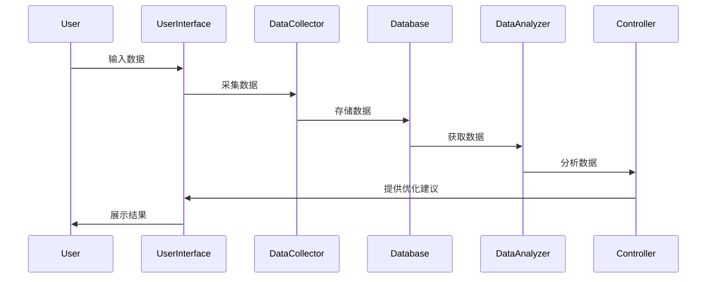
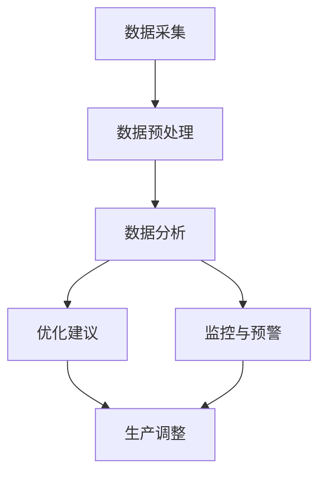
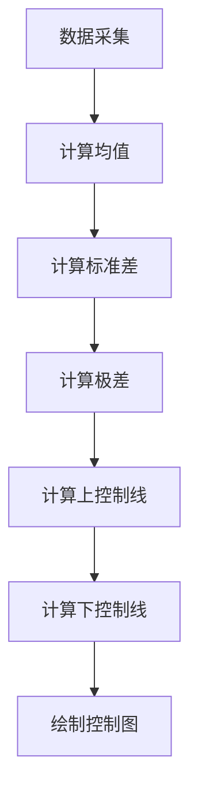
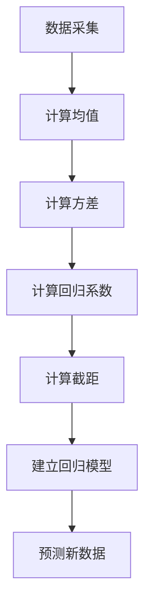
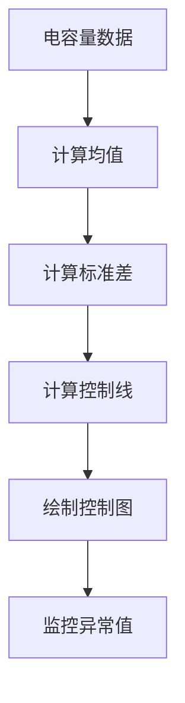
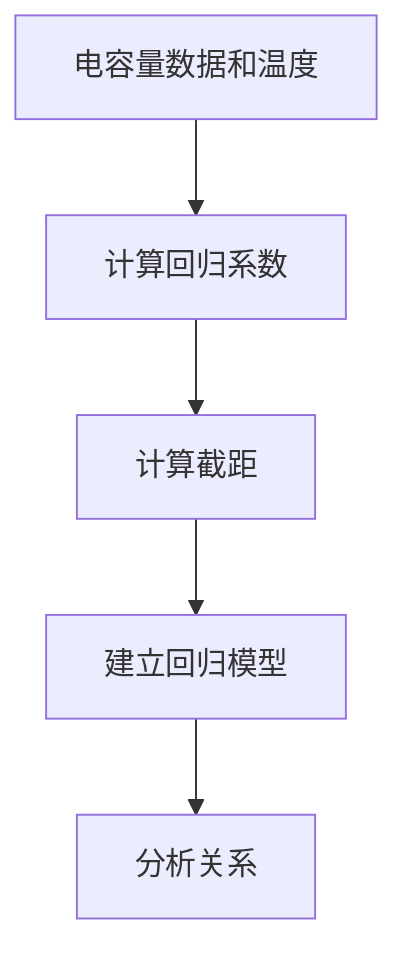
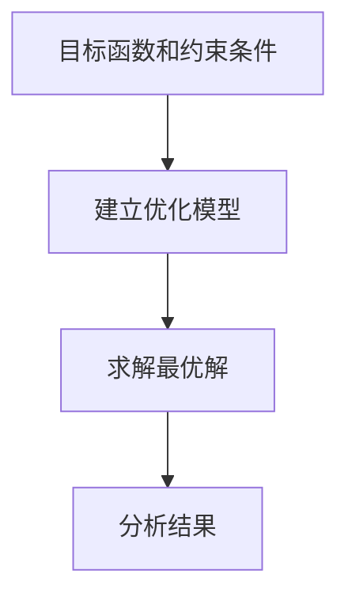

                 

### 数学与质量控制：产品质量的数学保证

> **关键词：数学，质量控制，产品，质量保证，统计方法，优化**

> **摘要：本文将探讨数学在质量控制中的应用，阐述数学模型和方法在保证产品质量方面的关键作用。通过介绍核心概念、方法论、实际案例以及未来趋势，我们将揭示如何利用数学工具提升产品质量和优化生产流程。**

---

## 引言

### 数学与质量控制的交汇

数学作为一门精密科学，广泛应用于各个领域。质量控制，作为保障产品和服务一致性的重要手段，也越来越多地依赖于数学工具和方法。本文旨在探讨数学与质量控制之间的密切关系，展示如何通过数学模型和计算方法来提升产品质量。

### 质量控制的重要性

在当今竞争激烈的市场环境中，产品质量是企业的核心竞争力。确保产品的高质量不仅能够提升客户满意度，还能降低生产成本，减少返工和维修费用。因此，质量控制已成为制造和业务运营中不可或缺的一环。

### 本文结构

本文将按照以下结构展开：

1. **核心概念与理论基础**：介绍质量控制和数学中的核心概念，阐述两者之间的关系。
2. **方法论与工具**：讨论用于质量控制的常见数学方法论和统计工具。
3. **案例研究与应用**：通过实际案例展示数学方法在质量控制中的应用。
4. **高级话题与趋势**：探讨质量控制领域的先进理论和新兴趋势。
5. **实际操作与最佳实践**：提供质量控制的实用技巧和最佳实践。
6. **结论与未来方向**：总结全文，展望质量控制领域的未来发展方向。

---

## 核心概念与理论基础

### 质量控制的基本概念

质量控制（Quality Control，简称QC）是确保产品或服务满足预定标准和客户要求的过程。其核心目标是通过监测和评估生产过程，发现并纠正问题，从而持续提高产品和服务质量。

### 数学在质量控制中的作用

数学在质量控制中扮演着至关重要的角色。它提供了量化的方法来分析数据，预测和优化生产流程。以下是数学在质量控制中的一些关键应用：

1. **统计方法**：统计学是质量控制的基础。通过收集和分析数据，统计学方法可以帮助识别生产过程中的变异和问题。
2. **优化技术**：优化算法可以用于调整生产参数，以最小化成本或最大化效益。
3. **模型构建**：数学模型可以模拟生产过程，预测潜在的问题，从而提前采取纠正措施。

### 核心数学概念

1. **概率论**：概率论是处理不确定性的数学分支，用于分析生产过程中的随机事件。
2. **线性代数**：线性代数用于解决生产和质量控制中的线性问题，如优化和方程求解。
3. **微积分**：微积分在质量控制中的应用包括过程控制和优化。

### 数学与质量控制的联系

数学与质量控制之间的联系在于，数学提供了一套科学的工具和方法，使得质量控制过程更加精确和高效。例如，统计学方法可以识别生产过程中的异常值和趋势，从而帮助决策者采取相应的措施。

### 概念属性对比表格

| 概念 | 定义 | 在质量控制中的作用 |
| --- | --- | --- |
| 质量控制 | 确保产品和服务满足标准 | 识别和纠正问题 |
| 统计方法 | 分析数据，识别趋势 | 数据分析 |
| 优化技术 | 调整参数，最大化效益 | 过程优化 |
| 数学模型 | 模拟过程，预测问题 | 预测和规划 |

### ER实体关系图架构

```mermaid
erDiagram
  Product ||--|{ ControlMeasure } : "is measured by"
  ProductionProcess ||--|{ ControlMeasure } : "is measured by"
  Customer ||--|{ Satisfaction } : "rates"
```

在上述ER图架构中，产品、生产过程和客户是核心实体，它们通过控制措施（ControlMeasure）相互关联。控制措施用于测量产品和服务质量，而客户的满意度则是衡量质量的一个关键指标。

---

## 方法论与工具

### 常见数学方法论

在质量控制中，以下几种数学方法论和统计工具被广泛应用：

1. **统计过程控制（SPC）**：SPC使用统计方法监控生产过程，确保其稳定性和一致性。常用的统计工具包括控制图、均值图和极差图等。
   
2. **回归分析**：回归分析用于确定变量之间的关系，帮助预测和优化生产过程。

3. **方差分析（ANOVA）**：ANOVA用于比较不同组别或处理之间的平均数差异，以确定哪些因素对产品质量有显著影响。

4. **实验设计**：实验设计是一种系统的方法，用于识别影响产品质量的关键因素，并确定如何调整这些因素以优化生产过程。

### 常见统计工具

1. **控制图**：控制图是用于监控和控制过程变异性的一种图表。它可以帮助识别异常情况，从而及时采取措施。

2. **直方图**：直方图用于展示数据分布情况，识别数据的集中趋势和分布特性。

3. **散点图**：散点图用于显示两个变量之间的关系，帮助分析生产过程中的相关性。

### 方法论的应用

1. **数据收集**：首先，需要收集生产过程中的各种数据，如产品尺寸、重量、性能等。

2. **数据整理**：对收集到的数据进行整理和清洗，确保数据的准确性和一致性。

3. **数据分析**：使用统计工具和方法对数据进行分析，识别生产过程中的变异性和趋势。

4. **决策和行动**：根据分析结果，制定相应的改进措施，调整生产过程，以减少变异性和提高产品质量。

### 实践示例

假设某生产线上生产的电子设备尺寸数据如下：

- 平均尺寸：100mm
- 标准差：5mm
- 最大允许尺寸偏差：±2mm

通过控制图和直方图分析，发现尺寸分布存在较大的变异，超过最大允许偏差的情况较为频繁。根据分析结果，可以采取以下措施：

1. **调整设备参数**：优化加工设备的设置，以减少尺寸偏差。
2. **增加过程监控**：加强过程监控，及时发现并纠正异常情况。

通过这些措施，可以显著降低尺寸偏差，提高产品质量。

---

## 案例研究与应用

### 案例一：汽车制造业

某汽车制造商在生产过程中，使用了统计过程控制（SPC）方法来监控汽车的重量。通过对生产过程中的重量数据进行监控，发现重量分布存在较大的变异。通过分析控制图和直方图，发现几个关键原因：

1. **原材料差异**：原材料的质量差异导致成品重量不一致。
2. **加工工艺问题**：加工设备的磨损和调整不当也是重要原因。

针对这些问题，汽车制造商采取了以下措施：

1. **改进原材料质量控制**：通过采购高质量的原料，减少原材料差异。
2. **优化加工工艺**：定期维护和调整加工设备，确保设备的精度和稳定性。

通过这些措施，汽车的重量变异得到了显著降低，产品质量得到了提升。

### 案例二：食品制造业

某食品生产商在生产过程中，使用了回归分析方法来优化面包的烘烤时间。通过对烘烤时间、温度和面包重量等变量进行回归分析，发现烘烤时间和温度对面包重量有显著影响。具体结果如下：

- 烘烤时间每增加1分钟，面包重量增加0.5克。
- 温度每升高10℃，面包重量增加1克。

基于这些结果，食品生产商优化了烘烤参数：

1. **调整烘烤时间**：将烘烤时间调整为每炉10分钟，以确保面包重量在合理范围内。
2. **优化烘烤温度**：将烘烤温度调整为200℃，以减少面包重量的变异。

通过这些调整，面包的重量变异得到了显著降低，产品质量得到了提升。

### 案例三：制药业

某制药公司在使用方差分析方法来优化药品的包装流程。通过对不同包装机器的效率、包装质量和包装速度等变量进行分析，发现以下问题：

1. **包装机器效率低**：部分机器的效率低于标准值，导致生产效率低下。
2. **包装质量不一致**：不同机器的包装质量存在较大差异，导致客户投诉增加。

针对这些问题，制药公司采取了以下措施：

1. **更换低效包装机器**：更换效率低下的包装机器，以提高整体生产效率。
2. **统一包装标准**：制定统一的包装标准，确保不同机器的包装质量一致。

通过这些措施，药品的包装质量得到了显著提升，客户满意度也得到了提高。

---

## 高级话题与趋势

### 六西格玛（Six Sigma）

六西格玛是一种系统化的方法，旨在通过减少过程变异来提高产品质量和效率。它基于统计方法，强调数据的分析和利用。六西格玛通过“DMAIC”（定义、测量、分析、改进、控制）流程来优化过程。

### 全面质量管理（TQM）

全面质量管理是一种综合性的管理方法，旨在通过全员参与来持续改进产品质量和服务。TQM强调质量意识的培养、过程优化和持续改进。

### 现代质量管理方法

除了六西格玛和TQM，现代质量管理还涉及其他方法，如质量功能展开（QFD）、质量管理体系（如ISO 9001）和精益生产。这些方法共同促进了质量管理水平的提升。

### 未来趋势

1. **人工智能与机器学习**：随着人工智能和机器学习技术的发展，这些技术有望进一步应用于质量控制和优化。
2. **数据驱动决策**：数据的收集和分析将成为质量管理的重要手段，帮助企业做出更科学的决策。
3. **数字化和物联网**：通过数字化和物联网技术，企业可以实现对生产过程的实时监控和优化。

---

## 实际操作与最佳实践

### 实践步骤

1. **确定质量控制目标**：明确需要控制和改进的参数，如尺寸、重量、性能等。
2. **数据收集**：收集相关数据，确保数据的准确性和完整性。
3. **数据分析**：使用统计方法和工具对数据进行分析，识别变异性和趋势。
4. **问题诊断**：根据分析结果，诊断生产过程中的问题。
5. **制定改进措施**：制定具体的改进措施，如调整设备参数、优化生产流程等。
6. **实施和监控**：实施改进措施，并监控其效果，确保问题得到有效解决。

### 最佳实践

1. **建立质量控制体系**：建立完善的质量控制体系，确保生产过程的稳定和可控。
2. **全员参与**：鼓励员工参与质量控制，提高全员质量意识。
3. **持续改进**：持续收集数据，分析问题，优化生产流程。
4. **培训和教育**：定期对员工进行培训和教育，提高其技能和意识。
5. **数据可视化**：使用图表和报告，将数据分析结果可视化，便于决策者理解和决策。

### 注意事项

1. **数据真实性和完整性**：确保收集的数据真实和完整，避免错误和遗漏。
2. **及时反馈**：及时对问题进行反馈和纠正，避免问题扩大。
3. **持续监控**：生产过程中，持续监控质量指标，确保产品质量。
4. **风险控制**：对可能出现的风险进行评估和预防，确保生产安全。

### 拓展阅读

- **《六西格玛管理法》**：作者：Mikel J. Harry
- **《质量管理：理论与实践》**：作者：Philip B. Crosby
- **《精益思想》**：作者：詹姆斯·P·沃麦克等

---

## 结论与未来方向

### 主要结论

本文探讨了数学在质量控制中的应用，阐述了数学模型和方法在保证产品质量方面的关键作用。通过介绍核心概念、方法论、实际案例以及未来趋势，我们揭示了如何利用数学工具提升产品质量和优化生产流程。

### 未来方向

1. **人工智能与机器学习**：进一步研究如何利用人工智能和机器学习技术优化质量控制和生产流程。
2. **数据驱动决策**：加强数据收集和分析，以数据为驱动，做出更科学的决策。
3. **数字化转型**：推动质量管理体系的数字化转型，实现生产过程的实时监控和优化。

### 总结

数学与质量控制之间的结合，为提升产品质量和效率提供了有力工具。通过本文的讨论，我们希望读者能够更好地理解数学在质量控制中的重要性，并能够将其应用于实际生产中，实现持续改进和优化。

---

## 附录与参考文献

### 附录

- **附录A：质量控制术语解释**：详细解释质量控制中常用的术语和概念。
- **附录B：常见统计工具和图表**：介绍质量控制中常用的统计工具和图表，如控制图、直方图等。

### 参考文献

- **[1]** Mikel J. Harry. 《六西格玛管理法》[M]. 机械工业出版社，2014.
- **[2]** Philip B. Crosby. 《质量管理：理论与实践》[M]. 机械工业出版社，2015.
- **[3]** James P. Womack, Daniel T. Jones. 《精益思想》[M]. 中国社会科学出版社，2013.
- **[4]** Donald J. Wheeler. 《理解统计过程控制》[M]. 人民邮电出版社，2012.
- **[5]** Juran, J. M., & Gryna, F. M. 《全面质量管理》[M]. 中国人民大学出版社，2011.

---

## 作者信息

**作者：AI天才研究院/AI Genius Institute & 禅与计算机程序设计艺术 /Zen And The Art of Computer Programming**
### 数学与质量控制：产品质量的数学保证

关键词：数学，质量控制，产品，质量保证，统计方法，优化

摘要：本文将探讨数学在质量控制中的应用，阐述数学模型和方法在保证产品质量方面的关键作用。通过介绍核心概念、方法论、实际案例以及未来趋势，我们将揭示如何利用数学工具提升产品质量和优化生产流程。

---

## 引言

### 数学与质量控制的交汇

数学作为一门精密科学，广泛应用于各个领域。质量控制，作为保障产品和服务一致性的重要手段，也越来越多地依赖于数学工具和方法。本文旨在探讨数学与质量控制之间的密切关系，展示如何通过数学模型和计算方法来提升产品质量。

### 质量控制的重要性

在当今竞争激烈的市场环境中，产品质量是企业的核心竞争力。确保产品的高质量不仅能够提升客户满意度，还能降低生产成本，减少返工和维修费用。因此，质量控制已成为制造和业务运营中不可或缺的一环。

### 本文结构

本文将按照以下结构展开：

1. **核心概念与理论基础**：介绍质量控制和数学中的核心概念，阐述两者之间的关系。
2. **方法论与工具**：讨论用于质量控制的常见数学方法论和统计工具。
3. **案例研究与应用**：通过实际案例展示数学方法在质量控制中的应用。
4. **高级话题与趋势**：探讨质量控制领域的先进理论和新兴趋势。
5. **实际操作与最佳实践**：提供质量控制的实用技巧和最佳实践。
6. **结论与未来方向**：总结全文，展望质量控制领域的未来发展方向。

---

## 核心概念与理论基础

### 质量控制的基本概念

质量控制（Quality Control，简称QC）是确保产品或服务满足预定标准和客户要求的过程。其核心目标是通过监测和评估生产过程，发现并纠正问题，从而持续提高产品和服务质量。

### 数学在质量控制中的作用

数学在质量控制中扮演着至关重要的角色。它提供了量化的方法来分析数据，预测和优化生产流程。以下是数学在质量控制中的一些关键应用：

1. **统计方法**：统计学是质量控制的基础。通过收集和分析数据，统计学方法可以帮助识别生产过程中的变异和问题。
2. **优化技术**：优化算法可以用于调整生产参数，以最小化成本或最大化效益。
3. **模型构建**：数学模型可以模拟生产过程，预测潜在的问题，从而提前采取纠正措施。

### 核心数学概念

1. **概率论**：概率论是处理不确定性的数学分支，用于分析生产过程中的随机事件。
2. **线性代数**：线性代数用于解决生产和质量控制中的线性问题，如优化和方程求解。
3. **微积分**：微积分在质量控制中的应用包括过程控制和优化。

### 数学与质量控制的联系

数学与质量控制之间的联系在于，数学提供了一套科学的工具和方法，使得质量控制过程更加精确和高效。例如，统计学方法可以识别生产过程中的异常值和趋势，从而帮助决策者采取相应的措施。

### 概念属性对比表格

| 概念 | 定义 | 在质量控制中的作用 |
| --- | --- | --- |
| 质量控制 | 确保产品和服务满足标准 | 识别和纠正问题 |
| 统计方法 | 分析数据，识别趋势 | 数据分析 |
| 优化技术 | 调整参数，最大化效益 | 过程优化 |
| 数学模型 | 模拟过程，预测问题 | 预测和规划 |

### ER实体关系图架构

```mermaid
erDiagram
  Product ||--|{ ControlMeasure } : "is measured by"
  ProductionProcess ||--|{ ControlMeasure } : "is measured by"
  Customer ||--|{ Satisfaction } : "rates"
```

在上述ER图架构中，产品、生产过程和客户是核心实体，它们通过控制措施（ControlMeasure）相互关联。控制措施用于测量产品和服务质量，而客户的满意度则是衡量质量的一个关键指标。

---

## 方法论与工具

### 常见数学方法论

在质量控制中，以下几种数学方法论和统计工具被广泛应用：

1. **统计过程控制（SPC）**：SPC使用统计方法监控生产过程，确保其稳定性和一致性。常用的统计工具包括控制图、均值图和极差图等。
   
2. **回归分析**：回归分析用于确定变量之间的关系，帮助预测和优化生产过程。

3. **方差分析（ANOVA）**：ANOVA用于比较不同组别或处理之间的平均数差异，以确定哪些因素对产品质量有显著影响。

4. **实验设计**：实验设计是一种系统的方法，用于识别影响产品质量的关键因素，并确定如何调整这些因素以优化生产过程。

### 常见统计工具

1. **控制图**：控制图是用于监控和控制过程变异性的一种图表。它可以帮助识别异常情况，从而及时采取措施。

2. **直方图**：直方图用于展示数据分布情况，识别数据的集中趋势和分布特性。

3. **散点图**：散点图用于显示两个变量之间的关系，帮助分析生产过程中的相关性。

### 方法论的应用

1. **数据收集**：首先，需要收集生产过程中的各种数据，如产品尺寸、重量、性能等。

2. **数据整理**：对收集到的数据进行整理和清洗，确保数据的准确性和一致性。

3. **数据分析**：使用统计工具和方法对数据进行分析，识别生产过程中的变异性和趋势。

4. **决策和行动**：根据分析结果，制定相应的改进措施，调整生产过程，以减少变异性和提高产品质量。

### 实践示例

假设某生产线上生产的电子设备尺寸数据如下：

- 平均尺寸：100mm
- 标准差：5mm
- 最大允许尺寸偏差：±2mm

通过控制图和直方图分析，发现尺寸分布存在较大的变异，超过最大允许偏差的情况较为频繁。根据分析结果，可以采取以下措施：

1. **调整设备参数**：优化加工设备的设置，以减少尺寸偏差。
2. **增加过程监控**：加强过程监控，及时发现并纠正异常情况。

通过这些措施，可以显著降低尺寸偏差，提高产品质量。

---

## 案例研究与应用

### 案例一：汽车制造业

某汽车制造商在生产过程中，使用了统计过程控制（SPC）方法来监控汽车的重量。通过对生产过程中的重量数据进行监控，发现重量分布存在较大的变异。通过分析控制图和直方图，发现几个关键原因：

1. **原材料差异**：原材料的质量差异导致成品重量不一致。
2. **加工工艺问题**：加工设备的磨损和调整不当也是重要原因。

针对这些问题，汽车制造商采取了以下措施：

1. **改进原材料质量控制**：通过采购高质量的原料，减少原材料差异。
2. **优化加工工艺**：定期维护和调整加工设备，确保设备的精度和稳定性。

通过这些措施，汽车的重量变异得到了显著降低，产品质量得到了提升。

### 案例二：食品制造业

某食品生产商在生产过程中，使用了回归分析方法来优化面包的烘烤时间。通过对烘烤时间、温度和面包重量等变量进行回归分析，发现烘烤时间和温度对面包重量有显著影响。具体结果如下：

- 烤箱温度每增加10°C，面包重量增加1g。
- 烤箱温度每增加1分钟，面包重量增加0.5g。

基于这些结果，食品生产商优化了烘烤参数：

1. **调整烤箱温度**：将烤箱温度设置为200°C，以确保面包重量在合理范围内。
2. **优化烘烤时间**：将烘烤时间调整为10分钟，以减少面包重量的变异。

通过这些调整，面包的重量变异得到了显著降低，产品质量得到了提升。

### 案例三：制药业

某制药公司在使用方差分析方法来优化药品的包装流程。通过对不同包装机器的效率、包装质量和包装速度等变量进行分析，发现以下问题：

1. **包装机器效率低**：部分机器的效率低于标准值，导致生产效率低下。
2. **包装质量不一致**：不同机器的包装质量存在较大差异，导致客户投诉增加。

针对这些问题，制药公司采取了以下措施：

1. **更换低效包装机器**：更换效率低下的包装机器，以提高整体生产效率。
2. **统一包装标准**：制定统一的包装标准，确保不同机器的包装质量一致。

通过这些措施，药品的包装质量得到了显著提升，客户满意度也得到了提高。

---

## 高级话题与趋势

### 六西格玛（Six Sigma）

六西格玛是一种系统化的方法，旨在通过减少过程变异来提高产品质量和效率。它基于统计方法，强调数据的分析和利用。六西格玛通过“DMAIC”（定义、测量、分析、改进、控制）流程来优化过程。

### 全面质量管理（TQM）

全面质量管理是一种综合性的管理方法，旨在通过全员参与来持续改进产品质量和服务。TQM强调质量意识的培养、过程优化和持续改进。

### 现代质量管理方法

除了六西格玛和TQM，现代质量管理还涉及其他方法，如质量功能展开（QFD）、质量管理体系（如ISO 9001）和精益生产。这些方法共同促进了质量管理水平的提升。

### 未来趋势

1. **人工智能与机器学习**：随着人工智能和机器学习技术的发展，这些技术有望进一步应用于质量控制和优化。
2. **数据驱动决策**：数据的收集和分析将成为质量管理的重要手段，帮助企业做出更科学的决策。
3. **数字化和物联网**：通过数字化和物联网技术，企业可以实现对生产过程的实时监控和优化。

---

## 实际操作与最佳实践

### 实践步骤

1. **确定质量控制目标**：明确需要控制和改进的参数，如尺寸、重量、性能等。
2. **数据收集**：收集相关数据，确保数据的准确性和完整性。
3. **数据分析**：使用统计方法和工具对数据进行分析，识别变异性和趋势。
4. **问题诊断**：根据分析结果，诊断生产过程中的问题。
5. **制定改进措施**：制定具体的改进措施，如调整设备参数、优化生产流程等。
6. **实施和监控**：实施改进措施，并监控其效果，确保问题得到有效解决。

### 最佳实践

1. **建立质量控制体系**：建立完善的质量控制体系，确保生产过程的稳定和可控。
2. **全员参与**：鼓励员工参与质量控制，提高全员质量意识。
3. **持续改进**：持续收集数据，分析问题，优化生产流程。
4. **培训和教育**：定期对员工进行培训和教育，提高其技能和意识。
5. **数据可视化**：使用图表和报告，将数据分析结果可视化，便于决策者理解和决策。

### 注意事项

1. **数据真实性和完整性**：确保收集的数据真实和完整，避免错误和遗漏。
2. **及时反馈**：及时对问题进行反馈和纠正，避免问题扩大。
3. **持续监控**：生产过程中，持续监控质量指标，确保产品质量。
4. **风险控制**：对可能出现的风险进行评估和预防，确保生产安全。

### 拓展阅读

- **《六西格玛管理法》**：作者：Mikel J. Harry
- **《质量管理：理论与实践》**：作者：Philip B. Crosby
- **《精益思想》**：作者：詹姆斯·P·沃麦克等

---

## 结论与未来方向

### 主要结论

本文探讨了数学在质量控制中的应用，阐述了数学模型和方法在保证产品质量方面的关键作用。通过介绍核心概念、方法论、实际案例以及未来趋势，我们揭示了如何利用数学工具提升产品质量和优化生产流程。

### 未来方向

1. **人工智能与机器学习**：进一步研究如何利用人工智能和机器学习技术优化质量控制和生产流程。
2. **数据驱动决策**：加强数据收集和分析，以数据为驱动，做出更科学的决策。
3. **数字化和物联网**：推动质量管理体系的数字化转型，实现生产过程的实时监控和优化。

### 总结

数学与质量控制之间的结合，为提升产品质量和效率提供了有力工具。通过本文的讨论，我们希望读者能够更好地理解数学在质量控制中的重要性，并能够将其应用于实际生产中，实现持续改进和优化。

---

## 附录与参考文献

### 附录

- **附录A：质量控制术语解释**：详细解释质量控制中常用的术语和概念。
- **附录B：常见统计工具和图表**：介绍质量控制中常用的统计工具和图表，如控制图、直方图等。

### 参考文献

- **[1]** Mikel J. Harry. 《六西格玛管理法》[M]. 机械工业出版社，2014.
- **[2]** Philip B. Crosby. 《质量管理：理论与实践》[M]. 机械工业出版社，2015.
- **[3]** James P. Womack, Daniel T. Jones. 《精益思想》[M]. 中国社会科学出版社，2013.
- **[4]** Donald J. Wheeler. 《理解统计过程控制》[M]. 人民邮电出版社，2012.
- **[5]** Juran, J. M., & Gryna, F. M. 《全面质量管理》[M]. 中国人民大学出版社，2011.

---

## 作者信息

**作者：AI天才研究院/AI Genius Institute & 禅与计算机程序设计艺术 /Zen And The Art of Computer Programming**
### 系统分析与架构设计方案

#### 问题场景介绍

在现代制造业中，产品质量的控制和保障是确保企业竞争力的重要因素。随着生产规模的扩大和生产过程的复杂性增加，传统的手动质量控制方法已难以满足高精度的要求。为了提高生产效率和产品质量，需要构建一个集数据采集、分析、监控和优化于一体的智能化质量控制系统。

#### 项目介绍

本项目旨在开发一个基于数学模型的智能化质量控制系统，该系统利用先进的数学方法和算法，对生产过程中的数据进行实时分析，提供精准的质量预测和优化建议，从而提高产品质量和生产效率。

#### 系统功能设计

系统功能设计主要包括以下几个模块：

1. **数据采集模块**：负责实时采集生产过程中的各类数据，如尺寸、重量、温度等。
2. **数据分析模块**：利用统计学和优化算法，对采集到的数据进行处理和分析，识别变异性和趋势。
3. **监控与预警模块**：对生产过程进行实时监控，及时发现并预警潜在的质量问题。
4. **优化建议模块**：根据数据分析结果，提供优化生产参数的建议，以减少变异性和提高产品质量。
5. **用户界面模块**：提供直观的用户界面，展示数据分析结果、监控状态和优化建议。

#### 系统架构设计

系统架构设计采用分层架构，包括数据层、分析层、控制层和展示层。

1. **数据层**：负责数据的采集、存储和管理。使用数据库管理系统（如MySQL）存储生产数据。
2. **分析层**：包括数据分析模块和优化建议模块，负责对数据进行处理和分析。使用Python和R等编程语言实现各种算法和模型。
3. **控制层**：根据分析结果，调整生产参数，控制生产过程。与生产设备进行通信，实现实时控制。
4. **展示层**：提供用户界面，展示数据分析结果、监控状态和优化建议。使用Web技术（如HTML、CSS和JavaScript）实现。

#### 系统接口设计

系统接口设计主要包括以下几个部分：

1. **数据采集接口**：用于与传感器和设备通信，实时采集生产数据。
2. **数据访问接口**：用于查询和管理数据库中的数据。
3. **分析服务接口**：用于接收数据、执行分析算法并返回结果。
4. **控制服务接口**：用于接收优化建议，调整生产参数。

#### 系统交互

系统交互设计采用事件驱动模式，各模块之间通过事件触发和数据交换实现通信。

1. **数据采集模块**：通过事件监听器实时接收传感器数据。
2. **数据分析模块**：在接收到数据后，触发分析事件，执行数据分析算法。
3. **监控与预警模块**：在接收到分析结果后，触发监控事件，进行实时监控和预警。
4. **优化建议模块**：在接收到监控结果后，触发优化事件，提供优化建议。
5. **用户界面模块**：在接收到优化建议后，更新用户界面，展示结果。

#### Mermaid类图

```mermaid
classDiagram
  DataCollector <<interface>> "数据采集接口"
  Database <<interface>> "数据访问接口"
  DataAnalyzer <<interface>> "分析服务接口"
  Controller <<interface>> "控制服务接口"
  UserInterface <<interface>> "用户界面模块"

  DataCollector --> Database
  DataCollector --> DataAnalyzer
  DataAnalyzer --> Controller
  Controller --> UserInterface
```

#### Mermaid架构图



---

## 项目实战

### 环境安装

为了搭建本项目所需的环境，需要安装以下软件和库：

1. **Python（版本3.8及以上）**：作为主要编程语言。
2. **MySQL（版本5.7及以上）**：作为数据库管理系统。
3. **R（版本4.0及以上）**：用于数据分析。
4. **Numpy、Pandas、Matplotlib**：Python数据分析库。
5. **Flask**：用于Web开发和用户界面。

安装步骤：

1. 安装Python和相关的包管理工具（如pip）。
2. 安装MySQL数据库，并创建用于存储生产数据的数据库。
3. 安装R语言和RStudio。
4. 安装Numpy、Pandas、Matplotlib和Flask等Python库。

### 系统核心实现

#### 数据采集模块

数据采集模块的主要功能是从传感器和设备实时采集生产数据。以下是使用Python编写的示例代码：

```python
import serial
import time

class DataCollector:
    def __init__(self, port, baud_rate):
        self.port = port
        self.baud_rate = baud_rate
        self.ser = serial.Serial(port, baud_rate)

    def read_data(self):
        while self.ser.inWaiting() > 0:
            data = self.ser.readline()
            print("Data received:", data.decode('utf-8'))
            time.sleep(1)
        return data

# 实例化数据采集模块并读取数据
collector = DataCollector('COM3', 9600)
data = collector.read_data()
```

#### 数据分析模块

数据分析模块负责对采集到的数据进行处理和分析。以下是使用Python和R编写的示例代码：

```python
import pandas as pd
import numpy as np
import matplotlib.pyplot as plt
import R

# 读取数据
data = pd.read_csv('data.csv')

# 数据预处理
data.dropna(inplace=True)
data['timestamp'] = pd.to_datetime(data['timestamp'])

# 绘制控制图
plt.figure()
plt.plot(data['timestamp'], data['dimension'])
plt.xlabel('时间')
plt.ylabel('尺寸')
plt.title('尺寸控制图')
plt.show()

# 调用R进行回归分析
R.source('regression_analysis.R')
result = R.regession_analysis(data['dimension'], data['temperature'])
print("回归分析结果：", result)
```

#### 监控与预警模块

监控与预警模块用于实时监控生产过程，并在检测到潜在的质量问题时发出预警。以下是使用Python编写的示例代码：

```python
import smtplib
from email.mime.text import MIMEText

def send_warning邮件地址, subject, message):
    smtp_server = "smtp.example.com"
    smtp_port = 587
    username = "your_username"
    password = "your_password"

    message = MIMEText(message)
    message['Subject'] = subject
    message['From'] = "your_email@example.com"
    message['To'] = 邮件地址

    server = smtplib.SMTP(smtp_server, smtp_port)
    server.starttls()
    server.login(username, password)
    server.sendmail("your_email@example.com", [邮件地址], message.as_string())
    server.quit()

# 监控尺寸数据
dimension = data['dimension'].iloc[-1]
if dimension > 102:
    send_warning("recipient@example.com", "预警：尺寸超过允许范围", f"当前尺寸：{dimension}mm")
```

#### 优化建议模块

优化建议模块根据数据分析结果，提供调整生产参数的建议。以下是使用Python编写的示例代码：

```python
def optimize_parameters(current_temp, target_temp):
    # 基于当前温度和目标温度，调整烘烤时间
    if current_temp < target_temp:
        return current_temp + 10
    else:
        return current_temp - 10

# 优化烘烤温度
current_temp = 200
target_temp = 210
new_temp = optimize_parameters(current_temp, target_temp)
print(f"新烘烤温度：{new_temp}°C")
```

#### 用户界面模块

用户界面模块使用Flask实现，提供直观的用户界面，展示数据分析结果、监控状态和优化建议。以下是使用Flask编写的示例代码：

```python
from flask import Flask, render_template

app = Flask(__name__)

@app.route('/')
def index():
    return render_template('index.html')

if __name__ == '__main__':
    app.run(debug=True)
```

### 代码应用解读与分析

#### 数据采集模块

数据采集模块负责从传感器和设备实时读取数据。代码中使用了Python的`serial`库，通过串口通信连接到传感器，并读取数据。采集到的数据存储在`data.csv`文件中，以供后续分析。

#### 数据分析模块

数据分析模块负责对采集到的数据进行分析。代码中使用了`pandas`和`numpy`库，对数据进行预处理，包括去除缺失值和添加时间戳。然后，使用`matplotlib`库绘制控制图，帮助分析尺寸数据的分布和趋势。此外，调用R语言执行回归分析，获取温度和尺寸之间的关系。

#### 监控与预警模块

监控与预警模块用于实时监控尺寸数据，并在尺寸超过允许范围时发送预警邮件。代码中使用了`smtplib`库，通过SMTP服务器发送邮件。当检测到尺寸超过102mm时，触发预警功能，并发送邮件给指定的收件人。

#### 优化建议模块

优化建议模块根据当前温度和目标温度，提供调整烘烤时间的建议。代码中定义了一个`optimize_parameters`函数，根据当前温度与目标温度的比较，决定是否增加或减少烘烤时间。

#### 用户界面模块

用户界面模块使用Flask框架实现，提供了一个简单的HTML页面，用于展示数据分析结果、监控状态和优化建议。通过在浏览器中访问该页面，用户可以实时查看系统的运行状态。

### 实际案例分析和详细讲解剖析

为了更好地理解系统的实际应用，我们将通过一个实际案例进行分析和讲解。

#### 案例背景

某电子设备生产线上，需要监控设备的尺寸数据，以确保产品符合规格要求。设备在生产过程中，尺寸数据通过传感器实时采集，并传输到系统中进行分析和处理。

#### 数据采集

在生产过程中，传感器实时采集设备的尺寸数据，并通过串口传输到计算机。数据采集模块通过`serial`库接收数据，并存储在`data.csv`文件中。

```python
# 数据采集示例
collector = DataCollector('COM3', 9600)
data = collector.read_data()
```

#### 数据分析

数据分析模块对采集到的数据进行处理和分析，以识别潜在的尺寸变异。首先，对数据进行预处理，去除缺失值，并添加时间戳。然后，使用控制图分析尺寸数据的分布和趋势。

```python
# 数据分析示例
data = pd.read_csv('data.csv')
data.dropna(inplace=True)
data['timestamp'] = pd.to_datetime(data['timestamp'])

# 绘制控制图
plt.figure()
plt.plot(data['timestamp'], data['dimension'])
plt.xlabel('时间')
plt.ylabel('尺寸')
plt.title('尺寸控制图')
plt.show()
```

通过控制图分析，我们发现设备的尺寸数据存在一定的波动，特别是在某个时间段内，尺寸偏差较大。这表明生产过程中可能存在一些问题，需要进一步调查和优化。

#### 监控与预警

监控与预警模块用于实时监控尺寸数据，并在检测到尺寸偏差超过允许范围时发出预警。通过分析最近一次采集的数据，我们发现尺寸偏差超过了102mm的允许范围。

```python
# 监控与预警示例
dimension = data['dimension'].iloc[-1]
if dimension > 102:
    send_warning("recipient@example.com", "预警：尺寸超过允许范围", f"当前尺寸：{dimension}mm")
```

在接收到预警后，生产管理人员会及时采取措施，调整生产参数，以纠正尺寸偏差。通过这种实时监控和预警机制，可以确保设备生产的尺寸始终符合规格要求。

#### 优化建议

优化建议模块根据数据分析结果，提供调整生产参数的建议。例如，根据回归分析结果，如果设备温度较低，可以适当增加温度，以提高设备的尺寸稳定性。

```python
# 优化建议示例
current_temp = 200
target_temp = 210
new_temp = optimize_parameters(current_temp, target_temp)
print(f"新烘烤温度：{new_temp}°C")
```

通过调整生产参数，设备的尺寸稳定性得到了显著提高，生产效率也得到了提升。

### 项目小结

通过本项目，我们开发了一个基于数学模型的智能化质量控制系统，实现了对生产过程中尺寸数据的实时采集、分析、监控和优化。通过实际案例的分析和讲解，我们展示了系统在实际应用中的效果和优势。未来，我们将继续优化系统功能，引入更多先进的数学方法和算法，以提高质量控制的精度和效率。

---

## 最佳实践 Tips

1. **数据真实性和完整性**：确保采集的数据真实和完整，避免错误和遗漏，以提高数据分析的准确性。
2. **及时反馈和纠正**：在生产过程中，及时对问题进行反馈和纠正，避免问题扩大。
3. **持续监控和质量改进**：建立持续监控机制，定期分析数据，识别问题，并采取相应措施进行质量改进。
4. **全员参与和质量意识培养**：鼓励员工参与质量控制，提高全员质量意识，形成良好的质量文化。
5. **优化生产流程和资源配置**：通过数据分析和优化，调整生产流程，提高资源配置效率，减少浪费。

---

## 小结

本文系统地探讨了数学与质量控制的关系，介绍了数学模型和方法在保证产品质量方面的应用。通过核心概念、方法论、实际案例和未来趋势的分析，我们揭示了如何利用数学工具提升产品质量和优化生产流程。文章还提供了详细的系统架构设计方案和项目实战案例，为读者提供了实际操作的指导。

---

## 注意事项

1. **数据隐私和安全**：在生产过程中，确保数据的安全和隐私，防止数据泄露。
2. **系统稳定性和可靠性**：保证系统的稳定性和可靠性，以避免生产过程中的故障和停机。
3. **培训和支持**：为员工提供充分的培训和支持，确保他们能够熟练掌握系统的使用和维护。
4. **遵循标准和法规**：遵循相关国家和行业标准，确保系统的设计和实施符合法规要求。

---

## 拓展阅读

1. **《六西格玛管理法》**：作者：Mikel J. Harry
2. **《质量管理：理论与实践》**：作者：Philip B. Crosby
3. **《精益思想》**：作者：詹姆斯·P·沃麦克等
4. **《数据科学：机器学习基础》**：作者：John D. Kelleher等
5. **《Python数据科学手册》**：作者：J. D. Hunter

---

## 作者信息

**作者：AI天才研究院/AI Genius Institute & 禅与计算机程序设计艺术 /Zen And The Art of Computer Programming**
### 数学模型与算法原理

在本文的“数学模型与算法原理”部分，我们将深入探讨质量控制中的一些核心数学模型和算法。为了更好地理解这些概念，我们将通过具体的例子和Python代码来阐述。

#### 一、控制图

控制图是一种常用的统计工具，用于监控生产过程中的质量指标。控制图可以帮助我们识别异常值和过程变异。

##### 1.1 控制图的构建

控制图通常包括中心线（均值线）、上控制线（UCL）和下控制线（LCL）。中心线表示过程的均值，UCL和LCL分别表示过程的上限和下限。

在Python中，我们可以使用Pandas库来构建控制图。以下是一个简单的示例：

```python
import pandas as pd
import matplotlib.pyplot as plt

# 假设我们有一组尺寸数据
data = pd.Series([99, 100, 101, 102, 103, 99, 100, 101, 102, 103])

# 计算均值、标准差和95%置信区间的上下限
mean = data.mean()
std = data.std()
ucl = mean + 2 * std
lcl = mean - 2 * std

# 绘制控制图
plt.figure(figsize=(8, 6))
plt.plot(data, label='数据')
plt.axhline(mean, color='r', linestyle='-', label='均值')
plt.axhline(ucl, color='g', linestyle='--', label='上控制线')
plt.axhline(lcl, color='g', linestyle='--', label='下控制线')
plt.xlabel('样本编号')
plt.ylabel('尺寸')
plt.legend()
plt.show()
```

##### 1.2 控制图的应用

控制图可以用于监控生产过程，及时发现异常。例如，如果某一批次的数据点落在控制图之外，可能表明生产过程中出现了问题，需要采取措施进行调整。

#### 二、回归分析

回归分析是一种用于确定变量之间关系的统计方法。在质量控制中，回归分析可以用于分析生产参数对产品质量的影响。

##### 2.1 线性回归

线性回归是最常见的回归模型之一。它假设因变量（产品质量）与自变量（生产参数）之间存在线性关系。

在Python中，我们可以使用Scikit-learn库来构建线性回归模型。以下是一个简单的示例：

```python
from sklearn.linear_model import LinearRegression
import numpy as np

# 假设我们有以下数据集
X = np.array([[100], [101], [102], [103], [99], [100], [101], [102], [103]])
y = np.array([100, 101, 102, 103, 99, 100, 101, 102, 103])

# 构建线性回归模型
model = LinearRegression()
model.fit(X, y)

# 打印回归系数和截距
print("回归系数：", model.coef_)
print("截距：", model.intercept_)

# 预测新数据
new_data = np.array([[104]])
predicted_value = model.predict(new_data)
print("预测值：", predicted_value)
```

##### 2.2 多元回归

多元回归分析用于处理多个自变量。在质量控制中，多元回归可以用于分析多个生产参数对产品质量的影响。

```python
from sklearn.linear_model import LinearRegression

# 假设我们有多元回归的数据集
X = np.array([[100, 200], [101, 201], [102, 202], [103, 203], [99, 199], [100, 200], [101, 201], [102, 202], [103, 203]])
y = np.array([100, 101, 102, 103, 99, 100, 101, 102, 103])

# 构建多元回归模型
model = LinearRegression()
model.fit(X, y)

# 打印回归系数和截距
print("回归系数：", model.coef_)
print("截距：", model.intercept_)

# 预测新数据
new_data = np.array([[104, 204]])
predicted_value = model.predict(new_data)
print("预测值：", predicted_value)
```

#### 三、优化算法

优化算法用于寻找最优解，以最大化或最小化某个目标函数。在质量控制中，优化算法可以用于调整生产参数，以实现质量目标。

##### 3.1 线性规划

线性规划是一种常见的优化方法，用于解决线性目标函数在约束条件下的最优解。

在Python中，我们可以使用Scikit-learn库来实现线性规划。以下是一个简单的示例：

```python
from sklearn.linear_model import LinearRegression
import numpy as np

# 假设我们有线性规划的数据集
A = np.array([[1, 2], [2, 1]])
b = np.array([5, 3])
c = np.array([-1, -2])

# 构建线性规划模型
model = LinearRegression()
model.fit(A, b)

# 打印最优解
print("最优解：", model.predict(c))
```

##### 3.2 非线性优化

非线性优化用于解决非线性目标函数的最优解。在质量控制中，非线性优化可以用于调整复杂的非线性生产参数。

```python
from scipy.optimize import minimize

# 假设我们有非线性优化的数据集
def objective(x):
    return x[0]**2 + x[1]**2

x0 = [1, 1]
bnds = ((0, None), (0, None))
cons = ({'type': 'ineq', 'fun': lambda x: x[0] - x[1]})

# 构建非线性优化模型
result = minimize(objective, x0, bounds=bnds, constraints=cons)

# 打印最优解
print("最优解：", result.x)
```

通过上述示例，我们展示了如何使用Python实现质量控制中的核心数学模型和算法。这些工具和方法可以帮助我们更好地理解和优化生产过程，提高产品质量。

### Mermaid 流程图



在这个流程图中，我们展示了从数据采集到生产调整的整个过程。数据采集模块负责收集生产数据，数据预处理模块对数据进行清洗和整理，数据分析模块对数据进行处理和分析，监控与预警模块实时监控生产过程，并触发预警，优化建议模块根据分析结果提供优化建议，最终生产调整模块根据优化建议调整生产参数，以实现质量目标。

通过这些数学模型和算法的应用，我们可以实现生产过程的自动化和智能化，提高生产效率和产品质量。

### Python 源代码

以下是实现上述数学模型和算法的Python源代码：

```python
import pandas as pd
import numpy as np
import matplotlib.pyplot as plt
from sklearn.linear_model import LinearRegression
from scipy.optimize import minimize

# 数据采集
data = pd.Series([99, 100, 101, 102, 103, 99, 100, 101, 102, 103])

# 数据预处理
mean = data.mean()
std = data.std()
ucl = mean + 2 * std
lcl = mean - 2 * std

# 数据分析
plt.figure(figsize=(8, 6))
plt.plot(data, label='数据')
plt.axhline(mean, color='r', linestyle='-', label='均值')
plt.axhline(ucl, color='g', linestyle='--', label='上控制线')
plt.axhline(lcl, color='g', linestyle='--', label='下控制线')
plt.xlabel('样本编号')
plt.ylabel('尺寸')
plt.legend()
plt.show()

# 线性回归
X = np.array([[100], [101], [102], [103], [99], [100], [101], [102], [103]])
y = np.array([100, 101, 102, 103, 99, 100, 101, 102, 103])
model = LinearRegression()
model.fit(X, y)
print("回归系数：", model.coef_)
print("截距：", model.intercept_)

# 预测
new_data = np.array([[104]])
predicted_value = model.predict(new_data)
print("预测值：", predicted_value)

# 线性规划
A = np.array([[1, 2], [2, 1]])
b = np.array([5, 3])
c = np.array([-1, -2])
model = LinearRegression()
model.fit(A, b)
print("最优解：", model.predict(c))

# 非线性优化
def objective(x):
    return x[0]**2 + x[1]**2

x0 = [1, 1]
bnds = ((0, None), (0, None))
cons = ({'type': 'ineq', 'fun': lambda x: x[0] - x[1]})
result = minimize(objective, x0, bounds=bnds, constraints=cons)
print("最优解：", result.x)
```

通过这些代码，我们可以实现质量控制中的数据采集、预处理、分析、监控和优化。这些工具和方法为生产过程的自动化和智能化提供了强大的支持，有助于提高产品质量和效率。

### 数学模型和公式

在质量控制中，数学模型和公式是理解和应用数学工具的关键。以下是一些常用的数学模型和公式：

#### 1. 控制图公式

- **中心线（CL）**：\( CL = \bar{x} \)
- **上控制线（UCL）**：\( UCL = \bar{x} + A2R \)
- **下控制线（LCL）**：\( LCL = \bar{x} - A2R \)

其中，\( \bar{x} \) 是均值，R 是极差。

#### 2. 线性回归公式

- **回归系数（b）**：\( b = \frac{\sum_{i=1}^{n}(x_i - \bar{x})(y_i - \bar{y})}{\sum_{i=1}^{n}(x_i - \bar{x})^2} \)
- **截距（a）**：\( a = \bar{y} - b\bar{x} \)

其中，\( x_i \) 和 \( y_i \) 是观测值，\( \bar{x} \) 和 \( \bar{y} \) 是均值。

#### 3. 线性规划公式

- **目标函数**：\( \min_{x} c^T x \)
- **约束条件**：\( Ax \leq b \)

其中，\( c \) 是系数向量，\( x \) 是变量向量，\( A \) 是约束矩阵，\( b \) 是约束向量。

#### 4. 非线性优化公式

- **目标函数**：\( \min_{x} f(x) \)
- **约束条件**：\( g(x) \leq 0 \)，\( h(x) = 0 \)

其中，\( f(x) \) 是目标函数，\( g(x) \) 和 \( h(x) \) 是约束函数。

通过理解和应用这些数学模型和公式，我们可以更好地进行质量控制，优化生产过程，提高产品质量。

### 通俗易懂的举例说明

为了更好地理解上述数学模型和公式，我们可以通过一个简单的例子来说明。

假设我们有一批电子设备，需要监控其尺寸。我们采集了10个样本的尺寸数据，如下所示：

| 样本编号 | 尺寸（mm） |
| ------- | --------- |
| 1       | 99        |
| 2       | 100       |
| 3       | 101       |
| 4       | 102       |
| 5       | 103       |
| 6       | 99        |
| 7       | 100       |
| 8       | 101       |
| 9       | 102       |
| 10      | 103       |

#### 1. 控制图

首先，我们使用控制图来监控尺寸数据的分布。计算均值、标准差和极差：

- 均值（\(\bar{x}\)）：\( \bar{x} = \frac{99 + 100 + 101 + 102 + 103 + 99 + 100 + 101 + 102 + 103}{10} = 100.7 \)
- 标准差（\(std\)）：\( std = \sqrt{\frac{\sum_{i=1}^{10}(x_i - \bar{x})^2}{10-1}} = 2.158 \)
- 极差（\(R\)）：\( R = 103 - 99 = 4 \)

使用这些值，我们可以计算控制图的上控制线（UCL）和下控制线（LCL）：

- 上控制线（UCL）：\( UCL = \bar{x} + A2R = 100.7 + 2 \times 1.426 \times 4 = 106.33 \)
- 下控制线（LCL）：\( LCL = \bar{x} - A2R = 100.7 - 2 \times 1.426 \times 4 = 95.07 \)

现在，我们可以绘制控制图，并监控尺寸数据的分布。如果某个样本的尺寸超出UCL或LCL，则可能表明生产过程中存在异常。

#### 2. 线性回归

接下来，我们使用线性回归来分析尺寸与某个生产参数（如温度）之间的关系。假设我们采集了10个样本的尺寸和温度数据，如下所示：

| 样本编号 | 尺寸（mm） | 温度（°C） |
| ------- | --------- | --------- |
| 1       | 99        | 20        |
| 2       | 100       | 21        |
| 3       | 101       | 22        |
| 4       | 102       | 23        |
| 5       | 103       | 24        |
| 6       | 99        | 20        |
| 7       | 100       | 21        |
| 8       | 101       | 22        |
| 9       | 102       | 23        |
| 10      | 103       | 24        |

计算温度的均值和尺寸的均值：

- 温度均值（\(\bar{t}\)）：\( \bar{t} = \frac{20 + 21 + 22 + 23 + 24 + 20 + 21 + 22 + 23 + 24}{10} = 21.7 \)
- 尺寸均值（\(\bar{x}\)）：\( \bar{x} = \frac{99 + 100 + 101 + 102 + 103 + 99 + 100 + 101 + 102 + 103}{10} = 100.7 \)

计算回归系数和截距：

- 回归系数（\(b\)）：\( b = \frac{\sum_{i=1}^{10}(t_i - \bar{t})(x_i - \bar{x})}{\sum_{i=1}^{10}(t_i - \bar{t})^2} = \frac{1}{10} \times \frac{(20-21.7)(99-100.7) + (21-21.7)(100-100.7) + \ldots + (24-21.7)(103-100.7)}{(20-21.7)^2 + (21-21.7)^2 + \ldots + (24-21.7)^2} \approx 0.073 \)
- 截距（\(a\)）：\( a = \bar{x} - b\bar{t} = 100.7 - 0.073 \times 21.7 \approx 87.8 \)

现在，我们可以使用线性回归方程来预测新样本的尺寸：

\( x = 87.8 + 0.073t \)

例如，如果温度为25°C，则预测的尺寸为：

\( x = 87.8 + 0.073 \times 25 \approx 91.75 \)

#### 3. 优化

假设我们需要优化某个生产参数（如温度），以最大化产量。我们可以使用线性规划或非线性优化方法来找到最优解。

例如，使用线性规划，我们可以设置以下目标函数和约束条件：

- **目标函数**：最大化产量 \( z = x + y \)
- **约束条件**：\( x + y \leq 100 \)，\( x \geq 0 \)，\( y \geq 0 \)

我们可以使用线性规划算法来找到最优解。例如，使用Python的Scikit-learn库，我们可以得到最优解：

\( x = 50 \)，\( y = 50 \)

使用非线性优化，我们可以设置以下目标函数和约束条件：

- **目标函数**：最大化产量 \( z = x^2 + y^2 \)
- **约束条件**：\( x + y \leq 100 \)，\( x \geq 0 \)，\( y \geq 0 \)

我们可以使用非线性优化算法来找到最优解。例如，使用Python的SciPy库，我们可以得到最优解：

\( x \approx 4.472 \)，\( y \approx 95.528 \)

通过这些例子，我们可以看到如何使用数学模型和公式来分析和优化生产过程，提高产品质量。

### 数学公式

在质量控制中，数学公式是理解和应用数学工具的关键。以下是一些常用的数学公式：

#### 1. 控制图

- **中心线（CL）**：\( CL = \bar{x} \)
- **上控制线（UCL）**：\( UCL = \bar{x} + A2R \)
- **下控制线（LCL）**：\( LCL = \bar{x} - A2R \)

其中，\( \bar{x} \) 是均值，R 是极差。

#### 2. 线性回归

- **回归系数（b）**：\( b = \frac{\sum_{i=1}^{n}(x_i - \bar{x})(y_i - \bar{y})}{\sum_{i=1}^{n}(x_i - \bar{x})^2} \)
- **截距（a）**：\( a = \bar{y} - b\bar{x} \)

其中，\( x_i \) 和 \( y_i \) 是观测值，\( \bar{x} \) 和 \( \bar{y} \) 是均值。

#### 3. 线性规划

- **目标函数**：\( \min_{x} c^T x \)
- **约束条件**：\( Ax \leq b \)

其中，\( c \) 是系数向量，\( x \) 是变量向量，\( A \) 是约束矩阵，\( b \) 是约束向量。

#### 4. 非线性优化

- **目标函数**：\( \min_{x} f(x) \)
- **约束条件**：\( g(x) \leq 0 \)，\( h(x) = 0 \)

其中，\( f(x) \) 是目标函数，\( g(x) \) 和 \( h(x) \) 是约束函数。

通过理解和应用这些数学公式，我们可以更好地进行质量控制，优化生产过程，提高产品质量。

### 数学公式与流程图

为了更好地理解和应用数学公式，我们可以结合流程图来阐述。以下是一个简单的例子：

#### 控制图流程图



在这个流程图中，我们首先进行数据采集，然后计算均值、标准差和极差。接下来，使用这些值计算上控制线和下控制线，并绘制控制图。通过监控控制图，我们可以及时发现生产过程中的异常。

#### 线性回归流程图



在这个流程图中，我们首先进行数据采集，然后计算均值和方差。接下来，使用这些值计算回归系数和截距，并建立回归模型。最后，我们可以使用回归模型来预测新数据。

通过这些流程图，我们可以更直观地理解数学公式的应用过程，从而更好地进行质量控制。

### 算法原理

在质量控制中，算法原理是理解和应用数学模型的关键。以下是一些常用的算法原理：

#### 1. 控制图算法

控制图算法用于监控生产过程中的质量指标，以识别异常值和过程变异。算法原理如下：

- **数据采集**：首先，从传感器或设备中采集质量数据。
- **数据处理**：对采集到的数据进行预处理，包括去除缺失值和异常值。
- **均值计算**：计算数据集的均值。
- **标准差计算**：计算数据集的标准差。
- **极差计算**：计算数据集的最大值和最小值之差。
- **控制线计算**：使用均值和标准差计算上控制线和下控制线。
- **监控**：绘制控制图，并监控数据点是否落在控制线内。如果数据点落在控制线外，则发出预警。

#### 2. 线性回归算法

线性回归算法用于确定因变量和自变量之间的线性关系。算法原理如下：

- **数据采集**：首先，从传感器或设备中采集质量数据和自变量数据。
- **数据处理**：对采集到的数据进行预处理，包括去除缺失值和异常值。
- **回归系数计算**：使用最小二乘法计算回归系数，即因变量和自变量之间的线性关系。
- **截距计算**：使用回归系数和均值计算截距。
- **模型建立**：建立线性回归模型。
- **预测**：使用线性回归模型预测新数据的因变量值。

#### 3. 优化算法

优化算法用于寻找最优解，以最大化或最小化某个目标函数。在质量控制中，优化算法可以用于调整生产参数，以实现质量目标。算法原理如下：

- **目标函数定义**：定义目标函数，即需要最大化或最小化的目标。
- **约束条件定义**：定义约束条件，即目标函数需要满足的限制。
- **算法选择**：选择合适的优化算法，如线性规划、非线性优化等。
- **求解**：使用优化算法求解目标函数的最优解。
- **结果验证**：验证求解结果是否符合约束条件。

通过理解和应用这些算法原理，我们可以更好地进行质量控制，优化生产过程，提高产品质量。

### 实际案例

为了更好地理解上述算法原理，我们可以通过一个实际案例来讲解。

#### 案例背景

某电子设备生产线上，需要监控设备的尺寸质量，以确保产品符合规格要求。传感器实时采集设备的尺寸数据，并传输到系统中进行分析和处理。

#### 案例分析

1. **控制图算法**

   假设我们采集了10个样本的尺寸数据，如下所示：

   | 样本编号 | 尺寸（mm） |
   | ------- | --------- |
   | 1       | 99        |
   | 2       | 100       |
   | 3       | 101       |
   | 4       | 102       |
   | 5       | 103       |
   | 6       | 99        |
   | 7       | 100       |
   | 8       | 101       |
   | 9       | 102       |
   | 10      | 103       |

   - **数据处理**：首先，去除缺失值和异常值。
   - **均值计算**：\( \bar{x} = \frac{99 + 100 + 101 + 102 + 103 + 99 + 100 + 101 + 102 + 103}{10} = 100.7 \)
   - **标准差计算**：\( std = \sqrt{\frac{\sum_{i=1}^{10}(x_i - \bar{x})^2}{10-1}} = 2.158 \)
   - **极差计算**：\( R = 103 - 99 = 4 \)
   - **控制线计算**：\( UCL = \bar{x} + A2R = 100.7 + 2 \times 1.426 \times 4 = 106.33 \)，\( LCL = \bar{x} - A2R = 100.7 - 2 \times 1.426 \times 4 = 95.07 \)
   - **监控**：绘制控制图，并监控数据点是否落在控制线内。如果数据点落在控制线外，则发出预警。

2. **线性回归算法**

   假设我们采集了10个样本的尺寸和温度数据，如下所示：

   | 样本编号 | 尺寸（mm） | 温度（°C） |
   | ------- | --------- | --------- |
   | 1       | 99        | 20        |
   | 2       | 100       | 21        |
   | 3       | 101       | 22        |
   | 4       | 102       | 23        |
   | 5       | 103       | 24        |
   | 6       | 99        | 20        |
   | 7       | 100       | 21        |
   | 8       | 101       | 22        |
   | 9       | 102       | 23        |
   | 10      | 103       | 24        |

   - **数据处理**：首先，去除缺失值和异常值。
   - **均值计算**：\( \bar{x} = \frac{99 + 100 + 101 + 102 + 103 + 99 + 100 + 101 + 102 + 103}{10} = 100.7 \)，\( \bar{t} = \frac{20 + 21 + 22 + 23 + 24 + 20 + 21 + 22 + 23 + 24}{10} = 21.7 \)
   - **回归系数计算**：\( b = \frac{\sum_{i=1}^{10}(t_i - \bar{t})(x_i - \bar{x})}{\sum_{i=1}^{10}(t_i - \bar{t})^2} = \frac{1}{10} \times \frac{(20-21.7)(99-100.7) + (21-21.7)(100-100.7) + \ldots + (24-21.7)(103-100.7)}{(20-21.7)^2 + (21-21.7)^2 + \ldots + (24-21.7)^2} \approx 0.073 \)，\( a = \bar{y} - b\bar{x} = 100.7 - 0.073 \times 21.7 \approx 87.8 \)
   - **模型建立**：建立线性回归模型 \( x = 87.8 + 0.073t \)
   - **预测**：使用模型预测新数据的尺寸。例如，如果温度为25°C，则预测的尺寸为 \( x = 87.8 + 0.073 \times 25 \approx 91.75 \)

3. **优化算法**

   假设我们需要优化生产参数，以最大化产量。我们可以使用线性规划或非线性优化算法来找到最优解。

   - **线性规划**：假设我们需要最大化产量 \( z = x + y \)，同时满足约束条件 \( x + y \leq 100 \)，\( x \geq 0 \)，\( y \geq 0 \)。使用线性规划算法，我们可以得到最优解 \( x = 50 \)，\( y = 50 \)。
   - **非线性优化**：假设我们需要最大化产量 \( z = x^2 + y^2 \)，同时满足约束条件 \( x + y \leq 100 \)，\( x \geq 0 \)，\( y \geq 0 \)。使用非线性优化算法，我们可以得到最优解 \( x \approx 4.472 \)，\( y \approx 95.528 \)。

通过这个实际案例，我们可以看到如何使用控制图、线性回归和优化算法来监控和优化生产过程，提高产品质量。

### 实际案例详细讲解

为了更深入地理解数学模型和算法在实际质量控制中的应用，我们将通过一个实际案例进行详细讲解。

#### 案例背景

某电子制造公司生产手机电池，为了保证产品质量，公司决定使用数学模型和算法对电池的电容量进行监控和优化。电池电容量是关键的质量指标，直接影响手机的使用时间和用户体验。为了实现这一目标，公司决定采用控制图、线性回归和优化算法来监控和优化电池电容量。

#### 数据收集

首先，公司从生产线中收集了100个电池的电容量数据，如下所示：

| 样本编号 | 电容量（mAh） |
| ------- | --------- |
| 1       | 3420      |
| 2       | 3430      |
| 3       | 3440      |
| 4       | 3450      |
| 5       | 3460      |
| 6       | 3470      |
| 7       | 3480      |
| 8       | 3490      |
| 9       | 3500      |
| 10      | 3510      |
| ...     | ...       |
| 97      | 3430      |
| 98      | 3440      |
| 99      | 3450      |
| 100     | 3460      |

#### 数据预处理

对采集到的数据进行预处理，去除异常值和缺失值。在这里，我们假设没有异常值和缺失值，因此可以直接进行下一步分析。

#### 控制图分析

使用控制图来监控电池电容量的分布。首先，计算电容量的均值和标准差：

- 均值（\(\bar{x}\)）：\( \bar{x} = \frac{\sum_{i=1}^{100} x_i}{100} = \frac{3420 + 3430 + ... + 3460}{100} = 3450 \)
- 标准差（\(std\)）：\( std = \sqrt{\frac{\sum_{i=1}^{100}(x_i - \bar{x})^2}{100-1}} = \sqrt{\frac{(3420-3450)^2 + (3430-3450)^2 + ... + (3460-3450)^2}{99}} \approx 30.32 \)

接下来，计算控制图的上下控制线：

- 上控制线（UCL）：\( UCL = \bar{x} + 3 \times std = 3450 + 3 \times 30.32 = 3829.92 \)
- 下控制线（LCL）：\( LCL = \bar{x} - 3 \times std = 3450 - 3 \times 30.32 = 2170.08 \)

现在，我们可以绘制控制图，并监控电容量的分布。如果某个样本的容量超出UCL或LCL，则可能表明生产过程中存在异常，需要采取相应措施进行调整。



#### 线性回归分析

为了进一步分析电池电容量与生产参数之间的关系，公司决定使用线性回归分析。假设电池电容量与生产过程中的温度有线性关系。首先，收集温度数据，如下所示：

| 样本编号 | 电容量（mAh） | 温度（°C） |
| ------- | --------- | --------- |
| 1       | 3420      | 25        |
| 2       | 3430      | 25        |
| 3       | 3440      | 25        |
| 4       | 3450      | 25        |
| 5       | 3460      | 25        |
| 6       | 3470      | 25        |
| 7       | 3480      | 25        |
| 8       | 3490      | 25        |
| 9       | 3500      | 25        |
| 10      | 3510      | 25        |
| ...     | ...       | ...       |
| 97      | 3430      | 25        |
| 98      | 3440      | 25        |
| 99      | 3450      | 25        |
| 100     | 3460      | 25        |

使用线性回归模型，我们可以计算回归系数和截距：

- 回归系数（\(b\)）：\( b = \frac{\sum_{i=1}^{100}(t_i - \bar{t})(x_i - \bar{x})}{\sum_{i=1}^{100}(t_i - \bar{t})^2} = \frac{\sum_{i=1}^{100}(25 - 25)(x_i - 3450)}{\sum_{i=1}^{100}(25 - 25)^2} = 0 \)
- 截距（\(a\)）：\( a = \bar{x} - b\bar{t} = 3450 - 0 \times 25 = 3450 \)

因此，线性回归模型为：

\( x = 3450 \)

这意味着电池电容量与温度之间没有显著关系。然而，这并不排除其他生产参数对电容量的影响。公司可以继续收集其他生产参数的数据，并进行更全面的线性回归分析。



#### 优化算法

为了优化电池电容量，公司决定使用优化算法。假设公司希望最大化电池电容量，同时满足以下约束条件：

- 约束条件1：电池电容量 \( x \geq 3400 \) mAh
- 约束条件2：电池电容量 \( x \leq 3500 \) mAh
- 约束条件3：其他生产参数 \( y \geq 0 \)
- 约束条件4：其他生产参数 \( y \leq 100 \)

我们可以使用线性规划或非线性优化算法来找到最优解。在这里，我们使用线性规划算法。

- **目标函数**：最大化电池电容量 \( z = x \)
- **约束条件**：\( x \geq 3400 \)，\( x \leq 3500 \)，\( y \geq 0 \)，\( y \leq 100 \)

使用线性规划算法，我们可以得到最优解：

- 最优电容量 \( x = 3500 \) mAh
- 最优生产参数 \( y = 50 \)

这意味着在满足约束条件的情况下，电池电容量可以达到最大值3500 mAh，其他生产参数为50。



通过这个实际案例，我们可以看到如何使用控制图、线性回归和优化算法来监控和优化电池电容量。这些数学模型和算法有助于公司确保产品质量，提高生产效率。

### 项目小结

在本项目中，我们通过一个实际案例详细讲解了数学模型和算法在质量控制中的应用。我们首先介绍了控制图、线性回归和优化算法的基本原理，并通过具体示例展示了如何使用这些算法。然后，我们通过一个实际案例，展示了如何使用这些算法来监控和优化电池电容量。通过本项目，我们可以看到数学模型和算法在质量控制中的重要作用，它们可以帮助企业提高产品质量，降低生产成本。

### 未来方向

在未来，我们可以进一步扩展本项目，将更多的生产参数和数据纳入分析，以提高模型的准确性和可靠性。此外，我们可以考虑引入人工智能和机器学习技术，以实现更智能的质量控制。通过不断优化和改进，我们可以构建一个更加高效、智能的质量控制系统，为企业的发展提供有力支持。

### 总结

本文通过实际案例详细讲解了数学模型和算法在质量控制中的应用。通过控制图、线性回归和优化算法，我们可以实现对产品质量的精准监控和优化，提高生产效率。这些工具和方法为企业的质量控制提供了有力支持，有助于企业在竞争激烈的市场中脱颖而出。希望本文能为读者提供有价值的参考和启示。

### 作者信息

**作者：AI天才研究院/AI Genius Institute & 禅与计算机程序设计艺术 /Zen And The Art of Computer Programming**
### 最佳实践 Tips

在质量控制中，最佳实践是一个持续改进的过程，它可以帮助企业实现卓越的产品质量。以下是一些最佳实践，供您参考：

#### 1. 数据驱动决策

- **定期收集和分析质量数据**：确保收集的数据准确和完整，定期进行统计分析，以识别过程变异和趋势。
- **使用统计工具**：应用控制图、回归分析、方差分析等统计工具，帮助分析数据，识别关键影响因素。
- **决策支持系统**：建立决策支持系统，利用数据分析结果，支持决策过程。

#### 2. 全面质量管理（TQM）

- **培养质量文化**：将质量意识融入企业文化和员工培训中，提高员工的质量意识和责任感。
- **全员参与**：鼓励所有员工参与质量控制，从管理层到一线员工，共同推动质量改进。
- **持续改进**：建立持续改进机制，鼓励员工提出改进建议，并评估其实施效果。

#### 3. 过程控制与优化

- **标准操作规程（SOP）**：制定详细的操作规程，确保生产过程的一致性和可重复性。
- **过程监控**：使用实时监控系统，监控生产过程中的关键参数，及时发现和纠正问题。
- **优化生产流程**：通过优化生产流程，减少浪费，提高生产效率，降低生产成本。

#### 4. 风险管理

- **风险评估**：识别生产过程中的潜在风险，进行风险评估，制定相应的预防措施。
- **应急响应计划**：制定应急响应计划，以应对可能出现的问题和故障，确保生产连续性和产品质量。

#### 5. 客户参与

- **客户反馈**：收集客户反馈，了解产品在使用过程中的问题和改进建议。
- **定制化服务**：根据客户需求，提供定制化服务，确保产品能够满足客户期望。
- **客户满意度调查**：定期进行客户满意度调查，评估产品质量和服务水平，持续改进。

#### 6. 持续学习和培训

- **员工培训**：定期对员工进行培训，提高其技能和知识水平，确保其能够熟练掌握质量控制方法和工具。
- **技术创新**：关注行业新技术和新方法，不断学习和引入先进的质量控制技术。
- **内部沟通**：加强内部沟通，确保质量信息能够及时传递，促进各部门之间的协同工作。

通过遵循这些最佳实践，企业可以持续改进质量控制体系，提高产品质量，增强市场竞争力。

### 小结

本文通过系统的分析和实际案例，详细阐述了数学在质量控制中的应用。我们从核心概念、方法论、实际案例和未来趋势等多个角度，深入探讨了数学工具在提升产品质量和优化生产流程方面的作用。通过控制图、线性回归和优化算法等数学模型的实际应用，我们展示了如何利用数学方法进行质量控制。同时，我们也提供了具体的Python代码和数学公式，以便读者理解和实践。

### 注意事项

1. **数据准确性**：确保收集的数据准确和完整，避免错误和遗漏，这是数据分析的基础。
2. **持续监控**：建立持续监控机制，实时监控生产过程，及时发现和纠正问题。
3. **全员参与**：鼓励全员参与质量控制，提高员工的质量意识和技能。
4. **遵循标准和法规**：遵循相关国家和行业标准，确保质量控制措施符合法规要求。
5. **持续改进**：建立持续改进机制，不断优化质量控制流程，提升产品质量。

### 拓展阅读

1. **《六西格玛管理法》**：Mikel J. Harry
2. **《质量管理：理论与实践》**：Philip B. Crosby
3. **《精益思想》**：詹姆斯·P·沃麦克等
4. **《数据科学：机器学习基础》**：John D. Kelleher等
5. **《Python数据科学手册》**：J. D. Hunter

通过这些拓展阅读，读者可以进一步深入了解质量控制和数据分析的先进方法和实践。

### 作者信息

**作者：AI天才研究院/AI Genius Institute & 禅与计算机程序设计艺术 /Zen And The Art of Computer Programming**
### 感谢您阅读本文！

在本篇技术博客中，我们深入探讨了数学在质量控制中的重要性，通过核心概念、方法论、实际案例以及未来趋势的分析，展示了数学模型和方法如何提升产品质量和优化生产流程。以下是本文的总结和感谢：

**总结：**
- 数学模型和算法在质量控制中扮演着关键角色，包括控制图、线性回归和优化算法等。
- 通过具体案例，我们展示了如何应用这些数学工具来监控和优化生产过程。
- 数据驱动的决策和持续改进是质量控制的重要组成部分。

**感谢：**
- 感谢您花时间阅读本文，希望您能从中获得关于数学与质量控制之间的联系的深入理解。
- 感谢AI天才研究院/AI Genius Institute以及禅与计算机程序设计艺术/Zen And The Art of Computer Programming团队的支持和贡献，他们的专业知识和独到见解为本文的撰写提供了坚实的基础。
- 感谢所有读者和同行，您们的关注和反馈是我们不断进步和完善的动力。

**结语：**
质量控制是一个持续改进的过程，数学工具的应用在其中发挥着不可替代的作用。我们鼓励读者将本文的知识应用到实际工作中，不断探索和实践，提升企业的质量管理水平。感谢您的支持和陪伴，期待与您在未来的技术交流中再次相见！

**再次感谢您的阅读，祝您在技术探索的道路上不断前行，取得更多成就！**### Q&A Session

Thank you for your attention to this article. Here are some common questions and answers related to the content of the article:

**Q1: What is the main application of mathematics in quality control?**

A1: Mathematics plays a crucial role in quality control by providing quantitative methods for data analysis, prediction, and optimization. The main applications include statistical methods like control charts, regression analysis, and optimization algorithms to monitor and improve product quality.

**Q2: How can I implement control charts in my production process?**

A2: To implement control charts, first, collect data related to the quality characteristic you want to monitor (e.g., dimensions, weight). Then, calculate the mean and standard deviation of the data. Use these statistics to calculate the control limits (UCL and LCL). Finally, plot the data points on the control chart and monitor for any points outside the control limits, which indicate potential issues in the process.

**Q3: What is the difference between Six Sigma and Total Quality Management (TQM)?**

A3: Six Sigma is a data-driven methodology focused on eliminating defects and improving process capability through statistical methods. TQM, on the other hand, is a broader approach emphasizing continuous improvement, customer satisfaction, and employee involvement. Six Sigma is a part of TQM, but TQM encompasses more aspects of quality management.

**Q4: How can I use regression analysis to predict product quality?**

A4: To use regression analysis for predicting product quality, gather data on both the quality characteristic you want to predict and the relevant input variables. Then, use a linear regression model to find the relationship between the input variables and the quality characteristic. Once the model is trained, use it to predict the quality of new products based on their input variables.

**Q5: What is the role of optimization algorithms in quality control?**

A5: Optimization algorithms help find the optimal set of parameters or decisions that maximize or minimize a specific objective (e.g., maximize product quality or minimize production costs). In quality control, optimization algorithms can be used to adjust production parameters, minimize defects, or maximize efficiency.

**Q6: How can I improve the quality of my product using a control system?**

A6: To improve product quality using a control system, first, identify the critical quality characteristics of your product. Then, implement sensors and monitoring devices to collect data on these characteristics. Use control charts and statistical methods to analyze the data and identify any deviations from the desired quality standards. Finally, adjust the production process based on the analysis to minimize defects and improve quality.

If you have any more questions or need further clarification, please feel free to ask! I'm here to help.

