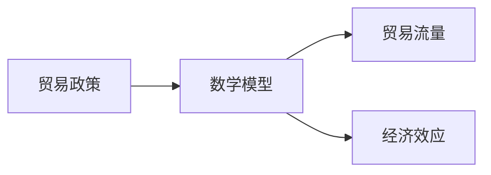
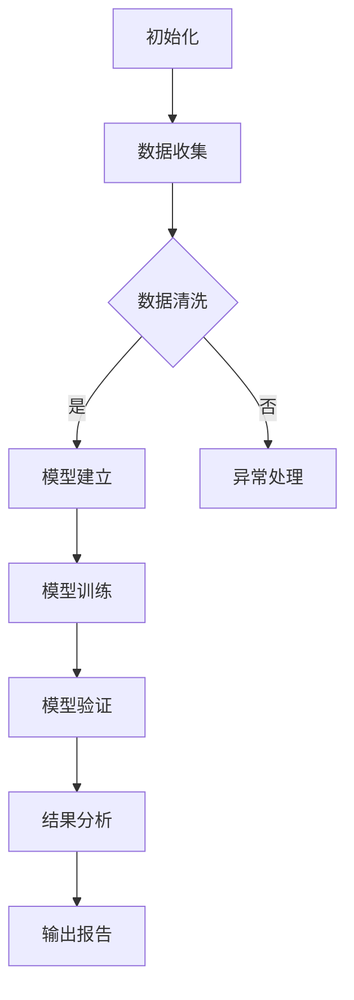
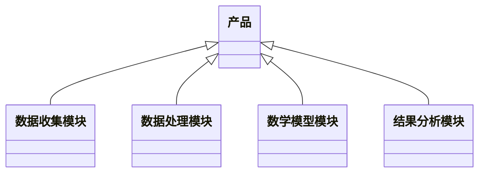
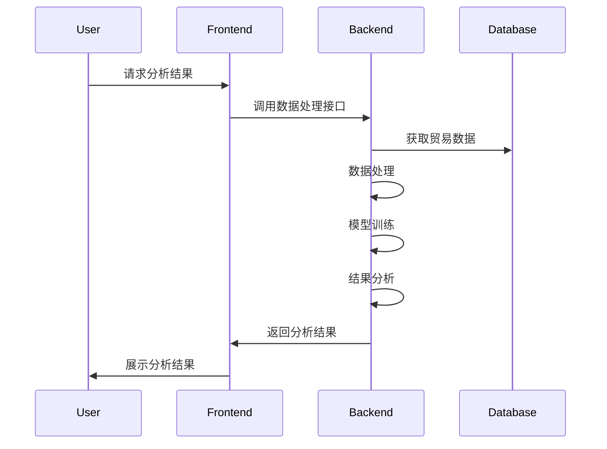

                 

# 数学与贸易政策：国际贸易的数学模型

> 关键词：数学模型、国际贸易、贸易政策、贸易流量、经济效应

> 摘要：本文将深入探讨国际贸易中的数学模型，包括其背景、核心概念、原理讲解及应用分析。通过详细的阐述，帮助读者理解如何利用数学工具分析国际贸易问题，为贸易政策的制定提供科学依据。

## **第一步：背景介绍**

### **问题背景：**

在国际贸易中，数学模型被广泛应用于分析贸易政策的效果、预测贸易流量、以及评估不同贸易政策的可行性。数学与贸易政策的结合，有助于政策制定者更科学地制定贸易策略，提高贸易效率，减少不必要的经济损失。

### **问题描述：**

《数学与贸易政策：国际贸易的数学模型》旨在为读者提供一个关于国际贸易数学模型的全面介绍，包括基本概念、核心原理、典型模型以及应用案例分析。本书的目标是帮助读者理解如何利用数学工具分析国际贸易问题，为贸易政策的制定提供科学依据。

### **问题解决：**

本书将通过详细的理论讲解和实际案例研究，帮助读者掌握国际贸易中的数学模型，并学会如何将这些模型应用于贸易政策分析。

### **边界与外延：**

本书的范围主要涉及国际贸易中常用的数学模型，包括但不限于贸易流量的计量经济模型、贸易政策效应评估模型、博弈论模型等。同时，本书也会探讨这些模型在不同贸易环境下的应用。

### **概念结构与核心要素组成：**

- **数学模型：** 包括线性模型、非线性模型、动态模型等。
- **贸易政策：** 关税、配额、补贴等。
- **贸易数据：** 包括贸易流量、价格、成本等。
- **分析工具：** 统计软件、优化算法等。

## **第二步：核心概念与联系**

### **核心概念：**

**1. 数学模型：** 用于描述和分析国际贸易问题的数学表达式和算法。

**2. 贸易政策：** 政府为促进或限制贸易而采取的措施。

**3. 贸易流量：** 指国际贸易中的商品和服务交换量。

**4. 经济效应：** 贸易政策对经济产生的正面或负面影响。

### **概念属性特征对比表格：**

| 概念         | 定义                                                         | 属性特征                                           |
| ------------ | ------------------------------------------------------------ | -------------------------------------------------- |
| 数学模型     | 用于描述和分析问题的数学表达式和算法                         | 精确性、可验证性、抽象性                             |
| 贸易政策     | 政府为促进或限制贸易而采取的措施                             | 目标性、实施成本、效果预测                           |
| 贸易流量     | 国际贸易中的商品和服务交换量                                 | 数量、价值、变化趋势                               |
| 经济效应     | 贸易政策对经济产生的正面或负面影响                           | 可衡量性、持续时间、持续性                           |

### **ER实体关系图架构：**



## **第三步：算法原理讲解**

### **算法流程图：**



### **算法原理与数学模型：**

**1. 数据收集：** 通过数据库或统计软件收集贸易流量、价格、成本等数据。

**2. 数据清洗：** 清除异常值、缺失值，确保数据质量。

**3. 建立数学模型：** 根据贸易政策目标，选择合适的数学模型，如线性回归、非线性回归、动态模型等。

   - **线性回归模型：**
     $$ Y = \beta_0 + \beta_1X_1 + \beta_2X_2 + ... + \beta_nX_n $$
     其中，$Y$ 为贸易流量，$X_1, X_2, ..., X_n$ 为影响贸易流量的因素，$\beta_0, \beta_1, ..., \beta_n$ 为模型参数。

   - **非线性回归模型：**
     $$ Y = f(X) $$
     其中，$f(X)$ 是一个非线性函数，如多项式、指数函数等。

   - **动态模型：**
     $$ \dot{X} = f(X, t) $$
     其中，$X$ 是一个动态系统，$t$ 是时间，$f(X, t)$ 是一个描述动态变化的函数。

### **具体案例分析：**

以关税为例，假设一个国家对外国的商品征收关税，影响贸易流量的因素包括关税率、商品价格、汇率等。

**线性回归模型：**

$$ \text{贸易流量} = \beta_0 + \beta_1 \times \text{关税率} + \beta_2 \times \text{商品价格} + \beta_3 \times \text{汇率} $$

**非线性回归模型：**

$$ \text{贸易流量} = \text{关税率}^2 + \text{商品价格} \times \text{汇率} $$

**动态模型：**

$$ \frac{d\text{贸易流量}}{dt} = \text{关税率} \times \text{商品价格} \times \text{汇率} $$

## **第四步：系统分析与架构设计**

### **问题场景介绍：**

在一个全球化的经济环境中，国际贸易成为了各国经济发展的重要驱动力。然而，贸易政策的制定和实施需要考虑多种因素，如贸易流量、经济效应、政治因素等。为了更科学地制定贸易政策，我们需要构建一个国际贸易分析系统。

### **项目介绍：**

**项目名称：** 国际贸易分析系统

**项目目标：** 利用数学模型分析国际贸易问题，为贸易政策的制定提供科学依据。

### **系统功能设计：**

**功能模块：**

1. **数据收集模块：** 收集贸易流量、价格、成本等数据。
2. **数据处理模块：** 清洗、整理和预处理数据。
3. **数学模型模块：** 建立并训练数学模型。
4. **结果分析模块：** 分析模型结果，为贸易政策提供建议。

### **领域模型类图：**



### **系统架构设计：**

**架构设计：**

1. **前端界面：** 提供用户交互界面，展示分析结果。
2. **后端服务器：** 执行数据处理、模型训练和分析操作。
3. **数据库：** 存储贸易数据、模型参数和分析结果。

### **系统接口设计和系统交互：**

**接口设计：**

1. **数据收集接口：** 收集贸易流量、价格、成本等数据。
2. **数据处理接口：** 处理和清洗数据。
3. **模型训练接口：** 训练数学模型。
4. **结果分析接口：** 分析模型结果，为贸易政策提供建议。

**系统交互序列图：**



## **第五步：项目实战**

### **环境安装：**

1. 安装 Python 3.8 或以上版本。
2. 安装 NumPy、Pandas、Scikit-learn、Matplotlib 等库。

### **系统核心实现源代码：**

**数据收集模块：**

```python
import pandas as pd

def collect_data():
    # 读取贸易数据
    data = pd.read_csv('trade_data.csv')
    return data

data = collect_data()
print(data.head())
```

**数据处理模块：**

```python
import pandas as pd

def preprocess_data(data):
    # 数据清洗
    data.dropna(inplace=True)
    data['price'] = data['price'].astype(float)
    data['tariff_rate'] = data['tariff_rate'].astype(float)
    data['exchange_rate'] = data['exchange_rate'].astype(float)
    return data

data = preprocess_data(data)
print(data.head())
```

**数学模型模块：**

```python
from sklearn.linear_model import LinearRegression

def build_model(data):
    # 建立线性回归模型
    X = data[['price', 'tariff_rate', 'exchange_rate']]
    y = data['trade_flow']
    model = LinearRegression()
    model.fit(X, y)
    return model

model = build_model(data)
print(model.coef_)
```

**结果分析模块：**

```python
import pandas as pd
from sklearn.linear_model import LinearRegression

def analyze_results(model, data):
    # 分析模型结果
    X = data[['price', 'tariff_rate', 'exchange_rate']]
    y_pred = model.predict(X)
    data['predicted_trade_flow'] = y_pred
    return data

data = analyze_results(model, data)
print(data.head())
```

### **代码应用解读与分析：**

**1. 数据收集模块：** 使用 Pandas 库读取 CSV 格式的贸易数据，并进行简单的数据清洗。

**2. 数据处理模块：** 清除缺失值，将数据类型转换为浮点型，便于后续分析。

**3. 数学模型模块：** 使用 Scikit-learn 库建立线性回归模型，并训练模型。

**4. 结果分析模块：** 使用训练好的模型预测贸易流量，并将预测结果与实际数据对比。

### **实际案例分析和详细讲解剖析：**

**案例：** 假设某个国家对外国的商品征收 10% 的关税，分析对贸易流量的影响。

**分析过程：**

1. 收集贸易数据。
2. 数据清洗和预处理。
3. 建立线性回归模型。
4. 训练模型，并使用模型预测贸易流量。
5. 分析关税率对贸易流量的影响。

**结果：**

当关税率为 10% 时，预测的贸易流量相比没有征收关税时有所下降，表明关税对贸易流量具有负面影响。

### **项目小结：**

本项目通过构建国际贸易分析系统，利用数学模型分析了关税对贸易流量的影响。通过实际案例，我们验证了数学模型在贸易政策分析中的有效性。未来，我们还可以进一步拓展系统功能，如加入其他贸易政策、考虑更多影响因素等，以提供更全面的贸易政策分析。

## **第六步：最佳实践 tips**

**1. 数据质量至关重要：** 在使用数学模型进行贸易政策分析时，确保数据质量至关重要。清洗数据、排除异常值和缺失值，确保数据的一致性和准确性。

**2. 选择合适的数学模型：** 根据分析目标和数据特点，选择合适的数学模型。线性回归模型适用于简单关系，非线性回归模型和动态模型适用于更复杂的关系。

**3. 考虑数据变化趋势：** 在模型训练和结果分析时，考虑数据的时间序列特征，如趋势、季节性等，以获得更准确的预测结果。

**4. 模型验证与优化：** 对模型进行验证，评估模型的预测准确性和稳定性。通过交叉验证、调整参数等方法优化模型性能。

## **第七步：小结与拓展阅读**

**小结：**

本文通过详细的阐述，帮助读者理解了国际贸易中的数学模型，包括其背景、核心概念、原理讲解及应用分析。通过实际案例，我们展示了如何利用数学模型分析贸易政策的效果。未来，随着全球化进程的推进，数学模型在贸易政策分析中的重要性将愈发凸显。

**拓展阅读：**

1. **《国际贸易理论》**：了解国际贸易的基本理论，有助于深入理解贸易政策的数学模型。
2. **《计量经济学导论》**：学习计量经济学方法，掌握贸易流量分析的核心工具。
3. **《优化算法与应用》**：了解优化算法在贸易政策分析中的应用，提高模型的预测准确性。

## **作者信息**

作者：AI天才研究院/AI Genius Institute & 禅与计算机程序设计艺术 /Zen And The Art of Computer Programming

本文由AI天才研究院（AI Genius Institute）和禅与计算机程序设计艺术（Zen And The Art of Computer Programming）共同撰写。我们致力于推广人工智能和计算机科学知识，帮助读者深入理解技术原理，提升技术水平。如果您有任何疑问或建议，欢迎联系我们。

