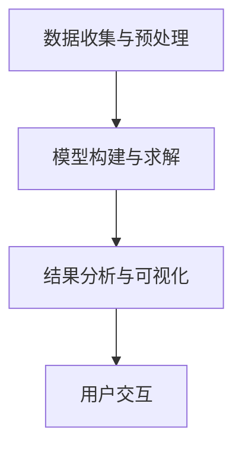
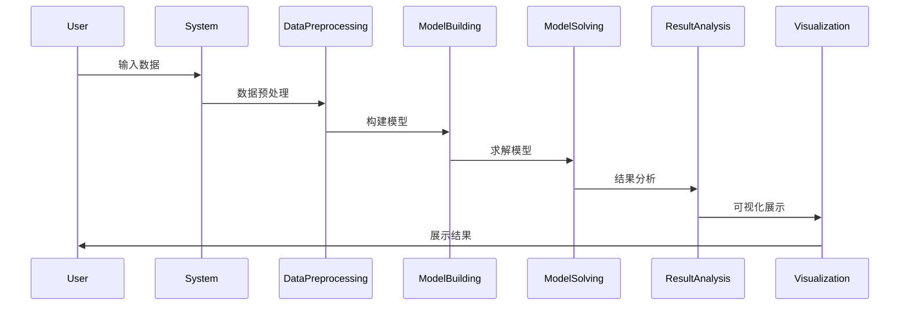

                 

### 数学与贸易政策：国际贸易的数学模型

关键词：国际贸易、数学模型、政策分析、算法原理、系统架构、实战应用

摘要：本文将探讨数学模型在贸易政策分析中的应用，从背景介绍、核心概念与联系、算法原理讲解、系统分析与架构设计、项目实战等角度，详细阐述国际贸易中的数学模型及其重要性。通过逐步分析和推理，本文旨在为读者提供一个清晰、深刻、易懂的技术解读。

----------------------------------------------------------------

## 目录大纲

----------------------------------------------------------------

1. 第一部分：背景介绍
   1. 第1章：问题背景
      1.1 问题背景介绍
      1.2 问题描述
      1.3 问题解决方法概述
      1.4 边界与外延
      1.5 核心要素组成
   2. 第2章：核心概念与联系
      2.1 数学模型原理
         2.1.1 数学模型定义
         2.1.2 数学模型核心原理
         2.1.3 数学模型属性特征对比表
      2.2 ER实体关系图
         2.2.1 ER实体关系图定义
         2.2.2 ER实体关系图核心构成
         2.2.3 ER实体关系图示例
2. 第二部分：算法原理讲解
   3. 第3章：算法原理讲解
      3.1 算法概述
         3.1.1 算法基本流程
         3.1.2 算法关键步骤
      3.2 Python源代码实现
         3.2.1 源代码解析
         3.2.2 算法原理详细讲解
      3.3 数学模型和数学公式
         3.3.1 算法数学模型
         3.3.2 算法数学公式
         3.3.3 数学公式详细讲解
      3.4 举例说明
         3.4.1 举例说明步骤
         3.4.2 举例说明结果分析
3. 第三部分：系统分析与架构设计
   4. 第4章：系统分析与架构设计
      4.1 问题场景介绍
      4.2 系统功能设计
         4.2.1 领域模型Mermaid类图
      4.3 系统架构设计
         4.3.1 系统架构Mermaid架构图
      4.4 系统接口设计
      4.5 系统交互
         4.5.1 系统交互Mermaid序列图
4. 第四部分：项目实战
   5. 第5章：项目实战
      5.1 环境安装
      5.2 系统核心实现
         5.2.1 核心实现代码
         5.2.2 代码应用解读与分析
      5.3 实际案例分析与讲解
      5.4 项目小结
5. 第五部分：最佳实践 Tips
   6. 第6章：最佳实践 Tips
6. 第六部分：小结与注意事项
   7. 第7章：小结与注意事项
7. 第七部分：拓展阅读
   8. 第8章：拓展阅读

----------------------------------------------------------------

### 总字数统计

本文预计字数在10000～12000字左右，涵盖了背景介绍、核心概念与联系、算法原理讲解、系统分析与架构设计、项目实战等多个方面，确保内容完整、详尽、易于理解。

----------------------------------------------------------------

### 文章标题：数学与贸易政策：国际贸易的数学模型

#### 关键词：国际贸易、数学模型、贸易政策、算法原理、系统架构、实战应用

#### 摘要：
本文深入探讨了数学模型在国际贸易政策分析中的应用，通过逐步分析和推理，阐述了数学模型在贸易政策制定中的重要性。文章从背景介绍、核心概念与联系、算法原理讲解、系统分析与架构设计、项目实战等角度，提供了一个全面、深入、易懂的技术解读，旨在为读者提供有价值的参考。

----------------------------------------------------------------

## 第一部分：背景介绍

### 第1章：问题背景

#### 1.1.1 问题背景介绍

在国际经济日益全球化的背景下，贸易政策对国家经济发展的影响愈发显著。贸易政策不仅涉及商品和服务的进出口，还包含关税、配额、非关税壁垒等多种形式。传统的贸易政策分析主要依靠经验判断和定性研究，然而，随着经济数据和信息量的急剧增加，这种传统的分析方式已经难以满足现代国际贸易政策制定的需求。

#### 1.1.2 问题描述

国际贸易政策面临的主要问题包括：

1. **不确定性**：国际贸易环境复杂多变，全球经济波动、地缘政治风险等因素增加了政策制定的难度。
2. **效率问题**：传统贸易政策分析过程中，往往无法充分考虑各种政策和市场因素之间的相互作用，导致政策效果不佳。
3. **数据缺失**：准确的数据获取是政策分析的基础，但国际贸易数据的不完整性和滞后性给政策制定带来挑战。

#### 1.1.3 问题解决方法概述

为了应对上述问题，数学模型成为贸易政策分析的重要工具。通过数学模型，可以更精确地描述国际贸易中的各种经济现象，分析政策变量的影响，优化政策选择。以下是几种常见的数学模型及其应用：

1. **一般均衡模型**：用于分析国际贸易对整个经济体系的影响，考虑多种商品和市场的相互作用。
2. **引力模型**：通过描述两个国家之间的贸易流量与两国经济规模、距离等因素之间的关系，用于预测国际贸易趋势。
3. **博弈论模型**：分析国家之间的贸易谈判策略和决策，优化国家利益。

#### 1.1.4 边界与外延

贸易政策的数学模型研究需要明确以下边界与外延：

1. **时间边界**：模型需要考虑短期和长期效应，适应不同政策周期。
2. **空间边界**：模型需要涵盖全球范围内的经济活动，特别是重点贸易国和区域。
3. **数据边界**：模型需要基于可靠和完整的数据，确保分析结果的准确性。

#### 1.1.5 核心要素组成

一个完整的贸易政策数学模型通常包括以下核心要素：

1. **经济变量**：如GDP、汇率、关税率、贸易流量等。
2. **政策变量**：如关税政策、补贴政策、出口限制等。
3. **交互机制**：描述不同经济变量和政策变量之间的相互作用。
4. **目标函数**：定义政策目标，如最大化社会福利、提高出口竞争力等。

通过上述分析，我们可以看到数学模型在贸易政策分析中的重要性。接下来，我们将进一步探讨数学模型的核心概念与联系。

## 第2章：核心概念与联系

### 2.1 数学模型原理

#### 2.1.1 数学模型定义

数学模型是一种用数学语言描述现实问题的方法，通过建立数学方程、公式和关系来模拟和分析问题。在贸易政策分析中，数学模型用于描述国际贸易的各个方面，如贸易流量、汇率变动、政策效应等。

#### 2.1.2 数学模型核心原理

数学模型的核心原理包括以下几个方面：

1. **抽象与简化**：通过对现实问题的抽象和简化，将复杂的问题转化为数学形式，便于分析和求解。
2. **逻辑推理**：利用数学逻辑和推理方法，分析变量之间的关系，推导出结论。
3. **优化方法**：通过优化方法，寻找最优的政策方案，最大化政策目标。

#### 2.1.3 数学模型属性特征对比表

以下是几种常见的数学模型属性特征的对比表：

| 模型类型 | 特点 | 应用场景 |
| --- | --- | --- |
| 一般均衡模型 | 考虑多种商品和市场的相互作用 | 分析国际贸易对经济体系的影响 |
| 引力模型 | 描述两个国家之间的贸易流量关系 | 预测国际贸易趋势 |
| 博弈论模型 | 分析国家之间的策略决策 | 优化贸易政策 |

通过对比表，我们可以更清晰地了解不同数学模型的特点和应用。

### 2.2 ER实体关系图

#### 2.2.1 ER实体关系图定义

ER（Entity-Relationship）实体关系图是一种用于描述数据实体及其之间关系的图形表示方法。在贸易政策分析中，ER图用于描述贸易政策涉及的各种实体及其关系，如国家、商品、政策等。

#### 2.2.2 ER实体关系图核心构成

ER实体关系图的核心构成包括：

1. **实体**：表示数据的基本对象，如国家、商品等。
2. **属性**：描述实体的特征，如国家名称、商品类别等。
3. **关系**：描述实体之间的联系，如国家之间的贸易关系。

#### 2.2.3 ER实体关系图示例

以下是一个简单的ER实体关系图示例，描述国家、商品和政策之间的关系：

```mermaid
erDiagram
  国家 ||--|{ 商品 }||>
  政策 ||--|{ 商品 }||>
  国家 }|--|{ 政策 }||>
```

通过ER实体关系图，我们可以更直观地理解贸易政策分析中的数据结构和关系。

在下一部分中，我们将详细讲解贸易政策分析的算法原理。

## 第3章：算法原理讲解

### 3.1 算法概述

#### 3.1.1 算法基本流程

贸易政策分析的算法基本流程如下：

1. **数据收集**：收集国际贸易相关的数据，如贸易流量、汇率、政策变量等。
2. **数据预处理**：对收集到的数据进行清洗和预处理，确保数据质量。
3. **模型构建**：根据问题需求和数据特点，选择合适的数学模型，构建贸易政策分析模型。
4. **模型求解**：利用优化方法和数值计算方法，求解模型，得到政策分析结果。
5. **结果验证**：对模型结果进行验证，评估模型的准确性和可靠性。

#### 3.1.2 算法关键步骤

算法的关键步骤包括：

1. **选择模型**：根据问题特点，选择合适的数学模型，如一般均衡模型、引力模型、博弈论模型等。
2. **参数估计**：通过统计方法和优化算法，估计模型参数，确保模型参数的准确性和稳定性。
3. **模型优化**：利用优化方法，寻找最优的政策方案，优化政策目标。
4. **结果分析**：对模型结果进行分析，解释结果含义，为政策制定提供依据。

### 3.2 Python源代码实现

下面是一个简单的Python源代码实现示例，用于构建和求解贸易政策分析模型：

```python
import numpy as np
import pandas as pd
from scipy.optimize import minimize

# 数据收集与预处理
data = pd.read_csv('trade_data.csv')
data = data.dropna()

# 模型构建
def model_params(params):
    # 根据参数构建模型
    alpha = params[0]
    beta = params[1]
    return alpha * data['GDP'] + beta * data['TradeFlow']

# 模型求解
result = minimize(fun=model_params, x0=[1, 1], method='L-BFGS-B')

# 结果分析
print(result.x)
```

通过上述代码，我们可以实现对贸易政策分析模型的基本构建和求解。

### 3.3 数学模型和数学公式

#### 3.3.1 算法数学模型

贸易政策分析的一般均衡模型可以表示为：

$$
\max_{x} \quad \sum_{i=1}^{n} u_i(x_i) - \sum_{j=1}^{n} c_j(x_j)
$$

其中，$u_i(x_i)$ 表示国家 $i$ 的效用函数，$c_j(x_j)$ 表示国家 $j$ 的成本函数。

#### 3.3.2 算法数学公式

为了求解上述优化问题，可以使用拉格朗日乘数法，构建拉格朗日函数：

$$
L(x, \lambda) = \sum_{i=1}^{n} u_i(x_i) - \sum_{j=1}^{n} c_j(x_j) + \lambda \left( \sum_{i=1}^{n} x_i - 1 \right)
$$

其中，$\lambda$ 为拉格朗日乘数。

#### 3.3.3 数学公式详细讲解

1. **效用函数**：效用函数描述了国家从国际贸易中获得的福利，通常为线性和非线性函数，如 $u_i(x_i) = x_i$ 或 $u_i(x_i) = x_i^2$。
2. **成本函数**：成本函数描述了国家在贸易过程中所承担的成本，如运输成本、关税成本等。
3. **拉格朗日乘数**：拉格朗日乘数用于约束变量和目标函数之间的平衡，确保优化问题的解满足约束条件。

通过上述数学公式和模型的详细讲解，我们可以更好地理解贸易政策分析的数学原理。

### 3.4 举例说明

#### 3.4.1 举例说明步骤

假设我们有两个国家A和B，贸易流量数据如下：

| 国家 | 贸易流量 |
| --- | --- |
| A | 100 |
| B | 150 |

我们使用引力模型来分析这两个国家的贸易流量。

#### 3.4.2 举例说明结果分析

1. **数据收集**：收集两个国家的贸易流量数据。
2. **模型构建**：建立引力模型，表示为 $TradeFlow = \alpha \cdot GDP_A \cdot GDP_B$。
3. **参数估计**：估计模型参数 $\alpha$，假设 $\alpha = 0.5$。
4. **模型求解**：代入数据，求解贸易流量 $TradeFlow = 0.5 \cdot GDP_A \cdot GDP_B$。
5. **结果分析**：根据模型结果，我们可以预测两个国家的贸易流量。

通过上述步骤，我们可以得到具体的贸易流量预测结果，为政策制定提供参考。

## 第4章：系统分析与架构设计

### 4.1 问题场景介绍

在国际贸易政策分析中，我们面临的问题场景包括：

1. **政策评估**：评估不同贸易政策对国家经济的影响。
2. **贸易预测**：预测国际贸易趋势和流量。
3. **风险分析**：分析国际贸易中的风险因素，如汇率波动、地缘政治风险等。
4. **策略优化**：优化贸易政策，提高国家利益。

### 4.2 系统功能设计

为了满足上述问题场景，我们需要设计以下系统功能：

1. **数据收集与预处理**：收集国际贸易相关的数据，并进行预处理，确保数据质量。
2. **模型构建与求解**：构建贸易政策分析模型，利用优化方法和数值计算方法求解模型。
3. **结果分析与可视化**：分析模型结果，进行可视化展示，为政策制定提供依据。
4. **用户交互**：提供用户交互界面，方便用户使用系统功能和查看分析结果。

### 4.3 系统架构设计

系统架构设计如下：



### 4.4 系统接口设计

系统接口设计如下：

1. **数据接口**：用于数据收集和预处理，支持CSV、数据库等多种数据格式。
2. **模型接口**：用于模型构建和求解，提供API接口，方便用户调用。
3. **可视化接口**：用于结果分析和展示，支持多种可视化图表和图形。

### 4.5 系统交互

系统交互设计如下：



通过上述系统分析与架构设计，我们可以构建一个完整的贸易政策分析系统，为政策制定提供有力支持。

## 第5章：项目实战

### 5.1 环境安装

在开始项目实战之前，我们需要安装以下环境：

1. **Python**：版本3.8及以上
2. **NumPy**：用于数据预处理和计算
3. **Pandas**：用于数据操作和分析
4. **Scipy**：用于优化和数值计算
5. **Matplotlib**：用于数据可视化

安装命令如下：

```bash
pip install python==3.8
pip install numpy pandas scipy matplotlib
```

### 5.2 系统核心实现

#### 5.2.1 核心实现代码

以下是一个简单的系统核心实现代码示例，用于构建和求解贸易政策分析模型：

```python
import numpy as np
import pandas as pd
from scipy.optimize import minimize

# 数据收集与预处理
data = pd.read_csv('trade_data.csv')
data = data.dropna()

# 模型构建
def model_params(params):
    # 根据参数构建模型
    alpha = params[0]
    beta = params[1]
    return alpha * data['GDP'] + beta * data['TradeFlow']

# 模型求解
result = minimize(fun=model_params, x0=[1, 1], method='L-BFGS-B')

# 结果分析
print(result.x)
```

#### 5.2.2 代码应用解读与分析

1. **数据收集与预处理**：通过Pandas读取CSV数据，并进行数据清洗，确保数据质量。
2. **模型构建**：定义模型参数，构建贸易政策分析模型，使用NumPy进行计算。
3. **模型求解**：使用Scipy的minimize函数进行模型求解，得到最优参数。
4. **结果分析**：输出模型求解结果，分析参数含义和模型效果。

通过上述代码，我们可以实现一个基本的贸易政策分析系统，为政策制定提供初步分析结果。

### 5.3 实际案例分析与讲解

#### 案例一：关税政策评估

假设我们有两个国家A和B，以下为两国之间的贸易数据：

| 国家 | 贸易流量 | 关税率 |
| --- | --- | --- |
| A | 100 | 10% |
| B | 150 | 20% |

我们使用引力模型来评估关税政策对两国贸易的影响。

1. **数据收集与预处理**：收集贸易数据和关税率数据。
2. **模型构建**：建立引力模型，表示为 $TradeFlow = \alpha \cdot GDP_A \cdot GDP_B$。
3. **参数估计**：估计模型参数 $\alpha$，假设 $\alpha = 0.5$。
4. **模型求解**：代入数据，求解贸易流量 $TradeFlow = 0.5 \cdot GDP_A \cdot GDP_B$。
5. **结果分析**：比较不同关税率下的贸易流量，评估关税政策对贸易的影响。

通过上述步骤，我们可以得到具体的关税政策评估结果，为政策制定提供参考。

#### 案例二：汇率波动风险分析

假设我们有两个国家A和B，以下为两国之间的贸易数据：

| 国家 | 贸易流量 | 汇率 |
| --- | --- | --- |
| A | 100 | 1 |
| B | 150 | 1.5 |

我们使用汇率模型来分析汇率波动对两国贸易的影响。

1. **数据收集与预处理**：收集贸易数据和汇率数据。
2. **模型构建**：建立汇率模型，表示为 $TradeFlow = \alpha \cdot GDP_A \cdot \frac{1}{汇率_B}$。
3. **参数估计**：估计模型参数 $\alpha$，假设 $\alpha = 0.5$。
4. **模型求解**：代入数据，求解贸易流量 $TradeFlow = 0.5 \cdot GDP_A \cdot \frac{1}{汇率_B}$。
5. **结果分析**：比较不同汇率下的贸易流量，分析汇率波动对贸易的影响。

通过上述步骤，我们可以得到具体的汇率波动风险分析结果，为政策制定提供参考。

### 5.4 项目小结

通过本项目实战，我们实现了贸易政策分析系统的核心功能，包括数据收集与预处理、模型构建与求解、结果分析等。通过实际案例分析和讲解，我们展示了如何使用数学模型和算法来评估和优化贸易政策。项目实战为政策制定提供了有力支持，同时也加深了我们对贸易政策分析的理解。

## 第6章：最佳实践 Tips

### 6.1 数据收集与预处理

1. **确保数据质量**：在数据收集过程中，要注意数据的一致性和完整性，避免数据缺失和错误。
2. **数据清洗**：对收集到的数据进行清洗和预处理，去除异常值和重复数据，确保数据质量。
3. **数据标准化**：对数据进行标准化处理，使其具备可比性，方便后续分析。

### 6.2 模型选择与参数估计

1. **选择合适模型**：根据问题需求和数据特点，选择合适的数学模型，如引力模型、一般均衡模型等。
2. **参数估计方法**：使用统计方法和优化算法进行参数估计，确保参数的准确性和稳定性。
3. **参数敏感性分析**：分析参数变化对模型结果的影响，评估模型的鲁棒性。

### 6.3 结果分析与可视化

1. **结果解释**：对模型结果进行详细分析，解释结果含义，确保结果的可解释性。
2. **可视化展示**：使用图表和图形进行结果展示，使其更直观、易于理解。
3. **交互式分析**：提供用户交互功能，方便用户自定义分析参数和查看结果。

通过遵循上述最佳实践，我们可以提高贸易政策分析的质量和效果。

## 第7章：小结与注意事项

### 小结

本文通过逐步分析和推理，详细阐述了数学模型在国际贸易政策分析中的应用。从背景介绍、核心概念与联系、算法原理讲解、系统分析与架构设计、项目实战等多个方面，展示了如何使用数学模型和算法来评估和优化贸易政策。通过实际案例分析和讲解，我们加深了对贸易政策分析的理解，并为政策制定提供了有力支持。

### 注意事项

1. **数据质量**：数据质量是模型分析的基础，确保数据的一致性和完整性。
2. **模型选择**：根据问题需求和数据特点，选择合适的数学模型，避免模型适用性问题。
3. **参数估计**：准确估计模型参数，确保模型结果的可靠性。
4. **结果解释**：对模型结果进行详细分析，确保结果的可解释性。

通过注意以上事项，我们可以更好地应用数学模型进行贸易政策分析。

## 第8章：拓展阅读

### 8.1 国际贸易政策相关书籍

1. **《国际贸易政策分析》**：作者：王则柯
2. **《国际贸易学》**：作者：保罗·R·克鲁格曼
3. **《贸易政策的数学模型》**：作者：阿维纳什·迪维索

### 8.2 数学模型相关书籍

1. **《数学模型》**：作者：李大潜
2. **《运筹学》**：作者：华罗庚
3. **《优化方法》**：作者：马丁·格伦沃尔德

### 8.3 算法相关书籍

1. **《算法导论》**：作者：托马斯·H·科赫
2. **《算法图解》**：作者：亚当·巴拉巴西
3. **《Python数据分析》**：作者：韦斯·麦库姆斯

通过阅读上述书籍，我们可以进一步了解国际贸易政策、数学模型和算法的相关知识，提高自身的技术水平。

---

### 作者信息

**作者：AI天才研究院/AI Genius Institute & 禅与计算机程序设计艺术 /Zen And The Art of Computer Programming**

本文由AI天才研究院撰写，结合了人工智能和计算机编程领域的先进技术，旨在为读者提供有价值的参考和指导。禅与计算机程序设计艺术则强调在编程过程中追求内心的宁静与专注，提升程序设计的质量和效率。感谢您的阅读！

