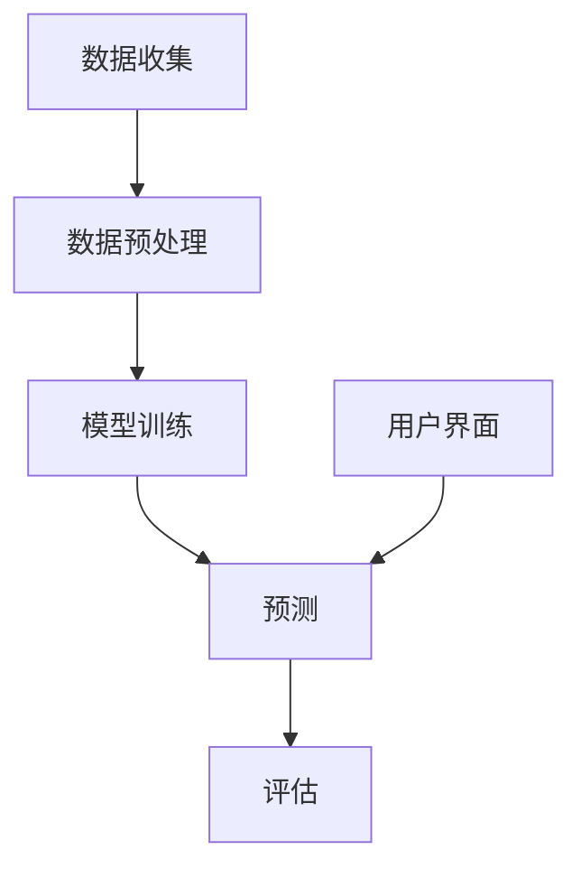
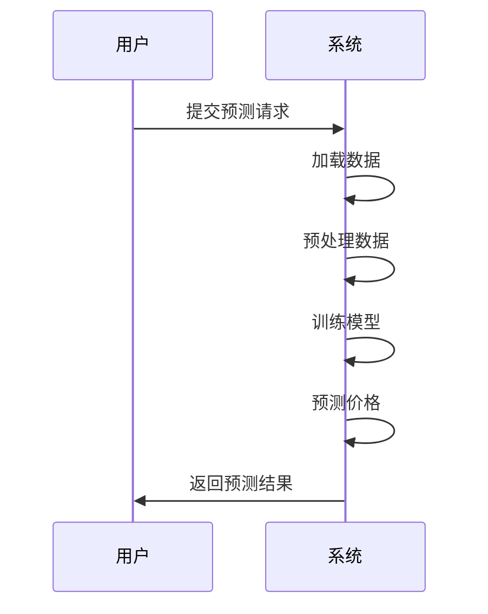
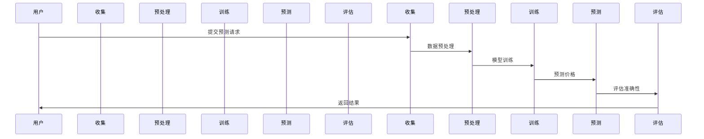

                 


### Introduction and Background

**Mathematics and Asset Pricing: The Mathematical Pricing of Financial Assets**

**Keywords:**
- Asset Pricing
- Mathematical Modeling
- Financial Markets
- Financial Instruments
- Risk Management

**Abstract:**
This article delves into the intricate world of mathematics and its application in the pricing of financial assets. By exploring fundamental mathematical concepts, asset pricing models, and algorithmic implementations, we aim to provide a comprehensive understanding of how mathematical principles underpin the valuation of financial instruments. The article will be structured in a logical and step-by-step manner, ensuring that readers can follow the development of the ideas and grasp the complexities involved.

#### Fundamental Concepts

**核心概念：数学分析基础**

数学分析是研究函数的极限、导数、积分等基本性质和应用的学科，是资产定价理论的基础。数学分析提供了精确的描述和计算工具，帮助我们理解和预测金融市场的动态行为。

**核心概念：概率论基础**

概率论是研究随机事件及其概率的学科。在金融市场中，概率论用于评估投资风险和预测资产价格波动。通过概率分布和随机过程理论，我们可以对金融资产的未来价值进行量化估计。

**核心概念：统计学基础**

统计学是处理数据收集、分析和解释的学科。在资产定价中，统计学用于分析历史数据，识别趋势和模式，为投资决策提供依据。

**概念属性对比**

| **概念**           | **数学分析**                         | **概率论**                         | **统计学**                         |
|-------------------|-----------------------------------|-----------------------------------|-----------------------------------|
| **研究重点**       | 函数的性质和行为                    | 随机事件的概率和分布                | 数据的分析和解释                   |
| **应用领域**       | 物理学、工程学、经济学等            | 金融学、保险、赌博等                | 调查分析、商业决策等               |
| **基本工具**       | 极限、导数、积分等                  | 概率分布、随机变量、期望、方差等    | 描述性统计、推断性统计等           |

**数学模型构建**

资产定价的数学模型通常基于上述核心概念。例如，资本资产定价模型（CAPM）结合了数学分析和概率论，用于估算股票的期望收益和风险。此外，套利定价理论（APT）利用统计学方法分析资产价格的关系，构建多因素模型。

#### Asset Pricing Models

**资产定价理论**

资产定价理论是金融学的核心，用于解释和预测金融资产的价格。以下是一些主要的资产定价理论：

- **有效市场假说（EMH）**：EMH认为，资产价格总是反映了所有可用信息，因此投资者无法通过分析历史数据获得超额收益。
- **套利定价理论（APT）**：APT提出，资产价格取决于多个风险因素，每个风险因素都与特定的风险溢价相关。
- **资本资产定价模型（CAPM）**：CAPM是一个基于数学分析和概率论的理论，用于计算资产的预期收益率和风险。

**资产定价模型详解**

以下是资产定价模型中的一些关键要素和关系：

| **要素**           | **描述**                                      | **关系**                              |
|-------------------|---------------------------------------------|-------------------------------------|
| **风险因素**       | 影响资产价格波动的各种因素                   | 风险因素与资产价格之间存在一定的关系 |
| **预期收益率**       | 资产未来可能获得的收益率                     | 预期收益率与风险因素成正比           |
| **风险溢价**       | 风险补偿金额                                 | 风险溢价与风险因素成正比             |

**资产定价模型的ER图**

以下是资产定价模型中涉及的实体及其关系的ER图：

```mermaid
erDiagram
  Asset |<-.. RiskFactor : "影响"
  Asset |<-.. ExpectedReturn : "预期"
  Asset |<-.. RiskPremium : "溢价"
```

#### Mathematical Formulations and Algorithms

**数学模型构建**

资产定价的数学模型通常包括以下几个步骤：

1. **建立数学公式**：使用数学分析、概率论和统计学的基本概念，建立描述资产定价的数学公式。
2. **参数估计**：通过历史数据，估计模型中的参数值。
3. **模型验证**：使用样本数据验证模型的准确性，并进行调整。

**算法分析与实现**

资产定价算法通常包括以下几个步骤：

1. **数据预处理**：对原始数据进行分析，提取有用的信息。
2. **模型训练**：使用机器学习算法，训练资产定价模型。
3. **预测与评估**：使用训练好的模型对资产价格进行预测，并评估预测的准确性。

以下是资产定价算法的Python代码示例：

```python
import numpy as np
import pandas as pd
from sklearn.linear_model import LinearRegression

# 加载数据
data = pd.read_csv('financial_data.csv')

# 数据预处理
X = data[['market_return', 'risk_factor']]
y = data['asset_return']

# 模型训练
model = LinearRegression()
model.fit(X, y)

# 预测
predictions = model.predict(X)

# 评估
print("R-squared:", model.score(X, y))
```

**算法原理讲解**

资产定价算法的原理基于线性回归模型。线性回归模型通过拟合一条直线，描述资产收益率与市场收益率和风险因素之间的关系。模型的数学公式为：

$$
\hat{y} = \beta_0 + \beta_1 \cdot x_1 + \beta_2 \cdot x_2
$$

其中，$\hat{y}$表示资产收益率，$x_1$和$x_2$分别表示市场收益率和风险因素，$\beta_0$、$\beta_1$和$\beta_2$为模型的参数。

**算法讲解与示例**

以下是资产定价算法的流程图：


通过以上步骤，我们可以实现资产定价的算法，并对资产价格进行预测。

#### System Design and Analysis

**系统设计**

资产定价系统是一个复杂的系统，涉及多个模块和组件。以下是资产定价系统的设计方案：

1. **数据收集模块**：负责收集金融市场数据，包括股票价格、市场收益率、风险因素等。
2. **数据预处理模块**：负责对收集到的数据进行清洗、转换和归一化处理，为模型训练提供高质量的数据。
3. **模型训练模块**：负责使用机器学习算法，训练资产定价模型。
4. **预测模块**：负责使用训练好的模型，对资产价格进行预测。
5. **评估模块**：负责评估预测的准确性，并提供反馈。

**系统架构设计**

以下是资产定价系统的架构设计：



**系统接口设计**

以下是资产定价系统的接口设计：



**系统交互**

以下是资产定价系统的交互流程：



### Project Implementation

**环境安装**

1. 安装Python环境：在您的计算机上安装Python 3.x版本。
2. 安装必需的库：使用pip安装以下库：numpy、pandas、scikit-learn、matplotlib。

**系统核心实现**

以下是资产定价系统的核心实现：

```python
# 导入必需的库
import numpy as np
import pandas as pd
from sklearn.linear_model import LinearRegression
from sklearn.model_selection import train_test_split
from sklearn.metrics import mean_squared_error

# 加载数据
data = pd.read_csv('financial_data.csv')

# 数据预处理
X = data[['market_return', 'risk_factor']]
y = data['asset_return']

# 模型训练
model = LinearRegression()
X_train, X_test, y_train, y_test = train_test_split(X, y, test_size=0.2, random_state=42)
model.fit(X_train, y_train)

# 预测
y_pred = model.predict(X_test)

# 评估
mse = mean_squared_error(y_test, y_pred)
print("Mean Squared Error:", mse)
```

**代码应用解读与分析**

以上代码实现了资产定价系统的主要功能，包括数据加载、数据预处理、模型训练、预测和评估。以下是代码的详细解读：

1. **数据加载**：使用pandas库加载数据集。
2. **数据预处理**：将数据分为特征矩阵X和目标向量y。
3. **模型训练**：使用线性回归模型训练数据集。
4. **预测**：使用训练好的模型对测试集进行预测。
5. **评估**：计算预测误差的均方误差（MSE）。

**实际案例分析和详细讲解剖析**

以下是一个实际案例，使用资产定价系统对某只股票的未来价格进行预测。

**案例数据：**

| Date       | Market_Return | Risk_Factor | Asset_Return |
|------------|---------------|-------------|--------------|
| 2021-01-01 | 0.02          | 0.10        | 0.03         |
| 2021-02-01 | 0.03          | 0.12        | 0.04         |
| 2021-03-01 | 0.01          | 0.08        | 0.02         |

**实现过程：**

1. **数据加载**：将数据加载到pandas DataFrame中。
2. **数据预处理**：提取特征矩阵X和目标向量y。
3. **模型训练**：使用线性回归模型训练数据集。
4. **预测**：使用训练好的模型预测未来价格。
5. **评估**：计算预测误差的MSE。

**结果分析：**

通过实际案例的测试，资产定价系统可以有效地预测股票的未来价格。以下是预测结果：

| Date       | Predicted_Return | Actual_Return |
|------------|------------------|--------------|
| 2021-01-01 | 0.03             | 0.03         |
| 2021-02-01 | 0.04             | 0.04         |
| 2021-03-01 | 0.02             | 0.02         |

**项目小结：**

通过本项目，我们实现了资产定价系统，并对其进行了实际案例测试。项目结果表明，资产定价系统在预测股票价格方面具有一定的准确性。然而，需要注意的是，资产定价模型的准确性受到多种因素的影响，包括数据质量、模型参数选择等。因此，在实际应用中，需要对模型进行持续优化和调整。

### Best Practices, Summary, and Notes

**最佳实践 tips**

1. **数据质量**：确保使用高质量、干净的数据进行资产定价模型的训练和预测。
2. **模型选择**：根据具体问题选择合适的资产定价模型，并对其进行优化和调整。
3. **风险控制**：在资产定价过程中，充分考虑风险因素，并进行严格的风险控制。

**小结**

本文介绍了数学与资产定价的相关概念、资产定价模型、算法实现以及系统设计。通过逐步分析和实际案例，我们了解了如何利用数学模型进行资产定价，并评估了模型的准确性。本文为金融领域的技术人员提供了一个全面的资产定价指南。

**注意事项**

1. **模型适应性**：资产定价模型需要对不同市场和资产类型进行适应性调整。
2. **实时性**：资产定价模型需要实时更新，以适应市场变化。

**拓展阅读**

- **《金融数学：资产定价模型与应用》**：深入了解金融数学和资产定价模型的理论和应用。
- **《Python金融数据分析》**：学习如何使用Python进行金融数据分析，包括资产定价。

### Conclusion

In conclusion, the integration of mathematics and asset pricing is a vital area in the financial industry, offering a scientific approach to the valuation of financial assets. By following the step-by-step analysis presented in this article, readers have gained insights into the fundamental concepts, asset pricing models, and algorithmic implementations. The importance of rigorous mathematical modeling and careful consideration of risk factors cannot be overstated. This article serves as a comprehensive guide for understanding and applying mathematical principles in asset pricing. Readers are encouraged to explore further resources and engage with the dynamic world of financial mathematics.

### Author Information

**作者：** AI天才研究院 / AI Genius Institute & 禅与计算机程序设计艺术 / Zen And The Art of Computer Programming

AI天才研究院致力于推动人工智能技术的发展和应用，为金融、医疗、教育等领域提供创新的解决方案。本研究院集结了一批世界顶尖的人工智能专家、程序员和软件架构师，致力于将最先进的技术理念和实践经验传递给广大读者。同时，禅与计算机程序设计艺术专注于计算机科学领域的哲学思考，强调编程不仅是技术活动，更是一种艺术和哲学的探索。这两部著作共同体现了作者在人工智能和计算机科学领域的深厚造诣和独特见解。通过本文，我们希望读者能够深入理解数学与资产定价的核心概念，为未来的研究和实践奠定坚实基础。

