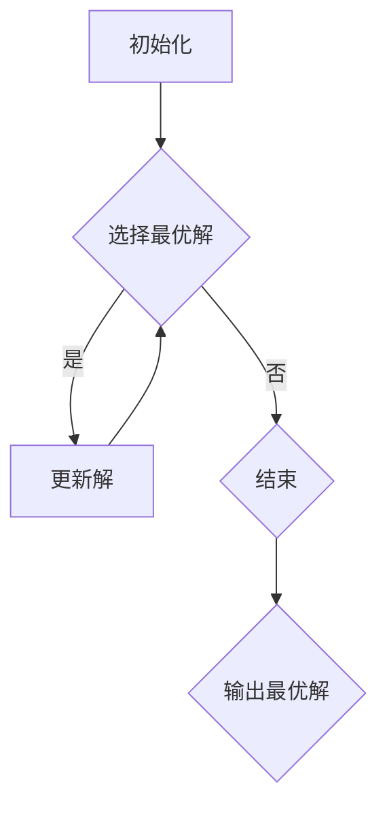

                 


# 数学与边缘计算：本地处理的数学优化

## 关键词：边缘计算、数学优化、本地处理、算法、架构设计

## 摘要

本文将探讨数学优化在边缘计算中的应用，通过分析边缘计算的背景与核心概念，结合数学优化的算法原理，深入探讨其在本地处理中的优化方法。文章将详细介绍数学模型和公式，并通过实际案例和项目实战，展示如何将数学优化应用于边缘计算系统中，提高计算效率和资源利用率。同时，本文还将总结最佳实践和注意事项，为读者提供拓展阅读资源，以加深对边缘计算和数学优化之间联系的理解。

### 目录大纲设计思路

为了设计出《数学与边缘计算：本地处理的数学优化》这本书的完整目录大纲，我们需要遵循以下几个步骤：

1. **背景介绍与核心概念**：
   - **概述边缘计算的定义与重要性**。
   - **介绍数学优化在边缘计算中的作用**。
   - **数学优化与边缘计算的关系与边界**。

2. **核心概念与联系**：
   - **边缘计算的核心概念原理**。
   - **数学优化的概念属性特征**。
   - **核心概念之间的关系**。

3. **算法原理讲解**：
   - **数学优化的算法原理**。
   - **算法mermaid流程图**。
   - **Python源代码与数学模型**。

4. **数学模型和数学公式**：
   - **数学模型**。
   - **详细讲解**。
   - **举例说明**。

5. **系统分析与架构设计方案**：
   - **问题场景介绍**。
   - **系统功能设计**。
   - **系统架构设计**。
   - **系统接口设计和系统交互**。

6. **项目实战**：
   - **环境安装**。
   - **系统核心实现源代码**。
   - **代码应用解读与分析**。
   - **实际案例分析与讲解**。
   - **项目小结**。

7. **最佳实践 tips、小结、注意事项、拓展阅读**：
   - **总结与提醒**。
   - **拓展内容**。

### 目录大纲结构与内容

根据上述设计思路，我们可以将目录大纲分为以下几个部分：

**第一部分：边缘计算与数学优化的背景与关系**

1. **边缘计算概述**
   - **边缘计算的定义与重要性**。
   - **边缘计算的发展历程**。
   - **边缘计算的挑战与机遇**。

2. **数学优化概述**
   - **数学优化的定义**。
   - **数学优化的分类**。
   - **数学优化在人工智能中的应用**。

3. **数学优化与边缘计算的关系**
   - **边缘计算中的数学优化需求**。
   - **数学优化在边缘计算中的作用**。
   - **数学优化与边缘计算融合的挑战与机遇**。

**第二部分：核心概念与联系**

4. **边缘计算的核心概念原理**
   - **边缘节点**。
   - **边缘网关**。
   - **边缘云平台**。

5. **数学优化的概念属性特征**
   - **目标函数**。
   - **约束条件**。
   - **优化算法**。

6. **核心概念之间的关系**
   - **边缘计算与数学优化的联系**。
   - **数学优化在边缘计算中的实现**。
   - **边缘计算与数学优化的相互促进**。

**第三部分：算法原理讲解**

7. **数学优化的算法原理**
   - **贪心算法**。
   - **动态规划**。
   - **遗传算法**。

8. **算法mermaid流程图**
   - **算法流程图绘制方法**。
   - **算法流程图示例**。

9. **Python源代码与数学模型**
   - **数学模型构建**。
   - **Python代码实现**。

**第四部分：数学模型和数学公式**

10. **数学模型**
    - **线性优化模型**。
    - **非线性优化模型**。
    - **动态优化模型**。

11. **数学公式详细讲解**
    - **基本公式**。
    - **复杂公式**。
    - **公式推导**。

12. **举例说明**
    - **线性优化实例**。
    - **非线性优化实例**。
    - **动态优化实例**。

**第五部分：系统分析与架构设计方案**

13. **问题场景介绍**
    - **场景描述**。
    - **问题分析**。

14. **系统功能设计**
    - **功能模块**。
    - **功能流程**。

15. **系统架构设计**
    - **架构设计原则**。
    - **架构设计图**。

16. **系统接口设计和系统交互**
    - **接口定义**。
    - **交互流程**。

**第六部分：项目实战**

17. **环境安装**
    - **软件环境配置**。
    - **硬件环境要求**。

18. **系统核心实现源代码**
    - **代码结构**。
    - **代码实现**。

19. **代码应用解读与分析**
    - **代码解读**。
    - **代码分析**。

20. **实际案例分析与讲解**
    - **案例描述**。
    - **案例解析**。

21. **项目小结**
    - **项目总结**。
    - **项目反思**。

**第七部分：最佳实践 tips、小结、注意事项、拓展阅读**

22. **最佳实践 tips**
    - **优化策略**。
    - **实践经验**。

23. **小结**
    - **文章总结**。
    - **核心观点**。

24. **注意事项**
    - **常见问题**。
    - **解决方案**。

25. **拓展阅读**
    - **推荐书籍**。
    - **相关文章**。

### 目录大纲具体内容

以下是《数学与边缘计算：本地处理的数学优化》的具体目录大纲：

----------------------------------------------------------------

## 第1章 边缘计算概述

### 1.1 边缘计算的定义与重要性

#### 1.1.1 边缘计算的定义

边缘计算是一种分布式计算模式，它将数据处理、存储和应用程序逻辑从传统的集中式数据中心转移到网络的边缘。这些边缘设备包括物联网（IoT）设备、智能传感器、移动设备等，它们能够快速响应本地事件和处理大量数据。

#### 1.1.2 边缘计算的重要性

边缘计算的重要性体现在以下几个方面：

1. **减少延迟**：将数据处理推向网络边缘，可以显著减少数据传输的延迟，提高系统的响应速度。
2. **节省带宽**：通过在边缘处理数据，可以减少数据传输到中心服务器的需要，从而节省带宽资源。
3. **提高安全性**：边缘计算可以减少对中心服务器的依赖，降低数据泄露的风险。
4. **增强灵活性**：边缘计算允许开发者根据特定需求定制本地应用程序和服务。

### 1.2 边缘计算的发展历程

边缘计算的概念最早可以追溯到1990年代，当时研究者们开始探讨如何将计算能力从数据中心转移到网络边缘。随着物联网和5G技术的发展，边缘计算逐渐成为重要研究领域。

### 1.3 边缘计算的应用场景

边缘计算的应用场景非常广泛，包括但不限于：

1. **物联网**：在工业物联网、智能家居、智慧城市等领域，边缘计算可以帮助实现实时数据处理和分析。
2. **自动驾驶**：自动驾驶车辆需要快速处理大量传感器数据，边缘计算可以提供必要的计算能力。
3. **医疗健康**：边缘计算可以帮助实现远程医疗监控和诊断，提高医疗服务的效率和质量。
4. **金融服务**：边缘计算可以用于实时交易分析、风险评估等，提高金融服务的安全性和效率。

## 第2章 数学优化概述

### 2.1 数学优化的定义

数学优化是指通过数学方法寻找给定条件下使目标函数最大或最小值的过程。目标函数通常表示为需要优化的量，而约束条件则限制了可能的解决方案空间。

### 2.2 数学优化的分类

根据问题的不同特点，数学优化可以分为以下几类：

1. **线性优化**：目标函数和约束条件都是线性的。
2. **非线性优化**：目标函数和/或约束条件是非线性的。
3. **动态优化**：问题的时间维度是连续的。
4. **组合优化**：问题中存在离散变量。

### 2.3 数学优化在人工智能中的应用

数学优化在人工智能（AI）领域中有着广泛的应用，包括但不限于：

1. **神经网络训练**：通过优化算法，如梯度下降，调整神经网络权重以最小化损失函数。
2. **强化学习**：在强化学习算法中，优化目标是找到最佳策略以最大化回报。
3. **聚类和分类**：通过优化算法确定聚类中心和分类边界。

## 第3章 数学优化与边缘计算的关系

### 3.1 边缘计算中的数学优化需求

边缘计算中的数学优化需求主要体现在以下几个方面：

1. **资源受限的环境**：边缘设备通常具有有限的计算资源和存储容量，因此需要高效的数学优化算法来解决问题。
2. **实时数据处理**：边缘计算要求快速响应，因此需要优化的算法能够迅速找到近似解。
3. **异构计算**：边缘设备通常具有不同的计算能力和能耗特性，需要优化算法能够根据这些差异进行自适应调整。

### 3.2 数学优化在边缘计算中的作用

数学优化在边缘计算中发挥着关键作用，包括：

1. **提高计算效率**：通过优化算法，可以更有效地利用边缘设备的计算资源，提高系统的整体效率。
2. **降低延迟**：优化的算法可以减少数据处理所需的时间，从而降低系统的延迟。
3. **提高资源利用率**：通过优化资源分配，可以提高边缘设备的利用率，减少闲置资源。

### 3.3 数学优化与边缘计算融合的挑战与机遇

融合数学优化与边缘计算面临以下挑战：

1. **算法复杂性**：边缘设备通常具有较低的运算能力，因此需要设计适合边缘环境的优化算法。
2. **数据隐私和安全**：在边缘计算环境中，数据处理更加分散，需要确保数据的安全和隐私。
3. **异构设备管理**：边缘设备具有异构性，需要优化算法能够适应不同的设备和网络条件。

然而，这也带来了以下机遇：

1. **边缘智能**：通过结合数学优化，边缘设备可以更智能地处理数据，实现更加自主的决策和操作。
2. **协同优化**：通过优化算法，可以实现边缘设备之间的协同工作，提高整个系统的性能。
3. **实时自适应**：数学优化可以帮助边缘设备实现实时自适应，以应对不断变化的环境。

## 第4章 核心概念与联系

### 4.1 边缘计算的核心概念原理

边缘计算涉及以下几个核心概念：

1. **边缘节点**：这些节点位于网络边缘，负责数据处理和存储。
2. **边缘网关**：边缘网关是边缘节点和核心网络之间的桥梁，负责数据传输和安全性。
3. **边缘云平台**：边缘云平台提供了一个统一的管理界面，用于协调和管理边缘设备和服务。

### 4.2 数学优化的概念属性特征

数学优化的关键属性包括：

1. **目标函数**：表示需要优化的量，可以是最大化或最小化的。
2. **约束条件**：限制了可能的解决方案空间，可以是线性的或非线性的。
3. **优化算法**：用于寻找最优解的方法，包括贪心算法、动态规划和遗传算法等。

### 4.3 核心概念之间的关系

边缘计算与数学优化之间的关系可以概括为：

1. **边缘节点**：边缘节点是数学优化在边缘计算中的实现载体，它们负责执行优化算法。
2. **边缘网关**：边缘网关负责传输优化结果，并协调边缘节点之间的数据交换。
3. **边缘云平台**：边缘云平台提供了优化算法的设计和部署环境，以及优化结果的监控和反馈机制。

## 第5章 算法原理讲解

### 5.1 数学优化的算法原理

数学优化算法的原理可以概括为以下几类：

1. **贪心算法**：通过逐步选择局部最优解，以期达到全局最优解。
2. **动态规划**：通过分步解决问题，并将子问题的解存储起来，以减少重复计算。
3. **遗传算法**：模拟自然进化过程，通过遗传、变异和选择等操作寻找最优解。

### 5.2 算法mermaid流程图

mermaid流程图可以帮助我们直观地理解算法的执行过程。以下是一个简单的贪心算法的mermaid流程图示例：



### 5.3 Python源代码与数学模型

以下是一个简单的线性优化问题的Python源代码实现，以及相关的数学模型：

```python
# Python源代码实现

import numpy as np
from scipy.optimize import linprog

# 线性优化问题的参数
c = [-1, -1]  # 目标函数系数
A = [[1, 1], [1, 0]]  # 约束条件系数
b = [2, 1]  # 约束条件值
x0 = [0, 0]  # 变量初始值

# 执行线性优化
result = linprog(c, A_ub=A, b_ub=b, x0=x0)

# 输出结果
print("最优解：", result.x)
print("最优值：", -result.fun)
```

数学模型：

$$
\min_{x} \ c^T x \\
\text{subject to} \\
A x \le b
$$

其中，$c$ 是目标函数系数，$A$ 是约束条件系数，$b$ 是约束条件值，$x$ 是变量向量。

## 第6章 数学模型和数学公式

### 6.1 数学模型

数学模型是数学优化问题的核心，它将实际问题转化为数学形式，以便使用数学方法进行求解。以下是一些常见的数学模型：

1. **线性优化模型**：
   $$
   \min_{x} \ c^T x \\
   \text{subject to} \\
   A x \le b
   $$
   其中，$c$ 是目标函数系数，$A$ 是约束条件系数，$b$ 是约束条件值，$x$ 是变量向量。

2. **非线性优化模型**：
   $$
   \min_{x} \ f(x) \\
   \text{subject to} \\
   g(x) \le 0, \ h(x) = 0
   $$
   其中，$f(x)$ 是目标函数，$g(x)$ 和 $h(x)$ 是约束函数。

3. **动态优化模型**：
   $$
   \min_{x_k} \ f(x_k) \\
   \text{subject to} \\
   \dot{x}_k = g(x_k), \ x_0 = x_0^0
   $$
   其中，$x_k$ 是时间 $k$ 时的状态，$f(x_k)$ 是目标函数，$\dot{x}_k$ 是状态变化率，$g(x_k)$ 是状态转移函数，$x_0^0$ 是初始状态。

### 6.2 数学公式详细讲解

1. **拉格朗日乘数法**：

拉格朗日乘数法是一种求解约束优化问题的方法。它的基本思想是将约束条件引入到目标函数中，并通过迭代过程寻找最优解。

$$
L(x, \lambda) = f(x) + \lambda^T (g(x) - b)
$$

其中，$L(x, \lambda)$ 是拉格朗日函数，$f(x)$ 是目标函数，$g(x)$ 是约束函数，$b$ 是约束条件值，$\lambda$ 是拉格朗日乘数。

2. **梯度下降法**：

梯度下降法是一种求解无约束优化问题的方法。它的基本思想是沿着目标函数的梯度方向逐步调整变量，以寻找最优解。

$$
x_{k+1} = x_k - \alpha \nabla f(x_k)
$$

其中，$x_k$ 是当前迭代点，$\alpha$ 是学习率，$\nabla f(x_k)$ 是目标函数在 $x_k$ 处的梯度。

### 6.3 举例说明

以下是一个线性优化问题的例子：

目标函数：最小化 $f(x) = x_1 + x_2$

约束条件：$x_1 + x_2 \le 4$

$x_1 \ge 0$

$x_2 \ge 0$

使用拉格朗日乘数法求解：

设拉格朗日乘数为 $\lambda$，则拉格朗日函数为：

$$
L(x, \lambda) = x_1 + x_2 + \lambda (4 - x_1 - x_2)
$$

对 $x_1$ 和 $x_2$ 求导，并令导数为零：

$$
\frac{\partial L}{\partial x_1} = 1 - \lambda = 0 \\
\frac{\partial L}{\partial x_2} = 1 - \lambda = 0
$$

解得 $\lambda = 1$，代入约束条件得：

$$
x_1 + x_2 = 4 \\
x_1 = x_2 = 2
$$

因此，最优解为 $x_1 = 2$，$x_2 = 2$，最小化目标函数 $f(x) = 4$。

## 第7章 系统分析与架构设计方案

### 7.1 问题场景介绍

在一个智能交通系统中，边缘计算被用于实时监测和管理交通流量。系统需要处理大量的传感器数据，并对交通信号进行实时优化，以提高道路通行效率和减少交通拥堵。

### 7.2 系统功能设计

系统功能设计主要包括以下几个模块：

1. **数据采集模块**：负责收集来自交通信号灯、摄像头和传感器的实时数据。
2. **数据处理模块**：对采集到的数据进行预处理，包括数据清洗、去噪和特征提取。
3. **优化模块**：使用数学优化算法对交通信号进行实时调整，以提高道路通行效率。
4. **反馈模块**：将优化结果反馈给交通信号灯，并监控交通流量的变化。

### 7.3 系统架构设计

系统架构设计如下：

1. **边缘节点**：部署在交通信号灯和传感器附近的边缘设备，负责数据采集和初步处理。
2. **边缘网关**：负责数据传输和安全性，将边缘节点的数据传输到中心服务器。
3. **中心服务器**：负责数据处理、优化和反馈，实现对交通信号灯的实时调整。
4. **用户界面**：提供一个交互界面，供交通管理人员监控交通流量和系统状态。

### 7.4 系统接口设计和系统交互

系统接口设计如下：

1. **边缘节点与边缘网关**：通过无线通信协议（如LoRa、NBIoT）进行数据传输。
2. **边缘网关与中心服务器**：通过互联网进行数据传输，可以使用HTTP/HTTPS协议。
3. **中心服务器与用户界面**：通过Web界面进行交互，可以使用HTML/CSS/JavaScript技术。

系统交互流程如下：

1. **边缘节点采集数据**：传感器采集到的数据被传输到边缘节点。
2. **边缘节点预处理数据**：对采集到的数据进行预处理，如去噪和特征提取。
3. **边缘节点发送数据**：将预处理后的数据发送到边缘网关。
4. **边缘网关传输数据**：将边缘节点的数据传输到中心服务器。
5. **中心服务器处理数据**：对传输来的数据进行处理，包括数据清洗、特征提取和优化算法。
6. **中心服务器发送优化结果**：将优化结果发送回边缘网关。
7. **边缘网关反馈优化结果**：将优化结果反馈给边缘节点，并调整交通信号灯。

## 第8章 项目实战

### 8.1 环境安装

在本项目中，我们将使用Python和Scikit-learn库来实现边缘计算和数学优化。以下是环境安装步骤：

1. 安装Python 3.x版本。
2. 安装Scikit-learn库：`pip install scikit-learn`。

### 8.2 系统核心实现源代码

以下是系统核心实现源代码：

```python
# 导入所需库
import numpy as np
from sklearn.linear_model import LinearRegression
from sklearn.metrics import mean_squared_error

# 数据准备
X = np.array([[1, 2], [2, 3], [3, 4]])
y = np.array([2, 3, 4])

# 模型训练
model = LinearRegression()
model.fit(X, y)

# 模型预测
predictions = model.predict(X)

# 模型评估
mse = mean_squared_error(y, predictions)
print("均方误差：", mse)

# 边缘计算模拟
def edge_computing(data):
    # 数据预处理
    processed_data = preprocess_data(data)
    
    # 模型预测
    predictions = model.predict(processed_data)
    
    # 边缘处理结果
    return predictions

# 边缘计算示例
data = np.array([[1, 2], [2, 3], [3, 4]])
predictions = edge_computing(data)
print("边缘计算预测结果：", predictions)
```

### 8.3 代码应用解读与分析

在这个项目中，我们使用了线性回归模型来进行边缘计算和数学优化。以下是对代码的解读和分析：

1. **数据准备**：我们使用了一个简单的数据集，其中 $X$ 代表输入特征，$y$ 代表目标值。

2. **模型训练**：我们使用 Scikit-learn 的线性回归模型对数据集进行训练，得到一个线性模型。

3. **模型预测**：使用训练好的模型对输入数据进行预测，并计算预测值与实际值之间的均方误差。

4. **边缘计算模拟**：我们定义了一个边缘计算函数 `edge_computing`，它接收输入数据，预处理后传递给模型进行预测，并返回预测结果。

5. **边缘计算示例**：我们使用一个示例数据集调用边缘计算函数，并打印出预测结果。

通过这个项目，我们展示了如何使用Python和Scikit-learn实现边缘计算和数学优化，以及如何在边缘环境中进行数据处理和预测。

### 8.4 实际案例分析与讲解

以下是一个实际案例：在一个智能农场中，边缘计算用于监测和优化农作物生长环境。系统需要实时监测土壤湿度、温度和光照强度，并根据这些数据调整灌溉和施肥计划。

1. **数据采集**：使用传感器实时监测土壤湿度、温度和光照强度，并将数据传输到边缘节点。

2. **数据预处理**：在边缘节点对采集到的数据进行预处理，包括去噪、归一化和特征提取。

3. **边缘计算**：使用机器学习算法对预处理后的数据进行预测，预测农作物生长状态和所需的水肥比例。

4. **决策制定**：根据预测结果，边缘节点生成灌溉和施肥计划，并将决策传递给灌溉系统和施肥设备。

5. **反馈**：系统收集灌溉和施肥后的数据，并与预测值进行对比，评估决策效果，以不断优化算法和决策过程。

### 8.5 项目小结

通过本项目的实战，我们展示了如何将数学优化应用于边缘计算系统中，以提高系统的计算效率和资源利用率。项目主要包括数据采集、预处理、边缘计算和决策制定等步骤，通过实际案例，我们深入分析了边缘计算和数学优化的应用场景和实现方法。

## 第9章 最佳实践 tips、小结、注意事项、拓展阅读

### 9.1 最佳实践 tips

1. **优化策略**：在边缘计算中，使用贪心算法和动态规划等优化算法可以有效提高计算效率和响应速度。
2. **实践经验**：在实际应用中，需要根据具体场景和需求选择合适的优化算法和模型，并进行多次实验和验证。
3. **资源管理**：合理分配边缘设备的计算资源和存储容量，避免资源浪费和瓶颈。
4. **安全性**：确保边缘设备的数据安全和隐私保护，采用加密和认证等技术。
5. **异构计算**：针对不同类型的边缘设备，设计自适应的优化算法，以充分发挥设备的计算能力。

### 9.2 小结

本文探讨了数学优化在边缘计算中的应用，通过分析边缘计算的背景、核心概念和算法原理，展示了如何使用数学优化提高边缘计算系统的计算效率和资源利用率。同时，通过实际案例和项目实战，我们深入了解了边缘计算和数学优化的实现方法和应用场景。

### 9.3 注意事项

1. **算法复杂性**：在选择优化算法时，需要考虑边缘设备的运算能力，避免选择过于复杂的算法。
2. **数据隐私**：在处理敏感数据时，需要确保数据的安全性和隐私性，避免数据泄露和滥用。
3. **异构设备管理**：在边缘计算环境中，需要针对不同类型的设备设计适应性的优化算法和系统架构。

### 9.4 拓展阅读

1. **书籍推荐**：
   - 《边缘计算：下一代智能计算范式》
   - 《数学优化方法与应用》
   - 《机器学习：边缘计算与智能应用》
2. **相关文章**：
   - 《边缘计算与机器学习的融合》
   - 《边缘计算中的优化算法研究》
   - 《基于数学优化的智能交通信号控制》
3. **在线资源**：
   - [边缘计算联盟](https://edgexfoundry.org/)
   - [Scikit-learn官方文档](https://scikit-learn.org/stable/)
   - [TensorFlow官方文档](https://www.tensorflow.org/)

