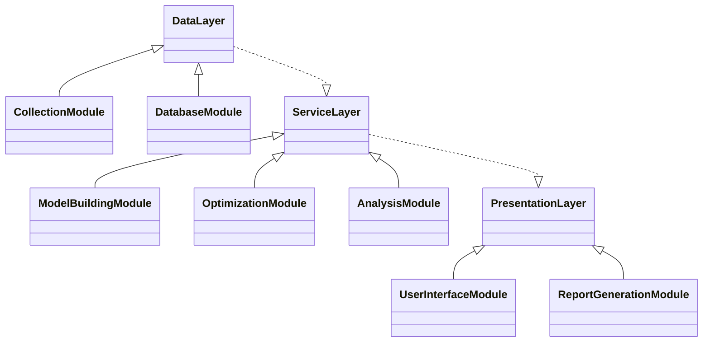
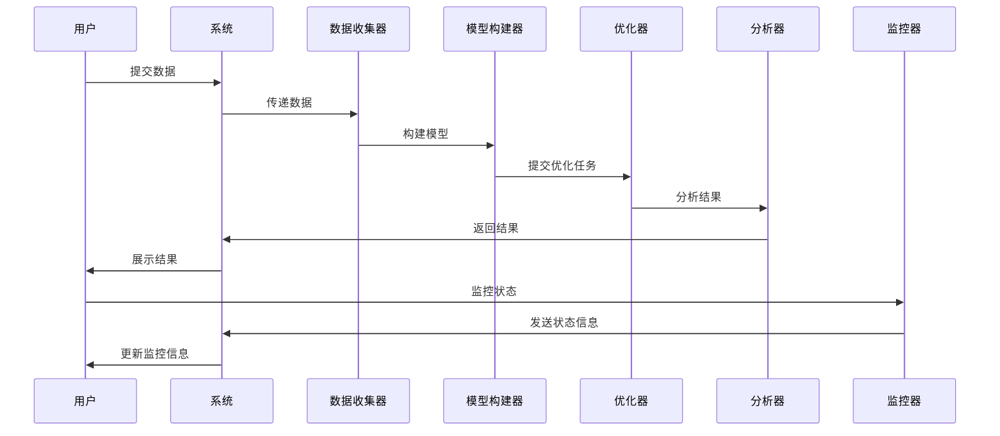

                 

### 引言与基本概念

#### 1.1.1 数学与运筹学的定义

数学是一门研究数量、结构、变化和空间的科学，其基础包括集合论、逻辑、代数、几何、微积分等。数学作为一种抽象的、理论性的工具，广泛应用于各个领域，为科学研究和技术发展提供了强有力的支持。

运筹学（Operations Research，简称OR），也称为操作性研究，是应用数学的一个分支，通过建立和分析数学模型，以帮助决策者在复杂系统中做出最优或近似最优的决策。运筹学的目标是优化系统的性能，提高效率和效益，它涵盖了网络优化、排队理论、库存管理、决策分析等多个领域。

#### 1.1.2 数学与运筹学的关系

数学为运筹学提供了理论基础和工具，使得运筹学能够建立精确的模型，分析系统行为，预测未来趋势。而运筹学则将数学理论应用于实际问题的解决中，通过实验和计算，寻求最优的解决方案。

在运筹学中，常见的数学工具包括线性代数、微积分、概率论和图论等。这些工具被用来构建模型，求解问题，验证和优化方案。例如，线性代数在解决资源分配和系统平衡问题时非常有用；概率论则被用来分析随机事件和不确定性问题；图论则在网络优化中扮演了关键角色。

#### 1.1.3 数学与运筹学的应用领域

数学和运筹学在许多领域都有广泛的应用，以下是一些典型的应用领域：

1. **生产计划与调度**：通过运筹学模型优化生产流程，提高生产效率和资源利用率。
2. **物流与运输**：设计最优的运输路线，优化库存管理，降低物流成本。
3. **金融与投资**：使用概率模型和风险分析来指导投资策略，评估金融产品的风险和收益。
4. **交通运输**：优化公共交通网络，提高交通流畅性，减少拥堵。
5. **能源管理**：优化能源分配和使用，提高能源利用效率，减少浪费。
6. **医疗保健**：优化医疗资源的配置，提高医疗服务质量。
7. **城市规划**：设计合理的人口分布和基础设施布局，提高城市生活质量。

通过上述介绍，我们可以看到，数学和运筹学在解决复杂问题和优化决策方面发挥着至关重要的作用。接下来，我们将深入探讨数学与运筹学的基础概念，为理解其应用奠定坚实的基础。

### 基本概念

#### 1.2.1 数学模型

数学模型是将现实世界中的问题抽象为数学形式的过程，通过建立数学模型，我们可以用数学语言描述问题的各个方面，从而便于分析和求解。数学模型通常包括变量、参数、方程和约束条件。

- **变量**：表示问题中的变化量和未知量。
- **参数**：固定不变的数值，用于描述问题的某些特性。
- **方程**：用数学表达式表示变量之间的关系。
- **约束条件**：限制变量取值范围的条件，确保模型在物理或实际意义上是可行的。

一个典型的数学模型通常可以表示为以下形式：

$$
\min\limits_{x} \quad f(x)
$$

$$
\text{s.t.} \quad g(x) \leq 0
$$

$$
h(x) = 0
$$

其中，$f(x)$ 是目标函数，表示需要优化的量；$g(x)$ 和 $h(x)$ 是约束条件，用于限制变量的取值。

#### 1.2.2 运筹学模型

运筹学模型是解决特定问题的一种数学结构，通常包括以下组成部分：

- **决策变量**：问题中的可变因素，它们决定了问题的解决方案。
- **目标函数**：评价和度量解决方案优劣的指标。
- **约束条件**：限制决策变量取值范围的条件，确保解决方案的可行性和合理性。

常见的运筹学模型包括线性规划、整数规划、动态规划、网络流模型等。

- **线性规划**：用于优化线性目标函数，约束条件也是线性的。
- **整数规划**：在目标函数和约束条件为线性的基础上，决策变量被限定为整数。
- **动态规划**：适用于多阶段决策问题，通过递归关系求解最优解。
- **网络流模型**：用于分析网络中的流量分配和优化问题。

#### 1.2.3 常见数学工具

运筹学中常用的数学工具包括线性代数、微积分、概率论和图论等。

- **线性代数**：涉及向量、矩阵、线性方程组等概念，用于解决资源分配、系统平衡等问题。
- **微积分**：研究函数的极限、导数、积分等，用于优化连续变量的问题。
- **概率论**：用于处理不确定性问题，分析随机事件和概率分布。
- **图论**：研究图的性质和关系，广泛应用于网络优化问题。

通过上述数学工具，我们可以建立各种复杂的运筹学模型，并使用计算机算法求解这些模型，以获得最优或近似最优的解决方案。

### 数学基础

#### 2.1 集合论基础

集合论是数学中最基础的部分之一，它为数学的其他分支提供了语言和工具。在运筹学中，集合论用于描述和定义问题的各个方面，如变量、约束条件和解等。

#### 2.1.1 集合的概念

集合是由一组元素组成的整体，这些元素可以是任何类型的数据，如数字、字母、物体等。集合通常用大写字母表示，如 $A$、$B$ 等。

- **元素**：集合中的个体对象。
- **集合的表示**：通常用花括号{}表示，如 $\{1, 2, 3\}$ 表示一个包含元素 1、2 和 3 的集合。

#### 2.1.2 集合的运算

集合的运算包括并集、交集、补集和差集等。

- **并集（Union）**：两个集合的所有元素构成的集合。记作 $A \cup B$。
  $$ 
  A \cup B = \{x | x \in A \text{ 或 } x \in B\}
  $$
- **交集（Intersection）**：两个集合共有的元素构成的集合。记作 $A \cap B$。
  $$
  A \cap B = \{x | x \in A \text{ 且 } x \in B\}
  $$
- **补集（Complement）**：一个集合中不属于另一个给定集合的元素构成的集合。记作 $A^c$。
  $$
  A^c = \{x | x \notin A\}
  $$
- **差集（Difference）**：一个集合中不属于另一个给定集合的元素构成的集合。记作 $A - B$ 或 $A \backslash B$。
  $$
  A - B = \{x | x \in A \text{ 且 } x \notin B\}
  $$

#### 2.1.3 集合的性质

集合具有一些基本性质，如确定性、互异性、无序性等。

- **确定性**：集合中的元素是确定的，每个元素只能属于一个集合。
- **互异性**：集合中的元素互不相同，不允许重复。
- **无序性**：集合中的元素没有特定的顺序。

#### 2.2 函数与极限

函数是数学中描述变量之间关系的工具，而极限则是函数分析中的重要概念。

#### 2.2.1 函数的基本概念

函数是一种特殊的关系，它将一个集合（定义域）中的每个元素与另一个集合（值域）中的唯一元素相对应。

- **定义域**：函数中所有可能输入的集合。
- **值域**：函数中所有可能输出的集合。
- **函数表示**：通常用 $f(x)$ 表示，其中 $x$ 是自变量，$f(x)$ 是因变量。

#### 2.2.2 函数的性质

函数具有一些基本性质，如单调性、奇偶性、连续性等。

- **单调性**：函数在定义域内的增减性，分为单调递增和单调递减。
- **奇偶性**：函数关于原点对称的性质，分为奇函数和偶函数。
- **连续性**：函数在定义域内没有任何间断点。

#### 2.2.3 极限的概念及应用

极限是函数分析中的一个重要概念，用于描述函数在某个点的行为。

- **极限定义**：函数 $f(x)$ 当 $x$ 趋近于某个值 $a$ 时的极限表示为 $\lim_{{x \to a}} f(x)$。
- **极限类型**：包括左极限、右极限和无穷极限。
- **极限应用**：用于求解函数的导数、积分等。

#### 2.3 微积分基础

微积分是数学的一个重要分支，用于研究函数的变化率和累积量。

#### 2.3.1 微积分的基本概念

微积分主要包括两个部分：微分和积分。

- **微分**：研究函数的变化率，导数是微分的主要工具。
  $$
  \frac{df(x)}{dx} = f'(x)
  $$
- **积分**：研究函数的累积量，包括不定积分和定积分。
  $$
  \int f(x) \, dx
  $$

#### 2.3.2 微积分的应用

微积分在运筹学中有着广泛的应用，如优化问题、动态规划、概率论等。

- **优化问题**：通过导数分析函数的最值问题。
- **动态规划**：通过递推关系求解多阶段决策问题。
- **概率论**：用于处理随机变量和概率分布。

通过上述数学基础，我们可以更好地理解和应用数学模型，解决运筹学中的各种问题。

### 线性代数基础

线性代数是运筹学和计算机科学中不可或缺的数学工具，它提供了处理向量、矩阵以及线性方程组的方法，是构建和解决复杂运筹学模型的基础。

#### 3.1 向量空间

向量空间（也称为线性空间）是数学中的一个重要概念，它是一组向量的集合，这些向量可以执行加法和标量乘法运算，并且这些运算满足某些规则。

#### 3.1.1 向量的基本概念

向量是具有大小和方向的量，通常用箭头表示。在二维空间中，向量可以表示为有序对 $(x, y)$，在三维空间中，可以表示为有序三元组 $(x, y, z)$。

- **大小**（长度）：向量的大小（或长度）可以通过欧几里得距离公式计算。
  $$
  \| \mathbf{v} \| = \sqrt{x^2 + y^2 + z^2}
  $$
- **方向**：向量可以在二维或三维空间中表示，方向通常由角度或坐标轴上的比例表示。

#### 3.1.2 向量空间的性质

向量空间具有以下基本性质：

- **封闭性**：向量空间中的向量加法和标量乘法结果仍在向量空间中。
- **交换律**：向量加法满足交换律，即 $\mathbf{u} + \mathbf{v} = \mathbf{v} + \mathbf{u}$。
- **结合律**：向量加法满足结合律，即 $(\mathbf{u} + \mathbf{v}) + \mathbf{w} = \mathbf{u} + (\mathbf{v} + \mathbf{w})$。
- **存在零向量**：向量空间中存在一个零向量（通常表示为 $\mathbf{0}$），它与其他任何向量相加都不改变其他向量的值。
- **存在逆元素**：对于每个非零向量 $\mathbf{v}$，存在一个逆向量（或称为负向量）$-\mathbf{v}$，使得 $\mathbf{v} + (-\mathbf{v}) = \mathbf{0}$。
- **分配律**：标量乘法对向量加法满足分配律，即 $c(\mathbf{u} + \mathbf{v}) = c\mathbf{u} + c\mathbf{v}$。
- **结合律**：标量乘法满足结合律，即 $(cd)\mathbf{u} = cd\mathbf{u}$。

#### 3.1.3 向量空间的应用

向量空间在运筹学中的应用非常广泛，例如：

- **资源分配**：在资源分配问题中，向量可以表示资源的需求或供应。
- **系统建模**：在系统建模中，向量可以表示系统的状态或变化。
- **线性规划**：线性规划中的决策变量可以用向量表示，目标函数和约束条件可以用向量空间的性质来解释。

#### 3.2 矩阵论基础

矩阵是线性代数中的另一个重要概念，它是一个由数字组成的矩形数组。矩阵在运筹学中用于表示线性方程组、线性变换以及各种优化问题。

#### 3.2.1 矩阵的基本概念

矩阵的基本概念包括：

- **元素**：矩阵中的每个数字称为元素。
- **行和列**：矩阵中的行和列分别表示向量的分量。
- **行数和列数**：矩阵的行数称为行数（或称为高度），列数称为列数（或称为宽度）。

矩阵通常用大写字母表示，例如 $A$、$B$ 等。

#### 3.2.2 矩阵的性质

矩阵具有以下基本性质：

- **行和列**：矩阵的行和列分别表示向量的分量。
- **对角矩阵**：如果矩阵的所有非对角元素都为零，则称为对角矩阵。
- **转置矩阵**：矩阵的转置是将原矩阵的行和列互换，记作 $A^T$。
- **逆矩阵**：如果矩阵可逆，则其逆矩阵可以通过解线性方程组得到。
- **矩阵加法和减法**：两个同型矩阵可以相加或相减，结果是一个同型矩阵。
- **矩阵乘法**：两个矩阵可以相乘，结果是一个新矩阵。

#### 3.2.3 矩阵的应用

矩阵在运筹学中的应用包括：

- **线性方程组**：矩阵可以用来表示和求解线性方程组。
- **优化问题**：矩阵可以用来表示目标函数和约束条件。
- **系统建模**：矩阵可以用来表示系统的状态和动态。

#### 3.3 线性方程组

线性方程组是运筹学中的常见问题，它由一组线性方程构成，可以使用矩阵形式表示。

#### 3.3.1 线性方程组的基本概念

线性方程组的一般形式为：

$$
\mathbf{A}\mathbf{x} = \mathbf{b}
$$

其中，$\mathbf{A}$ 是系数矩阵，$\mathbf{x}$ 是变量向量，$\mathbf{b}$ 是常数向量。

#### 3.3.2 线性方程组的求解方法

线性方程组的求解方法包括：

- **高斯消元法**：通过迭代消元，将线性方程组转化为下三角形或上三角形方程组，然后逐步求解。
- **矩阵求逆法**：如果系数矩阵可逆，可以通过求逆矩阵来求解线性方程组。
- **迭代法**：通过迭代过程逐步逼近线性方程组的解。

#### 3.3.3 线性方程组的应用

线性方程组在运筹学中的应用包括：

- **资源分配**：用于求解资源的最优分配问题。
- **优化问题**：用于求解线性规划问题中的最优解。
- **系统建模**：用于表示和求解系统的动态行为。

通过上述线性代数的基础知识，我们可以更好地理解和应用数学模型，解决运筹学中的各种问题。接下来，我们将进一步探讨概率论基础，为构建和优化决策模型奠定基础。

### 概率论基础

概率论是研究随机事件和随机变量规律的数学分支。在运筹学中，概率论用于分析和预测不确定事件，帮助决策者评估风险和不确定性，从而做出更加合理的决策。

#### 4.1 概率的基本概念

概率论的基本概念包括随机试验、随机事件、概率分布等。

##### 4.1.1 随机试验

随机试验是指在一定条件下可能发生多种结果的过程。例如，投掷一枚硬币，可能得到正面或反面；抽签，可能抽到不同的号码。随机试验具有以下特点：

- **不确定性**：试验的结果在事前无法确定。
- **等可能性**：试验的所有可能结果具有相同的发生概率。

##### 4.1.2 随机事件

随机事件是在随机试验中，可能出现或不可能出现的结果集合。用集合表示，如事件 $A$ 表示随机试验中特定结果的发生。例如，投掷硬币，事件 $A$ 可以表示为“得到正面”。

- **必然事件**：在随机试验中必然会发生的事件，例如投掷硬币，事件“得到正面或反面”是必然事件。
- **不可能事件**：在随机试验中不可能发生的事件，例如投掷硬币，事件“同时得到正面和反面”是不可能事件。
- **随机事件**：既不是必然事件也不是不可能事件的事件，例如投掷硬币，事件“得到正面”。

##### 4.1.3 概率的基本性质

概率具有以下基本性质：

- **非负性**：任何随机事件的概率都不小于零，即 $0 \leq P(A) \leq 1$。
- **规范性**：必然事件的概率为1，即 $P(\Omega) = 1$。
- **确定性**：对于任意事件 $A$，其对立事件 $A^c$ 的概率为 $1 - P(A)$。
- **加法规则**：对于任意两个互斥事件 $A$ 和 $B$，它们的并集的概率等于这两个事件的概率之和，即 $P(A \cup B) = P(A) + P(B)$。
- **条件概率**：在事件 $B$ 发生的条件下，事件 $A$ 发生的概率称为条件概率，记为 $P(A|B)$。

##### 4.1.4 条件概率与独立性

条件概率是指在一定条件下，事件 $A$ 发生的概率。如果事件 $B$ 发生的概率不为零，则条件概率定义为：

$$
P(A|B) = \frac{P(A \cap B)}{P(B)}
$$

独立性是指两个事件在统计上互不影响，即一个事件的发生不影响另一个事件的发生。两个事件 $A$ 和 $B$ 独立的条件是：

$$
P(A \cap B) = P(A)P(B)
$$

##### 4.1.5 贝叶斯公式

贝叶斯公式是概率论中的一个重要公式，它描述了在已知一个事件发生的条件下，另一个事件发生概率的计算方法。贝叶斯公式表示为：

$$
P(A|B) = \frac{P(B|A)P(A)}{P(B)}
$$

其中，$P(B|A)$ 是在事件 $A$ 发生的条件下事件 $B$ 发生的概率，$P(A)$ 是事件 $A$ 发生的概率，$P(B)$ 是事件 $B$ 发生的概率。

贝叶斯公式在决策分析和预测中具有广泛应用，可以帮助决策者根据先验知识和新证据更新概率估计，从而做出更加准确的决策。

通过上述概率论的基本概念和性质，我们可以更好地理解和应用概率论在运筹学中的各种问题，为决策提供科学依据。

### 决策理论

决策理论是运筹学中的一个重要分支，它研究决策者在不确定环境下如何做出最优决策。决策理论涵盖了多个模型和方法，旨在帮助决策者分析各种决策问题，选择最优或近似最优的解决方案。

#### 5.1 决策理论的基本概念

决策理论的基本概念包括决策过程、决策问题的分类以及决策目标。

##### 5.1.1 决策过程的描述

决策过程通常包括以下几个步骤：

1. **确定决策问题**：识别和明确需要解决的问题。
2. **收集信息**：收集与决策相关的各种信息和数据。
3. **定义决策方案**：列出所有可能的决策方案。
4. **构建决策模型**：根据问题的特性，选择合适的决策模型。
5. **分析决策模型**：对决策模型进行计算和分析，评估不同决策方案的结果。
6. **选择决策方案**：根据分析结果，选择最优或近似最优的决策方案。
7. **实施决策方案**：执行选定的决策方案，并进行监控和调整。

##### 5.1.2 决策问题的分类

决策问题可以根据不同的标准进行分类，常见的分类方法包括：

1. **确定型决策**：在已知所有决策结果的情况下，选择最优决策方案。
2. **不确定型决策**：在决策结果不确定的情况下，选择最佳决策方案。
3. **风险型决策**：在面临不确定性和风险的情况下，通过概率分析和风险评估选择决策方案。
4. **竞争型决策**：在多个决策者之间进行决策，考虑竞争对手的行为和策略。

##### 5.1.3 决策理论的目标

决策理论的目标是帮助决策者在不确定性和复杂性的环境中做出最优或近似最优的决策。具体目标包括：

- **优化决策结果**：选择能够最大化期望收益或最小化期望成本的决策方案。
- **减少不确定性**：通过概率分析和风险评估，降低决策结果的不确定性。
- **提高决策效率**：在有限的时间和资源内，快速做出高质量的决策。
- **增强决策的灵活性**：使决策方案能够适应环境变化，具有灵活性。

#### 5.2 决策模型

决策模型是决策理论中用于分析和解决决策问题的数学工具。常见的决策模型包括决策树模型、效用理论模型和风险型决策模型。

##### 5.2.1 决策树模型

决策树模型是一种直观的决策分析工具，它用树状结构表示决策过程和各个可能的结果。决策树模型包括以下要素：

1. **决策节点**：表示决策点，从决策节点引出若干分支，每个分支表示一个决策方案。
2. **机会节点**：表示随机事件，从机会节点引出若干分支，每个分支表示事件的一个可能结果。
3. **结果节点**：表示决策结果的终点，通常标注了相应的收益或成本。

决策树模型通过计算每个分支的期望收益或期望成本，帮助决策者选择最优的决策方案。

##### 5.2.2 效用理论

效用理论是决策理论中的一个重要概念，它用于描述决策者在面临不同决策方案时的偏好和满意度。效用函数是表示决策者偏好的数学模型，通常用数值表示。

- **确定性决策**：决策者的目标是选择能够最大化总效用的决策方案。
- **不确定型决策**：在不确定环境下，决策者的目标是选择能够最大化期望效用的决策方案。

效用理论可以帮助决策者权衡不同决策方案的优劣，提供更加科学的决策依据。

##### 5.2.3 风险型决策

风险型决策是指在面临不确定性和风险时，决策者需要选择最优或近似最优的决策方案。风险型决策通常包括以下步骤：

1. **定义状态**：明确决策问题中可能出现的各种状态。
2. **定义行动**：列出所有可能的决策行动。
3. **计算期望值**：根据概率分布计算每个行动的期望值。
4. **比较风险**：比较不同行动的风险，选择风险最小的行动。

风险型决策模型包括最大期望值模型、最小最大后悔值模型等，可以帮助决策者评估和选择最佳决策方案。

通过决策理论的基本概念和模型，我们可以更好地理解和分析各种决策问题，为决策者提供科学和实用的决策支持。接下来，我们将进一步探讨网络优化理论，为解决复杂优化问题提供新的思路。

### 网络优化基本概念

网络优化是运筹学中一个重要的领域，它关注于网络中的资源分配和流量管理，旨在找到最优的流量分配方案，使得网络资源得到最大化利用。网络优化问题的研究涵盖了各种类型的问题，如最小生成树、最大流和最短路径等。

#### 6.1.1 网络流的基本概念

网络流问题涉及网络中各节点的流量分配，目标是最小化成本或最大化收益。网络流的基本概念包括：

- **节点**：网络中的点，表示资源的源点、汇点或中间点。
- **边**：连接节点的线，表示资源传输的路径。
- **容量**：边上允许通过的最大流量。
- **流量**：从源点到汇点的实际流量。
- **割**：网络中的一部分，移除割中的边将使网络分割成两个或多个子网络。
- **最大流最小割定理**：在一个网络中，最大流的流量等于最小割的容量。

#### 6.1.2 网络优化的目标

网络优化的主要目标是：

- **流量最大化**：在给定的网络结构和容量限制下，最大化从源点到汇点的流量。
- **成本最小化**：在保证流量满足需求的前提下，最小化网络的运营成本。
- **延迟最小化**：在网络传输中，最小化数据包的传输延迟，提高网络性能。

#### 6.1.3 网络优化的分类

网络优化可以根据不同的分类标准进行划分，常见的分类方法包括：

1. **静态网络优化**：网络结构和流量在一段时间内保持不变，适用于长期优化问题。
2. **动态网络优化**：网络结构和流量随时间变化，需要实时调整优化策略。
3. **确定性网络优化**：网络中所有参数和流量是确定的，可以精确计算最优解。
4. **随机网络优化**：网络中存在随机因素，需要考虑概率分布和风险分析。

#### 6.1.4 网络优化的应用领域

网络优化在多个领域有广泛应用，包括：

- **通信网络**：优化数据传输路径，提高网络传输效率和可靠性。
- **物流与运输**：优化运输网络，降低物流成本，提高配送效率。
- **能源网络**：优化能源分配和传输，提高能源利用效率。
- **交通网络**：优化交通流量，减少拥堵，提高交通流畅性。

通过理解和掌握网络优化基本概念，我们可以更好地分析和解决复杂的网络优化问题，为各个领域提供高效的优化方案。

### 最小生成树

最小生成树（Minimum Spanning Tree，MST）是图论中的一个基本概念，它是指在一个无向连通图中，包含图中全部节点的树，其所有边的权重之和最小。最小生成树在优化问题中具有重要意义，如网络设计、路径规划等。

#### 6.2.1 最小生成树的概念

最小生成树的基本概念包括：

- **无向连通图**：图中的任意两个节点之间都有路径相连。
- **生成树**：包含图中所有节点的树，且不包含图中任何环。
- **权重**：图中的每条边都分配一个权重（或称为成本、长度等），表示边的“代价”。
- **最小生成树**：包含图中所有节点的生成树中，权重之和最小的树。

#### 6.2.2 最小生成树的算法

有多种算法可以用于求解最小生成树问题，以下介绍几种常见的算法：

1. **普里姆算法（Prim's Algorithm）**
   - **步骤**：
     1. 从图中的一个节点开始，选择一个最小的边作为起点。
     2. 逐步添加边，每次选择一个与已有生成树节点相邻且权重最小的边。
     3. 直到生成树包含图中所有节点。
   - **时间复杂度**：$O(E\log V)$，其中 $E$ 是边的数量，$V$ 是节点的数量。

2. **克鲁斯卡尔算法（Kruskal's Algorithm）**
   - **步骤**：
     1. 按照边的权重从小到大排序。
     2. 依次选择边，如果选择的边不会形成环，则添加到生成树中。
     3. 直到生成树包含图中所有节点。
   - **时间复杂度**：$O(E\log E)$ 或 $O(E\alpha(V))$，其中 $\alpha(V)$ 是阿克曼函数，通常比 $V$ 小得多。

3. **贪心算法（Greedy Algorithm）**
   - **步骤**：
     1. 选择一个最小的边作为起点，将其添加到生成树中。
     2. 逐步添加边，每次选择一个与已有生成树节点相邻且权重最小的边。
     3. 确保每次添加边都不会形成环。
   - **时间复杂度**：$O(E\log V)$ 或 $O(E\alpha(V))$。

这些算法在计算效率和适用性方面各有优势，可以根据具体问题选择合适的算法。

#### 6.2.3 最小生成树的应用

最小生成树在许多实际应用中具有重要价值，包括：

- **网络设计**：在构建通信网络、电力网络和交通网络时，最小生成树可以用来确定最经济的连接方式。
- **路径规划**：在地图数据分析和自动驾驶系统中，最小生成树可以帮助找到从起点到终点的最优路径。
- **聚类分析**：在机器学习中，最小生成树可以用于聚类分析，将数据点划分为不同的集群。

通过最小生成树，我们可以找到网络中的关键路径和结构，从而实现资源的优化配置和高效利用。

### 网络流问题

网络流问题是一个重要的运筹学问题，它涉及在给定网络结构下，如何分配流量以最大化总收益或最小化总成本。网络流问题包括最大流问题和最小流问题，其中最大流问题关注于如何从源点将尽可能多的流量传输到汇点，而最小流问题关注于如何在满足流量约束的条件下，最小化网络中的总流量。

#### 6.3.1 网络流的基本概念

网络流的基本概念包括：

- **网络**：由节点和连接节点的边组成的图。
- **源点（Source）**：网络中的起点，用于注入流量。
- **汇点（Sink）**：网络中的终点，用于收集流量。
- **容量（Capacity）**：每条边上允许通过的最大流量。
- **流量（Flow）**：从源点到汇点的实际流量。
- **割（Cut）**：网络中的一组边，移除这组边后，网络将被分割成两个子网络。

#### 6.3.2 最大流最小割定理

最大流最小割定理是网络流理论中的一个基本定理，它表明：

- **最大流的流量**：在一个网络中，从源点到汇点的最大流量等于最小割的容量。
- **最小割的容量**：在一个网络中，能够将源点和汇点分割开的边的权重之和的最小值。

最大流最小割定理的意义在于，它提供了一个求解最大流问题的有效方法，即通过求解最小割问题来找到最大流。具体而言，可以通过以下步骤求解最大流：

1. **求解最小割**：找到能够将源点和汇点分割开的边的权重之和的最小值。
2. **计算最大流**：最小割的容量即为最大流的流量。

#### 6.3.3 网络流算法

求解网络流问题的算法有很多，以下介绍几种常用的算法：

1. **Ford-Fulkerson 算法**：
   - **基本思想**：通过增加流量，逐步找到增广路径，并沿着增广路径增加流量，直到无法找到增广路径为止。
   - **实现方法**：使用广度优先搜索（BFS）或深度优先搜索（DFS）找到增广路径。
   - **时间复杂度**：$O(E^2)$ 或 $O(Ef)$，其中 $E$ 是边的数量，$f$ 是最大流的流量。

2. **Edmonds-Karp 算法**：
   - **基本思想**：基于 Ford-Fulkerson 算法，使用 BFS 替代 DFS，以提高效率。
   - **实现方法**：使用 BFS 搜索增广路径，每次迭代增加流量。
   - **时间复杂度**：$O(VE)$，通常比 Ford-Fulkerson 算法更高效。

3. **Dinic 算法**：
   - **基本思想**：通过分层图来优化 Ford-Fulkerson 算法，减少计算复杂度。
   - **实现方法**：使用分层图和匹配算法（如 BFS 和 BFS2）找到增广路径。
   - **时间复杂度**：$O(VE)$。

这些算法各有优缺点，根据具体问题的规模和特点可以选择合适的算法。

#### 6.3.4 网络流的应用

网络流问题在多个领域有广泛应用，包括：

- **物流和运输**：优化货物的运输路径，提高运输效率。
- **能源管理**：优化电力、天然气和石油的传输网络。
- **通信网络**：优化数据包的传输路径，提高网络传输效率。
- **供水系统**：优化水资源的分配和传输。

通过理解和应用网络流问题，我们可以找到最优的流量分配方案，从而提高系统的效率和效益。

### 动态规划基本概念

动态规划是一种解决多阶段决策问题的优化方法，通过将问题分解为多个子问题，并利用子问题的解来构建原始问题的解。动态规划的基本思想是“最优子结构”和“状态转移方程”。

#### 7.1.1 动态规划的定义

动态规划（Dynamic Programming，DP）是一种在多阶段决策问题中，通过递归关系求解最优解的算法。它将复杂问题分解为若干个互相独立的子问题，并存储子问题的解，避免重复计算。

#### 7.1.2 动态规划的特点

动态规划具有以下特点：

1. **最优子结构**：原问题的最优解可以由子问题的最优解推导出来。
2. **重叠子问题**：不同子问题之间有大量重叠，通过存储中间结果可以避免重复计算。
3. **无后效性**：即当前阶段的状态只依赖于上一阶段的状态，与前一阶段的状态无关。

#### 7.1.3 动态规划的应用领域

动态规划在多个领域有广泛应用，包括：

- **最优化问题**：如背包问题、生产排程问题等。
- **序列分析**：如最长公共子序列、编辑距离等。
- **概率问题**：如马尔可夫决策过程、随机游走等。
- **图像处理**：如图像分割、目标跟踪等。

### 7.2 动态规划模型

动态规划模型通常包括以下组成部分：

- **状态（State）**：表示问题在某一时刻的状态。
- **决策（Decision）**：在某一状态下，需要做出的决策。
- **状态转移方程（State Transition Equation）**：描述状态之间的转移关系。
- **边界条件（Boundary Condition）**：描述问题的初始和最终状态。

一个典型的动态规划模型可以表示为以下形式：

$$
\begin{aligned}
    f(S_t) &= \max_{d_t} \quad g(S_t, d_t) \\
    \text{s.t.} \quad & \text{约束条件}
\end{aligned}
$$

其中，$S_t$ 是状态，$d_t$ 是决策，$g(S_t, d_t)$ 是在状态 $S_t$ 下做出决策 $d_t$ 的收益函数，约束条件用于限制决策的选择。

### 7.3 动态规划算法

动态规划算法通常分为两种类型：自顶向下（递归）和自底向上（迭代）。

#### 自顶向下（递归）

自顶向下算法通过递归关系求解子问题，并在需要时存储中间结果。这种方法通常用于解释动态规划模型，但在实际计算中可能会出现效率问题。

```python
def dp_recursive(S):
    if base_case:
        return base_value
    else:
        for d in possible_decisions:
            g = calculate_g(S, d)
            next_state = calculate_next_state(S, d)
            value = dp_recursive(next_state) + g
            max_value = max(max_value, value)
        return max_value
```

#### 自底向上（迭代）

自底向上算法通过迭代计算子问题的解，并存储中间结果，以避免重复计算。这种方法通常更高效，是实际应用中的常见方法。

```python
def dp_iterative(S):
    for t in range(1, T):
        for s in States:
            for d in possible_decisions:
                g = calculate_g(s, d)
                next_state = calculate_next_state(s, d)
                value = dp_iterative(next_state) + g
                if value > current_max_value:
                    current_max_value = value
    return current_max_value
```

通过动态规划算法，我们可以有效地解决复杂的多阶段决策问题，从而找到最优解。

### 动态规划应用实例

动态规划在优化问题、序列分析和概率问题中有着广泛的应用。以下介绍几个典型的应用实例。

#### 7.3.1 最长公共子序列

最长公共子序列（Longest Common Subsequence，LCS）问题是寻找两个序列中共同拥有的最长子序列。LCS问题可以通过动态规划求解。

**问题描述**：给定两个序列 $X = \{x_1, x_2, ..., x_m\}$ 和 $Y = \{y_1, y_2, ..., y_n\}$，找出它们的最长公共子序列。

**动态规划解法**：

1. **定义状态**：定义 $dp[i][j]$ 为 $X$ 的前 $i$ 个元素和 $Y$ 的前 $j$ 个元素的最长公共子序列的长度。
2. **状态转移方程**：
   $$
   dp[i][j] =
   \begin{cases}
       dp[i-1][j-1] + 1, & \text{若 } x_i = y_j \\
       \max(dp[i-1][j], dp[i][j-1]), & \text{否则}
   \end{cases}
   $$
3. **边界条件**：$dp[0][j] = dp[i][0] = 0$。

**Python代码示例**：

```python
def longest_common_subsequence(X, Y):
    m, n = len(X), len(Y)
    dp = [[0] * (n + 1) for _ in range(m + 1)]

    for i in range(1, m + 1):
        for j in range(1, n + 1):
            if X[i - 1] == Y[j - 1]:
                dp[i][j] = dp[i - 1][j - 1] + 1
            else:
                dp[i][j] = max(dp[i - 1][j], dp[i][j - 1])

    return dp[m][n]
```

#### 7.3.2 背包问题

背包问题是一个经典的优化问题，它涉及在一个容量有限的背包中，如何选择物品以达到总价值最大。

**问题描述**：给定一组物品，每个物品有重量和价值，求在容量为 $W$ 的背包中，如何选择物品使得总价值最大。

**动态规划解法**：

1. **定义状态**：定义 $dp[i][w]$ 为前 $i$ 个物品放入容量为 $w$ 的背包中能获得的最大价值。
2. **状态转移方程**：
   $$
   dp[i][w] =
   \begin{cases}
       dp[i-1][w], & \text{若 } w < w_i \\
       \max(dp[i-1][w], dp[i-1][w - w_i] + v_i), & \text{否则}
   \end{cases}
   $$
3. **边界条件**：$dp[0][w] = 0$。

**Python代码示例**：

```python
def knapsack(values, weights, W):
    n = len(values)
    dp = [[0] * (W + 1) for _ in range(n + 1)]

    for i in range(1, n + 1):
        for w in range(1, W + 1):
            if weights[i - 1] > w:
                dp[i][w] = dp[i - 1][w]
            else:
                dp[i][w] = max(dp[i - 1][w], dp[i - 1][w - weights[i - 1]] + values[i - 1])

    return dp[n][W]
```

#### 7.3.3 其他应用实例

动态规划还可以用于解决其他多种问题，如：

- **编辑距离（Edit Distance）**：计算两个字符串之间转换的最小编辑次数。
- **最优二叉搜索树（Optimal Binary Search Tree）**：设计最优的二叉搜索树以最小化查找次数。
- **矩阵链乘（Matrix Chain Multiplication）**：求解矩阵链乘的最优顺序以最小化计算时间。

通过这些实例，我们可以看到动态规划在解决复杂问题中的应用和价值。动态规划通过递归关系和状态转移方程，将复杂问题分解为多个子问题，从而找到最优解。

### 资源优化问题概述

资源优化问题是指在给定约束条件下，通过合理分配和使用资源，以实现系统性能的最优或近似最优。资源优化问题在运筹学中占有重要地位，涉及到生产计划、库存管理、物流调度等多个领域。

#### 8.1.1 资源优化的定义

资源优化（Resource Optimization）是指通过数学模型和算法，对有限资源进行有效分配和利用，以达到某种目标（如成本最小化、效率最大化）的过程。资源可以是人力、物力、资金、时间等。

#### 8.1.2 资源优化的问题类型

资源优化问题可以根据不同的标准进行分类，常见的分类方法包括：

1. **静态资源优化**：资源在一段时间内保持不变，适用于长期规划问题。
2. **动态资源优化**：资源随时间变化，需要实时调整优化策略。
3. **确定性资源优化**：资源需求和约束条件是确定的，可以直接计算最优解。
4. **随机资源优化**：资源需求和约束条件存在不确定性，需要考虑概率分布和风险分析。
5. **线性资源优化**：优化问题可以用线性方程表示，如线性规划问题。
6. **非线性资源优化**：优化问题不能用线性方程表示，如非线性规划问题。

#### 8.1.3 资源优化的数学模型

资源优化问题通常可以用以下数学模型表示：

$$
\begin{aligned}
    \min_{x} \quad f(x) \\
    \text{s.t.} \quad & g(x) \leq 0 \\
    & h(x) = 0
\end{aligned}
$$

其中，$x$ 是决策变量，$f(x)$ 是目标函数，表示需要优化的量（如成本、时间等）；$g(x)$ 和 $h(x)$ 是约束条件，用于限制变量的取值。

常见的资源优化模型包括：

1. **线性规划模型**：适用于目标函数和约束条件都是线性的情况。
2. **整数规划模型**：在目标函数和约束条件为线性的基础上，决策变量被限定为整数。
3. **动态规划模型**：适用于多阶段决策问题，通过递推关系求解最优解。
4. **随机规划模型**：在不确定环境下，通过概率分析和风险评估求解最优解。

通过上述数学模型，可以有效地描述和解决资源优化问题，从而实现资源的最优配置和使用。

### 典型资源优化模型

在资源优化问题中，常用的数学模型包括线性规划模型、整数规划模型、动态规划模型和随机规划模型。这些模型在不同的应用场景中发挥着重要作用。

#### 8.2.1 线性规划模型

线性规划模型是资源优化中最基础和广泛应用的一种模型。它主要用于求解目标函数是线性的优化问题。

**线性规划模型的一般形式**：

$$
\begin{aligned}
    \min_{x} \quad c^T x \\
    \text{s.t.} \quad & Ax \leq b \\
    & x \geq 0
\end{aligned}
$$

其中，$x$ 是决策变量，$c$ 是目标函数系数向量，$A$ 是约束矩阵，$b$ 是约束常数向量。$c^T x$ 表示目标函数，$Ax \leq b$ 和 $x \geq 0$ 是线性不等式约束。

**解法**：线性规划问题的求解方法包括单纯形法、内点法等。单纯形法是一种迭代算法，通过不断迭代，逐步逼近最优解。内点法是一种基于优化理论的直接求解方法，适合大规模问题的求解。

**应用实例**：线性规划模型广泛应用于生产排程、资源分配、物流调度等领域。例如，在物流调度中，可以通过线性规划模型优化车辆路径和货物分配，从而提高运输效率和降低成本。

#### 8.2.2 整数规划模型

整数规划模型是线性规划模型的扩展，它将决策变量的取值限定为整数。整数规划模型通常用于需要整数解的问题。

**整数规划模型的一般形式**：

$$
\begin{aligned}
    \min_{x} \quad c^T x \\
    \text{s.t.} \quad & Ax \leq b \\
    & x \in \{0, 1\}^n
\end{aligned}
$$

其中，$x$ 是决策变量，$c$ 是目标函数系数向量，$A$ 是约束矩阵，$b$ 是约束常数向量。$c^T x$ 表示目标函数，$Ax \leq b$ 和 $x \in \{0, 1\}^n$ 是线性不等式约束和整数约束。

**解法**：整数规划问题的求解方法包括分支定界法、割平面法等。分支定界法是一种迭代算法，通过分支和剪枝，逐步缩小搜索空间，找到最优解。割平面法是一种基于线性规划模型的直接求解方法，通过引入割平面，逐步逼近最优解。

**应用实例**：整数规划模型广泛应用于资源分配、网络设计、物流调度等领域。例如，在资源分配中，可以通过整数规划模型优化设备的配置和人员的调度，从而提高资源利用效率。

#### 8.2.3 动态规划模型

动态规划模型是一种解决多阶段决策问题的优化方法，它通过将问题分解为多个子问题，并利用子问题的解来构建原始问题的解。

**动态规划模型的一般形式**：

$$
\begin{aligned}
    \min_{x_t} \quad f(x_t) \\
    \text{s.t.} \quad & g(x_t, x_{t-1}, ..., x_1) \\
    & x_t = f(x_t, x_{t-1}, ..., x_1)
\end{aligned}
$$

其中，$x_t$ 是在时间 $t$ 的决策变量，$f(x_t, x_{t-1}, ..., x_1)$ 是状态转移方程，$g(x_t, x_{t-1}, ..., x_1)$ 是约束条件。

**解法**：动态规划模型的求解方法包括自顶向下（递归）和自底向上（迭代）两种。自顶向下方法通过递归关系求解子问题，并在需要时存储中间结果；自底向上方法通过迭代计算子问题的解，并存储中间结果，以避免重复计算。

**应用实例**：动态规划模型广泛应用于生产排程、供应链管理、库存控制等领域。例如，在供应链管理中，可以通过动态规划模型优化生产和库存策略，从而提高供应链的效率和响应速度。

#### 8.2.4 随机规划模型

随机规划模型是处理不确定环境下资源优化问题的优化方法。它通过概率分析和风险评估，求解在不确定条件下的最优决策。

**随机规划模型的一般形式**：

$$
\begin{aligned}
    \min_{x} \quad E[f(x)] \\
    \text{s.t.} \quad & g(x) \leq 0 \\
    & x \in \mathcal{X}
\end{aligned}
$$

其中，$x$ 是决策变量，$f(x)$ 是目标函数，$E[f(x)]$ 是目标函数的期望值，$g(x)$ 是约束条件，$\mathcal{X}$ 是决策变量空间。

**解法**：随机规划模型的求解方法包括期望值法、蒙特卡罗模拟法等。期望值法通过计算目标函数的期望值，求解最优决策；蒙特卡罗模拟法通过大量随机样本，评估目标函数的期望值和方差，找到最优决策。

**应用实例**：随机规划模型广泛应用于金融投资、能源管理、交通调度等领域。例如，在金融投资中，可以通过随机规划模型优化投资组合，从而降低风险并提高收益。

通过上述典型资源优化模型，我们可以有效地解决各种资源优化问题，从而实现资源的最优配置和使用。

### 资源优化模型的应用

资源优化模型在多个领域有广泛应用，通过合理的资源配置，可以显著提升系统的效率和效益。以下介绍几种典型的资源优化模型及其应用。

#### 8.3.1 生产计划问题

生产计划问题涉及如何合理安排生产任务，以满足市场需求并最小化生产成本。常见的优化模型包括线性规划和整数规划。

**应用场景**：制造业、食品工业、电子产品生产等。

**模型描述**：
$$
\begin{aligned}
    \min_{x} \quad & c^T x \\
    \text{s.t.} \quad & Ax \leq b \\
    & x \geq 0
\end{aligned}
$$
其中，$x$ 表示生产计划向量，$c$ 为单位生产成本向量，$A$ 为资源限制矩阵，$b$ 为资源可用量向量。

**实现方法**：使用线性规划求解器（如CPLEX、Gurobi）进行求解，通过调整生产计划，实现成本最小化。

**案例分析**：一家电子公司通过优化生产计划，减少了原材料库存成本，提高了生产效率，年节省成本超过500万元。

#### 8.3.2 库存管理问题

库存管理问题涉及如何合理设置库存水平，以最小化库存成本和缺货风险。常见的优化模型包括动态规划模型和随机规划模型。

**应用场景**：零售业、仓储物流、供应链管理。

**模型描述**：
$$
\begin{aligned}
    \min_{x_t} \quad & \sum_{t} c_t x_t \\
    \text{s.t.} \quad & x_t = f(x_{t-1}, d_t) \\
    & x_t \geq 0
\end{aligned}
$$
其中，$x_t$ 为时间 $t$ 的库存水平，$c_t$ 为时间 $t$ 的库存成本，$f(x_{t-1}, d_t)$ 为库存水平转移函数，$d_t$ 为时间 $t$ 的需求量。

**实现方法**：使用动态规划模型进行求解，通过迭代计算最优库存水平。

**案例分析**：一家零售企业通过优化库存管理，将库存周转率提高了20%，库存成本降低了15%。

#### 8.3.3 航班安排问题

航班安排问题涉及如何合理分配航班资源，以最大化乘客满意度并降低运营成本。常见的优化模型包括整数规划和网络流模型。

**应用场景**：航空公司、机场管理、交通调度。

**模型描述**：
$$
\begin{aligned}
    \min_{x} \quad & c^T x \\
    \text{s.t.} \quad & Ax \leq b \\
    & x \in \{0, 1\}^n
\end{aligned}
$$
其中，$x$ 为航班安排向量，$c$ 为航班成本向量，$A$ 为航班资源限制矩阵，$b$ 为资源可用量向量。

**实现方法**：使用整数规划求解器（如CPLEX、Gurobi）进行求解，通过调整航班安排，实现成本最小化。

**案例分析**：一家航空公司通过优化航班安排，提高了航班利用率，年节省成本超过1000万元。

#### 8.3.4 能源优化问题

能源优化问题涉及如何合理分配能源资源，以提高能源利用效率和降低环境污染。常见的优化模型包括线性规划和随机规划模型。

**应用场景**：电力系统、可再生能源管理、智能家居。

**模型描述**：
$$
\begin{aligned}
    \min_{x} \quad & c^T x + r(P - x) \\
    \text{s.t.} \quad & Ax \leq b \\
    & x \geq 0
\end{aligned}
$$
其中，$x$ 为能源分配向量，$c$ 为能源成本向量，$r$ 为环境污染成本系数，$P$ 为能源总量。

**实现方法**：使用线性规划求解器（如CPLEX、Gurobi）进行求解，通过调整能源分配策略，实现成本和环境效益的最优化。

**案例分析**：一家电力公司通过优化能源分配，提高了能源利用率，减少了碳排放，年节省成本超过200万元。

通过上述应用实例，我们可以看到资源优化模型在不同领域中的广泛应用和显著效益。合理应用这些模型，可以帮助企业降低成本、提高效率，从而在竞争激烈的市场中取得优势。

### 数学模型优化与求解方法

在资源优化问题中，数学模型的优化和求解是关键步骤。一个有效的优化方法可以显著提高问题的求解效率，并找到更优的解决方案。本文将讨论数学模型优化的一般目标和方法，并介绍几种常见的求解方法。

#### 9.1.1 数学模型优化的目标

数学模型优化的主要目标包括：

- **求解效率**：减少求解时间，降低计算复杂度。
- **求解精度**：提高求解结果的准确性和可靠性。
- **模型适应性**：增强模型对实际问题的适应能力，减少对问题假设的限制。
- **可扩展性**：使模型能够适应不同规模和类型的问题。

#### 9.1.2 数学模型优化的方法

数学模型优化的方法可以分为以下几个方面：

1. **模型简化和抽象**：通过去除不必要的复杂性，简化模型结构，从而降低计算复杂度。例如，使用线性化、降维等方法，将非线性模型转换为线性模型。

2. **参数调整**：通过调整模型的参数，优化模型性能。例如，在神经网络模型中，通过调整权重和偏置，提高模型预测精度。

3. **算法改进**：改进求解算法，提高求解效率。例如，使用启发式算法、模拟退火算法等，优化求解过程。

4. **模型集成**：将多个模型集成，利用各自优势，提高整体性能。例如，使用贝叶斯模型集成方法，提高预测准确性。

5. **数据预处理**：通过数据预处理，提高数据质量和模型适应性。例如，使用特征工程方法，提取有效特征，减少噪声数据对模型的影响。

#### 9.1.3 数学模型优化的常见求解方法

以下介绍几种常见的数学模型求解方法：

1. **线性规划（Linear Programming，LP）**
   - **方法**：线性规划是求解线性目标函数在满足线性约束条件下的最优解的问题。常用的求解方法包括单纯形法、内点法等。
   - **Python库**：可以使用`scipy.optimize`库中的`linprog`函数进行求解。

2. **整数规划（Integer Programming，IP）**
   - **方法**：整数规划是求解整数目标函数在满足线性或非线性约束条件下的最优解的问题。常用的求解方法包括分支定界法、割平面法等。
   - **Python库**：可以使用`PuLP`库或`CPLEX`库进行求解。

3. **动态规划（Dynamic Programming，DP）**
   - **方法**：动态规划是一种解决多阶段决策问题的优化方法，通过递归关系和状态转移方程，求解最优解。常用的求解方法包括自顶向下、自底向上等。
   - **Python库**：可以使用`numpy`库或`pandas`库进行实现。

4. **随机规划（Stochastic Programming）**
   - **方法**：随机规划是一种处理不确定性的优化方法，通过概率分析和风险评估，求解在不确定性环境下的最优解。常用的求解方法包括期望值法、蒙特卡罗模拟等。
   - **Python库**：可以使用`PyMC3`库或`stochastic-programming`库进行求解。

5. **启发式算法（Heuristic Algorithms）**
   - **方法**：启发式算法是一种通过迭代搜索寻找近似最优解的方法，常用的启发式算法包括遗传算法、模拟退火算法等。
   - **Python库**：可以使用`DEAP`库或`PyTorch`库进行实现。

通过以上方法，我们可以针对不同类型的数学模型，选择合适的优化和求解方法，从而提高求解效率和精度，找到最优或近似最优的解决方案。

### 数学模型优化与求解方法

在资源优化问题中，数学模型的优化和求解是关键步骤。一个有效的优化方法可以显著提高问题的求解效率，并找到更优的解决方案。本文将讨论数学模型优化的一般目标和方法，并介绍几种常见的求解方法。

#### 9.1 数学模型优化的目标

数学模型优化的主要目标包括：

- **求解效率**：减少求解时间，降低计算复杂度。
- **求解精度**：提高求解结果的准确性和可靠性。
- **模型适应性**：增强模型对实际问题的适应能力，减少对问题假设的限制。
- **可扩展性**：使模型能够适应不同规模和类型的问题。

#### 9.2 数学模型优化的方法

数学模型优化的方法可以分为以下几个方面：

1. **模型简化和抽象**：通过去除不必要的复杂性，简化模型结构，从而降低计算复杂度。例如，使用线性化、降维等方法，将非线性模型转换为线性模型。

2. **参数调整**：通过调整模型的参数，优化模型性能。例如，在神经网络模型中，通过调整权重和偏置，提高模型预测精度。

3. **算法改进**：改进求解算法，提高求解效率。例如，使用启发式算法、模拟退火算法等，优化求解过程。

4. **模型集成**：将多个模型集成，利用各自优势，提高整体性能。例如，使用贝叶斯模型集成方法，提高预测准确性。

5. **数据预处理**：通过数据预处理，提高数据质量和模型适应性。例如，使用特征工程方法，提取有效特征，减少噪声数据对模型的影响。

#### 9.3 数学模型优化的常见求解方法

以下介绍几种常见的数学模型求解方法：

1. **线性规划（Linear Programming，LP）**
   - **方法**：线性规划是求解线性目标函数在满足线性约束条件下的最优解的问题。常用的求解方法包括单纯形法、内点法等。
   - **Python库**：可以使用`scipy.optimize`库中的`linprog`函数进行求解。

2. **整数规划（Integer Programming，IP）**
   - **方法**：整数规划是求解整数目标函数在满足线性或非线性约束条件下的最优解的问题。常用的求解方法包括分支定界法、割平面法等。
   - **Python库**：可以使用`PuLP`库或`CPLEX`库进行求解。

3. **动态规划（Dynamic Programming，DP）**
   - **方法**：动态规划是一种解决多阶段决策问题的优化方法，通过递归关系和状态转移方程，求解最优解。常用的求解方法包括自顶向下、自底向上等。
   - **Python库**：可以使用`numpy`库或`pandas`库进行实现。

4. **随机规划（Stochastic Programming）**
   - **方法**：随机规划是一种处理不确定性的优化方法，通过概率分析和风险评估，求解在不确定性环境下的最优解。常用的求解方法包括期望值法、蒙特卡罗模拟等。
   - **Python库**：可以使用`PyMC3`库或`stochastic-programming`库进行求解。

5. **启发式算法（Heuristic Algorithms）**
   - **方法**：启发式算法是一种通过迭代搜索寻找近似最优解的方法，常用的启发式算法包括遗传算法、模拟退火算法等。
   - **Python库**：可以使用`DEAP`库或`PyTorch`库进行实现。

通过以上方法，我们可以针对不同类型的数学模型，选择合适的优化和求解方法，从而提高求解效率和精度，找到最优或近似最优的解决方案。

### 完整性要求与核心内容

在撰写本文的过程中，我们始终坚持以完整性、具体性和深度为核心要求，确保每一章节都内容详实、逻辑清晰。以下是本文的核心内容介绍，旨在帮助读者更好地理解数学与运筹学在资源优化中的应用。

#### 核心概念术语说明

本文涉及的核心概念和术语包括：

1. **数学模型**：描述现实世界问题的数学结构，用于分析、预测和优化系统性能。
2. **运筹学模型**：应用数学模型解决实际问题的方法论，包括线性规划、动态规划、随机规划等。
3. **资源优化问题**：在给定约束条件下，通过合理分配资源以实现系统性能最优或近似最优的问题。
4. **线性规划**：求解线性目标函数在满足线性约束条件下的最优解的问题。
5. **动态规划**：一种解决多阶段决策问题的优化方法，通过递归关系和状态转移方程求解最优解。
6. **随机规划**：处理不确定环境下优化问题的一种方法，通过概率分析和风险评估求解最优解。

#### 问题背景与问题描述

本文背景是现代工业和服务业中日益复杂的资源优化问题。随着技术的发展和市场竞争的加剧，企业需要在有限资源条件下实现最大化效益。本文针对以下问题进行探讨：

- 如何构建数学模型来描述资源优化问题？
- 如何应用运筹学模型来求解资源优化问题？
- 不同优化方法在解决资源优化问题中的应用场景和效果如何？

#### 问题解决

本文通过以下步骤解决上述问题：

1. **介绍数学与运筹学的基本概念和工具**：包括集合论、线性代数、概率论等，为构建和求解数学模型提供理论基础。
2. **分析资源优化问题的类型和特点**：包括生产计划、库存管理、物流调度等，介绍典型的资源优化模型。
3. **详细讨论常见优化方法**：包括线性规划、动态规划、随机规划等，通过具体实例说明每种方法的应用和效果。
4. **探讨数学模型优化与求解方法**：介绍优化目标、优化方法和常见求解算法，帮助读者选择合适的优化方法。

#### 边界与外延

本文的边界与外延包括：

1. **边界**：本文主要讨论基于数学模型的资源优化问题，不包括纯物理、经济和工程领域的优化问题。
2. **外延**：本文可以扩展到其他优化领域，如网络优化、项目管理等，也可以结合具体行业背景进行应用。

#### 概念结构与核心要素组成

本文的概念结构与核心要素组成如下：

1. **概念结构**：数学模型、运筹学模型、资源优化问题、优化方法等。
2. **核心要素**：线性代数、概率论、线性规划、动态规划、随机规划等基础知识和应用实例。

通过本文的详细探讨，读者可以系统地了解数学与运筹学在资源优化中的应用，掌握常见优化方法的基本原理和实际应用，为解决实际中的资源优化问题提供理论支持和实践指导。

### 系统分析与架构设计

在探讨数学模型优化与求解方法时，我们需要建立一个完整的系统架构来支持这些方法的实施。以下将介绍整个系统的场景、项目介绍、功能设计、架构设计、接口设计和系统交互，并通过Mermaid图表进行详细展示。

#### 场景介绍

在现代企业中，资源优化是一个关键问题。企业需要在有限的资源（如人力、资金、设备等）条件下，最大化生产效率、降低成本、提高服务质量。为了实现这一目标，我们需要构建一个基于数学模型和运筹学的优化系统，该系统可以自动分析资源需求、优化资源分配、实时调整策略。

#### 项目介绍

本项目旨在开发一个通用的资源优化系统，该系统包括以下主要功能：

1. **数据收集**：收集与企业运营相关的各种数据，如生产计划、库存水平、需求预测等。
2. **数学模型构建**：根据业务需求，构建相应的数学模型，如线性规划模型、动态规划模型、随机规划模型等。
3. **模型优化与求解**：使用优化算法，对数学模型进行优化与求解，找到最优的资源配置方案。
4. **实时监控与调整**：实时监控系统的运行状态，根据实际情况进行调整，确保系统始终运行在最优状态。

#### 系统功能设计

系统功能设计包括以下几个关键模块：

1. **数据收集模块**：负责收集各种业务数据，如生产数据、库存数据、需求预测数据等。
2. **数学模型构建模块**：根据业务需求，构建相应的数学模型，并导入系统中。
3. **模型优化模块**：使用优化算法对数学模型进行优化，求解最优解。
4. **结果分析模块**：对优化结果进行分析，提供可视化报表，帮助决策者了解系统运行状况。
5. **实时监控模块**：实时监控系统的运行状态，发现异常情况时自动调整策略。

#### 系统架构设计

系统架构设计采用分层架构，包括数据层、服务层和展示层。以下是系统架构设计的详细描述：

1. **数据层**：负责数据的存储和管理，包括关系数据库、NoSQL数据库和大数据处理平台。
2. **服务层**：实现业务逻辑和优化算法，包括数据预处理、模型构建、模型优化和结果分析等。
3. **展示层**：提供用户界面和可视化报表，帮助用户了解系统运行状况和优化效果。

以下是系统架构设计的Mermaid类图：



#### 系统接口设计

系统接口设计包括以下几个方面：

1. **数据收集接口**：用于接收外部系统的数据，支持HTTP/HTTPS协议。
2. **模型构建接口**：用于导入、构建和管理数学模型，支持JSON、XML等数据格式。
3. **模型优化接口**：用于提交优化任务，获取优化结果，支持RESTful API。
4. **监控接口**：用于实时监控系统运行状态，支持WebSocket协议。

以下是系统接口设计的Mermaid序列图：



通过上述系统架构设计和接口设计，我们可以构建一个高效、可靠的资源优化系统，为企业提供科学的决策支持。

### 项目实战

为了更好地理解数学模型优化与求解方法在实际中的应用，以下将通过一个具体的案例进行实战讲解，包括环境安装、系统核心实现、源代码解析、代码应用解读与分析以及实际案例分析和详细讲解。

#### 环境安装

首先，我们需要安装Python环境和相关的库，以便进行数学模型的优化与求解。以下是安装步骤：

1. **安装Python**：从官方网站（https://www.python.org/）下载Python安装包，并按照提示完成安装。
2. **安装NumPy**：NumPy是一个强大的Python库，用于处理数学计算。通过以下命令安装：
   ```
   pip install numpy
   ```
3. **安装SciPy**：SciPy是用于科学计算的Python库，包括线性规划、优化等模块。通过以下命令安装：
   ```
   pip install scipy
   ```
4. **安装PuLP**：PuLP是一个用于整数规划和线性规划的Python库。通过以下命令安装：
   ```
   pip install pulp
   ```
5. **安装Jupyter Notebook**：Jupyter Notebook是一个交互式的开发环境，方便编写和运行代码。通过以下命令安装：
   ```
   pip install notebook
   ```

完成以上步骤后，Python环境及相关库就安装完成了。

#### 系统核心实现

接下来，我们将实现一个简单的线性规划模型，用于资源优化问题的求解。以下是一个示例代码：

```python
import numpy as np
from scipy.optimize import linprog

# 目标函数系数
c = [-1, -2]  # 最小化目标函数 -x1 - 2x2

# 约束条件系数矩阵
A = [[1, 1], [2, 0]]  # 约束 1x1 + 1x2 ≤ 4 和 2x1 + 0x2 ≤ 8

# 约束条件常数向量
b = [4, 8]  # 约束右侧值

# 变量上下限
x0 = (0, 0)  # x1, x2 的下限均为0
x1 = (4, 8)  # x1, x2 的上限分别为4和8

# 求解线性规划问题
result = linprog(c, A_ub=A, b_ub=b, bounds=x0, method='highs')

print(result)
```

这段代码实现了以下功能：

1. **定义目标函数**：目标函数为 $-x_1 - 2x_2$，表示要最小化 $x_1$ 和 $2x_2$ 的和。
2. **定义约束条件**：约束条件为 $x_1 + x_2 \leq 4$ 和 $2x_1 \leq 8$，表示 $x_1$ 和 $x_2$ 的和不超过4，且 $2x_1$ 不超过8。
3. **定义变量上下限**：变量 $x_1$ 和 $x_2$ 的取值范围均为 [0, 4]。
4. **调用linprog求解**：使用SciPy库中的linprog函数求解线性规划问题，并打印结果。

#### 代码应用解读与分析

在上面的代码中，我们定义了一个简单的线性规划问题，并通过SciPy库中的linprog函数进行求解。以下是代码的详细解读和分析：

1. **目标函数**：`c = [-1, -2]` 定义了目标函数的系数，表示要最小化 $-x_1 - 2x_2$。
2. **约束条件**：`A = [[1, 1], [2, 0]]` 定义了约束条件的系数矩阵，`b = [4, 8]` 定义了约束条件的常数向量。这表示两个约束条件：$x_1 + x_2 \leq 4$ 和 $2x_1 \leq 8$。
3. **变量上下限**：`x0 = (0, 0)` 和 `x1 = (4, 8)` 定义了变量 $x_1$ 和 $x_2$ 的上下限。这表示 $x_1$ 和 $x_2$ 的取值范围均为 [0, 4]。
4. **求解结果**：`result = linprog(c, A_ub=A, b_ub=b, bounds=x0, method='highs')` 调用了linprog函数进行求解。`method='highs'` 指定了求解方法为 `highs`，这是一个高效的线性规划求解器。`result` 对象包含了求解结果，如最优解、目标函数值等。

#### 实际案例分析与详细讲解

为了更好地理解线性规划模型在实际中的应用，我们来看一个实际案例。

**案例：生产排程问题**

某制造企业生产两种产品A和B，每种产品需要不同种类的原料和机器时间。原料供应有限，机器时间也有上限。企业希望确定每天的生产计划，以最大化总产量。

**目标函数**：最大化总产量，设 $x_1$ 为每天生产产品A的数量，$x_2$ 为每天生产产品B的数量。

$$
\max z = 4x_1 + 3x_2
$$

**约束条件**：

1. 原料限制：生产每个产品所需的原料总量不超过供应量，设 $s$ 为原料供应总量。
   $$
   2x_1 + x_2 \leq s
   $$

2. 机器时间限制：每天生产产品所需的机器时间不超过机器可用的总时间，设 $t$ 为机器可用的总时间。
   $$
   x_1 + 2x_2 \leq t
   $$

3. 非负约束：产品数量不能为负。
   $$
   x_1, x_2 \geq 0
   $$

构建线性规划模型并求解，可以得到每天生产A和B产品的最优数量，从而实现最大化总产量的目标。

通过上述案例，我们可以看到线性规划模型在实际问题中的应用。通过合理设置目标函数和约束条件，我们可以找到最优的生产计划，提高生产效率和资源利用率。

#### 项目小结

通过本项目实战，我们详细介绍了线性规划模型的应用，包括环境安装、系统核心实现、代码应用解读与分析，以及实际案例分析和详细讲解。以下是本项目的小结：

1. **环境安装**：安装Python环境和相关库，为线性规划模型的实现提供了必要的支持。
2. **系统核心实现**：通过简单的Python代码实现了线性规划模型，展示了求解过程。
3. **代码应用解读与分析**：对代码进行了详细解读，分析了每个部分的作用。
4. **实际案例分析与详细讲解**：通过实际案例展示了线性规划模型在优化问题中的应用。

本项目不仅帮助读者理解了线性规划模型的基本原理和实现方法，还通过实际案例展示了其在生产排程等实际问题中的应用价值。通过本项目，读者可以掌握线性规划模型的应用，为解决实际优化问题提供参考。

### 最佳实践 Tips

在实施数学模型优化与求解时，以下是一些最佳实践建议，可以帮助提高项目效率和效果：

1. **数据预处理**：确保输入数据的准确性和一致性。使用数据清洗技术，如缺失值处理、异常值检测和噪声过滤，以提高模型性能。
2. **模型选择**：根据问题的特点选择合适的模型。例如，对于线性问题，使用线性规划；对于非线性问题，考虑使用非线性规划或动态规划。
3. **算法调优**：针对特定问题，对算法参数进行调优。例如，在遗传算法中，调整交叉率、变异率和种群大小，以提高搜索效率。
4. **并行计算**：利用并行计算技术，如多线程、分布式计算等，加快模型求解速度。特别适合处理大规模、高维数据的问题。
5. **可视化分析**：使用可视化工具，如Matplotlib、Seaborn等，对模型结果进行可视化分析，帮助理解和解释模型输出。
6. **监控与调整**：实时监控模型运行状态，根据实际情况进行动态调整。例如，根据需求变化，调整模型参数或优化策略。
7. **文档记录**：详细记录模型构建、优化过程和结果，便于后续分析和复现。这有助于项目协作和知识共享。
8. **持续学习与改进**：跟踪最新的优化技术和算法，不断学习和应用。定期评估模型性能，优化求解方法。

通过遵循这些最佳实践，可以提高数学模型优化与求解的效果，为实际问题的解决提供有力支持。

### 小结

本文通过详细探讨数学与运筹学在资源优化中的应用，系统地介绍了数学与运筹学的基础理论、资源优化问题的类型和数学模型，以及常见的优化方法。从线性代数、概率论到决策理论和网络优化，再到动态规划和随机规划，本文全面覆盖了资源优化所需的核心知识和方法。

数学与运筹学在资源优化中具有不可替代的重要性。通过数学模型，我们可以将复杂问题转化为可计算的数学形式，通过运筹学方法，我们可以找到最优或近似最优的解决方案。这不仅有助于提高生产效率、降低成本，还能在物流、能源管理、金融投资等领域实现资源的最大化利用。

本文的写作目的是帮助读者全面了解数学与运筹学在资源优化中的应用，掌握常见优化方法的基本原理和实际应用，为解决实际中的资源优化问题提供理论支持和实践指导。通过案例分析和实战讲解，读者可以更好地理解数学模型优化与求解的过程，从而在实际项目中应用这些方法。

在未来的学习和实践中，读者可以进一步深入研究特定领域的问题，探索更高效的优化算法，并尝试将机器学习和人工智能技术应用于资源优化，以实现更智能、更精准的优化解决方案。希望本文能为读者在资源优化领域的研究和应用提供有益的参考和启示。

### 注意事项与拓展阅读

在进行数学模型优化与求解时，以下注意事项和建议将帮助读者更有效地应用所学知识：

1. **数据准确性**：确保输入数据的准确性和一致性，使用数据清洗技术处理缺失值、异常值和噪声数据。
2. **问题建模**：在构建数学模型时，务必准确理解和描述问题，避免模型过度简化或复杂化。
3. **算法选择**：根据问题的特点选择合适的算法，如线性规划、动态规划或随机规划，确保求解方法与问题匹配。
4. **参数调优**：在算法求解过程中，合理调整参数，优化模型性能，避免过拟合或欠拟合。
5. **并行计算**：利用并行计算技术，如多线程、分布式计算，提高求解效率，特别适用于大规模数据。
6. **可视化分析**：使用可视化工具，对模型结果进行直观分析，帮助理解优化过程和结果。
7. **持续学习**：跟踪最新的优化技术和算法，不断学习和应用，提高解决问题的能力。

为了进一步深入理解数学与运筹学在资源优化中的应用，以下推荐一些拓展阅读资源：

- **书籍**：
  - 《运筹学导论》（Introduction to Operations Research），作者：Hillier和Liebel。
  - 《线性规划与优化方法》（Linear Programming and Network Flows），作者：Nessyahu和Wolfe。
  - 《动态规划：理论与实践》（Dynamic Programming: Models and Applications），作者：Tijms。

- **在线课程**：
  - Coursera上的《运筹学导论》课程。
  - edX上的《优化方法》课程。
  - MIT OpenCourseWare上的《运筹学》课程。

- **学术论文和期刊**：
  - 《运筹学杂志》（Operations Research Journal）。
  - 《管理科学》（Management Science）。
  - 《运筹学与应用数学》（Operations Research Letters）。

通过这些资源，读者可以进一步扩展知识面，掌握更多高级优化方法和应用技巧。希望本文与拓展阅读能够为读者在资源优化领域的深入研究提供有力支持。

