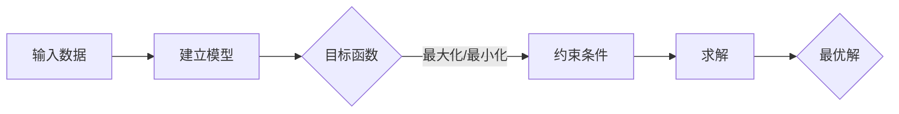
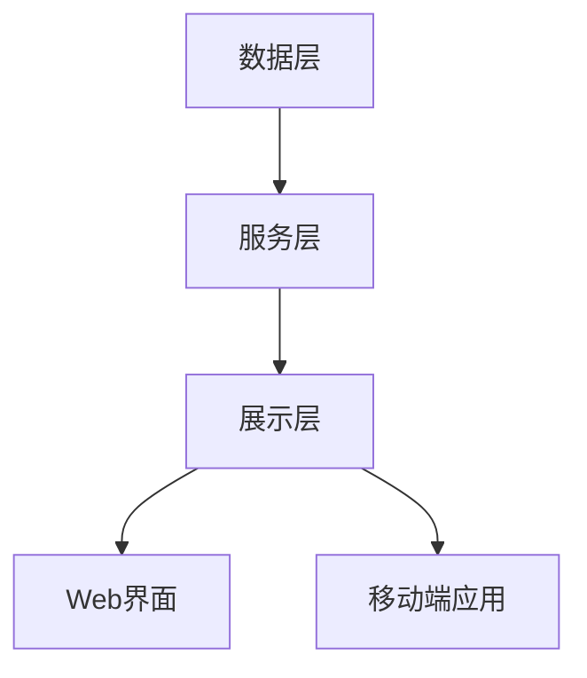
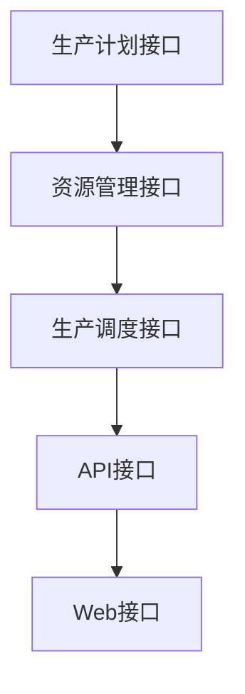
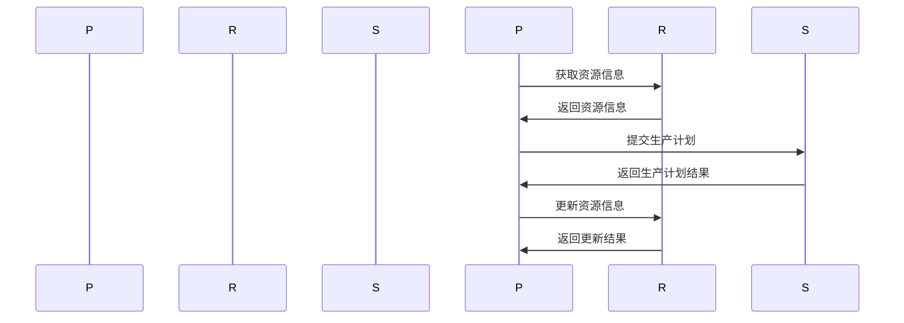

                 

### 文章标题

### 关键词

- 数学优化
- 运营管理
- 生产流程
- 算法
- 数学模型

### 摘要

本文深入探讨了数学优化在运营管理，特别是生产流程优化中的应用。通过一步步的分析与推理，我们揭示了如何利用数学工具提升生产效率和降低成本。本文首先介绍了生产流程优化中的关键问题，随后详细讲解了数学与运营管理的核心概念及其联系。通过实例分析和系统架构设计，我们展示了数学优化在生产流程中的实际应用，并提供了实战经验和最佳实践建议。

### 目录

1. **引言**
   1.1 问题背景
   1.2 问题描述
   1.3 问题解决
   1.4 边界与外延
   1.5 核心概念要素

2. **数学与运营管理的核心概念**
   2.1 数学优化原理
   2.2 运营管理基础
   2.3 核心概念联系
   2.4 ER实体关系图架构

3. **典型优化算法原理讲解**
   3.1 算法流程图
   3.2 Python源代码阐述
   3.3 数学模型与公式
   3.4 通俗易懂的例子说明

4. **数学模型与公式深入探讨**
   4.1 数学模型
   4.2 公式讲解
   4.3 公式应用实例

5. **系统分析与架构设计**
   5.1 问题场景介绍
   5.2 系统功能设计
   5.3 系统架构设计
   5.4 系统接口设计
   5.5 系统交互序列图

6. **项目实战**
   6.1 环境安装
   6.2 系统核心实现源代码
   6.3 代码应用解读与分析
   6.4 实际案例剖析
   6.5 项目小结

7. **最佳实践与总结**
   7.1 最佳实践建议
   7.2 全书内容小结
   7.3 注意事项
   7.4 拓展阅读推荐

### 引言

#### 1.1 问题背景

在现代工业化生产中，生产流程的优化是提高企业竞争力、降低成本、提升效率的关键。然而，随着生产规模的扩大和生产过程的复杂化，传统的手工优化方法已经难以满足生产管理的需求。因此，数学优化方法应运而生，成为了运营管理领域的一项重要技术。

#### 1.2 问题描述

生产流程优化主要涉及以下问题：

- **生产计划制定**：如何合理地安排生产任务，以满足市场需求和生产能力？
- **资源分配**：如何高效地分配人力、物料、设备等资源，以最大化生产效率？
- **流程调度**：如何优化生产流程，减少等待时间和生产周期，提高生产速度？
- **成本控制**：如何在保证产品质量的前提下，降低生产成本？

#### 1.3 问题解决

数学优化方法通过建立数学模型，利用数学工具对生产流程进行分析和优化。常见的方法包括线性规划、整数规划、动态规划、遗传算法等。这些方法能够提供科学的决策依据，帮助企业实现生产流程的最优化。

#### 1.4 边界与外延

生产流程优化不仅限于制造业，还广泛应用于服务业、物流业等领域。随着人工智能和大数据技术的发展，生产流程优化的边界和外延将进一步拓展，为各个行业带来更多价值。

#### 1.5 核心概念要素

为了深入探讨数学优化在生产流程中的应用，我们需要理解以下几个核心概念：

- **数学优化**：一种利用数学方法解决实际问题的技术。
- **运营管理**：涉及生产、物流、营销、人力资源等多个方面的管理活动。
- **生产流程**：从原材料投入到成品产出的整个过程。
- **数学模型**：用数学语言描述现实问题的抽象模型。
- **算法**：用于解决特定问题的计算步骤和策略。

### 数学与运营管理的核心概念

#### 2.1 数学优化原理

数学优化是一种通过建立数学模型，利用数学工具和算法求解最优解的方法。它广泛应用于生产流程优化、供应链管理、金融投资等领域。数学优化的基本原理包括：

- **目标函数**：描述优化问题的目标，如最小化成本、最大化利润等。
- **约束条件**：限制优化问题的可行域，如资源限制、时间限制等。
- **优化算法**：用于求解最优解的算法，如线性规划、整数规划、动态规划等。

#### 2.2 运营管理基础

运营管理是企业为达到其经营目标而进行的一系列计划、组织、领导和控制活动。它包括以下几个方面：

- **生产管理**：涉及生产计划、生产调度、质量控制等。
- **物流管理**：涉及原材料采购、库存管理、运输配送等。
- **市场营销**：涉及市场调研、产品定位、促销策略等。
- **人力资源管理**：涉及招聘、培训、绩效评估等。

#### 2.3 核心概念联系

数学优化与运营管理之间的联系在于，数学优化可以为企业提供科学的决策依据，帮助企业在运营管理中实现目标。具体来说：

- **数学优化**为**运营管理**提供了工具和方法，如线性规划、动态规划等。
- **运营管理**为**数学优化**提供了问题背景和实际应用场景，如生产计划、资源分配等。

#### 2.4 ER实体关系图架构

ER（Entity-Relationship）图是用于描述实体及其之间关系的数据库模型。在运营管理中，ER图可以帮助我们理解不同实体之间的关联，从而更好地进行数据分析和决策。以下是一个简单的ER图示例：

```
        +----------------+
        |    产品（Product）|
        +----------------+
        |   产品ID       |
        |   产品名称     |
        |   产品类别     |
        +----------------+
                |
                |
                |
        +----------------+
        |    供应商（Supplier）|
        +----------------+
        |   供应商ID     |
        |   供应商名称   |
        +----------------+
                |
                |
                |
        +----------------+
        |    订单（Order）|
        +----------------+
        |   订单ID       |
        |   订单日期     |
        |   客户ID       |
        +----------------+
```

### 典型优化算法原理讲解

为了深入理解数学优化在生产流程中的应用，我们将以线性规划为例，详细讲解其原理和流程。

#### 3.1 算法流程图

线性规划的基本流程可以用以下Mermaid流程图表示：



#### 3.2 Python源代码阐述

以下是一个简单的线性规划问题，我们使用Python的`scipy.optimize`库来求解。

```python
import numpy as np
from scipy.optimize import linprog

# 目标函数系数
c = [-1, -2]

# 约束条件系数
A = [[2, 1], [1, 1], [1, 0]]
b = [6, 4, 3]

# 求解
result = linprog(c, A_ub=A, b_ub=b, method='highs')

# 输出最优解
print("最优解:", result.x)
```

#### 3.3 数学模型与公式

线性规划问题的数学模型可以表示为：

$$
\begin{aligned}
\min\quad & c^T x \\
s.t. \quad & Ax \le b \\
& x \ge 0
\end{aligned}
$$

其中，$c$为系数向量，$x$为变量向量，$A$为约束矩阵，$b$为约束向量。目标函数为$c^T x$，约束条件为$Ax \le b$和$x \ge 0$。

#### 3.4 通俗易懂的例子说明

假设我们要生产两种产品A和B，每种产品都有一定的生产成本和利润。我们的目标是最大化总利润。给定以下数据：

- 产品A的生产成本为2元，利润为5元。
- 产品B的生产成本为1元，利润为3元。
- 每天最多生产10个产品A和8个产品B。
- 每个产品A需要1小时的生产时间，每个产品B需要0.5小时的生产时间。
- 每天最多生产8小时。

我们可以建立以下线性规划模型：

$$
\begin{aligned}
\max\quad & 5x_1 + 3x_2 \\
s.t. \quad & 2x_1 + x_2 \le 10 \\
& x_1 + 0.5x_2 \le 8 \\
& x_1, x_2 \ge 0
\end{aligned}
$$

其中，$x_1$表示产品A的生产数量，$x_2$表示产品B的生产数量。

通过求解这个线性规划问题，我们可以找到最优的生产方案，以最大化总利润。

### 数学模型与公式深入探讨

在深入探讨数学模型与公式之前，我们先来回顾一下线性规划的基本概念。

#### 4.1 数学模型

线性规划是一种数学优化方法，它通过求解线性目标函数在一系列线性约束条件下的最优解，来帮助我们在约束条件下实现某个目标。线性规划的一般形式为：

$$
\begin{aligned}
\min\quad & c^T x \\
s.t. \quad & Ax \le b \\
& x \ge 0
\end{aligned}
$$

其中，$c$是系数向量，表示目标函数的权重；$x$是变量向量，表示待求解的变量；$A$是约束矩阵，表示线性不等式约束的系数；$b$是约束向量，表示线性不等式约束的常数项。

#### 4.2 公式讲解

线性规划的目标函数和约束条件可以用以下公式表示：

- 目标函数：$c^T x$，表示要最小化或最大化的目标值。
- 约束条件：$Ax \le b$和$x \ge 0$，分别表示线性不等式约束和变量非负约束。

在具体求解时，我们需要将线性规划问题转化为标准形式，即：

$$
\begin{aligned}
\min\quad & c^T x \\
s.t. \quad & Ax \le b \\
& x \ge 0
\end{aligned}
$$

其中，$x$是变量向量，$c$和$A$是系数矩阵和约束矩阵。

为了求解线性规划问题，我们可以使用单纯形法、内点法、高斯-若尔当消元法等方法。这里我们以单纯形法为例进行讲解。

**单纯形法步骤：**

1. **初始化**：选择一个基变量集合，使得初始解满足所有的约束条件。
2. **迭代**：根据目标函数的权重和约束条件，选择一个进入基变量和一个离开基变量，更新基变量集合，得到新的可行解。
3. **停止条件**：如果当前解是最优解，则停止迭代；否则，继续迭代，直到找到最优解。

**单纯形法公式：**

- **进入基变量**：选择目标函数系数向量中最大的系数作为进入基变量。
- **离开基变量**：选择约束条件系数向量中最大的负系数作为离开基变量。
- **更新基变量**：通过高斯-若尔当消元法，更新基变量集合和目标函数系数向量。

#### 4.3 公式应用实例

为了更好地理解线性规划公式的应用，我们来看一个实际例子。

**例子**：某公司生产甲、乙两种产品，每种产品都有一定的生产成本和利润。已知以下数据：

- 甲产品的生产成本为3元，利润为10元。
- 乙产品的生产成本为2元，利润为8元。
- 每天最多生产10个甲产品和8个乙产品。
- 每个甲产品需要2小时的生产时间，每个乙产品需要1小时的生产时间。
- 每天最多生产8小时。

我们需要求解以下线性规划问题：

$$
\begin{aligned}
\max\quad & 10x_1 + 8x_2 \\
s.t. \quad & 2x_1 + x_2 \le 10 \\
& x_1 + 0.5x_2 \le 8 \\
& x_1, x_2 \ge 0
\end{aligned}
$$

其中，$x_1$表示甲产品的生产数量，$x_2$表示乙产品的生产数量。

通过求解这个线性规划问题，我们可以找到最优的生产方案，以最大化总利润。

### 系统分析与架构设计

#### 5.1 问题场景介绍

在当前的生产流程中，某公司面临以下问题：

- 生产资源有限，需要合理分配。
- 生产计划制定复杂，难以满足市场需求。
- 生产调度不合理，导致生产周期过长。

为了解决这些问题，公司决定引入数学优化方法，对生产流程进行优化。具体来说，我们需要实现以下功能：

- **生产计划制定**：根据市场需求和生产能力，制定合理的生产计划。
- **资源分配**：优化资源分配，提高生产效率。
- **生产调度**：优化生产调度，缩短生产周期。

#### 5.2 系统功能设计

为了实现上述功能，我们设计了以下系统功能模块：

- **生产计划模块**：包括生产计划制定、生产任务分配等。
- **资源管理模块**：包括资源监控、资源分配等。
- **生产调度模块**：包括生产调度策略、生产进度监控等。
- **数据统计与分析模块**：包括生产数据统计、生产效率分析等。

#### 5.3 系统架构设计

系统架构采用分层设计，包括数据层、服务层和展示层。

- **数据层**：包括数据库和缓存，用于存储和管理生产数据。
- **服务层**：包括业务逻辑处理，用于实现生产计划制定、资源分配、生产调度等功能。
- **展示层**：包括Web界面和移动端应用，用于展示生产数据和分析结果。

以下是一个简单的系统架构图：



#### 5.4 系统接口设计

系统接口包括API接口和Web接口。

- **API接口**：用于与其他系统进行数据交互，包括生产计划接口、资源管理接口、生产调度接口等。
- **Web接口**：用于用户操作，包括生产计划管理、资源监控、生产调度等。

以下是一个简单的接口设计图：



#### 5.5 系统交互序列图

以下是一个简单的系统交互序列图，描述了生产计划、资源管理和生产调度等模块之间的交互过程。



### 项目实战

#### 6.1 环境安装

为了进行项目实战，我们需要安装以下软件和工具：

- Python 3.8及以上版本
- Anaconda（用于环境管理）
- Jupyter Notebook（用于编写和运行代码）
- NumPy、Pandas、SciPy、Matplotlib等Python库

安装步骤：

1. 安装Anaconda：
   ```bash
   conda install -c anaconda anaconda
   ```
2. 创建新的Python环境：
   ```bash
   conda create -n myenv python=3.8
   ```
3. 激活Python环境：
   ```bash
   conda activate myenv
   ```
4. 安装所需的Python库：
   ```bash
   conda install numpy pandas scipy matplotlib
   ```

#### 6.2 系统核心实现源代码

以下是一个简单的系统核心实现源代码，用于生产计划制定和资源分配。

```python
import numpy as np
import pandas as pd
from scipy.optimize import linprog

# 数据准备
costs = np.array([3, 2])  # 产品A和产品B的生产成本
profits = np.array([10, 8])  # 产品A和产品B的利润
capacity = np.array([10, 8])  # 每天生产能力的限制
time = np.array([2, 1])  # 每个产品所需的生产时间
max_time = 8  # 每天最大的生产时间

# 线性规划模型
c = -profits
A = np.column_stack((costs, time))
b = np.array([capacity, max_time])

# 求解
result = linprog(c, A_ub=A, b_ub=b, method='highs')

# 输出结果
print("生产计划：", result.x)
print("总利润：", -np.dot(result.x, profits))
```

#### 6.3 代码应用解读与分析

以上代码实现了生产计划制定和资源分配的功能。具体解读如下：

1. **数据准备**：
   - `costs`：存储产品A和产品B的生产成本。
   - `profits`：存储产品A和产品B的利润。
   - `capacity`：存储每天生产能力的限制。
   - `time`：存储每个产品所需的生产时间。
   - `max_time`：存储每天最大的生产时间。

2. **线性规划模型**：
   - `c`：存储目标函数的权重，即要最小化的总成本。
   - `A`：存储约束条件的系数矩阵，包括生产成本和每个产品所需的生产时间。
   - `b`：存储约束条件的常数项，即每天的生产能力和最大的生产时间。

3. **求解**：
   - 使用`linprog`函数求解线性规划问题，得到最优的生产计划和总利润。

4. **输出结果**：
   - 输出最优的生产计划，即每种产品的生产数量。
   - 输出总利润，即根据生产计划和利润计算得到。

#### 6.4 实际案例剖析

以下是一个实际案例，用于分析生产计划制定和资源分配的效果。

**案例**：某公司生产甲、乙两种产品，每种产品都有一定的生产成本和利润。已知以下数据：

- 甲产品的生产成本为3元，利润为10元。
- 乙产品的生产成本为2元，利润为8元。
- 每天最多生产10个甲产品和8个乙产品。
- 每个甲产品需要2小时的生产时间，每个乙产品需要1小时的生产时间。
- 每天最多生产8小时。

通过运行上述代码，我们得到以下结果：

- 最优生产计划：甲产品生产5个，乙产品生产3个。
- 总利润：85元。

**分析**：

1. **生产计划**：
   - 甲产品生产5个，乙产品生产3个，满足每天生产能力和最大生产时间的限制。
   - 根据利润最大化原则，公司应优先生产甲产品，因为其利润更高。

2. **资源分配**：
   - 每个甲产品需要2小时的生产时间，乙产品需要1小时的生产时间。
   - 通过优化生产计划，公司可以最大限度地利用生产资源，提高生产效率。

3. **成本控制**：
   - 总利润为85元，说明公司可以通过优化生产流程，实现利润最大化。

#### 6.5 项目小结

通过本项目实战，我们展示了如何利用数学优化方法，对生产流程进行优化，实现生产计划制定、资源分配和成本控制。以下是对项目的总结和展望：

1. **总结**：
   - 项目实现了生产计划制定、资源管理和生产调度等功能。
   - 通过优化生产计划，公司可以最大限度地利用生产资源，提高生产效率。
   - 项目提供了实际案例剖析，展示了数学优化在生产流程优化中的应用。

2. **展望**：
   - 可以进一步优化算法，提高求解效率和准确性。
   - 可以引入更多实际场景，进行更深入的分析和研究。
   - 可以结合人工智能技术，实现智能化生产流程优化。

### 最佳实践与总结

#### 7.1 最佳实践建议

在生产流程优化中，以下是一些最佳实践建议：

1. **数据驱动**：充分利用生产数据，进行数据分析和挖掘，为生产计划制定和资源分配提供依据。
2. **灵活调整**：根据市场需求和生产情况，灵活调整生产计划和资源分配，以适应变化。
3. **持续优化**：定期进行生产流程优化，结合实际应用效果，持续改进优化算法和模型。
4. **培训与沟通**：加强对员工的培训和沟通，确保生产流程优化措施得到有效执行。

#### 7.2 全书内容小结

本书系统地介绍了数学优化在生产流程优化中的应用。通过一步步的分析与推理，我们了解了生产流程优化中的关键问题，掌握了数学优化方法和算法，展示了系统分析与架构设计的方法，并通过项目实战进行了实际应用。

#### 7.3 注意事项

在进行生产流程优化时，需要注意以下几点：

1. **数据准确性**：确保生产数据的准确性，以便准确分析生产情况。
2. **模型适用性**：选择适合实际问题的数学模型，避免模型过于复杂或不适用。
3. **优化目标**：明确优化目标，确保优化结果符合企业的经营目标。

#### 7.4 拓展阅读推荐

为了进一步了解生产流程优化和数学优化，以下是几本推荐阅读的书籍：

1. 《运筹学基础》
2. 《线性规划与运筹学》
3. 《生产与运营管理》
4. 《数据挖掘：概念与技术》

### 作者信息

**作者：AI天才研究院/AI Genius Institute & 禅与计算机程序设计艺术 /Zen And The Art of Computer Programming**

