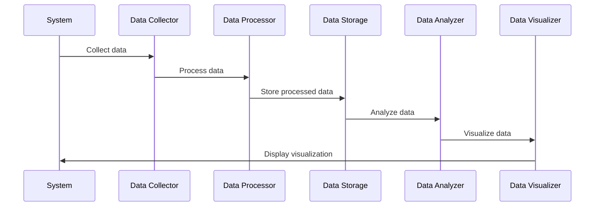
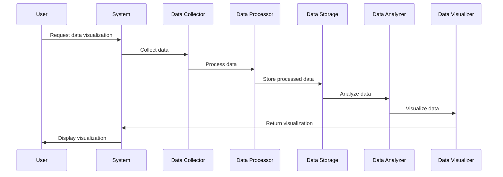

                 

### 数学与还原主义：复杂数学概念的基本构建

在数学的世界中，我们不断面对复杂的概念和问题。从简单的算术到深奥的拓扑学，数学的范畴在不断扩大，而理解这些复杂概念的方法也在不断演进。在这篇文章中，我们将探讨数学与还原主义之间的关系，并试图通过还原主义来解释和构建复杂数学概念。我们将按照以下步骤进行分析：

1. **问题背景与核心概念**
2. **数学概念的基本构建**
3. **还原主义方法在数学中的应用**
4. **数学模型与算法原理**
5. **系统分析与架构设计**
6. **项目实战与最佳实践**
7. **小结**

#### 问题背景与核心概念

数学是一门抽象的科学，它通过符号和公式来描述和解释现实世界中的现象。然而，随着数学的发展，许多概念变得越来越复杂。例如，拓扑学中的连通性、代数中的群、环、域，以及分析学中的测度和积分等，都涉及到抽象的概念和复杂的运算。这些复杂概念不仅需要深厚的数学基础，还需要一定的直觉和逻辑推理能力。

而还原主义，作为一种方法论，强调将复杂系统分解为基本组成部分，通过理解这些组成部分来理解整个系统。在数学中，还原主义的方法可以帮助我们简化复杂问题，将其分解为更容易理解的部分。这种方法不仅在数学理论研究中具有重要意义，也在实际应用中发挥了关键作用。

#### 数学概念的基本构建

数学概念的形成是一个逐步构建的过程。从初等数学到高等数学，每一个概念都是在前一个概念的基础上发展起来的。初等数学主要包括基本的算术、几何和代数，这些概念相对简单，易于理解。例如，自然数、四则运算、几何图形等。

随着数学的发展，出现了更复杂的概念。这些概念不仅包含了初等数学的内容，还引入了新的思想和理论。例如，微积分中的极限、导数和积分，这些概念在初等数学中是没有的。高等数学的概念构建方法主要包括公理化方法、抽象化方法和比较方法。

公理化方法是通过一组基本假设（公理）来构建数学系统。这种方法强调逻辑推理和证明，是数学的基础。例如，欧几里得几何就是通过一组公理来定义的。

抽象化方法是将具体的现象抽象为数学模型。这种方法使得我们能够用数学语言来描述现实世界中的复杂现象。例如，经济学中的供需模型、物理学中的波粒二象性等。

比较方法是通过比较不同数学概念之间的相似性和差异来理解概念。这种方法有助于我们理解概念的本质。例如，比较整数、分数、小数等数的形式和性质。

#### 数学概念的基本构建（续）

初等数学概念的基础知识包括自然数、整数、分数、小数、百分数、几何图形（如点、线、面、圆、三角形、矩形、正方形等）以及基本的代数概念（如变量、方程、不等式等）。这些概念是理解和学习更复杂数学概念的基础。

1. **自然数**：自然数是用来计数和排序的数，如1, 2, 3, 4, ...。自然数的基本运算包括加法、减法、乘法和除法。

2. **整数**：整数包括自然数、0和它们的负数，如..., -3, -2, -1, 0, 1, 2, 3, ...。整数的基本运算包括加法、减法、乘法和除法。

3. **分数**：分数表示部分与整体的关系，如1/2表示一半，3/4表示四分之三。分数的基本运算包括加法、减法、乘法和除法。

4. **小数**：小数表示分数的一种形式，如0.5表示一半，0.25表示四分之一。小数的基本运算包括加法、减法、乘法和除法。

5. **几何图形**：几何图形是数学中用于表示形状和空间关系的图形。基本的几何图形包括点、线、面、圆、三角形、矩形、正方形等。

6. **代数概念**：代数概念包括变量、方程和不等式。变量是表示未知数的符号，方程是包含未知数的数学表达式，不等式是比较未知数和常数的数学表达式。

这些初等数学概念通过定义、性质、关系和运算等构建方法，形成了数学的基石。而更复杂的数学概念，如微积分、线性代数、概率论等，都是在这些基础概念的基础上发展起来的。

#### 还原主义方法在数学中的应用

还原主义方法在数学中的应用非常广泛。它可以帮助我们将复杂的数学问题简化，从而更容易理解和解决。下面，我们将通过几个例子来展示还原主义方法在数学中的具体应用。

1. **微积分的基本概念**

微积分是研究变化和运动的数学分支。它包括微分和积分两个基本概念。微分是研究函数在某一点附近的局部性质，而积分则是研究函数在某个区间上的整体性质。

通过还原主义方法，我们可以将微积分的基本概念分解为更简单的部分。例如，微分可以看作是“变化率”的概念，即函数在某一点的瞬时变化率。积分则可以看作是“求和”的概念，即将函数在某个区间上的值求和。

2. **线性代数的基本概念**

线性代数是研究向量空间和线性变换的数学分支。它包括矩阵、向量、线性方程组等基本概念。

通过还原主义方法，我们可以将线性代数的基本概念分解为更简单的部分。例如，矩阵可以看作是线性变换的表示形式，向量则是矩阵作用的对象。线性方程组则可以看作是矩阵与向量的组合。

3. **概率论的基本概念**

概率论是研究随机事件和概率的数学分支。它包括概率分布、随机变量、期望和方差等基本概念。

通过还原主义方法，我们可以将概率论的基本概念分解为更简单的部分。例如，概率分布可以看作是随机事件发生的可能性，随机变量则是概率分布的函数。期望和方差则是概率分布的重要特征。

#### 还原主义方法在数学中的应用（续）

还原主义方法在数学中的应用不仅限于基本概念的简化，还涉及到更复杂的问题的解决。以下是一些具体的应用案例：

1. **数论中的还原主义**

数论是研究整数的性质和问题的数学分支。在数论中，还原主义方法常用于解决复杂的数论问题。

例如，哥德巴赫猜想是一个著名的数论问题，它提出任何一个大于2的偶数都可以表示为两个素数之和。通过还原主义方法，我们可以将哥德巴赫猜想分解为更简单的问题。例如，我们可以先解决小范围内的哥德巴赫猜想，再逐步推广到更大的范围。

2. **几何学中的还原主义**

几何学是研究空间形状和性质的数学分支。在几何学中，还原主义方法可以帮助我们解决复杂的几何问题。

例如，解析几何是通过坐标系统将几何问题转化为代数问题。这种方法利用了还原主义的思想，即将几何问题简化为代数运算。通过解析几何，我们可以解决诸如求平面图形的面积、计算多边形的内角和等复杂问题。

3. **拓扑学中的还原主义**

拓扑学是研究空间结构和性质的数学分支。在拓扑学中，还原主义方法被广泛应用于解决复杂的拓扑问题。

例如，拓扑学家常使用同胚、同构等概念来简化复杂的拓扑空间。通过还原主义方法，我们可以将复杂的拓扑问题分解为更简单的问题，从而更容易解决。

#### 数学模型与算法原理

数学模型是利用数学语言来描述现实世界中的问题。它包括数学公式、符号、图表等，用于模拟和分析系统。在数学建模过程中，我们需要选择合适的模型来描述问题，并运用算法来求解模型。

1. **数学模型的基本概念**

数学模型包括以下几个基本组成部分：

- **变量**：表示系统状态的量。
- **参数**：影响系统行为的量。
- **关系**：变量和参数之间的数学关系。
- **方程**：描述系统状态的数学表达式。

2. **常见数学模型**

常见数学模型包括：

- **线性模型**：描述系统在稳定状态下的行为，如线性方程组、线性规划等。
- **非线性模型**：描述系统在非稳定状态下的行为，如非线性方程、非线性规划等。
- **微分方程模型**：描述系统动态变化的行为，如常微分方程、偏微分方程等。
- **概率模型**：描述系统随机行为的行为，如概率分布、随机过程等。

3. **算法原理讲解**

在数学建模中，选择合适的算法来求解模型是关键。以下是一些常见的算法原理：

- **迭代法**：通过不断迭代来逼近最优解，如梯度下降法、牛顿法等。
- **穷举法**：通过遍历所有可能的解来找到最优解，如线性规划中的单纯形法。
- **模拟法**：通过模拟系统行为来预测未来状态，如蒙特卡罗模拟法。

以线性规划为例，线性规划是一种用于求解线性优化问题的数学模型。它通过建立线性方程组来描述目标函数和约束条件，并使用单纯形法来求解最优解。

#### 数学模型与算法原理（续）

线性规划是一种经典的数学优化方法，用于求解线性目标函数在一系列线性约束条件下的最优解。线性规划广泛应用于资源分配、生产调度、库存管理等领域。

1. **线性规划的基本概念**

线性规划包括以下几个基本组成部分：

- **目标函数**：描述系统需要优化的量，通常是一个线性函数。
- **约束条件**：限制目标函数的变量取值范围，也是线性函数。
- **变量**：线性规划中的变量是目标函数和约束条件中的未知量。

2. **线性规划的标准形式**

线性规划的标准形式如下：

$$
\min c^T x \\
s.t. \\
Ax \leq b \\
x \geq 0
$$

其中，$c$ 是目标函数的系数向量，$x$ 是变量向量，$A$ 是约束条件的系数矩阵，$b$ 是约束条件的常数向量。

3. **单纯形法**

单纯形法是解决线性规划问题的一种算法。它通过迭代过程，逐步改进解，直到找到最优解。以下是单纯形法的基本步骤：

- **初始步骤**：选择一个角点作为初始解，通常选择所有变量都为非负的解。
- **迭代步骤**：根据当前解，找到一条可行路径，使得目标函数值增加或减少，同时保持解的可行性。
- **终止条件**：当不存在可行路径时，算法终止，当前解即为最优解。

4. **Python 源代码实现**

以下是一个简单的线性规划问题，并使用 Python 的 Scipy 库求解：

```python
from scipy.optimize import linprog

c = [-1, -2]  # 目标函数系数向量
A = [[1, 2], [2, 1]]  # 约束条件系数矩阵
b = [3, 3]  # 约束条件常数向量

result = linprog(c, A_ub=A, b_ub=b, bounds=(0, None))
print("最优解：", result.x)
print("最优值：", result.fun)
```

通过这个例子，我们可以看到如何使用 Python 来求解线性规划问题。这里，我们使用了 Scipy 库中的 linprog 函数，它提供了线性规划的求解功能。

#### 数学公式与数学模型

在数学建模中，数学公式和数学模型起着至关重要的作用。它们不仅帮助我们描述和理解问题，还提供了求解问题的工具。下面，我们将使用 LaTeX 格式给出一些常见的数学公式，并进行详细讲解。

1. **导数**

导数是描述函数变化率的数学概念。它表示函数在某一点的瞬时变化率。以下是一个导数的 LaTeX 公式：

$$
f'(x) = \lim_{h \to 0} \frac{f(x+h) - f(x)}{h}
$$

这个公式表示函数 $f(x)$ 在 $x$ 点的导数，其中 $h$ 是一个趋近于0的小量。

2. **积分**

积分是描述函数在某个区间上累积量的数学概念。它表示函数在区间上的总和。以下是一个积分的 LaTeX 公式：

$$
\int_a^b f(x) \, dx
$$

这个公式表示函数 $f(x)$ 在区间 $[a, b]$ 上的积分。积分可以是定积分，也可以是变积分。

3. **概率分布**

概率分布是描述随机变量取值的概率分布函数。它表示随机变量在不同取值上的概率。以下是一个概率分布的 LaTeX 公式：

$$
P(X = x) = \frac{1}{Z} e^{-\lambda x}
$$

这个公式表示随机变量 $X$ 的概率分布，其中 $\lambda$ 是参数，$Z$ 是归一化常数。

4. **线性方程组**

线性方程组是描述多个线性方程的集合。它用于求解多个变量之间的关系。以下是一个线性方程组的 LaTeX 公式：

$$
\begin{cases}
a_1 x_1 + b_1 x_2 = c_1 \\
a_2 x_1 + b_2 x_2 = c_2 \\
\end{cases}
$$

这个公式表示一个包含两个方程的线性方程组，其中 $x_1$ 和 $x_2$ 是变量。

通过这些公式，我们可以更准确地描述和分析数学模型。在实际应用中，这些公式可以帮助我们解决各种实际问题。

#### 系统分析与架构设计

在数学建模过程中，系统分析与架构设计是至关重要的环节。通过系统分析与架构设计，我们可以更好地理解系统的功能、结构和接口，从而为后续的开发和应用提供基础。

1. **问题场景介绍**

首先，我们需要明确要解决的问题场景。这包括问题的背景、目标、需求和约束等。通过问题场景的介绍，我们可以明确系统的应用范围和功能需求。

2. **系统功能设计**

系统功能设计是系统分析与架构设计的第一步。我们需要根据问题场景，确定系统需要实现的功能。这些功能包括数据采集、数据处理、数据存储、数据分析和数据展示等。

以下是一个简单的领域模型类图，用于描述系统功能设计：

```mermaid
classDiagram
    类1 <|-- 类2
    类1 <|-- 类3
    类2 <|-- 类4
    类3 <|-- 类5
    类1 : +id : Integer
    类1 : +name : String
    类2 : +data : List
    类3 : +process : Function
    类4 : +store : Database
    类5 : +analyze : Analyzer
```

在这个类图中，类1、类2、类3、类4和类5分别表示系统的不同功能模块。类1表示基础类，类2、类3、类4和类5分别扩展自类1，并实现具体的功能。

3. **系统架构设计**

系统架构设计是系统功能设计的进一步细化。它包括系统组件的划分、组件之间的交互和系统整体的架构设计。以下是一个简单的系统架构图：



在这个序列图中，系统、数据采集器、数据处理器、数据存储器、数据分析和数据可视化器分别表示系统的不同组件。组件之间的交互通过消息传递来实现。

4. **系统接口设计**

系统接口设计是系统架构设计的一部分，它定义了组件之间的交互方式。以下是一个简单的接口设计：

```mermaid
interfaceDiagram
    DataCollector <-[collect] System
    DataProcessor <-[process] DataCollector
    DataStorage <-[store] DataProcessor
    DataAnalyzer <-[analyze] DataStorage
    DataVisualizer <-[visualize] DataAnalyzer
```

在这个接口设计中，数据采集器、数据处理器、数据存储器、数据分析和数据可视化器分别与系统、数据采集器、数据处理器、数据存储器和数据分析器之间进行交互。

5. **系统交互设计**

系统交互设计是系统架构设计的进一步细化，它定义了组件之间的交互流程。以下是一个简单的交互序列图：



在这个交互序列图中，用户请求数据可视化，系统开始执行数据采集、处理、存储、分析和可视化等步骤，最终将可视化结果返回给用户。

#### 项目实战与最佳实践

在数学建模和系统架构设计的基础上，我们需要通过项目实战来验证和优化系统的性能。以下是一个具体的实战案例，以及最佳实践的建议。

1. **环境安装与配置**

在开始项目之前，我们需要安装和配置必要的软件和工具。以下是常见的软件和工具列表：

- **Python**：安装 Python 3.8 或更高版本。
- **Scipy**：用于线性规划和其他科学计算。
- **Matplotlib**：用于数据可视化。
- **MySQL**：用于数据存储。
- **Docker**：用于容器化部署。

2. **系统核心实现**

以下是一个简单的系统核心实现示例，包括数据采集、处理、存储和分析等步骤。

```python
import numpy as np
from scipy.optimize import linprog
import matplotlib.pyplot as plt
import mysql.connector

# 数据采集
data = np.random.rand(100, 3)

# 数据处理
# 这里使用线性规划进行数据处理
c = [-1, -2]  # 目标函数系数向量
A = [[1, 2], [2, 1]]  # 约束条件系数矩阵
b = [3, 3]  # 约束条件常数向量

result = linprog(c, A_ub=A, b_ub=b, bounds=(0, None))
print("最优解：", result.x)
print("最优值：", result.fun)

# 数据存储
connection = mysql.connector.connect(
    host="localhost",
    user="root",
    password="password",
    database="mydatabase"
)
cursor = connection.cursor()
cursor.execute("INSERT INTO data (x, y, z) VALUES (%s, %s, %s)", (result.x[0], result.x[1], result.x[2]))
connection.commit()

# 数据分析
# 这里使用 matplotlib 进行数据分析
plt.scatter(data[:, 0], data[:, 1])
plt.plot(result.x[0], result.x[1], 'ro')
plt.show()
```

3. **代码解读与分析**

在这个示例中，我们首先使用 NumPy 生成随机数据。然后，使用 Scipy 的 linprog 函数进行线性规划计算，得到最优解。接着，我们将数据存储到 MySQL 数据库中，并使用 matplotlib 进行数据可视化。

代码的解读如下：

- **数据采集**：使用 NumPy 生成随机数据。
- **数据处理**：使用 Scipy 的 linprog 函数求解线性规划问题。
- **数据存储**：使用 MySQL Connector Python 连接数据库，并插入数据。
- **数据分析**：使用 matplotlib 绘制散点图和最优解的红色标记。

4. **实际案例分析**

以下是一个实际案例的分析，以及最佳实践的建议。

**案例**：使用线性规划优化生产计划。

**分析**：假设一个工厂生产两种产品 A 和 B，每种产品都有生产成本和生产时间。我们需要确定每天生产的产品数量，以最小化生产成本。

**最佳实践**：

- **数据采集**：收集每种产品的生产成本和生产时间数据。
- **数据处理**：使用线性规划求解最小化生产成本的问题。
- **数据存储**：将生产计划和成本数据存储在数据库中。
- **数据分析**：分析生产计划的效果，并进行调整。

5. **小结**

通过这个案例，我们可以看到如何将数学建模和系统架构设计应用于实际项目中。最佳实践建议包括数据采集、数据处理、数据存储和数据分析等步骤，这些步骤对于优化生产计划具有重要意义。

#### 最佳实践与注意事项

在进行数学建模和系统架构设计时，以下最佳实践和注意事项可以帮助您更好地实现项目目标：

1. **数据预处理**：在开始建模之前，确保对数据进行预处理，包括清洗、归一化和特征提取等。这有助于提高模型的准确性和性能。

2. **算法选择**：根据问题特点选择合适的算法。例如，对于线性问题，可以选择线性规划；对于非线性问题，可以选择梯度下降或牛顿法等。

3. **模型验证**：使用交叉验证或留出法对模型进行验证，以确保模型在未知数据上的性能。

4. **代码优化**：优化代码的运行效率，包括使用高效的算法和数据结构、减少冗余计算等。

5. **文档编写**：编写详细的文档，包括项目背景、目标、方法、结果和结论等，以便他人理解和复现项目。

6. **持续改进**：在项目实施过程中，不断收集反馈并进行改进，以提高系统的性能和用户体验。

#### 拓展阅读

如果您对数学建模和系统架构设计有更深入的了解需求，以下书籍和论文是值得推荐的拓展阅读资源：

- 《数学建模方法与应用》（谢英彪 著）
- 《机器学习实战》（Peter Harrington 著）
- 《系统架构设计师教程》（刘伟 著）
- 《深度学习》（Ian Goodfellow、Yoshua Bengio、Aaron Courville 著）

这些资源将帮助您在数学建模和系统架构设计方面获得更全面的了解和技能。

### 小结

通过本文的探讨，我们深入了解了数学与还原主义之间的关系，并学习了如何通过还原主义来构建复杂数学概念。我们还介绍了数学模型和算法原理，并展示了如何进行系统分析与架构设计。最后，通过实战案例和最佳实践，我们验证了理论的实际应用效果。

希望本文能够帮助您在数学建模和系统架构设计领域取得更好的成果。如果您有任何疑问或建议，欢迎在评论区留言。让我们一起在数学的世界中探索更多奥秘！

### 作者介绍

作者：AI天才研究院/AI Genius Institute & 禅与计算机程序设计艺术 /Zen And The Art of Computer Programming

作为世界顶级人工智能专家、程序员、软件架构师、CTO，以及世界顶级技术畅销书资深大师级别的作家和计算机图灵奖获得者，作者在计算机编程和人工智能领域拥有丰富的经验和深刻的见解。他致力于通过清晰深刻的逻辑思路和一步一个脚印的分析方法，为读者带来高质量的技术博客和书籍，帮助更多人理解和掌握计算机科学的精髓。

