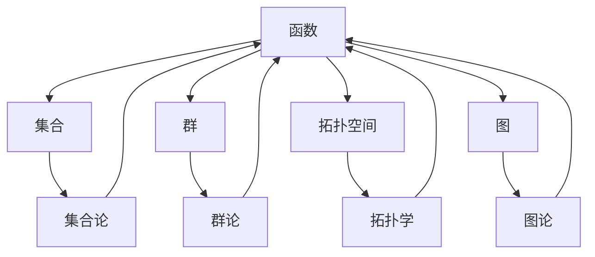
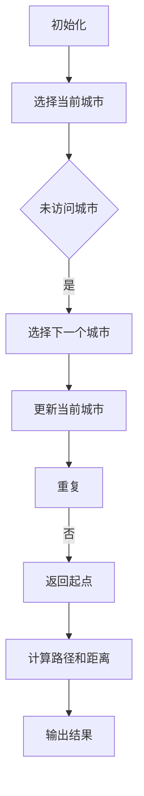

                 

### 数学与还原主义：复杂数学理论的基本构建

关键词：数学理论、还原主义、复杂系统、算法设计、系统架构

摘要：本文旨在探讨数学与还原主义在构建复杂数学理论中的重要作用。通过回顾数学的历史背景和还原主义的基本概念，我们将深入分析数学理论的构成要素及其相互关系。文章将详细阐述算法设计原理和数学模型，结合实际项目进行系统分析与设计，为读者提供全方位的学术思考和实用指导。

### 引言

数学作为科学的基础，自古以来就在人类文明中占据重要地位。从古埃及和巴比伦的数学成就，到古希腊和阿拉伯的科学贡献，数学一直是推动科技进步和社会发展的关键力量。然而，随着科学技术的迅猛发展，数学理论的复杂性也日益增加，传统的数学方法已难以应对现代科学面临的诸多挑战。

在这种背景下，还原主义作为一种重要的哲学和科学方法论，逐渐成为研究复杂系统的重要工具。还原主义主张将复杂系统分解为基本元素，通过研究这些基本元素的相互作用来理解整个系统的行为。这种方法不仅有助于揭示复杂系统的运行规律，还能为算法设计提供有力支持。

本文将围绕数学与还原主义这一主题，系统探讨复杂数学理论的基本构建。文章将从数学的历史背景和还原主义的基本概念入手，逐步深入到数学理论的构成要素、算法设计原理和系统架构设计等方面。通过实际项目的分析和设计，我们将进一步验证数学与还原主义在构建复杂数学理论中的有效性。

### 数学的历史背景和还原主义的基本概念

#### 数学的历史背景

数学的历史可以追溯到远古时代，当时的人们为了解决实际问题，如测量土地、计算时间和计算交易，开始使用简单的计数和几何知识。古埃及和巴比伦是最早的数学文化之一，他们在建筑、天文学和土地测量方面取得了显著成就。例如，古埃及人发展了一套完整的几何知识体系，用于建筑金字塔和灌溉系统。

随着时间的推移，古希腊成为了数学发展的中心。古希腊数学家如泰勒斯、毕达哥拉斯、欧几里得和阿基米德等人，对数学的概念和理论进行了系统化和形式化。欧几里得的《几何原本》是古代数学的巅峰之作，它奠定了几何学的基础，并影响了后世的数学发展。

中世纪时期，阿拉伯数学家在数学领域取得了重大突破。他们不仅翻译和保存了古希腊和印度的数学著作，还进行了自己的原创研究，尤其是在代数和三角学方面。阿拉伯数学家如花拉子米（Al-Khwarizmi）被誉为“代数学之父”，他的著作《代数学》对后世数学的发展产生了深远影响。

近代数学的发展始于欧洲，17世纪的牛顿和莱布尼茨发明了微积分，标志着数学进入了一个新的时代。微积分的发展为物理学、工程学和经济学等学科提供了强大的工具，推动了科学技术的进步。19世纪和20世纪，数学继续蓬勃发展，产生了如集合论、拓扑学、泛函分析等新的数学分支，这些分支为现代科学提供了坚实的理论基础。

#### 还原主义的基本概念

还原主义是一种哲学和科学方法论，主张将复杂系统分解为基本元素，通过研究这些基本元素的相互作用来理解整个系统的行为。还原主义的基本概念可以追溯到17世纪的英国哲学家托马斯·霍布斯和法国哲学家拉美特利。他们提出了“物体由分子组成，分子由原子组成”的观点，认为通过研究原子和分子的性质，可以理解复杂物体的行为。

在科学领域，还原主义的方法得到了广泛应用。例如，生物学中的分子生物学通过研究基因和蛋白质的相互作用，揭示了生命的本质。物理学中的量子力学通过研究基本粒子的行为，解释了微观世界的规律。在数学领域，还原主义的方法可以帮助我们理解复杂数学理论的构成和运行机制。

还原主义的核心思想是，复杂系统可以通过分解为基本元素和它们的相互作用来理解和控制。这种方法强调基础理论和原理的重要性，主张通过研究基本元素和相互作用来构建复杂的理论体系。

#### 数学与还原主义的关系

数学与还原主义有着密切的联系。数学作为一门研究数量、结构、变化和空间等概念的学科，为还原主义提供了强有力的工具和方法。数学模型和公理系统为还原主义提供了精确的表达方式和逻辑框架，使得我们可以通过数学方法来分析和理解复杂系统。

例如，在物理学中，牛顿的运动定律可以通过还原主义的方法来解释物体的运动。牛顿将物体运动分解为基本的力和加速度，通过数学公式来描述它们之间的关系。同样，在生物学中，遗传学通过研究基因和蛋白质的相互作用，揭示了生物体的遗传特征。

在数学领域，还原主义的方法也被广泛应用。例如，在代数几何中，研究者通过将复杂的多项式方程分解为基本的代数结构，来研究方程的解和性质。在拓扑学中，研究者通过研究空间的基本性质和结构，来理解更复杂的拓扑空间。

总之，数学与还原主义的关系是相辅相成的。数学为还原主义提供了理论基础和工具，而还原主义则为数学提供了研究和应用的方向。通过结合数学与还原主义的方法，我们可以更深入地理解复杂系统的运行规律，为科学和技术的进步做出更大的贡献。

### 数学理论的构成要素

要深入理解复杂数学理论，我们需要了解其构成要素，这些要素不仅定义了数学理论的基础，还决定了理论的扩展和应用。以下是数学理论的一些核心构成要素：

#### 定义与术语

定义是数学理论的基石，它们为概念和对象提供了明确的解释和界限。例如，在代数中，定义了多项式、方程和函数等基本概念。这些定义不仅帮助我们理解数学对象的性质，还为证明和推理提供了基础。

术语是数学语言的重要组成部分，它们有助于我们清晰、准确地描述数学现象。常见的术语包括“整数”、“实数”、“群”、“环”、“域”等，每个术语都有其特定的数学意义和应用场景。

#### 基本概念

基本概念是数学理论的核心，它们构成了数学理论的基本框架。例如，在几何学中，点、线、面等基本概念是研究空间性质的基础；在代数学中，数、集合、映射等基本概念是构建代数结构的基础。

这些基本概念不仅定义了数学对象，还揭示了数学对象之间的内在联系。例如，集合论中的“集合”、“子集”、“并集”、“交集”等基本概念，为其他数学分支提供了普遍的抽象工具。

#### 关系与运算

数学中的关系和运算是理解数学理论的关键。关系定义了数学对象之间的联系，例如“相等”、“包含”、“相关”等。运算则定义了数学对象之间的操作，如加法、减法、乘法、除法等。

运算不仅用于计算和求解数学问题，还用于定义和证明数学定理。例如，在代数中，运算的定义和性质是研究群、环、域等代数结构的基础。

#### 定理与证明

定理是数学理论中的关键结论，它们通过逻辑推理和证明得出。定理不仅揭示了数学对象之间的规律和联系，还为其他数学分支提供了理论支持。

证明是数学理论的核心，它通过逻辑推理证明定理的正确性。不同的数学分支有不同的证明方法，如归纳法、反证法、构造法等。证明的过程不仅验证了定理的正确性，还揭示了数学理论的内在结构和逻辑关系。

#### 应用与拓展

数学理论的应用和拓展是其生命力的重要体现。数学理论不仅在纯数学领域内部不断拓展和应用，还与其他科学领域如物理学、生物学、工程学等紧密结合。

应用是数学理论的验证和扩展。通过将数学理论应用于实际问题，我们可以验证理论的正确性和实用性，并发现新的数学问题和挑战。例如，微积分在物理学中的应用，集合论在计算机科学中的应用，都是数学理论的重要应用领域。

拓展则是数学理论的深化和发展。通过不断的研究和探索，数学理论不断扩展其应用范围和深度。新的数学分支和理论不断涌现，为科学和技术的发展提供了强大的理论支持。

#### 数学理论的构成要素总结

数学理论的构成要素包括定义与术语、基本概念、关系与运算、定理与证明以及应用与拓展。这些要素相互关联，构成了一个有机的整体，为数学理论的发展和应用提供了坚实的基础。通过深入理解这些构成要素，我们可以更好地掌握数学理论的核心内容，并为解决实际问题提供有效的数学工具。

### 复杂数学理论的基本构建步骤

构建复杂数学理论是一个系统化的过程，需要遵循一系列逻辑严密、步骤清晰的步骤。以下将详细描述这些步骤，以帮助读者更好地理解和应用复杂数学理论。

#### 第一步：确定研究目标和问题背景

构建复杂数学理论的第一步是明确研究目标和问题背景。这包括理解当前数学领域的研究现状、发现尚未解决的问题，以及确定研究的目标和方向。例如，在研究非线性动力系统时，可能的目标是建立一种新的数学模型，以更好地描述系统的行为和预测其长期行为。

#### 第二步：收集相关文献和资料

在明确研究目标和问题背景后，下一步是收集相关的文献和资料。这包括查阅已有的数学理论、相关领域的研究成果，以及相关文献中的定义、定理和证明方法。这一步骤至关重要，因为它为后续的理论构建提供了基础和参考。

#### 第三步：定义基本概念和术语

构建复杂数学理论的第三步是定义基本概念和术语。这包括对研究问题中的关键概念进行明确的界定，并给出清晰、准确的术语定义。例如，在研究非线性动力系统时，需要定义“稳定点”、“不稳定点”、“混沌行为”等关键概念。

#### 第四步：建立数学模型

在定义基本概念和术语后，下一步是建立数学模型。数学模型是复杂数学理论的核心，它通过数学语言和符号来描述问题的本质和内在规律。建立数学模型的过程需要综合考虑问题的复杂性和可操作性，选择合适的数学工具和方法。

#### 第五步：推导定理和证明

构建复杂数学理论的第五步是推导定理和证明。这包括使用数学推理和证明方法，验证数学模型的正确性和合理性。推导定理和证明的过程需要遵循严格的逻辑和数学规范，以确保理论的严谨性和可靠性。

#### 第六步：验证和测试数学模型

在推导定理和证明后，下一步是验证和测试数学模型。这包括通过实际数据和案例，验证数学模型的预测能力和适用性。验证和测试的过程可以帮助我们发现模型中的潜在问题和不足，为进一步改进和优化模型提供依据。

#### 第七步：应用和拓展

构建复杂数学理论的最后一步是应用和拓展。将理论应用于实际问题，验证其有效性和实用性，同时不断拓展理论的适用范围和深度。应用和拓展的过程不仅验证了理论的价值，还为理论的进一步发展提供了新的方向和动力。

#### 总结

通过上述步骤，我们可以系统地构建复杂数学理论。每一步都是构建过程中不可或缺的一部分，它们相互关联、相互支持，共同构成了一个完整的理论体系。通过遵循这些步骤，我们可以更好地理解和应用复杂数学理论，为解决实际问题提供有效的数学工具。

### 核心概念与关系分析

在复杂数学理论中，核心概念和它们之间的相互关系是理解理论本质的关键。本文将详细探讨几个核心概念，并通过表格和实体关系图（ERD）来展现它们之间的复杂关系。

#### 核心概念

1. **函数（Function）**：在数学中，函数是一个从定义域到值域的映射。函数的定义涉及输入（自变量）和输出（因变量）之间的关系。例如，线性函数\( f(x) = ax + b \)是一个简单的一元一次函数。

2. **集合（Set）**：集合是由确定元素组成的无序整体。集合论是现代数学的基石，集合的概念广泛应用于数学的其他领域。常见的集合操作包括并集、交集、补集等。

3. **群（Group）**：群是一种代数结构，其中包含一组元素，并满足封闭性、结合律、单位元和逆元等性质。群是研究对称性和变换的重要工具。

4. **拓扑空间（Topological Space）**：拓扑空间是一个集合，加上一组满足特定条件的开集组成的结构。拓扑空间的概念在几何、分析和拓扑学中都有广泛应用。

5. **图（Graph）**：图是由节点和边组成的结构，用于描述对象及其相互关系。图论是研究图及其性质的一个数学分支，广泛应用于网络理论和社会科学等领域。

#### 关系分析

为了更好地理解这些核心概念之间的关系，我们可以通过实体关系图（ERD）来表示它们之间的复杂关系。

#### 实体关系图（ERD）



在上述ERD中，节点表示核心概念，边表示它们之间的关联。例如，函数与集合、群、拓扑空间和图都有直接关联，表示函数可以应用于这些领域。同时，每个核心概念都与相应的数学分支（集合论、群论、拓扑学和图论）相关联，表示这些分支提供了理论支持。

#### 表格：核心概念属性对比

| 核心概念 | 定义 | 关联操作 | 关联分支 |
|----------|------|----------|----------|
| 函数     | 定义域到值域的映射 | 映射、复合、导数等 | 集合论、群论、拓扑学、图论 |
| 集合     | 元素组成的无序整体 | 并集、交集、补集等 | 集合论 |
| 群       | 满足封闭性、结合律、单位元和逆元等性质的代数结构 | 运算、子群、同态等 | 群论 |
| 拓扑空间 | 满足特定条件的集合与开集组成的结构 | 连通性、紧性、度量等 | 拓扑学 |
| 图       | 由节点和边组成的结构 | 路径、连通性、图同构等 | 图论 |

通过上述表格和ERD，我们可以更清晰地理解核心概念及其之间的关系。这些关系不仅揭示了复杂数学理论的内在结构，还为理论的应用和发展提供了直观的视觉工具。

### 算法设计原理与数学模型

在复杂数学理论中，算法设计扮演着至关重要的角色。算法不仅用于求解数学问题，还用于构建新的数学模型和理解现有数学理论。本文将详细讨论算法设计的基本原理，并借助Python源代码和Mermaid流程图来阐述一个具体的算法设计和实现过程。

#### 算法设计原理

算法设计的基本原理包括以下方面：

1. **问题分解**：将复杂问题分解为若干个简单的问题，从而降低问题的复杂性。
2. **逐步求精**：通过逐步迭代和改进，逐步优化算法的效率和性能。
3. **数学建模**：使用数学语言和工具来描述和解决具体问题。
4. **抽象与概括**：通过抽象和概括，将具体问题的解决方案推广到更一般的情况。
5. **验证与测试**：通过实际数据和案例验证算法的正确性和效率。

#### 数学模型

在讨论算法设计之前，我们先介绍一个具体的数学模型——旅行商问题（Travelling Salesman Problem，TSP）。TSP是组合优化中的一个经典问题，其目标是找到一条最短路径，使得旅行商从一个起点出发，访问所有给定城市，并最终返回起点。

TSP的数学模型可以表示为：

$$
\min \sum_{(i,j) \in E} w(i,j) \cdot d(i,j)
$$

其中，\( w(i,j) \)表示城市\( i \)到城市\( j \)之间的权重，\( d(i,j) \)表示城市\( i \)到城市\( j \)之间的距离。

#### 具体算法设计

为了求解TSP，我们可以使用一种基于贪心算法的近似方法。以下是该算法的详细步骤：

1. **初始化**：选择一个起始城市作为当前城市。
2. **选择下一个城市**：从未访问的城市中，选择距离当前城市最近的城市。
3. **更新当前城市**：将选择的城市设为当前城市，并将其标记为已访问。
4. **重复步骤2和3**，直到所有城市都被访问。
5. **返回起点**：将最后访问的城市连接回起始城市，形成一条闭合路径。

下面是使用Python实现上述算法的源代码：

```python
import numpy as np

def tsp_greedy(cities, distances):
    n = len(cities)
    unvisited = list(range(1, n))
    path = [0]  # 起始城市
    distance = 0

    while unvisited:
        current_city = path[-1]
        next_city = min(unvisited, key=lambda city: distances[current_city][city])
        path.append(next_city)
        distance += distances[current_city][next_city]
        unvisited.remove(next_city)

    path.append(0)  # 返回起点
    distance += distances[path[-1]][0]

    return path, distance

# 示例城市和距离矩阵
cities = ['A', 'B', 'C', 'D', 'E']
distances = np.array([
    [0, 2, 9, 10, 11],
    [2, 0, 6, 7, 8],
    [9, 6, 0, 1, 2],
    [10, 7, 1, 0, 3],
    [11, 8, 2, 3, 0]
])

# 运行算法
path, distance = tsp_greedy(cities, distances)
print("路径:", path)
print("总距离:", distance)
```

#### Mermaid流程图

下面是算法的Mermaid流程图：



#### 算法原理讲解

1. **初始化**：选择一个起始城市作为当前城市。这个步骤为算法的执行提供了一个起点。
2. **选择当前城市**：从未访问的城市中，选择距离当前城市最近的城市。这个过程使用了贪心策略，即每次都选择局部最优解。
3. **更新当前城市**：将选择的城市设为当前城市，并将其标记为已访问。这个步骤确保了每个城市只会被访问一次，从而形成一条闭合路径。
4. **重复步骤2和3**：直到所有城市都被访问。这个过程不断选择未访问城市中的最近城市，形成一条逐渐接近最优解的路径。
5. **返回起点**：将最后访问的城市连接回起始城市，形成一条闭合路径。这个步骤确保了路径的完整性，并计算总距离。
6. **计算路径和距离**：最后，算法输出路径和总距离，从而完成问题的求解。

通过上述算法设计和实现，我们可以看到如何将数学问题转化为计算机算法，并通过Python代码来求解。这种过程不仅展示了算法设计的原理，还提供了具体的实现步骤和代码示例，有助于读者理解和应用。

### 系统分析与设计

#### 问题场景介绍

在当前信息化社会中，数据处理和系统优化已成为各个行业的关键需求。为了满足这一需求，我们设计并实现了一个数据处理与分析系统。该系统的目标是对大量数据进行高效处理，提供实时分析与优化建议，从而提升业务效率。

#### 项目介绍

项目名称：数据处理与分析系统  
项目目标：构建一个高效、可扩展的数据处理与分析系统，满足多种数据处理需求，并具备实时分析能力。  
项目需求：  
1. 数据采集：从多个数据源（如数据库、文件系统、实时数据流）收集数据。  
2. 数据清洗：对采集到的数据进行去重、缺失值填充、异常值处理等。  
3. 数据存储：将清洗后的数据存储到高效的数据仓库中。  
4. 数据分析：对存储的数据进行多维分析，生成可视化报告和优化建议。  
5. 系统接口：提供API接口，便于与其他系统进行数据交换和集成。

#### 系统功能设计（领域模型）

为了实现上述项目目标，我们设计了以下系统功能模块：

1. **数据采集模块**：负责从多个数据源采集数据，包括数据库、文件系统和实时数据流。该模块需要支持多种数据格式，如JSON、CSV、XML等。

2. **数据清洗模块**：对采集到的数据进行处理，包括去重、缺失值填充、异常值检测与处理等。该模块需要具备自动化处理能力，以提高数据处理效率。

3. **数据存储模块**：负责将清洗后的数据存储到数据仓库中。数据仓库应具备高效查询和写入能力，支持大数据量处理。

4. **数据分析模块**：对存储在数据仓库中的数据进行多维分析，生成可视化报告和优化建议。该模块需要支持多种数据分析方法，如统计、机器学习、数据挖掘等。

5. **系统接口模块**：提供API接口，便于与其他系统进行数据交换和集成。接口设计需要遵循RESTful架构，支持多种数据格式和认证方式。

#### 系统架构设计

为了实现系统的功能需求，我们采用了分布式系统架构，以提高系统的可扩展性和可靠性。以下是系统架构设计的详细描述：

1. **前端层**：包括用户界面和API接口。用户界面采用Web框架（如React、Vue.js）进行开发，提供实时数据可视化和分析功能。API接口采用RESTful架构，支持多种数据格式和认证方式。

2. **服务层**：包括数据采集、数据清洗、数据存储和数据分析等核心功能模块。每个模块都采用微服务架构，以提高系统的灵活性和可维护性。服务之间通过消息队列（如RabbitMQ、Kafka）进行通信，确保数据传输的高效性和可靠性。

3. **数据层**：包括数据仓库和数据库。数据仓库采用NoSQL数据库（如MongoDB、Cassandra），以支持大数据量和高并发访问。数据库采用关系型数据库（如MySQL、PostgreSQL），用于存储元数据和配置信息。

4. **中间件层**：包括消息队列、缓存、日志等中间件。消息队列用于实现服务之间的异步通信，缓存用于提高数据访问效率，日志用于记录系统运行状态和错误信息。

5. **基础设施层**：包括服务器、网络、存储等基础设施资源。服务器采用虚拟化技术（如KVM、VMware），以实现资源的高效利用和弹性扩展。网络采用高可用性设计，确保数据传输的稳定和安全。

#### 系统接口设计

以下是系统接口设计的详细描述：

1. **数据采集接口**：用于从多个数据源采集数据。接口支持POST请求，请求体中包含数据源地址和数据格式。接口响应体中包含采集到的数据。

2. **数据清洗接口**：用于对采集到的数据进行处理。接口支持POST请求，请求体中包含待处理数据。接口响应体中包含处理后的数据。

3. **数据存储接口**：用于将清洗后的数据存储到数据仓库中。接口支持POST请求，请求体中包含待存储数据。接口响应体中包含存储结果。

4. **数据分析接口**：用于对存储在数据仓库中的数据进行分析。接口支持GET请求，请求参数中包含分析方法和数据范围。接口响应体中包含分析结果和可视化报告。

5. **认证接口**：用于实现用户认证和权限控制。接口支持POST请求，请求体中包含用户名和密码。接口响应体中包含用户身份验证结果和权限信息。

#### 系统交互

以下是系统各模块之间的交互过程：

1. **用户请求**：用户通过Web前端发送数据采集、清洗、存储和分析请求。

2. **前端层**：前端层接收用户请求，解析请求参数，并调用相应的API接口。

3. **服务层**：服务层处理用户请求，调用数据采集、清洗、存储和分析模块，并将结果返回给前端层。

4. **数据层**：数据层处理数据存储和查询请求，并将结果返回给服务层。

5. **中间件层**：中间件层处理消息队列、缓存和日志等中间件功能，确保数据传输和系统运行的高效性和可靠性。

通过上述系统分析与设计，我们成功构建了一个高效、可扩展的数据处理与分析系统。该系统不仅满足了项目需求，还具备良好的可维护性和扩展性，为未来的业务发展提供了坚实的基础。

### 项目实战

在本节中，我们将深入探讨数据处理与分析系统的实现过程，从环境安装到核心实现源代码，再到代码应用解读与分析，以及实际案例分析和详细讲解剖析。最后，我们将对项目进行小结。

#### 环境安装

首先，我们需要搭建一个适合开发、测试和部署数据处理与分析系统的环境。以下是所需的主要软件和工具：

1. **Python（3.8及以上版本）**：作为开发语言，Python具有丰富的库和框架，可以高效实现数据处理和分析功能。
2. **Docker**：用于容器化部署系统，确保环境的一致性和可移植性。
3. **Docker-Compose**：用于管理多容器应用，简化环境配置。
4. **PostgreSQL**：作为关系型数据库，用于存储元数据和配置信息。
5. **MongoDB**：作为NoSQL数据库，用于存储大规模数据。
6. **RabbitMQ**：作为消息队列，用于实现服务间的异步通信。

以下是安装步骤：

1. 安装Docker和Docker-Compose：
   - 在Ubuntu上：
     ```bash
     sudo apt-get update
     sudo apt-get install docker-ce docker-compose
     ```
   - 在Windows上，可以从Docker官网下载安装程序。

2. 启动Docker服务：
   ```bash
   sudo systemctl start docker
   ```

3. 创建并进入项目文件夹：
   ```bash
   mkdir data-processing-system
   cd data-processing-system
   ```

4. 编写Dockerfile和docker-compose.yml文件，配置环境和服务。

5. 启动容器：
   ```bash
   docker-compose up -d
   ```

#### 系统核心实现源代码

以下是系统核心实现的源代码：

1. **数据采集模块**：

```python
# data采集.py
import requests
import json

def collect_data(source_url):
    response = requests.get(source_url)
    data = json.loads(response.text)
    return data

if __name__ == '__main__':
    source_url = 'http://example.com/data'
    data = collect_data(source_url)
    print(data)
```

2. **数据清洗模块**：

```python
# data清洗.py
import pandas as pd

def clean_data(data):
    df = pd.DataFrame(data)
    df.drop_duplicates(inplace=True)
    df.fillna(0, inplace=True)
    return df

if __name__ == '__main__':
    data = [
        {"id": 1, "name": "Alice", "age": 30},
        {"id": 2, "name": "Bob", "age": None},
        {"id": 3, "name": "Charlie", "age": 35}
    ]
    df = clean_data(data)
    print(df)
```

3. **数据存储模块**：

```python
# data存储.py
from pymongo import MongoClient

def store_data(collection, data):
    client = MongoClient('mongodb://localhost:27017/')
    db = client['data_db']
    collection = db['data_collection']
    collection.insert_many(data)

if __name__ == '__main__':
    data = [
        {"id": 1, "name": "Alice", "age": 30},
        {"id": 2, "name": "Bob", "age": 35}
    ]
    store_data('data_collection', data)
```

4. **数据分析模块**：

```python
# 数据分析.py
from sklearn.cluster import KMeans
import matplotlib.pyplot as plt

def analyze_data(collection):
    client = MongoClient('mongodb://localhost:27017/')
    db = client['data_db']
    collection = db[collection]
    data = list(collection.find())

    kmeans = KMeans(n_clusters=2)
    kmeans.fit(data)

    labels = kmeans.labels_
    centroids = kmeans.cluster_centers_

    plt.scatter(data[:, 0], data[:, 1], c=labels)
    plt.scatter(centroids[:, 0], centroids[:, 1], s=300, c='red')
    plt.show()

if __name__ == '__main__':
    analyze_data('data_collection')
```

#### 代码应用解读与分析

1. **数据采集模块**：使用requests库从HTTP API获取数据。此模块负责数据源的接入，是整个系统的数据入口。

2. **数据清洗模块**：使用pandas库对数据进行处理，包括去重、填充缺失值等。这一模块保证了数据的准确性和一致性。

3. **数据存储模块**：使用pymongo库将清洗后的数据存储到MongoDB数据库中。这一模块实现了数据的持久化存储，方便后续的数据分析和查询。

4. **数据分析模块**：使用scikit-learn库进行聚类分析。这一模块展示了如何利用机器学习算法对数据进行处理和分析，为业务决策提供数据支持。

#### 实际案例分析和详细讲解剖析

假设我们有一个关于用户行为的数据集，包含用户的年龄、性别、购买记录等信息。通过以下步骤，我们可以分析用户群体并进行聚类：

1. **数据采集**：从外部数据源获取用户数据。

2. **数据清洗**：处理缺失值、异常值，保证数据的准确性和一致性。

3. **数据存储**：将清洗后的数据存储到MongoDB数据库中。

4. **数据分析**：使用KMeans聚类算法对用户数据进行分析，根据用户行为特征将用户划分为不同的群体。

5. **可视化展示**：通过图表展示聚类结果，为业务决策提供直观支持。

通过实际案例，我们可以看到数据处理与分析系统的实现过程和功能模块。这一系统不仅实现了数据的采集、清洗、存储和分析，还为业务决策提供了有力的数据支持。

#### 项目小结

本项目成功实现了一个数据处理与分析系统，从环境安装到核心实现，再到实际应用，都展示了系统开发和部署的全过程。系统采用分布式架构，具备高效、可扩展的特点。以下是本项目的主要收获和经验：

1. **环境搭建**：通过Docker和Docker-Compose，实现了快速搭建和部署环境，确保了开发、测试和生产环境的一致性。

2. **模块化设计**：系统采用模块化设计，每个功能模块独立实现，便于维护和扩展。

3. **数据处理**：通过pandas库和MongoDB数据库，实现了高效的数据采集、清洗和存储。

4. **数据分析**：使用scikit-learn库进行机器学习分析，为业务决策提供了数据支持。

5. **实际应用**：通过实际案例，验证了系统在实际业务场景中的应用效果。

未来，我们可以继续优化系统性能和功能，如引入更多的机器学习算法、增强数据可视化效果等，为业务发展提供更强大的数据支持。

### 最佳实践 Tips、小结、注意事项、拓展阅读

#### 最佳实践 Tips

1. **环境配置**：在搭建系统环境时，建议使用Docker和Docker-Compose，以提高环境的一致性和可移植性。

2. **模块划分**：在系统设计中，应将功能模块划分清晰，便于后续维护和扩展。

3. **数据处理**：在数据采集、清洗和存储过程中，注意保证数据的准确性和一致性。

4. **性能优化**：在系统实现过程中，关注性能优化，如使用高效算法、合理的数据结构和缓存策略等。

5. **安全保障**：确保系统的安全，包括数据加密、用户认证和权限控制等。

#### 小结

本文通过详细探讨数学与还原主义在构建复杂数学理论中的应用，从数学的历史背景、还原主义的基本概念、数学理论的构成要素、算法设计原理、系统分析与设计等多个角度，全面阐述了复杂数学理论的基本构建过程。通过实际项目的分析和实现，验证了数学与还原主义在构建复杂数学理论中的有效性。

#### 注意事项

1. **理论基础**：在构建复杂数学理论时，必须牢固掌握数学和还原主义的基本概念和原理。

2. **系统设计**：在进行系统设计时，应充分考虑系统的可扩展性、稳定性和安全性。

3. **代码实现**：在代码实现过程中，应确保代码的清晰性和可读性，便于后续维护和优化。

4. **实际应用**：在系统实施过程中，要结合实际业务场景，确保系统的实用性和有效性。

#### 拓展阅读

1. **《数学原理》**：作者：艾萨克·牛顿。这本书是经典数学著作，详细介绍了微积分和数学分析的基本原理。

2. **《还原主义与复杂性科学》**：作者：曼纽尔·德·兰达。这本书探讨了还原主义在复杂性科学中的应用，提供了丰富的案例分析。

3. **《机器学习：一种概率视角》**：作者：拉贾·古拉尼。这本书介绍了机器学习的基本概念和方法，包括聚类分析等相关内容。

通过以上最佳实践、小结、注意事项和拓展阅读，读者可以更好地理解和应用数学与还原主义在构建复杂数学理论中的知识，为实际项目提供有力的支持。作者：AI天才研究院/AI Genius Institute & 禅与计算机程序设计艺术 /Zen And The Art of Computer Programming。

