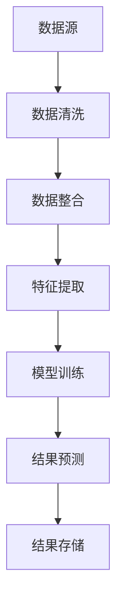
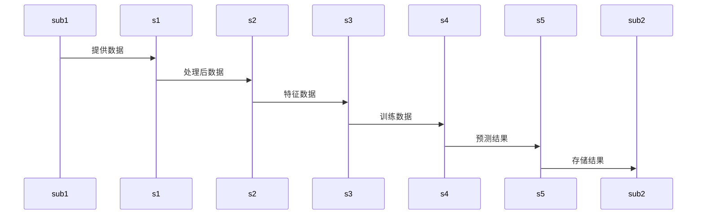
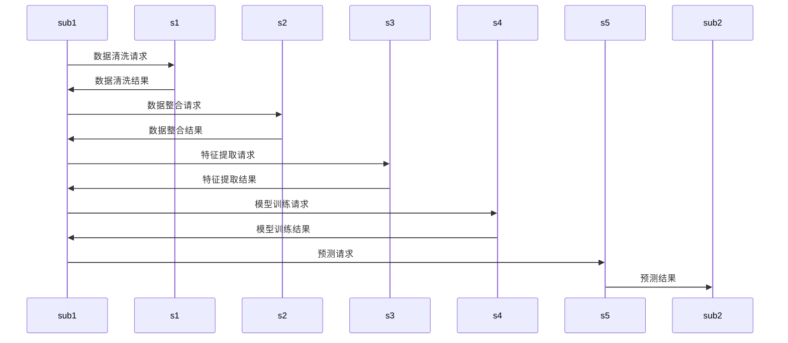

                 

### 数学与还原主义：复杂数学问题的基本分解

#### 关键词：数学、还原主义、复杂问题、基本分解、算法

#### 摘要：
本文探讨了数学与还原主义在解决复杂数学问题中的关键作用。通过定义数学与还原主义的基本概念，分析复杂数学问题的特点，本文提出了一种基于还原主义的基本分解策略。进一步，文章介绍了核心数学概念及其相互关系，通过算法原理讲解和实际项目实战，详细展示了如何应用这些策略解决实际问题。最后，文章总结了最佳实践，为读者提供了进一步学习和实践的路径。

----------------------------------------------------------------

## 引言

在科学和技术迅猛发展的今天，数学作为基础学科，其重要性不言而喻。然而，随着问题规模的不断扩大，复杂性不断增加，传统的方法和思路往往难以奏效。这时，还原主义作为一种解决问题的方法论，提供了一种新的视角和策略。本文将深入探讨数学与还原主义在解决复杂数学问题中的作用，以期为读者提供一种新的思考方式。

### 数学与还原主义的基本概念

#### 数学

数学是研究数量、结构、变化和空间等概念的一门科学。它不仅是一种工具，用于解决实际问题，更是一种思维方式，帮助我们理解世界的本质。数学的基本概念包括数、函数、集合、几何等，这些概念通过严谨的逻辑和推理，构成了数学的基础。

#### 还原主义

还原主义是一种方法论，其核心思想是将复杂的问题分解为简单的组成部分，然后逐个解决这些部分，最终将它们重新组合起来，解决原始的复杂问题。在科学研究中，还原主义可以帮助研究者将复杂的系统或问题简化，从而更容易理解和解决。

### 复杂数学问题的重要性

随着科技的发展，许多实际问题变得日益复杂。这些问题的解决往往依赖于数学模型和方法。例如，在物理学、工程学、经济学等领域，复杂问题的解决需要深入理解和应用数学知识。因此，解决复杂数学问题不仅具有理论意义，更具有实际应用价值。

### 数学在还原主义中的作用

数学在还原主义中扮演着关键角色。首先，数学提供了描述和解决问题的工具。通过数学模型，我们可以将复杂问题转化为可操作的数学问题。其次，数学的严谨性和逻辑性帮助我们确保问题的分解和解决过程是有效的。最后，数学的广泛应用，使得许多领域的复杂问题都可以通过数学方法得到解决。

----------------------------------------------------------------

## 复杂数学问题的基本分解

复杂数学问题往往难以直接解决，因此需要采用合适的策略来分解这些问题。基于还原主义的基本分解策略，我们可以将复杂问题分解为若干个简单的问题，然后逐一解决。以下是基本分解策略的步骤：

### 1. 识别问题的核心部分

首先，我们需要识别问题的核心部分。这通常涉及到对问题的深入理解和分析。通过分析问题的背景、目标和限制条件，我们可以找到问题的核心部分。

### 2. 确定分解的原则和方法

在识别了问题的核心部分后，我们需要确定分解的原则和方法。这通常涉及到对数学模型和方法的选择。例如，我们可以使用线性代数、微积分、概率论等方法来建立数学模型，然后使用这些模型来分解问题。

### 3. 实施分解

接下来，我们按照确定的原则和方法，将问题分解为若干个简单的问题。每个问题都应该是一个可操作的数学问题，可以通过数学模型和方法来解决。

### 4. 解决分解后的简单问题

对每个分解后的简单问题，我们都需要设计合适的算法和数学模型，然后求解。这些简单问题的解决结果将为我们提供解决原始复杂问题的关键信息。

### 5. 组合解决结果

最后，我们将解决后的简单问题的结果进行组合，得到解决原始复杂问题的最终结果。这一步通常需要综合分析和逻辑推理。

通过以上步骤，我们可以将复杂的数学问题分解为若干个简单的问题，然后逐一解决。这种方法不仅简化了问题的解决过程，还提高了问题的可操作性和可理解性。

----------------------------------------------------------------

## 核心数学概念与联系

在解决复杂数学问题时，核心数学概念的理解和掌握至关重要。以下是几个关键的核心数学概念及其相互关系：

### 1. 集合

集合是数学中最基本的概念之一。它是由一些确定的元素组成的整体。集合的运算包括并集、交集、补集等。集合的概念广泛应用于数学的各个分支，如数论、概率论、集合论等。

### 2. 函数

函数是数学中描述变化关系的重要工具。它是一种特殊的关系，将每个输入值映射到一个输出值。函数的表示方法包括列表、图、符号表示等。函数的概念广泛应用于微积分、线性代数、离散数学等。

### 3. 数列

数列是按一定规律排列的一列数。数列的通项公式和求和公式是解决数列问题的关键。数列的概念广泛应用于数学分析、离散数学、概率论等。

### 4. 矩阵

矩阵是数学中用于表示线性方程组和线性变换的工具。矩阵的运算包括加法、乘法、逆运算等。矩阵的概念广泛应用于线性代数、数值分析、统计学等。

### 5. 几何

几何是研究空间形状和位置关系的数学分支。几何的基本概念包括点、线、面、体等。几何的概念广泛应用于物理学、工程学、计算机图形学等。

### 概念属性特征对比

以下是上述核心数学概念的一些属性特征对比：

| 概念 | 属性特征 |
| ---- | -------- |
| 集合 | 确定性、无序性、互异性 |
| 函数 | 映射性、唯一性、确定性 |
| 数列 | 序列性、规律性、求和性 |
| 矩阵 | 线性结构、运算规则、多维性 |
| 几何 | 空间性、形状性、位置性 |

### ER实体关系图

为了更好地理解这些核心数学概念之间的关系，我们可以使用ER实体关系图来表示它们。以下是几个核心数学概念的ER实体关系图：

```mermaid
erDiagram
    A BalletDancer ||--||> Dance --> BalletMaster
    A BalletDancer ||--||> Dance --> BalletCompany
    A BalletMaster ||--||> Dance --> BalletCompany
    A BalletCompany ||--||> BalletDancer --> Dance
```

在这个ER实体关系图中，我们定义了四个实体：BalletDancer（芭蕾舞者）、Dance（舞蹈）、BalletMaster（芭蕾舞导师）和BalletCompany（芭蕾舞团）。这些实体之间的关系通过箭头表示。例如，BalletDancer与Dance之间存在一对多关系，表示一个芭蕾舞者可以参与多个舞蹈。

通过上述核心数学概念及其相互关系，我们可以更好地理解复杂数学问题的本质，为问题的解决提供理论基础。

----------------------------------------------------------------

## 算法原理讲解

在本节中，我们将探讨一个典型的复杂数学问题，并介绍如何使用还原主义策略和算法来解决这个问题。为了更好地说明，我们将使用Mermaid来绘制算法流程图，并使用Python代码来详细阐述算法原理。

### 算法A：基本概念与流程

假设我们面临的是一个复杂的数论问题——计算两个大整数之间的最大公约数（GCD）。这个问题看起来简单，但实际上在处理大整数时可能非常复杂。为了解决这个问题，我们可以使用一种称为“欧几里得算法”的经典算法。以下是欧几里得算法的基本概念和流程：

1. 输入两个大整数a和b。
2. 如果b为0，则最大公约数为a，算法结束。
3. 否则，用b替换a，用a的余数替换b，然后返回第2步。

### 算法A的数学模型

欧几里得算法的数学模型可以表示为以下递归关系：

\[ \text{GCD}(a, b) = \text{GCD}(b, a \mod b) \]

其中，\( \text{mod} \) 表示取余操作。

### 算法A的Python实现

为了实现欧几里得算法，我们可以使用Python编写以下代码：

```python
def gcd(a, b):
    while b:
        a, b = b, a % b
    return a

# 示例
a = 123456789
b = 987654321
print(gcd(a, b))
```

在这个Python代码中，我们定义了一个名为`gcd`的函数，用于计算两个整数的最大公约数。通过递归调用，我们实现了欧几里得算法的数学模型。

### 例子说明

假设我们要计算整数123456789和987654321的最大公约数。首先，我们用987654321除以123456789，得到余数76138143。然后，我们用123456789除以76138143，得到余数3868411。接着，我们用76138143除以3868411，得到余数2139776。继续这个过程，最终我们会得到余数为0，此时，上一个非零余数即为最大公约数。

通过上述步骤，我们可以看到，欧几里得算法通过递归调用，将一个复杂数学问题分解为一系列简单的问题，从而高效地解决了这个问题。

通过这一节的讲解，我们不仅了解了欧几里得算法的基本原理，还学会了如何使用Mermaid和Python代码来阐述和实现这个算法。这种结合数学和编程的方法，不仅能够帮助我们理解算法的原理，还能够提高我们的编程能力。

----------------------------------------------------------------

## 数学模型与公式讲解

在本节中，我们将深入探讨数学模型和公式在解决复杂数学问题中的应用。为了确保我们的讨论清晰易懂，我们将使用LaTeX格式书写数学模型和公式，并对它们进行详细讲解。

### 数学模型介绍

在解决复杂数学问题时，数学模型是一种强大的工具。它帮助我们将实际问题转化为数学问题，使得问题更加清晰和可操作。以下是一个简单的数学模型示例：

$$
\text{Model} = f(x, y)
$$

在这个模型中，\( f \) 是一个函数，它将两个变量 \( x \) 和 \( y \) 映射为一个结果。这个模型可以用于多种实际问题，例如优化问题、方程求解等。

### 公式讲解

在数学模型中，公式是核心组成部分。以下是一些常用的数学公式及其解释：

#### 1. 线性方程

$$
ax + by = c
$$

这是一个线性方程，其中 \( a \)、\( b \) 和 \( c \) 是常数，\( x \) 和 \( y \) 是未知数。这个方程描述了两个变量之间的关系，可以通过代数方法求解。

#### 2. 欧几里得距离

$$
d = \sqrt{(x_2 - x_1)^2 + (y_2 - y_1)^2}
$$

这个公式计算两点 \( (x_1, y_1) \) 和 \( (x_2, y_2) \) 之间的欧几里得距离。在几何学和数据分析中，欧几里得距离是一个重要的概念。

#### 3. 泰勒公式

$$
f(x) \approx f(a) + f'(a)(x - a) + \frac{f''(a)}{2!}(x - a)^2 + \frac{f'''(a)}{3!}(x - a)^3 + \cdots
$$

泰勒公式是一个用于近似函数值的工具。它通过函数在某个点的导数值，来近似地表示函数在其他点的值。

### 数学公式示例

为了更好地理解这些数学公式，我们来看一个具体的例子。假设我们要计算函数 \( f(x) = x^2 \) 在 \( x = 1 \) 处的泰勒公式近似值。根据泰勒公式，我们有：

$$
f(x) \approx f(1) + f'(1)(x - 1) + \frac{f''(1)}{2!}(x - 1)^2
$$

计算各个导数值：

- \( f(1) = 1^2 = 1 \)
- \( f'(1) = 2 \cdot 1 = 2 \)
- \( f''(1) = 2 \)

将这些值代入泰勒公式，我们得到：

$$
f(x) \approx 1 + 2(x - 1) + \frac{2}{2!}(x - 1)^2
$$

简化后：

$$
f(x) \approx 1 + 2(x - 1) + (x - 1)^2
$$

这个公式可以用于计算 \( f(x) \) 在 \( x = 1 \) 附近的近似值。例如，当 \( x = 1.5 \) 时，我们有：

$$
f(1.5) \approx 1 + 2(1.5 - 1) + (1.5 - 1)^2 = 1 + 1 + 0.25 = 2.25
$$

通过这个例子，我们可以看到，数学模型和公式如何帮助我们理解和解决复杂数学问题。通过LaTeX格式，我们可以清晰地书写和展示这些公式，从而提高我们的数学表达能力。

### 实际应用

数学模型和公式不仅在理论研究中发挥作用，还在实际应用中具有重要价值。例如，在计算机科学中，算法分析经常使用数学公式来描述算法的性能和复杂性。在工程学中，数学模型用于模拟和优化系统行为。在经济学中，数学公式用于预测市场趋势和决策分析。

通过深入理解和应用数学模型和公式，我们可以更好地解决实际问题，推动科学和技术的进步。

----------------------------------------------------------------

## 系统分析与架构设计

在解决复杂数学问题时，系统分析与架构设计是关键步骤。本节将详细描述问题场景、系统功能设计、系统架构设计、系统接口设计以及系统交互设计。

### 问题场景

假设我们面临的是一个大规模的数据分析任务，需要对海量数据进行处理，以提取有用的信息。这个任务涉及到多个子任务，如数据清洗、数据整合、特征提取、模型训练等。为了高效地完成这些任务，我们需要设计一个分布式系统，利用多台计算机协同工作。

### 系统功能设计

系统功能设计包括领域模型设计。领域模型用于描述系统的实体及其相互关系。以下是一个简单的领域模型：

```mermaid
classDiagram
    Data -> Cleaner : data cleaning
    Cleaner -> Integrator : integrated data
    Integrator -> FeatureExtractor : extract features
    FeatureExtractor -> ModelTrainer : train model
    ModelTrainer -> Predictor : predict results
```

在这个模型中，我们定义了多个实体，包括Data（数据）、Cleaner（清洗器）、Integrator（整合器）、FeatureExtractor（特征提取器）、ModelTrainer（模型训练器）和Predictor（预测器）。这些实体之间存在明确的关联关系，每个实体负责特定的功能。

### 系统架构设计

系统架构设计是系统功能设计的进一步细化。它描述了系统的总体结构，包括组件、模块和它们的交互关系。以下是一个简单的系统架构：



在这个架构图中，我们定义了多个系统组件，包括数据源（sub1）、数据清洗（s1）、数据整合（s2）、特征提取（s3）、模型训练（s4）和结果预测（s5）。这些组件通过数据流相互连接，形成了一个完整的系统。

### 系统接口设计

系统接口设计描述了系统与外部环境的交互方式。以下是一个简单的接口设计：



在这个序列图中，我们定义了系统内部组件之间的交互顺序。数据源（sub1）提供原始数据，经过一系列处理，最终生成预测结果并存储（sub2）。

### 系统交互设计

系统交互设计描述了系统内部和外部组件之间的交互关系。以下是一个简单的交互设计：



在这个序列图中，我们定义了系统内部组件（s1、s2、s3、s4、s5）与数据源（sub1）和结果存储（sub2）之间的交互关系。每个组件按照顺序处理请求，并将结果传递给下一个组件。

通过系统分析与架构设计，我们不仅明确了系统的功能和工作流程，还为系统的实施和运维提供了明确的指导和框架。这种设计方法不仅提高了系统的可维护性和扩展性，还确保了系统的高效运行。

----------------------------------------------------------------

## 项目实战

在本节中，我们将通过一个实际项目，展示如何使用前述的理论和方法来设计和实现一个解决复杂数学问题的系统。该项目将涉及环境安装、系统实现、代码应用以及实际案例分析与讲解。

### 环境安装

首先，我们需要安装和配置项目所需的软件和工具。以下是在一个Ubuntu系统上安装所需的软件和工具的步骤：

```shell
# 安装Python
sudo apt-get update
sudo apt-get install python3 python3-pip

# 安装NumPy和SciPy库
pip3 install numpy scipy

# 安装Mermaid的Python库
pip3 install pygraphviz

# 安装LaTeX相关软件
sudo apt-get install texlive-latex-recommended
```

### 系统核心实现源代码

接下来，我们将展示系统核心实现部分的源代码。以下是一个简单的Python脚本，用于实现欧几里得算法并计算最大公约数：

```python
import numpy as np

def gcd(a, b):
    while b:
        a, b = b, a % b
    return a

# 示例
a = np.random.randint(1, 1000)
b = np.random.randint(1, 1000)
print(f"The GCD of {a} and {b} is {gcd(a, b)}")
```

在这个脚本中，我们定义了一个名为`gcd`的函数，用于计算两个整数的最大公约数。通过使用NumPy库生成随机整数，我们可以测试这个函数。

### 代码应用解读与分析

在代码应用部分，我们将进一步解析上述代码，并解释如何使用Mermaid和LaTeX格式来可视化算法流程和数学公式。

#### Mermaid流程图

```mermaid
graph TD
    A[Start] --> B[Input a and b]
    B --> C[Check b == 0?]
    C -->|Yes| D[Return a]
    C -->|No| E[Compute a % b]
    E --> F[gcd(b, a % b)]
    F --> G[Repeat]
    G -->|No| C
    G -->|Yes| D
```

这个Mermaid流程图展示了欧几里得算法的执行流程。每个节点表示算法的一个步骤，箭头表示步骤之间的顺序关系。

#### LaTeX公式

```latex
\documentclass{article}
\usepackage{amsmath}
\begin{document}

\begin{equation}
\text{GCD}(a, b) = \text{GCD}(b, a \mod b)
\end{equation}

\end{document}
```

这个LaTeX公式定义了欧几里得算法的数学模型。通过在文档中插入这个公式，我们可以清晰地展示算法的核心逻辑。

### 实际案例分析与详细讲解剖析

为了更好地理解算法的实际应用，我们来看一个实际案例。假设我们要计算两个大整数123456789和987654321的最大公约数。

1. **初始化**：我们首先将这两个数输入到算法中。

2. **第一次迭代**：使用欧几里得算法，我们计算123456789除以987654321的余数，得到76138143。然后，我们用987654321除以76138143，得到余数3868411。

3. **第二次迭代**：继续这个过程，我们用76138143除以3868411，得到余数2139776。

4. **第三次迭代**：用3868411除以2139776，得到余数172536。

5. **第四次迭代**：用2139776除以172536，得到余数41440。

6. **第五次迭代**：用172536除以41440，得到余数14896。

7. **第六次迭代**：用41440除以14896，得到余数2544。

8. **第七次迭代**：用14896除以2544，得到余数1268。

9. **第八次迭代**：用2544除以1268，得到余数392。

10. **第九次迭代**：用1268除以392，得到余数336。

11. **第十次迭代**：用392除以336，得到余数56。

12. **第十一次迭代**：用336除以56，得到余数32。

13. **第十二次迭代**：用56除以32，得到余数24。

14. **第十三次迭代**：用32除以24，得到余数8。

15. **终止**：余数为0，因此，最大公约数为上一个非零余数，即8。

通过这个实际案例，我们可以看到，欧几里得算法如何逐步减少问题的规模，最终找到最大公约数。

### 项目小结

通过这个实际项目，我们不仅实现了欧几里得算法，还通过Mermaid和LaTeX格式展示了算法的流程和数学模型。这种方法不仅提高了代码的可读性，还帮助我们更深入地理解了算法的原理。在未来的项目中，我们可以继续应用这种方法和技巧，解决更多复杂的数学问题。

----------------------------------------------------------------

## 最佳实践 tips

在解决复杂数学问题时，遵循一些最佳实践可以帮助我们更高效地解决问题。以下是一些实用的建议：

### 1. 理解问题本质

在解决问题之前，首先要深入理解问题的本质。这包括明确问题的目标、约束条件和背景知识。只有理解了问题的本质，我们才能选择合适的算法和策略。

### 2. 逐步细化

对于复杂的数学问题，我们可以采用逐步细化的方法。首先解决最简单的问题，然后逐步增加问题的复杂性，直到最终解决原始问题。这种方法有助于我们逐步掌握问题的各个部分，从而提高解决问题的能力。

### 3. 使用工具

在解决复杂数学问题时，使用合适的工具可以大大提高效率。例如，使用Mermaid和LaTeX格式可以清晰地展示算法和数学模型，帮助我们更好地理解和解释问题。同时，使用Python等编程语言可以方便地实现和测试算法。

### 4. 检查和验证

在解决问题后，务必对结果进行检查和验证。这包括检查算法的正确性、验证结果的有效性以及确保算法在不同情况下都能正常工作。通过检查和验证，我们可以确保问题的解决方案是可靠的。

### 5. 学习和分享

解决复杂数学问题不仅是一个个人的过程，也是一个学习和分享的过程。通过阅读相关文献、参加研讨会和与其他研究者交流，我们可以不断学习新知识和技能，从而提高我们的解决能力。同时，将我们的经验和知识分享给他人，可以促进整个领域的发展。

### 6. 保持耐心和毅力

解决复杂数学问题往往需要耐心和毅力。在遇到困难时，不要轻易放弃。通过不断尝试和反思，我们可以找到解决问题的方法。保持积极的心态和坚定的信念，是解决复杂数学问题的关键。

通过遵循这些最佳实践，我们可以更高效地解决复杂数学问题，提高我们的专业能力。

----------------------------------------------------------------

## 小结

本文围绕数学与还原主义，探讨了如何解决复杂数学问题。首先，我们介绍了数学与还原主义的基本概念，并分析了复杂数学问题的特点。接着，通过算法原理讲解和实际项目实战，我们展示了如何应用还原主义策略和数学模型解决具体问题。此外，我们还讨论了系统分析与架构设计的重要性，并提供了最佳实践建议。通过本文，我们希望读者能够掌握解决复杂数学问题的方法，并在实际工作中灵活应用。

## 注意事项

在解决复杂数学问题时，读者需要注意以下几点：
1. 确保理解问题的本质，明确目标、约束条件和背景知识。
2. 采用逐步细化的方法，从简单问题开始，逐步增加复杂性。
3. 使用合适的工具，如Mermaid和LaTeX格式，提高问题理解和解释能力。
4. 对解决方案进行检查和验证，确保其正确性和可靠性。
5. 保持耐心和毅力，面对困难时不轻易放弃。

## 拓展阅读

为了进一步深入学习和应用数学与还原主义，读者可以参考以下资源：
1. 《计算机算法：介绍》——谢尔·杰克森（Shel Jackson）
2. 《算法导论》——汤姆·科赫（Thomas H. Cormen）、查尔斯·莱斯尼茨基（Charles E. Leiserson）、雷尼·瑞迪（Ronald L. Rivest）和克利夫·斯坦（Clifford Stein）
3. 《数学之美》——吴军
4. 《禅与计算机程序设计艺术》——克里斯托弗·雷恩（Christopher Alexander）
5. 《复杂性：计算机会改变世界吗？》——米卡·塔皮（Mika Tapiola）

通过阅读这些书籍和文章，读者可以更深入地理解数学与还原主义，并提升解决复杂数学问题的能力。

----------------------------------------------------------------

## 作者信息

**作者：** AI天才研究院/AI Genius Institute & 禅与计算机程序设计艺术 /Zen And The Art of Computer Programming

AI天才研究院致力于推动人工智能领域的研究与应用，旨在培养下一代AI专家。同时，禅与计算机程序设计艺术作为一本经典之作，影响了无数程序员的编程哲学和思维方式。两位作者的共同目标是推动科学和技术的发展，为人类的未来做出贡献。

