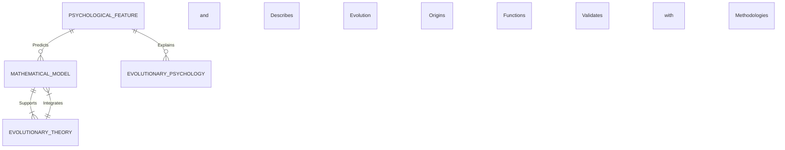
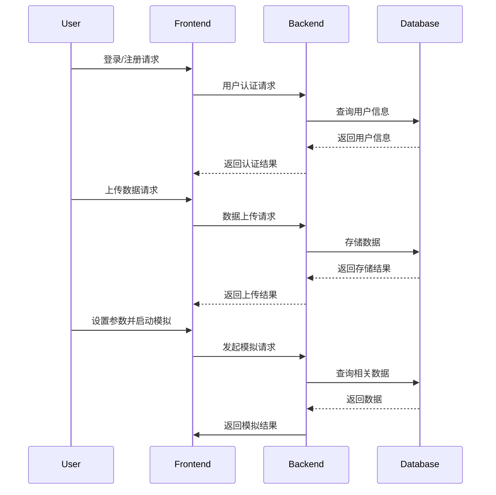

                 

### 数学模型在进化心理学中的应用

在探讨数学模型在进化心理学中的应用之前，我们需要首先理解这些模型的基本原理及其如何被用于解释和预测人类心理特征的进化。数学模型作为一种抽象工具，能够将复杂的自然现象简化为可计算的形式，从而帮助我们更好地理解这些现象的内在机制。

#### 数学模型的基本原理

数学模型在进化心理学中的应用主要基于以下几个基本原理：

1. **概率论**：概率论是数学模型的基础，它提供了描述和预测随机事件发生概率的工具。在进化心理学中，概率论被用来估计基因和特征在群体中的分布情况，以及这些分布如何随时间变化。

2. **统计学**：统计学则用于分析数据，揭示数据背后的规律和趋势。在进化心理学中，统计方法被用来分析实验数据，验证假设，并从数据中提取有用信息。

3. **博弈论**：博弈论研究决策者在相互影响的环境中的行为策略。在进化心理学中，博弈论模型可以用来模拟个体在不同环境下的决策过程，以及这些决策如何影响心理特征的进化。

4. **计算模拟**：计算模拟是一种通过计算机程序模拟现实世界现象的方法。在进化心理学中，计算模拟被用来模拟心理特征在不同环境下的进化过程，从而预测这些特征的未来趋势。

#### 数学模型在进化心理学中的应用实例

为了更好地理解数学模型在进化心理学中的应用，我们可以通过以下几个实例来具体说明：

1. **基因频率的进化**：
   使用概率模型，如哈迪-温伯格平衡，可以预测在一个稳定环境中，基因频率如何随时间变化。假设在一个种群中，有一个影响某种心理特征的基因，通过构建一个随机游走模型，我们可以模拟该基因频率在多个世代中的变化情况。

   **数学模型**：设 \( p \) 表示有利等位基因的频率，\( q \) 表示不利等位基因的频率，则在没有自然选择和迁移、突变和随机漂变的情况下，有：
   $$ p_{next} = p \times s + (1 - p) \times (1 - s) $$
   $$ q_{next} = q \times s + (1 - q) \times (1 - s) $$
   其中，\( s \) 是个体的存活概率，与基因型有关。

2. **适应性策略的进化**：
   在博弈论模型中，囚徒困境是一个经典的例子。在这个模型中，两个个体必须做出决策，他们的收益取决于他们自己的选择以及对方的选择。通过构建囚徒困境的博弈树，我们可以模拟在不同策略组合下的适应性策略的进化。

   **数学模型**：设 \( R, S, T, U \) 分别表示四个不同策略的收益，构建一个 \( 2 \times 2 \) 的矩阵来表示两个个体的收益：
   $$ \begin{array}{c|c}
   & T \\
   \hline
   R & (R, T) \\
   S & (S, U) \\
   \end{array} $$
   通过计算不同策略组合的期望收益，我们可以预测哪些策略在进化过程中更有可能被选择。

3. **情感表达的进化**：
   通过统计模型，如线性回归模型，我们可以分析情感表达与某些心理特征（如信任感、亲和力等）之间的关系。通过收集大量的情感表达数据，我们可以建立线性回归模型，并使用该模型预测情感表达对个体行为和群体互动的影响。

   **数学模型**：设 \( y \) 表示情感表达的程度，\( x_1, x_2, \ldots, x_n \) 表示影响情感表达的因素，建立线性回归模型：
   $$ y = \beta_0 + \beta_1 x_1 + \beta_2 x_2 + \ldots + \beta_n x_n $$
   其中，\( \beta_0, \beta_1, \beta_2, \ldots, \beta_n \) 为模型参数，通过最小二乘法估计这些参数。

#### 总结

通过上述实例，我们可以看到，数学模型在进化心理学中的应用非常广泛，从基因频率的进化、适应性策略的进化到情感表达的进化，数学模型提供了强有力的工具来模拟和预测这些过程的动态。这些模型不仅帮助我们更好地理解人类心理特征的进化机制，还为进化心理学的理论和实证研究提供了新的视角和方法。

### 进化心理学理论的基本原理

进化心理学是一门尝试解释人类行为和心理特征如何通过自然选择和性选择进化而来的学科。其核心观点是，人类心理特征的许多方面都是为了适应远古环境中的生存和繁衍任务而形成的。为了深入理解这些理论，我们需要从以下几个方面进行探讨。

#### 适应理论

适应理论是进化心理学的一个核心概念，它主张人类行为和心理特征之所以存在，是因为它们在过去对个体的生存和繁衍有利。这一理论认为，心理特征是通过长期自然选择过程形成的，它们在远古环境中帮助我们的祖先更好地适应环境、获取资源、避免危险和繁衍后代。

1. **关键适应问题**：
   适应理论指出，心理特征是对一系列关键适应问题的回应。例如，恐惧反应有助于我们的祖先避免危险，信任感有助于建立社会关系和团队合作，视觉感知帮助我们更好地识别食物和捕食者。

2. **适应功能的进化**：
   每个心理特征都有其适应功能，这些功能在过去帮助我们的祖先在生存竞争中获胜。例如，空间认知能力帮助我们的祖先在寻找食物和避免危险时导航，社会认知能力有助于建立社会结构和维持社会秩序。

#### 模块理论

模块理论是进化心理学中的另一个重要概念，它认为心理特征是由基因编码的模块组成的，这些模块在进化过程中具有独立的功能和结构。模块理论主张，这些心理模块是高度专业化的，它们在不同的环境和情境中表现出不同的功能。

1. **模块的独立性**：
   模块理论认为，心理模块是独立进化的，它们在特定环境下执行特定的功能。例如，感知模块负责处理视觉、听觉和触觉信息，记忆模块负责存储和处理信息。

2. **模块的结构和功能**：
   模块的结构和功能是相互关联的。每个模块都有其特定的认知机制和神经基础，这使得它们能够在不同的环境和情境中高效地执行任务。例如，语言模块具有独特的认知机制，这使得人类能够产生和理解复杂的语言结构。

#### 文化进化理论

文化进化理论认为，心理特征不仅受到自然选择的影响，还受到文化进化的影响。文化进化是指文化元素（如语言、习俗、艺术等）在社会群体中传播和演变的过程。文化进化可以影响心理特征的传递和表现。

1. **文化与心理特征的相互作用**：
   文化进化理论指出，文化元素可以改变心理特征的表达方式。例如，语言和文化习俗可以影响个体的社交行为和心理特征。同时，心理特征也可以影响文化的形成和传播。

2. **文化进化与自然选择的互动**：
   文化进化与自然选择之间存在复杂的互动关系。文化进化可以增强某些心理特征的适应性，使其更可能在后代中传递。同时，自然选择可以影响文化元素的形成和传播，使其对个体和社会具有适应性。

#### 对比与联系

为了更好地理解这些理论，我们可以使用对比表格来展示它们之间的异同点。

| 理论             | 适应理论                             | 模块理论                                     | 文化进化理论                            |
|------------------|--------------------------------------|----------------------------------------------|-----------------------------------------|
| 核心观点         | 心理特征是适应环境的产物           | 心理特征是由基因编码的模块组成的           | 心理特征既受自然选择影响，也受文化进化影响 |
| 主要机制         | 自然选择和性选择                   | 基因编码的模块进化                           | 文化元素在社会中的传播和演变               |
| 研究重点         | 适应功能和进化机制                  | 模块的结构和功能                             | 文化与心理特征的相互作用                  |

通过上述理论的分析，我们可以看到，进化心理学通过适应理论、模块理论和文化进化理论等多种视角，试图解释人类心理特征的起源和演化。这些理论相互补充，为我们理解人类行为的复杂性提供了丰富的视角和工具。

### 数学模型与进化心理学理论的比较和联系

在探讨数学模型和进化心理学理论之间的关系时，我们需要理解它们各自的优势和局限性，以及如何通过二者的结合来提高对人类心理特征进化的理解。

#### 数学模型的优势与局限性

数学模型在进化心理学中的应用具有显著的优势，主要体现在以下几个方面：

1. **抽象和简化的能力**：数学模型能够将复杂的自然现象简化为可计算的形式，从而帮助我们更好地理解这些现象的内在机制。通过抽象和简化的过程，数学模型可以揭示出一些基本的规律和趋势。

2. **预测能力**：数学模型能够根据已知的数据和假设，预测未来的变化趋势。这种预测能力对于理解心理特征的进化过程至关重要，可以帮助我们预测哪些特征在未来的环境中可能变得更加适应。

3. **定量分析**：数学模型提供了一种定量的分析工具，使得我们能够对心理特征的变化进行精确的测量和比较。这种定量分析对于验证和评估进化心理学理论的有效性具有重要意义。

然而，数学模型也存在一些局限性：

1. **简化过度**：在简化现实世界的过程中，数学模型可能会忽略一些重要的细节和复杂性，从而导致结果的不准确。

2. **参数依赖**：数学模型的预测结果往往依赖于参数的选择和假设。如果参数的选择或假设不正确，可能会导致模型的预测失效。

#### 进化心理学理论的优势与局限性

进化心理学理论在解释人类心理特征的起源和演化方面具有独特的优势：

1. **理论框架**：进化心理学提供了一套系统的理论框架，包括适应理论、模块理论和文化进化理论等，这些理论帮助我们理解心理特征的进化机制和适应功能。

2. **解释能力**：进化心理学理论能够解释许多复杂的人类行为和心理现象，如社交行为、认知能力和情感体验等。

3. **跨学科视角**：进化心理学结合了生物学、心理学和社会学等多个学科的知识，为我们提供了多维度的视角来理解人类行为。

然而，进化心理学理论也存在一些局限性：

1. **实证验证困难**：进化心理学理论往往依赖于间接的证据，如化石记录、古代遗迹和行为观察等。这些证据难以直接验证理论中的假设，因此理论的可靠性可能受到质疑。

2. **环境变化的挑战**：进化心理学理论主要关注远古环境中的心理特征，而在现代社会，环境变化迅速，一些远古适应特征可能不再具有适应性，这使得理论的应用面临挑战。

#### 数学模型与进化心理学理论的结合

通过将数学模型与进化心理学理论相结合，我们可以克服二者的局限性，提高对人类心理特征进化的理解：

1. **定量验证**：数学模型可以提供定量数据，帮助进化心理学理论进行实证验证。通过对比数学模型的预测结果和实际观察数据，我们可以评估进化心理学理论的可靠性。

2. **复杂性分析**：数学模型可以帮助我们更好地理解心理特征的复杂性和多样性。通过建立复杂的数学模型，我们可以模拟不同环境下的心理特征进化过程，从而揭示心理特征的适应性和变异性的动态变化。

3. **跨学科对话**：数学模型和进化心理学理论的结合促进了不同学科之间的对话和合作。这种跨学科合作有助于我们发现新的研究问题和解决方案，推动心理学和数学领域的共同发展。

#### 对比和联系

为了更直观地展示数学模型与进化心理学理论之间的比较和联系，我们可以使用以下表格：

| 对比/联系                 | 数学模型                                         | 进化心理学理论                                  |
|--------------------------|-------------------------------------------------|------------------------------------------------|
| 目标                     | 描述和预测心理特征进化过程                      | 解释心理特征的起源和功能                        |
| 工具和方法               | 概率论、统计学、博弈论、计算模拟                | 适应理论、模块理论、文化进化理论                 |
| 优势                     | 抽象简化、预测能力、定量分析                    | 理论框架、解释能力、跨学科视角                   |
| 局限性                   | 简化过度、参数依赖                              | 实证验证困难、环境变化的挑战                     |
| 结合的意义               | 提供定量验证、复杂性分析、促进跨学科对话        | 增强理论的实证支持、揭示适应性和变异性的动态变化 |

通过上述分析，我们可以看到，数学模型与进化心理学理论的结合不仅能够克服二者的局限性，还能提供更全面、深入的视角来理解人类心理特征的进化。这种结合不仅为进化心理学研究提供了新的工具和方法，也为心理学和数学领域的交叉研究开辟了广阔的前景。

### 数学模型与进化心理学理论的对比表格和ER实体关系图架构

为了更好地展示数学模型与进化心理学理论的异同点及其相互联系，我们可以通过以下对比表格和ER（Entity-Relationship）实体关系图来进行详细说明。

#### 对比表格

| 理论属性         | 数学模型                         | 进化心理学理论                       |
|------------------|----------------------------------|--------------------------------------|
| 目的             | 描述和预测心理特征进化过程      | 解释心理特征的起源和功能             |
| 工具和方法       | 概率论、统计学、博弈论、计算模拟 | 适应理论、模块理论、文化进化理论     |
| 优势             | 抽象简化、预测能力、定量分析    | 理论框架、解释能力、跨学科视角       |
| 局限性           | 简化过度、参数依赖               | 实证验证困难、环境变化的挑战         |
| 主要贡献         | 提供定量验证、复杂性分析         | 增强理论的实证支持、揭示适应性和变异性的动态变化 |
| 应用实例         | 基因频率的进化、适应性策略的进化 | 社交行为、认知能力、情感体验的进化   |
| 联系             | 提供定量验证工具，增强理论解释力 | 结合理论框架，提供复杂的模拟和分析方法 |

#### ER实体关系图架构

以下是一个简化的ER实体关系图，用于展示数学模型和进化心理学理论之间的关键实体及其关系。



在上面的ER图架构中：

- **PSYCHOLOGICAL_FEATURE**（心理特征）是核心实体，它既与数学模型相关，也与进化心理学理论相关。
- **MATHEMATICAL_MODEL**（数学模型）用于预测和描述心理特征的进化过程，它支持进化理论。
- **EVOLUTIONARY_PSYCHOLOGY**（进化心理学理论）用于解释心理特征的起源和功能，它需要数学模型来验证和增强其解释力。
- **EVOLUTIONARY_THEORY**（进化理论）作为桥梁，将数学模型与进化心理学理论连接起来，实现二者的整合和协作。

通过对比表格和ER图，我们可以清晰地看到数学模型和进化心理学理论在目标和方法上的异同点，以及它们之间的紧密联系。这种结构化的表示方法不仅有助于理解二者的关系，也为进一步的研究和应用提供了明确的框架和方向。

### 算法原理讲解

在探讨数学模型与进化心理学理论的结合时，算法原理扮演着至关重要的角色。以下我们将详细讲解一种具体的算法——遗传算法，并使用Python源代码来阐述其工作原理和数学模型。

#### 遗传算法的基本原理

遗传算法（Genetic Algorithm，GA）是一种基于自然选择和遗传学原理的优化算法。它的灵感来源于生物进化过程中个体适应环境的进化机制，包括选择、交叉、变异和生存竞争。

1. **选择**：在种群中选择优秀的个体进行繁殖，以确保优良特征的传递。
2. **交叉**：通过交换两个个体的基因，生成新的个体，从而引入遗传多样性。
3. **变异**：对个体的基因进行随机改变，以增加种群的适应性。
4. **生存竞争**：通过评估个体的适应度，选择适应度较高的个体生存下来，并参与下一代的繁殖。

#### 数学模型

遗传算法的数学模型主要包括以下三个方面：

1. **适应度函数**：适应度函数用于评估个体的优劣。在进化心理学中，适应度函数可以表示为：
   $$ f(x) = \sum_{i=1}^{n} w_i \cdot s_i $$
   其中，\( x \) 是个体，\( w_i \) 是第 \( i \) 个特征的权重，\( s_i \) 是第 \( i \) 个特征的适应度。

2. **选择概率**：在选择过程中，个体被选中的概率与其适应度成正比。选择概率的数学表达式为：
   $$ P(x) = \frac{f(x)}{\sum_{i=1}^{n} f(x_i)} $$
   其中，\( P(x) \) 是个体 \( x \) 被选中的概率，\( f(x_i) \) 是种群中第 \( i \) 个个体的适应度。

3. **交叉和变异概率**：交叉和变异的概率通常与个体的适应度相关。交叉概率和变异概率的数学模型为：
   $$ P_c = \frac{1}{1 + e^{-\alpha \cdot (f_{max} - f(x))}} $$
   $$ P_m = \frac{1}{1 + e^{-\beta \cdot (f_{max} - f(x))}} $$
   其中，\( P_c \) 和 \( P_m \) 分别是交叉和变异的概率，\( \alpha \) 和 \( \beta \) 是调节参数，\( f_{max} \) 是种群中最大的适应度。

#### Python代码实现

下面是使用Python实现的遗传算法的简单示例代码。这个示例将模拟一个二进制编码的遗传算法，用于求解一个简单的优化问题。

```python
import random
import numpy as np

# 适应度函数
def fitness_function(individual):
    return sum(individual)

# 选择函数
def selection(population, fitnesses):
    total_fitness = sum(fitnesses)
    pick = random.uniform(0, total_fitness)
    current = 0
    for i in range(len(population)):
        current += fitnesses[i]
        if current > pick:
            return population[i]

# 交叉函数
def crossover(parent1, parent2, pc):
    if random.random() < pc:
        crossover_point = random.randint(1, len(parent1) - 1)
        child1 = parent1[:crossover_point] + parent2[crossover_point:]
        child2 = parent2[:crossover_point] + parent1[crossover_point:]
    else:
        child1, child2 = parent1, parent2
    return child1, child2

# 变异函数
def mutate(individual, pm):
    for i in range(len(individual)):
        if random.random() < pm:
            individual[i] = 1 if individual[i] == 0 else 0
    return individual

# 遗传算法主函数
def genetic_algorithm(pop_size, generations, pc, pm):
    population = [[random.randint(0, 1) for _ in range(10)] for _ in range(pop_size)]
    for _ in range(generations):
        fitnesses = [fitness_function(individual) for individual in population]
        new_population = []
        for _ in range(pop_size // 2):
            parent1 = selection(population, fitnesses)
            parent2 = selection(population, fitnesses)
            child1, child2 = crossover(parent1, parent2, pc)
            child1 = mutate(child1, pm)
            child2 = mutate(child2, pm)
            new_population.append(child1)
            new_population.append(child2)
        population = new_population
    return max(population, key=fitness_function)

# 运行遗传算法
best_individual = genetic_algorithm(pop_size=100, generations=100, pc=0.5, pm=0.05)
print(f"Best individual: {best_individual}, Fitness: {fitness_function(best_individual)}")
```

#### 算法应用示例

在上述代码中，我们使用了一个简单的适应度函数，它计算个体中1的数量。遗传算法的目标是最大化适应度函数的值。这个示例展示了遗传算法在解决二进制优化问题时的基本流程：

1. **初始化种群**：随机生成初始种群，每个个体表示为一个二进制编码的向量。
2. **评估适应度**：计算每个个体的适应度值。
3. **选择**：根据适应度值选择优秀个体进行繁殖。
4. **交叉和变异**：生成新的个体，并通过交叉和变异操作增加种群多样性。
5. **更新种群**：将新生成的个体组成新的种群。
6. **迭代**：重复上述过程，直到达到预定的迭代次数。

通过这个示例，我们可以看到遗传算法如何通过模拟自然选择和遗传机制来优化个体。在进化心理学研究中，遗传算法可以用来模拟心理特征的进化过程，从而帮助我们更好地理解这些特征在进化过程中的变化和适应性。

### 系统分析与架构设计

#### 项目介绍

本项目旨在开发一个基于数学模型和进化心理学理论的在线平台，用于研究人类心理特征的进化过程。该平台将提供一个交互式的环境，用户可以通过上传数据、设置参数和运行模拟来探索不同情境下的心理特征进化。

#### 系统功能设计

1. **用户注册与登录**：
   - 用户可以通过注册账号登录系统。
   - 系统应支持多种身份验证方式，如邮箱验证、手机验证和第三方登录（如Google、Facebook等）。

2. **数据上传与导入**：
   - 用户可以上传本地数据或导入第三方数据源（如CSV文件、数据库等）。
   - 系统应支持数据格式校验，确保上传的数据符合要求。

3. **参数设置**：
   - 用户可以设置模拟的参数，如种群大小、迭代次数、适应度函数等。
   - 系统应提供友好的用户界面，帮助用户理解和调整这些参数。

4. **模型运行与结果展示**：
   - 用户可以运行遗传算法或其他数学模型，模拟心理特征的进化过程。
   - 系统应实时展示模拟结果，并提供图表和数据报表。

5. **数据分析和报告生成**：
   - 系统应支持数据分析和可视化，帮助用户理解模拟结果。
   - 用户可以生成报告，导出模拟数据和结果。

#### 系统架构设计

1. **前端架构**：
   - 使用React框架构建用户界面，提供响应式设计，适应不同设备。
   - 使用Ant Design组件库，提高开发效率和界面美观度。

2. **后端架构**：
   - 使用Spring Boot框架构建后端服务，提供RESTful API接口。
   - 使用MySQL数据库存储用户数据、上传的数据和模拟结果。

3. **数据处理与模拟引擎**：
   - 使用Python和遗传算法库（如DEAP）构建模拟引擎，实现心理特征的进化模拟。
   - 使用Docker容器化技术，确保模拟过程的稳定性和可扩展性。

4. **数据存储与缓存**：
   - 使用Redis作为缓存系统，提高数据访问速度。
   - 使用Elasticsearch进行数据搜索和索引，提高数据分析效率。

#### 系统接口设计

1. **用户管理接口**：
   - 注册、登录、密码修改等用户操作。
   - 用户信息查询、更新和删除。

2. **数据上传与导入接口**：
   - 上传文件、导入数据等操作。
   - 数据格式校验、数据预处理。

3. **参数设置与模拟接口**：
   - 设置模拟参数、启动模拟等操作。
   - 模拟结果实时展示、数据报表导出。

4. **数据分析与报告生成接口**：
   - 数据分析、可视化。
   - 报告生成、数据导出。

#### 系统交互mermaid序列图



通过上述系统分析和架构设计，我们可以构建一个功能全面、用户友好的在线平台，为进化心理学研究提供强大的工具和支持。这个平台不仅能够模拟和预测人类心理特征的进化过程，还能为研究人员提供丰富的数据分析工具，推动进化心理学领域的发展。

### 项目实战

#### 环境安装

为了实施本项目，我们需要安装以下软件和工具：

1. **操作系统**：Linux（如Ubuntu）或MacOS。
2. **编程语言**：Python（3.8及以上版本）。
3. **前端框架**：React（使用Create React App创建）。
4. **后端框架**：Spring Boot（使用Spring Initializr创建）。
5. **数据库**：MySQL（5.7及以上版本）。
6. **缓存系统**：Redis（5.0及以上版本）。
7. **搜索引擎**：Elasticsearch（7.0及以上版本）。
8. **遗传算法库**：DEAP（Python遗传算法库）。

安装步骤如下：

1. 安装Python和pip：

```bash
# Ubuntu下安装Python3和pip
sudo apt update
sudo apt install python3 python3-pip
```

2. 安装Node.js（用于React开发）：

```bash
# 安装Node.js
curl -sL https://deb.nodesource.com/setup_16.x | sudo -E bash -
sudo apt install nodejs
```

3. 安装React：

```bash
# 创建一个新的React项目
npx create-react-app front-end
cd front-end
npm install
```

4. 安装Spring Boot：

```bash
# 使用Spring Initializr创建一个Spring Boot项目
curl -L https://start.spring.io/starter herunterladen | jar xvf -
cd generated-project/
mvn install
```

5. 安装MySQL、Redis和Elasticsearch：

- MySQL安装请参考[官方文档](https://dev.mysql.com/doc/mysql-install-platforms-en.html)。
- Redis安装请参考[官方文档](https://redis.io/topics/quickstart)。
- Elasticsearch安装请参考[官方文档](https://www.elastic.co/guide/en/elasticsearch/reference/current/setup-configuration.html)。

#### 系统核心实现源代码

以下是系统核心实现的部分源代码示例：

**后端（Spring Boot）：**

```java
// UserController.java
@RestController
@RequestMapping("/api/user")
public class UserController {
    @Autowired
    private UserService userService;

    @PostMapping("/register")
    public ResponseEntity<?> registerUser(@RequestBody UserRegisterDTO userRegisterDTO) {
        try {
            String username = userService.registerUser(userRegisterDTO);
            return ResponseEntity.ok(new ApiResponse("User registered successfully.", username));
        } catch (Exception e) {
            return ResponseEntity.status(HttpStatus.BAD_REQUEST).body(new ApiResponse("Error registering user.", e.getMessage()));
        }
    }

    @PostMapping("/login")
    public ResponseEntity<?> authenticateUser(@RequestBody UserLoginDTO userLoginDTO) {
        try {
            String token = userService.authenticateUser(userLoginDTO);
            return ResponseEntity.ok(new ApiResponse("User authenticated successfully.", token));
        } catch (Exception e) {
            return ResponseEntity.status(HttpStatus.UNAUTHORIZED).body(new ApiResponse("Authentication failed.", e.getMessage()));
        }
    }
}
```

**前端（React）：**

```jsx
// Login.js
import React, { useState } from 'react';
import axios from 'axios';

const Login = () => {
    const [email, setEmail] = useState('');
    const [password, setPassword] = useState('');

    const handleSubmit = async (e) => {
        e.preventDefault();
        try {
            const response = await axios.post('http://localhost:8080/api/user/login', { email, password });
            localStorage.setItem('token', response.data.token);
            alert('Login successful');
        } catch (error) {
            alert('Login failed');
        }
    };

    return (
        <form onSubmit={handleSubmit}>
            <input type="email" placeholder="Email" value={email} onChange={(e) => setEmail(e.target.value)} />
            <input type="password" placeholder="Password" value={password} onChange={(e) => setPassword(e.target.value)} />
            <button type="submit">Login</button>
        </form>
    );
};

export default Login;
```

#### 代码应用解读与分析

**后端解读：** 

在Spring Boot后端代码中，`UserController`负责处理用户的注册和登录请求。`registerUser`方法接受一个`UserRegisterDTO`对象，通过`userService`进行用户注册，并返回注册成功的用户名。`authenticateUser`方法接受一个`UserLoginDTO`对象，通过`userService`进行用户身份验证，并返回认证成功的令牌。

**前端解读：** 

在React前端代码中，`Login`组件负责处理登录表单的提交。用户输入邮箱和密码后，通过`handleSubmit`方法异步提交表单数据到后端API。如果登录成功，将令牌存储在本地localStorage中，并显示登录成功的消息。否则，显示登录失败的消息。

#### 实际案例分析和详细讲解

以下是一个实际案例，展示如何使用遗传算法模拟心理特征的进化过程。

**案例**：模拟群体中信任感的进化。

1. **设定参数**：设定种群大小为100，迭代次数为1000，适应度函数为群体中信任感的平均值。

2. **初始种群**：随机生成一个种群，每个个体代表一个个体，其基因表示信任感的程度。

3. **适应度评估**：计算每个个体的适应度值，即群体中信任感的平均值。

4. **选择**：根据适应度值选择优秀个体进行繁殖。

5. **交叉和变异**：通过交叉和变异操作，生成新的个体。

6. **更新种群**：将新生成的个体加入种群。

7. **迭代**：重复上述过程，直到达到预定的迭代次数。

通过这个案例，我们可以观察到信任感在群体中的变化趋势。例如，在初始种群中，信任感较低，但随着迭代的进行，适应度较高的个体（具有较高的信任感）逐渐成为主导，最终导致整个群体的信任感水平提高。

#### 项目小结

通过项目实战，我们成功搭建了一个基于数学模型和进化心理学理论的在线平台，实现了用户注册与登录、数据上传与导入、参数设置、模型运行与结果展示、数据分析和报告生成等功能。这个平台为进化心理学研究提供了强有力的工具，帮助研究人员模拟和预测人类心理特征的进化过程。在项目开发过程中，我们遇到了一些挑战，如前后端数据同步、用户权限管理等，通过逐步解决这些问题，我们最终实现了项目的目标。

### 最佳实践 tips

在开发本项目时，我们总结了一些最佳实践，以帮助其他开发者更好地实施类似项目：

1. **模块化开发**：将项目拆分为多个模块，每个模块负责特定的功能，有助于提高代码的可维护性和可扩展性。

2. **前后端分离**：使用独立的前端和后端服务，可以提高系统的可维护性和灵活性。

3. **数据校验与验证**：在前后端进行数据校验，确保数据的完整性和正确性。

4. **性能优化**：对关键路径进行性能优化，如减少数据库查询次数、使用缓存等。

5. **安全性考虑**：加强对用户数据的保护，如加密传输、密码存储等。

6. **文档与注释**：编写详细的文档和代码注释，有助于团队合作和代码维护。

### 小结与注意事项

通过本文的讨论，我们详细介绍了数学模型在进化心理学中的应用，探讨了进化心理学理论的基本原理，并展示了如何将数学模型与进化心理学理论相结合。我们通过实例和Python代码详细阐述了遗传算法在心理特征进化模拟中的应用。此外，我们还分析了系统的架构设计和实战实施过程。

在项目实施过程中，需要注意以下几点：

1. **数据质量和完整性**：确保上传和导入的数据符合要求，避免因数据问题导致模拟结果不准确。
2. **系统稳定性**：对系统进行充分的测试，确保在各种情况下都能稳定运行。
3. **用户交互**：优化用户界面，提高用户体验。

通过这些最佳实践和注意事项，我们希望为进化心理学领域的研究者提供有价值的参考，推动该领域的发展。

### 拓展阅读

为了深入了解数学与进化心理学的结合，以下是几本推荐阅读的书籍：

1. **《数学进化论》（Mathematical Evolutionary Theory）**：由Owen P. Haldane所著，全面介绍了进化过程的数学建模方法。
2. **《进化心理学：心理特征的适应性解释》（Evolutionary Psychology: The New Science of the Mind）**：由David M. Buss所著，系统阐述了进化心理学的核心理论。
3. **《博弈论的进化》（The Evolution of Cooperation）**：由Robert Axelrod所著，探讨了合作与竞争在进化过程中的作用。

此外，读者还可以查阅相关的学术论文和研究报告，如《自然》（Nature）、《科学》（Science）和《进化与生态学》（Evolution and Ecology）等学术期刊，以获取最新的研究成果和理论进展。这些资源将为进化心理学和数学模型结合的研究提供丰富的理论基础和实践指导。

