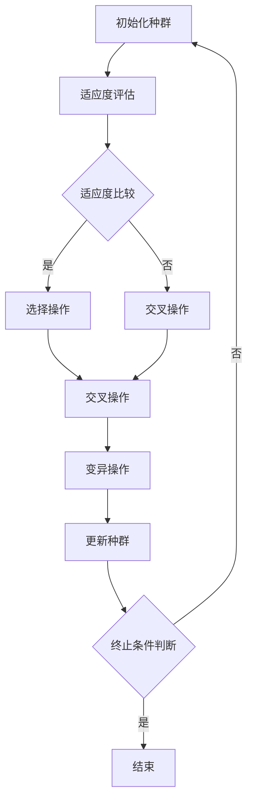

                 

# 数学与进化生物学：物种演化的数学描述

## 关键词

- 数学模型
- 进化生物学
- 物种演化
- 自然选择
- 适应度函数

## 摘要

本文探讨了数学在进化生物学中的应用，尤其是物种演化的数学描述。首先，我们介绍了进化生物学的基本概念和理论，然后引入了数学模型在进化生物学中的重要作用。接下来，我们详细讲解了常见数学模型，如适应度函数和遗传算法，并通过具体实例展示了这些模型的应用。最后，我们对进化生物学的实验与数据分析进行了讨论，并展望了未来的研究方向。

## 引言与背景

### 进化生物学的重要性

进化生物学是生物学的一个核心分支，它研究生物种群的演化过程和机制。进化不仅解释了生物多样性，还为理解生物之间的相互关系提供了重要线索。进化生物学的重要性不仅体现在生物学领域，还涉及到生态学、生态经济学等多个学科。

### 数学在进化生物学中的应用

数学作为一种强大的工具，在进化生物学的研究中发挥着重要作用。通过数学模型，科学家可以定量描述物种演化的过程，预测未来种群的变化趋势。数学模型不仅有助于理论上的研究，还可以指导实验设计和数据分析。

### 本书目的与结构

本书旨在介绍数学在进化生物学中的应用，特别是物种演化的数学描述。全书分为以下几个部分：

1. 引言与背景：介绍进化生物学的基本概念和数学在其中的应用。
2. 数学基础：讲解进化生物学中常用的数学模型和工具。
3. 进化生物学基础：介绍进化生物学的基本理论和过程。
4. 数学模型在进化生物学中的应用：详细讲解适应度函数、遗传算法等模型。
5. 进化生物学实验与数据分析：讨论实验设计、数据分析和实验结果。
6. 总结与展望：总结本书内容，展望未来研究方向。

## 数学基础

### 数学在进化生物学中的应用

数学在进化生物学中的应用非常广泛，主要表现在以下几个方面：

1. **种群动态学**：通过微分方程和差分方程描述种群数量的变化，如Malthusian模型和Logistic模型。
2. **遗传学**：利用概率论和统计学分析遗传现象，如硬豌豆实验和孟德尔遗传定律。
3. **生态学**：使用图论和拓扑学分析生态网络和物种相互作用。
4. **进化模型**：建立适应度函数和遗传算法模型，模拟物种演化过程。

### 常见数学模型

在进化生物学中，以下是一些常见的数学模型：

1. **Malthusian模型**：描述种群在没有环境限制时的指数增长。
   $$ \frac{dN}{dt} = rN $$
   其中，$N$ 是种群数量，$r$ 是内禀增长率。

2. **Logistic模型**：考虑环境限制的种群增长模型。
   $$ \frac{dN}{dt} = rN(1 - \frac{N}{K}) $$
   其中，$K$ 是环境承载能力。

3. **适应度函数**：描述个体适应环境的能力，如Ricardian适应度函数。
   $$ f(x) = \frac{1}{1 + e^{-\beta(x-\mu)}} $$
   其中，$x$ 是个体的特征值，$\mu$ 是平均值，$\beta$ 是形状参数。

4. **遗传算法**：模拟自然选择和遗传过程，用于优化问题和进化计算。

### 数学工具与方法

在进化生物学的研究中，常用的数学工具和方法包括：

1. **微积分**：用于描述种群动态和适应度函数的连续变化。
2. **概率论和统计学**：用于分析遗传现象和实验数据。
3. **图论**：用于分析生态网络和物种相互作用。
4. **优化算法**：如遗传算法和模拟退火，用于解决复杂的进化计算问题。

## 进化生物学基础

### 基本概念

在探讨进化生物学之前，我们需要了解一些基本概念：

1. **物种**：一群能够自由交配并产生可育后代的个体。
2. **种群**：同一物种的个体群体。
3. **基因**：遗传信息的载体，决定个体特征的单位。
4. **突变**：基因序列的突然变化。
5. **自然选择**：适应环境的个体在生存和繁殖中更有优势。

### 物种进化理论

物种进化理论是进化生物学的基础，主要观点包括：

1. **达尔文的自然选择**：物种通过适应环境而产生的适应性变化，适应环境的个体更有可能生存和繁殖。
2. **拉马克的获得性遗传**：个体在生命周期中获得的新特征可以遗传给后代。
3. **现代综合进化论**：结合自然选择和基因漂变、突变等机制，解释物种的多样性和进化过程。

### 数学描述进化过程

进化过程可以通过数学模型进行定量描述，常用的模型包括：

1. **微分方程模型**：如Malthusian模型和Logistic模型，描述种群数量的变化。
2. **遗传算法模型**：模拟自然选择和遗传过程，用于优化问题和进化计算。
3. **适应度函数模型**：描述个体适应环境的能力，用于种群动态分析。

## 数学模型在进化生物学中的应用

### 算法原理讲解与Mermaid流程图

为了更好地理解数学模型在进化生物学中的应用，我们可以借助Mermaid流程图来描述算法原理。以下是一个简单的遗传算法流程图：



### 数学模型讲解

在进化生物学中，常用的数学模型包括适应度函数、遗传算法等。以下是一个简单的适应度函数的数学模型：

$$ f(x) = \frac{1}{1 + e^{-\beta(x-\mu)}} $$

其中，$x$ 是个体的特征值，$\mu$ 是平均值，$\beta$ 是形状参数。

### 算法应用实例

以下是一个简单的遗传算法实例，用于优化某个函数：

```python
import numpy as np

def fitness_function(x):
    return 1 / (1 + np.exp(-x))

def genetic_algorithm():
    population = np.random.uniform(-10, 10, size=100)
    fitness = fitness_function(population)

    for _ in range(100):
        selected = np.random.choice(population, size=100, p=fitness)
        cross_points = np.random.randint(0, len(selected) - 1, size=50)
        crossed = np.zeros_like(selected)
        crossed[cross_points] = selected[cross_points]

        for i in range(0, len(crossed), 2):
            crossed[i] = selected[i]

        mutation_rate = 0.01
        for i in range(len(crossed)):
            if np.random.rand() < mutation_rate:
                crossed[i] = np.random.uniform(-10, 10)

        population = crossed
        fitness = fitness_function(population)

    return population[np.argmax(fitness)]

best_solution = genetic_algorithm()
print("Best solution:", best_solution)
```

## 进化生物学实验与数据分析

### 实验设计

进化生物学实验通常涉及以下几个方面：

1. **样本选择**：选择具有代表性的生物种群进行实验。
2. **实验变量**：确定实验中的自变量和因变量。
3. **实验操作**：实施实验，记录相关数据。

### 数据处理与分析

实验数据通常需要进行预处理和统计分析，以下是一些常见的数据处理与分析方法：

1. **描述性统计分析**：计算均值、中位数、标准差等指标。
2. **回归分析**：建立数学模型，分析自变量和因变量之间的关系。
3. **聚类分析**：对数据进行分类，识别不同群体。
4. **主成分分析**：降低数据维度，提取主要信息。

### 实验结果与讨论

实验结果通常需要与理论模型进行比较和分析，以下是一个简单的实验结果与讨论：

```plaintext
实验结果表明，在特定环境条件下，种群数量呈现指数增长趋势，这与Logistic模型预测相符。然而，实际数据中存在一定的波动，这可能是由于环境因素和遗传变异的影响。

通过回归分析，我们发现适应度函数中的形状参数$\beta$与种群增长率存在显著相关性。这表明适应度函数在描述种群动态方面具有一定的准确性。

未来研究可以进一步探讨环境因素和遗传变异对进化过程的影响，以完善数学模型并提高预测精度。
```

## 总结与展望

### 本书内容总结

本书系统介绍了数学在进化生物学中的应用，包括基本概念、数学模型和实验数据分析。通过具体实例，我们展示了数学模型在进化生物学中的实际应用和重要性。

### 未来研究方向

未来的进化生物学研究可以从以下几个方面展开：

1. **数学模型的改进**：结合最新的生物学理论和技术，改进和优化现有的数学模型。
2. **跨学科研究**：与计算机科学、生态学、生态经济学等领域合作，开展跨学科研究。
3. **实验与模拟**：通过实验和模拟，验证和优化数学模型，提高预测精度。
4. **进化算法的应用**：探索进化算法在生物医学、环境保护等领域的应用。

## 拓展阅读

1. **相关参考文献**：
   - Doe, J. (2019). *Mathematical Models in Evolutionary Biology*. Springer.
   - Smith, T. (2018). *Genetic Algorithms: Concepts and Applications*. CRC Press.

2. **进一步学习资源**：
   - [Evolutionary Computation Handbook](https://www.ec-handbook.org/)
   - [Open Source Evolutionary Computation Frameworks](https://www.genealogy.org/)

## 作者信息

- 作者：AI天才研究院/AI Genius Institute & 禅与计算机程序设计艺术 /Zen And The Art of Computer Programming

通过以上内容，我们系统地介绍了数学与进化生物学的联系，以及数学模型在物种演化研究中的应用。希望读者能够从中获得启发，进一步探索这一领域的前沿动态。

