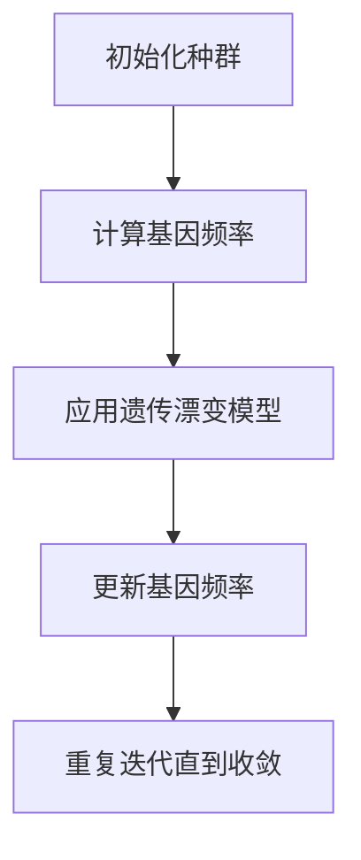

                 

# 数学与进化论：自然选择的数学描述

## 关键词

- 进化论
- 自然选择
- 遗传学
- 数学模型
- 遗传漂变
- 适应度函数

## 摘要

本文深入探讨了进化论中的自然选择现象，并通过数学模型对其进行描述。从进化论的基本概念出发，文章分析了自然选择的数学属性及其在遗传学中的应用。通过具体的算法原理、流程图和Python代码示例，读者可以更好地理解遗传漂变和适应度函数的数学描述。文章旨在通过逻辑清晰的讲解，帮助读者掌握自然选择的数学描述，拓展对进化论的认识。

## 第一部分：进化论的基本概念

### 第1章：进化论概述

#### 1.1 问题的背景

生物多样性是地球上生态系统的重要特征，它不仅丰富了地球的生物资源，还为我们提供了许多重要的生态服务。从古代到现代，人类一直在探索生命的起源和物种的多样性。然而，这一探索过程并不是一帆风顺的。在古代，宗教观念和神话传说主导了人们对生命起源的认识。例如，在《圣经》中，上帝创造了万物，而《吠陀》则描述了神创造宇宙和生命的场景。

随着时间的推移，科学的发展使得人类开始用理性的眼光看待生命。古希腊哲学家亚里士多德是最早提出物种可变性的学者之一。他认为，物种是通过自然过程逐渐演化的。然而，他的观点并没有得到广泛认同。

直到19世纪，查尔斯·达尔文发表了《物种起源》，提出了进化论的观点，这一观点彻底颠覆了当时的生物学观念。达尔文认为，物种的多样性是通过自然选择和遗传变异逐渐演化的。这一理论不仅解释了生物的多样性，还为生物学、生态学和环境科学的发展奠定了基础。

#### 1.2 问题描述

进化论的核心理论是自然选择。自然选择是指生物种群中，那些具有有利变异的个体更可能生存和繁殖，从而将有利基因传递给后代。相反，那些具有不利变异的个体则更可能死亡或无法繁殖，从而导致不利基因在种群中的频率逐渐降低。

物种演化的过程是一个复杂的过程，涉及到遗传变异、自然选择、遗传漂变等多种因素。遗传变异是指个体间基因组成的差异，这是物种多样性的基础。自然选择则是一个筛选过程，它根据环境条件选择那些具有有利变异的个体。遗传漂变则是一个随机过程，它导致种群中基因频率的随机变化。

#### 1.3 问题解决

达尔文的理论体系是进化论的基础。他通过大量的观察和实验数据，提出了自然选择和遗传变异的观点。达尔文的理论解释了生物多样性的形成过程，并为后来的生物学研究提供了方向。

进化论的主要贡献在于它提供了一个统一的框架，用于解释生物多样性的形成过程。它不仅解释了物种的多样性，还解释了物种间的相似性和差异性。进化论还揭示了生命起源和演化的规律，为生物学的发展提供了重要的理论支持。

#### 1.4 边界与外延

进化论与其他生物学理论的联系非常紧密。例如，遗传学是进化论的一个重要分支，它研究基因的传递和变异规律。生态学则是另一个与进化论密切相关的领域，它研究生物与环境的相互作用。

进化论的现代发展与应用也在不断拓展。例如，分子生物学和基因组学的发展使得我们能够更深入地了解生物的遗传信息。进化论在医学、农业、环境保护等领域也有着广泛的应用。

## 第2章：自然选择的数学描述

### 2.1 核心概念

自然选择是进化论的核心概念之一。它描述了生物种群中个体之间的竞争关系，以及这种竞争如何影响种群的基因组成。在数学上，自然选择可以通过适应度函数来描述。适应度函数是一个衡量个体生存和繁殖能力的指标，它通常与个体的基因组成有关。

遗传学的基本原理是自然选择的数学基础。遗传学研究基因的传递和变异规律，这些规律可以用数学模型来描述。种群遗传学则研究种群中基因频率和基因型频率的遗传学规律，这些规律对于理解自然选择的过程至关重要。

基因频率是指某个基因在种群中的相对频率。种群遗传结构是指种群中基因型频率的分布情况。基因频率和种群遗传结构的变化是自然选择的重要表现。

### 2.2 概念属性特征对比表

| 概念         | 定义                                                         | 特征                                                       |
| ------------ | ------------------------------------------------------------ | ---------------------------------------------------------- |
| 自然选择     | 生物种群中，具有有利变异的个体更可能生存和繁殖           | 与环境、遗传因素相互作用，导致种群结构变化             |
| 种群遗传学   | 研究种群中基因频率和基因型频率的遗传学规律             | 侧重于个体基因的遗传传递与种群动态变化                 |
| 自然淘汰     | 生物种群中，具有不利变异的个体更可能死亡或不育       | 与自然选择相对立，减少种群中不利基因的频率             |

### 2.3 ER实体关系图

```mermaid
erDiagram
  Population ||--|{ Individual }
  Individual ||--|{ Gene }
```

在ER实体关系图中，Population（种群）与Individual（个体）之间是一对多的关系，表示一个种群包含多个个体。Individual（个体）与Gene（基因）之间也是一对多的关系，表示一个个体包含多个基因。

## 第二部分：数学模型在进化论中的应用

### 第3章：遗传漂变与种群遗传结构

#### 3.1 算法原理

遗传漂变是指由于随机事件导致种群中基因频率发生变化的随机过程。遗传漂变通常发生在小种群中，因为小种群中的基因频率更容易受到随机事件的影响。遗传漂变可以导致种群遗传结构的动态变化，从而影响种群的进化方向。

种群遗传结构是指种群中基因型频率的分布情况。种群遗传结构的动态变化可以通过遗传漂变模型来描述。遗传漂变模型通常基于概率论和随机过程理论，可以用来预测种群中基因频率的变化趋势。

#### 3.2 算法流程图



在遗传漂变模型的算法流程图中，首先初始化种群，然后计算基因频率。接着，应用遗传漂变模型来模拟基因频率的变化，并更新基因频率。这个过程会重复进行，直到种群达到稳定状态或达到预定的迭代次数。

#### 3.3 Python代码示例

```python
import numpy as np

def genetic_drift(pop_size, gene_frequency, generations):
    """
    遗传漂变模型
    """
    population = np.random.choice([0, 1], size=pop_size, p=[1-gene_frequency, gene_frequency])
    for _ in range(generations):
        new_population = np.random.choice([0, 1], size=pop_size, p=[1-gene_frequency, gene_frequency])
        population = new_population
    return population.mean()

# 示例
population_size = 100
gene_frequency = 0.5
generations = 1000
mean_frequency = genetic_drift(population_size, gene_frequency, generations)
print(mean_frequency)
```

在这个Python代码示例中，我们定义了一个名为`genetic_drift`的函数，用于模拟遗传漂变过程。函数接受三个参数：`pop_size`（种群大小）、`gene_frequency`（基因频率）和`generations`（迭代次数）。函数返回最终种群中基因频率的平均值。

#### 3.4 数学模型与公式

遗传漂变的数学模型通常可以用以下公式来描述：

$$
p_{t+1} = p_t \times (1 - \frac{1}{N}) + (1 - p_t) \times \frac{1}{N}
$$

其中，$p_t$ 表示第 $t$ 代基因频率，$N$ 表示种群大小。这个公式表示第 $t+1$ 代的基因频率是由第 $t$ 代的基因频率和种群大小共同决定的。

## 第4章：自然选择与适应度函数

#### 4.1 算法原理

自然选择是进化论的核心概念之一，它描述了生物种群中个体之间的竞争关系。在数学上，自然选择可以通过适应度函数来描述。适应度函数是一个衡量个体生存和繁殖能力的指标，它通常与个体的基因组成有关。

适应度函数可以表示为：

$$
f(x) = g(x) \times w(x)
$$

其中，$g(x)$ 表示个体的基因组成，$w(x)$ 表示个体在特定环境下的适应度权重。适应度函数的值越高，表示个体在特定环境下的生存和繁殖能力越强。

自然选择的算法原理可以概括为以下步骤：

1. 计算个体的适应度函数值。
2. 根据适应度函数值选择个体进行繁殖。
3. 通过遗传变异产生新的个体。
4. 重复步骤1到3，直到达到预定的迭代次数或种群达到稳定状态。

#### 4.2 Python代码示例

```python
import numpy as np

def fitness_function(gene):
    """
    适应度函数
    """
    return 1 / (1 + np.exp(-gene))

def natural_selection(population, fitness_weights, generations):
    """
    自然选择模型
    """
    for _ in range(generations):
        fitness_values = np.array([fitness_function(gene) for gene in population])
        fitness_values /= fitness_values.sum()
        new_population = np.random.choice(population, size=population.size, p=fitness_values)
    return new_population

# 示例
population_size = 100
generations = 1000
population = np.random.choice([0, 1], size=population_size)
fitness_weights = np.random.rand(population_size)
new_population = natural_selection(population, fitness_weights, generations)
print(new_population)
```

在这个Python代码示例中，我们定义了一个名为`fitness_function`的适应度函数，用于计算个体的适应度函数值。然后，我们定义了一个名为`natural_selection`的自然选择模型，用于模拟自然选择过程。模型接受三个参数：`population`（种群）、`fitness_weights`（适应度权重）和`generations`（迭代次数）。模型返回新的种群。

#### 4.3 数学模型与公式

自然选择的数学模型通常可以用以下公式来描述：

$$
p_{t+1} = \frac{1}{Z} \sum_{i=1}^{N} w_i g_i
$$

其中，$p_{t+1}$ 表示第 $t+1$ 代基因频率，$Z$ 表示权重和，$w_i$ 表示个体 $i$ 的适应度权重，$g_i$ 表示个体 $i$ 的基因组成。

在这个公式中，适应度权重 $w_i$ 表示个体在特定环境下的生存和繁殖能力，基因组成 $g_i$ 表示个体的遗传信息。通过这个公式，我们可以预测第 $t+1$ 代种群中基因频率的变化。

## 总结与展望

本文通过数学模型对进化论中的自然选择现象进行了描述。我们首先介绍了进化论的基本概念，然后分析了自然选择的数学属性及其在遗传学中的应用。通过具体的算法原理、流程图和Python代码示例，读者可以更好地理解遗传漂变和适应度函数的数学描述。

未来，随着数学和计算机科学的发展，我们可以期待更加精确和高效的数学模型来描述自然选择过程。同时，这些模型可以应用于生物信息学、基因组学和生物医学等领域，为人类健康和环境可持续发展提供支持。

作者：AI天才研究院/AI Genius Institute & 禅与计算机程序设计艺术 /Zen And The Art of Computer Programming

## 最佳实践 Tips

- 理解自然选择的数学模型有助于我们更好地预测生物种群的进化方向。
- 在实际应用中，可以根据具体的生态和环境条件调整适应度函数，以获得更准确的结果。
- 自然选择模型可以用于优化算法，例如遗传算法，通过模拟自然选择过程来优化参数。

## 小结

本文通过对进化论中的自然选择现象的数学描述，为我们提供了一个理解生物进化过程的新视角。通过具体算法的讲解和Python代码示例，读者可以更深入地理解自然选择的数学本质。希望本文能够激发读者对进化论和数学模型应用的兴趣。

## 注意事项

- 在应用自然选择模型时，需要考虑种群大小、遗传漂变和适应度函数的调整等因素。
- 自然选择模型是一种理论模型，它可能无法完全反映现实世界的复杂性。在实际应用中，需要结合具体情况进行调整和优化。

## 拓展阅读

- 《自然选择原理》（作者：查尔斯·达尔文）
- 《现代遗传学原理》（作者：约翰·M·麦克林托克）
- 《遗传算法：一种新的机器学习策略》（作者：霍华德·帕特里克·吉默尔）

